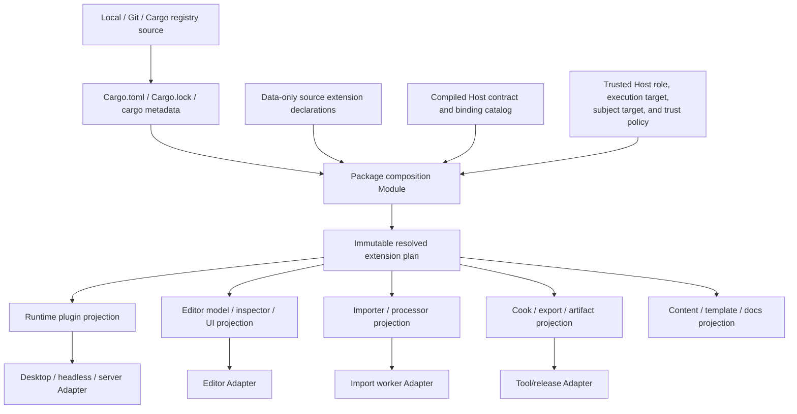
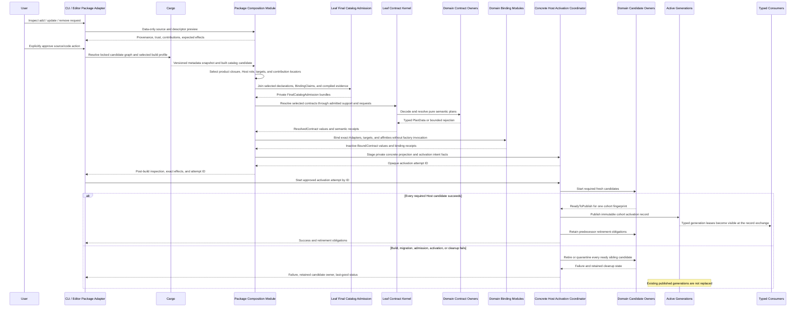

# Source Extension Package Interface Design

**Status**: Design Draft
**Created**: 2026-07-13
**Last Updated**: 2026-07-14
**Owner**: Source extension packages, contribution catalogs, product/build hosts, and domain owners
**Authority**: Non-normative design harness. Accepted ADRs remain authoritative on conflict.
**Related Question**: [OQ-031: Source Extension Package and Trust Topology](open-questions.md#oq-031-source-extension-package-and-trust-topology)
**Validation Harness**: [Multi-Role Extension Package Tracer Interface Design](multi-role-extension-package-tracer-design.md)
**Focused Interfaces**: [Extension Contract Kernel Interface Design](extension-contract-kernel-interface-design.md), [Asset Import Host Interface Design](asset-import-host-interface-design.md)
**Concept Guide**: [Extension Package Concept Guide](extension-package-concept-guide.md)
**Related Decisions**: [ADR 0016](adr/0016-extension-seams-for-backends-and-domain-modules.md),
[ADR 0020](adr/0020-project-layout-and-package-format.md),
[ADR 0046](adr/0046-plugin-metadata-and-default-plugin-groups.md),
[ADR 0079](adr/0079-root-product-capabilities-and-placeholder-domain-retirement.md),
[ADR 0081](adr/0081-schema-source-stable-identity-catalog-and-runtime-binding.md),
[ADR 0086](adr/0086-rust-project-build-and-executable-generation.md),
[ADR 0088](adr/0088-target-build-cook-package-and-runtime-content-catalog.md), and
[ADR 0093](adr/0093-rust-authoring-hot-iteration-and-optional-scripting-adapters.md)
**Runtime Consumer**: [Runtime Composition Interface Design](runtime-composition-interface-design.md)
**Research Basis**: [Extension Ecosystem Research](../knowledge/engineering/extension-ecosystem-engine-research.md)

## Purpose

This document is a scenario-driven workbench for Nara's future source extension package Interface.
It asks how one installed third-party package can coherently contribute runtime behavior, editor
tools, schema, importers, inspectors, cook/export providers, build-tool orchestration, content,
documentation, and migrations without turning `Plugin` into a universal callback or inventing a
second Rust package manager.

It is deliberately not an Accepted ADR and does not open OQ-031 early:

- the high-cost ownership and identity boundaries can be designed now;
- exact manifest syntax, registry protocols, editor UI contracts, and binary extension technology
  still require concrete packages and hosts;
- type names and code sketches below are illustrative, not compatibility commitments;
- conclusions become normative only when the owning ADR is accepted with implementation evidence.

The design extends, rather than replaces, runtime composition. A runtime contribution lowers into
the resolved plugin plan defined by the runtime design. Editor, import, build, and content
contributions lower into plans owned by their own Modules.

## How To Use This Design Harness

For every proposed package or contribution Interface:

1. Name the package scenario IDs it serves.
2. State which Host role consumes it, where its code executes, and which product target it affects.
3. Compare the closest Bevy, Godot, Unity, and Unreal concepts and state where the analogy ends.
4. List everything the caller must know: declaration, ordering, compatibility, trust, errors,
   rebuild effects, and cleanup.
5. Keep discovery and resolution data-only. Identify the later seam where executable code gains
   authority.
6. Test through the same Interface used by package authors, project authors, CLI, and editor.
7. Reject a new universal trait, context object, or Adapter until named scenarios prove it.

Use this compact review record:

```text
Candidate:
Scenarios served:
Closest mature-engine concepts:
Caller must know:
Module hides:
Host / target / authority:
Compatibility and trust:
Ordering and errors:
Iteration effect:
Observable test oracle:
Depth / Locality / Seam verdict:
```

## Concept Crosswalk

The terms below are architectural roles, not attempts to rename another engine's object model.
Each comparison names the closest mature concept and the deliberate Nara difference.

| Nara concept | Bevy comparison | Godot comparison | Unity comparison | Unreal comparison | Deliberate Nara difference |
|---|---|---|---|---|---|
| Source extension package | Usually a Cargo crate plus community catalog entry | Addon under `res://addons` with `plugin.cfg`; native code may also use GDExtension | UPM package with `package.json` | Plugin described by `.uplugin` | Cargo remains the Rust graph authority; the Nara descriptor adds contribution and product facts without resolving another Rust graph |
| Contribution | A crate may expose `Plugin`, `AssetLoader`, reflection type data, or other registrations | `EditorPlugin` registers importer, inspector, export, gizmo, and other child extensions | One package may contain Runtime/Editor assemblies, `ScriptedImporter`, `CustomEditor`, and build callbacks | One plugin may contain Runtime, Editor, Developer, and Program modules | One package contains zero or more role-specific declarations; they do not share a universal executable trait |
| Contribution contract | Rust trait plus schedule/registry expectations | Engine class contract such as `EditorImportPlugin` or `EditorInspectorPlugin` | Base type, interface, attribute, and assembly constraints | Module type plus engine interface such as `IAssetTools` or Interchange providers | A stable versioned contract ID has one owning domain Module and a typed Rust plan; unknown contracts never self-authorize |
| Typed plan | `PluginGroupBuilder` holds ordered entries before `finish` mutates `App` | Plugin enablement and registries exist, but not as one pure typed package plan | Package/assembly resolution determines what compiles into Editor or Player | Descriptor and target rules determine which modules build and load | Nara makes pure, deterministic, zero-authority planning an explicit product contract before any Host mutation |
| Adapter | Concrete `Plugin`, `AssetLoader`, runner, or backend implementation | Concrete `EditorPlugin`, importer, inspector, or GDExtension implementation | Concrete importer/editor/build class loaded by the relevant process | Concrete module or provider loaded by Editor, Game, Program, or commandlet | Adapter means the implementation at one real seam; it receives only domain-specific authority, never a universal `EngineContext` |
| Host role | Primarily the application and runner selected by code | Editor, running project, export tooling, and GDExtension initialization levels | Editor, Player, import worker, and build pipeline | Editor, Game, Program, server, commandlet, and build tool | Role selection is inspectable package data; actual process and native authority remain owned by concrete Host Adapters |
| Execution and subject target | Usually the Cargo target that runs the `App` | Editor/export tools run on the Host while exports target another platform | Editor/import/build code runs on the Host; Player assemblies target the product platform | UBT/commandlets run on the Host while modules/content target selected platforms | Nara records execution target and subject/product target independently; `target-independent` is explicit rather than inferred |
| Compiled binding | Application code constructs and adds Rust plugins/loaders | Script/native entry points register classes and editor extensions | Managed assemblies are discovered through engine metadata/reflection | Module startup and UHT-generated registration bind code | Nara initially uses static Rust bindings checked against both the data declaration and verified executable/provider implementation fingerprints; it does not claim reflection discovery or a Rust dylib ABI |
| Active generation | An `App` is built and run; dynamic linking is a development optimization | Editor can enable addons and may require restart for native levels | Assembly/domain reload and Player process boundaries | Module reload, Live Coding, editor restart, or new executable | Structural native changes build a fresh executable/Host/runtime generation; active state survives only through declared document/checkpoint contracts |

The comparisons matter because they expose two independent lessons:

- Bevy has the closest Rust-native runtime authoring ergonomics, but a Cargo crate and `Plugin` do
  not provide a complete editor/package product boundary.
- Godot, Unity, and Unreal have the closest integrated package/editor workflows, but Nara cannot
  copy their script reflection, managed assembly loading, object model, or native module ABI.

## Vocabulary And Identity

| Term | Meaning | Must not be reused as |
|---|---|---|
| Cargo package release | Cargo name, version, source/checksum, targets, features, and dependency provenance in one resolved graph | Stable Nara contribution identity or runtime content package |
| Source extension package | Product-facing distribution unit anchored to resolved Cargo/content provenance and one data-only contribution declaration | Runtime `Plugin`, cooked package, active process, or security sandbox |
| Contribution | Stable declared capability supplied to one contract and Host role | Rust trait object, arbitrary callback, or implicit permission |
| Contribution contract | Versioned semantic Interface owned by one domain Module | Cargo semver, engine version, process protocol, or schema version |
| Execution target | Platform/triple where the contribution implementation runs | Host role, product target, or authority scope |
| Subject target | Product platform/profile whose runtime or artifacts the contribution affects | Execution platform or Cargo Host tools |
| Compiled binding | Static association from a declared contribution ID to a typed repeatable factory/provider | Declaration authority or stable native ABI |
| Package preview | Pure pre-build inspection result with evidence levels and explicit unknowns | Final binding compatibility, successful compilation, or Host admission |
| Resolved extension plan | Immutable pre-binding package selection plus concrete typed semantic contract results and fingerprint | Bound Host projection, active registry, running worker, mutable editor workspace, or global service locator |
| Concrete typed projection | Product-specific inactive `Bound*Plan` fields assembled only after every selected domain binding succeeds | Semantic plan, public erased plan bag, ready candidate, or active state |
| Runtime plugin | Trusted in-process Rust contribution that configures one `App` candidate | Package installer, editor extension, importer, or build hook |
| Runtime content package | Immutable cooked package and catalog artifact owned by ADR 0088 | Source extension package or Cargo package |
| Trust tier | Honest statement about executable placement and enforcement strength | A claim that all listed permissions sandbox native Rust |

Identity axes stay separate even when a simple package maps them one-to-one:

```text
Cargo package ID/source/version
    != SourcePackageId/release
    != ContributionId
    != ContributionContractId/version
    != PluginId or plugin slot ID
    != schema/component/field ID
    != executable/runtime/import/cook generation
    != ADR 0088 runtime content package digest
```

Display names, Rust type paths, crate aliases, file paths, and registry URLs are not durable
substitutes for these identities.

## Problem

Nara needs two properties that are easy to optimize independently and hard to combine:

1. A game-owned Rust module should remain as direct as a Bevy-style `Plugin` or even plain systems.
2. A reusable ecosystem package should feel as coherent as a Unity package, Unreal plugin, or
   Godot addon across editor, import, runtime, build, documentation, and lifecycle.

Making every extension a runtime `Plugin` appears simple but fails the second property:

- package discovery would require compiling or executing package code;
- editor/import/build capabilities would become hidden `App` side effects;
- editor-only dependencies could leak into release/server products;
- removal and compatibility preview would be impossible before runtime construction;
- one giant context would hide filesystem, process, editor, build, and `World` authority;
- `Plugin` would become a shallow Interface whose callers must understand every Host.

Treating Cargo alone as the complete product package model also fails. Cargo correctly owns Rust
dependency resolution, but does not encode Nara's contribution contract versions, stable IDs,
editor/runtime intent, import formats, inspector targets, build/cook roles, trust disclosures,
schema migrations, samples, or package UX.

The final pressure is Rust-specific. Native Rust ABI is not stable, Cargo build scripts and proc
macros are trusted executable code, compile latency affects iteration, and reflection is generated
infrastructure rather than a complete editor experience. The package model must state these facts
instead of hiding them behind `dynamic plugin`, `permission`, or `hot reload` labels.

## Goals

1. Keep game-owned `Plugin` and direct code-first authoring concise.
2. Let one source extension package declare multiple runtime/editor/import/schema/build/content
   contributions with one coherent install/update/remove preview.
3. Inspect declared identity, compatibility, provenance, license, Host roles, trust evidence, known
   iteration effects, and explicit unknowns before executing package code; verify compiled facts
   before executable Host mutation.
4. Keep Cargo metadata and the application lockfile authoritative for the Rust graph.
5. Resolve deterministic immutable Host projections before `App`, editor, importer, worker, or
   native authority mutation.
6. Let domain owners add typed contribution contracts without expanding one central enum, error
   type, or universal context.
7. Exclude editor/import/build-only code from shipping runtime and server dependency closures.
8. Preserve last-good executable/runtime/editor/import state across failed candidate activation,
   and prevent required projections from publishing as a mixed package-plan cohort, without
   claiming arbitrary filesystem or native rollback.
9. Make native trust, isolation, permissions, rebuild, reimport, restart, and migration effects
   visible in both CLI and editor.
10. Judge ecosystem maturity through clean-room package workflows, conformance suites, reference
    games, documentation, and measured edit-to-feedback time.

## Non-Goals

- A Nara registry, marketplace, monetization system, ratings model, or discovery ranking now.
- A second dependency solver or lockfile that competes with Cargo for Rust code.
- A stable Rust dylib ABI, universal `dyn Extension`, or cross-process Rust trait-object protocol.
- A universal `EngineHost`, `ExtensionContext::get<T>()`, service locator, or untyped event bus.
- Arbitrary install/update/uninstall scripts or shell-style pre/post build callbacks.
- A claim that native in-process packages are sandboxed by a permission manifest.
- Hot unloading or in-place replacement of arbitrary native packages.
- Final editor UI toolkit APIs, package manifest filename, macro syntax, or generated catalog format.
- One package technology that must represent trusted Rust, content-only data, Wasm, scripts, and
  platform store binaries identically.
- Arbitrary cross-engine compatibility between Nara packages and other engines.

## Working Decisions

These are the recommended high-cost boundaries. They remain non-normative until admitted by ADR.

1. A source extension package is not a runtime `Plugin`; it contains typed contributions and may
   contain zero runtime contributions.
2. Package discovery, descriptor migration, and preview are data-only and bounded before code
   execution. Final admission resolution is also pure, but occurs after compiled bindings and
   implementation evidence exist and before any executable Host mutation.
3. Cargo remains the only Rust dependency/version/source/lock authority. Nara consumes structured
   `cargo metadata` output and does not scrape manifests or re-resolve Rust versions.
4. Each contribution names a stable ID, contract ID/version, Host roles, execution-target and
   subject-target predicates, activation policy, requirements/conflicts, authority requests, and a
   typed descriptor.
5. Contribution contracts are open in representation but closed per compiled Host catalog. An
   unknown contract cannot activate merely because a package names it.
6. One domain Module owns each contract's typed declaration validation, resolution, plan, errors,
   ordering semantics, activation seam, and conformance suite.
7. A compiled Rust binding supplies executable factories only for declared contribution IDs. The
   manifest is declaration authority, and drift is rejected before Host mutation.
8. Package-wide resolution produces one immutable inspection snapshot plus typed domain plans. It
   does not expose a public untyped bag or generic execute operation.
9. A closed plan cannot gain hidden packages, plugins, importers, inspectors, or build providers
   during activation.
10. Native Rust packages are trusted author code. Authority requests control Nara-issued
    capabilities and disclose intent; they are not an OS sandbox claim.
11. No new install/uninstall script lifecycle is added. Migrations and project edits are explicit,
    typed, previewable transactions owned by the affected domain.
12. Structural package, feature, contribution, layout, or dependency changes build a fresh
    executable/Host/runtime generation. A Rust dynamic ABI is not inferred.
13. Missing package/schema providers enter degraded authoring under ADR 0090 when safe; source
    files never authorize automatic download, compilation, or execution.
14. Required Host projections selected by one concrete activation intent and plan fingerprint form
    an activation cohort: every selected required candidate reaches ready-but-unpublished before a
    Host-private cohort record publishes and exposes generation-consistent typed leases.
15. The direct `App::new().add_plugin(...)` path remains available with its narrower lifecycle
    guarantees and no package-manager ceremony.

## Module And Seam Placement



| Module | Owns | Must not own |
|---|---|---|
| Cargo Adapter | Structured metadata invocation/ingest, selected package/feature/execution-target/subject-target facts, lock provenance | A second resolver, Nara contribution semantics, active Host state |
| package composition | Bounded descriptors, stable identities, common graph closure, Host-role/execution-target/subject-target filtering, trust decisions, fingerprints, typed projection and cohort coordination | `App`, `World`, editor workspace mutation, compiler process, filesystem capability, native session |
| contract owner | Typed descriptor schema, domain closure/order, plan, diagnostics, conformance suite | Package acquisition, unrelated contracts, universal Host context |
| compiled binding catalog | Declared ID to static typed factory/provider binding, declaration fingerprint, verified executable generation, and provider implementation digest | Dynamic library compatibility claim, package declaration authority |
| concrete Host Adapter | Process/platform authority, candidate construction, activation, drive, publication, finite cleanup evidence or a retained failed owner | Package resolution policy or another domain's lifecycle |
| Host-owned activation coordinator | Required-candidate readiness barrier, cohort activation-record publication, sibling retirement/quarantine, last-good pointer | Package/contract resolution, domain implementation, universal public Host trait |
| package UX Adapter | CLI/editor presentation, preview, explicit consent, generated source changes | Dependency solving, silent code execution, hidden permission widening |

The package composition Module has real Depth. Deleting it would spread Cargo provenance,
descriptor validation, Host-role/execution-target/subject-target filtering, trust disclosure,
dependency closure, drift checking, and
diagnostic explanation into every Host. By contrast, deleting a universal extension context would
remove indirection rather than redistribute useful behavior, so such a Module would be shallow.

## Contract Scenarios

Scenario IDs are stable references for future Interface reviews and conformance tests.

### Common Authoring And Package UX

| ID | Caller And Goal | Required Interface Behavior | Primary Oracle |
|---|---|---|---|
| PX-01 | Game author experiments with a local gameplay module | Direct systems or game-owned `Plugin` require no package descriptor | Minimal code-first compile/smoke |
| PX-02 | Project adds a runtime-only local/Git/registry package | One explicit package action/registration produces a preview and runtime projection without manual plugin order | Independent workspace install/boot |
| PX-03 | User inspects a package before building it | Identity, source, license, compatibility, contributions, execution/subject targets, claimed/observed native-build-proc-macro trust evidence, unknowns, and iteration effects are visible without executing package code | No-build inspection fixture |
| PX-04 | Package offers default and optional contributions | Defaults are explicit in the plan; advanced selection appears only when requested | Golden plan and generated docs |
| PX-05 | User updates a package | Preview reports Cargo diff, contract/schema changes, permission widening, rebuild/reimport/restart/migration effects | Candidate update fault matrix |
| PX-06 | User removes a referenced package | Stable references/settings are reported; unsafe removal blocks or enters explicit degraded authoring/migration | ADR 0090 document fixtures |
| PX-07 | Code-first project never opens the editor | Package registration, headless tests, build, and release work through public Rust/CLI paths | Clean-room no-editor pipeline |
| PX-08 | Third party publishes a package | One declaration authority generates inspectable metadata/docs and bindings pass public conformance suites | External package fixture |

### Typed Contribution Workflows

| ID | Caller And Goal | Required Interface Behavior | Closest Mature Concepts | Primary Oracle |
|---|---|---|---|---|
| PX-10 | Package provides runtime behavior | Runtime contribution lowers to repeatable `PluginRegistration` and the closed `ResolvedProductPlan` | Bevy `Plugin`; Unreal Runtime module | Runtime composition scenarios RC-12/RC-24 |
| PX-11 | Package provides ordinary editable schemas | Standard inspector derives from schema capabilities with no custom editor code | Bevy reflection; Unity serialized inspector; Unreal reflected properties | Schema/inspector golden fixture |
| PX-12 | Package customizes a foreign type's inspector | Registration targets stable schema IDs and emits normal workspace commands, avoiding Rust orphan-rule coupling | Godot `EditorInspectorPlugin`; Unity `CustomEditor`; Unreal details customization | Cross-package inspector/undo test |
| PX-13 | Package adds a UI-agnostic editor tool | Tool contributes models, commands, selection predicates, and state outside runtime `World` | Unity Editor assembly; Unreal Editor module | Same command test through CLI/AI/UI adapters |
| PX-14 | Package adds toolkit-specific editor UI | UI contribution is explicitly bound to one toolkit Adapter and cannot own document mutation | Godot dock/control plugin; Unity custom Editor window | Toolkit dependency and command-route audit |
| PX-15 | Package imports a new source format | Import contribution declares extensions/options/version and runs through tracked bounded `ImportContext` | Bevy `AssetLoader`; Godot `EditorImportPlugin`; Unity `ScriptedImporter`; Unreal Interchange | Import conformance and conflict tests |
| PX-16 | Package adds project settings | Namespaced schema/default/validation lowers through `nara_project`; package cannot create another persistent config authority | Unity package settings; Godot project/editor settings plugins | Manifest overlay/unknown-setting fixtures |
| PX-17 | Package pairs runtime intent with native service authority | Separate service Adapter and runtime contribution join one validated requirement graph; plugin build cannot acquire Host authority | Unreal module/provider split; Godot server/native extension levels | Service admission/cleanup test |
| PX-18 | Package adds cook/export/artifact behavior | A previously compiled tool-Host provider consumes immutable declared inputs and publishes staged outputs; it cannot affect the build that produced itself | Godot export plugin; Unity build callback; Unreal cook/commandlet modules | Determinism, stale job, bootstrap, and output audit |
| PX-19 | Package contains templates, samples, docs, or content only | Non-code contribution has provenance/license/install/remove policy and never needs an empty runtime plugin | Unity Samples/Documentation; Unreal content plugin; Godot addon content | Content-only install/remove fixture |

### Host, Target, Compatibility, And Trust

| ID | Situation | Required Result | Primary Oracle |
|---|---|---|---|
| PX-20 | Editor opens a package with runtime/import/inspector/UI contributions | One package set resolves separate typed Host projections from the same provenance snapshot | Projection fingerprint matrix |
| PX-21 | Dedicated server uses a package that also has editor/renderer code | Forbidden contributions and their dependencies are absent from the compiled and resolved server closure | Cargo tree and runtime resource audit |
| PX-22 | Host builds runtime for another target | Import/editor/build tools compile for the Host target; runtime contributions compile for the product target | Cross-target metadata fixture |
| PX-23 | Package names an unknown required contract | Stable pre-execution rejection identifies package, contribution, contract, Host, and supported versions | Old-Host/new-package compatibility test |
| PX-24 | Optional contract is unavailable | It is inactive only when a declared fallback preserves semantics; malformed/binding-drift entries never become optional success | Fallback matrix |
| PX-25 | Two importers/inspectors/providers claim an exclusive slot | Contract owner reports a deterministic conflict; registration order never decides | Permutation/property test |
| PX-26 | Manifest and compiled binding disagree | Reject before `App`, worker, editor session, filesystem grant, or native reservation exists | Binding drift fault injection |
| PX-27 | Package requests broader authority after update | Preview requires a new decision; denial keeps the last-good active generation and does not silently narrow required behavior | Grant-diff update test |
| PX-28 | Native package advertises narrow permissions | UI states that native/build/proc-macro code is trusted; grants constrain Nara-issued capabilities but are not called a sandbox | Trust presentation snapshot |
| PX-29 | Sandboxed or isolated Adapter exists later | Its protocol, budgets, cancellation, crash, and OS enforcement claims are explicit and contract-specific | In-process/process conformance pair |

### Iteration, Failure, And Recovery

| ID | Situation | Required Result | Primary Oracle |
|---|---|---|---|
| PX-30 | Asset/scene/data in a package changes | Domain reload occurs without package graph resolution or native code replacement | Reload generation test |
| PX-31 | Compatible function body changes | Optional proven patch may apply at a quiescent point; fallback is explicit rebuild/restart | ADR 0093 classification suite |
| PX-32 | Package dependency, feature, schema, layout, or contribution topology changes | New executable/Host/runtime candidate; no Rust ABI hot swap | Generation identity test |
| PX-33 | Importer implementation/options/version change | Affected artifact recipes invalidate and reimport; unrelated last-good products remain | Import dependency graph fixture |
| PX-34 | New package candidate fails build, migration, binding, or activation | No required member of its activation cohort publishes; ready siblings retire/quarantine, and source-edit state plus last-good activation are reported separately | Multi-stage fault matrix |
| PX-35 | Editor extension crashes in process | Next launch can enter recovery mode from a journal; no claim that abort-time cleanup ran | Crash/recovery integration test |
| PX-36 | Isolated import/cook worker crashes or times out | Its candidate/job faults; late results and staged outputs quarantine, and replacement waits for proven terminate/reap/lease retirement while the Host remains responsive | Worker containment/crash/timeout fixture |
| PX-37 | Package is missing on one workstation or branch | Editor preserves bounded unavailable records under ADR 0090; runtime remains strict | Degraded open/save/recovery test |

## Design-It-Twice Verdict

Three deliberately different Interface shapes were compared:

| Candidate | Optimizes For | Strength | Failure Mode If Used Alone |
|---|---|---|---|
| Minimal package composition | One to three top-level entry points | High Depth for project authors; one workflow resolves immutable semantics and seals concrete bound projections for Hosts | A fixed central contribution enum or one oversized plan owner can become the next bottleneck |
| Open contribution contract catalog | Third-party growth and new domains | High Locality; a new contract changes its owner and supporting Host, not package core | Raw contract IDs, descriptor envelopes, and internal type erasure would be hostile as the common author Interface |
| Ergonomic typed helpers | Fast gameplay/package authoring | Common runtime, inspector, and importer paths remain small and discoverable | Helpers alone do not supply package-wide provenance, deterministic closure, or Host publication guarantees |

The recommendation is a hybrid:

1. Keep the top-level Interface minimal: author package binding claims, resolve immutable semantic
   plans, bind them into concrete typed projections, then pass those projections to existing
   concrete Hosts.
2. Use an open, stable contract-ID envelope inside the package composition implementation so new
   domains do not expand a central enum.
3. Expose typed domain helpers for normal authors. Descriptor envelopes, internal type erasure,
   graph algorithms, and trust-policy machinery remain behind the seam.
4. Never expose one generic `activate`, `get<T>`, or `&mut EngineHost` operation.

This hybrid has the best Depth: one package action yields multiple Host-specific behaviors, while
each behavior remains local to its domain Module and ordinary gameplay code avoids package
ceremony.

## Recommended Interface Shape

### 1. Data-Only Source Extension Manifest

The closest mature concepts are Unity's `package.json`, Unreal's `.uplugin`, and Godot's
`plugin.cfg`. Unlike Unity's package manifest, the Nara declaration must not repeat a Rust
dependency/version graph because Cargo already owns it.

```rust
pub struct SourceExtensionManifest {
    pub format_version: ManifestFormatVersion,
    pub package_id: SourcePackageId,
    pub release: SourcePackageRelease,
    pub cargo_anchor: CargoPackageAnchor,
    pub compatibility: PackageCompatibility,
    pub trust: PackageTrustDisclosure,
    pub contributions: Vec<ContributionDeclaration>,
    pub presentation: PackagePresentation,
}

pub struct ContributionDeclaration {
    pub id: ContributionId,
    pub contract: ContributionContractRef,
    pub hosts: HostRolePredicate,
    pub execution_targets: ExecutionTargetPredicate,
    pub subject_targets: SubjectTargetPredicate,
    pub activation: ActivationRequirement,
    pub requires: Vec<ContributionRequirement>,
    pub conflicts: Vec<ContributionConflict>,
    pub authority: Vec<AuthorityRequest>,
    pub descriptor: DescriptorEnvelope,
}
```

The exact fields and names remain illustrative. The invariants are more important:

- the manifest is inspectable without loading package code;
- the Cargo anchor binds the declaration to resolved Cargo provenance but does not re-resolve it;
- package release and Cargo provenance axes are both recorded and checked rather than conflated;
- contribution IDs are stable within the package and never silently reused;
- contract, Host role, execution target, subject/product target, activation, requirement, conflict,
  and authority facts are explicit;
- runtime contributions commonly require equal execution and subject targets; import/cook/build
  tools commonly do not. Each predicate can explicitly say target-independent, and omission never
  implies it;
- the contract owner parses the bounded versioned descriptor payload;
- docs, samples, license, notices, repository, and support metadata are presentation/provenance,
  never executable authority;
- all persistent descriptor shapes follow ADRs 0049 and 0051 before becoming version 1.

There must be one declaration authority. Published discovery metadata, generated Rust helpers, and
the compiled binding catalog are projections bound to its canonical fingerprint, not independent
unchecked copies.

The physical source remains deliberately open until a reference package proves it. Viable
representations include `[package.metadata.nara]`, a package-local sidecar referenced by Cargo
metadata, or generated code bound to a data-only source. None may introduce Rust dependency
constraints outside Cargo.

### 2. Open Contract Envelope, Typed Domain Plan

This concept is closest to the way Unity and Godot expose many specialized editor/importer base
types and Unreal exposes several module/provider interfaces. It differs by keeping common package
coordination generic while every executable plan remains strongly typed and domain-owned.

The focused
[Extension Contract Kernel Interface Design](extension-contract-kernel-interface-design.md)
supersedes the earlier domain-rich trait sketch. Its leaf marker owns type relationships only:

```rust
pub trait ContributionContract: Sized + 'static {
    const CONTRACT: ContributionContractRef;

    type Declaration: 'static;
    type Binding: 'static;
    type DecodeError: 'static;
}
```

Root-verified `ContractSupport<C, PlanData, ResolveError>` owns exact decoders and one
non-capturing pure resolver function. That resolver receives decoded declarations plus semantic
binding-presence witnesses, never callable factories/providers. A separate verified concrete Host
binder later consumes the opaque inactive transfer and produces a typed bound plan plus binding
receipt.

The exact trait is not frozen. Its required shape is:

- one stable contract ID and independently versioned declaration schema;
- pure resolution from immutable facts and semantic binding-presence witnesses;
- one typed immutable semantic plan owned by the domain, followed by a separately typed inactive
  Host bound plan;
- domain-specific cardinality, slot, ordering, conflict, error, and fallback semantics;
- a public conformance suite shared by every supported Adapter;
- no `App`, `World`, workspace, filesystem capability, compiler process, thread, clock, native
  handle, or generic service lookup during resolution.

The common package Module understands only the bounded envelope and cross-package facts. It does
not match every importer, inspector, or cook-provider variant in a central enum. A supporting Host
catalog explicitly registers the contract Adapter it compiled. Required unknown contracts reject;
optional unknown contracts become inactive only when the declaration names a semantically valid
fallback. For an unknown contract, that fallback must use the leaf/root-owned common envelope and
target an already supported contract/contribution or another engine-owned fallback kind; the Host
cannot validate fallback semantics hidden inside an unknown descriptor payload.

Internal implementation may use limited private erasure to route bounded envelopes, binding claims
and receipts, or inspection/audit facts inside one executable. Semantic `PlanData` and Host
`BoundPlan` remain in concrete typed root/Host projections; they never enter a generic erased plan
store. `Any`, downcast-by-string, and generic `get<T>()` do not enter persistent formats, public
authoring Interfaces, diagnostics identities, or wire protocols.

An open contract ID is not automatic support. A third-party package cannot gain editor, build,
filesystem, or process authority merely by inventing a string. The supporting Adapter must already
be part of the trusted compiled Host catalog.

### 3. Static Compiled Bindings

The closest Bevy concept is application code constructing a plugin or loader. Unity normally uses
managed assembly discovery, Godot uses script/GDExtension entry points, and Unreal uses module/UHT
registration. Nara's initial Rust path instead makes static binding explicit and verifies drift.

```rust
pub fn package() -> Result<PackageDraft, PackageAuthorReport> {
    package::bind(
        generated::PACKAGE,
        (
            nara::app::package::plugins(
                generated::RUNTIME_MAIN,
                definitions::runtime_plugins,
            ),
            nara::asset::package::threaded_importer(
                generated::IMPORT_DIALOGUE,
                DialogueImporter::new,
            ),
        ),
    )
}
```

The names and tuple carrier are illustrative. Each domain helper returns a typed
`BindingClaim<C>` from a generated declaration locator plus a repeatable compiled definition. The
locator is not a verified key, and the package draft exposes no provider lookup or invocation
operation. Final catalog admission performs the declaration/evidence join privately.

The binding Interface must guarantee:

- a binding names an already declared `(SourcePackageId, ContributionId, contract)` tuple;
- executable contributions have exactly the required typed factory/provider binding;
- undeclared hidden bindings and declared-but-unbound required contributions reject;
- the manifest, compiled catalog, and factory declaration fingerprints agree;
- the binding records the verified `ExecutableGeneration` or tooling artifact digest and a
  provider implementation/tool digest; stable IDs and declared versions never substitute for code
  identity;
- every factory is repeatable and returns fresh definition state for one candidate;
- factory construction receives no ambient Host authority and performs no hidden initialization;
- native package changes use a new ADR 0086 executable generation, not a cross-dylib trait object.

Cargo does not automatically link an otherwise unused dependency into a Nara catalog. The first
implementation may require one explicit `packages![foo::package()]` registration. A later build
coordinator may generate the same inspectable registry. Linker constructors or global inventory
magic are not part of the contract because they hide inclusion, ordering, target selection, and
provenance.

### 4. Pure Package Resolution Before Typed Projections

`ResolvedProjectPlan` is the closest Nara analogue to the useful parts of Bevy's pre-finish
`PluginGroupBuilder`, Unity's package/assembly selection, and Unreal's target-specific module
selection. It is intentionally stronger: it is an immutable, deterministic, inspectable
pre-binding semantic coordination result and creates no executable Host state. The concrete typed
Host projections are constructed only after separate domain-specific binding succeeds.

```rust
pub fn preview_project_extensions(
    input: PackagePreviewRequest,
) -> Result<PackagePreview, PackagePreviewError>;

pub fn resolve_project_extensions(
    input: ProjectExtensionRequest,
) -> Result<ResolvedProjectPlan, PackagePlanError>;
```

These are two pure phases separated by an explicitly trusted build:

```text
source/index facts -> data-only preview -> consent -> Cargo build
    -> compiled evidence -> final catalog admission -> data-only semantic resolution
    -> domain-specific binding -> concrete typed projections -> Host candidates
```

`PackagePreview` may contain `Unknown` facts and cannot promise that bindings or implementation
digests are valid. `ResolvedProjectPlan` requires the compiled evidence and is the final
pure semantic result before Host binding. Catalog admission has already proven that matching
compiled evidence exists, but executable values and provenance remain sealed in opaque inactive
transfers rather than entering semantic plans or receipts. Tooling must not describe this result as
available before build scripts or proc macros have executed.

Conceptually, the input captures:

- one structured locked Cargo graph snapshot and trusted build-profile selection;
- bounded package manifests and their canonical fingerprints;
- the compiled Host contract/binding catalog and compiled product ceiling;
- project-requested optional/default contributions;
- Host role, execution target, subject/product target, product profile, toolkit/protocol facts, and
  trust decisions;
- expected package/project/schema revisions.

The immutable result contains:

```text
ResolvedProjectPlan
|- package provenance, trust decisions, inactive entries, and semantic fingerprint
|- runtime: ResolvedContract<RuntimeContract, RuntimePlan>
|- schema: ResolvedContract<SchemaContract, SchemaPlan>
|- editor: typed ResolvedContract values for selected tooling contracts
|- import: ResolvedContract<ImportContract, ImportPlan>
|- service: typed ResolvedContract values for selected Host-service contracts
|- cook/export/artifact: typed ResolvedContract values for selected subject-target contracts
`- content/template/docs: typed source transaction plan
```

This tree is conceptual, not a promise that one public struct owns every typed value. The package
plan is the coordination and inspection authority. Each `ResolvedContract` retains its pure
semantic plan, `ContractResolutionReceipt`, and sealed inactive transfer, preserving the proof
chain into later binding. A verified domain binder consumes each sealed transfer into an inactive
`Bound*Plan`; only then does the root construct an
`EditorProjectProjection`, `ServerProjectProjection`, or another concrete typed projection. Each
domain plan remains owned and activated by its Module. Cross-process Hosts may exchange versioned
stable plan projections or fingerprints, not Rust trait objects.

The plan fingerprint binds at least:

- Cargo lock and selected package/source/feature/execution-target/subject-target facts;
- source extension manifest fingerprints;
- admitted contract, declaration, migration, and semantic plan schema versions;
- semantic binding-presence witnesses, without implementation or executable provenance;
- normalized Host-role, execution-target, subject-target, and product-capability facts;
- contribution selection, requirements, conflicts, order, and fallback decisions;
- trust disclosures and explicit authority decisions;
- relevant schema/settings/import/tool/cook/export contract versions.

Equal package IDs with different source, lock, manifest, semantic selection, execution target,
subject target, or policy facts are not the same semantic plan generation. A different compiled
Adapter or provider implementation may retain the same semantic fingerprint, but it must produce a
different binding receipt and concrete composition generation.

Importer and cook recipe keys consume the verified provider implementation/tool digest from the
binding receipt and active provider catalog as required by ADRs 0087 and 0088. A path dependency
source change therefore cannot reuse an old bound provider or recipe merely because its semantic
plan, Cargo version, declaration, and stable IDs did not change.

### 5. Domain-Owned Contribution Types

The following table introduces each Nara contract next to the closest established engine concepts.
The comparison is behavioral prior art, not an inheritance hierarchy.

| Nara contract | Closest established concepts | Typed plan and activation owner | Key Nara constraint |
|---|---|---|---|
| Runtime plugin | Bevy `Plugin`; Unreal Runtime module | `nara_app`/root composition lowers a repeatable factory into `ResolvedProductPlan` | Closed plan, fresh candidate, no hidden package or Host authority acquisition |
| Schema/type provider | Bevy type data; Godot ClassDB; Unity serialization metadata; Unreal UHT | `nara_reflect` builds an immutable catalog candidate and runtime binding set | Stable schema IDs are independent from Rust paths; editor can inspect catalog without running gameplay |
| Inspector/property provider | Godot `EditorInspectorPlugin`; Unity `CustomEditor`; Unreal details customization | `nara_tooling` inspector Module resolves stable schema predicates to UI-neutral models/commands | Standard schema inspector is default; custom provider emits validated commands/patches, never direct `World` mutation |
| Editor tool model | Unity Editor assembly; Unreal Editor module; Godot editor tool | `nara_tooling` owns models, commands, selection, state, and cleanup | No toolkit handle or mutable workspace escape hatch in the general contract |
| Editor UI Adapter | Godot dock/control; Unity editor window; Unreal Slate/editor UI | Concrete egui/Nara-UI Adapter renders tooling models and submits commands | Toolkit dependency and compatibility are explicit; UI does not become document authority |
| Asset importer/processor | Bevy `AssetLoader`; Godot `EditorImportPlugin`; Unity `ScriptedImporter`; Unreal Interchange | `nara_asset` resolves an immutable importer catalog; import Host runs bounded tracked jobs | Source extensions/options/artifact version/conflicts resolve before jobs; no runtime `App` registration path |
| Project setting provider | Unity package/editor settings; Godot project setting integration | `nara_project` validates namespaced schema/default/profile lowering | `nara.toml` remains the only project settings authority and cannot enable uncompiled code |
| Native service Adapter | Unreal provider/module split; Godot server/native extension level | Domain service owner plus executable Host reservations/sessions | Runtime plugin declares semantic requirement; Host Adapter owns handles, affinity, queues, and close |
| Cook/export/artifact provider | Godot export plugin; Unity build callbacks; Unreal cook/commandlet modules | A compiled tool Host plus ADR 0088 resolves typed graph providers and staged outputs | Declared immutable inputs/outputs, implementation digest, cancellation, determinism, provenance; cannot affect the build that produced its own binding |
| Content/template/sample/docs | Unity package Samples/Documentation; Unreal content plugin; Godot addon content | Project/content transaction owner | Data-only does not mean trusted; install/remove/migration follows bounded explicit transactions |

A package may contribute to several rows. It does not receive one callback that can impersonate all
of them.

Compilation has a separate bootstrap rule:

- Cargo dependencies, target selection, features, `build.rs`, and proc macros act before a Rust
  artifact exists and remain Cargo/trusted-build-profile authority. Nara previews and records them
  but does not re-express them as a post-compile contribution.
- Nara cook/export/artifact-validation providers run only after their tool Host and binding catalog
  have been built and verified. They cannot influence the build that created themselves.
- A future provider that orchestrates a product-target build requires an explicit two-stage flow:
  first build and admit the execution-Host tool, then let that tool plan/build the distinct subject
  target. It is not modeled as Unreal `.Build.cs` or Cargo `build.rs` hidden behind a Nara hook.

### 6. Ordering And Closure

One global numeric priority would make unrelated contracts silently interact. Resolution instead
uses layered ordering:

1. Cargo resolves and locks the Rust package graph.
2. Package composition validates manifests, identities, provenance, Host-role/execution-target/
   subject-target predicates, trust, and cross-contribution presence/conflict requirements.
3. Each contract owner validates its descriptor bindings and cardinality.
4. Each contract orders entries only inside its named domain stages/slots.
5. Explicit `before`/`after` references are allowed only where the contract defines their meaning.
6. Unconstrained entries use a stable `(SourcePackageId, ContributionId)` tie-break.
7. Cross-contract lifecycle edges are engine-owned named phases such as schema-before-runtime-plan
   or imported-products-before-cook; packages cannot invent process-wide phases.
8. Every typed plan closes before its first executable factory gains authority.

For example, two importers claiming an exclusive source extension produce an importer-plan
conflict. The later registration never wins. Two inspectors may coexist only if the inspector
contract defines composition or an explicitly selected replacement slot.

### 7. Cargo And Package Workflow

The closest Unity experience is Package Manager, while the closest Bevy mechanism is Cargo. Nara
should combine their useful properties by making CLI/editor package UX an Adapter over Cargo, not
a replacement resolver.

```text
authored package intent
    -> Cargo manifest and lock candidate
    -> structured locked Cargo graph snapshot
    -> compiled contribution catalog / executable generation
    -> pure resolved Host plans
    -> ready required candidates for one activation cohort
    -> active editor/import/runtime/tool generations
```

These are distinct publication axes:

- editing `Cargo.toml` records author intent, not a successful active extension;
- a new `Cargo.lock` records a resolved source graph, not a compiled or compatible Host;
- successful compilation records a candidate executable/catalog, not runtime/editor publication;
- each domain owns its generation lifecycle, but required projections selected by one plan do not
  publish independently before their activation cohort is ready;
- failure may leave authoring source ahead of the last-good activation, and tooling must show that
  state instead of claiming global rollback.

An eventual package action should:

1. inspect available source/catalog metadata without executing package code;
2. show dependency/source/license/trust/contribution/Host-role/execution-target/subject-target and
   iteration effects, with an evidence level and explicit unknowns;
3. obtain explicit author consent before Cargo build scripts, proc macros, or native code run;
4. ask Cargo to produce the candidate graph and consume versioned `cargo metadata` JSON;
5. build the selected execution-Host tools and subject-target profiles through ADR 0086 generation
   rules, in two stages where a compiled tool orchestrates a product build;
6. perform final catalog admission, resolve every selected pure typed semantic plan, and bind each
   plan to verified inactive implementations before sealing a concrete projection;
7. preview required project/schema/import migrations and destructive removal blockers;
8. start and stage fresh Host/runtime/import/tool candidates from that bound projection as
   required;
9. publish one coherent activation cohort only after every required candidate is ready, while
   retaining complete last-good activation evidence.

Local paths, Git dependencies, and Cargo registries are sufficient initial transports. A future
Nara discovery index may improve search, compatibility CI, docs, samples, and quality signals while
still delegating Rust source resolution to Cargo.

### 8. Activation Cohorts

Domain generations remain independently owned, but one package-plan update may require several of
them to agree. A runtime compiled against a new schema/importer-provider set must not observe a new
provider catalog while still running the old package plan. Ordinary asset reimport and
`ArtifactGroupGeneration` publication remain independent ADR 0087 transactions unless a runtime
startup plan explicitly selects a required artifact-closure receipt.

Every required projection selected by one concrete activation intent and concrete composition
fingerprint therefore belongs to one `ActivationCohortId`. The composition fingerprint binds the
semantic receipts, binding receipts, executable generation, target, and selected cohort membership;
it is distinct from the pre-binding `ResolvedProjectPlan` semantic fingerprint. Package composition
produces the immutable cohort membership/fingerprint; an outer executable/project Host owns a
private activation coordinator that applies it:

1. each domain constructs and validates a candidate against the same plan/cohort fingerprint;
2. selected provider catalogs, editor models, service reservations, runtimes, and any explicitly
   required startup artifact-closure receipt remain staged or ready-but-unpublished;
3. only after every required candidate reports `ReadyToPublish` does the Host-owned coordinator
   publish one immutable cohort activation record;
4. the activation record remains Host-private; consumers receive generation-consistent typed
   leases rather than a generic record lookup, so in-flight work cannot mix selected package
   generations;
5. a pre-publication sibling failure retires or quarantines every ready candidate in reverse
   admitted dependency order;
6. a projection may publish outside the cohort only when its contract explicitly proves
   independent compatibility and records that relation in both plans;
7. publication is still not arbitrary side-effect rollback. If a supposedly infallible activation
   pointer swap fails, the cohort remains failed/owned and conflicting replacement is blocked;
8. side-by-side activation requires coexistence and budget evidence. An exclusive stop-then-start
   Host retains launchable last-good inputs but does not promise continuous availability or
   in-memory rollback.

The initial guarantee is scoped to logical Host roles inside one concrete executable Host.
Cross-process prepare/commit/adopt requires its own protocol and conformance evidence; it is not
implied by `ActivationCohortId`.

### 9. Trust And Authority

Mature engines generally execute editor/native package code with substantial process authority.
Nara should improve disclosure and capability routing without pretending this changes native-code
security.

| Trust tier | Closest engine situation | Enforceable Nara claim | Required disclosure |
|---|---|---|---|
| Data-only | Unity samples/content, Unreal content plugin, Godot addon resources | ADR 0049/0050/0070 bounded parsing and filesystem authority | Source, size/budgets, license, writes/migrations; data remains untrusted |
| Trusted native in-process | Bevy crate/plugin, Unity native/managed editor code, Unreal module, Godot native/script editor addon | Nara can deny its own typed grants and activation; code still has ambient process power unless separately constrained | build scripts, proc macros, native deps, Host roles, requested capabilities, restart effects |
| Isolated native process | Import/cook worker or project tooling companion | Address-space/crash isolation and versioned IPC; OS access is constrained only when platform sandbox evidence says so | executable provenance, protocol, OS sandbox tier, filesystem/network/process grants, containment/terminate/reap evidence |
| Sandboxed Adapter | Future Wasm/script/mod host | Only the concrete VM/platform capability contract and tests | VM/runtime version, imports, budgets, persistence, determinism, escape and native-host trust |

Authority requests are scoped per contribution rather than expressed as one vague package flag:

```text
AuthorityRequest = stable capability ID
                 + bounded scope
                 + required or optional
                 + engine-owned justification code
```

Examples include project-read capability, import scratch publication, selected document commands,
network domain access, child process creation, environment access, publish directory, raw GPU, or
platform SDK. An update that widens a scope requires a new decision.

For trusted in-process Rust, these requests are useful for admission, least-authority Interface
design, audit, and UX. They cannot prevent malicious code from calling `std::fs`, opening the
network, or observing environment state. The UI must say `trusted native code`, not `safe because
permissions were denied`.

Trust facts have explicit evidence levels:

| Evidence Level | Meaning | Example |
|---|---|---|
| `IndexClaimed` | Remote/local discovery metadata not yet checked against acquired source | Package claims no native code and lists a license |
| `SourceObserved` | Bounded source inspection found manifest fields, Cargo targets, `build.rs`, proc-macro crates, native dependencies, and notices | A build-script target is present; its future behavior is still unknown |
| `CargoResolved` | Locked structured Cargo metadata confirms the selected source/dependency/feature/target graph | Exact build-script/proc-macro package provenance is known |
| `CompiledVerified` | Artifact manifests, executable generation, compiled bindings, implementation digests, execution-target facts, and subject-target facts were verified | Binding drift and wrong-target artifacts can be rejected |
| `RuntimeObserved` | A concrete Host reports activation/behavior/diagnostic evidence | Worker used a declared brokered capability or attempted an unsupported operation |

`Unknown` is a valid and visible value at every earlier level. Source inspection cannot prove what
arbitrary `build.rs`, proc-macro, native, network, or environment code will do. Pre-build consent is
based on claims, observable source categories, provenance, and unknowns; it is never presented as a
complete behavioral proof.

### 10. Compatibility And Migration

Unity assembly/package versions, Unreal module/engine compatibility, Godot GDExtension bounds, and
Bevy crate-version matrices all show that one Boolean `compatible` flag is insufficient.

Nara reports independent axes:

| Axis | Authority | Typical Effect Of Change |
|---|---|---|
| Cargo source/version/lock/features | Cargo and trusted build profile | Resolve/build a new executable/catalog generation |
| Source package release/manifest format | Package declaration Module | Descriptor migration and package-plan regeneration |
| Contribution contract version | Owning domain Module | Typed declaration/plan migration or incompatibility |
| Engine/product capability range | Root product/catalog | Include, fallback, or reject before Host mutation |
| Host role/toolkit | Concrete Host catalog and build profile | Select a different contribution projection |
| Execution target | Trusted build profile and compiled Host catalog | Build/select code for the machine/process that runs the contribution |
| Subject/product target | Product request and target-build plan | Re-resolve or rebuild runtime/artifacts for the platform/profile being produced |
| Schema/catalog/document version | `nara_reflect` and document owners | Explicit migration, degraded authoring, or runtime rejection |
| Import recipe/artifact version | `nara_asset` and importer owner | Reimport affected dependency closure |
| Cook/export/runtime-package format | ADR 0088/tool domain | Rebuild staged artifacts and manifests |
| Process protocol | Specific isolated Adapter | Handshake/migrate/reject without Rust ABI assumptions |
| Package settings/workspace state | Package setting/tool owner | Explicit previewable project/workspace migration |

An update is a staged candidate, not an `on_update` callback:

1. resolve the candidate Cargo graph and package manifests;
2. migrate bounded manifest/descriptor data through the owning contract;
3. display authority, rebuild, reimport, restart, and source-migration effects;
4. build new native executable/tooling generations when code/topology changed;
5. build schema/import/cook/export candidates from immutable inputs;
6. start fresh required Host/runtime candidates;
7. publish only a complete required activation cohort and retain last-good activation inputs until
   retirement.

Persistent source files are not silently rewritten during runtime activation. Project/component/
document migrations remain owned by their existing domains and use normal validation, explicit
save, undo, and recovery rules. Package removal never silently strips unavailable component or
setting data.

### 11. Optional Process Isolation

Godot GDExtension and Unreal modules demonstrate the cost of native binary lifecycle contracts;
Unity's managed loading cannot be assumed for Rust. Nara therefore treats process placement as an
Adapter choice for a specific semantic contract, not as a transparent form of `Plugin`.

Import, cook, post-compile product-build orchestration, and some tooling contracts are plausible
first process-isolation candidates because they already exchange bounded immutable inputs and
outputs. An arbitrary `Plugin::build(&mut App)` cannot move out of process without becoming a
different semantic service contract.

A process Adapter, when proven, must define:

- handshake over package/executable/provider digests, contribution contract/protocol ranges,
  execution target, subject target, cohort, and grants;
- bounded versioned messages with no serialized Rust pointers, trait objects, `World`, runtime
  `Entity`, or unscoped native values;
- Host-brokered filesystem/network/process operations using semantic capability IDs by default;
  any future out-of-band OS handle transfer is a platform Adapter with scoped identity/ownership
  receipts, never a raw path fallback;
- cancellation generations, late-result rejection, timeouts, backpressure, memory/output limits,
  diagnostic privacy, and quarantine of staged outputs after any fault;
- process-tree containment using a proven platform mechanism such as a Windows Job Object or Unix
  process-group/sandbox Adapter, plus terminate/kill, reap, exit-status, and lease-retirement
  receipts;
- crash/EOF/protocol violation semantics and a retained failed owner when termination or reap is
  unsupported, unproven, or incomplete; conflicting replacement remains blocked;
- platform-specific OS sandbox evidence separate from address-space isolation;
- the same semantic conformance suite as any in-process Adapter where equivalence is claimed.

No public process-extension port is needed until two Adapters or one concrete security/iteration
workflow prove the seam.

## Ergonomic Authoring Paths

### Path A: Game-Owned Gameplay Code

The fastest path remains ordinary Rust:

```rust
let mut app = App::new();
app.add_plugin(MyGamePlugin)?;
```

This is closest to Bevy and intentionally does not require package metadata. Product-level atomic
publication, package inspection, or multi-Host activation are not implied.

### Path B: Reusable Runtime Package

The desired project-user experience is one Cargo/package action and, where source registration is
not generated from project data, at most one explicit `combat::package()` registration. The user
does not resolve plans, choose a runtime blueprint, or reproduce registration per Host.

The desired CLI/editor action is conceptually:

```text
nara package add games.acme.combat
```

The exact public Rust product-entry syntax remains deferred. Internally, that entry point must
still perform root selection, final catalog admission, semantic resolution, fallible inactive
binding, concrete typed projection, and candidate preparation in that order. A
`ResolvedProjectPlan` is not a runnable blueprint, and neither a getter nor `headless::start` may
silently absorb the missing binding step.

It is closest to Unity Package Manager or enabling an Unreal/Godot plugin, but Cargo performs Rust
resolution underneath. The preview shows source/lock change, license, trust, selected Host
contributions, rebuild/restart effect, and any target exclusions.

The package author uses a high-Leverage helper rather than a descriptor envelope:

```rust
pub fn package() -> PackageRegistration {
    PackageRegistration::current()
        .gameplay_plugin::<CombatPlugin>(CombatPlugin::default)
}
```

Default gameplay placement, required product capability, execution/subject-target support, and
factory semantics are visible in the resolved plan and generated docs. Advanced authors override a stable slot or
requirement only when the default is wrong.

### Path C: Package With A Custom Inspector

Ordinary `inspect + edit` schema should get a standard inspector without editor code. A custom
provider is for semantic UX such as curves, ranges, previews, or coordinated fields.

```rust
pub fn package() -> PackageRegistration {
    PackageRegistration::current()
        .gameplay_plugin::<WeaponPlugin>(WeaponPlugin::default)
        .inspector_for(WEAPON_SCHEMA_ID, WeaponInspector::default)
}
```

This is closest to Godot `EditorInspectorPlugin`, Unity `CustomEditor`, and Unreal property/details
customization. Unlike a Rust trait implemented on the target type, registration by stable schema ID
also permits package B to customize a type owned by package A without violating the orphan rule or
forking that package.

The inspector consumes UI-neutral selection/schema/value models and returns `WorkspaceCommand` or
`ScenePatchDocument`. It receives no mutable `World`, raw workspace, egui handle, or ambient path.
A truly custom canvas uses a separate explicit toolkit contribution.

### Path D: Custom Importer Package

```rust
pub fn package() -> PackageRegistration {
    PackageRegistration::current()
        .importer::<DialogueImporter>(DialogueImporter::default)
}
```

This is closest to Bevy `AssetLoader`, Godot `EditorImportPlugin`, Unity `ScriptedImporter`, and
Unreal Interchange. The importer never needs a runtime `App` merely to register itself. Its typed
plan declares source recognition, settings schema, importer/artifact version, products, conflicts,
and placement. Jobs consume bounded tracked `ImportContext`, record typed outputs, and return only
typed success/failure. After physical exit, the Host seals the context and privately constructs the
artifact-group candidate; it also owns cache publication, stale-result guards, cancellation, and
last-good behavior.

If runtime decoding or a custom asset service is also required, the same package declares a
separate runtime or service contribution. The importer cannot secretly install it.

### Progressive Disclosure Rules

1. One package registration is reused across desktop, headless, server, editor, import, and build
   Hosts; the author does not reproduce order per Host.
2. Typed helpers cover common contracts. Stable IDs, execution/subject-target predicates,
   conflicts, and authority are exposed only when defaults do not fit.
3. Every omitted default remains visible in the resolved plan, generated docs, and diagnostics.
4. Procedural macros may reduce boilerplate but are never required for Package, Plugin, Inspector,
   or Importer implementation. Ordinary Rust remains a supported and tested path.
5. Runtime/editor/import/tool implementations are separable by Cargo features or packages and by
   Host build profile. Release and server graphs prove absence rather than merely avoid calling
   editor code.
6. Errors name stable package/contribution/contract/Host facts and a concrete next action; users do
   not need to infer a missing feature from a trait-object or linker error.
7. Tooling states whether an edit used reload, reimport, patch, rebuild, Host restart, runtime
   restart, or migration. It never reports undifferentiated `hot reload`.
8. CLI, editor, and AI automation consume the same immutable preview and diagnostics model.
9. Game-owned examples import no package, contract, binding, or Host-integration modules. Ordinary
   package authors cannot construct contract slices, contribution keys, receipts, bound plans,
   candidates, cohorts, or Host order.
10. Provider authors implement one domain-owned trait/context and typed settings, errors, and
    outputs. Owner task scheduling, native capabilities, candidate preparation, and publication do
    not leak into that Interface unless the domain contract explicitly grants one scoped operation.
11. Broad preludes export no receipt, seal, transfer, bound-plan, candidate, cohort, or activation
    permit types. Advanced audit types remain in narrowly named modules.
12. Primary diagnostics describe the author's package, role, target, settings, or output and give a
    next action. Internal phase and fingerprint evidence is an opt-in inspection detail.

## Resolution And Publication Sequence



The sequence does not promise rollback across Cargo source files, compiler processes, editor state,
runtime state, caches, and external systems. It does require required Host projections to stage
against one cohort fingerprint and expose only a complete cohort. Each authority/publication axis
remains visible, last-good activation remains captured, and partial mutation is never called a
rollback.

## Error Model

No universal `ExtensionError` should absorb domain facts or stringify arbitrary failures.

| Error Class | Owner | Mutation Guarantee | User Meaning |
|---|---|---|---|
| package source/inspection error | package UX/Cargo Adapter | No package code or Host candidate has run | Source, metadata, descriptor, license, provenance, or budget could not be inspected |
| `PackagePlanError` | package composition | No editor/import/runtime/tool Host mutation | Package identity, Host role, execution/subject target, trust, cross-contribution graph, cohort, or common policy is invalid |
| `ContributionBindingError` | leaf final catalog admission; contract and Adapter owners supply immutable evidence only | No contribution factory or native authority has started | Manifest, contract, static binding, implementation, or executable evidence drifted |
| domain plan error | runtime/schema/editor/import/service/build owner | No owning-domain candidate mutation | Contract-specific cardinality, slot, format, schema, dependency, or order is invalid |
| `ContractBindError` | domain-specific binding Module | No factory, placement, reservation, or candidate authority has started | The admitted semantic plan does not match the exact Adapter version, target, affinity, or shared generation seal |
| executable/build failure | ADR 0086 build coordinator | No new executable/Host/runtime publication | Compiler, linker, artifact, provenance, or stale-generation validation failed |
| domain activation failure | concrete Host/domain candidate | No required cohort publication; ready siblings retire/quarantine and cleanup ownership may remain | Plugin, editor, importer, service, cook, migration, or startup work failed after commit began |
| live contribution/runtime fault | published domain/runtime owner | Published state may be partially mutated; first fault is sticky | Stop/observe/discard according to the owning lifecycle; never retry in place by default |

Common diagnostics use stable package, contribution, contract, Host role, execution target,
subject target, cohort, phase, and engine-owned code fields. Contract-specific details stay in
bounded domain reports. Arbitrary
`Display` strings, absolute paths, URLs, environment values, payloads, and secrets do not become
summary text, identity, serialization, tracing fields, or dedupe keys.

`optional` does not mean `ignore any error`. Only declared target inapplicability, unsupported Host
contract with a valid fallback, or an explicitly optional denied grant may become inactive.
Malformed descriptors, budget violations, binding drift, duplicate stable IDs, or corrupted
provenance reject the candidate.

## Interface Evaluation

| Candidate | Depth | Locality | Authority Honesty | Common-Caller Cost | Verdict |
|---|---|---|---|---|---|
| Every extension is `Plugin` | Low outside runtime: callers learn editor/import/build side effects and ordering | Low: every Host concern leaks into `App` lifecycle | Low: one callback can reach unrelated authorities | Initially low, grows without bound | Reject as universal model |
| Cargo crate equals package and plugin | Medium for runtime-only Rust crates | Low once editor/content/build contributions appear | High about compilation, incomplete about product scope | Very low for simple crates | Preserve as a simple case only |
| Fixed central `Contribution` enum | Medium: resolution is inspectable | Low over time: every new domain changes package core and all matching Hosts | Medium | Medium | Reject as long-term extension kernel |
| Universal dynamic extension Host | Superficially high | Low: ABI, services, editor, import, build, and security converge | Low for Rust ABI and sandbox claims | Simple after a very large hidden platform exists | Reject as default |
| Package plus open contract envelope, typed plans, and domain Adapters | High: one package action hides graph/policy while typed helpers cover normal use | High: each contract and Host lifecycle has one owner | High: data planning, code trust, process placement, and mutation phases are explicit | Low on common path, explicit on advanced path | Recommend |

The deletion test supports the recommendation:

- deleting package composition redistributes compatibility, trust, Host selection, provenance,
  drift checks, and explainability into every consumer;
- deleting a contract owner redistributes importer/inspector/build semantics into package core and
  Host code;
- deleting a universal extension Host removes speculative indirection rather than redistributing
  proven behavior.

## Alternatives Considered

### Option A: Make Every Extension A Runtime Plugin

**Pros**: One familiar Rust trait, close to Bevy's common application composition path, and the
smallest first implementation.

**Cons**: Package discovery, editor UI, import jobs, build/cook, content, trust, and release
stripping become hidden `App` side effects. Editor and build Hosts must construct gameplay state to
discover tools.

**Decision**: Rejected as the universal model. Retain `Plugin` for runtime contributions.

### Option B: Treat A Cargo Crate As The Entire Nara Package Contract

**Pros**: Cargo already handles source, versions, targets, features, and lockfiles. Runtime-only
packages remain very ergonomic.

**Cons**: Cargo metadata alone does not describe stable Nara contribution IDs, Host roles,
inspector/importer/build semantics, package trust UX, migrations, content, samples, or docs.

**Decision**: Retained as the likely one-to-one initial transport case, rejected as the complete
conceptual model.

### Option C: Use A Closed Central Contribution Enum

**Pros**: Exhaustive matching, straightforward serialization, and simple initial implementation.

**Cons**: Adding navigation, dialogue, shaders, deployment, source control, profilers, or future
editor contracts changes package core and every Host. Unknown future entries become either data
loss or central compatibility work.

**Decision**: Rejected for long-term package coordination. Stable contract envelopes remain closed
per supporting Host catalog and typed within the owner.

### Option D: Package Descriptor Plus Typed Contributions And Static Rust Bindings

**Pros**: Matches the package/module separation proven by Unity and Unreal, retains Bevy-like Rust
ergonomics, supports pre-execution inspection, keeps domain lifecycles local, and is honest about
Cargo and Rust ABI.

**Cons**: Requires stable identities, descriptor/version design, compiled binding verification,
typed plan coordination, package tooling, and more integration tests than a single plugin trait.

**Decision**: Recommended.

### Option E: Universal Native Dynamic ABI Or Wasm Host

**Pros**: Potential precompiled distribution, process independence, sandboxing, and reload for
supported contracts.

**Cons**: A native ABI needs allocator, layout, panic, thread, target, lifecycle, and compatibility
rules. Wasm still needs language/domain bindings, editor integration, debugging, persistence, and
package semantics. Neither transparently hosts arbitrary `Plugin::build(&mut App)`.

**Decision**: Defer as separate contract-specific technologies. Do not make either the package
model itself.

### Option F: One Broad Editor/Extension Context

**Pros**: Similar surface convenience to Godot's broad `EditorPlugin`; third parties can reach many
features quickly.

**Cons**: The Interface grows with every editor/runtime/import/build authority, creates a service
locator, makes automated testing depend on a complete editor, and spreads cleanup/order knowledge.

**Decision**: Rejected. Nara may offer convenience builders that group typed contributions, but
the executable seams remain narrow.

## Mature Engine Lessons

The detailed evidence and source list live in the linked research note. This table records only the
design lesson Nara adopts and the mechanism it deliberately does not copy.

| Engine | Adopt | Do Not Copy |
|---|---|---|
| Bevy | Small Rust `Plugin`, typed specialized traits such as `AssetLoader`, configurable pre-install groups, Cargo ecosystem | `TypeId` as durable identity, runtime mutation as package discovery, development dylib as third-party ABI, manual crate integration as complete editor UX |
| Godot | Addon discovery metadata, typed importer/inspector child contracts, explicit native compatibility/lifecycle levels | Godot object/ClassDB model, one broad editor gateway as every Nara Interface, or GDExtension ABI without equivalent product investment |
| Unity | Package above Runtime/Editor assemblies, target-aware compile units, package docs/samples/license layout, specialized importer/editor/build contracts | Managed reflection/domain reload assumptions, a second dependency graph beside Cargo, or unrestricted callbacks as deterministic build providers |
| Unreal | Descriptor above multiple typed modules, Host/module type and loading policy, build dependency direction, rich asset/import extension points | UHT/C++ macro model, heavy native binary compatibility assumptions, or editor/runtime module coupling in shipping graphs |

Primary reference anchors include:

- Bevy `repo-ref/bevy/crates/bevy_app/src/plugin.rs`,
  `repo-ref/bevy/crates/bevy_app/src/plugin_group.rs`, and
  `repo-ref/bevy/crates/bevy_asset/src/loader.rs`;
- Godot `repo-ref/godot/editor/plugins/editor_plugin.h`,
  `repo-ref/godot/editor/import/editor_import_plugin.h`, and
  `repo-ref/godot/core/extension/gdextension_manager.cpp`;
- [Unity package manifests](https://docs.unity3d.com/6000.0/Documentation/Manual/upm-manifestPkg.html),
  [custom package layout](https://docs.unity3d.com/6000.0/Documentation/Manual/cus-layout.html), and
  [assembly definitions](https://docs.unity3d.com/6000.0/Documentation/Manual/assembly-definition-files.html);
- [Unreal plugins](https://dev.epicgames.com/documentation/en-us/unreal-engine/plugins-in-unreal-engine),
  [modules](https://dev.epicgames.com/documentation/en-us/unreal-engine/unreal-engine-modules), and
  [Interchange](https://dev.epicgames.com/documentation/en-us/unreal-engine/importing-assets-using-interchange-in-unreal-engine).

## Rust Workflow Pressure From The Experience Report

[Leaving Rust gamedev after 3 years](https://loglog.games/blog/leaving-rust-gamedev/) is an
experienced developer's 2024 account, not a specification, benchmark, or controlled comparison.
Its value here is to challenge whether the Interface optimizes shipped-game iteration rather than
only architecture elegance.

| Reported Pressure | Design Response | Explicit Non-Claim |
|---|---|---|
| Gameplay experimentation suffers when architecture ceremony and indirection interrupt local changes | Keep game-owned systems/Plugin direct; package machinery begins only for distribution or multi-Host discovery; typed helpers hide graph mechanics | Nara cannot remove Rust ownership/borrow constraints or make every game pattern ideal for ECS |
| Generalized systems can displace game-specific iteration | Package and contract layers organize reusable infrastructure, not force every gameplay behavior into a universal service/event model | A clean extension architecture does not make generalized gameplay automatically fun or productive |
| Proc-macro-heavy reflection/serialization can hurt compile time and debugging | Persistent schema is engine data; macros are optional projections; ordinary Rust declaration/binding paths and compile measurements are required | Static schema infrastructure is not free and is not native language reflection |
| Body-only hot replacement is valuable because it preserves hard-to-reach state | Keep ADR 0093's optional compatible patch path, quiescent boundary, explicit fallback, and state restoration contracts | Package design does not make arbitrary structural Rust hot reload safe |
| GUI/tooling fragmentation makes polished game/editor UI expensive | Nara owns runtime UI long term, keeps editor models toolkit-neutral, and makes toolkit UI contributions explicit | A package contract does not by itself deliver a polished editor or solve Rust GUI ecosystem fragmentation |
| Ecosystem visibility can outpace production evidence | Admit contracts/packages through reference games, clean-room packages, conformance suites, docs, target matrices, and measured workflows | A package registry, attractive website, or package count is not maturity evidence |

The practical bar is not `can a trait express this?`. It is `can a developer discover, add,
understand, iterate, debug, update, remove, and ship this package without reconstructing hidden
engine rules?`.

## Test Oracles

Tests cross the same package and typed domain Interfaces as real callers.

| Test Layer | Scenarios | Observable Assertions |
|---|---|---|
| Descriptor/inspection fixtures | PX-03 through PX-08, PX-23, PX-28 | Bounded parse, canonical fingerprint, provenance/trust presentation, no code execution |
| Cargo/independent workspace fixtures | PX-02, PX-05, PX-07, PX-21, PX-22 | Structured metadata, locked graph, target/feature selection, editor/server dependency absence |
| Pure package resolution | PX-04, PX-20 through PX-27 | Deterministic typed semantic results and receipts, stable rejection, zero Host/native mutation |
| Contract conformance suites | PX-10 through PX-19, PX-25 | Domain cardinality/order/fallback, typed plans, no hidden cross-domain registration |
| Static binding fault matrix | PX-10, PX-23, PX-26, PX-32 | Missing/extra/wrong-kind/drifted factory rejection before authority |
| Runtime composition | PX-10, PX-17, PX-31, PX-32, PX-34 | Existing RC scenarios plus package provenance and fresh generation identity |
| Editor/tooling integration | PX-11 through PX-14, PX-35, PX-37 | Stable-schema selection, commands/undo, toolkit separation, crash recovery, degraded authoring |
| Import/tool/cook integration | PX-15, PX-18, PX-30, PX-33, PX-36 | Bounded tracked inputs, deterministic/stale-safe output, cancellation, worker containment/crash evidence |
| Update/remove migration matrix | PX-05, PX-06, PX-27, PX-34, PX-37 | Previewed effects, no silent data loss, last-good active generation, explicit source state |
| Artifact/static audits | PX-19, PX-21, PX-22, PX-28 | No editor/import/build code in forbidden products; no secrets/absolute paths; licenses/notices present |

Recommended hostile cases include oversized/deep manifests, duplicate IDs, dependency cycles,
unknown required contracts, invalid optional fallback, package/source substitution, stale binding
catalog, importer extension collisions, authority widening, migration failure, compiler failure,
worker timeout, process crash, and a referenced package removed from the current source graph.

## Success Metrics

| Metric | Target | Measurement |
|---|---:|---|
| Simple Rust path | Runtime-only package needs one Cargo/package action and at most one explicit package registration; game-owned Plugin needs neither | Clean-room authoring task |
| Provider path | An importer or Inspector author implements one narrow domain Interface and imports zero admission, receipt, binding, candidate, task-pool, filesystem-authority, or publication types | Independent provider fixtures and public API audit |
| Public complexity firewall | Game, package, and provider examples compile without Host-integration types; broad preludes expose no internal phase evidence and primary diagnostics use author-domain language | Compile fixtures, rustdoc/API audit, and diagnostic goldens |
| Staged trust evidence | Every trust fact carries `IndexClaimed`, `SourceObserved`, `CargoResolved`, `CompiledVerified`, or `RuntimeObserved`; unavailable behavior is explicit `Unknown` before execution | Preview snapshots, metadata fixtures, compiled catalog audit |
| Plan determinism | 100 repeated resolutions of equal inputs produce identical package and typed-plan fingerprints/order | Property/regression test |
| Contract locality | Adding a test contribution contract changes its domain/supporting Host registration but zero package-core matches or central variants | Diff/API review |
| Binding truth | Every executable contribution has exactly one verified declared binding; no hidden activation succeeds | Catalog fault matrix |
| Shipping separation | Server/release fixtures contain zero forbidden editor/import/tooling contribution code or dependencies | `cargo tree`, binary/dependency audit |
| Editor authority | 100% of inspector/editor package edits flow through tooling commands/patches, never private `World` or document mutation | Integration and static API audit |
| Import/tool reproducibility | Equal immutable inputs plus provider implementation/tool digests produce equal logical plans and publish no stale result | Clean rebuild and stale-job fixtures |
| Update safety | Every injected build/migration/admission/activation failure exposes zero members of the new required activation cohort and preserves a launchable last-good record | End-to-end fault matrix |
| Removal safety | Referenced persistent data is blocked, migrated, explicitly deleted, or preserved degraded; never silently stripped | Document/settings fixtures |
| Trust honesty | Every code-bearing package preview labels build script/proc macro/native/in-process/process/sandbox facts without calling native grants a sandbox | UX snapshot review |
| Cross-package customization | Package B can add an inspector for package A's stable schema without a newtype, fork, or direct mutation route | External package fixture |
| Authoring implementation choice | Package, Plugin, Inspector, and Importer have a tested ordinary-Rust path with no required proc macro | Compile fixture |
| Iteration evidence | P50/P95 are recorded separately for package inspect, data reload, reimport, compatible patch, incremental rebuild, Host restart, and runtime restore | Reference-game edit suite |

Numeric latency gates should be set only after the reference game produces a reproducible baseline.
A package abstraction that materially increases common edit time without reducing user work fails
the product goal even if its type model is elegant.

## Risks And Mitigations

| Risk | Severity | Likelihood | Mitigation |
|---|---|---:|---|
| Package vocabulary burdens every game author | High | Medium | Preserve direct game-owned Plugin/systems; require package declarations only for distribution/discovery; provide typed helpers and templates |
| Manifest and compiled binding drift | Critical | Medium | One declaration authority, canonical fingerprint, generated projections, pre-authority drift rejection |
| Open contract registry becomes a stringly service locator | Critical | Medium | Stable envelope only for coordination; typed owner plans/Adapters; no public `Any`, downcast, generic execute, or get-by-string |
| Contract proliferation fragments UX | High | Medium | One owner and conformance suite per contract; reuse only proven semantic contracts; package UX groups contributions coherently |
| Editor-only dependencies still inflate runtime builds | High | High | Separate features/packages/build profiles; cross-target Cargo tree and binary audits as release gates |
| Native authority list creates false security confidence | Critical | High | Trust-tier wording, pre-build consent, explicit OS sandbox evidence, never label in-process native as sandboxed |
| Static Rust integration makes updates feel heavy | High | High | Data reload first, role-split crates, incremental build caching, explicit patch subset, last-good fresh restart, measure each edit class |
| Package manager becomes a second Cargo | Critical | Medium | Invoke/consume structured Cargo metadata; never duplicate Rust version/source/lock resolution in Nara files |
| Source package is confused with cooked runtime package | High | High | Distinct names/IDs/manifests/UI, cross-links to ADR 0088, type-level separation and tests |
| Generic build hooks become non-reproducible arbitrary scripts | Critical | Medium | Typed providers over immutable declared inputs/outputs; Cargo build.rs remains separately disclosed trusted code |
| Editor contract freezes before editor dogfooding | High | Medium | Freeze stable schema/command ownership now; defer panel/widget/toolkit Interfaces until real editor packages |
| Missing package causes data loss | Critical | Medium | ADR 0090 degraded authoring, strict runtime, removal analysis, explicit migrations and undo |
| Process isolation is mistaken for OS sandboxing or finite shutdown | High | High | Report address-space and OS enforcement separately; require process-tree containment, terminate/reap receipts, late-result rejection, output quarantine, platform evidence, and adversarial tests |
| Package update leaves source ahead of active generation | Medium | High | Model source/lock/compiled/active axes explicitly; show last-good and retry/revert actions; do not claim global rollback |
| Ecosystem quantity substitutes for production quality | High | High | Clean-room packages, reference games, examples, docs, compatibility CI, conformance and shipped-artifact evidence |

## Decisions To Record Now

The following boundaries are expensive to reverse and already have cross-engine evidence:

1. Package and runtime `Plugin` are different concepts with a one-to-many relationship.
2. Package discovery/resolution is data-only and precedes executable Host mutation.
3. Runtime, schema, editor, inspector, import, service, cook/export/tool, and content contracts have
   separate owners and typed plans.
4. Cargo is the sole Rust graph/lock authority; Nara adds an inspectable contribution view.
5. The initial native Rust path is source/static integration and fresh generation rebuild.
6. Package, contribution, contract, plugin/slot, schema, executable, runtime, and content-package
   identities are independent.
7. Native Rust is trusted code; authority requests are not a fake sandbox.
8. Install/update/remove/enable operations expose plans, diagnostics, trust, and exact iteration
   effects before activation.
9. Simple Rust gameplay and package authoring remain first-class and do not require proc macros,
   editor use, universal contexts, or manual per-Host wiring.
10. Release/server exclusion is a compiled dependency-closure property, not only runtime policy.

These are appropriate future ADR content once a reference package and implementation slice prove
the Interface. This draft alone does not mark them Accepted.

## Decisions To Defer

| Decision | Evidence Trigger |
|---|---|
| Exact manifest file/Cargo metadata/macro/generated projection syntax | First independent package implements runtime plus one non-runtime contribution and reveals authoring/inspection trade-offs |
| One Cargo package per Nara package versus multi-crate bundle | A package needs real Host-role compile isolation that features/facade crates cannot express ergonomically |
| Generated registration versus explicit `packages![...]` | Two independent packages expose inclusion/drift/compile-time data and a measured boilerplate gap |
| Registry/index/marketplace protocol and governance | Local/Git/Cargo registry transport creates a measured discovery, compatibility, trust, or distribution gap |
| Signing, transparency, isolated builds, and binary provenance policy | Remote third-party installation or a store/release workflow requires an authenticity decision |
| Native dynamic ABI | A concrete precompiled/reload use case justifies C-compatible tables, allocator/panic/thread/lifecycle rules, and conformance matrix |
| Process extension protocol | Import/cook/tooling workflow proves both in-process and process Adapters or a concrete crash/security requirement |
| Default scripting/Wasm ABI | A concrete optional Adapter and game workflow prove shared host contracts under ADR 0093 |
| Editor panel/widget/toolkit Interface | Editor dogfooding and two real custom-tool packages prove stable model/command and UI seams |
| Cross-package migration orchestration | First incompatible package/schema/settings upgrade requires coordinated preview and transaction |
| Content-only resolver unification | A real content package proves whether source extension and ADR 0088 content flows share only metadata or a deeper plan |
| Numeric compatibility/latency promises | Release cadence and reproducible reference-game/package measurements exist |

Deferring these mechanisms does not weaken the package-to-contributions direction. It prevents a
premature registry, ABI, toolkit, or migration framework from becoming the architecture.

## Requirements Traceability

| Source | Design Coverage | Evidence Scenarios |
|---|---|---|
| ADR 0016/0042 | Domain-owned extension seams, stable data, typed service Adapters | PX-15 through PX-18, PX-29, PX-36 |
| ADR 0020/0086 | Cargo/lock/build-profile authority and executable generations | PX-02 through PX-08, PX-21, PX-22, PX-32, PX-34 |
| ADR 0046/0079 | Stable plugin metadata, product capabilities, supported slots, closed composition | PX-10, PX-20 through PX-27 |
| ADR 0081/0090 | Runtime-independent schema, binding freeze, unavailable-provider authoring | PX-11, PX-12, PX-06, PX-37 |
| ADR 0087/0088 | Import products, cook providers, runtime content package separation | PX-15, PX-18, PX-19, PX-30, PX-33 |
| ADR 0093 | Explicit reload/patch/rebuild/script paths and no universal ABI | PX-29 through PX-34 |
| Runtime composition design | Repeatable factories, pure plans, fresh runtime candidates, concrete drivers | PX-10, PX-17, PX-20, PX-26, PX-32, PX-34 |
| OQ-031 | Package unit, trust, contribution types, lifecycle, optional isolation | All PX scenarios |
| Mature engine research | Cross-engine package/module/editor/import/build prior art | Concept crosswalk and alternatives |
| LogLog experience report | Iteration, reflection/proc-macro, hot reload, GUI/tooling, product-evidence pressure | PX-01, PX-07, PX-11 through PX-15, PX-30 through PX-35 |

## Evidence Sequence

This draft does not justify building a package manager before the current reference-game plan.
Evidence should arrive in this order:

1. Finish runtime composition U3/U4 so a runtime contribution can lower into a truthful closed
   `ResolvedProductPlan`.
2. Build the reference game through public Cargo/static bindings and record iteration baselines.
3. Create one in-repository package declaration that contributes runtime behavior plus one real
   schema or importer contract, using an explicit registration if necessary.
4. Move that package to an independent local-path workspace and prove clean-room Cargo, binding,
   target, diagnostics, docs, license, update, and removal workflows.
5. Add one editor inspector/tool contribution only when editor dogfooding provides a real model and
   command seam.
6. Add package CLI/editor preview as a thin Adapter over the proven plans and Cargo workflow.
7. Add cook/export contribution evidence with ADR 0087/0088 rather than arbitrary callbacks.
8. Revisit registry, process isolation, dynamic ABI, scripting, signing, and marketplace only at
   their named evidence triggers.

The tracer package should be intentionally small but multi-role. A runtime-only hello-world plugin
cannot prove package/editor/import/build separation. The concrete sprite-animation scenarios,
Interface alternatives, and evidence sequence live in the
[multi-role tracer workbench](multi-role-extension-package-tracer-design.md).

## Open Questions

1. What is the first authoritative descriptor source: Cargo metadata, a sidecar, or generated data
   bound to an explicit Rust registration?
2. Should one source extension package be anchored to exactly one Cargo facade package, or may it
   name contribution bindings from an already resolved multi-crate Cargo closure?
3. Which value owns the package-wide inspection snapshot if typed plans remain in their domains?
4. How are optional contribution selection and trusted build-profile features related without
   letting `nara.toml` enable uncompiled code?
5. What is the smallest stable inspector model/command contract that supports a foreign schema,
   multi-selection, validation, undo, and custom UI without freezing the editor toolkit?
6. How does a package declare namespaced settings and migrations while `nara.toml` remains the only
   project settings authority?
7. Which package facts can be inspected before Cargo fetch, which after source acquisition but
   before build, and which require the compiled catalog?
8. What explicit user action stores an authority decision, and which source/binding digest change
   invalidates it?
9. Should the first generated catalog be a build artifact, generated Rust source, or an explicit
   application registration list?
10. Which contribution becomes the first real second Adapter and therefore justifies a process or
    other replaceable seam?

These questions should be answered by PX scenarios and external package evidence, not by making
the common Interface more generic.

## Document Maintenance

- Introduce every new term with its closest mature-engine comparison and the point where the
  analogy ends.
- Add or revise a PX scenario before adding a contribution contract or public package operation.
- Keep source extension package and ADR 0088 runtime content package vocabulary distinct.
- Record normative conclusions in the owning ADR only after conformance and workflow evidence.
- Record implementation state in the ADR ledger, not by changing this Draft to Accepted.
- Update or delete illustrative Rust/CLI syntax when evidence selects a different Interface.
- Keep the linked research note as evidence context; do not turn practitioner testimony into an
  unqualified technical claim.
