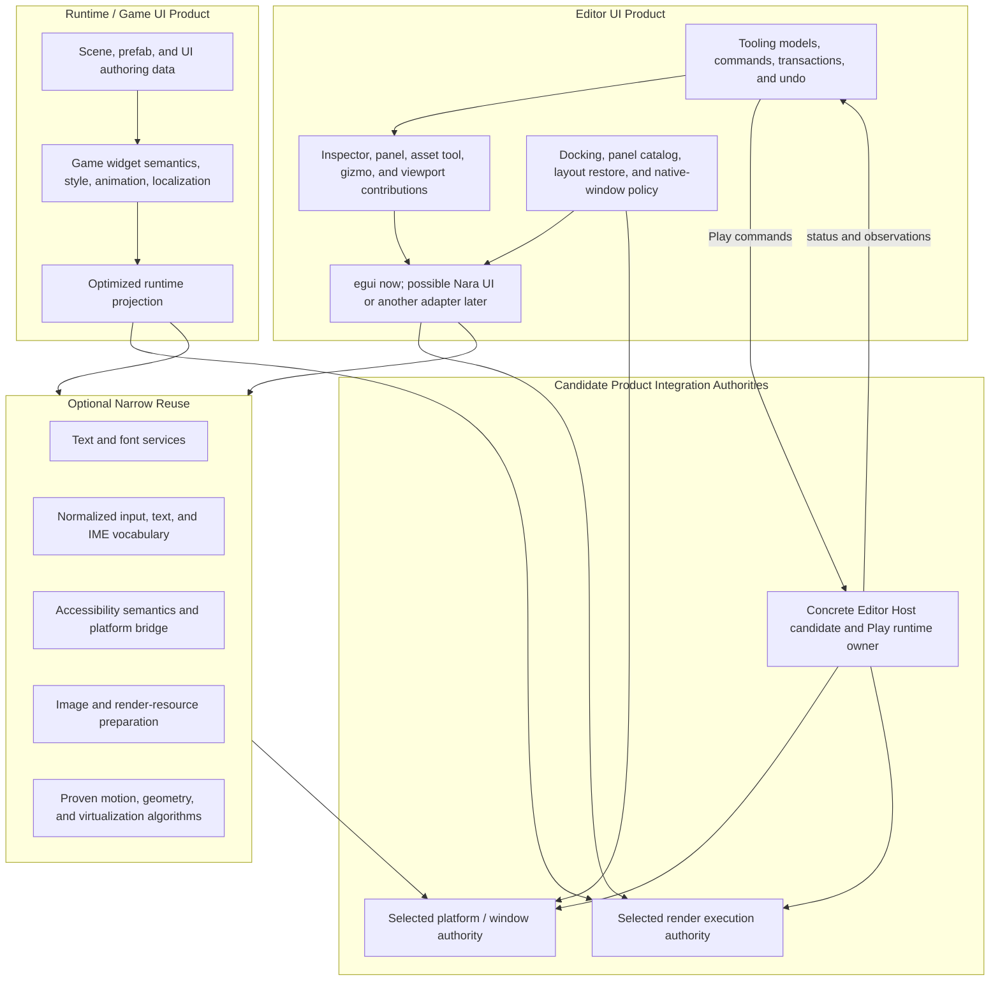

# UI Product Boundaries, Editor Dogfooding, and Porting Strategy

**Status**: Design Draft
**Date**: 2026-07-16
**Normative Authority**: ADR 0015, ADR 0025, ADR 0041, ADR 0047, ADR 0078, and ADR 0094
**Proposed Inputs**: ADR 0082 and ADR 0084; their Host/runtime roles remain hypotheses until
accepted or replaced.
**Related Open Questions**: OQ-001, OQ-003, OQ-004, OQ-010, OQ-022, and OQ-031
**Document Role**: UI boundary canonical draft; evidence-gated and not a toolkit selection.

This document is a pressure-tested direction, not a new accepted architecture decision. It explains
how Nara can grow mature game UI and editor UI without prematurely forcing them into one toolkit or
permanently separating every underlying service. The owning ADRs remain authoritative.

## Purpose

Nara needs two different UI products:

- runtime/game UI authored as durable project data and used by shipped games;
- editor/tool UI optimized for dense data, repeated commands, docking, native windows, and
  third-party tooling.

Mature engines prove that either product can reuse the other at several depths, but they do not
prove one universal topology. Nara therefore needs stable ownership boundaries before it needs a
final editor toolkit choice.

The direction is:

1. keep game UI and editor UI as separate product layers;
2. share only narrow services or pure algorithms after their semantics are proven equal;
3. keep egui as the productive early editor adapter;
4. let Nara UI dogfood one complete editor panel only after the runtime UI is ready;
5. use Open GPUI, egui, and Dear ImGui as evidence and selective implementation sources, not as
   authorities over Nara documents, Hosts, or render backends;
6. leave the final editor topology open until real game and editor tracers decide it.

## Mature-Engine Precedents

| Product topology | Mature precedent | What is shared | Where products split |
|---|---|---|---|
| Separate toolkits | Unity uGUI plus Editor UI Toolkit/IMGUI; Bevy UI plus external egui tooling | Engine input, assets, fonts, textures, and GPU services may be reused | Widget tree, authoring, layout, state, and editor shell |
| Shared retained foundation, separate product layers | Unreal Slate beneath UMG/CommonUI and the Unreal Editor | Widget, layout, text, input, accessibility, and draw foundations | Game authoring and navigation versus editor tabs, docking, asset tools, and workspace |
| Unified retained toolkit | Godot `Control`; parts of Unity UI Toolkit | Semantic widgets, layout, themes, events, text, and rendering | Editor workspace, docking, native windows, undo, selection, and plugin authority |

Unity demonstrates that multiple UI systems can coexist for years in a successful product. Unreal
demonstrates that sharing a retained foundation does not require sharing game and editor authoring.
Godot demonstrates that full dogfooding can work when the runtime toolkit reaches desktop-tool
quality. Bevy demonstrates useful crate and headless-widget layering, but not a mature integrated
editor product.

Nara should preserve all three possible end states. Current implementation choices must not imply
that the editor will definitely converge on `nara_ui` or definitely remain on a separate toolkit.

## Product And Authority Model

The authority labels in this draft are integration hypotheses for RGF-U17 and OQ-022. An `Editor
Host` is one concrete product-root owner, not a shared public trait. The platform and render labels
mean the selected stock or separately admitted authorities; they do not imply that ADR 0094 has
admitted replacement Render Host selection.

This diagram permits reuse without inventing a universal Widget interface. Each product may retain
its own widget tree, layout strategy, transient state, component catalog, and visual style.

## Boundary Responsibilities

| Owner | Owns | Must not own |
|---|---|---|
| Runtime/game UI | Persistent UI authoring, game widget behavior, game navigation, animation and localization integration, runtime state lifetime | Editor docking, workspace truth, native windows, toolkit contexts |
| Runtime UI projection | Incremental layout, stable runtime widget identity, hit testing, virtual collections, focus/navigation projection | Persistent scene truth or editor document transactions |
| Runtime UI render domain | Backend-neutral visual extraction, clipping, ordering, and extensible visual submissions | Raw wgpu handles, editor workspace state, a permanently quad-only display model |
| Tooling | UI-neutral editor models, document/selection authority, commands, validation, undo/redo, Play commands/views/status/observations, and Apply Changes | Toolkit widget trees, focus/scroll handles, raw window/GPU authority, `RuntimeRecipe`, `RuntimeStartAttempt`, or `RuntimeInstance` ownership |
| Editor UI adapter | Toolkit-specific presentation and transient interaction state; lowering responses into tooling intents | Direct document mutation, runner selection, native window creation, Device/Queue ownership |
| Editor shell | Panel catalog, dock graph, layout snapshots, tool composition, detached-window intent | Game UI scene schema or gameplay runtime policy |
| Concrete Editor Host candidate | If RGF-U17 and the owning ADRs admit it: process-level composition and lifetime of selected platform/render/toolkit Adapters, platform input/output arbitration, Play recipe refresh, start-attempt publication, and `RuntimeInstance` drive/control/retirement | Business document mutation, workspace truth, package-owned widget semantics, or a second raw Device/Queue/window authority beside its selected Adapters |
| Platform/window and render execution authorities | Window/surface leases, Device/Queue, target lifecycle, submission, present, recovery, teardown | UI document or editor workspace truth |

## Runtime UI Direction

ADR 0025 remains the canonical direction: runtime UI is Nara-owned, retained, ECS-backed for
authoring, inspectable, and data driven.

ECS authoring must not freeze the hot execution topology. Scene entities and component records can
remain the authoring truth while an internal runtime projection supplies:

- stable widget and surface identity across rebuilds;
- incremental invalidation and layout;
- virtual collections with stable item keys and measurement caches;
- spatial hit testing and bounded visible work;
- focus, capture, navigation, and accessibility projections;
- backend-neutral visual output beyond the current panel/quad seed.

Nara must not promise one runtime `Entity` per materialized widget forever. That promise would make
large inventories, chat, leaderboards, editor trees, and rebuilt UI state unnecessarily expensive.

Runtime package freedom should eventually exist at several distinct levels:

1. persistent UI schema and reusable composites;
2. semantic behavior and typed actions;
3. layout and intrinsic measurement contributions;
4. navigation, gesture, and accessibility semantics;
5. backend-neutral custom visuals or render features;
6. rare Host-gated integrations for genuinely native UI or platform facilities.

These are capability categories, not proposed Rust traits. Exact interfaces wait for real packages.

## Editor UI Direction

The early editor should continue using egui. This is a product decision about iteration speed, not a
decision that egui owns Nara's editor model. The adapter consumes immutable tooling models and
returns typed commands through the existing validation and undo path.

Editor contributions should grow by role rather than through one broad mutable `EditorPlugin`
context:

1. commands, menus, toolbars, and shortcuts;
2. schema metadata and the standard Inspector;
3. property drawers and custom Inspector providers;
4. panels, asset editors, timelines, graphs, and debugger/profiler surfaces;
5. viewport overlays, gizmos, picking tools, and custom render outputs;
6. toolkit-bound views when a portable contribution is insufficient;
7. explicit privileged Host integrations for platform or render-execution work.

A package may provide both runtime and editor roles. The roles remain separate contracts so editor
privileges do not arrive implicitly with a runtime widget or gameplay plugin.

Continuous editor gestures such as gizmo drags, sliders, and dock moves use one toolkit-neutral
transaction lifecycle. Begin captures the target, document revision, and authorization scope;
updates publish bounded cancellable preview state without adding undo entries; commit produces one
validated atomic patch plus inverse; Escape, focus/capture loss, window close, deleted targets, or
revision conflict cancels/restores or returns an explicit rejection. Third-party tools write only
through that scoped command path.

The first Nara UI editor dogfood should migrate one complete panel, not individual widgets mixed
inside one panel. It must preserve the same tooling commands, validation, undo, selection, and
diagnostics as the egui version.

## Editor Shell And Native Windows

Docking and multi-window support are Editor Shell and Host concerns, not runtime UI widgets.

The durable part of docking is a logical graph and versioned layout snapshot. It may contain stable
panel IDs, tabs, splits, floating placement hints, and explicit close/restore policy. It must not
contain live views, runtime entities, native handles, surfaces, or transient render-view indices.

The concrete Editor Host decides whether a floating item remains in-window or becomes a native
window. Native creation is gated by platform capability, target policy, input/IME support, render
target admission, and deterministic close/retirement. A UI callback emits an intent; it does not
create a window or surface directly.

## Open GPUI Transfer Policy

Open GPUI is useful because it has already exercised general components, stable-key virtualization,
forms, motion, docking, native viewports, capability gates, and failure-oriented tests. It is a
reference and component laboratory, not Nara's application or rendering authority.

### Eligible For Selective Port Or Close Adaptation

- renderer-neutral overlay, splitter, selection, navigation, and accessibility state machines;
- stable-key virtualizer measurement, reveal, invalidation, and scroll anchoring;
- table/tree identity, sorting, selection, lazy-load intent, and controlled edit models;
- deterministic motion sampling, retargeting, reduced-motion, and frame-demand calculations;
- form dirty/touched state, stable field paths, and stale asynchronous validation rejection;
- dock graph validation, canonicalization, atomic operations, persistent logical layout, capability
  outcomes, and failure fixtures.

Port only the behavior demanded by a Nara tracer. Prefer rewriting fixtures against Nara-owned
types over mechanically copying a complete component implementation.

### Must Be Rewritten Against Nara Owners

- all rendering, hit testing, focus/scroll handles, callbacks, subscriptions, and theme resolution;
- text, IME, gamepad navigation, accessibility output, and platform feedback adapters;
- dock drag presentation, panel factories, native viewport creation, and close/merge-back behavior;
- Scene/Prefab codecs, schema inspection, localization, animation, and tooling transactions;
- GPU resources, caches, target acquisition, encoding, submission, and presentation.

### Reference Only; Never Enter Nara Authority Or Public Data

- GPUI `App`, `Window`, `Context`, `Entity<T>`, Platform, executor, and application lifecycle;
- GPUI renderer, surfaces, Device/Queue, atlases, encoders, and submit/present ownership;
- egui `Context`, `Memory`, `Id`, and `Response` as durable Nara identities or package contracts;
- Dear ImGui context, IO, dock IDs, platform callbacks, FFI handles, or direct mutable reflection;
- toolkit-native callbacks with mutable workspace or `World` authority.

Open GPUI is Apache-2.0 and carries Zed/Open GPUI provenance and NOTICE obligations. Literal or
closely derived ports require file-level source, license, notice, and modification tracking. Nara's
`MIT OR Apache-2.0` declaration does not turn Apache-only derived code into MIT code. Adjacent Zed
UI code may use GPL licensing and requires separate provenance review. This is an engineering gate,
not legal advice.

## Evidence Gates

| Gate | Workload | What it proves |
|---|---|---|
| UI-0: Early editor | egui Inspector and basic Play controls over UI-neutral tooling models | Productive tooling without toolkit-owned document authority |
| UI-1: Mature game settings | Localized settings menu with editable text/IME, focus scopes, gamepad navigation, rebinding, and accessibility semantics | Text, input routing, semantic widgets, localization, and platform accessibility readiness |
| UI-2: Dynamic game collection | Variable-height inventory or quest/chat list with stable keys, drag/drop, virtualization, and animation | Runtime projection, measurement, scroll anchoring, incremental work, and custom composites |
| UI-3: Render target UI | World-space or render-to-texture terminal with mapped input and custom visuals | OQ-001 admission evidence for target/view identity, input projection, render freedom, and lifecycle; no graph is selected by this gate alone |
| UI-4: First editor dogfood | One complete Inspector or similarly demanding panel rendered by Nara UI | Adapter replaceability with command/undo/IME/accessibility parity |
| UI-5: Heterogeneous editor | Inspector plus virtualized hierarchy/asset browser plus viewport/timeline/graph | Whether one Nara UI foundation can become the primary editor toolkit |
| UI-6: Editor shell | Dock graph, layout restore, panel removal, stale state, and atomic tear-off fixtures | Editor-owned durable docking independent of a concrete toolkit |
| UI-7: Native multi-window | One real detached window with DPI/focus/IME/input/surface/device-loss/close coverage | OQ-022 admission evidence for platform/window and render-execution ownership; no replacement Host role is selected by this gate alone |

Failure at UI-4 or UI-5 is not a failure of Nara's game UI. It is valid evidence for keeping a
separate editor toolkit. Success permits convergence but does not mandate immediate removal of egui.

## Alternatives Considered

### Option A: Permanently Separate Game And Editor Toolkits

**Pros**: Each product can optimize for its users; editor delivery is not blocked by runtime UI.

**Cons**: Expensive text, IME, accessibility, rendering, DPI, and virtual-collection behavior may be
duplicated; embedded game view and toolkit focus still need Host coordination.

**Decision**: Viable end state, not the default commitment. Keep it available if dogfood evidence is
weak.

### Option B: Separate Products With Selective Narrow Reuse

**Pros**: Preserves product freedom while reusing proven services and algorithms; supports phased
delivery and evidence-driven convergence.

**Cons**: Shared-service boundaries can accidentally grow into a lowest-common-denominator Widget
framework; two adapters may coexist for a long time.

**Decision**: Recommended current direction.

### Option C: Commit Now To One Nara UI Toolkit For Runtime And Editor

**Pros**: Maximum dogfood, one visual/component ecosystem, and one set of toolkit defects.

**Cons**: Editor docking, data tools, native windows, and long-form text can pollute runtime APIs;
game scene persistence, animation, world-space UI, and custom visuals can slow editor delivery.

**Decision**: Deferred until UI-4 and UI-5 prove the same foundation without product-layer leakage.

### Option D: Adopt Open GPUI As The Nara Editor Or Shared UI Runtime

**Pros**: Reuses a coherent Rust desktop framework and an existing component ecosystem.

**Cons**: GPUI owns application state, event-loop services, windows, executors, text, surfaces, and
rendering. That would establish competing authorities beside Nara App, the selected
platform/window and render-execution authorities, ECS, and tooling.

**Decision**: Rejected. Selective behavior and test porting remains allowed.

## Success Metrics

| Property | Target | Evidence |
|---|---|---|
| Persistent-data purity | Zero toolkit contexts, runtime entities, native handles, or GPU handles in game UI documents and editor layout snapshots | Schema/fixture audits and boundary searches |
| Editor mutation parity | egui and any future Nara UI panel emit semantically equivalent tooling commands and produce identical validation/undo results | Cross-adapter command fixtures |
| Host exclusivity | No UI adapter creates an event loop, native window, surface, Device/Queue, or submits/presents independently | Dependency/API audit and Host integration tests |
| Runtime scalability | Virtual collections materialize bounded visible/overscan work and preserve stable selection/reveal state through reorder and measurement changes | Headless workload tests and measured frame traces |
| Docking atomicity | Every rejected move/split/merge/close/tear-off leaves the logical graph and published layout unchanged | Failure-matrix tests |
| Extension freedom | Independent packages can add a runtime UI capability or editor contribution without importing private workspace, toolkit, window, or backend handles | Clean-room package compile/runtime fixtures |
| Product independence | Failure to dogfood an editor workload does not require changing runtime UI documents or gameplay-facing APIs | UI-4/UI-5 decision review |
| Port provenance | Every copied or closely translated source file records source commit, license, notices, and modifications | Source ledger and release audit |

## Risks And Mitigations

| Risk | Severity | Likelihood | Mitigation |
|---|---:|---:|---|
| A universal neutral Widget layer erases toolkit strengths | High | Medium | Share services and pure algorithms only after two consumers prove equal semantics |
| Editor needs pollute runtime UI and shipping dependencies | High | Medium | Keep Editor Shell, docking, tables, property grids, and native windows in editor-owned product layers |
| ECS authoring becomes an inefficient permanent execution tree | High | Medium | Preserve an internal optimized projection with stable keys, invalidation, spatial indexing, and virtualization |
| Two toolkits compete for input, IME, windows, or GPU submission | Critical | Medium | One concrete Editor Host arbitrates every platform stream and render target |
| Migration duplicates every widget indefinitely | Medium | Medium | Migrate complete panels, keep egui optional, and stop work when parity evidence is weak |
| Third-party extensions are limited to composing stock widgets | High | Medium | Preserve separate behavior, layout, semantic, visual, panel, viewport, and Host-gated contribution levels |
| Literal source ports violate provenance or license expectations | High | Low | Require file-level source/license review, NOTICE propagation, and clean-room reimplementation when uncertain |
| Current panel rendering freezes game UI visual freedom | High | Medium | Treat panel/quad batching as a seed and retain extensible backend-neutral visual submissions |

## Open Questions

1. Which runtime UI tracer first proves a stable widget identity that survives projection rebuilds?
2. Which exact Inspector subset is demanding enough for UI-4 without implicitly choosing the final
   editor Shell?
3. Which text, input/IME, accessibility, and render-resource facilities have genuinely identical
   game and editor semantics after two consumers exist?
4. Which first third-party runtime UI package proves behavior, layout, semantic, and custom-visual
   freedom without a universal Widget ABI?
5. Which first third-party editor tool proves the portable contribution level is insufficient and
   justifies a toolkit-bound view?
6. Which Open GPUI algorithms are wholly original to the fork, which are Apache-derived from GPUI,
   and which have adjacent GPL provenance that forbids direct transfer?

## Non-Goals

- Select the final editor toolkit now.
- Freeze a universal Widget trait, UI DSL, style language, layout engine, or dynamic ABI.
- Require egui to disappear after the first Nara UI panel succeeds.
- Put editor docking, property grids, command palettes, or native-window policy in runtime UI.
- Treat immediate-mode ergonomics as the persistent game UI document model.
- Copy Open GPUI wholesale or reproduce its application/runtime ownership inside Nara.

## References

- [ADR 0015: Editor, Tooling, and Dogfooding Boundary](adr/0015-editor-tooling-and-dogfooding-boundary.md)
- [ADR 0025: Runtime UI System](adr/0025-runtime-ui-system.md)
- [ADR 0041: Input Routing, Actions, Text Input, UI Focus, and Accessibility](adr/0041-input-routing-actions-text-focus-and-accessibility.md)
- [ADR 0047: Editor Workspace and Scene Document State](adr/0047-editor-workspace-and-scene-document-state.md)
- [ADR 0094: Minimal Render Execution Boundary and Evidence-Gated Extensions](adr/0094-minimal-render-execution-boundary-and-evidence-gated-extensions.md)
- [ADR 0078: Render Host Affinity, WebGPU Initialization, and Device Recovery](adr/0078-render-host-affinity-webgpu-initialization-and-device-recovery.md)
- [Open GPUI component contract](../../repo-ref/open-gpui/docs/ui/component-contract.md)
- [Open GPUI docking model](../../repo-ref/open-gpui/crates/gpui_docking/README.md)
- [Open GPUI fork strategy](../../repo-ref/open-gpui/docs/adr/0001-open-gpui-fork-strategy.md)
- [Open GPUI removal of the unproven hybrid registry](../../repo-ref/open-gpui/docs/adr/0014-remove-native-ui-hybrid-registry.md)
- [Open GPUI Apache-2.0 license](../../repo-ref/open-gpui/LICENSE-APACHE)
- [Open GPUI attribution notice](../../repo-ref/open-gpui/NOTICE)
- [Unity UI systems comparison](https://docs.unity3d.com/6000.0/Documentation/Manual/UI-system-compare.html)
- [Unreal Slate UI framework](https://dev.epicgames.com/documentation/en-us/unreal-engine/slate-user-interface-programming-framework-for-unreal-engine)
- [Unreal UMG UI Designer](https://dev.epicgames.com/documentation/en-us/unreal-engine/umg-ui-designer-for-unreal-engine)
- [Godot `Control`](../../repo-ref/godot/scene/gui/control.h)
- [Godot editor dock manager](../../repo-ref/godot/editor/docks/editor_dock_manager.h)
- [Bevy headless UI widgets](../../repo-ref/bevy/crates/bevy_ui_widgets/src/lib.rs)
- [Bevy Feathers editor widgets](../../repo-ref/bevy/crates/bevy_feathers/src/lib.rs)
