# Summary

Nara should keep entity content canonicalization independent from hierarchy order and replace the
prototype `SceneEntityRecord.parent` shape with one document-level ordered hierarchy that owns both
topology and root/sibling order. Conceptually, every persistent entity appears exactly once in an
ordered root list or one parent's ordered child list. Exact Rust and serialized field names remain
unselected while ADR 0085 is Proposed.

`KeepWorld2d` should be an authoring or runtime-domain intent, never a persistent patch operation.
Tooling resolves that intent against one base revision, performs checked transform conversion, and
emits final facts: a structural move plus the computed local `Transform2d` value in one atomic
`ScenePatchDocument`. Low-level structural movement always preserves authored local values.

The same audit found two adjacent format gaps. Prefab override additions require an explicit
instance-override-owned provenance class, and the current `RemoveEntity` name hides recursive
subtree deletion while its inverse loses future sibling order and performs repeated validation.
The recommended direction is explicit subtree removal with one bounded authoritative inverse
snapshot and stable root placement.

This record refines only the persistent-authority, authoring-patch, prefab, and reparent portions of
the earlier
[`Shared structural hierarchy and domain projection research`](2026-07-21T070232Z-shared-structural-hierarchy-and-domain-projection-research-4b108b65d9e844a3998b89c53a58b58c.md).
That record's runtime relationship, lifecycle, projection, visibility, and scope evidence remains
useful. Both records are non-normative and do not accept ADR 0085 or authorize implementation.

# Question

Which persistent representation and move Interface preserve deterministic authoring order,
failure-atomic transform behavior, prefab provenance, exact undo, plugin freedom, and future domain
growth without introducing duplicate topology authority or a speculative provider seam?

# Repository Baseline

- Nara tracked source commit: `82ba06688005283309c4ac3c8248a12e018521d0`.
- Nara working-tree ADR 0085 and related architecture documents were reviewed as dirty concurrent
  proposal evidence, not implementation authority.
- Bevy source commit: `f6c6e6eebb94e81c090614f19039319e9acb3c85` under `repo-ref/bevy`.
- Godot source commit: `c939bf3791ce40ff70e0ee29f06486da1ebb6a84` under `repo-ref/godot`.
- No Cargo command was run. The investigation was source and document analysis only.

# Nara Pressure

The current prototype exposes several facts that become incompatible once stable hierarchy order is
required:

1. `SceneDocument.entities` and `PrefabDocument.entities` are canonicalized by stable ID. Their
   array order cannot also mean root/sibling order.
2. `SceneEntityRecord.parent` owns topology, while a future ordered child collection would duplicate
   that topology unless one representation is selected as authority.
3. `ScenePatchOperation::Reparent` records only the new parent. Its inverse records only the old
   parent and therefore cannot restore relative order.
4. `RemoveEntity` actually removes the complete structural subtree. Its inverse is a depth-sorted
   sequence of `AddEntity` operations, and the patch engine validates the whole scratch document
   after every operation.
5. Prefab overrides apply to source-relative IDs before expansion. Expansion then namespaces source
   entities and attaches source roots to the instance anchor. Generated expanded IDs are therefore
   projections, not valid scene authority.
6. `Transform2d` stores only translation, rotation, and scale. Some full affine results of
   reparenting cannot be represented without shear.

# Primary-Source Evidence

## Bevy: useful relationship storage, insufficient reparent transaction

Bevy provides a mature relationship substrate and ordered `Vec<Entity>` target collection. Source
relationship components remain the topology facts, while hooks maintain ordered reverse
collections. This is appropriate implementation substrate for Nara's non-linked runtime relation.

Bevy's transform convenience methods are not an adequate product Interface:

- `set_parent_in_place` changes the relationship first, then conditionally reads parent/child
  `GlobalTransform` and child `Transform`. A missing component ends the optional conversion after
  structure has already changed.
- `remove_parent_in_place` has the same partial-result shape.
- `GlobalTransform::reparented_to` computes inverse-parent times child and decomposes the affine
  result, but its documentation says degenerate or sheared inputs produce invalid output. It does
  not return `Result` or validate recomposition.
- `GlobalTransform` is a propagated cache and can be stale at arbitrary schedule points.
- Built-in `Children` also opts into `linked_spawn`, so it conflates structural and recursive
  lifetime behavior that Nara deliberately separates.

Nara should reuse the relationship collection machinery, not Bevy's public reparent failure
semantics or linked lifetime policy.

## Godot: strong product precedent, non-atomic failure behavior

Godot demonstrates mature user-facing hierarchy and provenance concepts:

- A parent owns an ordered child sequence, and `move_child` updates explicit sibling indexes and
  notifications.
- `PackedScene` stores structural parent, owner, and child index as distinct facts. Scene ownership
  is not identical to the parent pointer.
- Node2D and Node3D editor movement commonly preserve global placement.

Its implementation is not a transaction model to copy:

- `Node::reparent` removes from the old parent and appends to the new parent. Exact sibling placement
  requires a later `move_child` call.
- Node2D and Node3D capture global transform, perform structural reparent, then set global transform.
  Conversion failure occurs after topology changed and has no rollback.
- 2D and 3D affine inversion checks are not a fallible product contract for near-singular values.
- Godot can retain more affine state because its transform types can carry skew/full basis data;
  Nara's current `Transform2d` cannot.

Nara should borrow ordered parent-owned children, clear editor intent, and ownership/topology
separation while using stricter preflight and failure semantics.

# Representation Alternatives

## Alternative A: Reuse entity content array order

**Advantages**: No additional document section; compact serialized shape.

**Costs**: Conflicts with stable-ID canonicalization, creates one global sequence instead of
parent-local sequences, and couples payload diffs to hierarchy movement.

**Disposition**: Reject.

## Alternative B: Parent plus integer sibling index on every record

**Advantages**: Easy to inspect and sort; parent remains adjacent to payload.

**Costs**: Inserting near the front renumbers many siblings, producing noisy patches and merge
conflicts. Adding parent-owned lists later would duplicate topology.

**Disposition**: Reject for version 1.

## Alternative C: Parent plus sparse or fractional order key

**Advantages**: Most local moves change one record and can support collaborative editing pressure.

**Costs**: Requires rank growth, rebalance, canonicalization, conflict policy, and format-visible
implementation metadata before Nara has a collaborative-editing workload.

**Disposition**: Defer until measured collaboration or extreme-sibling pressure justifies it.

## Alternative D: Document-level ordered hierarchy

**Advantages**: Stores topology and order once, keeps content independently canonical, directly
serves editor/prefab traversal, and makes subtree snapshots and relative moves explicit.

**Costs**: Requires a breaking format reset, exact membership validation, patch changes, and budget
coverage for every stored hierarchy ID/list item.

**Disposition**: Recommend for the Proposed ADR 0085 target.

# Interface Alternatives

Three independent designs were compared.

## Minimal concrete Interface

Expose one structural `KeepLocal` move and one concrete 2D fallible move. Persist only a move's final
placement and final local component value. Do not expose a hierarchy backend, behavior provider,
universal projection trait, or arbitrary commit callback.

**Strength**: Smallest public Interface and strongest locality for the first real 2D product slice.

**Weakness**: A future domain may need some private planning logic duplicated until a second real
consumer proves a common seam.

## Public prospective hierarchy plan

Prepare a revision-bound before/after forest view, let 2D/3D/UI/physics compute domain values from
the prospective structure, then commit once.

**Strength**: Strong batch and cross-domain extensibility without a provider registry.

**Weakness**: With only one production consumer, a stable public plan freezes an unproven seam and
risks exposing internal graph/revision mechanics.

## Authoring-UX intent compiler

Let UI-neutral tooling accept multi-selection, target provenance, base revision, relative placement,
and `PreserveWorld2d`; compile the intent into one final scene patch and inverse.

**Strength**: Best editor ergonomics and one command path for the hierarchy panel, AI tools, and
future UI adapters.

**Weakness**: Tooling must route provenance and call transform-owned math without becoming the
owner of either domain.

## Recommended hybrid

Use the minimal concrete runtime Interface plus the authoring intent compiler. Keep any prospective
plan private or unstable until a second production-shaped domain proves external leverage. A second
Adapter is not required because there is no replaceable hierarchy provider; the seam is among
concrete Nara Modules, not implementations of one universal backend.

# Recommended Direction

```mermaid
flowchart LR
    Intent[Tooling move intent plus base revision]
    Provenance[Resolve scene, prefab source, or instance override owner]
    Structure[Preflight final parent and relative order]
    Math[Transform domain computes checked final local value]
    Patch[ScenePatch: final move plus final local component]
    Validate[Scratch document validation]
    Publish[Publish document and inverse]
    Runtime[Rebuild or sync runtime projection]

    Intent --> Provenance --> Structure --> Math --> Patch --> Validate --> Publish --> Runtime
```

## Persistent authority

- A scene/prefab document owns an ordered roots sequence and ordered children per parent.
- Entity records contain content only.
- Every persistent entity appears exactly once in hierarchy membership.
- Exact field names and containers remain unselected until the format implementation is admitted.
- The prototype parent-only shape may use ADR 0043's unreleased canonical reset. Stable-ID grouping
  gives deterministic initial order but does not recover order that was never stored.

## Placement and move semantics

- User and patch vocabulary expresses `First`, `Last`, `Before(stable_anchor)`, and
  `After(stable_anchor)` semantics rather than integer indexes.
- Remove the moving entity from the old sequence before resolving its destination.
- A relative anchor must be present in the prospective destination sibling set.
- Stale, self, or wrong-parent anchors reject; they do not degrade to `Last`.
- Runtime official operations use World/generation-bound evidence when they promise identity-domain
  rejection. Raw `Entity` mutation remains an advanced substrate path with narrower evidence.

## Authoring intent versus persistent fact

- Hierarchy-only movement means `KeepLocal` and never edits transform/layout data.
- Editor 2D movement defaults to requesting `KeepWorld2d`; failure is visible.
- Tooling binds the request to one base revision and emits final `MoveEntity` plus final
  `Transform2d` component data.
- Patch replay, prefab expansion, undo, redo, migration, and AI patch application never recompute a
  historical `KeepWorld` request.
- A failed preserve-world request never silently falls back. A user may explicitly issue a new
  `KeepLocal` command.

## Transform conversion

- Compute old and prospective parent globals from a projection proven fresh for the same revision,
  or recompute the affected chain privately.
- Reject non-finite input, scale-aware near-singularity, unavailable domain projection, and results
  that cannot be represented by current TRS.
- Decompose and recompose the candidate local affine value, comparing residual against one
  engine-owned tolerance.
- Canonical negative-scale/reflection handling belongs to `nara_transform` and must be fixture-tested
  before persistent output is admitted.
- Do not add skew/full-affine authoring merely to make every reparent succeed. Require a concrete 2D
  workflow before expanding `Transform2d`.

## Prefab provenance

- Overrides continue to apply to source-relative IDs before expansion.
- A source root remains a source root in override data and becomes an anchor child only during
  expansion.
- Expanded namespaced IDs never become scene or prefab source authority.
- An override-added entity is instance-override-owned and writes back to that override.
- Version 1 orders anchor children as expanded prefab roots followed by scene-local children, with no
  arbitrary interleaving.
- Crossing source/instance/scene ownership requires an explicit override, source edit, adoption, or
  convert-to-local operation.

## Subtree deletion and inverse

- Name recursive authoring deletion as a subtree operation.
- Capture authoritative records, internal hierarchy/order, and the root's stable relative placement
  in one bounded inverse snapshot.
- Do not snapshot expanded prefab projections; restore the anchor and `PrefabInstance`, then expand
  from the current admitted source/override contract.
- Avoid restoring deep trees through one full-document validation per descendant. Exact
  `InsertSubtree` versus `RestoreSubtree` encoding remains a patch-format implementation choice.

# Performance and Safety

- Parent-owned `Vec` order is optimized for the dominant traversal workload. Moves are linear in
  sibling count but are expected to be low-frequency authoring/runtime operations.
- Transform-preserving moves are linear in affected ancestor depth plus sibling movement, not a
  frame-hot operation.
- Large subtree inverse records require item, depth, encoded-byte, generated-ID, and component-value
  budgets under ADR 0049.
- Full-tree dirty caches, fractional ranks, public change streams, deferred move queues, and
  collaboration CRDTs remain measurement-gated.
- Failure atomicity means all predictable failures happen before the first owned write and
  Nara-managed consumers observe one committed revision at their completion barrier. It does not
  promise rollback across arbitrary raw ECS hooks, observers, or panics.

# Deferred Decisions

- Exact serialized field/type names for document hierarchy and move operations.
- Whether a subtree inverse uses a general insert-fragment operation or an inverse-specific restore
  operation.
- A stable public prospective hierarchy plan after a second real domain consumer.
- Skew/full-affine 2D authoring after a production workflow proves the need.
- Arbitrary interleaving of prefab-projected and scene-local anchor children.
- Parented dynamic-body world-pose writeback and fixed-tick fault semantics.
- Collaborative rank/CRDT ordering and external patch merge policy.

# Admission Evidence

1. Golden scene/prefab fixtures prove exact hierarchy membership, canonical content-order
   independence, stable relative moves, and deterministic prototype source rewrite.
2. Move/inverse fixtures cover roots, children, same-parent reorder, cross-parent move, missing and
   wrong-parent anchors, cycle rejection, and atomic no-change on error.
3. Patch replay and changed-ancestor fixtures prove `KeepWorld` intent is not persisted or
   re-evaluated.
4. Transform fixtures cover finite input, stale projection rejection/recompute, near-singular
   parents, reflection, representable non-uniform scale, and non-representable shear.
5. Prefab fixtures cover source-relative overrides, instance-override-owned additions, nested
   namespacing, deterministic anchor segments, and rejection of expanded IDs in authority.
6. Subtree delete/undo fixtures restore exact content, hierarchy, root placement, provenance, and
   bounded cost without serial full-document validation.
7. Deep, wide, mutation-heavy, and large-subtree workloads are measured before admitting a more
   complex ordering/cache mechanism.

# Next Action

Keep ADR 0085 Proposed. Review its revised persistent-authority, move, prefab, and subtree evidence
with the existing runtime hierarchy, 3D, UI, lifecycle, identity, visibility, and physics admission
set. Only an Accepted ADR plus an active plan may authorize the document reset, new crate, public
Interface, or implementation work.

# Citations

## Nara

- `docs/architecture/adr/0085-hierarchy-transform-and-visibility-semantics.md`.
- `docs/architecture/adr/0026-editor-command-patch-and-undo-model.md:100-115`, `:182-185`.
- `docs/architecture/adr/0038-scene-prefab-authoring-identity-and-provenance.md:19-59`.
- `docs/architecture/adr/0043-scene-prefab-and-patch-document-migration-policy.md:13-28`,
  `:46-78`.
- `crates/nara_scene/src/document.rs:20-37`, `:100-133`.
- `crates/nara_scene/src/patch.rs:188-239`, `:254-310`, `:696-764`, `:1014-1038`.
- `crates/nara_scene/src/prefab.rs:567-577`, `:689-723`, `:888-961`.
- `crates/nara_scene/src/authoring.rs:224-310`, `:497-530`.
- `crates/nara_transform/src/lib.rs:12-39`.
- `crates/nara_ui/src/layout.rs:120-215`.

## Bevy at `f6c6e6eebb94e81c090614f19039319e9acb3c85`

- `repo-ref/bevy/crates/bevy_ecs/src/hierarchy.rs:28-50`, `:147-152`.
- `repo-ref/bevy/crates/bevy_ecs/src/relationship/relationship_source_collection.rs:136-220`.
- `repo-ref/bevy/crates/bevy_transform/src/commands.rs:31-78`.
- `repo-ref/bevy/crates/bevy_transform/src/components/global_transform.rs:19-27`, `:182-192`,
  `:371-418`.

## Godot at `c939bf3791ce40ff70e0ee29f06486da1ebb6a84`

- `repo-ref/godot/scene/main/node.cpp:503-585`, `:1716-1747`, `:2072-2114`, `:2300-2326`.
- `repo-ref/godot/scene/2d/node_2d.cpp:148-157`, `:376-395`.
- `repo-ref/godot/scene/3d/node_3d.cpp:391-412`, `:1022-1031`.
- `repo-ref/godot/core/math/transform_2d.cpp:48-59`.
- `repo-ref/godot/scene/resources/packed_scene.h:58-76`.
- `repo-ref/godot/scene/resources/packed_scene.cpp:615-647`, `:865-874`.
