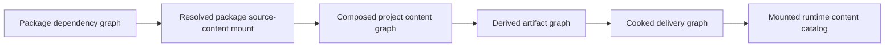

# Scope

This record answers one product-architecture question for Nara: how an installable Product
Package can carry code, editor contributions, importers, source content, samples, and
documentation without conflating that distribution unit with the authored project, the import
cache, or a player-facing cooked content package.

It is research evidence for OQ-031. It does not accept a package manager, an ABI, a registry,
or a public Rust API.

# Current Nara Evidence

The current implementation is intentionally a single-project-root prototype:

- `nara_asset::AssetPath` is a validated project-relative path, while `StableAssetId` is a UUID.
  `ProjectAssetDatabase` indexes one path and one stable ID per record.
- `ProjectContentLoader` holds one `DirectoryCapability`; its prefab resolvers currently accept
  only `AssetRef::Path`. Stable-ID lookup reports that a bounded catalog is not yet implemented.
- The current importer contract receives an `AssetRecord`, source bytes, dependency digest,
  settings hash, and import profile. It has no editor `World` capability in its interface.

The accepted/proposed architecture already supplies most of the needed vocabulary:

- ADR 0083 proposes one `StableAssetId` collision domain across project and read-only package
  assets visible in a composed content generation. Package provenance is not an equality field,
  and collisions reject composition rather than using overlay precedence.
- ADR 0087 proposes source-to-`ArtifactGroup` import publication. Derived artifacts are cache
  state, not authored truth.
- ADR 0088 proposes target planning, cooking, immutable runtime content packages, and a mounted
  runtime catalog. Its runtime package is not a source extension package.
- OQ-031 already treats a Product Package as the user-facing installable unit with typed,
  independently owned Contributions.

The gap is therefore not another generic `Package` trait. It is the explicit content-mount edge
between a resolved Product Package and the composed authoring-content generation.

# Mature Engine Evidence

## Unity

Unity separates original source assets, sidecar metadata/GUIDs, imported artifacts, and the
`Library` cache. Its UPM package is a dependency-resolved distribution unit, whereas a
`.unitypackage` is an archive copied into a project tree. Custom packages may carry editor/runtime
assemblies, native plug-ins, assets, tests, samples, and documentation. Addressables then adds a
separate target content-build/catalog layer.

The important lesson is product semantics, not Unity's C# callback model: an installable package
and a copied asset archive cannot share update/removal rules, while importing and delivery remain
separate from dependency resolution.

Sources:

- [Unity Asset Database contents](https://docs.unity3d.com/Manual/asset-database-contents.html)
- [Unity Package Manager](https://docs.unity3d.com/Manual/Packages.html)
- [Unity custom packages](https://docs.unity3d.com/Manual/CustomPackages.html)
- [Unity parallel asset import](https://docs.unity3d.com/Manual/ParallelImport.html)
- [Unity Addressables builds](https://docs.unity3d.com/Packages/com.unity.addressables@1.20/manual/Builds.html)

The accompanying primary-source record is [Unity Content and Package Graph Primary-Source
Research](2026-07-22T053313Z-unity-content-and-package-graph-primary-source-research-200c27a7e80c4a48b14e9206456a4f57.md).

## Godot

Godot's `ResourceUID` maintains UID-to-path and path-to-UID lookup separately from the source
path, while `ResourceImporter` declares recognized extensions, importer version/options, import
order, source UID, output path, and build dependencies. Its editor Asset Library installer is a
different mechanism: it displays file conflicts and extracts selected archive files into the
chosen project directory.

That distinction is useful negative evidence. Archive extraction is appropriate for an explicit
project-content import, but it does not provide safe managed-package update/removal semantics.
Nara should preserve the useful identity/import separation without inheriting Godot's project-tree
copy model as its Product Package lifecycle.

Local source evidence:

- `repo-ref/godot/core/io/resource_uid.h`
- `repo-ref/godot/core/io/resource_importer.h`
- `repo-ref/godot/editor/asset_library/editor_asset_installer.cpp`

## Bevy

Bevy makes source locations replaceable through named `AssetSource`s and separates unprocessed
assets from a processed output source. Its processor metadata carries source/dependency hashes.
This is useful evidence for a narrow source-reader/mount Adapter, but it is not a product package
or editor lifecycle model: sources are registered before `AssetPlugin` construction and have no
Unity/Godot-style install/update/removal contract.

Local source evidence:

- `repo-ref/bevy/crates/bevy_asset/src/io/source.rs`
- `repo-ref/bevy/crates/bevy_asset/src/lib.rs`
- `repo-ref/bevy/crates/bevy_asset/src/meta.rs`
- `repo-ref/bevy/crates/bevy_asset/src/processor/process.rs`

# Recommended Four-Graph Model



## 1. Package Dependency Graph

This graph owns the Product Package request, resolved identity/version/source, dependency edges,
lock/provenance facts, installed state, contribution declarations, trust prompts, and activation
generation. A Cargo-backed source extension is one node form; Cargo remains authoritative for the
Rust dependency graph. Managed and native contributions retain their own build provenance.

This graph does not own asset identity resolution, importer cache files, runtime asset residency,
or player content mounting.

## 2. Composed Project Content Graph

This graph owns authored source records, adjacent metadata/import settings, stable source identity,
logical-path projections, source-level dependencies, content diagnostics, and source-root
capabilities. It composes three deliberately different origins:

1. project-owned editable source roots;
2. read-only source-content mounts contributed by resolved Product Packages; and
3. explicit copied imports such as templates, samples, or asset archives, which become
   project-owned content after the import transaction.

Before publication, composition checks the complete stable-ID collision domain. A project asset
and a package asset with the same active `StableAssetId` reject the candidate. Neither source root
may silently shadow or rebind the other through path order. A compatible package update preserves
its logical asset IDs; a fork/vendor operation is an explicit closure import that assigns fresh
IDs and rewrites only the declared closure.

The exact public name and URI spelling for a source-content mount remain open. It must be an
opaque, host-issued source capability and a logical origin/provenance record, not a raw package
directory path and not an arbitrary `AssetSourceId` string exposed in persistent scene data.

## 3. Derived Artifact Graph

This graph is the ADR 0087 importer input/output and invalidation graph. An importer consumes
declared source/dependency/settings/tool inputs and publishes verified immutable artifact groups.
It must not read mutable source through an alternate cook path or mutate an editor/runtime `World`
as an implicit side effect. Imported artifacts are disposable cache data and must include the
contributing source-content generation/provenance in their recipe evidence where needed.

## 4. Cooked Delivery Graph

This graph is the ADR 0088 target plan, closure, cook, package, and runtime catalog pipeline. It
consumes verified artifact groups, never mutable authoring roots. Its immutable base/patch/DLC
packages are player-facing payloads that can be mounted by a runtime without source trees,
sidecar metadata, importer code, or an editor package resolver.

It is intentionally different from the Product Package graph even where both use the word
"package" in user-facing prose.

# Product Workflow and Lifecycle Recommendation

A Package Manager operation should plan and display its effects before activation:

```text
resolve -> stage -> validate/provenance -> inspect contributions -> approval
        -> build where required -> publish one generation -> activate/reload/restart as declared
```

The Editor can stay open for a data-only source-content mount when source-content composition,
schema readiness, and importer availability all validate. A package that changes static Rust,
native code, Cargo build scripts, or other executable contributions may instead require a fresh
Extension Host, Play/Runtime replacement, or Editor restart. This is not a weakness in the user
experience when it is previewed honestly; it is safer and more comprehensible than claiming that
all Rust package updates hot-load.

`nara.toml` should continue to express project settings and semantic product capabilities, not
arbitrary provider/plugin identity strings. The exact durable package-request/lock representation
remains OQ-031 work: it must be project-reproducible where content or schemas depend on it, while
native-code approval remains Host-owned outside untrusted project data.

# Decisions Deferred on Purpose

- No `nara_package` crate, universal `Package` trait, registry protocol, marketplace, or dynamic
  Rust ABI is justified by this research alone.
- No source-content URI syntax or public `AssetPath` expansion should be implemented before the
  composed-content tracer proves authoring references, missing-package recovery, and collision
  diagnostics.
- No remote content, CDN, encryption, signing, Addressables-like system, or delivery container is
  a prerequisite for the initial Package Manager experience.
- A package cannot choose a physics/render/UI provider through a string in `nara.toml`; each
  contribution must enter through its owning typed composition contract.

# Recommended Evidence Sequence

1. Build a content-only read-only package tracer: install, upgrade, disable, and remove one
   package containing a scene/prefab/image closure; verify stable-ID collision rejection,
   package-update continuity, missing-package preservation, and no project-file deletion.
2. Extend the same tracer with one Cargo-backed importer or runtime/schema contribution. Prove
   Cargo provenance, declared importer inputs, artifact invalidation, build/restart preview, and
   last-good generation behavior.
3. Only then add the Editor Package Manager as a thin UI over the pure resolver/transaction plans.
4. Let the first real target build consume its verified artifact groups under ADR 0088 before
   designing delivery patches, remote catalogs, or marketplace publishing.

These tracers will reveal whether source-package and runtime-content flows share only metadata or
need a deeper common plan. Until then, type-level and UI vocabulary separation is the lower-risk
choice.
