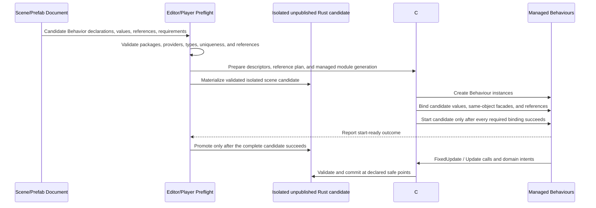

# C# Gameplay Authoring Surface: Parameterless Behaviour over an ECS Kernel

## Conclusion

An ordinary Nara C# author should not need to write a `FixedFrame` or context parameter, explicit
`Read<T>` / `Write<T>` calls, or `ref` merely to implement local gameplay. Parameterless,
compiler-checked lifecycle overrides with normal C# locals remain the leading shell. The following
code is only a syntax probe, however: it does not define where `Motion`, `Transform`, `Projectile`,
or `FireSound` come from and therefore does not select Nara's object or dependency model.

```csharp
public sealed partial class PlayerController : Behaviour
{
    [Export]
    public float MoveSpeed { get; set; } = 8f;

    private float _cooldown;

    protected override void Start()
    {
        _cooldown = 0f;
    }

    protected override void FixedUpdate()
    {
        var movement = Input.Axis2D(GameActions.Move);
        Motion.DesiredVelocity = movement * MoveSpeed;

        _cooldown -= Time.FixedDelta;
        if (_cooldown <= 0f && Input.JustPressed(GameActions.Fire))
        {
            Spawn(Projectile, Transform.Pose);
            Audio.PlayOneShot(FireSound, Transform.Position);
            _cooldown = 0.2f;
        }
    }
}
```

The earlier conversational examples using `Character.Move(...)` and `Weapons.Fire()` have the same
limitation. Unity and Godot do not manufacture such members from their names. They arise from a
specific inheritance, attachment, lookup, or serialized-reference contract. Those examples cannot
serve as a Nara conclusion until that contract is selected.

Hiding callback context is a facade decision, not removal of ECS semantics. The Adapter still needs
phase and tick identity, typed access metadata, callback-entry snapshots, a same-callback write
overlay, phase barriers, bounded structural and service intents, exception policy, and runtime
generation checks. Those contracts belong in generated bindings and the Adapter dispatcher.
Explicit access modes remain appropriate for a separate DOTS-like batch/system layer.

This note does not select a public SDK, accept OQ-007, authorize CoreCLR work, or change an active
plan. The exact accessor representation remains a Trial question.

## One Task, Two Concrete Object Models

Use the same task for comparison: move a 2D player from named input actions and fire a projectile
from a configured muzzle. The important question is not whether both engines can make the code
short. It is where every identifier obtains its type, object instance, ownership, and lifetime.

### Unity: Component lookup and Inspector references

A provenance-complete Unity version can look like this:

```csharp
[RequireComponent(typeof(Rigidbody2D))]
public sealed class PlayerController : MonoBehaviour
{
    [SerializeField] private float speed = 8f;
    [SerializeField] private Weapon weapon = null!;

    private Rigidbody2D body = null!;
    private Vector2 movement;

    private void Awake()
    {
        body = GetComponent<Rigidbody2D>();
    }

    private void Update()
    {
        movement = new Vector2(
            Input.GetAxisRaw("Horizontal"),
            Input.GetAxisRaw("Vertical"));

        if (Input.GetKeyDown(KeyCode.Space))
            weapon.Fire();
    }

    private void FixedUpdate()
    {
        body.linearVelocity = movement.normalized * speed;
    }
}

public sealed class Weapon : MonoBehaviour
{
    [SerializeField] private Projectile projectilePrefab = null!;
    [SerializeField] private Transform muzzle = null!;

    public Projectile Fire()
    {
        return Instantiate(
            projectilePrefab,
            muzzle.position,
            muzzle.rotation);
    }
}

public sealed class Projectile : MonoBehaviour {}
```

`PlayerController` is a user-defined `MonoBehaviour` type. Attaching the script to a `GameObject`
creates a script Component instance; it does not make that instance the player body. `body` is a
separate Component on the same `GameObject`, obtained explicitly through
`GetComponent<Rigidbody2D>()`; the call returns `null` when no match exists. `[RequireComponent]`
adds the dependency when the script Component is added but does not repair existing objects after a
new requirement is introduced. `transform` needs no field because `Component` defines it as the
`Transform` attached to the current `GameObject`. See Unity's
[`Component`](https://docs.unity3d.com/6000.0/Documentation/ScriptReference/Component.html),
[`GetComponent`](https://docs.unity3d.com/6000.0/Documentation/ScriptReference/Component.GetComponent.html),
and [`RequireComponent`](https://docs.unity3d.com/6000.0/Documentation/ScriptReference/RequireComponent.html)
documentation.

`weapon` is not an engine-provided member. It is a declared field whose value is an Inspector-
authored reference to a user-defined `Weapon` Component on the same or another `GameObject`. It
could instead be assigned by `GetComponent<Weapon>()` for same-object composition.
`projectilePrefab` and `muzzle` are also declared references: the former points to the `Projectile`
Component on a Prefab and the latter to a concrete `Transform`. Unity exposes
`UnityEngine.Object` fields as Inspector drop targets, while `[SerializeField]` makes private fields
part of Unity's serialized state. See
[`UnityEngine.Object`](https://docs.unity3d.com/6000.0/Documentation/ScriptReference/Object.html),
[`SerializeField`](https://docs.unity3d.com/6000.0/Documentation/ScriptReference/SerializeField.html),
and [serialization rules](https://docs.unity3d.com/6000.0/Documentation/Manual/script-serialization-rules.html).

`Input` is a static engine service; this example uses the legacy Input Manager, whose axes and keys
are project configuration. `Instantiate<T>` clones the referenced Component's whole `GameObject`,
its Components, and children, then returns the clone's Component wrapper. Active clones receive
`Awake` and `OnEnable` during instantiation. See
[`Input.GetAxisRaw`](https://docs.unity3d.com/6000.0/Documentation/ScriptReference/Input.GetAxisRaw.html),
[`Input.GetKeyDown`](https://docs.unity3d.com/6000.0/Documentation/ScriptReference/Input.GetKeyDown.html),
and [`Object.Instantiate`](https://docs.unity3d.com/6000.0/Documentation/ScriptReference/Object.Instantiate.html).

These values are managed references to Unity object wrappers, not plain C# ownership. Every
`UnityEngine.Object` is linked to a native counterpart; destroying or losing that counterpart can
leave a detached managed object with Unity's special null behavior. An unassigned Inspector field
or failed lookup remains null. During script reload Unity serializes eligible fields, recreates
script Components, and restores their serialized values; old managed-wrapper identity is not the
persistent contract.

### Godot: the script is the CharacterBody2D node

The same task in an ordinary Godot C# scene can look like this:

```csharp
public partial class Player : CharacterBody2D
{
    [Export] public float Speed { get; set; } = 8f;
    [Export] public Weapon Weapon { get; set; } = null!;

    public override void _PhysicsProcess(double delta)
    {
        var direction = Input.GetVector(
            "move_left", "move_right", "move_up", "move_down");

        Velocity = direction * Speed;
        MoveAndSlide();

        if (Input.IsActionJustPressed("fire"))
            Weapon.Fire();
    }
}

public partial class Weapon : Node2D
{
    [Export] public PackedScene ProjectileScene { get; set; } = null!;
    [Export] public Marker2D Muzzle { get; set; } = null!;

    public Node2D Fire()
    {
        var projectile = ProjectileScene.Instantiate<Node2D>();
        projectile.GlobalTransform = Muzzle.GlobalTransform;
        GetTree().CurrentScene.AddChild(projectile);
        return projectile;
    }
}
```

Here `Player` is not a behavior beside a body. The script class inherits `CharacterBody2D` and is
attached as the script of a `CharacterBody2D` scene node. `Velocity` and `MoveAndSlide()` are
therefore inherited bindings on `this`; `Position` and `GlobalTransform` come through its `Node2D`
ancestry. Godot's native `CSharpInstance` stores one owner object and the managed `GodotObject`
stores the native pointer. The direct syntax is a managed/native node binding, not an ECS lookup.
Primary source evidence is in
`repo-ref/godot/doc/classes/CharacterBody2D.xml:2-14,140-146,198-202`,
`repo-ref/godot/doc/classes/Node2D.xml:98-119`,
`repo-ref/godot/modules/mono/csharp_script.h:305-317`,
`repo-ref/godot/modules/mono/csharp_script.cpp:2368-2402`, and
`repo-ref/godot/modules/mono/glue/GodotSharp/GodotSharp/Core/GodotObject.base.cs:13-95`.

`Weapon` is still not automatic. It is a user-defined script attached to another node and assigned
to the exported property in the Inspector. Godot supports direct export of typed Node references;
its source generator emits a `NodeType` hint for members derived from `Node`. A common alternative
is explicit scene-tree lookup in `_Ready()`:

```csharp
private Weapon weapon = null!;

public override void _Ready()
{
    weapon = GetNode<Weapon>("Weapon");
}
```

`GetNode<T>` returns null and logs an error for a missing path, and its generic cast throws for a
wrong type; `GetNodeOrNull<T>` is the non-logging optional form. See
[Godot C# exported properties](https://docs.godotengine.org/en/stable/tutorials/scripting/c_sharp/c_sharp_exports.html),
`repo-ref/godot/modules/mono/editor/Godot.NET.Sdk/Godot.SourceGenerators/ScriptPropertiesGenerator.cs:714-734`,
and `repo-ref/godot/modules/mono/glue/GodotSharp/GodotSharp/Core/Extensions/NodeExtensions.cs:7-82`.

`Input` is Godot's global Input singleton; action names come from the project Input Map.
`ProjectileScene` is an exported reference to a `PackedScene` resource. `Instantiate<T>()`
constructs the serialized node hierarchy but does not attach it to the active tree; `AddChild` is a
separate operation. `_Ready()` is sent after a node and its children enter the tree, while
`_PhysicsProcess(delta)` is the fixed-rate node callback. See
`repo-ref/godot/doc/classes/Input.xml:2-8,347-407`,
`repo-ref/godot/doc/classes/PackedScene.xml:2-25,79-85`,
`repo-ref/godot/modules/mono/glue/GodotSharp/GodotSharp/Core/Extensions/PackedSceneExtensions.cs:7-33`,
and `repo-ref/godot/doc/classes/Node.xml:8-12,83-115`.

`PackedScene` is Godot's serialized scene abstraction, so node structure, scripts, and exported
properties are reconstructed from scene data. Unassigned exported references remain null; invalid
lookups fail as described above. For C# hot reload, Godot serializes script properties, removes old
script instances, creates replacements, and deserializes state into them. Managed object identity
is not the persistent contract (`repo-ref/godot/modules/mono/csharp_script.cpp:753-779,990-1020`).

### What Nara must decide

| Question | Unity answer | Godot answer | Nara question still open |
|---|---|---|---|
| What is `this`? | One script Component attached to a `GameObject` | The managed script instance for one typed Node | Is `Behaviour` only attachment-local state, or also a domain-object facade for its scene entity? |
| Where does movement come from? | Explicit `Rigidbody2D` reference or `GetComponent` | Inherited from `CharacterBody2D` | Required same-entity capability, exported reference, explicit lookup, or a typed behavior base? |
| Where does position come from? | Inherited `Component.transform`; every `GameObject` has one | Inherited only by `Node2D`/`Node3D`-shaped nodes | Is transform universal, role-specific, or acquired like any other capability? |
| Where does `Weapon` come from? | Serialized Component reference or `GetComponent<Weapon>` | Exported Node reference or `GetNode<Weapon>` | How does an author bind another behavior/capability on the same or another scene entity by stable identity? |
| Where does the projectile come from? | Serialized Prefab Component reference; `Instantiate` clones its object | Exported `PackedScene`; `Instantiate` then `AddChild` | What persistent prefab reference is exposed, what does spawn return, and when is the new object visible? |
| What happens when a dependency is absent? | Null lookup/reference; optional add-time `RequireComponent` | Null/log/type failure; editor-authored scene reference | Which dependencies are rejected by generator, scene validation, activation, or nullable runtime lookup? |
| What survives reload? | Serialized fields/references, not old CLR wrapper identity | Packed scene/exported properties and explicit reload state | Which stable scene/attachment IDs restore references, and which private fields are intentionally transient? |

An EnTT-like registry facade would not answer these questions. It would provide another spelling for
`entity.get<T>()`, exposing entity/component/registry vocabulary while leaving attachment,
Inspector references, dependency validation, prefab spawning, and reload identity unresolved. Nara
can keep `bevy_ecs` entirely behind its Adapter, but it still needs an explicit authoring object and
reference model.

Before another public Nara C# example uses `Character`, `Body`, `Weapon`, or a generated property,
the Trial must state:

1. Which package defines the type and which authored scene role or attachment creates its instance.
2. Whether it denotes the current entity, a same-entity capability, another scene entity, an asset
   or prefab, an Adapter-owned behavior instance, or a callback-scoped service.
3. Whether binding is guaranteed by scene schema, declared requirement, generated member,
   Inspector assignment, explicit lookup, or nullable query.
4. Which stable identity is serialized and how missing package, type, or target data round-trips.
5. The object's activation, callback, spawn visibility, invalidation, reload, and destruction
   lifetime.
6. Whether an operation is immediate mutation, a same-callback staged write, or a bounded command
   or service intent, including when another behavior can observe it.

Only after those answers exist can the project compare a Unity-like composition model, a
Godot-like typed-node model, or a Nara-specific generated-capability model on equal terms. The
parameterless callback conclusion does not choose among them.

## Leading Nara Trial Shape

The preferred first Trial hypothesis is explicit dependency declaration, editor binding, and
runtime injection. It borrows Unity's composable script attachments and Inspector references while
requiring stronger preflight than Unity or Godot. It does not make a script inherit a native scene
type, generate members by guessing from a concrete scene, or expose an ECS registry.

The following attributes and member shapes are illustrative. The Trial must evaluate their C# and
editor ergonomics before selecting names or an SDK contract.

```csharp
public sealed partial class PlayerController : Behaviour
{
    [Export]
    public float MoveSpeed { get; set; } = 8f;

    // Required domain capability on the SceneObject that owns this Behaviour.
    [FromOwner, Required]
    private CharacterMotor2D Motor { get; set; } = null!;

    // Inspector-authored reference to another managed Behaviour attachment.
    [Export, Required]
    private WeaponBehaviour Weapon { get; set; } = null!;

    protected override void FixedUpdate()
    {
        var movement = Input.Axis2D(GameActions.Move);
        Motor.Move(movement * MoveSpeed);

        if (Input.JustPressed(GameActions.Fire))
            Weapon.Fire();
    }
}

public sealed partial class WeaponBehaviour : Behaviour
{
    [Export, Required]
    private Prefab<ProjectileBehaviour> Projectile { get; set; }

    [Export, Required]
    private Transform2D Muzzle { get; set; } = null!;

    public void Fire()
    {
        Scene.Spawn(Projectile, Muzzle.WorldPose);
    }
}
```

No identifier in this example is implicit:

| Member | Source and runtime value | Persistent authority |
|---|---|---|
| `PlayerController` / `WeaponBehaviour` | Adapter-private CLR instance created for one validated candidate attachment | Persistent carrier is not selected; the unique-per-type Trial may address it by scene-object identity plus stable Behavior type identity |
| `Input`, `Time`, `Scene` | Instance-bound callback scope supplied by the current Host/runtime generation | Not persistent; project settings and runtime profile configure providers |
| `Motor` | Package-defined `CharacterMotor2D` domain facade bound to a required provider on the owning scene object | Requirement descriptor plus the owner's explicit authoring records |
| `Weapon` | Candidate direct CLR reference resolved to another Behavior instance in the current Player generation | Candidate stable scene-object plus Behavior type reference; exact carrier and any future attachment identity remain Trial choices |
| `Projectile` | Typed prefab asset reference selected in the Inspector | Stable asset identity |
| `Muzzle` | Domain-facade reference to an authored transform-bearing scene object/module | Stable scene-object/module reference |
| `movement` | Ordinary C# local value | None |

`CharacterMotor2D` is defined by a first-party or third-party character/physics package. Its
`Move()` Interface may aggregate transform data, motion intent, grounding observations, collision
policy, and a physics service. It is not generated by copying a Rust `Motion` struct. The managed
facade carries only a resolved binding slot and runtime/callback generation; it owns no Rust pointer
or native physics object.

`WeaponBehaviour` is different: it is a candidate real managed gameplay object created because the
scene composition requests that Behavior type. Under the first Trial's unique-per-type rule, the
target scene-object identity plus stable Behavior type can identify the intended instance; this does
not select a new top-level attachment record or a reusable attachment identity. The persistent
carrier must remain compatible with ADR 0006's explicit component-record authority unless a later
Accepted ADR changes it.

Calling `Weapon.Fire()` as an ordinary synchronous CLR method is a desired ergonomics scenario, not
yet a selected execution contract. The Trial must either close the caller's generated access plan
over every directly callable Behavior and facade, or run managed calls in a conservative serialized
lane whose shared transaction has documented exception, reentrancy, destruction, and visibility
semantics. Each fresh Player or managed-module generation resolves authored semantic references to
its own instances. Holding a managed reference cannot keep the Rust scene object alive or authorize
access after retirement.

### Binding and activation flow



Editor validation should offer an explicit, undoable patch when a required same-object capability
is absent; it must not install persistent ECS data through a hidden runtime hook. Player activation
repeats the validation because project files are untrusted. A missing required reference, ambiguous
provider, incompatible type, unavailable package, or stale generation rejects the candidate before
`Start`; any later binding or startup failure retires the isolated unpublished candidate and cannot
mutate the admitted runtime. Optional runtime discovery must use a visibly nullable lookup instead.

### Alternatives considered

| Shape | Benefit | Cost and current verdict |
|---|---|---|
| Explicit same-object requirement plus Inspector reference | Sources are visible, package-friendly, statically describable, and preflightable | **Preferred first Trial hypothesis**; exact C# syntax remains open |
| `Behaviour<TSelf>` with a typed owner facade | Very compact callback code and strong IntelliSense | Defer until repeated owner-contract pressure exists; risks a second scene type system and single-primary-role bias |
| `Self.Get<T>()` / scene-tree lookup | Familiar to Unity/Godot users and useful for dynamic optional content | Keep as an explicit nullable/dynamic tool, not the default for required dependencies |
| Generate a concrete owner type from each Scene/Prefab | Maximum scene-specific IntelliSense | Reject for the first Trial: scene edits force code generation/rebuild and reduce prefab/package reuse |
| EnTT-style registry/handle facade | Thin implementation and direct data access | Reject for ordinary gameplay: it preserves entity/component/registry vocabulary and solves none of the authoring-reference contracts |

### Trial success criteria

| Criterion | Target evidence |
|---|---|
| Provenance clarity | Every identifier in the movement-and-fire slice is classified as callback scope, same-object requirement, authored reference, asset/prefab, managed Behavior, or local value |
| No default ECS vocabulary | The ordinary slice contains no `World`, `Entity`, component ID, query, `Read`, `Write`, registry, or schedule type |
| Preflight completeness | Missing, ambiguous, unavailable, stale, and incompatible required bindings all reject before `Start` with structured source/scene diagnostics |
| Stable reconstruction | Rename, reparent, prefab remap, fresh Player, and managed-module replacement reconstruct references without persisting CLR objects, paths, or Bevy entities |
| Bounded bridge cost | Property/method count inside a callback does not cause one Rust/CLR crossing per access; extraction and commit costs are measured by touched payload and dispatch batches |
| Nested-call closure | `PlayerController -> WeaponBehaviour` direct calls prove transitive facade/access planning, transaction ownership, exception attribution, reentrancy rejection, and stale/despawn behavior |
| Extension proof | A first-party movement facade and an independent inventory/weapon-style package both use the candidate binding mechanism without core allowlists |
| Test parity | `BehaviourHarness` and the production Adapter run the same binding, missing-dependency, intent, exception, and stale-generation conformance cases |
| Author workflow | One author creates and attaches a Behaviour, binds Inspector references, receives source-aware diagnostics, presses Play/Stop, changes code, and observes either the new generation or an explicit last-good result without author-written Rust |

### Cross-domain promotion gate

The movement-and-fire slice is sufficient to test whether an Adapter-private C# facade is feasible.
It is not sufficient to promote that facade's binding or dispatcher machinery into a shared
Nara-owned public contract. Movement and firing mostly exercise projected state, same-object
capabilities, authored references, synchronous managed calls, and deferred commands. Mature engine
domains also require the following distinct operation shapes:

| Operation shape | Ordinary author example | Hidden contract that differs |
|---|---|---|
| Callback-entry projection | Read current transform, grounded state, input, or animation parameter | Snapshot phase, freshness, copy budget, and same-callback visibility |
| Same-callback staged update | Set desired movement or an animation parameter and read it back | Overlay semantics, validation, conflict policy, and commit point |
| Deferred intent | Spawn an object, play a one-shot sound, or request scene travel | Admission, queue budget, failure, execution stage, and result visibility |
| Bounded synchronous query | Raycast or overlap against the current physics query snapshot | Query freshness, filter/budget, ordering, allocation, and callback-safe execution |
| Typed callback event | Collision/contact, animation marker, UI action, or audio completion | Event payload identity, ordering, retention, reentrancy, and invalidation |
| Asynchronous request/result | Navigation path, streamed content, or another long-running service request | Cancellation, late result, continuation re-entry, pause, generation, and diagnostics |
| Retained logical handle | Stop or fade a voice, inspect a tween, or cancel a path request later | Stable logical identity and lifetime without exposing a backend/native handle |

These rows are analysis categories, not a proposed public enum, universal service trait, or required
method vocabulary. Unity exposes similar differences through APIs such as physics queries and
collision callbacks, Animator state/events, and shared-versus-instance material access. Godot uses
direct-space-state queries, signals, AnimationTree/AnimationPlayer, and Resource/instance override
semantics. Bevy exposes the underlying distinctions through systems, queries, events, commands,
assets, and schedules. Nara may hide that machinery from ordinary C# gameplay, but it cannot make
the semantic differences disappear.

Before a shared Nara binding/dispatcher contract freezes, focused harness tracers should cover:

| Tracer | Minimum pressure case | What it is allowed to decide |
|---|---|---|
| Physics | One fixed-step ray/overlap query plus one ordered contact callback | Query freshness, typed event delivery, and callback transaction interaction |
| Animation | One controller parameter, one marker event, and one root-motion handoff | Control intent, event timing, and cross-domain writer arbitration |
| Rendering | One shared material asset plus one per-instance override observed in Play | Asset/reference identity, instance state, and presentation visibility; no GPU authority |
| Async service | One cancellable navigation or audio-style request with a late result and logical handle | Continuation re-entry, cancellation, generation rejection, and retained identity |

These may be disposable Adapter/harness implementations; they do not require complete physics,
animation, rendering, navigation, or audio products. The first product-shaped C# Trial may still use
an explicitly unstable Adapter-specific SDK. The promotion gate applies when common machinery is
claimed as a reusable Nara contract rather than when feasibility research begins.

### Risks and mitigations

| Risk | Severity | Mitigation |
|---|---|---|
| Domain facade merely mirrors ECS layout | High | Require package-owned semantic methods/stable contracts and prove an internal component split without changing the C# slice |
| Binding metadata drifts from Scene/Schema truth | Critical | Generate one fingerprinted descriptor, validate in Editor and Player, and publish no partially bound runtime |
| Direct managed references outlive targets or generations | High | Resolve per Player generation, stamp lifecycle state, reject stale calls, and keep ownership in the Rust scene/runtime |
| A direct Behavior call reaches dependencies absent from the caller plan | High | Compute a validated transitive call/access closure or use a conservative serialized managed lane; reject unsupported reentrancy before callback execution |
| Ergonomic properties cause per-access FFI | High | Batch extract, execute against managed staging, dirty-track, and batch commit; measure calls and copied bytes |
| Required capability silently mutates persistent composition | High | Use explicit undoable Scene patches and repeat preflight; never rely on hidden Bevy hooks |
| A universal facade kernel is frozen from one package | Medium | Keep bindings Adapter-local until an independent package and test Adapter prove the shared seam |
| Movement-and-fire overfits every operation to properties and deferred commands | High | Run the cross-domain harness tracers before promoting shared binding or dispatcher contracts |
| Operation categories become another universal framework | Medium | Keep semantics and public APIs domain-owned; use the categories only to test that shared machinery leaves each path possible |

This hypothesis selects neither the exact attributes nor whether facades are classes, value handles,
generated partial properties, or another representation. Those implementation choices remain
subject to the Trial's allocation, escape-safety, reload, diagnostics, and ergonomics measurements.
The code uses the candidate public spelling `Behaviour`; architecture prose retains the historical
term `Behavior` until the Trial selects an SDK vocabulary.

## Mature-engine evidence

### Unity separates ordinary Behaviour authoring from explicit data-oriented execution

Unity 6000.5 documents `Start()`, `Update()`, and `FixedUpdate()` as parameterless engine callbacks.
`Component` supplies the implicit current-object context through `gameObject`, `transform`, and
`GetComponent<T>()`; time is obtained from the `Time` API rather than a callback context parameter.
Ordinary local variables and instance fields therefore use normal C# rules.

Unity's Entities layer exposes the complexity at a different level. `SystemAPI.Query` uses
`RefRO<T>` and `RefRW<T>`, while `IJobEntity.Execute` uses `in` for read-only and `ref` for writable
components. Its source generator builds and caches queries and type handles and completes the
required dependencies. This validates a two-level product surface: familiar object-local gameplay
for the default path, explicit access and scheduling for high-throughput ECS work.

Primary sources:

- [Unity event functions](https://docs.unity3d.com/6000.5/Documentation/Manual/event-functions.html)
- [MonoBehaviour.Start](https://docs.unity3d.com/6000.5/Documentation/ScriptReference/MonoBehaviour.Start.html)
- [MonoBehaviour.Update](https://docs.unity3d.com/6000.5/Documentation/ScriptReference/MonoBehaviour.Update.html)
- [MonoBehaviour.FixedUpdate](https://docs.unity3d.com/6000.5/Documentation/ScriptReference/MonoBehaviour.FixedUpdate.html)
- [Unity Component](https://docs.unity3d.com/6000.5/Documentation/ScriptReference/Component.html)
- [Unity script serialization rules](https://docs.unity3d.com/6000.5/Documentation/Manual/script-serialization-rules.html)
- [Entities SystemAPI.Query](https://docs.unity3d.com/Packages/com.unity.entities@1.4/manual/systems-systemapi-query.html)
- [Entities IJobEntity](https://docs.unity3d.com/Packages/com.unity.entities@1.4/manual/iterating-data-ijobentity.html)

### Godot hides context through an object binding, not through an ECS solution

Godot's `_Ready()` is parameterless, while `_Process(double delta)` and
`_PhysicsProcess(double delta)` receive only time. A managed script instance is bound to one native
`Node`; the managed `GodotObject` stores a native pointer, and generated property and method
bindings lower operations back through that pointer. The syntax is direct because `this` supplies
the object context, but native properties may cross the managed/native boundary on each access.

That implementation is not a suitable Nara ownership model. Nara should borrow lifecycle
ergonomics and source generation, but should not create a native-owning CLR wrapper for every ECS
entity/component or permit arbitrary immediate World mutation.

Local primary sources at `repo-ref/godot@c939bf3791ce40ff70e0ee29f06486da1ebb6a84`:

- `repo-ref/godot/doc/classes/Node.xml:83-115`
- `repo-ref/godot/scene/main/node.h:433-437`
- `repo-ref/godot/modules/mono/editor/script_templates/Node/default.cs:9-14`
- `repo-ref/godot/modules/mono/glue/GodotSharp/GodotSharp/Core/GodotObject.base.cs:13-96`
- `repo-ref/godot/modules/mono/editor/bindings_generator.cpp:2819-2841,2913-2926,3558-3562`
- `repo-ref/godot/modules/mono/glue/runtime_interop.cpp:585-597`

## Cross-layer semantic split

| Author-visible construct | State or meaning | Hidden engine contract |
|---|---|---|
| `var movement = ...` | Ordinary callback-local C# value | None beyond normal CLR execution |
| `private float _cooldown` | Behaviour-instance runtime state across callbacks | Instance and Player-generation lifetime; no default persistence or reload migration |
| `[Export] MoveSpeed` | Scene/Prefab authoring value | Stable Schema identity, validation, missing-module preservation, and migration |
| `Time.FixedDelta` | Current fixed-step time | Fixed phase, tick identity, pause/step semantics, and callback scope |
| Domain state such as `Transform.Position` | Package-owned gameplay meaning projected from one or more internal data/service owners | Facade binding, coherent observation, staged update or domain intent, validation, and declared visibility point |
| `Spawn(...)` / `Audio.PlayOneShot(...)` | Direct-looking command or service request | Bounded typed intent, admission/failure semantics, and declared integration stage |

The lifecycle method name already selects the time domain. `FixedUpdate()` therefore does not need a
`FixedFrame` parameter. Collision, input, or other event callbacks may still receive a typed event
payload when the payload itself is the subject of the callback; this does not justify passing a
general World/context object to every lifecycle method.

## Facade and advanced-data representation constraints

The default facade must not be generated by copying the fields of a Rust component. It can still
expose value-like domain properties, so C# copy behavior remains relevant: returning an ordinary
struct by value is not sufficient when authors expect nested mutation. C# reports CS1612 when code
tries to modify a member of a value returned from a property because the value is a copy. Even when
code compiles through a local copy, mutating that copy does not update its source unless assigned
back. See [CS1612](https://learn.microsoft.com/en-us/dotnet/csharp/language-reference/compiler-messages/cs1612).

The Trial should compare callback-scoped domain-facade representations, including:

1. A reusable managed proxy whose property setters write a managed staging overlay.
2. A generated lightweight access handle, potentially returned through a generated ref-valued
   property internally, whose copies still address the same staging slot.
3. A hydrate-and-diff domain value only if its copy, alias, allocation, and dirty-tracking behavior
   remains unsurprising.

Where a package chooses property semantics, the author should be able to write
`Transform.Position += delta` without author-written `ref`. If a package also supports copying the
facade into a local variable, `var transform = Transform; transform.Position += delta` must retain
the same documented meaning. A facade must not hold a Rust pointer, Bevy `Entity`, GPU handle, or
native ownership. It must carry a callback/runtime epoch and reject access after the callback or
runtime generation ends. A separate advanced data layer may expose raw Schema-derived values and
explicit access modes, but its representation cannot define the ordinary Behavior Interface.

Roslyn source generators are additive: they can add partial declarations, accessors, descriptors,
and dispatch code, but cannot rewrite an existing user method body. Scope binding therefore belongs
around the virtual callback in generated/base dispatch code. See the
[source generator overview](https://learn.microsoft.com/en-us/dotnet/csharp/roslyn-sdk/source-generators-overview)
and [partial classes and members](https://learn.microsoft.com/en-us/dotnet/csharp/programming-guide/classes-and-structs/partial-classes-and-methods).

## Dispatcher model

A plausible first Trial dispatcher is:

1. Resolve a stable Behaviour type and its generated binding descriptor.
2. Validate the transitive set of required facade providers and directly callable Behaviors.
3. Extract bounded domain projections in batches by Behaviour type and phase.
4. Bind one managed callback scope containing scene-object identity, time/input views, facade
   staging, and command/service intent buffers.
5. Invoke parameterless callbacks and admitted direct Behavior calls without per-property native
   calls.
6. Record facade setters and methods in a same-transaction overlay or typed domain intent so a
   getter observes the Interface's documented prior update.
7. On success, validate and commit updates/intents at the declared visibility point; on exception,
   apply the selected atomic rejection/fault policy.
8. Clear the scope in `finally`, advance its epoch, and reject stale access.

The first implementation may conservatively close over all bound facade providers and directly
referenced Behaviors and serialize one coarse Adapter transaction lane. That is an acceptable
default-Behaviour tradeoff if measured. It must not be disguised as free parallelism. A later
optimized dispatcher may use generated static access/intent manifests, while opaque or dynamic
access stays conservative. Raw component read/write planning belongs only to the explicit advanced
data counterfactual.

## State, async, and testing rules

- Private instance fields are valid local gameplay state, but they are not automatically Scene,
  Save, checkpoint, replication, Inspector, or hot-reload state. A future explicit state contract is
  required for each such capability.
- `async void Start/Update/FixedUpdate` should be rejected by an analyzer. Callers cannot await it or
  reliably observe its exceptions; Microsoft limits `async void` to event-handler-shaped cases.
  See [async return types](https://learn.microsoft.com/en-us/dotnet/csharp/asynchronous-programming/async-return-types#void-return-type).
- Callback-scoped facades and advanced data views must not cross `await`, thread, callback, or
  Player-generation boundaries.
  Language restrictions can prevent some escapes, but runtime epoch/thread checks and analyzer
  diagnostics are still required.
- A `BehaviourHarness` can bind the same generated callback scope to test time, input, facades,
  domain projections, staged updates, intents, exceptions, and stale-access failures. Advanced-data
  views require their own explicit conformance cases. Parameterless callbacks do not prevent
  dependency injection when the dependency boundary is the dispatch scope.

## Relationship to current Nara authority

This direction is compatible with the current documents:

- OQ-007 already targets a Unity/Godot-like facade but leaves lifecycle, data, and scheduling details
  open (`docs/architecture/open-questions.md:67-184`).
- ADR 0093 forbids unrestricted mutable World/backend access and keeps Adapter lifecycle and private
  execution state Adapter-owned (`docs/architecture/adr/0093-rust-authoring-hot-iteration-and-optional-scripting-adapters.md:94-117`).
- ADR 0081 permits a concrete Adapter projection while requiring stable IDs independent of CLR type
  and member names (`docs/architecture/adr/0081-schema-source-stable-identity-catalog-and-runtime-binding.md:32-85`).

The earlier `FixedUpdate(FixedContext game)` plus `game.Read/Write` example in the LogLog research is
an illustrative semantic probe, not an accepted public API. Its usefulness is that it exposed the
required hidden contracts. Its ergonomics should not be treated as the default C# product target.
