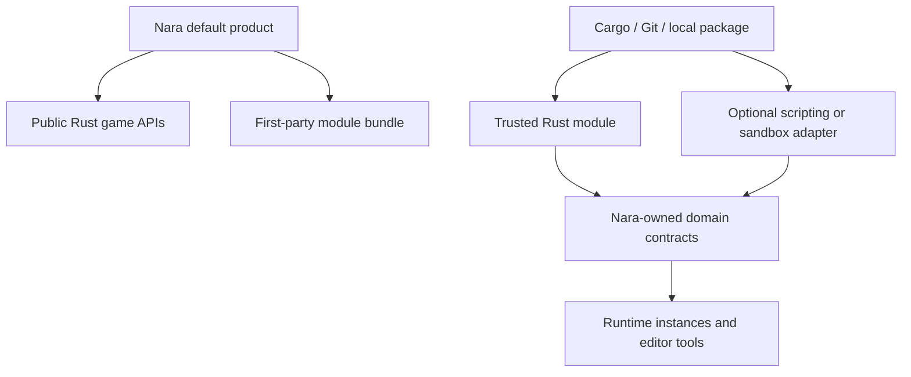

# Decision

Rust is Nara's official and complete game-authoring language. A game must be able to use public
Rust APIs for gameplay, project types, editor integration, debugging, headless tests, packaging,
and release without depending on engine-private hooks or a second language runtime.

Nara is an integrated product built from explicit modules:

- the first-party default combination prioritizes a coherent production experience;
- crates and plugins keep narrow ownership and dependency boundaries so supported modules can be
  used independently or replaced through documented contracts;
- modularity does not imply that every module works with every external engine without adaptation;
- trusted Rust modules initially use Cargo source integration and static linking;
- local paths, Git dependencies, and Cargo registries are the near-term package transports;
- a Nara-specific registry, marketplace, signing system, and package governance layer require
  concrete gaps that those transports cannot solve.

Scripting is an optional extension category rather than a core product requirement. A package such
as a future `nara_luau` may provide reloadable gameplay for teams that want it, and it may be
first-party and well supported without becoming a required dependency or a second official author
language. C#, Rhai, Wasm, and other runtimes remain possible adapters owned by their packages.
Nara will not freeze a universal language-neutral Behavior Host before a real adapter demonstrates
which lifecycle, data-access, debugging, and reload contracts actually need to be shared.

Wasm is not the default plugin ABI. It remains an option for a concrete sandboxing, portability,
server-extension, or mod requirement. Nara also does not promise a stable Rust dynamic ABI; normal
trusted modules rebuild and relink with the game until measured production pressure justifies a
narrow dynamic boundary.

# Context

AI coding agents reduce the cost of writing Rust, but they do not remove compilation, linking,
ABI, debugger, GC, runtime-hosting, AOT, or platform differences. Maintaining two official author
languages would multiply editor integration, diagnostics, documentation, packaging, and semantic
compatibility work before Nara has proven one complete production path.

Bevy demonstrates the value of composable Rust crates. Unity, Godot, and Unreal demonstrate the
value of a coherent product and a unified installation experience over several contribution types.
Nara needs both lessons: explicit modules underneath, a well-tested default product above, and no
requirement that one execution technology represent every extension.

# Alternatives

- **Make Rust and Luau or C# coequal official author languages now.** Rejected because it doubles
  the product surface before the Rust workflow and reference game are complete.
- **Make Wasm the universal extension ABI.** Rejected because Wasm does not supply gameplay
  scheduling, editor integration, debugging, migration, host APIs, or native/browser parity by
  itself.
- **Ship only independent crates and leave integration to users.** Rejected because maximum module
  independence does not solve the production workflow problem Nara is intended to address.
- **Use Rust as the complete path and add optional adapters through packages.** Chosen because it
  keeps one accountable product path while preserving future language and trust-model choices.

# Success Metrics

| Metric | Target | Measurement |
|---|---:|---|
| Complete Rust path | 100% of the reference game's production code uses public Nara/Rust APIs | Reference-game dependency and API audit |
| Core runtime independence | Default and minimal builds contain no scripting VM dependency | Cargo feature-tree checks |
| Module integration | One supported module can be added or replaced without engine-private edits | Clean-room integration task |
| Package reproducibility | Local, Git, and registry dependencies resolve from a committed lockfile on a clean machine | Windows/Linux build checks |
| Adapter isolation | Any scripting adapter can be disabled without changing project formats unrelated to that adapter | Optional-feature and fixture tests |

# Risks and Mitigations

| Risk | Severity | Likelihood | Mitigation |
|---|---|---:|---|
| Rust compile latency harms iteration | High | High | Measure change classes separately and combine data reload, compatible patching, incremental rebuild, runtime restart, and state restoration. |
| Rust-first narrows initial adoption | Medium | High | Serve complete Rust teams first while keeping editor/data workflows usable by artists and designers and adapters possible as packages. |
| Static linking makes plugins feel heavy | Medium | High | Provide package templates, feature diagnostics, cached builds, and explicit rebuild/restart UX before designing a dynamic ABI. |
| Product bundles couple every crate | High | Medium | Enforce dependency-direction tests and domain-owned contracts; product defaults may compose modules without transferring their ownership. |
| Optional adapters fragment game semantics | High | Medium | Let concrete adapters reuse stable domain APIs where appropriate; standardize only behavior proven common by multiple consumers. |

# Consequences

- Rust is not merely an engine-internals or performance-hotspot escape hatch; it owns the complete
  supported game path.
- The reference game is allowed and expected to implement gameplay in Rust, provided it uses public
  APIs and records iteration evidence.
- A first-party `nara_luau` package can be explored for logic reload without making the core engine
  or every project depend on Luau.
- Script adapters may expose different language-appropriate authoring APIs. A shared host contract
  is extracted only when multiple real adapters or host services need the same semantics.
- Package UX may eventually unify discovery and lifecycle across contribution types, but Cargo,
  Git, and local dependencies remain the implementation baseline.
- Ecosystem success is judged by whether developers can build, integrate, and ship games, not by
  whether Nara has a technically unique plugin mechanism.

# Citations

- [Nara strategy](../../../../../STRATEGY.md)
- [Reference-game production proof](2026-07-12T003130Z-use-the-brotato-like-reference-game-as-a-production-proof-1e9cf73b7f144e05bed780c0f84bf7a1.md)
- [ADR 0021: Rust Authoring, Hot Iteration, and Optional Scripting Adapters](../../../../architecture/adr/0021-scripting-and-wasm-boundary.md)
- [Unity packages](https://docs.unity3d.com/6000.0/Documentation/Manual/Packages.html)
- [Godot editor plugins](https://docs.godotengine.org/en/latest/tutorials/plugins/editor/making_plugins.html)
- [Unreal Engine plugins](https://dev.epicgames.com/documentation/en-us/unreal-engine/plugins-in-unreal-engine?application_version=5.6)
- [Typst plugins](https://typst.app/docs/reference/foundations/plugin/)
- [Extism plug-in concepts](https://extism.org/docs/concepts/plug-in)
