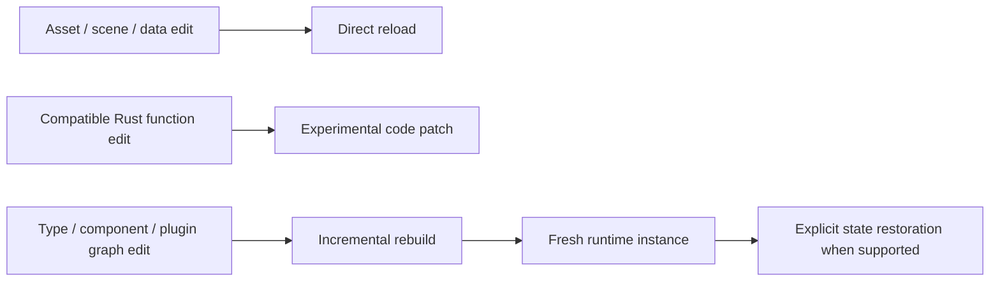

# Decision

Nara will use one open-source Brotato-like 2D arena-survival game as an end-to-end
production proof rather than as a feature showcase or synthetic runtime benchmark.
The project will be distributed through source control and Windows/Linux release
artifacts; Steam publication is not part of the proof.

The game is expected to implement gameplay in Rust through Nara's public APIs. It
must also use public project, asset, scene/prefab, editor, runtime UI, audio, save,
diagnostic, test, and export workflows. Engine-private hooks, reference-game-only
shortcuts, or unreported patches to Nara invalidate the affected evidence.

Representative game types include characters, enemies, weapons, projectiles,
items, status effects, waves, loot, and balance data. Rust owns typed gameplay and
performance-sensitive systems; inspectable project data and assets own values that
designers should tune without recompiling code. The game must exercise dense
short-lived entities, fixed-tick behavior, pause and exact stepping, command
recording/replay, structured diagnostics, save/schema evolution, isolated Play
Mode, and clean Windows/Linux standalone export. The same gameplay must support a
headless automated-test path through semantic commands; networking is not required.

Iteration evidence is recorded by change class:

The proof does not require one mechanism to handle every edit. It requires Nara to
classify the edit, choose a safe path, report what happened, and measure the time
until the result is visible.

# Context

Nara has many architecture decisions and runtime crates but no representative game
demonstrating that those contracts form a coherent Rust production workflow. A
small embedding demo can prove that a renderer or ECS mechanism runs, but it cannot
prove productive game development, debugging, iteration, modular composition, or
delivery.

A Brotato-like game has enough project data, entity density, behavior composition,
feedback systems, and balance iteration to pressure the current architecture while
remaining feasible for one engine author. Keeping one reference game avoids
turning validation into several unfinished genre prototypes.

# Alternatives

- **Treat the game as a runtime performance demo.** Rejected because frame rate
  alone does not validate authoring, debugging, iteration, modularity, or export.
- **Use private engine APIs to finish the game faster.** Rejected because it would
  validate the engine author's access rather than Nara's supported product surface.
- **Require a non-Rust gameplay layer.** Rejected because Rust is Nara's complete
  official author language and an optional adapter should be validated separately.
- **Expand the first proof across several genres and platforms.** Rejected because
  it would make completion unlikely and blur which hypothesis each slice validates.

# Success Metrics

The project records at least:

- time from a clean project to first playable;
- P50 and P95 edit-to-result latency for data, compatible function-body, and
  structural Rust changes, with fallback paths reported;
- cold and incremental build/export time;
- percentage of game production code and workflows using public APIs;
- time to add one external module and replace one supported first-party module;
- frame-time P99, memory, task pressure, and service-boundary overhead;
- deterministic command replay checks and headless parity;
- whether structured errors identify the project source and corrective action;
- clean-machine Windows/Linux builds and player installation without requiring
  Rust, Cargo, or a Nara checkout on the player's machine.

Exact latency and runtime acceptance thresholds will be set after the first
instrumented vertical slice establishes a baseline. Where feasible, comparable
authoring tasks will be repeated in current Bevy, Fyrox, Godot, or Unity workflows;
microbenchmarks are not substitutes for task-level comparison.

# Risks and Mitigations

| Risk | Severity | Likelihood | Mitigation |
|---|---|---:|---|
| The engine author unconsciously uses private knowledge | High | High | Audit dependencies and APIs; document every setup step; later repeat focused tasks with an external developer. |
| The game becomes a bespoke engine branch | High | Medium | Keep it in a normal consumer layout and reject reference-game-only engine paths. |
| Hot-patching work delays the game | High | Medium | Treat patching as an experiment with measured fallback to incremental rebuild and runtime restart. |
| One genre distorts the general engine | Medium | High | Generalize only cross-cutting contracts; label genre-specific helpers as game or optional modules. |
| The proof expands into every engine domain | High | High | Retain the explicit non-claims below and schedule separate probes only after the game ships. |

# Consequences

This reference game does not prove high-end 3D rendering, complex physics,
networking or rollback, browser/mobile/console delivery, open-world streaming,
colony-scale persistence, mature mod security, scripting-adapter quality,
multi-team collaboration, external learnability, or general Unity-level
productivity. Those claims require later focused probes or external-team evidence.

The game remains a cross-cutting acceptance fixture throughout implementation
rather than a project started only after the engine architecture appears complete.

# Citations

- [Nara strategy](../../../../../STRATEGY.md)
- [Rust-first extension decision](2026-07-11T163345Z-defer-extension-technology-selection-behind-a-unified-package-experience-7f435154e74e45359c661b98d145d693.md)
- [Nara foundation](../../../../architecture/nara-foundation.md)
- [Godot demo projects](https://github.com/godotengine/godot-demo-projects)
- [Unity sample projects](https://unity.com/demos)
- [Unreal Engine Lyra sample game](https://dev.epicgames.com/documentation/en-us/unreal-engine/lyra-sample-game-in-unreal-engine)
