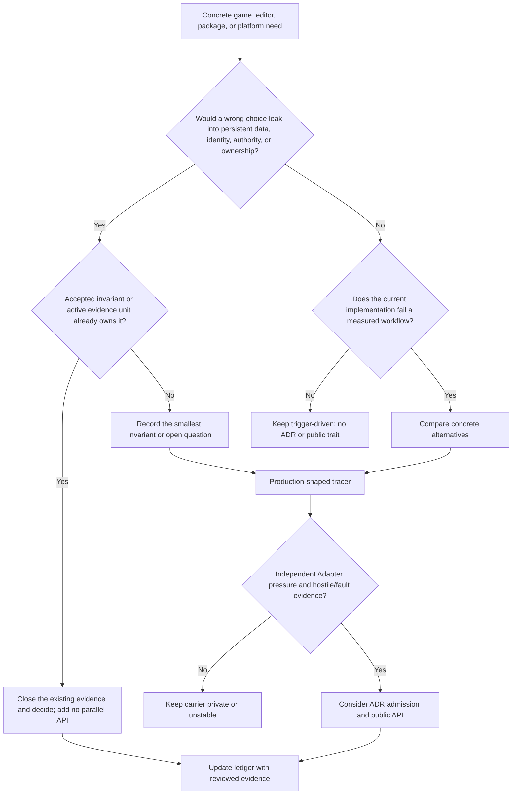

# Bevy and Godot Evidence for Nara's Remaining Early Architecture Decisions

**Status**: Research note. This file is evidence, not implementation authority.

## Question

After the existing extension, render, UI, Host, asset, schema, scene, build, and observability
design work, what is still worth designing early enough to avoid a costly future rewrite?

## Authority and Evidence Boundary

This review follows Nara's documented authority order: Accepted ADRs are durable decisions, the
implementation ledger is implementation truth, the active RGF plan owns execution order, open
questions own unresolved triggers, and design harnesses remain non-normative. A Proposed ADR is
therefore discussed only as a candidate awaiting its stated admission evidence. [N1][N2][N3]

The Nara worktree was concurrently modified during this review. Nara paths below describe the
current authority/evidence snapshot at `HEAD` `559a54d`; they do not convert dirty implementation
or draft text into an implemented claim. Bevy and Godot facts are bound to the commits in the
frontmatter and cite engine-owned source paths and symbols. [N1][N3]

This is deliberately an **incremental** review of the existing
`extension-ecosystem-engine-research.md` and the source-package, multi-role, render, and UI design
harnesses. It does not repeat their cross-engine feature matrices. [N4][N5]

## Executive Verdict

Nara's overall direction is sound and already covers most high-cost boundaries. The mature-engine
evidence does **not** justify another broad ADR family, a universal extension kernel, a public Host
trait, a public render graph, a native plugin ABI, or a shared runtime/editor UI toolkit now.

Five incremental conclusions matter most:

1. **Finish the runtime/Host ownership decision before spreading the pattern.** Bevy transfers the
   whole `App` into its selected runner, while Godot's OS owns one selected `MainLoop` and performs
   explicitly ordered shutdown. These are different mechanisms with the same lesson: publication,
   drive, fault, and retirement form one ownership problem, not ordinary plugin configuration.
   [B1][B2][G1][G2] Nara already has the right evidence program in RGF-U5/U24/U25/U23; the next
   action is closure and an independent accept/reject decision for Proposed ADRs 0082/0084, not a
   third Host abstraction. [N3][N6]
2. **Keep schema identity, semantic validation, editor presentation, and custom editor behavior as
   four different planes.** Bevy's registry is extensible through per-type `TypeData`, while Godot
   combines type, usage, hint kind, and a string hint payload in `PropertyInfo`. [B6][G7] Nara's
   stable component/field IDs and capability gates are a stronger persistence base, but the current
   schema has no proven vocabulary for units, ranges, enum choices, resource kinds, or presentation
   preferences. [N7] Preserve room for typed domain metadata, but do not freeze a generic metadata
   map or copy Godot's `hint_string` protocol before a reference-game inspector needs it.
3. **Package removal and editor-contribution withdrawal need explicit Host-owned transactions.**
   Existing drafts cover removal preview and degraded authoring, but do not yet distinguish Cargo
   dependency removal, provider deactivation, derived-cache collection, package-owned immutable
   content, and user-modified copied templates. [N5][N8] Godot exposes paired add/remove methods
   for importers, inspectors, and docks, and its disable hook tells plugin code to clean up project
   effects; `EditorNode::remove_editor_plugin` does not centrally undo every child registration.
   [G3][G4] Nara should improve on that convention: one Editor catalog generation should own and
   withdraw all registrations, while deletion of installed files requires recorded ownership and
   modification evidence.
4. **Public schedule labels and sets need one compatibility policy before third-party packages
   depend on them.** Bevy exposes ordered main schedule labels and semantic render/core-pipeline
   `SystemSet` values, while `before`/`after` document deferred-command insertion and the fact that
   cross-schedule or absent-set ordering is ineffective. [B11] Nara already exposes
   `FixedUpdateSet`, `GameplayCommandSet`, and `InputSet`, but Accepted ADRs 0003/0046 do not state
   one shared rule for which labels/sets are public anchors or what each anchor guarantees. [N13]
   Record the invariant in an existing ADR: extensions order against public semantic anchors, not
   first-party system functions, and each anchor documents producer/consumer, deferred-flush,
   skip, and error behavior.
5. **Persistent component composition must not be inherited accidentally from Bevy ECS.** Nara's
   `Component` derive accepts `#[require]`, the ECS facade exposes lifecycle hooks and observers,
   and scene codecs ultimately insert native components into the target `World`; however, the
   stable schema catalog does not record a required-component closure. [B12][N16] A Rust-local
   requirement or synchronous hook must therefore not silently become durable scene semantics.
   If Nara admits component requirements, their stable-ID closure belongs to a catalog generation
   and fingerprint, while hook side effects remain outside rollback claims unless a narrower
   transaction contract proves otherwise.

## Incremental Decision Map

| Domain | Mature-engine mechanism, not a feature checklist | Nara coverage and remaining delta | Class | Minimum next document action |
|---|---|---|---|---|
| Package and plugin freedom | Bevy `Plugin::build` receives `&mut App`; groups are process-local `TypeId` entries with explicit order, and `WinitPlugin` replaces the runner. Godot separates `EditorPlugin` child contributions from staged GDExtension initialization. [B1][B2][B3][G3][G5] | Accepted ADRs 0010/0046 and OQ-031 already separate runtime plugins, package discovery, typed contributions, and native authority. [N3][N9] The missing proof is supported-role reachability and coherent withdrawal, not more ambient power. | Preserve a seam now | Add package removal and catalog-withdrawal scenarios to the existing source-package/multi-role harness when that harness is next activated; do not create a package API or ADR now. |
| Runtime Host | Bevy `App::run` moves the App into a one-shot runner. Godot selects one `MainLoop`, attaches it to `OS`, drives physics/process centrally, then destroys services in dependency order. [B2][G1][G2] | Proposed ADRs 0082/0084 and active RGF units already target this boundary; 0084 remains partial with a source-bound review gate. [N3][N6] | **Must decide now** | Close RGF-U5 P1 findings, run U24/U25 counterevidence, then independently accept, revise, or reject 0082 and 0084 at U23. Freeze invariants, not a universal trait. |
| Schedule/set compatibility | Bevy publishes `MainScheduleOrder`, `RenderSystems`, and `Core2dSystems`/`Core3dSystems`; `IntoScheduleConfigs::before`/`after` define deferred visibility and warn that missing or cross-schedule targets do not order execution. [B11] | Nara has public typed schedules/sets and extension tests, but ADRs 0003/0046 do not classify stable semantic anchors versus first-party implementation detail or require a lifecycle contract per anchor. [N13] | **Must decide now** | Add a compact policy to an existing Accepted ADR at its next owned revision; no new ADR. Require semantic purpose, producer/consumer, deferred flush, skip/error, and composition-owned cross-domain order. |
| Asset identity and import | Bevy distinguishes path/source/label, runtime index/UUID IDs, strong handle lifetime, tracked loader dependencies, labeled outputs, and processed dependency hashes. Godot maintains `ResourceUID` path mapping and importer format/options/generated-file contracts. [B4][B5][G6][G8] | Accepted ADRs 0007/0033 cover stable asset identity and import/render preparation; Proposed 0083/0087 cover durable moves, product identity, tracked dependency closure, and atomic publication. [N3] | Preserve a seam now | Keep runtime `AssetId`, source path, stable source ID, product ID, artifact generation, and package ownership evidence distinct. Admit 0083/0087 only through their named move/multi-product fixtures. |
| Schema and reflection | Bevy's `TypeRegistry` keys native registrations by `TypeId` and type path and attaches behavior as `TypeData`. Godot `PropertyInfo` carries type/name/hint/hint string/usage; inspector plugins can replace editors for properties. [B6][G7][G9] | Accepted 0011/0045/0081 establish durable IDs, capability gates, catalogs, and native binding; current `ComponentFieldSchema` contains kind, required/default, capabilities, and IDs, but no proven authoring constraint/presentation model. [N3][N7] | **Must preserve the distinction now; shape later** | At the next triggered OQ-033 or inspector revision, explicitly separate persistence/capability, semantic constraints, presentation preferences, and custom provider bindings. No open metadata bag and no new trait now. |
| Component composition and lifecycle | Bevy recursively inserts required components and synchronously invokes component hooks; Godot obtains object completeness through its Node inheritance/lifecycle model. [B12][G20] | Nara intentionally rejects a Node object hierarchy, but its derive/facade expose the Bevy mechanisms while scene documents and schema fingerprints record only explicit stable components. [N16] | **Must constrain now; shape later** | State that Bevy-local requirements/hooks are not durable authoring semantics by default. Add one focused OQ before an editable Sprite/Camera workflow chooses explicit validation, catalog-backed expansion, or authoring presets. |
| Scene, prefab, and editor | Bevy's current BSN scene work is code-first composition with field patching and immediate/queued resolution; it explicitly describes file assets as future work. Godot `PackedScene` records node owner/instance/edit state and can pack/instantiate a scene. [B7][G10] | Accepted 0006/0026/0034/0038/0047 already separate documents, patches, provenance, undo, workspace, and isolated Play. Proposed 0083/0089/0090/0091 cover the remaining durable identity, runtime scene lifecycle, missing schemas, and crash/concurrent persistence. [N3] | Preserve a seam now | Do not replace Nara documents with Bevy runtime scenes or Godot node ownership. Gate durable entity/subobject identity before non-disposable reference-game content grows; otherwise follow proposal triggers. |
| Render | Bevy uses a mutable render `SubApp`, extraction schedule, render world, graph, and optionally moves the render SubApp across a bounded channel. Godot exposes a central `RenderingServer`/renderer creation boundary. [B8][G11] | Accepted ADR 0094 deliberately keeps a static plan, owned backend-neutral transfer target, and serialized wgpu authority; the render harness marks Family/Feature/graph/interop/Host types as candidates. [N10] | Trigger-driven later | Keep OQ-001/OQ-022 triggers. Do not activate the render parity plan until its recorded handoff/release gate. No public graph or `RenderApp` clone now. |
| Runtime and Editor UI | Bevy has separate ECS UI, input-focus/dispatch, and accessibility plugins. Godot's editor is built from engine `Control`/`Container` UI while specialized editor extension points remain separate. [B9][G12] | Accepted 0025/0041 and the UI draft already separate runtime UI from toolkit-agnostic tooling and early egui adapters, with dogfooding gated by evidence. [N3][N11] | Trigger-driven later | Let text, focus/navigation, accessibility, and one mature editor panel drive slices. Do not decide one shared widget tree or immediate/retained mode for both products now. |
| Build, cook, export | Godot has separate export preset, platform, and export-plugin roles; presets select resource filters and platforms own target export. [G13] Bevy's inspected core plugin lifecycle is runtime composition, not an integrated export product. [B1] | Proposed 0086/0087/0088 and OQ-011 already separate Cargo executable generations, imported products, target cooking/catalogs, and platform/store steps. [N3][N9] | Preserve a seam now | Keep source, executable generation, imported artifact group, cooked member, package/catalog, and signing/store Adapter distinct. Use RGF-U7 evidence; freeze no exporter trait. |
| Diagnostics and profiling | Bevy stores sampled diagnostics separately from tracing spans. Godot has `Performance` custom monitors, debugger/profiler registration, and platform crash handlers. [B10][G14][G15] | Accepted 0048/0068 keep bounded structured diagnostics distinct from high-volume observation; OQ-025 owns profiling/crash/telemetry. [N9] | Trigger-driven later | Preserve correlation IDs across runtime/build/catalog/device/tick/frame generations, but wait for a measured regression or crash before choosing trace, profile, or crash-artifact carriers. |
| Platform and services | Bevy's Winit adapter installs the runner and translates resume/suspend around schedule execution. Godot uses selected display/server implementations and `MainLoop` lifecycle notifications. [B3][G16][G17] | Accepted 0013/0039/0042/0078 and OQ-023/OQ-038 already separate adapter events, Host safe points, gameplay pause, service sessions, and driver shape. [N3][N9] | Preserve a seam now | Keep normalized lifecycle drafts and generation-scoped services. A second production adapter plus clean-room host integration must choose the shared driver shape; no global service locator. |

## What Must Be Decided Now

### 1. Runtime Publication and Retirement Invariants

This is the only broad decision currently urgent. Future Editor Play, build activation, platform
drivers, render targets, task pools, package updates, and server runtimes all inherit the answer.
Bevy's runner freedom proves that whole-App ownership is a real escape hatch, but it also lets a
plugin such as `WinitPlugin` replace process driving during `build`. [B2][B3] Godot proves that a
coherent product can instead centralize drive and teardown around a selected `MainLoop`, with
ordered server shutdown that explicitly states order matters. [G1][G2]

Nara should decide the following invariants through the existing RGF evidence, without deciding a
public trait:

- one authority owns an unpublished candidate from first side effect through failure retirement;
- publication transfers every close/fault/service obligation exactly once;
- a failed or incomplete close remains owned and blocks conflicting replacement;
- platform driving cannot outlive surface/service retirement prerequisites;
- ordinary plugins cannot silently replace the product runner, while a documented top-level
  embedding/Host role remains capable of doing so;
- Editor, desktop, and headless paths construct the same runtime semantics without forcing the
  ordinary user to understand Host vocabulary. [N3][N6]

The implementation ledger already says the current trial has open correction findings. No later
architecture should cite Proposed ADR 0084 as settled until that gate and U23 admission complete.
[N3]

### 2. Public Schedule and System-Set Compatibility

Bevy uses public schedule labels and semantic system sets as extension ordering anchors.
`MainScheduleOrder` owns the ordered top-level schedule list; render exposes named preparation,
queue, render, and cleanup sets; core 2D/3D expose coarse pipeline sets. [B11] The generic
`before`/`after` API also makes two non-obvious semantics explicit: deferred operations may be
flushed at the edge, and an absent target or target in another schedule does not create the desired
ordering. [B11]

Nara already proves that external domains can define typed schedules/sets and exposes several
first-party sets. [N13] Before packages treat every public enum variant as permanent compatibility,
an existing ADR should state:

- only explicitly documented semantic `ScheduleLabel`/`SystemSet` values are compatibility anchors;
- concrete first-party system functions, private sub-sets, and incidental registration order are
  implementation details unless separately documented;
- each public anchor states its producer inputs, consumer-visible outputs, deferred-command flush
  boundary, skip/run-condition behavior, failure/fault behavior, and transient cleanup relation;
- a domain owns its internal ordering; the product composition root explicitly declares cross-domain
  ordering and validates that both anchors are installed in the intended schedule;
- adding an anchor is cheap, but renaming, splitting, merging, or changing its semantic completion
  point is a compatibility change and needs a migration note before 1.0 consumers scale.

This is an invariant/documentation correction, not a request for a new scheduler wrapper, global
stage enum, or public access to every first-party system.

### 3. Four Schema Metadata Planes

The durable distinction should be recorded before editor metadata starts accumulating, even though
the concrete Rust carrier should remain deferred:

| Plane | Stable question | Example | Owner |
|---|---|---|---|
| Persistence and eligibility | May this field appear in scene/save/inspect/edit/replicate data? | `edit`, `scene`, `asset_ref` | `nara_reflect` plus domain policy |
| Semantic validation | What values mean the same thing across CLI, Editor, AI, import, and migration? | unit, finite range, enum/flag domain, asset kind | Schema-owning domain |
| Presentation preference | How may a particular UI present a valid semantic value? | slider preference, grouping, compact color control | Tooling/UI Adapter |
| Custom interaction | Does a coordinated workflow require a custom editor and lowering logic? | animation range/preview editor | `nara_tooling` provider catalog |

Godot's `PropertyInfo::hint_string` demonstrates the ergonomic attraction of mixing these planes,
including ranges, enums, file filters, resource types, and UI preferences in one string payload.
[G7] Nara should not copy that representation. Bevy's attachable `TypeData` shows a more open
native extension mechanism, but its process-local `TypeId` registry is not a durable schema or
cross-process contract. [B6]

The minimum action is a clarification in the existing OQ/design harness when a real inspector field
needs this vocabulary. Until then, aliases must not become display labels with persistence meaning,
capability flags must not become widget hints, and an untyped metadata map must not enter the
canonical catalog.

### 4. Continuous Authoring Interaction Transactions

Accepted ADR 0026 says one user action creates one patch transaction and one inverse, but it does
not define a long-running slider, gizmo drag, curve edit, or text composition. The UI design draft
does describe `Begin -> Preview -> Commit/Cancel`, but a draft cannot make that lifecycle durable.
[N14] Godot's `UndoRedo::MERGE_ENDS` and its repeated use by Inspector, animation, audio, and remote
editing demonstrate that continuous interaction is product semantics rather than a toolkit detail.
[G18]

The next owned revision of ADR 0026 should preserve only the minimum invariant:

- begin captures stable targets, base document revision, authorization scope, and restorable state;
- updates publish bounded, cancellable preview state and do not add undo entries;
- commit emits one validated atomic patch plus inverse;
- cancel, capture/focus loss, window close, target deletion, and revision conflict restore or
  reject explicitly rather than silently committing a partial edit;
- first-party and third-party inspectors, gizmos, and graph tools use the same command path.

This does not require a public gesture trait, toolkit event model, or preview storage format now.

### 5. Persistent Component Composition and Hook Boundary

Bevy required components are recursive, reject cycles, and run through the same insertion machinery
that invokes component hooks. Those hooks receive `DeferredWorld`, can mutate resources, and can
enqueue work beyond the inserted entity. [B12] Godot solves a related completeness problem through
`Sprite2D -> Node2D -> CanvasItem -> Node` aggregation and ordered tree notifications, which Nara
correctly does not copy. [G20]

Nara currently has a sharper document model but an unowned interaction between layers:

- `nara_ecs_derive::Component` accepts `#[require]`, and `nara_ecs` exposes lifecycle/observer APIs;
- `ComponentSchemaCatalog` has no stable component-composition closure in its fingerprint;
- `ComponentApplyBatch` commits by native `World` insertion;
- scene rollback despawns the newly allocated entities, which cannot reverse an arbitrary hook's
  mutation of an existing resource or another entity. [N16]

The safe early rule is not to ban useful ECS mechanisms. It is to state that a Bevy-local
`#[require]`, hook, or observer is **not automatically a Nara persistent-authoring contract**. If a
durable component requirement is admitted, it must use stable `ComponentTypeId` values, belong to a
frozen catalog generation/fingerprint, resolve to a bounded acyclic deterministic closure, and be
applied consistently by Scene, Prefab, Inspector add-component, migration, and any direct
persistent spawn path. Arbitrary synchronous hook effects cannot be advertised as failure-atomic
authoring work.

A focused tracer should decide whether required components are written explicitly into documents,
remain derived, or are expressed as authoring presets; it must also decide explicit/default value
precedence, removal ownership, Prefab overrides, undo, unavailable providers, and schema upgrades.
No generic dependency trait or new crate is justified before that tracer.

## Seams Worth Preserving Now

### Package Freedom Without Ambient Authority

The existing layered model is more product-safe than copying Bevy's broad `&mut App` freedom or
Godot's broad editor gateway. It is not inherently less capable if every supported advanced role
has a tested route: ordinary runtime plugin, importer, schema provider, editor model/provider,
build/export contribution, native service Adapter, renderer role, and complete top-level Host
replacement where separately admitted. [N4][N5]

The key metric is **reachability**, not identical ambient access. A stylized renderer or custom
platform integration must not require a permanent fork, but that does not imply every ordinary
plugin receives Device/Queue, runner, filesystem, or Editor workspace authority. This preserves
Bevy-level source freedom while retaining inspectable product composition.

### Package Removal Is Several Operations

The current source-package draft correctly rejects arbitrary install/uninstall scripts and says
removal must not silently strip unavailable data. [N5] It still needs a sharper future scenario
model:

1. removing a Cargo dependency changes the locked source/build graph and produces a new executable
   and compiled catalog generation;
2. deactivating a provider publishes a new Host-owned catalog generation and withdraws its runtime,
   importer, inspector, dock, schema-binding, build, or service registrations;
3. derived import/cook/build caches are garbage-collected by reachability and leases, not treated as
   user files;
4. package-owned read-only mounted content may be unmounted or deleted only with installation
   ownership evidence;
5. a template copied into project source becomes project/user content; modification or provenance
   ambiguity blocks automatic deletion;
6. documents referencing an unavailable schema enter the Proposed ADR 0090 degraded-authoring path
   only if that ADR is admitted; otherwise removal blocks or documents remain unopened rather than
   losing data. [N8]

Required future installation evidence is at least package/source identity, installed path or mount
identity, content digest, install generation, ownership class, and any later user modification or
lease evidence. A package manifest cannot authorize deletion merely by claiming a path.

### Host-Owned Catalog Withdrawal

Godot offers paired `add_*`/`remove_*` functions for importer, inspector, and dock contributions,
and `disable_plugin` explicitly asks plugin code to clean up project effects. [G3][G4]
`EditorNode::remove_editor_plugin` removes the main plugin from editor lists and calls its disable
hook, but it does not enumerate and reverse every child registration. [G4]

Nara should not make correct teardown depend on each provider remembering matching remove calls.
When a future Editor catalog is admitted, registrations should be immutable entries owned by one
catalog generation. Publishing or retiring that generation atomically makes all its entries visible
or unavailable. Provider code may prepare models, but cannot retain an untracked global
registration. Existing documents then resolve against the selected schema/catalog generation or
the separately admitted degraded-authoring contract.

### Durable Identity Before Content Scale

Bevy's default `AssetId::Index` is explicitly opaque/unstable, its UUID variant is opt-in, and
`AssetPath` includes a source, filesystem path, and optional label. [B5] Godot separately maps a
`ResourceUID` to a path and updates that mapping as the editor scans/moves resources. [G6] These
mechanisms confirm that runtime lookup, source location, and durable authored reference are
different identity axes.

Nara already models the distinction more explicitly. The remaining cost cliff is scene/prefab and
subobject identity in Proposed ADR 0083. That proposal should be tested before a large body of
non-disposable authored content depends on path-like entity or product identities; it should not be
accepted merely because Godot has UIDs or Bevy has UUID IDs. [N3]

### Adapter Evidence Threshold

Accepted ADR 0016 currently says to avoid generic traits until there are "at least two plausible
adapters." [N12] Plausibility is too weak for a public seam and is looser than current Nara strategy,
which generalizes from a complete game or focused external evidence. [N2]

At the next semantic revision of ADR 0016, consider replacing that phrase with a stricter gate:
one production-shaped consumer plus independent adapter pressure, followed by a second real Adapter
before public-interface freeze. A fake remains valuable for conformance and fault testing, but does
not by itself prove product replaceability. This is a research recommendation, not a change to the
Accepted ADR in this note.

## Open Questions Worth Naming Now

These gaps deserve an owner and trigger now because nearby implementation could otherwise select an
accidental representation. They do **not** justify choosing a wire format, process topology, public
trait, or storage schema now.

| Open question | Existing coverage | Missing decision surface | Minimum boundary now |
|---|---|---|---|
| Editor Play placement and local transport | ADRs 0034/0076 separate Edit and Play state; Proposed 0082/0084 evaluate Host/runtime ownership; OQ-022 owns render sharing and OQ-038 owns Platform/Driver shape. [N14] | No question owns the Editor-to-runtime control/observation connection if Play moves in-process, to a child process, or between the two over time. | Keep commands and observations bounded, generation-stamped, and projectable across a versioned local connection; do not select child-process or in-process placement yet. |
| Editor-to-Play Live Edit | Nara has isolated Play, transient Runtime Inspector writes, and explicit Play-to-document Apply Changes. [N14] Godot runs the project with remote debugging and sends committed editor changes through a separate live-edit path. [G18] | The reverse path, committed authoring patch to the currently running Play instance, has no authority or failure semantics. | Live Edit is explicit and optional; bind document revision, runtime generation, scene instance, and provenance; document commit remains authoritative if projection fails; report applied, stale, unsupported, overwritten, or faulted. Defer retained overrides and wire bytes. |
| Tooling observation and remote-command session | ADR 0076 already has stable identity, safe points, disclosure policy, generation, and payload budgets. [N14] Bevy Remote separates method execution from HTTP transport, while Godot polls remote objects. [B13][G18] | Baseline and monotonic sequence, interest/subscription lifetime, coalescing, drop counts, backpressure, resync, correlation, same-generation stale writes, and reconnect are unowned. | Record a focused OQ; keep transport, authentication technology, and in-process/network placement deferred. |
| Runtime user data and settings scopes | `nara.toml` owns shared project settings, ADR 0027 owns save-game payload policy, and ADR 0091 owns Editor document persistence, but none owns per-user key bindings, audio/video/language/accessibility preferences or save roots. [N15] Godot distinguishes project settings, editor settings, and an OS user-data directory. [G19] | Owner, platform data root, migration, atomic save, multi-instance conflict, cloud-sync seam, secret handling, and package removal differ by scope. | Add one horizontal settings-scope OQ. Runtime user preferences must not be written back into `nara.toml`, Scene/Prefab documents, or Editor workspace state by default. |
| Localization product contract | OQ-015 currently asks mainly which shaping, bidi, rasterization, and localization libraries to use. [N15] Godot separately owns locale matching, plural rules, translation resources/loaders, and editor extraction/preview. [G19] | Stable message identity, fallback/plural/select and argument formatting, runtime locale switch, package contribution, asset variants, pseudolocalization, and missing-translation diagnostics are not library-selection questions. | Expand OQ-015 rather than add an ADR; keep localization content/runtime policy separate from shaping and font backend selection. |

Schema constraints and editor presentation should either receive their own focused OQ or explicitly
refine OQ-033 when the first range, enum, unit, typed asset, or custom-value Inspector field arrives.
The four-plane separation above is the invariant; the annotation vocabulary remains tracer-driven.

## Trigger-Driven Later

These areas have credible mature-engine precedents but no evidence that early type/trait design
would reduce total migration cost:

- a logical render graph, retained render scene, Pipeline Family, raw-wgpu scope, or replacement
  Render Host: wait for OQ-001/OQ-022 and the inactive render tracer gates; [N10]
- a shared runtime/editor UI core or final layout model: wait for text, focus/navigation,
  accessibility, responsive layout, and one real dogfood panel; [N11]
- native dynamic packages, Wasm, or a universal scripting ABI: wait for an independently selected
  adapter workflow; Godot's multi-level GDExtension lifecycle demonstrates the size of this
  commitment, not a reason to prebuild it; [G5][N2]
- export signing, notarization, stores, patches, and addressable catalogs: keep their stages separate,
  but let clean-machine desktop/server export reveal the first concrete Adapter; [G13][N3]
- profiler streams, GPU timing, crash artifacts, and telemetry: retain correlation vocabulary, but
  choose carriers only after the OQ-025 trigger; [B10][G14][G15][N9]
- mobile/browser application lifecycle, memory-pressure coordination, frame-critical jobs,
  networking, animation arbitration, navigation, world partition, and scene travel: the existing
  OQs already name production triggers and owners. [N9]

## Do Not Copy

1. **Do not copy Bevy's broad mutable `App` or `RenderApp` as Nara's package boundary.** It is an
   effective trusted Rust composition mechanism, but runner choice, sub-App extraction, GPU state,
   and plugin order become ambient coordination rather than a preflighted product contract.
   [B1][B2][B8]
2. **Do not persist Bevy `TypeId`, runtime `AssetId::Index`, or asset labels as Nara identity.** The
   inspected Bevy sources describe these as process-local or runtime-oriented mechanisms. [B5][B6]
3. **Do not copy Godot's string-encoded property hints.** The semantic/editor convenience is real,
   but storage eligibility, validation, and presentation become coupled to one global property
   vocabulary. [G7]
4. **Do not copy Godot's broad `EditorPlugin` plus manual paired cleanup as the normal extension
   contract.** Use narrow typed contributions whose lifetime is owned by a catalog generation.
   [G3][G4]
5. **Do not copy Godot's global server/singleton topology.** Its replaceable server factories are
   useful evidence for backend seams, but Nara's multiple isolated runtimes, headless profiles, and
   finite ownership require explicit sessions and leases. [G11][G16]
6. **Do not replace Nara's document/provenance model with Bevy BSN runtime scenes or Godot
   `PackedScene` internals.** Both are useful comparison points; neither supplies Nara's stable
   schema IDs, lossless unavailable-schema goal, validated patch/undo path, or isolated Play
   contract. [B7][G10][N3]

## Overall Strategy Alternatives

### Strategy A: Freeze a Mature-Engine-Shaped Platform Now

Create package, Host, editor, importer, exporter, graph, UI, profiling, and service traits now from
the union of Bevy and Godot mechanisms.

**Benefit**: visible completeness and early third-party surface area.

**Cost**: most traits would have one implementation, encode stock topology, and become compatibility
obligations before the reference game proves their semantics. It conflicts with Nara's strategy and
the authority rules for Proposed ADRs/design harnesses. [N1][N2]

**Verdict**: reject.

### Strategy B: Implement Only the Reference Game and Defer Every Boundary

Add concrete code until a second implementation appears, with no early identity, ownership, or
authority decisions.

**Benefit**: fastest short-term feature throughput.

**Cost**: persistent IDs, schema metadata, process/runtime ownership, import products, package
removal, and editor registration lifetime would leak accidental representations into content and
tooling. Those are exactly the migrations that grow with every asset, scene, package, and editor
extension.

**Verdict**: reject.

### Strategy C: Freeze Invariants, Prove Carriers Vertically

Keep the already Accepted durable invariants, close current Host/runtime evidence, preserve narrow
ownership and identity seams, and admit each concrete carrier only from a production-shaped vertical
slice plus independent pressure.

**Benefit**: protects the expensive boundaries while leaving Rust API shape free to improve.

**Cost**: requires disciplined status language, explicit triggers, and willingness to delete a
failed draft or tracer.

**Verdict**: recommended. It is the closest match to current Nara strategy and document authority.
[N1][N2]

## Decision Flow

## Risks

| Risk | Severity | Mitigation |
|---|---|---|
| Architecture work outruns the reference game | Critical | No new broad ADR/API from this note; bind every action to an existing active unit or OQ trigger. |
| Host/runtime proposal becomes de facto authority through implementation | Critical | Complete U5/U24/U25 evidence, then perform U23's independent decision and compatibility review. |
| Plugin freedom is reduced to only first-party cases | High | Maintain a supported-role reachability matrix and clean-room external tracers; allow explicit top-level authority without granting it ambiently. |
| Package removal deletes user work | Critical | Installation ownership/digest evidence, modification detection, removal preview, no manifest-self-authorized deletion, degraded authoring only after admission. |
| Editor providers leak registrations after disable/update | High | Catalog-generation-owned registrations and atomic withdrawal; no provider-global paired-remove contract. |
| Third-party packages order against incidental systems or ambiguous set edges | High | Explicit public-anchor policy, lifecycle semantics per set, composition-owned cross-domain order, and ordering conformance tests. |
| Continuous UI gestures create one undo record per frame or cannot cancel cleanly | High | One toolkit-neutral begin/preview/commit-or-cancel transaction with revision and authorization checks. |
| Rust-local required components silently change persisted scene meaning | Critical | Keep Bevy-local requirements out of the persistent contract unless a stable-ID catalog closure and migration policy admit them. |
| Component hooks escape scene rollback through resource or foreign-entity mutation | Critical | Do not claim arbitrary hooks are authoring-transaction participants; constrain the commit path and test hostile hook effects. |
| Editor/runtime topology is selected by direct `World` access before transport semantics exist | High | Bounded generation-stamped command/observation projections and an owning OQ before public Editor APIs freeze. |
| Player preferences leak into project or Editor files | High | Explicit settings-scope matrix with distinct authorities, roots, migration, and secret policy. |
| Schema metadata becomes a stringly universal object system | High | Four-plane separation, typed domain semantics, stable IDs, UI presentation outside persistence, trigger-gated custom providers. |
| "Two plausible adapters" freezes shallow traits | High | Raise the evidence threshold at ADR 0016's next semantic revision; require production-shaped and independent pressure. |
| Proposed ADRs are reported as implemented product capability | High | Preserve authority labels in plans, ledger, docs, and release claims. |

## Measurable Success Criteria

| Metric | Target |
|---|---:|
| Host ownership closure | Every U5 source-bound P1 closes; admission failure, stop, fault, Drop, and incomplete close leave exactly one reachable retirement owner |
| Product-path parity | Headless, desktop, and Editor Play use the same admitted runtime lifecycle without ordinary-user Host/driver vocabulary |
| Supported-role reachability | One clean-room external package can exercise every role Nara claims to support without private imports or stock-core edits |
| Authority containment | Ordinary package roles receive no undeclared runner, Device/Queue, workspace, filesystem, or process authority through Nara APIs |
| Catalog withdrawal | Removing/updating one Editor catalog generation removes all its importer/inspector/dock/provider entries with zero paired provider cleanup calls |
| Schedule compatibility | A renamed-dependency external package orders against documented public sets and observes the specified deferred, skip, failure, and cleanup behavior without naming first-party system functions |
| Continuous authoring | A slider/gizmo sequence produces one atomic patch and inverse; cancel/focus loss/conflict leaves no partial document write or extra undo record |
| Component composition | Scene, Prefab, Inspector, migration, and direct persistent spawn resolve the same catalog-fingerprinted component closure, or all require the same explicit component set |
| Hook containment | A hostile component hook cannot make failed scene/authoring work appear rolled back after mutating state outside the transaction |
| Editor/runtime session | The same control and observation semantics survive an in-process and a child-process test Adapter without exposing `World` or transport types to tooling models |
| Settings scope | Project settings, runtime user preferences/save roots, Editor workspace state, build/export profiles, Host overrides, and secrets each have one documented authority and migration owner |
| Removal safety | Fault injection across remove/update never deletes a modified project file; missing-schema documents either block or preserve bytes through an admitted degraded mode |
| Identity migration gate | Asset move and scene entity rename/reparent fixtures preserve durable references before reference-game content is declared non-disposable |
| Schema ergonomics | The first range/unit/enum/resource-kind field is represented once semantically and consumed consistently by CLI validation, Editor, migration, and AI tooling |
| Adapter evidence | No public backend/service trait freezes from two mocks or hypothetical implementations; every frozen seam has production-shaped independent pressure |
| No speculative expansion | No new package kernel, native ABI, render graph, shared UI core, or profiler stream is added solely because Bevy or Godot has an analogous mechanism |

## Recommended Next Document Actions

These are recommendations for future edits, not edits made by this research task:

1. **Now**: make no new broad ADR family. Finish the active RGF Host/runtime evidence and U23
   decision path.
2. **At the next owned revision of ADR 0003 or 0046**: record the public schedule/set compatibility
   invariant and add one renamed-dependency ordering fixture; do not create another ADR.
3. **At the next owned revision of ADR 0026**: promote the minimum continuous authoring transaction
   lifecycle from the UI draft into Accepted authority; keep the concrete carrier private.
4. **Before the first editable Sprite/Camera composition freezes**: add a focused component
   composition/hook OQ and tracer. Do not let `#[require]` or arbitrary hooks define persistent
   scene semantics implicitly.
5. **In `open-questions.md`**: add owners for Editor Play placement/local transport, Editor-to-Play
   Live Edit, tooling observation sessions, and runtime user-data/settings scope; expand OQ-015 from
   library selection to localization product semantics. These remain open, not implementation work.
6. **When the source-package harness is activated**: add a package-removal ownership matrix and an
   Editor catalog-generation withdrawal scenario. Keep them in the existing canonical harness.
7. **When OQ-033 or a real Inspector field triggers it**: add the four schema metadata planes to the
   owning open question/design review; do not add a generic metadata API first.
8. **At ADR 0016's next semantic revision**: consider replacing "two plausible adapters" with the
   production-shaped consumer plus independent-adapter-pressure gate.
9. **Before non-disposable authored content scales**: run the exact move/rename/reparent/product-ID
   fixture required by Proposed ADR 0083 and decide it on evidence.
10. **After the concurrent RGF implementation lands**: rebaseline design-draft sections named
    `Current Ground Truth`; several currently describe pre-U4 group resolution or pre-capability
    image loading and should not guide a later agent from a stale snapshot.

The remaining mature-engine capabilities are adequately owned by an Accepted ADR, Proposed
admission decision, or trigger-gated question. Adding overlapping umbrella ADRs would make
authority less clear, not make the engine more extensible.

## Primary Source Index

### Nara Authority and Existing Research

- **[N1]** `docs/architecture/README.md`, sections **Authority Order**, **Document Roles**, and
  **Rebaseline Rules**; `AGENTS.md`, sections **Start Here** and **State Vocabulary**.
- **[N2]** `STRATEGY.md`, sections **Our approach**, **Key metrics**, and **Not working on**.
- **[N3]** `docs/architecture/adr/implementation-status.md`, sections **Proposed Admission
  Decisions** and **Primary Decision Evidence**; especially ADR rows 0010, 0015, 0016, 0042, 0046,
  0081-0094.
- **[N4]** `docs/knowledge/engineering/extension-ecosystem-engine-research.md`, sections
  **Executive Finding**, **Recommended Nara Architecture Shape**, **Decisions Worth Recording Now**,
  and **Decisions That Should Remain Open**.
- **[N5]** `docs/architecture/source-extension-package-interface-design.md`, sections **Working
  Decisions**, **Trust And Authority**, **Compatibility And Migration**, and scenarios PX-06/PX-19;
  `docs/architecture/multi-role-extension-package-tracer-design.md`, scenarios MT-35/MT-38 and
  section **Activation Intents And Publication Axes**.
- **[N6]** `docs/plans/2026-07-12-001-refactor-reference-game-driven-foundation-plan.md`, units
  **RGF-U5**, **RGF-U24**, **RGF-U25**, and **RGF-U23**;
  `docs/knowledge/engineering/subagents/2026-07/2026-07-16-rgf-u5-runtime-code-review.md`.
- **[N7]** `crates/nara_reflect/src/schema.rs`, `ComponentSchema`, `ComponentFieldSchema`,
  `ComponentCapability`, and `ComponentValueKind`; `crates/nara_reflect/src/provider.rs`,
  `ComponentSchemaProviderDefinition`.
- **[N8]** `docs/architecture/adr/0090-unavailable-schema-and-lossless-authoring.md`, section
  **Decision**; Proposed status is recorded in [N3].
- **[N9]** `docs/architecture/open-questions.md`, OQ-001, OQ-003/004, OQ-011, OQ-022-026, and
  OQ-031-038.
- **[N10]** `docs/architecture/adr/0094-minimal-render-execution-boundary-and-evidence-gated-extensions.md`;
  `docs/architecture/render-capability-pressure-matrix.md`, sections **Accepted Baseline**,
  **Candidate Hypotheses To Preserve For Validation**, and **Decisions To Defer**.
- **[N11]** `docs/architecture/ui-product-boundaries-editor-dogfood-and-porting-strategy.md`,
  sections **Product And Authority Model**, **Runtime UI Direction**, **Editor UI Direction**, and
  **Evidence Gates**.
- **[N12]** `docs/architecture/adr/0016-extension-seams-for-backends-and-domain-modules.md`,
  **Decision** core rule and **Risks and Mitigations**.
- **[N13]** `crates/nara_app/src/lib.rs`, `StartupStage`, `CoreStage`, `FixedUpdateSet`, and
  `App::configure_sets`; `crates/nara_gameplay/src/lib.rs`, `GameplayCommandSet`;
  `crates/nara_input/src/lib.rs`, `InputSet`; `crates/nara_app/tests/schedule_registry.rs`,
  `custom_typed_schedule_is_inspectable_inert_and_explicitly_driven`;
  `docs/architecture/adr/0003-own-app-plugin-and-schedule-lifecycle.md` and
  `docs/architecture/adr/0046-plugin-metadata-and-default-plugin-groups.md`.
- **[N14]** `docs/architecture/adr/0026-editor-command-patch-and-undo-model.md`, **Undo / Redo**;
  `docs/architecture/ui-product-boundaries-editor-dogfood-and-porting-strategy.md`, **Editor UI
  Direction**; `docs/architecture/adr/0034-editor-play-mode-world-boundary.md`;
  `docs/architecture/adr/0076-play-runtime-debug-control-and-observation.md`, **Runtime control**;
  `crates/nara_tooling/src/play.rs`, `ScenePlaySession` and `SceneEditorState`.
- **[N15]** `docs/architecture/adr/0035-project-manifest-and-runtime-settings-authority.md`;
  `docs/architecture/adr/0027-save-game-and-runtime-persistence.md`;
  `docs/architecture/adr/0091-editor-persistence-recovery-and-concurrent-writer-policy.md`;
  `docs/architecture/open-questions.md`, OQ-015.
- **[N16]** `crates/nara_ecs_derive/src/lib.rs`, `Component` derive attributes;
  `crates/nara_ecs/src/lib.rs`, ECS module/prelude exports;
  `crates/nara_reflect/src/schema.rs`, `ComponentSchemaCatalog` fingerprint;
  `crates/nara_reflect/src/codec.rs`, `PreparedComponentValue::insert` and `ComponentApplyBatch`;
  `crates/nara_scene/src/spawn.rs`, component commit and `rollback_spawn_transaction`.

### Bevy Primary Sources

- **[B1]** `repo-ref/bevy/crates/bevy_app/src/plugin.rs`, `Plugin`, `Plugins`, and `PluginsState`.
- **[B2]** `repo-ref/bevy/crates/bevy_app/src/app.rs`, `App`, `App::run`, `App::set_runner`, and
  `App::add_plugins`; `repo-ref/bevy/crates/bevy_app/src/plugin_group.rs`, `PluginGroupBuilder`.
- **[B3]** `repo-ref/bevy/crates/bevy_winit/src/lib.rs`, `WinitPlugin::build` and its call to
  `App::set_runner`; `repo-ref/bevy/crates/bevy_winit/src/state.rs`,
  `ApplicationHandler::resumed`, `suspended`, and `exiting` for `WinitAppRunnerState`.
- **[B4]** `repo-ref/bevy/crates/bevy_asset/src/loader.rs`, `AssetLoader`, `LoadContext`,
  `LoadContext::labeled_asset_scope`, and `LoadContext::add_labeled_asset`;
  `repo-ref/bevy/crates/bevy_asset/src/meta.rs`, `AssetMeta` and `ProcessedInfo`.
- **[B5]** `repo-ref/bevy/crates/bevy_asset/src/path.rs`, `AssetPath`;
  `repo-ref/bevy/crates/bevy_asset/src/id.rs`, `AssetId`;
  `repo-ref/bevy/crates/bevy_asset/src/handle.rs`, `StrongHandle` and `Handle`.
- **[B6]** `repo-ref/bevy/crates/bevy_reflect/src/type_registry.rs`, `TypeRegistry`,
  `TypeRegistration`, and `TypeRegistration::register_type_data`;
  `repo-ref/bevy/crates/bevy_ecs/src/reflect/component.rs`, `ReflectComponent` and
  `ReflectComponentFns`.
- **[B7]** `repo-ref/bevy/crates/bevy_scene/src/lib.rs`, crate-level paragraphs **Core Concepts**,
  **Spawning Scenes**, and **Named Entity References**;
  `repo-ref/bevy/crates/bevy_scene/src/scene_patch.rs`, `ScenePatch` and `SceneListPatch`.
- **[B8]** `repo-ref/bevy/crates/bevy_render/src/extract_plugin.rs`, `ExtractPlugin::build` and
  `ExtractSchedule`; `repo-ref/bevy/crates/bevy_render/src/lib.rs`, `RenderPlugin` and `RenderApp`;
  `repo-ref/bevy/crates/bevy_render/src/pipelined_rendering.rs`, `RenderAppChannels`.
- **[B9]** `repo-ref/bevy/crates/bevy_ui/src/lib.rs`, `UiPlugin`;
  `repo-ref/bevy/crates/bevy_input_focus/src/lib.rs`, `InputFocusPlugin` and
  `InputDispatchPlugin`; `repo-ref/bevy/crates/bevy_a11y/src/lib.rs`, `AccessibilityPlugin`.
- **[B10]** `repo-ref/bevy/crates/bevy_diagnostic/src/diagnostic.rs`, `Diagnostic` and
  `DiagnosticsStore`; `repo-ref/bevy/crates/bevy_diagnostic/src/lib.rs`, `DiagnosticsPlugin`;
  `repo-ref/bevy/crates/bevy_diagnostic/src/frame_time_diagnostics_plugin.rs`,
  `FrameTimeDiagnosticsPlugin`.
- **[B11]** `repo-ref/bevy/crates/bevy_app/src/main_schedule.rs`, `MainScheduleOrder`;
  `repo-ref/bevy/crates/bevy_ecs/src/schedule/config.rs`, `IntoScheduleConfigs::before`,
  `after`, `before_ignore_deferred`, and `after_ignore_deferred`;
  `repo-ref/bevy/crates/bevy_ecs/src/schedule/executor/mod.rs`, `ApplyDeferred`;
  `repo-ref/bevy/crates/bevy_render/src/lib.rs`, `RenderSystems`;
  `repo-ref/bevy/crates/bevy_core_pipeline/src/schedule.rs`, `Core2dSystems` and
  `Core3dSystems`.
- **[B12]** `repo-ref/bevy/crates/bevy_ecs/src/component/mod.rs`, `Component` required-component
  contract; `repo-ref/bevy/crates/bevy_ecs/src/component/required.rs`, closure registration and
  cycle rejection; `repo-ref/bevy/crates/bevy_ecs/src/bundle/spawner.rs` and
  `bundle/remove.rs`, hook invocation; `repo-ref/bevy/crates/bevy_ecs/src/world/deferred_world.rs`,
  `DeferredWorld`; `repo-ref/bevy/crates/bevy_sprite/src/sprite.rs`, `Sprite` requirements.
- **[B13]** `repo-ref/bevy/crates/bevy_remote/src/lib.rs`, `RemotePlugin` and `RemoteLast`;
  `repo-ref/bevy/crates/bevy_remote/src/http.rs`, `RemoteHttpPlugin`;
  `repo-ref/bevy/crates/bevy_remote/src/builtin_methods.rs`, component mutation methods.

### Godot Primary Sources

- **[G1]** `repo-ref/godot/core/os/main_loop.h`, `MainLoop`; `repo-ref/godot/main/main.cpp`,
  `Main::start` block selecting/setting `MainLoop` and `Main::iteration`.
- **[G2]** `repo-ref/godot/main/main.cpp`, `Main::cleanup`, including the comment that order matters
  and the ordered GDExtension/server/scene teardown.
- **[G3]** `repo-ref/godot/editor/plugins/editor_plugin.h`, `EditorPlugin`, including
  `add_*`/`remove_*` importer, exporter, inspector, debugger, dock, and gizmo methods;
  `repo-ref/godot/editor/plugins/editor_plugin.cpp`, `EditorPlugin::disable_plugin`.
- **[G4]** `repo-ref/godot/editor/editor_node.cpp`, `EditorNode::remove_editor_plugin` and
  `EditorNode::set_addon_plugin_enabled`; `repo-ref/godot/editor/plugins/editor_plugin.cpp`,
  `EditorPlugin::add_import_plugin`, `remove_import_plugin`, `add_inspector_plugin`, and
  `remove_inspector_plugin`.
- **[G5]** `repo-ref/godot/core/extension/gdextension.h`, `GDExtension::InitializationLevel`;
  `repo-ref/godot/core/extension/gdextension_manager.cpp`,
  `GDExtensionManager::_load_extension_internal`, `_unload_extension_internal`, and
  `LOAD_STATUS_NEEDS_RESTART`.
- **[G6]** `repo-ref/godot/core/io/resource_uid.h`, `ResourceUID`;
  `repo-ref/godot/core/io/resource_uid.cpp`, `ResourceUID::create_id_for_path`, `set_id`,
  `get_id_path`, `get_path_id`, and `update_cache`.
- **[G7]** `repo-ref/godot/core/object/property_info.h`, `PropertyHint`, `PropertyUsageFlags`, and
  `PropertyInfo`.
- **[G8]** `repo-ref/godot/core/io/resource_importer.h`, `ResourceImporter` and
  `ResourceFormatImporter`; `repo-ref/godot/editor/import/editor_import_plugin.h`,
  `EditorImportPlugin`.
- **[G9]** `repo-ref/godot/editor/inspector/editor_inspector.h`, `EditorInspectorPlugin`;
  `repo-ref/godot/editor/inspector/editor_inspector.cpp`,
  `EditorInspectorPlugin::parse_property` and `add_property_editor`.
- **[G10]** `repo-ref/godot/scene/resources/packed_scene.h`, `SceneState::NodeData`,
  `SceneState::GenEditState`, and `PackedScene::pack`/`instantiate`;
  `repo-ref/godot/scene/main/node.h`, `Node::set_owner`/`get_owner`.
- **[G11]** `repo-ref/godot/servers/rendering/rendering_server.h`, `RenderingServer` and
  `create_func`; `repo-ref/godot/servers/rendering/renderer_compositor.h`,
  `RendererCompositor::_create_func`.
- **[G12]** `repo-ref/godot/scene/gui/control.h`, `Control`;
  `repo-ref/godot/scene/gui/container.h`, `Container`; `repo-ref/godot/editor/editor_node.h`,
  `EditorNode`.
- **[G13]** `repo-ref/godot/editor/export/editor_export_preset.h`, `EditorExportPreset`;
  `repo-ref/godot/editor/export/editor_export_platform.h`, `EditorExportPlatform`;
  `repo-ref/godot/editor/export/editor_export_plugin.h`, `EditorExportPlugin`.
- **[G14]** `repo-ref/godot/main/performance.h`, `Performance`;
  `repo-ref/godot/main/performance.cpp`, `Performance::add_custom_monitor`.
- **[G15]** `repo-ref/godot/core/debugger/engine_debugger.h`, `EngineDebugger` and
  `EngineDebugger::register_profiler`; `repo-ref/godot/platform/windows/crash_handler_windows.h`,
  `CrashHandler`.
- **[G16]** `repo-ref/godot/servers/display/display_server.h`, `DisplayServer` and
  `register_create_function`; `repo-ref/godot/servers/rendering/rendering_server.h`,
  `RenderingServer::create`.
- **[G17]** `repo-ref/godot/core/os/main_loop.h`, application pause/resume/focus/IME
  notifications; `repo-ref/godot/scene/main/scene_tree.h`, `SceneTree`.
- **[G18]** `repo-ref/godot/editor/run/editor_run.cpp`, `EditorRun::run` and `--remote-debug`;
  `repo-ref/godot/editor/debugger/editor_debugger_node.cpp`, `register_undo_redo` and live-debug
  commands; `repo-ref/godot/editor/debugger/script_editor_debugger.cpp`, remote object and live-edit
  messages; `repo-ref/godot/scene/debugger/scene_debugger.cpp`, `LiveEditor`;
  `repo-ref/godot/core/object/undo_redo.h`, `MERGE_ENDS`;
  `repo-ref/godot/editor/editor_undo_redo_manager.h`, `REMOTE_HISTORY`.
- **[G19]** `repo-ref/godot/core/config/project_settings.cpp`, `ProjectSettings`;
  `repo-ref/godot/editor/settings/editor_settings.cpp`, `EditorSettings`;
  `repo-ref/godot/core/os/os.cpp`, `OS::get_user_data_dir`;
  `repo-ref/godot/core/string/translation_server.cpp`, locale and plural policy;
  `repo-ref/godot/core/io/translation_loader_po.cpp`, message/plural loading;
  `repo-ref/godot/editor/translations/`, extraction and preview tooling.
- **[G20]** `repo-ref/godot/scene/2d/sprite_2d.h`, `Sprite2D` inheritance;
  `repo-ref/godot/scene/main/node.cpp`, tree entry/ready/exit notification ordering.
