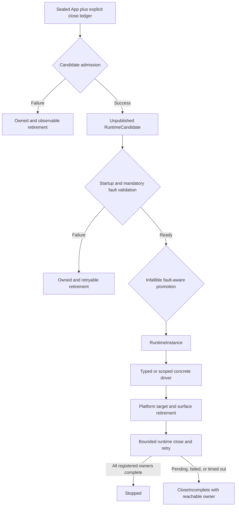

# RGF-U5 Runtime Ownership and Driver Review

## Purpose

This record binds a read-only review of the in-progress RGF-U5 implementation to a fixed committed
base, tracked dirty-worktree diff, empty untracked implementation set, and bounded requirements
snapshot. It is correction evidence for the active plan, not an ADR and not evidence that RGF-U5 is
complete.

The review covered `nara_app` candidate/runtime ownership, gameplay fault propagation,
`nara_tasks` close integration, the Winit driver, public examples, the reference game, and focused
runtime tests. No file was modified during review.

## Authority and Snapshot

| Field | Value |
|---|---|
| Base commit | `c9eb0734a0eba182a1e90ecca03ce8368146b242` |
| Reviewed code diff fingerprint | `2de76cb46e24cef02e80c531c1a5d7039d001ea7` |
| Expected untracked implementation paths | none |
| Requirements fingerprint | `d057f6418f04830a4c9b982929d22f1e3e0ecf2a` |
| Pre-record whole-worktree fingerprint | `02238ffd7b973f8f871b496294d72bd0560112a8` (historical breadcrumb only) |
| Active unit | `RGF-U5` |
| Primary requirements | R15-R16, R35, AE7, AE20, and the published-runtime subset of AE8 |
| Decision status | ADR 0084 remains Proposed and is evidence input, not current authority |
| Review outcome | No P0; P1 findings block RGF-U5 completion |

Snapshot validity has three parts. The tracked implementation fingerprint uses the recorded full
`source_head`, never dynamic `HEAD`. The untracked implementation query must return no paths. The
requirements fingerprint binds the active U5 contract, repo rules, relevant Accepted ADRs, the
Proposed ADR 0084 evidence input, and the non-normative Interface harness used by the review.

```powershell
$sourceHead = 'c9eb0734a0eba182a1e90ecca03ce8368146b242'
$codeScope = @(
    'Cargo.toml'
    'crates/nara_app'
    'crates/nara_gameplay'
    'crates/nara_tasks'
    'crates/nara_winit'
    'examples'
    'reference-game'
    'tests/runtime_driver_boundary.rs'
    'tests/runtime_instance.rs'
)
git diff --binary $sourceHead -- $codeScope | git hash-object --stdin

$untrackedCode = @(git ls-files --others --exclude-standard -- $codeScope)
if ($untrackedCode.Count -ne 0) {
    throw "review snapshot invalid: untracked implementation paths: $($untrackedCode -join ', ')"
}

$requirementScope = @(
    'AGENTS.md'
    'docs/plans/2026-07-12-001-refactor-reference-game-driven-foundation-plan.md'
    'docs/architecture/adr/0003-own-app-plugin-and-schedule-lifecycle.md'
    'docs/architecture/adr/0010-plugin-lifecycle-dependencies-and-failure.md'
    'docs/architecture/adr/0039-main-loop-time-pause-and-runtime-state.md'
    'docs/architecture/adr/0048-runtime-diagnostics-and-observability-bus.md'
    'docs/architecture/adr/0052-task-backpressure-cancellation-and-long-running-diagnostics.md'
    'docs/architecture/adr/0084-executable-runtime-ownership-and-isolation.md'
    'docs/architecture/runtime-composition-interface-design.md'
)
git diff --binary $sourceHead -- $requirementScope | git hash-object --stdin
```

Any tracked implementation change, any untracked implementation path, any content change in the
requirements scope, or any change to the set of governing requirements invalidates the matching
snapshot check. Documentation-only review-record updates do not change the code fingerprint. A
closure review must record its new base, diff or commit identity, requirements identity, tests, and
disposition for every finding below.

## Bound Review Contract

- RGF-U5 owns truthful runtime admission, first-fault propagation, driver-scoped mutation, explicit
  close ownership, bounded retry, and no false Running or Stopped evidence.
- Ordinary error propagation must not discard an owner that still requires retirement. This safety
  invariant is part of U5-RV-01 and U5-RV-02 regardless of which examples expose it.
- RGF-U5 does not freeze the permanent product action or require all primary examples to hide the
  advanced candidate lifecycle. RGF-U24 owns the concrete product start action and RGF-U25 owns its
  author-facing concept/glue budget; U5-RV-09 is evidence they must preserve.
- RGF-U5 must regress the pending-Stop target-retirement ordering at its testable runner/state
  boundary. RGF-U13 owns a supported native platform smoke that executes the public event loop.

## Required Lifecycle



No failure or Drop edge may destroy an unfinished owner, make it unreachable, publish false
Running/Stopped state, or treat a permanent leak as retryable retention.

## Findings

| ID | Severity | `file::symbol` anchors | Evidence | Required outcome |
|---|---|---|---|---|
| U5-RV-01 | P1 | `crates/nara_app/src/runtime.rs::RuntimeAdmissionFailure::begin_retirement`<br>`examples/windowed_clear.rs::main` | `RuntimeAdmissionFailure` keeps a sealed App and a separate ledger; ordinary `?` propagation drops them without `begin_retirement` | Every admission failure either retains a driveable retirement owner or transfers it to an explicit observable quarantine; ordinary error propagation cannot bypass close begin/poll |
| U5-RV-02 | P1 | `crates/nara_app/src/runtime.rs::RuntimeOwner::drop`<br>`crates/nara_app/src/runtime.rs::RuntimeCandidate::complete_startup` | `RuntimeOwner::drop` performs one close pass and `mem::forget`s the App and ledger when work remains; propagating candidate failure can reach this path | Abnormal Drop has a bounded, observable ownership destination; repeated failures cannot create unreachable unbounded App/World/thread leaks |
| U5-RV-03 | P1 | `crates/nara_app/src/runtime.rs::RuntimeCandidate::scope_world_mut`<br>`crates/nara_app/src/runtime.rs::RuntimeInstance::with_driver_scope`<br>`crates/nara_app/src/runtime.rs::runtime_system_error_handler` | Candidate and driver World scopes can replace the installed `FallbackErrorHandler`; later checks validate only reporter identity | Mandatory fallible-system fault capture is sealed, revalidated, or otherwise impossible to silence through allowed World access |
| U5-RV-04 | P1 | `crates/nara_app/src/runtime.rs::RuntimeCandidate::complete_startup`<br>`crates/nara_app/src/runtime.rs::ReadyRuntimeCandidate::promote` | A retained reporter clone can record a fault after `complete_startup` returns; `promote` still initializes Running with no fault | Promotion observes the first fault and cannot expose a false Running interval; U24 still owns atomic product publication |
| U5-RV-05 | P1 | `crates/nara_winit/src/lib.rs::retire_runtime_targets`<br>`crates/nara_winit/src/lib.rs::with_runtime_driver_world` | A Stop pending before Winit drive may close the runtime before `retire_runtime_targets`; Stopped then rejects the mutable driver scope required for surface retirement | Platform target/surface retirement occurs while its typed authority remains valid, before provider release and before runtime state prevents required retirement work |
| U5-RV-06 | P1 | `examples/support/runtime_retirement.rs::finish_runtime_after_winit_with_timeout` | The example retirement helper loops only while state is `Retiring`, so an initial `RetirementIncomplete` performs no retry | A CloseIncomplete owner receives bounded retries while budget remains, and completed work is never reinvoked |
| U5-RV-07 | P1 | `crates/nara_app/src/runtime.rs::with_runtime_system_fault_capture`<br>`crates/nara_app/src/runtime.rs::discard_panic_payload` | Runtime schedule execution catches arbitrary panic and converts it to `SchedulePanic`, while ADR 0084 explicitly excludes panic containment | Remove panic containment from U5; a future separate decision must define unwind, partial mutation, native callback, process-abort, cleanup, and diagnostic consequences before reintroduction |
| U5-RV-08 | P1 | `crates/nara_tasks/src/runtime.rs::TaskPlugin`<br>`tests/runtime_instance.rs::the_first_runtime_fault_is_sticky_and_generations_do_not_repeat` | Required task/service tests write the reporter directly; production `TaskPlugin` supplies close ownership but no demonstrated required-failure bridge | At least one real required task and one real required service integration failure reach the first sticky runtime fault in the same drive; optional/last-good failures remain non-fatal |
| U5-RV-09 | P2 | `examples/windowed_clear.rs::main`<br>`examples/windowed_sprites.rs::main`<br>`examples/runtime_ui_panel.rs::main` | Primary desktop examples expose `seal -> candidate -> ready -> promote -> runner -> retirement`; their `?` safety problem is already blocking under U5-RV-01/U5-RV-02, while hiding the complete choreography is a product-Interface decision | RGF-U24/RGF-U25 measure the author-facing concepts and decide the permanent concrete action without freezing it in U5; preserve the advanced path for Host/embedding users |
| U5-RV-10 | P2 | `crates/nara_app/src/runtime.rs::RuntimeInstance::drive` | Close work can report a fault after the drive-entry reporter check and reach Stopped before the instance mirrors that fault | The first close-time fault remains observable after terminal close without changing truthful Stopped evidence |
| U5-RV-11 | P2 | `crates/nara_winit/src/lib.rs::WinitRunner::run`<br>`crates/nara_winit/src/tests.rs::runner_configuration_does_not_install_runtime_prerequisites` | Tests exercise private Winit state transitions and runner construction but do not execute the public event-loop runner | RGF-U5 keeps runner-boundary/state-machine coverage; RGF-U13 adds the supported-platform event-loop smoke and terminal-result proof |
| U5-RV-12 | P2 | `crates/nara_tasks/src/tests/close.rs::dropping_pending_task_owners_transfers_slow_destructors_without_blocking`<br>`crates/nara_tasks/src/tests/close.rs::managed_close_reaps_pending_jobs_off_the_driver_thread_before_completing`<br>`crates/nara_tasks/src/tests/close.rs::reaper_round_robins_owners_under_sustained_intake` | Several task close tests infer ordering and fairness from narrow wall-clock thresholds | Prefer barriers/channels or an injected clock/work budget; keep real time only as a generous deadlock ceiling |

## Required Regression Matrix

| Scenario | Owning gate | Required observation |
|---|---|---|
| Drop an admission failure without calling its helper | RGF-U5 | Close begin/poll occurs or a typed observable owner is returned/transferred; no direct participant destruction |
| Drop a runtime with one blocked task owner repeatedly | RGF-U5 | Owners remain reachable and bounded; releasing workers eventually reclaims captures and threads |
| Replace/remove mandatory fault resources through candidate and driver scopes | RGF-U5 | Admission or drive rejects before a fallible system error can be reported as success |
| Report a fault between ready and promotion | RGF-U5 | No observer can see Running with an already-recorded first fault |
| Start Winit with Stop already pending | RGF-U5 | The runner/state boundary retires surfaces before provider release and reports a truthful terminal result |
| Enter helper with CloseIncomplete, then release blocked work | RGF-U5 | Retry completes inside the remaining budget without repolling completed participants |
| Fail one required task/service and one optional task | RGF-U5 | Required failures fault in the same drive; optional failure leaves the runtime healthy |
| Panic in fixed Prepare, Simulate, and Finalize | RGF-U5 | The panic follows the pre-existing process/unwind policy; no typed recovery claim is added |
| Run every control in every runtime state | RGF-U5 | Accepted, Busy, InvalidState, Pending, Applied, and Failed results match the declared matrix |
| Execute the public Winit runner on a supported native platform | RGF-U13 | Callback wiring, target retirement, error aggregation, and final runtime state are exercised end to end |

## Alternatives Considered

### A. Explicit ownership carriers plus concrete product actions

Keep advanced ownership carriers where a Host must drive retirement, but make ordinary code-first
and desktop actions consume them internally. Transfer abnormal unfinished owners to an observable,
bounded process-level quarantine or return them to a caller that can retry.

- Benefits: preserves truthful ownership, advanced Host freedom, and a small ordinary Interface.
- Costs: requires explicit terminal-owner plumbing and negative Drop tests.
- Disposition: recommended direction; the implementation may choose a smaller equivalent shape.

### B. Keep ordinary `Error` propagation and best-effort Drop

Allow ownership-bearing failures to implement ordinary error propagation and rely on one Drop poll,
direct destruction, or `mem::forget` when close does not finish.

- Benefits: minimal call-site code.
- Costs: silently loses or leaks native/thread owners and makes clean-stop evidence impossible.
- Disposition: rejected.

### C. Add panic containment and rollback to RGF-U5

Catch arbitrary schedule panic and attempt to normalize partially committed World, clock, queue, and
native state in place.

- Benefits: a process may continue after selected panics.
- Costs: expands U5 into an unproven recovery model and contradicts the current Proposed ADR text.
- Disposition: deferred behind a separate decision and production-shaped tracer.

## Success Metrics

| Metric | Current evidence | Owning gate | Target |
|---|---|---|---|
| Unretired admission failure paths | At least one ordinary `?` path | RGF-U5 | Zero |
| Unreachable abnormal-Drop owners | `mem::forget` fallback exists | RGF-U5 | Zero; every unfinished owner has an observable destination |
| False Running/Stopped windows in injected-fault tests | Ready and close-time gaps are untested | RGF-U5 | Zero |
| Replaceable mandatory fault bridge cases | Candidate and driver scopes can mutate the resource | RGF-U5 | All replacement/removal attempts reject or remain unable to silence faults |
| Real required task/service fault tracers | Reporter-only tests | RGF-U5 | At least one production-shaped tracer for each |
| Public Winit runner smoke | None | RGF-U13 | One supported native CI path |
| Ordinary author concepts and lifecycle glue | Primary examples expose the advanced candidate flow | RGF-U24/RGF-U25 | Meet the frozen concept/glue budget; select a concrete action only from measured evidence |

## Risks and Mitigations

| Risk | Severity | Likelihood | Mitigation |
|---|---|---|---|
| Fix grows into a universal Host or driver trait | High | Medium | Keep U5 code-first and concrete; U24/OQ-038 own product Host and reusable driver shape |
| Quarantine hides an unbounded leak under a new name | High | Medium | Require bounded accounting, observability, eventual reaping tests, and explicit process-lifetime policy |
| Fault sealing removes legitimate plugin freedom | Medium | Medium | Protect only mandatory runtime authority; keep ordinary ECS resources/components/systems open |
| Winit fix lets surfaces outlive providers | High | Low | Preserve surface-retired acknowledgement before provider release in every Stop/error ordering |
| Panic handling returns without coherent state | High | Medium | Remove U5 containment; require a separate ADR and partial-state matrix before future admission |
| Deep action hides errors needed by advanced Hosts | Medium | Medium | Keep module-specific advanced carriers while ordinary actions lower them into phased structured errors |

## Verification Baseline

The reviewed snapshot passed the following commands, but those passes do not close the findings:

```powershell
cargo nextest run -p nara --test runtime_instance --test runtime_driver_boundary --test-threads=1
cargo nextest run -p nara_app -p nara_tasks -p nara_winit --test-threads=1
cargo nextest run --manifest-path reference-game/Cargo.toml --test runtime_core --test-threads=1
```

Observed result: 150 tests passed across these three gates. `git diff HEAD --check` also passed.

## Closure Requirements

1. Resolve every P1 with a focused regression and cite the resulting commit and test name.
2. Record P2 disposition as fixed, accepted residual risk with owner/trigger, or deferred to a named
   active unit. U5-RV-09 names RGF-U24/RGF-U25 and U5-RV-11 names RGF-U13; a generic backlog note is
   insufficient.
3. Rerun the focused gates plus `cargo check --workspace` and the relevant optional backend examples.
4. Recompute the source/diff identity and perform an independent review of the corrected snapshot.
5. Update the active plan and implementation ledger only after review evidence supports the new
   status. This record remains historical evidence and is not rewritten to erase findings.

## Non-Goals

- Accepting ADR 0082 or ADR 0084.
- Implementing U24 product construction, project loading, Editor Play, or restart orchestration.
- Selecting a public `RuntimeDriver` trait or a universal Host.
- Freezing the permanent ordinary code-first product action before RGF-U24/RGF-U25 evidence.
- Treating the native event-loop smoke as an RGF-U5 completion gate; RGF-U13 owns it.
- Adding panic recovery, state rollback, or native ABI guarantees.
- Replacing Winit, wgpu, `bevy_ecs`, or the existing App/schedule authority.
