# Finding

## Executive conclusion

An optional first-party C# gameplay Adapter could materially address the central product complaint
in [Leaving Rust gamedev after 3 years](https://loglog.games/blog/leaving-rust-gamedev/): gameplay
authors need to try special-case behavior quickly without first solving ownership, lifetime,
scheduler, or abstraction problems. It can remove most Rust-language friction from ordinary
gameplay code while preserving Rust for the engine, performance-critical systems, native services,
and the complete native authoring path.

That result is conditional. C# by itself does not provide a mature editor, game UI, renderer,
physics stack, asset pipeline, debugger integration, hot-reload policy, or good engine APIs. If
Nara exposes its ECS and Rust-to-CLR bridge literally - per-property native calls, mandatory event
plumbing, visible schedule graphs, service locators, or command types for every common action - it
will reproduce the article's indirection complaint in another language.

One candidate division of work for the Trial to validate is therefore:

- Rust remains Nara's official, complete production authoring path and owns durable engine
  infrastructure, high-throughput native systems, and backends.
- An optional C# Adapter may focus on the fast-changing, special-case gameplay layer through an
  attachable Behavior facade if the product comparison justifies its permanent cost.
- Stable Nara Schema records own authoring data; CLR object identity and reflection names do not.
- The Adapter translates direct-looking gameplay calls into bounded batch reads, commands, and
  semantic services behind the facade.
- Data edits, compatible method-body updates, and structural restart are distinct iteration paths,
  each with visible generation and last-good status.

This is well aligned with [Nara's strategy](../../../../../STRATEGY.md),
[OQ-007](../../../../architecture/open-questions.md#oq-007-optional-gameplay-language-adapter-contract),
and [ADR 0093](../../../../architecture/adr/0093-rust-authoring-hot-iteration-and-optional-scripting-adapters.md).
It does not justify starting C# implementation now or changing the active reference-game plan.
The existing OQ-007 evidence ladder is the right timing mechanism; this research adds concrete
failure tests for the later disposable feasibility tracer and separate Trial plan.

## Scope and evidence quality

The article explicitly describes a subjective experience, not an A/B study. Its target is a
two-person commercial indie team trying to finish games in roughly 3-12 months, after more than
100,000 lines and three years of Rust game work across custom code, Bevy, Macroquad, Godot, Unity,
and Unreal. Its claims should be treated as high-value workflow evidence for that persona, not as a
universal language benchmark.

The supplied local Hacker News discussion snapshot was reviewed for counterarguments and repeated
pressure. Hacker News comments remain individual testimony, not primary technical authority.
Runtime and engine facts below are taken only from the article itself, official Microsoft/.NET,
Godot, and Unity documentation, and current Nara authority.

## Claim-by-claim impact matrix

The evidence column records what the article's author reports; it does not independently certify
every example or ecosystem judgment.

| Article claim and reported evidence | Effect of optional first-party C# gameplay | Nara consequence |
|---|---|---|
| [1. Skill does not remove the fundamental friction](https://loglog.games/blog/leaving-rust-gamedev/#once-you-get-good-at-rust-all-of-these-problems-will-go-away): even after years of experience, the borrow checker can force a refactor while the author only wants a disposable player-controller experiment. | **Major likely relief.** Ordinary C# object graphs and references do not impose Rust borrow/lifetime restructuring. | Keep the C# surface focused on gameplay intent. Requiring authors to understand Rust ownership indirectly through the bridge would forfeit the benefit. |
| [2. Fearless refactoring repays a partly self-created debt](https://loglog.games/blog/leaving-rust-gamedev/#rust-being-great-at-big-refactorings-solves-a-largely-self-inflicted-issues-with-the-borrow-checker): changing game requirements can turn a small experiment into a multi-hour Rust refactor. | **Major likely relief.** C# permits temporary coupling and later cleanup. It does not guarantee that engine API or Schema changes are cheap. | Measure time-to-play for the same changing mechanic, not only compiler time or final code quality. |
| [3. Indirection damages ergonomics](https://loglog.games/blog/leaving-rust-gamedev/#indirection-only-solves-some-problems-and-always-at-the-cost-of-dev-ergonomics): a short raycast, component check, spawn, and sound sequence becomes events or command buffers split across locations. | **Partial relief.** C# can present that sequence inline, but Nara still needs safe-point commands and service queues internally. | Direct-looking `Audio.Play`, `Scene.Spawn`, physics query, and component read/write facades must batch or record intent internally. Do not expose transport ceremony for the common path. |
| [4. ECS solves the wrong problem when made universal](https://loglog.games/blog/leaving-rust-gamedev/#ecs-solves-the-wrong-kind-problem): generational identity, composition, structure-of-arrays performance, and borrow-checker avoidance are different needs; Unity combines object/components with optional DOTS. | **Partial relief.** A Behavior facade lets authors use object-local behavior while the runtime remains ECS-backed. C# does not remove the underlying ECS or make arbitrary object mutation safe. | Do not create a second managed ECS. Use Adapter-private Behavior instances plus generated/batched access to selected ECS data. ECS should be substrate, not mandatory gameplay vocabulary. |
| [5. Generalized systems do not discover fun](https://loglog.games/blog/leaving-rust-gamedev/#generalized-systems-don-t-lead-to-fun-gameplay): memorable mechanics are often hand-authored exceptions found through playtesting, not results of a universal health or interaction system. | **Major likely relief.** Behavior code can carry local exceptions without first generalizing them into reusable systems. | The first SDK should optimize for deleting and rewriting one mechanic. Advanced typed systems may exist later, but should not be the entry-level authoring model. |
| [6. Commercial indie development optimizes for rapid prototyping](https://loglog.games/blog/leaving-rust-gamedev/#making-a-fun-interesting-games-is-about-rapid-prototyping-and-iteration-rust-s-values-are-everything-but-that): players reward the game, not maintainable implementation technology. | **Conditional relief.** C# lowers language friction only if attach, build, Play, diagnostics, and reload are integrated. A separate manual toolchain can erase the gain. | The adoption comparison must be an end-to-end author task from scene attachment to observed result, not an isolated Roslyn compile benchmark. |
| [7. Procedural macros are not practical reflection](https://loglog.games/blog/leaving-rust-gamedev/#procedural-macros-are-not-even-we-have-reflection-at-home): Rust tooling and inspection often need expensive derives or custom macros, while C# reflection is readily available. | **Major tooling relief, with an identity caveat.** .NET reflection exposes loaded assembly/type/member metadata, and Roslyn exposes syntax, semantic, analyzer, and source-generation APIs. | Reflection may discover a candidate module; it must not define persistent type/field identity. Adapter-owned generation must project explicit stable IDs into the Nara Catalog and retain tombstones. |
| [8. Hot reload is a creative tool, not only a build optimization](https://loglog.games/blog/leaving-rust-gamedev/#hot-reloading-is-more-important-for-iteration-speed-than-people-give-it-credit-for): preserving the current game state enables immediate-mode UI, debug drawing, and gameplay tuning without reproducing a situation. | **Partial relief, not a blanket promise.** .NET Hot Reload can apply supported edits to running code, while unsupported "rude edits" require restart. State and engine integration remain Nara responsibilities. | Classify changes. Apply compatible deltas only at an engine safe point; route structural/unknown changes to a fresh runtime generation; disclose what state was retained; keep last-good independent. |
| [9. Rust can force accidental abstraction/copying](https://loglog.games/blog/leaving-rust-gamedev/#abstraction-isn-t-a-choice): an immediate-mode UI helper cannot borrow one field and mutable whole state naturally, so the author clones merely to proceed. | **Major language-level relief.** C# reference semantics permit this local organization. | Do not reintroduce equivalent restrictions through tiny capabilities or one bridge object per field access. This does not select the runtime UI architecture. |
| [10. The Rust in-game GUI stack is immature](https://loglog.games/blog/leaving-rust-gamedev/#gui-situation-in-rust-is-terrible): highly stylized game UI needs integrated drawing, effects, animation, shaders, particles, and tooling. | **Unchanged.** C# can author UI behavior, but it does not supply Nara's widgets, layout, animation, text, effects, or editor. | Continue the independent Nara-owned runtime UI direction. Do not present C# as a substitute for UI product work. |
| [11. Reactive UI alone does not solve expressive game UI](https://loglog.games/blog/leaving-rust-gamedev/#reactive-ui-is-not-the-answer-to-making-highly-visual-unique-and-interactive-game-ui): data binding is secondary to custom visual behavior. | **Unchanged.** This is a UI/rendering model question, not a language question. | A future C# UI facade should consume Nara UI primitives and effects; it must not decide retained versus immediate UI architecture by accident. |
| [12. The orphan rule blocks local extension](https://loglog.games/blog/leaving-rust-gamedev/#orphan-rule-should-be-optional): application authors cannot implement foreign traits for foreign types even when coherence conflicts are not a practical product concern. | **Major relief for C# gameplay.** Extension methods, wrappers, inheritance, and ordinary helper APIs have different constraints. Rust plugin authors still have the Rust rule. | Keep the C# SDK idiomatic and extensible; do not require every convenience helper to be upstreamed into Nara. |
| [13. Compile time remains iteration time](https://loglog.games/blog/leaving-rust-gamedev/#compile-times-have-improved-but-not-with-proc-macros): the author reports seconds of carefully optimized incremental build latency and much worse proc-macro/serde cases. | **Likely relief, not yet evidence.** A smaller managed gameplay project avoids relinking the Rust engine, but Roslyn/MSBuild/source generators and Adapter processing can still regress. | Record P50/P95 edit-to-result for body, Schema, dependency, and error cases on the same reference task. No compile-latency claim before measurement. |
| [14. Ecosystem hype is not product maturity](https://loglog.games/blog/leaving-rust-gamedev/#rust-gamedev-ecosystem-lives-on-hype): polished positioning can hide missing editor, UI, platform, physics, or reliability work. | **Unchanged.** Choosing C# neither matures Nara nor imports Unity/Godot's engine features. | Keep reference-game, clean export, fault injection, and external-user evidence as product gates. Reuse mature native backends where justified instead of requiring pure Rust replacements. |
| [15. Common gameplay services should feel globally reachable](https://loglog.games/blog/leaving-rust-gamedev/#global-state-is-annoying-inconvenient-for-the-wrong-reasons-games-are-single-threaded): calls such as `play_sound`, `texture_id`, and debug drawing should not require dependency plumbing. | **Major ergonomic relief, but new lifecycle risk.** C# makes static/singleton access easy; static state and event subscriptions can leak across Play generations or prevent unload. | Offer generation-bound convenience facades during callbacks. Do not make CLR statics the service authority; add analyzer/diagnostic pressure for static events, unmanaged roots, raw threads, and untracked tasks. |
| [16. Dynamic borrow checks can create late crashes](https://loglog.games/blog/leaving-rust-gamedev/#dynamic-borrow-checking-causes-unexpected-crashes-after-refactorings): nested ECS queries or `RefCell` borrows can overlap only on a later branch after a refactor. | **Major relief for Behavior-private state; partial for ECS data.** C# removes `RefCell` borrow failures, but simultaneous native data access still needs a defined snapshot/command contract. | Batch reads into tick-scoped snapshots and apply writes through typed commands. Never expose native references whose validity depends on CLR object lifetime. |
| [17. Context objects inherit Rust lifetime and partial-borrow friction](https://loglog.games/blog/leaving-rust-gamedev/#context-objects-aren-t-flexible-enough): a convenient god context becomes lifetime-generic and cannot be partially borrowed through opaque callees. | **Major likely relief.** A callback-scoped C# context can offer ordinary references and extension helpers. | Keep one small author-facing context per time domain while hiding Adapter internals. Reject a sprawling context only when measured usage proves it harmful, not preemptively. |

## What the decision preserves from Rust

The article also credits Rust with compiler-guided correctness, strong default performance, enums,
traits, and capable language tooling in domains that fit the language. A hybrid path does not have
to trade those away globally:

- engine modules, render/physics/audio implementations, asset processing, native plugins, and
  performance-critical ECS systems remain Rust;
- the complete Rust game path remains available when authors need maximum control or throughput;
- C# could become an optional productivity layer for code with high change rate and lower
  per-operation throughput pressure if the Trial passes;
- a measured hotspot can move behind a Rust domain API without changing scene Schema identity.

This is stronger than "replace Rust with C#" and more product-oriented than "expose Bevy ECS over
FFI." It places each language where the article says its values fit.

## Discussion signals from the supplied HN snapshot

The selected discussion contains useful convergence and counterpressure:

- [Animats](https://news.ycombinator.com/item?id=40172952) reports that live-editable behavior/data
  avoids client recompiles and that C#/Unity teams on a comparable problem progressed faster.
- [vvanders](https://news.ycombinator.com/item?id=40177219) and
  [pcwalton](https://news.ycombinator.com/item?id=40177467) independently describe Rust for the
  performance/stability core plus a reloadable language for high-change game content as a natural
  division used by mature engines.
- [stephc_int13](https://news.ycombinator.com/item?id=40173475) separates flexible, edge-case-heavy
  gameplay from renderer, physics, audio, and asset infrastructure; the former prioritizes fast
  iteration, while the latter resembles systems programming.
- [nox101](https://news.ycombinator.com/item?id=40177298) highlights why a fast restart is not
  equivalent to an in-place update: reproducing a level, camera, or bug state can dominate the loop.
- [logicprog](https://news.ycombinator.com/item?id=40175562) argues for a precompiled engine that
  loads game code and data through an integrated editor rather than statically linking every game
  change with the engine. This matches OQ-007's eventual C#-only/prebuilt-Host product variant.
- [GardenLetter27](https://news.ycombinator.com/item?id=40179369) reports value in a mixed Godot
  setup: dynamic gameplay/UI prototyping with Rust for important threaded or low-level work.
- [valcron1000](https://news.ycombinator.com/item?id=40177101) supplies the important
  counterargument: no ecosystem provides fast iteration, direct control, maximum performance, and
  zero tradeoffs simultaneously. The right result must be measured against a named game/persona,
  not asserted from language preference.

These comments support running the trial. They do not prove C# should be adopted.

## Fit with current Nara architecture

### Decisions already pointed in the right direction

1. [STRATEGY.md](../../../../../STRATEGY.md) names the actual problem: infrastructure work in Rust
   engines competes with finishing a game. It also requires a complete Rust path and a reference
   game, preventing C# from becoming an excuse to leave the native product unfinished.
2. [ADR 0093](../../../../architecture/adr/0093-rust-authoring-hot-iteration-and-optional-scripting-adapters.md)
   already separates data reload, compatible Rust patching, structural rebuild/restart, and
   Adapter-owned module reload. The same classification is necessary for C#.
3. [ADR 0081](../../../../architecture/adr/0081-schema-source-stable-identity-catalog-and-runtime-binding.md)
   separates stable Catalog identity from Rust/Bevy runtime binding and explicitly leaves
   Adapter-specific projection local. This is the prerequisite for lossless C# authoring without
   making CLR names or handles persistent truth.
4. [ADR 0034](../../../../architecture/adr/0034-editor-play-mode-world-boundary.md) gives Play an
   isolated runtime projection and makes Apply Changes explicit. C# private state therefore cannot
   silently become scene data merely because it survived a reload.
5. [ADR 0039](../../../../architecture/adr/0039-main-loop-time-pause-and-runtime-state.md) gives
   callbacks explicit real, virtual, fixed, and render time semantics. A C# facade can simplify the
   names without inventing a second clock.
6. [ADR 0042](../../../../architecture/adr/0042-runtime-service-and-backend-boundary.md) keeps native
   handles behind stable intent/command/result boundaries. That is exactly where managed/native
   translation belongs, provided the SDK hides routine transport ceremony.
7. [ADR 0076](../../../../architecture/adr/0076-play-runtime-debug-control-and-observation.md) gives
   generation-stamped safe-point commands, stable observations, and domain-owned execution cursors.
   C# can provide genuine source maps/cursors without pretending ordinary Rust systems have a source
   line.
8. [ADR 0084](../../../../architecture/adr/0084-executable-runtime-ownership-and-isolation.md) is
   still **Proposed**, but its candidate/publication, non-reused generation, sticky fault, finite
   close, and fresh restart trial is the right shape for managed assembly activation and last-good
   fallback if the ADR is later accepted.

### The main architectural warning

The service and command boundaries are necessary engine internals, but they are not automatically a
good gameplay API. The article's strongest complaint is precisely that correct indirection can make
one mechanic cognitively discontinuous. Nara should preserve the internal boundary while making the
ordinary C# call site local and direct-looking.

For example, `game.Audio.PlayOneShot(sound)` may enqueue a typed audio command, and
`game.Scene.Spawn(prefab, pose)` may reserve an identity and enqueue a spawn. The author should not
have to construct or route `AudioCommandEnvelope`, name a service Adapter, or join a schedule set.
Advanced package authors may use those deeper contracts; ordinary gameplay authors should not.

## New risks introduced by C#/CoreCLR

| Risk | Primary-source fact | Required feasibility evidence |
|---|---|---|
| One CLR runtime per process | Microsoft's [native hosting tutorial](https://learn.microsoft.com/en-us/dotnet/core/tutorials/netcore-hosting#limitations) states that only one runtime can be loaded in a process; a later compatible initialization reuses it and an incompatible one fails. | Run two Nara runtime generations and, if relevant, two simultaneous Play instances. Decide whether they share one CLR through separate load contexts or require child-process isolation. Do not equate Nara `RuntimeInstance` with a distinct CLR. |
| Cooperative assembly unload | Microsoft's [AssemblyLoadContext unloadability guide](https://learn.microsoft.com/en-us/dotnet/standard/assembly/unloadability) says collectible unload is cooperative and completes only after no managed call stack, outside strong reference, strong/pinned GC handle, or other root retains the context. | Fault-inject static references, delegates, native GC handles, callbacks, running methods, registered waits, and user threads. A failed unload must remain visible and must not be reported as a fresh clean generation. |
| Static/event leakage across Play | Unity's [domain reload documentation](https://docs.unity3d.com/Manual/domain-reloading.html) documents that disabling reload preserves static variables and event subscribers and requires explicit cleanup or generated analysis. | Define generation-bound statics/event policy; ship analyzer diagnostics for common leaks; test repeated Play/Stop without duplicate handlers or stale handles. |
| GC pause, heap growth, and process-wide policy | Microsoft's [GC latency guide](https://learn.microsoft.com/en-us/dotnet/standard/garbage-collection/latency) says low-latency modes trade reclamation for memory, can still collect under pressure, and the latency setting is process-wide. | Measure allocation bytes, GC counts, pause P95/P99, heap growth, and interaction between editor and Play workloads. Do not promise "no gameplay GC" without an allocation discipline and evidence. |
| Native/managed bridge chatter | Godot's official [C# performance guidance](https://docs.godotengine.org/en/stable/tutorials/scripting/c_sharp/c_sharp_basics.html#performance-of-c-in-godot) warns that native-backed property access incurs interop calls and strings/arrays can require comparatively expensive marshalling. | Measure calls and bytes per stage. Prove batched query snapshots and command flushes outperform per-property P/Invoke on a representative enemy/UI workload. |
| Hot Reload is conditional | Microsoft's [Hot Reload guide](https://learn.microsoft.com/en-us/visualstudio/debugger/hot-reload) limits support by runtime/compiler/project configuration, and [`dotnet watch`](https://learn.microsoft.com/en-us/dotnet/core/tools/dotnet-watch#hot-reload) restarts for unsupported rude edits. | Classify body, signature, field, type, inheritance, dependency, generator, and Schema edits. Prove safe-point apply, restart fallback, last-good behavior, and honest retained-state status. |
| Hot Reload is not state migration | Godot's official [C# known issues](https://docs.godotengine.org/en/stable/tutorials/scripting/c_sharp/c_sharp_basics.html#current-gotchas-and-known-issues) state that hot reload currently restores exported variables but not general state. | Separate Schema-backed authoring state, private transient state, and explicitly retained reload state. Never imply that arbitrary object graphs migrate. |
| CLR moving GC and native references | Unity's official [CoreCLR porting report](https://unity.com/cn/blog/engine-platform/porting-unity-to-coreclr) describes the engineering required to replace a conservative non-moving collector with CoreCLR's precise moving GC and to remove unsafe native references to managed objects. | Keep managed object references out of Rust/native persistent state. Use scoped handles and generation checks; test pinning, callbacks, and teardown. |
| Exceptions, tasks, and threads outlive a tick | ALC unload rules explicitly include managed call stacks, threads, registered waits, and strong roots as unload blockers. | Decide exception-to-runtime-fault policy; require cancellation/retirement for Adapter-owned `Task` and thread work; make Stop finite and truthful. Raw `Task.Run`/`Thread` should at least trigger trial analyzers. |
| Two build/package graphs | Godot's [C# project workflow](https://docs.godotengine.org/en/stable/tutorials/scripting/c_sharp/c_sharp_basics.html#project-setup-and-workflow) generates `.sln`/`.csproj`, uses MSBuild/NuGet, and requires managed project builds for exported variable/tool-script changes. | Keep Cargo and MSBuild/NuGet as separate authorities. Prove deterministic SDK/runtime-pack resolution, clean-machine export, offline diagnostics, and compatible Host/SDK/generated-binding fingerprints. |
| Platform coverage differs from Rust/native coverage | Godot's current [C# introduction](https://docs.godotengine.org/en/stable/tutorials/scripting/c_sharp/c_sharp_basics.html#introduction) documents platform-specific .NET export restrictions and experimental support. | Admit a narrow desktop matrix first. Report unsupported profiles at project validation time; never let the optional Adapter narrow the complete Rust path. |
| Reflection identity drift | [.NET reflection](https://learn.microsoft.com/en-us/dotnet/fundamentals/reflection/reflection) can discover loaded assemblies, types, members, attributes, and invoke code, but those runtime objects and names are not Nara durable identities. | Rename assembly/type/field while preserving explicit Schema identity; test tombstones, migrations, missing-module round trips, and stale generated bindings. |
| Analyzer/generator maintenance becomes product work | The official [Roslyn SDK overview](https://learn.microsoft.com/en-us/dotnet/csharp/roslyn-sdk/source-generators-overview) exposes analyzers, diagnostics, code fixes, semantic APIs, and source generators. This is capability, not a free maintained SDK. | Budget compiler-version compatibility, diagnostics quality, incremental generation time, IDE parity, and generated-code debuggability as first-party product cost. |

The first two risks create the most important new topology pressure. Nara can have many logical
`RuntimeInstance` generations, but an in-process C# implementation cannot assume each one owns an
independent CoreCLR. Separate collectible `AssemblyLoadContext` instances share one process CLR and
unload cooperatively. A child Player process provides a stronger termination boundary but costs
startup and transport complexity. OQ-007 is correct to leave Editor/Player process topology open;
the feasibility tracer must measure both implications before an ADR chooses one.

## Authoring-shape alternatives

These alternatives are product shapes, not implementation selections. The later Trial should keep
the losing options available as counterfactuals rather than treating the first bridge that runs as
the answer.

| Option | Strength | Failure mode against the LogLog pressure | Trial disposition |
|---|---|---|---|
| Literal managed binding of `World`, queries, schedules, events, and commands | Closest semantic match to Rust ECS and the smallest conceptual translation for engine maintainers | Makes ordinary C# authors reconstruct Nara/Bevy scheduling and indirection; adds interop and runtime conflict costs without removing the gameplay ceremony | Reject as the default authoring surface; retain only narrow advanced APIs after a real consumer proves them |
| Behavior-only managed object model | Familiar Unity/Godot-like local code, direct references, and simple Inspector attachment | Encourages a second object authority, per-object bridge traffic, hidden ordering, and poor high-entity throughput | Use as the entry-level facade, but reject it as the only execution model |
| Behavior facade plus callback-scoped batch systems over one Rust ECS | Keeps special-case gameplay local while preserving one data authority and a high-throughput path | Requires two deliberately taught levels and careful rules for snapshots, writes, ordering, allocation, and generation validity | **Leading Trial candidate**; ordinary authors start with Behavior, while measured hotspots use batch views or Rust systems |
| Second managed ECS synchronized with the Rust ECS | Could make C# queries and storage internally coherent | Creates dual identity, synchronization, Schema, replay, debugging, and ownership authorities before any game proves the need | Defer as a counterfactual; admit only if the hybrid Trial fails for a named storage or performance reason |

Unity's `MonoBehaviour` and Godot's Node-attached scripts validate the value of a familiar local
facade. Unity DOTS, Scriptable Render Pipeline, native plug-ins, and Godot GDExtension also show that
one facade does not need to carry every performance or extension privilege. Nara can offer a small
C# gameplay surface while keeping full engine, backend, and high-throughput freedom in Rust.

## Minimal gameplay authoring experience to trial

This section is a disposable product hypothesis, not an API decision. Names are illustrative.

### Author-facing model

1. Create a C# class derived from one familiar `Behavior` base.
2. Attach it to a scene entity in the Inspector. The first trial permits one instance of each stable
   Behavior type per entity, as OQ-007 already states.
3. Expose ordinary typed fields/properties for Inspector authoring. An Adapter-owned build step
   projects them to explicit stable Nara Schema identities. The Trial must compare author-written
   identity metadata with an engine-maintained versioned sidecar; deriving persistent identity from
   CLR type/member names is not an option. The reflection/source-generation split remains separate.
4. Receive a small callback context for the relevant time domain: start, fixed gameplay, variable
   frame, and stop. The callback hides schedule labels, Plugin composition, native handles, and Host
   vocabulary.
5. Use direct-looking semantic services and a callback-scoped data-access contract. The Trial must
   compare a stage-entry snapshot plus safe-point intents with narrower callback transactions; it
   cannot select either model until read-after-write, cross-Behavior visibility, spawn publication,
   physics-query version, failure, and ordering semantics are understandable and measured.
6. Use normal .NET IDE completion, navigation, compiler diagnostics, analyzer diagnostics, and
   debugger attachment. The Nara editor surfaces the same diagnostics and source locations.

```mermaid
flowchart LR
  Source[C# gameplay source] --> Build[Adapter-owned build and Schema projection]
  Build --> Module[Managed module candidate, diagnostics, and binding manifest]
  Module -. candidate Schema contribution .-> Catalog[Runtime-independent Nara Schema Catalog]
  Catalog --> Inspector[Scene / Prefab Inspector]
  Inspector --> Documents[Scene and Prefab documents]
  Documents --> Start[Host-owned start attempt]
  Module --> Start
  Start --> Runtime[Fresh Nara runtime generation]
  Runtime --> Behavior[Adapter-private Behavior instances]
  World[Single Rust ECS World] --> Snapshot[Candidate batched or callback-scoped read view]
  Snapshot --> Behavior
  Behavior --> Intent[Typed writes, structural commands, and service intents]
  Intent --> World
  World --> Observe[Stable observations and diagnostics]
  Observe --> Inspector
```



The diagram deliberately leaves one ordering question open: the Trial must decide how a managed
module's candidate Schema contribution joins the frozen Catalog, project-content snapshot, and
runtime start lineage. It must not force managed code to masquerade as a static Rust provider merely
to reuse the current native slice.

Illustrative code:

```csharp
using Nara;

public sealed class PlayerController : Behavior
{
    // The Trial must supply this field's stable ID through explicit metadata or a
    // versioned engine sidecar. The member name "Speed" is not persistent identity.
    [Expose(Min = 0, Max = 30)]
    public float Speed { get; set; } = 8;

    [Expose]
    public AssetRef<Sound> HitSound { get; set; }

    [Expose]
    public AssetRef<Prefab> HitEffect { get; set; }

    public override void FixedUpdate(FixedContext game)
    {
        var transform = game.Read<Transform2D>(Self);
        var movement = game.Actions.Axis2D("move");

        game.Write(Self, transform with
        {
            Position = transform.Position + movement * Speed * game.Delta
        });

        if (!game.Actions.Pressed("fire") ||
            !game.Physics2D.Raycast(transform.Position, transform.Forward, out var hit))
        {
            return;
        }

        if (game.TryRead(hit.Entity, out Health health))
        {
            game.Write(hit.Entity, health with { Value = health.Value - 1 });
        }

        game.Audio.PlayOneShot(HitSound);
        game.Scene.Spawn(HitEffect, hit.Point);
    }
}
```

The value of this shape is not the particular method names. It keeps one mechanic in one place while
preserving Nara's internal rules:

- `Self` and `hit.Entity` are generation-stamped handles, not Bevy `Entity` or GC references.
- `Read`/`TryRead` return tick/stage snapshots or generated values, not borrowed native memory.
- `Write`, `Spawn`, and `PlayOneShot` record typed intent; they do not allow reentrant `World`
  mutation or expose a backend.
- a query such as `game.Query<Enemy, Transform2D>()` must cross the bridge as one bounded batch, not
  one native call per entity or property;
- advanced Rust Plugins and systems remain available for workloads that need direct ECS scheduling
  or throughput.

The trial should reject this facade or revise it if implementing the article's raycast-hit-effect
example still requires multiple files, user-defined event types, schedule ordering, or Adapter
plumbing.

Direct-looking calls must not imply undocumented immediate mutation. The Trial must publish and
test one coherent answer for each interaction below before judging the facade ergonomic:

| Interaction | Required observable contract |
|---|---|
| A Behavior writes a component and reads it again in the same callback | State whether the read sees the original view or a local write overlay; never depend on bridge implementation accident |
| Behavior A writes and Behavior B reads in the same phase | State the semantic phase barrier or declare the values unordered; never use incidental entity/registration order |
| Code spawns an entity and immediately configures or references it | State whether spawn returns a reserved stable handle usable only by later intents or a published readable entity |
| Code changes a transform and then performs a physics query | State which transform/physics snapshot the query observes and when synchronization occurs |
| A callback throws after recording writes or service calls | Define whether its intents reject atomically, partially commit by documented domain boundary, or fault the runtime before publication |
| A service accepts a direct-looking call | Return or expose typed rejection/completion semantics when the effect cannot be admitted; hiding a queue must not hide failure |

The stable-identity experience has a similar explicit comparison:

| Identity option | Benefit | Cost to prove |
|---|---|---|
| Author-written stable Behavior/field IDs in attributes or adjacent source metadata | Identity and rename intent are explicit in review | Adds ceremony to the common script and needs diagnostics for duplicates, copy/paste, and manual mistakes |
| Engine-maintained versioned sidecar keyed by source declarations | Keeps ordinary code close to familiar Unity/Godot authoring | Needs deterministic creation, rename/delete/tombstone handling, merge-conflict UX, source-control visibility, and recovery when source and sidecar drift |
| CLR type/member names or metadata tokens | No extra authoring step | Rejected for persistent identity because rename, rebuild, trimming, and load context can change them |

Whichever viable option wins must pass type/field rename, deletion, missing assembly, reintroduction,
merge conflict, migration, and lossless degraded-authoring scenarios. Inspector convenience is not a
reason to weaken ADR 0081's identity authority.

### Iteration UX

The editor should show one explicit outcome for every source change:

| Change class | Expected product behavior |
|---|---|
| Inspector/scene/data value | Validate and update through the existing document/data reload path; no C# compile. |
| Supported method-body delta | Compile with Roslyn, validate module/Host identity, apply at a Nara quiescent safe point, and show the applied module/runtime generation. |
| Signature, field layout, base type, Schema, dependency, or unsupported delta | Build a fresh managed module and reconstruct a fresh runtime generation from the validated scene snapshot; restore only explicitly declared compatible state. |
| Compile, generator, load, binding, or startup failure | Keep the previous admitted runtime/module as last-good, show source-aware diagnostics and generation mismatch, and publish no partial candidate. |
| Missing assembly/type on editor open | Preserve the complete bounded semantic record, keep unavailable fields read-only, allow unrelated edits and explicit deletion, and reject a new Play candidate until binding is valid. |

"Hot reload" should not be the UI label for all five cases. The editor should say, for example,
`Applied to module generation 12`, `Restart required`, or `Build failed - Play is still running
generation 11`.

### Lifecycle guardrails for the first trial

- Behavior callbacks execute under one Adapter-owned stage dispatcher, avoiding one native boundary
  crossing per Behavior if a managed batch can dispatch them internally.
- Exceptions become structured Adapter/runtime faults with Behavior, module generation, callback,
  and safe source location. They do not disappear into logs.
- Engine-issued cancellation belongs to every tracked asynchronous operation. Stop cannot claim
  completion while managed work, callbacks, native roots, or unload obligations remain.
- Static mutable state, static event subscriptions, `Task.Run`, raw `Thread`, blocking waits, raw
  P/Invoke, and unmanaged/pinned handles receive analyzer diagnostics during the trial. The trial may
  permit explicit advanced opt-outs, but must make the generation/lifecycle cost visible.
- Per-frame allocation and bridge budgets are measured, not hidden behind "C# is fast enough."
- C# assemblies are trusted in-process code unless a separate process/sandbox contract proves
  otherwise.

## Minimum product-shaped comparison

The later OQ-007 Trial should implement the same small mechanic in public Rust and the candidate C#
facade: input-driven movement, a physics hit test, mutation of another entity's gameplay state,
one audio effect, one spawned visual effect, one Inspector-tunable field, and one debug observation.

For a target indie gameplay programmer unfamiliar with Nara internals, measure:

- time from an empty script to first successful Play;
- time and touched files to add and then discard a special-case rule;
- number of Nara-specific concepts, user-defined plumbing types, and engine-glue lines required by
  the same task;
- P50/P95 edit-to-visible-result for data, body, structural, and compile-error edits;
- time to return to the same in-game state after a structural edit;
- source diagnostic accuracy and stale/last-good clarity;
- managed/native calls and bytes per fixed stage;
- managed allocation per frame, GC pause P95/P99, peak heap, and repeated-reload growth;
- successful ALC retirement across repeated Play/Stop/restart and intentional leaked-root cases;
- clean-machine startup/export size and runtime-pack provenance;
- whether the Rust implementation or core runtime regresses when the Adapter is absent.

The trial passes only if users complete the gameplay task materially faster or with materially less
cognitive/structural work than the Rust baseline while the bridge, GC, packaging, and maintenance
costs stay inside a precommitted budget. A functioning hello-world bridge is not adoption evidence.

## Plan implication

No C# implementation unit should be added to the current active reference-game plan. OQ-007 already
requires stable Schema/Catalog separation, the Rust first-playable continuation verdict, Host-owned
Editor Play/Stop/fresh restart, checkout-free candidate packaging, and a later explicit U20 Trial
decision before product work.

When that gate opens, the separate disposable feasibility tracer should add these explicit stop
conditions:

1. fail if a clean Play/Stop/restart cannot retire or isolate managed generations truthfully;
2. fail if one-runtime-per-process or ALC constraints force a product topology outside the Trial's
   startup/transport budget;
3. fail if the common mechanic requires per-property native interop or exposes ECS/Host vocabulary;
4. fail if supported-edit hot reload plus structural fallback cannot preserve honest last-good and
   state-retention status;
5. fail if GC/bridge costs exceed the named reference workload budget;
6. fail if clean export requires an otherwise empty user-authored Rust/Cargo Host.

These belong in the later Trial plan, not in Accepted core ADRs today.

## Explicit non-conclusions

- This research does not make C# an official or coequal authoring language.
- It does not admit CoreCLR, Roslyn, MSBuild, NuGet, a C# SDK, a new crate, a manifest field, or a
  managed artifact format.
- It does not select in-process versus child-process Editor Play.
- It does not define a universal Behavior Host, language-neutral scripting ABI, or dynamic managed
  ECS.
- It does not claim that .NET Hot Reload applies every gameplay edit or migrates arbitrary state.
- It does not claim C# fixes Nara's UI, editor, asset, rendering, physics, platform, documentation,
  or ecosystem maturity gaps.
- It does not authorize direct CLR reflection names, object references, GC handles, or assembly
  paths as persistent Schema identity.
- It does not imply deterministic replay, sandboxing, editor-extension parity, console/mobile/web
  support, or acceptable GC/interop performance before evidence.
- The illustrative API names are disposable and should not be copied into production merely because
  they appear in this note.

## Primary sources

### Workflow critique and discussion

- LogLog Games, [Leaving Rust gamedev after 3 years](https://loglog.games/blog/leaving-rust-gamedev/),
  published 2024-04-26.
- Hacker News [story 40172033](https://news.ycombinator.com/item?id=40172033), used only as a
  discussion-pressure snapshot; selected individual comments are linked above.

### Microsoft and .NET

- [Write a custom .NET host](https://learn.microsoft.com/en-us/dotnet/core/tutorials/netcore-hosting),
  especially the one-runtime-per-process limitation.
- [How to use and debug assembly unloadability in .NET](https://learn.microsoft.com/en-us/dotnet/standard/assembly/unloadability).
- [Hot Reload in Visual Studio](https://learn.microsoft.com/en-us/visualstudio/debugger/hot-reload).
- [`dotnet watch` Hot Reload and rude-edit restart](https://learn.microsoft.com/en-us/dotnet/core/tools/dotnet-watch#hot-reload).
- [Supported C# code changes](https://learn.microsoft.com/en-us/visualstudio/debugger/supported-code-changes-csharp).
- [`MetadataUpdater.ApplyUpdate`](https://learn.microsoft.com/en-us/dotnet/api/system.reflection.metadata.metadataupdater.applyupdate).
- [.NET GC latency modes](https://learn.microsoft.com/en-us/dotnet/standard/garbage-collection/latency).
- [Reflection in .NET](https://learn.microsoft.com/en-us/dotnet/fundamentals/reflection/reflection).
- [.NET Compiler Platform SDK and source generators](https://learn.microsoft.com/en-us/dotnet/csharp/roslyn-sdk/source-generators-overview).

### Mature-engine C# precedents

- Godot, [C# basics](https://docs.godotengine.org/en/stable/tutorials/scripting/c_sharp/c_sharp_basics.html),
  including project workflow, known hot-reload state limits, native interop cost, and platform notes.
- Unity, [MonoBehaviour](https://docs.unity3d.com/Manual/class-MonoBehaviour.html), for the familiar
  attachable script/Inspector/lifecycle authoring facade.
- Unity, [Enter Play mode without domain reload](https://docs.unity3d.com/Manual/domain-reloading.html),
  for static state/event retention and cleanup pressure.
- Unity, [Porting Unity to CoreCLR](https://unity.com/cn/blog/engine-platform/porting-unity-to-coreclr),
  for moving-GC and native/managed reference integration pressure.

### Nara authority reviewed

- [Nara Strategy](../../../../../STRATEGY.md).
- [OQ-007: Optional Gameplay-Language Adapter Contract](../../../../architecture/open-questions.md#oq-007-optional-gameplay-language-adapter-contract).
- [ADR 0034: Editor Play Mode World Boundary](../../../../architecture/adr/0034-editor-play-mode-world-boundary.md).
- [ADR 0039: Main Loop, Time Domains, Pause, and Runtime State](../../../../architecture/adr/0039-main-loop-time-pause-and-runtime-state.md).
- [ADR 0042: Runtime Service and Backend Boundary](../../../../architecture/adr/0042-runtime-service-and-backend-boundary.md).
- [ADR 0076: Play Runtime Debug Control and Observation](../../../../architecture/adr/0076-play-runtime-debug-control-and-observation.md).
- [ADR 0081: Schema Source, Stable Identity, Catalog, and Runtime Binding](../../../../architecture/adr/0081-schema-source-stable-identity-catalog-and-runtime-binding.md).
- [ADR 0084: Executable Runtime Ownership and Isolation](../../../../architecture/adr/0084-executable-runtime-ownership-and-isolation.md), Proposed at review time.
- [ADR 0093: Rust Authoring, Hot Iteration, and Optional Scripting Adapters](../../../../architecture/adr/0093-rust-authoring-hot-iteration-and-optional-scripting-adapters.md).
