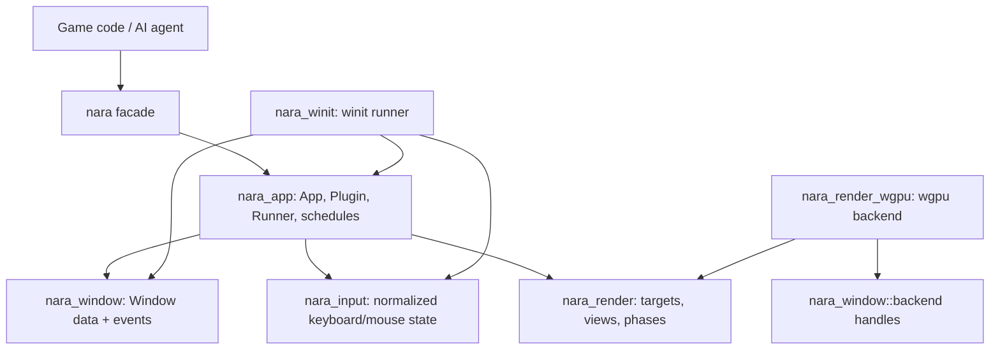

# Platform Window Render Backend Foundation - Plan

## Goal Capsule

| Field | Decision |
|---|---|
| Objective | Build the next nara foundation slice that proves app runners, normalized windows, render-domain data, and the first wgpu backend boundary without leaking backend APIs into gameplay-facing crates. |
| Authority | Existing ADRs and `AGENTS.md` define the architecture; this plan resolves the next implementation shape where those documents are still open. |
| Execution profile | Standard/deep engine-foundation work with cross-crate API changes, new adapter crates, documentation cleanup, and verification gates. |
| Stop conditions | Stop for user input only if a required dependency cannot compile on the pinned toolchain or if implementing the winit/wgpu boundary contradicts an accepted ADR. |
| Tail ownership | Implementation should land with focused conventional commits and update engineering memory after the verified slice. |

---

## Product Contract

### Summary

This slice turns the current headless ECS foundation into a platform-ready runtime shape.
The target is not "first game rendering" yet; it is the mature boundary that will let nara add sprite batching, tilemaps, editor viewports, and 3D without rewriting `App`, window, or backend ownership.

### Problem Frame

The current runtime has a clean Bevy ECS substrate and nara-owned app/plugin API, but platform and render boundaries are still mostly declarative.
`nara_render` contains authoring-facing data and a `RenderBackend` trait, while `nara_app` lacks a runner contract and fixed update stage.
If nara adds sprite batching or scene serialization before forcing real `winit`/`wgpu` lifetimes through the system, the engine risks accumulating paper abstractions that break as soon as a surface, event loop, or resize path appears.

### Requirements

**App and time**

- R1. `nara_app` exposes a runner boundary so headless, desktop, editor, and future web/mobile runners can drive the same `App` without adopting `bevy_app`.
- R2. `nara_app` adds a deterministic-friendly fixed update path with `First` and `FixedUpdate` stage coverage aligned with ADR 0003 and ADR 0024.

**Window and platform**

- R3. `nara_window` owns normalized window data, IDs, primary-window semantics, window events, and display/present settings without depending on `winit`.
- R4. `nara_winit` is the only crate that depends on `winit`; it owns event-loop integration, window creation, and event/input normalization.

**Render and backend**

- R5. `nara_render` models graph-ready render-domain concepts: render targets, viewport rectangles, extracted views, render phases, and frame lifecycle data without depending on `wgpu`.
- R6. `nara_render_wgpu` is the only crate that depends on `wgpu`; it owns instance/device/queue/surface lifecycle and a clear-pass renderer skeleton.
- R7. The root `nara` facade keeps heavy platform/GPU crates optional and preserves the default headless/minimal developer experience.

**Architecture hygiene**

- R8. Documentation and memory reflect the new adapter crates, and stale architecture drift is removed instead of preserved.
- R9. Tests and compile gates prove fixed update behavior, window event normalization, render-domain data, adapter boundaries, and existing examples.

### Scope Boundaries

- Do not implement a full RenderGraph in this slice.
- Do not implement sprite batching, tilemap rendering, texture upload, or material pipelines in this slice.
- Do not implement a 3D render pipeline.
- Do not build editor/debug UI.
- Do not add scene/prefab serialization beyond correcting obvious runtime-`Entity` serialization drift if touched.
- Do not make `wgpu` or `winit` default dependencies of the facade.

### Acceptance Examples

- AE1. A headless app can install systems, call the public `run_once(Duration)` path or the default runner path, and observe startup systems once plus fixed update when the accumulator is due.
- AE2. `examples/windowed_clear.rs` compiles behind optional platform/GPU features while gameplay code imports nara window/render concepts rather than raw `winit` or `wgpu` types.
- AE3. A boundary search shows `winit` imports only in `crates/nara_winit` and `wgpu` imports only in `crates/nara_render_wgpu`.
- AE4. The renderer can represent a camera targeting the primary window and a viewport even before sprite draw submission exists.

---

## Planning Contract

### Key Technical Decisions

- KTD1. Runner ownership follows a Bevy-like owned-app shape, but the nara contract is fallible: `RunnerFn = Box<dyn FnOnce(App) -> Result<AppExit, AppRunError>>`, because `winit` event loops take ownership of control flow and window/backend startup can fail before a normal exit path exists.
- KTD2. The first fixed-step implementation lives in `nara_app` as a small runtime resource and schedule policy: `First`, `PreUpdate`, `FixedUpdate`, `Update`, `PostUpdate`, `Extract`, `Render`, `Last`. `FixedTime` defaults to a 1/60 second timestep with a configurable `max_steps_per_frame` default of 5, and `run_once(Duration)` advances both frame time and the fixed accumulator for deterministic tests.
- KTD3. `nara_window` treats windows as runtime ECS data with a `PrimaryWindow` marker and stable nara window IDs; serialized scenes should target `PrimaryWindow` or future stable project-level targets, not raw runtime entity IDs.
- KTD4. Raw window handle access is backend-only API under `nara_window::backend`: `nara_winit` owns live `Arc<winit::window::Window>` values, registers handle wrappers keyed by `WindowId`, and `nara_render_wgpu` consumes only the raw-window-handle abstraction while guaranteeing surfaces are dropped before the provider/window guard.
- KTD5. Phase 1 uses explicit extraction data in the main runtime world rather than a separate render world. Extracted render data is frame-local, rebuilt or cleared during `Extract`, not serialized, and not exported through the gameplay prelude initially; authoring APIs remain `Camera2d` and `RenderTarget`.
- KTD6. `nara_render_wgpu` may use `pollster` for first-pass native-desktop GPU initialization because nara does not yet have engine-owned task pools wired into backend startup. The backend has `Uninitialized`, `Initializing`, `Ready`, and `Unavailable` states, creates surfaces only after platform windows are live, and routes failures through `AppRunError`.
- KTD7. The root facade exposes explicit optional `winit` and `wgpu` features, but default `MinimalPlugins` stays headless and backend-free. `cargo tree -p nara --no-default-features` must not include `winit` or `wgpu`.
- KTD8. The stale generic ADR 0004 file should be removed or explicitly superseded; the accepted Bevy-reflect-backed ADR remains canonical.

### High-Level Technical Design



Frame flow remains simple:

```text
runner collects platform events
runner updates normalized window/input resources
App runs First / PreUpdate
App runs zero or more FixedUpdate ticks when due
App runs Update / PostUpdate
App runs Extract; extracted render data is rebuilt or cleared
App runs Render / Last
backend submits the clear pass when a surface is available
```

### Dependencies and Constraints

- Use `winit = "0.30.12"` for the first adapter; `0.31.0-beta.2` exists but should not be the foundation target.
- Use `wgpu = "30.0.0"` for the backend crate.
- Add `pollster = "0.4"` only in the wgpu backend crate if native-desktop blocking initialization is needed.
- Keep `repo-ref/` as reference-only input and do not vendor or edit reference projects.
- Keep Rust 2024 and workspace `rust-version = "1.95"`.

### System-Wide Impact

- The app lifecycle becomes public API: runner ownership and stage names will shape every future platform, editor, scripting, and testing integration.
- Window data becomes a runtime domain: future editor viewport, multi-window, and web/mobile support should extend `nara_window`, not patch `nara_winit`.
- Render data becomes a backend contract: sprite/tilemap extraction should target `nara_render` phase/view concepts rather than the wgpu crate.
- Documentation drift must be cleaned because architecture docs are the primary continuity mechanism for future agents.

### Sources

- `AGENTS.md`
- `docs/architecture/adr/0003-own-app-plugin-and-schedule-lifecycle.md`
- `docs/architecture/adr/0012-render-crate-boundaries.md`
- `docs/architecture/adr/0013-platform-window-and-runner-boundaries.md`
- `docs/architecture/adr/0017-render-graph-policy.md`
- `docs/architecture/adr/0023-event-message-and-command-model.md`
- `docs/architecture/adr/0024-determinism-fixed-update-and-replay-policy.md`
- `docs/architecture/nara-foundation.md`
- `docs/architecture/open-questions.md`
- `repo-ref/bevy/crates/bevy_app/src/app.rs`
- `repo-ref/bevy/crates/bevy_app/src/main_schedule.rs`
- `repo-ref/bevy/crates/bevy_app/src/schedule_runner.rs`
- `repo-ref/bevy/crates/bevy_window/src/window.rs`
- `repo-ref/bevy/crates/bevy_window/src/raw_handle.rs`
- `repo-ref/bevy/crates/bevy_winit/src/lib.rs`
- `repo-ref/bevy/crates/bevy_winit/src/state.rs`
- `repo-ref/bevy/crates/bevy_render/src/camera.rs`
- `repo-ref/bevy/crates/bevy_render/src/render_phase/mod.rs`
- `repo-ref/bevy/crates/bevy_render/src/view/mod.rs`
- `repo-ref/wgpu/wgpu/src/api/surface.rs`
- `repo-ref/wgpu/wgpu/src/api/surface_texture.rs`
- `repo-ref/wgpu/examples/standalone/02_hello_window/src/main.rs`

---

## Implementation Units

### U1. Clean Architecture Drift and Add Backend Integration ADR

- **Goal:** Make the plan's architectural decisions durable before code changes depend on them.
- **Requirements:** R5, R6, R8
- **Files:** Create `docs/architecture/adr/0032-render-backend-integration-boundary.md`; modify `docs/architecture/open-questions.md`; modify `docs/architecture/nara-foundation.md`; remove or supersede `docs/architecture/adr/0004-use-reflection-backed-component-metadata.md`; update `docs/knowledge/engineering/current-state.md` and `docs/knowledge/engineering/log.md`.
- **Approach:** Record that Phase 1 uses main-world explicit extraction data, backend-only raw handle providers, optional facade backend features, and wgpu clear-pass scope.
- **Patterns:** Follow accepted ADR formatting in `docs/architecture/adr/0017-render-graph-policy.md`.
- **Test Scenarios:** Documentation references point to the accepted ADR 0004 file only; no open question still asks whether to use main-world extraction versus render-world for this slice; architecture docs positively name `nara_winit` and `nara_render_wgpu` as adapter crates.
- **Verification:** Negative check: `rg -n "0004-use-reflection-backed-component-metadata|whether to use main-world extraction versus render-world" docs/architecture AGENTS.md` should return no live references after the cleanup. Positive check: `rg -n "nara_winit|nara_render_wgpu" docs/architecture AGENTS.md` should show the adapter boundary.

### U2. Add App Runner and Fixed Update Foundation

- **Goal:** Give platform adapters a stable way to own app execution and give deterministic systems a fixed-step stage.
- **Requirements:** R1, R2, R9
- **Files:** Modify `crates/nara_app/src/lib.rs`; modify `crates/nara_app/Cargo.toml` if time helpers need a dependency; modify `crates/nara_core/src/lib.rs` only if shared time types move there; update `src/lib.rs`.
- **Approach:** Add `AppExit`, `AppRunError`, `RunnerFn`, `App::set_runner`, `App::run`, `App::run_once(Duration)`, and a default headless runner. Extend `CoreStage::ALL` with `First` and `FixedUpdate`. Add `FixedTime` with default 1/60 second timestep, default `max_steps_per_frame = 5`, accumulator controls, and integration with `nara_core::Time`.
- **Patterns:** Follow current `App::try_update` and Bevy references in `repo-ref/bevy/crates/bevy_app/src/app.rs` and `repo-ref/bevy/crates/bevy_app/src/main_schedule.rs`.
- **Test Scenarios:** Startup systems run once under `run_once(Duration)` and the default runner path; `First` runs before `PreUpdate`; `FixedUpdate` runs zero ticks when no time is accumulated; `FixedUpdate` runs bounded catch-up ticks when enough time is accumulated; `nara_core::Time` advances once per frame; a custom runner receives ownership of `App`; a custom runner failure returns `AppRunError` without panicking.
- **Verification:** `cargo test -p nara_app`

### U3. Add Normalized Window Domain Crate

- **Goal:** Introduce nara-owned window data independent from any platform library.
- **Requirements:** R3, R7, R9
- **Files:** Modify root `Cargo.toml`; create `crates/nara_window/Cargo.toml`; create `crates/nara_window/src/lib.rs`; modify `src/lib.rs`.
- **Approach:** Define `WindowId`, `Window`, `PrimaryWindow`, `WindowResolution`, `WindowMode`, `PresentMode`, `WindowEvent`, and a `WindowPlugin` that can create default primary window data. Define backend-only raw-window-handle wrapper/provider types keyed by `WindowId`; the wrapper stores a lifetime guard so copied raw handles cannot outlive the owning platform window.
- **Patterns:** Use ECS component/resource conventions from `crates/nara_scene/src/lib.rs` and `crates/nara_input/src/lib.rs`; use Bevy window shape only as reference, not a public API clone.
- **Test Scenarios:** A default window has a stable title and non-zero resolution; resize events update the matching window; primary-window lookup is deterministic; zero-size resize is represented but marked unsuitable for surface configuration; backend handle providers expose teardown order and do not enter the gameplay prelude.
- **Verification:** `cargo test -p nara_window`

### U4. Add Winit Adapter Crate

- **Goal:** Isolate desktop event loop and input/window translation in a single adapter crate.
- **Requirements:** R1, R3, R4, R7, R9
- **Files:** Modify root `Cargo.toml`; create `crates/nara_winit/Cargo.toml`; create `crates/nara_winit/src/lib.rs`; add focused internal modules if useful; update optional facade feature wiring in `src/lib.rs`.
- **Approach:** Add `WinitPlugin` and `WinitRunner` that set the app runner, create configured windows, register backend handle providers, translate close/resize/focus/scale-factor events into nara window events, and update `nara_input` for keyboard/mouse state. Unit-test translation helpers without opening an OS window.
- **Patterns:** Follow boundary shape from `repo-ref/bevy/crates/bevy_winit/src/lib.rs` and `repo-ref/bevy/crates/bevy_winit/src/state.rs`, but keep nara's first adapter much smaller.
- **Test Scenarios:** Key translation covers escape, enter, space, arrows, and printable characters; mouse button translation covers left/right/middle/other; resize/focus/close events map to `nara_window::WindowEvent`; window creation failure maps to `AppRunError`; the crate compiles with `winit` isolated to this crate.
- **Verification:** `cargo test -p nara_winit`; `rg -n "winit::|winit =" crates src Cargo.toml`

### U5. Expand Render-Domain Data in `nara_render`

- **Goal:** Make render phases, targets, view extraction, and frame lifecycle explicit before the wgpu backend hardcodes assumptions.
- **Requirements:** R5, R7, R9
- **Files:** Modify `crates/nara_render/src/lib.rs`; modify `crates/nara_render/Cargo.toml`; modify `src/lib.rs`.
- **Approach:** Add `RenderTarget`, `ViewportRect`, `ExtractedView`, `RenderPhaseLabel`, and frame lifecycle resources. Extend `Camera2d` to target the primary window by default without exposing backend types. Do not add sorted render phase storage yet; defer queue/sort storage until the sprite/tilemap render unit has real render items to consume it.
- **Patterns:** Use ADR 0017 readiness rules and Bevy references in `repo-ref/bevy/crates/bevy_render/src/camera.rs`, `repo-ref/bevy/crates/bevy_render/src/view/mod.rs`, and `repo-ref/bevy/crates/bevy_render/src/render_phase/mod.rs`.
- **Test Scenarios:** A default `Camera2d` targets the primary window; viewport rectangles reject or normalize invalid extents; extracted views carry target, viewport, order, and clear color; extracted view storage is cleared or rebuilt each frame; removing a camera or window cannot leave stale extracted view data behind.
- **Verification:** `cargo test -p nara_render`

### U6. Add Wgpu Backend Crate with Clear-Pass Skeleton

- **Goal:** Prove that the render/backend seam can own real wgpu lifecycle without leaking wgpu upward.
- **Requirements:** R5, R6, R7, R9
- **Files:** Modify root `Cargo.toml`; create `crates/nara_render_wgpu/Cargo.toml`; create `crates/nara_render_wgpu/src/lib.rs`; add focused backend modules if useful.
- **Approach:** Add `WgpuRenderPlugin`, backend initialization states, surface state, resize/reconfigure handling, surface error policy, and clear-pass submission. Keep real surface creation behind `nara_window::backend` handle providers and allow non-GPU unit tests to cover policy logic.
- **Patterns:** Follow wgpu lifecycle from `repo-ref/wgpu/examples/standalone/02_hello_window/src/main.rs` and keep Bevy renderer references as boundary inspiration only.
- **Test Scenarios:** Zero-size surfaces skip configuration; resize marks surfaces dirty and reconfigures on next render; surface results cover wgpu 30 `Success`, `Suboptimal`, `Timeout`, `Occluded`, `Outdated`, `Lost`, and `Validation`; `Timeout` and `Occluded` skip the current frame; `Suboptimal` and `Outdated` request reconfigure; `Lost` requests surface recreation; `Validation` becomes a diagnostic render error; clear color conversion is deterministic.
- **Verification:** `cargo test -p nara_render_wgpu`; `cargo check -p nara_render_wgpu --examples`; `rg -n "wgpu::|wgpu =" crates src Cargo.toml`

### U7. Wire Facade, Examples, Verification, and Memory

- **Goal:** Make the slice usable and discoverable without making default users pay for backend dependencies.
- **Requirements:** R7, R8, R9
- **Files:** Modify root `Cargo.toml`; modify `src/lib.rs`; modify `examples/hello_world.rs` only if API changes require it; create `examples/windowed_clear.rs` with required features; modify `AGENTS.md`; update `docs/knowledge/engineering/current-state.md` and add a sharded log under `docs/knowledge/engineering/logs/2026-07/`.
- **Approach:** Add optional facade features `winit` and `wgpu` for heavy adapter crates, keep default features empty, update prelude exports conservatively, and ensure docs describe the new boundary.
- **Patterns:** Follow current root facade style in `src/lib.rs` and engineering-memory format in `docs/knowledge/engineering/logs/2026-07/2026-07-08T044748Z-commit-runtime-foundation.md`.
- **Test Scenarios:** `MinimalPlugins` remains backend-free; `cargo run -q` and `cargo run -q --example hello_world` still work; `examples/windowed_clear.rs` compiles with `--features winit,wgpu`; dependency boundary searches pass; `cargo tree -p nara --no-default-features` does not contain `winit` or `wgpu`.
- **Verification:** Full Verification Contract.

---

## Verification Contract

| Gate | Command | Expected Result |
|---|---|---|
| Format | `cargo fmt --all` | No formatting diff remains. |
| Workspace compile | `cargo check --workspace` | All crates compile with default features. |
| Examples compile | `cargo check --examples` | Existing examples compile; backend examples compile when their feature/crate context requires it. |
| Backend facade feature compile | `cargo check -p nara --features winit,wgpu --example windowed_clear` | The windowed clear example compiles only when optional backend features are enabled. |
| Backend-free facade tree | `cargo tree -p nara --no-default-features` | The default facade tree does not contain `winit` or `wgpu`. |
| Tests | `cargo nextest run --workspace` | All non-ignored unit/integration tests pass. |
| Headless smoke | `cargo run -q` | Root binary still runs without window/GPU dependencies. |
| Gameplay example smoke | `cargo run -q --example hello_world` | Existing headless example still runs. |
| winit boundary | `rg -n "winit::|winit =" crates src Cargo.toml` | Matches only `crates/nara_winit` and workspace dependency metadata needed for that crate. |
| wgpu boundary | `rg -n "wgpu::|wgpu =" crates src Cargo.toml` | Matches only `crates/nara_render_wgpu` and workspace dependency metadata needed for that crate. |
| Memory structure smoke | `rg -n "timestamp:|# Current State|# Event" docs/knowledge/engineering` | Updated memory entries keep the existing sharded format visible. |

---

## Definition of Done

- `nara_app` has a runner API, `AppExit`, `AppRunError`, `run_once(Duration)`, `First`, `FixedUpdate`, and tests proving headless runner/fixed-step behavior.
- `nara_window` exists as a backend-independent domain crate and is available through the facade without pulling in `winit`.
- `nara_winit` owns all `winit` usage and provides focused event/input/window translation tests.
- `nara_render` exposes graph-ready render targets, view extraction data, viewport data, phase labels, and frame lifecycle types without `wgpu`.
- `nara_render_wgpu` owns all `wgpu` usage and compiles a clear-pass backend skeleton with surface policy tests.
- Root default features remain backend-free; optional feature wiring is explicit.
- Duplicate/stale ADR 0004 drift is removed or marked superseded, and foundation docs describe the new adapter crates accurately.
- Verification Contract gates pass or any unrun gate is documented with a concrete reason.
- Dead-end scaffolding or abandoned implementation paths are removed before commit.
