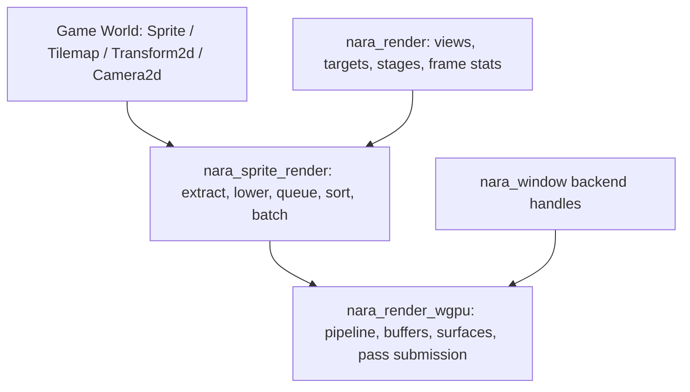

# 2D Sprite Tilemap Render Foundation - Plan

## Goal Capsule

| Field | Decision |
|---|---|
| Objective | Turn the current clear-pass backend into a real 2D render foundation with sprite authoring, tilemap authoring, backend-neutral extraction/queue/sort/batch data, and a first wgpu colored-quad draw path. |
| Authority | Accepted ADRs define the crate boundaries: authoring data leaves `nara_render`, render-domain batching stays backend-neutral, and `nara_render_wgpu` remains the only wgpu consumer. |
| Execution profile | Deep engine-foundation work with cross-crate API moves, new crates, wgpu pipeline work, examples, and boundary verification. |
| Stop conditions | Stop for user input only if the planned authoring/backend split contradicts an accepted ADR or if the pinned `wgpu` API cannot support the planned static sprite pass without a larger render graph. |
| Tail ownership | Implement with focused conventional commits; track progress outside this plan; update engineering memory after each durable milestone. |

---

## Product Contract

### Summary

This slice proves nara's first usable 2D rendering path without sacrificing the mature engine boundary.
Users should author a small 2D scene with `Transform2d`, `Camera2d`, `Sprite`, and `Tilemap`.
The backend should consume prepared render batches rather than gameplay components or wgpu-leaking data.

### Problem Frame

The previous slice added windows, extracted camera views, and a wgpu clear pass.
However, `Sprite` and `Texture2d` still live in `nara_render`, tilemap has no code representation, and the backend has no render item pipeline to exercise ADR 0017's phase model.
If the next implementation keeps extending `nara_render` as a mixed authoring/render/backend domain, future 3D, materials, texture upload, editor viewports, and alternate backends will inherit the wrong dependency shape.

### Requirements

**Authoring domains**

- R1. `nara_sprite` owns `Sprite`, `Texture2d`, sprite sizing, color tint, optional texture handle, texture region, anchor, and 2D sort data.
- R2. `nara_tilemap` owns first-class tilemap authoring data: tileset identity, tile size, tile coordinates, cells, layers, chunk identity, dirty revisions, and sort/layer controls.
- R3. The root facade and prelude expose 2D-first authoring APIs without requiring users to import render internals.

**Render-domain pipeline**

- R4. `nara_render` stops owning sprite/tilemap authoring data and keeps shared render concepts: targets, viewports, frame lifecycle, phase labels, frame stats, and backend-neutral render target images.
- R5. `nara_sprite_render` owns extraction, tilemap lowering, queueing, sorting, and batching for 2D quads without depending on `wgpu`.
- R6. The phase pipeline is explicit in app scheduling: extraction, prepare, queue, sort, render, and cleanup are representable without a full RenderGraph.

**wgpu backend**

- R7. `nara_render_wgpu` draws colored sprite/tilemap quads from backend-neutral batches and still clears each target.
- R8. Texture asset upload, atlases, samplers, bind groups, and material specialization remain out of scope, but data types must leave a clear path for them.
- R9. Boundary searches continue to prove `wgpu` only appears in `nara_render_wgpu` and `winit` only appears in `nara_winit`.

**Usability and continuity**

- R10. Existing headless examples keep compiling after the API move.
- R11. Add a small sprite/tilemap example that compiles with default features and a windowed example that compiles with `winit,wgpu`.
- R12. Architecture docs and engineering memory reflect the implemented crate split and any intentional deferrals.

### Scope Boundaries

- Do not implement a full RenderGraph in this slice.
- Do not implement texture upload, texture atlases, samplers, image loading, or asset hot reload.
- Do not implement 3D meshes, lights, depth, shadows, or post-processing.
- Do not build runtime UI, debug UI, editor UI, or gizmos.
- Do not introduce a universal user-facing `Renderable` component.
- Do not make `winit` or `wgpu` default facade dependencies.

### Acceptance Examples

- AE1. A user can write a default-feature scene with `Camera2d`, `Transform2d`, `Sprite::from_color`, and a `Tilemap` component without importing `nara_render` internals.
- AE2. A backend-neutral test can extract sprites and tilemap cells, sort them by layer/sort key/entity tie-breaker, and batch adjacent compatible quads.
- AE3. A wgpu-feature compile check proves the backend consumes `nara_sprite_render` batches and does not query gameplay `Sprite` or `Tilemap` components directly.
- AE4. `nara_render` no longer exposes user-facing `Sprite` or sprite texture authoring data, but still supports `RenderTarget::Image` through a render-domain image target type.
- AE5. Boundary searches show no `wgpu` imports outside `crates/nara_render_wgpu` and no `winit` imports outside `crates/nara_winit`.

---

## Planning Contract

### Key Technical Decisions

- KTD1. Split the ADR 0012 crate taxonomy now rather than keeping a compatibility layer in `nara_render`. The project is pre-1.0, and fearless refactor is cheaper than freezing the wrong public surface.
- KTD2. Keep `Camera2d` in `nara_render` for this slice because views and render targets already live there. Revisit a future `nara_camera` crate only when `Camera3d` or editor cameras create real pressure.
- KTD3. Replace `nara_render::Texture2d` with two concepts: `nara_sprite::Texture2d` for sprite authoring assets, and a backend-neutral render-target image type in `nara_render` for `RenderTarget::Image`.
- KTD4. Add app-level render stages for `Prepare`, `Queue`, `Sort`, and `Cleanup` instead of hiding those steps as ordered systems inside `CoreStage::Render`. ADR 0017 wants phases to be real concepts before a graph exists.
- KTD5. `nara_sprite_render` prepares logical colored quad vertices per extracted view. The wgpu backend packs those vertices into GPU buffers and owns all pipeline, shader, and buffer details.
- KTD6. The first renderer supports colored quads only. `Sprite` may carry optional texture data, but textured sprites are extracted and tracked as unsupported-for-draw until the asset/texture-upload slice lands.
- KTD7. Tilemaps lower into the same quad queue as sprites for the first slice. Public tilemap data includes chunk addressing and dirty revisions now, but chunked mesh caching and atlas batching are deferred until there is real texture/atlas pressure.
- KTD8. Sorting is deterministic and backend-neutral: view order first, then phase/layer/sort key, then stable entity-derived tie-breaker. This keeps AI-generated scenes reproducible and makes batching tests meaningful.
- KTD9. `MinimalPlugins` installs authoring and backend-neutral 2D render plugins, but not platform or GPU backends. The wgpu plugin remains opt-in.

### High-Level Technical Design



Render-frame data flow:

```text
Extract: rebuild ExtractedViews and ExtractedSprites from authoring ECS data
Prepare: reserved for future GPU resource preparation and texture upload
Queue: create per-view 2D render items from extracted sprites and lowered tilemap cells
Sort: order render items deterministically by view, phase, layer, sort key, and entity
Render: build backend-neutral batches; wgpu clears and draws colored quad batches
Cleanup: clear frame-local temporary state that should not survive into gameplay data
```

### Output Structure

```text
crates/
  nara_sprite/
  nara_tilemap/
  nara_sprite_render/
  nara_render/
  nara_render_wgpu/
examples/
  hello_world.rs
  sprite_tilemap_scene.rs
  windowed_clear.rs
  windowed_sprites.rs
docs/
  architecture/
  knowledge/engineering/
```

### Dependencies and Constraints

- Use the existing `bevy_ecs`, `glam`, `serde`, `wgpu = 30.0.0`, and `winit = 0.30.12` dependency choices.
- Add dependencies only where the boundary requires them. Any GPU packing helper must live in `nara_render_wgpu`, not in authoring crates.
- Keep `repo-ref/` read-only. Reference Bevy and Godot for architecture shape, not as code to vendor.
- Keep root default features empty and backend-free.

### System-Wide Impact

- Public imports move: existing examples and future AI-generated code should import `Sprite`, `Tilemap`, and `Texture2d` from the facade/prelude, not from `nara_render`.
- The app schedule gains new stages. Any existing stage-order tests must be updated to assert the fuller lifecycle.
- `nara_render_wgpu` changes from clear-only to clear-plus-sprite-pass. Surface and present error policy from the previous slice must remain intact.
- Documentation becomes more important because this slice turns ADR 0012 from target taxonomy into real crate boundaries.

### Sources & Research

- `AGENTS.md`
- `docs/architecture/adr/0005-dimension-aware-runtime-with-2d-first-authoring.md`
- `docs/architecture/adr/0012-render-crate-boundaries.md`
- `docs/architecture/adr/0016-extension-seams-for-backends-and-domain-modules.md`
- `docs/architecture/adr/0017-render-graph-policy.md`
- `docs/architecture/adr/0032-render-backend-integration-boundary.md`
- `crates/nara_render/src/lib.rs`
- `crates/nara_render_wgpu/src/lib.rs`
- `crates/nara_app/src/lib.rs`
- `repo-ref/bevy/crates/bevy_sprite/src/sprite.rs`
- `repo-ref/bevy/crates/bevy_sprite_render/src/lib.rs`
- `repo-ref/bevy/crates/bevy_sprite_render/src/render/mod.rs`
- `repo-ref/bevy/crates/bevy_core_pipeline/src/core_2d/mod.rs`
- `repo-ref/godot/scene/main/canvas_item.h`
- `repo-ref/godot/scene/2d/sprite_2d.h`
- `repo-ref/godot/scene/2d/tile_map_layer.h`
- `repo-ref/godot/servers/rendering/renderer_canvas_render.h`
- `repo-ref/godot/servers/rendering/renderer_rd/renderer_canvas_render_rd.h`
- `repo-ref/wgpu/examples/features/src/hello_triangle/mod.rs`

---

## Implementation Units

### U1. Add explicit render pipeline stages

- **Goal:** Make `Prepare`, `Queue`, `Sort`, and `Cleanup` first-class app stages so render-domain systems do not hide the ADR 0017 pipeline inside one render schedule.
- **Requirements:** R4, R6
- **Dependencies:** None
- **Files:** Modify `crates/nara_app/src/lib.rs`; modify tests in `crates/nara_app/src/lib.rs`; modify `crates/nara_render/src/lib.rs`; modify `crates/nara_render_wgpu/src/lib.rs`.
- **Approach:** Extend `CoreStage::ALL` around the existing `Extract` and `Render` stages. Keep existing `Render` submission behavior but move frame lifecycle and future cleanup hooks to named stages where practical.
- **Execution note:** Add/adjust lifecycle tests before moving systems between stages.
- **Patterns to follow:** Existing `CoreStage` order tests in `crates/nara_app/src/lib.rs`; ADR 0017 phase order.
- **Test scenarios:** `CoreStage::ALL` runs `Extract`, `Prepare`, `Queue`, `Sort`, `Render`, `Cleanup`, and `Last` in that order; existing fixed update tests still pass; `begin_render_frame` still runs before backend submission; an empty frame can still be marked skipped by the backend.
- **Verification:** App and render tests pass after the stage expansion.

### U2. Split sprite authoring out of `nara_render`

- **Goal:** Create `nara_sprite` as the stable user-facing sprite authoring crate and remove sprite authoring data from `nara_render`.
- **Requirements:** R1, R3, R4, R8, R10
- **Dependencies:** U1
- **Files:** Modify root `Cargo.toml`; create `crates/nara_sprite/Cargo.toml`; create `crates/nara_sprite/src/lib.rs`; modify `crates/nara_render/src/lib.rs`; modify `src/lib.rs`; modify `examples/hello_world.rs`; modify tests that reference `Sprite` or `Texture2d`.
- **Approach:** Move `Sprite` and sprite `Texture2d` into `nara_sprite`. Add `SpriteAnchor`, `TextureRegion`, and a small `SpritePlugin`. Replace render-target image texture usage in `nara_render` with a render-domain image target type so `nara_render` does not depend on `nara_sprite`.
- **Execution note:** This is a behavior-preserving API move; compile errors are the guide. Do not keep deprecated aliases in `nara_render`.
- **Patterns to follow:** `crates/nara_audio/src/lib.rs` and `crates/nara_input/src/lib.rs` for compact domain crates; root facade export style in `src/lib.rs`.
- **Test scenarios:** `Sprite::from_color` creates a non-textured colored sprite with default anchor and sort data; `Sprite::from_texture` stores a typed `Handle<nara_sprite::Texture2d>` without backend handles; facade prelude exports `Sprite`, `Texture2d`, and `SpritePlugin`; `nara_render` no longer exposes `Sprite`.
- **Verification:** Sprite and render crate tests pass; `rg -n "pub struct Sprite|Texture2d" crates/nara_render/src/lib.rs` shows no sprite authoring definitions.

### U3. Add first-class tilemap authoring

- **Goal:** Create `nara_tilemap` with minimal but mature tilemap data that can lower into sprite batches now and chunked render data later.
- **Requirements:** R2, R3, R8, R10
- **Dependencies:** U2
- **Files:** Modify root `Cargo.toml`; create `crates/nara_tilemap/Cargo.toml`; create `crates/nara_tilemap/src/lib.rs`; modify `src/lib.rs`; add tests in `crates/nara_tilemap/src/lib.rs`.
- **Approach:** Define `TileCoord`, `TileChunkCoord`, `TileIndex`, `TileCell`, `TileLayer`, `TileSet`, and `Tilemap`. Store cells as stable authoring data, not generated mesh data. Track dirty chunk revisions whenever cells change so future editor painting and hot reload can update tile data incrementally without changing the public model. Keep tile color support so the first renderer can draw tilemaps without texture upload.
- **Execution note:** Prefer simple typed data and deterministic iteration over a premature sparse/chunk storage abstraction.
- **Patterns to follow:** ADR 0005 tilemap vocabulary; Godot `TileMapLayer` and CanvasItem dirty-update behavior as reminders that layers, cells, and chunk dirtiness are user/domain concepts while rendering batches are internal.
- **Test scenarios:** Tile coordinates support negative world-space map coordinates; chunk coordinates floor-divide negative tile coordinates correctly; setting the same coordinate replaces the old cell and marks the affected chunk dirty; removing a cell marks the affected chunk dirty; empty tilemaps are allowed; iteration order is deterministic; facade prelude exports tilemap authoring types.
- **Verification:** Tilemap crate tests pass and default examples still compile.

### U4. Add backend-neutral 2D extraction, queueing, sorting, and batching

- **Goal:** Create `nara_sprite_render` as the render-domain bridge from authoring ECS data to backend-neutral quad batches.
- **Requirements:** R5, R6, R8, R10
- **Dependencies:** U1, U2, U3
- **Files:** Modify root `Cargo.toml`; create `crates/nara_sprite_render/Cargo.toml`; create `crates/nara_sprite_render/src/lib.rs`; modify `src/lib.rs`; modify `crates/nara_render/src/lib.rs` if view data needs 2D camera projection fields.
- **Approach:** Add `ExtractedSprite`, `ExtractedSprites`, `QueuedSpriteItem`, `QueuedSpriteItems`, `SpriteBatch`, and `SpriteBatches`. Extract colored sprites and tilemap cells from ECS, lower tilemap cells to quad-sized items, queue items per extracted view, sort deterministically, and batch adjacent compatible colored quads.
- **Execution note:** Implement behavior with focused tests before wiring the wgpu backend to consume the batches.
- **Patterns to follow:** Bevy `bevy_sprite_render/src/render/mod.rs` for extract/queue/batch separation; ADR 0017 phase readiness rules; current `ExtractedViews` resource pattern in `crates/nara_render/src/lib.rs`.
- **Test scenarios:** Extraction clears stale sprites every frame; sprites without `Transform2d` use identity transform; tilemap cells lower to world positions using tile size and tile coordinates; queueing skips unsupported textured sprites while recording count in stats or resource metadata; sorting is stable for equal layer/sort keys; compatible colored quads form one batch and layer/sort changes split batches; generated vertices fit the camera's viewport aspect and `Camera2d::viewport_height`.
- **Verification:** Sprite-render crate tests pass and no `wgpu` dependency appears in `nara_sprite_render`.

### U5. Teach the wgpu backend to draw colored 2D batches

- **Goal:** Extend `nara_render_wgpu` from clear-only to clear-plus-colored-sprite submission while preserving backend isolation and surface policy.
- **Requirements:** R7, R8, R9
- **Dependencies:** U4
- **Files:** Modify `crates/nara_render_wgpu/Cargo.toml`; modify `crates/nara_render_wgpu/src/lib.rs`; add `crates/nara_render_wgpu/src/sprite.wgsl`; add focused tests in `crates/nara_render_wgpu/src/lib.rs` or split test modules if the file becomes too large.
- **Approach:** Create a static colored quad pipeline per surface format, pack `nara_sprite_render` logical vertices into a GPU vertex buffer, and draw each batch after clearing the target. Keep pipeline, shader, buffer, and bind-group details private to the backend. Continue skipping frames for zero-size/occluded/timeout surface states.
- **Execution note:** Unit-test packing, layout, and draw-policy logic without requiring a GPU surface; use compile checks for real wgpu API compatibility.
- **Patterns to follow:** Existing clear-pass surface lifecycle in `crates/nara_render_wgpu/src/lib.rs`; wgpu `hello_triangle` pipeline setup in `repo-ref/wgpu/examples/features/src/hello_triangle/mod.rs`.
- **Test scenarios:** Vertex packing preserves position and color order; empty batches produce no sprite draw calls but still clear submitted targets; multiple batches produce multiple draw calls; missing batches do not panic; surface loss/reconfigure policy from the previous slice still passes; the backend does not query `Sprite` or `Tilemap` components.
- **Verification:** Wgpu crate tests pass; backend feature compile checks pass; boundary searches still isolate `wgpu`.

### U6. Wire examples, docs, memory, and verification

- **Goal:** Make the new 2D foundation discoverable and prove default-feature and backend-feature developer flows.
- **Requirements:** R3, R9, R10, R11, R12
- **Dependencies:** U2, U3, U4, U5
- **Files:** Modify `src/lib.rs`; modify `examples/hello_world.rs`; create `examples/sprite_tilemap_scene.rs`; create `examples/windowed_sprites.rs`; modify root `Cargo.toml`; modify `docs/architecture/nara-foundation.md`; modify `docs/architecture/open-questions.md`; add sharded memory files under `docs/knowledge/engineering/`.
- **Approach:** Install `SpritePlugin`, `TilemapPlugin`, and `SpriteRenderPlugin` in `MinimalPlugins`; expose facade modules and prelude exports; add a headless compile/run example and a windowed colored sprite example behind `winit,wgpu`; update docs to describe the now-real crate boundaries.
- **Execution note:** Keep progress in commits and memory, not in this plan file.
- **Patterns to follow:** Existing `examples/hello_world.rs`, `examples/windowed_clear.rs`, and memory log format under `docs/knowledge/engineering/logs/2026-07/`.
- **Test scenarios:** Default `cargo run -q --example hello_world` still works; default `cargo check --example sprite_tilemap_scene` works without `winit` or `wgpu`; `cargo check -p nara --features winit,wgpu --example windowed_sprites` compiles; root facade default dependency tree remains backend-free; architecture docs no longer say `nara_render` owns `Sprite`.
- **Verification:** Full Verification Contract passes or any unavailable gate is recorded with a concrete reason.

---

## Verification Contract

| Gate | Command | Expected Result |
|---|---|---|
| Format | `cargo fmt --all` | No formatting diff remains. |
| Workspace compile | `cargo check --workspace` | All default-feature crates compile. |
| Examples compile | `cargo check --examples` | Default examples compile without backend features. |
| Backend sprite example compile | `cargo check -p nara --features winit,wgpu --example windowed_sprites` | Windowed sprite example compiles only with optional backend features. |
| Existing backend example compile | `cargo check -p nara --features winit,wgpu --example windowed_clear` | Clear example remains compatible. |
| Tests | `cargo nextest run --workspace` | All non-ignored tests pass. |
| Headless smoke | `cargo run -q` | Root binary still runs without window/GPU dependencies. |
| Headless gameplay smoke | `cargo run -q --example hello_world` | Existing headless example still runs. |
| Sprite/tilemap example smoke | `cargo run -q --example sprite_tilemap_scene` | New default-feature 2D authoring example runs without platform/GPU dependencies. |
| Backend-free facade tree | `cargo tree -p nara --no-default-features` | The default facade tree does not contain `winit` or `wgpu`. |
| winit boundary | `rg -n "winit::|winit =" crates src Cargo.toml` | Matches only `crates/nara_winit` and workspace dependency metadata needed for that crate. |
| wgpu boundary | `rg -n "wgpu::|wgpu =" crates src Cargo.toml` | Matches only `crates/nara_render_wgpu` and workspace dependency metadata needed for that crate. |
| Authoring split | `rg -n "pub struct Sprite|Texture2d" crates/nara_render/src/lib.rs` | No sprite authoring definitions remain in `nara_render`. |
| Memory validation | `python "$HOME/.codex/skills/engineering-wiki-memory/scripts/wiki_memory.py" validate --root docs/knowledge/engineering` | Engineering memory bundle remains structurally valid. |

---

## Definition of Done

- `nara_sprite`, `nara_tilemap`, and `nara_sprite_render` exist as workspace crates with tests and facade exports.
- `nara_render` no longer owns sprite/tilemap authoring data and remains backend-neutral.
- The app lifecycle exposes explicit render pipeline stages beyond `Extract` and `Render`.
- `MinimalPlugins` installs 2D authoring and backend-neutral sprite render plugins while staying backend-free.
- The wgpu backend draws colored sprite/tilemap quad batches and keeps all `wgpu` usage inside `nara_render_wgpu`.
- Default-feature examples and optional backend examples compile through the root facade.
- Boundary searches for `winit`, `wgpu`, and render-authoring split pass.
- Architecture docs and engineering memory record the implemented split and intentional deferrals.
- Dead-end or experimental code from abandoned approaches is removed before final commit.

---

## Deferred to Follow-Up Work

- Texture upload, image assets, samplers, atlases, sprite materials, and bind-group specialization.
- Chunked tilemap rendering, dirty-region tracking, and atlas-aware tile batching.
- Visibility/culling, render layers, debug gizmos, and runtime UI composition.
- A full RenderGraph after a second concrete pass/resource use case appears.
- Future `Camera3d`, mesh, material, depth, and 3D render phases.
