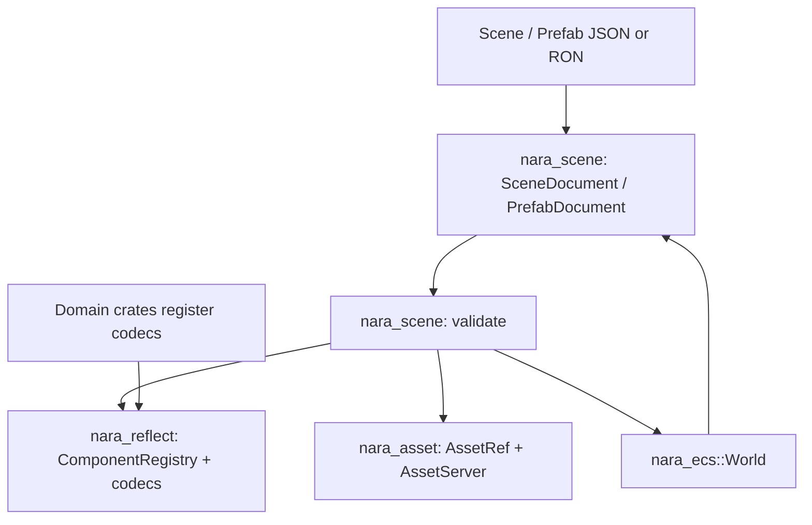

# Scene Prefab Serialization Foundation - Plan

## Goal Capsule

| Field | Decision |
|---|---|
| Objective | Build the first real data-driven scene/prefab foundation: stable scene-local entity IDs, registered component payloads, path-first asset references, validation diagnostics, world instantiate/export, and deterministic JSON/RON serialization. |
| Authority | ADR 0004, 0006, 0007, 0009, 0011, and 0026 define the boundaries: runtime `Entity` and backend/native handles must not become file identifiers; component files use stable schema IDs; editor/AI workflows operate on validated data documents. |
| Execution profile | Deep cross-crate engine-foundation work. Breaking changes are allowed because nara is pre-1.0 and the current placeholder scene/serde model violates accepted ADRs. |
| Stop conditions | Stop only if implementation reveals a cycle that would force scene documents to depend on domain crates, or if a planned serialized shape contradicts an accepted ADR. |
| Tail ownership | Implement in dependency order, commit focused milestones with Conventional Commit messages, update architecture docs and engineering memory when the implemented boundary changes. |

---

## Product Contract

### Summary

This plan turns nara's placeholder scene/reflection/asset shells into a usable authoring data pipeline. The file model stays dimension-neutral and AI-friendly, while runtime ECS data stays strongly typed and backend-free.

### Problem Frame

The current scene model is intentionally shallow: `SceneAsset` only records stable IDs and component type names, and `Scene`/`SceneNode` are tree-shaped placeholders. More importantly, several serde surfaces are unsafe as future file formats: `Parent` and `Children` contain runtime `Entity`, while `Handle<T>` serializes as runtime `AssetId`. If those shapes become user data, hot reload, prefab instancing, AI patches, and editor undo will inherit the wrong identity model.

The next foundation needs to introduce a real document boundary rather than merely adding derives. Scene/prefab files should store stable `SceneEntityId`, stable `ComponentTypeId`, component schema versions, component payload values, and semantic `AssetRef` values. Loading should validate the document first and only then spawn runtime entities with an explicit remap.

### Requirements

**Scene and prefab document model**

- R1. Replace placeholder scene asset structures with `SceneDocument`, `PrefabDocument`, `SceneEntityId`, `SceneEntityRecord`, `SceneComponentRecord`, and prefab-instance data.
- R2. Scene/prefab documents store stable scene-local IDs, not `bevy_ecs::Entity`.
- R3. Hierarchy in documents is represented with scene IDs and root/parent relationships; runtime `Parent` and `Children` are derived during instantiation.
- R4. Prefab support in this slice means direct `PrefabDocument` instantiation and top-level whole-component overrides. Scene files may store prefab-reference records for future tooling, but this slice does not recursively resolve nested prefab asset sources.
- R5. Document ordering is deterministic so generated JSON/RON is stable for diff review and AI repair loops.

**Component metadata and payloads**

- R6. Extend `ComponentRegistry` from schema-only metadata into the owner of serializable component codecs and serializable/runtime-only classification.
- R7. Component payloads use a nara-owned, format-neutral value representation that is serializable to JSON and RON, sortable by map key, and usable later by patch transactions.
- R8. Registered component schemas include stable `ComponentTypeId`, schema version, Rust type path as diagnostic metadata, and a clear serializable flag.
- R9. Unknown component IDs, unsupported schema versions, missing codecs, and invalid payloads produce structured diagnostics before world mutation.

**Asset identity**

- R10. Add a semantic `AssetRef` model whose successful Phase 1 resolve/export path is project-asset-root-relative paths; stable-ID support is reserved for a future `.meta`/import database.
- R11. Scene/prefab files refer to assets through `AssetRef`, not runtime `AssetId` or `Handle<T>` serialization.
- R12. Runtime `Handle<T>` remains the in-world typed handle; scene codecs resolve `AssetRef` through `AssetServer` at instantiate time and export handles back to asset refs when possible.

**World import/export**

- R13. A scene instantiate API preflights a document, spawns entities only after preflight succeeds, inserts registered components, applies parent links, records runtime-only scene ID provenance, and returns a `SceneEntityId -> Entity` map.
- R14. A scene export API reads supported registered components and scene ID provenance from a `World` and emits a deterministic `SceneDocument`.
- R15. Export does not serialize runtime-only components such as `Children`, `GlobalTransform2d`, dirty render state, extracted render data, or backend state.
- R16. Validation and instantiate/export APIs return `DiagnosticReport` with entity ID, component ID, field path or asset context wherever available.

**Built-in component coverage**

- R17. Built-in component codecs cover the first authoring set: `Name`, `Visibility`, `Transform2d`, `Camera2d`, `Sprite`, and `Tilemap`.
- R18. Components with runtime handles or runtime entities do not rely on direct component serde as the scene file format.
- R19. Domain crates register their own serializable components through plugins; `nara_scene` must not become a monolithic dependency on every gameplay/render domain.

**Format and examples**

- R20. JSON is the primary AI/tooling interchange format and RON is supported as the Rust-native hand-authored format.
- R21. Add a backend-free example gated by the `serde` feature that builds a scene document, serializes/deserializes it, instantiates it into a world, exports it, and proves deterministic roundtrip behavior.
- R22. Existing examples keep compiling after the breaking API cleanup.

### Scope Boundaries

- Do not implement full asset import, `.meta` lifecycle, UUID assignment, hot reload, or content-addressed import cache.
- Do not implement full reflection-derived generic serialization for arbitrary user components in this slice; explicit component codecs are acceptable as the stable interface.
- Do not implement field-level patch transactions, undo/redo stacks, editor UI, or AI SDK endpoints.
- Do not implement nested prefab override merging beyond storing the model shape and whole-component override capability.
- Do not build JSON Schema export yet; the registry shape should leave room for it.
- Do not make `wgpu`, `winit`, egui, or dear-imgui part of scene/serialization crates.

### Acceptance Examples

- AE1. A JSON scene containing `player`, `camera`, and `tiles` validates, spawns into `World`, returns a remap for all three IDs, and creates correct runtime parent/child links.
- AE2. Exporting that world produces a deterministic scene document whose entity and component ordering is stable across repeated runs.
- AE3. A sprite texture and a tilemap tileset roundtrip as path-based `AssetRef` values, while runtime `Handle<T>` and `AssetId` never appear in the serialized scene document.
- AE4. Duplicate entity IDs, missing parents, parent cycles, unknown component IDs, unsupported component versions, malformed payload fields, invalid asset paths, and unsupported stable asset IDs each produce structured diagnostics and prevent target-world mutation.
- AE5. A prefab document can be instantiated twice into the same world, with one instance applying a whole-component override, without scene-local ID collisions because each instantiate call returns its own runtime remap and scene ID provenance.
- AE6. Runtime-only data such as `Children`, `GlobalTransform2d`, extracted views, sprite batches, dirty tile chunks, and wgpu backend state is absent from exported scene documents.
- AE7. A hand-authored or AI-authored JSON fixture with one fixable component error returns diagnostics carrying entity/component/field context; after the fixture is corrected, validate/instantiate/export succeeds.

---

## Planning Contract

### Assumptions

- The user's latest instruction authorizes proceeding without another scoping checkpoint; unresolved design forks are recorded here and in Key Technical Decisions.
- This slice prefers correctness over compatibility. Existing placeholder types and unsafe serde impls can be removed or replaced.
- JSON should be the default AI-facing format; RON should exist for Rust-native readability, but both share one semantic document model.
- The first component codec API can be explicit and registry-driven even though ADR 0004 keeps Bevy Reflect as the metadata substrate.
- Asset paths are project `assets/` root-relative logical paths unless a future project manifest overrides the root.

### Key Technical Decisions

- KTD1. `nara_reflect` owns the generic component value, schema metadata, and codec registration surface. `nara_scene` consumes registry metadata but does not know about Sprite, Tilemap, Camera, or other domain crates directly.
- KTD2. Component codecs are explicit functions registered by domain crates in this slice. Each codec has a pure preflight/prepare step and an apply step; target-world mutation is allowed only after every entity and component has preflighted successfully.
- KTD3. `SceneEntityId` is a validated string newtype rather than a runtime integer or UUID. It is human-readable and AI-friendly now, while still allowing future editor-generated UUID-like strings.
- KTD4. `AssetRef::Path` is the only Phase 1 resolve/export success path. If a stable-ID variant is represented now, validation reports it as unsupported instead of silently pretending `.meta` identity exists. `Handle<T>` should not serialize to runtime `AssetId` as user/project data.
- KTD5. Runtime hierarchy components stay runtime-only: documents store parent/root relationships by `SceneEntityId`, and instantiation derives `Parent`/`Children`.
- KTD6. Whole-component prefab overrides ship first. Field-level patches belong to the ADR 0026 transaction layer and should build on the same `ComponentValue` later.
- KTD7. Validation is a first-class phase. The loader validates duplicate IDs, unknown components, schema versions, parent existence, parent cycles, and codec payloads before mutating the target world.
- KTD8. Determinism is part of the API contract. Scene records use sorted maps and stable entity ordering instead of depending on ECS iteration order.
- KTD9. Built-in component registration belongs with the crate that owns the component. `MinimalPlugins` should install those registrations through normal plugins/resources.
- KTD10. Imported scene IDs are preserved through a runtime-only authoring metadata component such as `SceneEntitySource`. Export reuses this provenance; entities without provenance receive deterministic export-session IDs but those IDs are not promised as long-term authoring identity.
- KTD11. `AssetRef::Path` uses normalized logical paths: non-empty, `/` separators, no absolute paths, no `.` or `..` traversal, and no backend filesystem handles. Invalid normalization produces diagnostics.
- KTD12. `ComponentValue` has a canonical value domain: null, bool, signed/unsigned integers, finite floats, strings, lists, and `BTreeMap`-backed maps. NaN/Inf and non-canonical map keys are validation errors.

### High-Level Technical Design



Instantiate flow:

```text
SceneDocument
  -> validate IDs, parent graph, component registrations, asset refs, and component payloads
  -> preflight codecs into prepared component operations without mutating the target World
  -> allocate runtime entities and build SceneEntityId -> Entity map
  -> apply prepared component operations through ComponentRegistry codecs
  -> insert Parent links from scene parent IDs
  -> insert runtime-only SceneEntitySource provenance
  -> sync Children from Parent links
  -> return SceneSpawnReport { entity_map, diagnostics }
```

Export flow:

```text
World
  -> choose exportable entities
  -> reuse SceneEntitySource IDs or assign deterministic export-session IDs
  -> encode registered serializable components through ComponentRegistry codecs
  -> encode hierarchy by parent IDs
  -> sort entities/components
  -> return SceneDocument + warnings for skipped runtime-only or unregistered data
```

### Context & Research

- `docs/architecture/adr/0004-use-bevy-reflect-backed-component-metadata.md`
- `docs/architecture/adr/0006-scene-and-prefab-data-model.md`
- `docs/architecture/adr/0007-asset-identity-and-import-pipeline.md`
- `docs/architecture/adr/0009-diagnostics-errors-and-logging.md`
- `docs/architecture/adr/0011-component-schema-ids-and-migrations.md`
- `docs/architecture/adr/0026-editor-command-patch-and-undo-model.md`
- `docs/architecture/open-questions.md`
- `docs/architecture/nara-foundation.md`
- `crates/nara_reflect/src/lib.rs`
- `crates/nara_scene/src/lib.rs`
- `crates/nara_asset/src/lib.rs`
- `crates/nara_sprite/src/lib.rs`
- `crates/nara_tilemap/src/lib.rs`
- `crates/nara_render/src/lib.rs`
- Read-only agent finding: current `Parent`/`Children` and `Handle<T>` serde are the highest-risk identity leaks; scene validation must return structured diagnostics suitable for AI repair.

### System-Wide Impact

- Public scene names change from placeholder `Scene`/`SceneAsset`/`SceneNode` toward document-oriented `SceneDocument` and `PrefabDocument`.
- The `serde` feature should no longer imply that runtime IDs and runtime handles are safe persistent scene data.
- `nara_reflect` becomes a runtime resource used by plugins, scene loading, future inspector UI, and future patch transactions.
- Domain crates gain lightweight registration dependencies on `nara_reflect`, but backend crates remain isolated from scene file semantics.
- `MinimalPlugins` becomes the default place where built-in component registration is assembled for examples and tests.
- Diagnostics may need small context extensions so validation reports can identify entity IDs, component IDs, asset refs, and fields without encoding that context in prose only.
- Serde feature wiring must include document dependencies: `nara_scene/serde` depends on `nara_asset/serde`, `nara_reflect/serde`, and `nara_diagnostic/serde`, while the root facade serde feature exposes the same graph.

---

## Implementation Units

### U1. Harden asset identity and remove runtime handle serialization leakage

- **Goal:** Introduce semantic serialized asset references and stop treating `Handle<T>`'s runtime `AssetId` as a file-format identity.
- **Requirements:** R10, R11, R12, R18, AE3
- **Dependencies:** None
- **Files:** Modify `crates/nara_asset/src/lib.rs`; modify `crates/nara_asset/Cargo.toml` if needed; adjust dependent component serde derives in `crates/nara_sprite/src/lib.rs`, `crates/nara_tilemap/src/lib.rs`, and `crates/nara_render/src/lib.rs`; update facade exports in `src/lib.rs`.
- **Approach:** Add `AssetRef` with path-backed success semantics and UUID-ready extension shape. Keep `AssetPath` as the current path wrapper, but normalize it as a logical project-asset-root path using `/` separators and rejecting empty, absolute, `.` and `..` traversal paths. Add helpers to resolve a typed handle from an `AssetRef::Path` through `AssetServer` and to export a handle back to an `AssetRef` when the server knows its path. Unsupported stable-id refs produce diagnostics rather than resolving. Remove or disable `Handle<T>` serde as persistent project data.
- **Patterns to follow:** Existing `AssetServer::reserve` path-to-handle behavior; ADR 0007 path-first/UUID-ready decision.
- **Test scenarios:** Re-resolving the same normalized path yields the same typed handle; invalid paths are rejected with diagnostics; exporting a known handle returns the original path ref; exporting an unknown handle returns a diagnostic-friendly failure; stable-id refs fail predictably until the import database exists; serde-enabled compile no longer serializes a handle as raw `AssetId`.
- **Verification:** `cargo check --workspace --features serde`; asset crate unit tests.

### U2. Deepen diagnostics for scene/component validation context

- **Goal:** Make validation reports machine-actionable without forcing every caller to parse diagnostic prose.
- **Requirements:** R9, R16, AE4
- **Dependencies:** None
- **Files:** Modify `crates/nara_diagnostic/src/lib.rs`; update diagnostic tests.
- **Approach:** Add optional structured context fields for entity ID, component ID, field path, and asset ref as strings. Keep the existing simple constructors, and add builder-style helpers so existing callers are not noisy.
- **Patterns to follow:** Existing `DiagnosticReport` as the central report collector; ADR 0009 structured diagnostics.
- **Test scenarios:** A diagnostic can carry an entity ID, component ID, field path, and asset ref; `has_errors` behavior remains unchanged; existing warning/info constructors still work.
- **Verification:** Diagnostic crate tests and workspace tests.

### U3. Add component value and serializable codec registration

- **Goal:** Turn `ComponentRegistry` into the bridge between stable component IDs and typed ECS component insertion/export.
- **Requirements:** R6, R7, R8, R9, R17, R19
- **Dependencies:** U2
- **Files:** Modify `crates/nara_reflect/src/lib.rs`; possibly split into `value.rs`, `codec.rs`, and `schema.rs` modules if the file grows; update `crates/nara_reflect/Cargo.toml`; update tests.
- **Approach:** Add deterministic `ComponentValue` primitives, lists, and maps with explicit numeric rules: signed/unsigned integers, finite floats only, strings, null, lists, and `BTreeMap` maps. Add serializable/runtime-only metadata to `ComponentSchema`. Add codec registration APIs keyed by `ComponentTypeId` and schema version. The decode side should preflight into a prepared component operation before any target-world mutation; the apply side receives a validated operation and inserts into the world. Keep Bevy Reflect registration for metadata and future inspectors.
- **Patterns to follow:** Existing stable ID registry; ADR 0004 and ADR 0011.
- **Test scenarios:** Registry distinguishes inspectable-only and serializable components; duplicate stable ID registration is rejected or diagnosed; unknown component lookup returns no codec; invalid floats are rejected; a test component can preflight from `ComponentValue`, apply into a world entity, and encode back deterministically.
- **Verification:** Reflect crate tests; `cargo check --workspace --features serde`.

### U4. Replace placeholder scene data with stable document types and validation

- **Goal:** Create the persistent scene/prefab document model with stable IDs, component records, hierarchy records, and validation diagnostics.
- **Requirements:** R1, R2, R3, R4, R5, R9, AE4
- **Dependencies:** U2, U3
- **Files:** Modify `crates/nara_scene/src/lib.rs`; split into `document.rs`, `validation.rs`, and `hierarchy.rs` if useful; update `crates/nara_scene/Cargo.toml`; update facade exports in `src/lib.rs`.
- **Approach:** Replace placeholder `SceneEntity`, `SceneAsset`, `Scene`, and `SceneNode` with document-oriented types. Add `SceneEntityId` validation, component records keyed by `ComponentTypeId`, explicit parent references by scene ID, root derivation or root list validation, and direct `PrefabDocument` records with top-level whole-component override support. If prefab reference records are included, they are stored/validated as future-facing data only: no recursive source asset load or nested merge in this slice. Keep runtime `Name`, `Parent`, `Children`, and `Visibility` in this crate but remove unsafe file serde from runtime entity-link components.
- **Patterns to follow:** Current `sync_children` behavior for deriving `Children`; ADR 0006 document shape.
- **Test scenarios:** Valid IDs are accepted and invalid/empty IDs are rejected; duplicate IDs fail validation; missing parent and parent-cycle graphs fail validation; roots are deterministic; document maps serialize deterministically with serde enabled.
- **Verification:** Scene crate tests; `cargo check --workspace --features serde`.

### U5. Implement scene instantiate/export with entity remapping

- **Goal:** Load validated scene/prefab documents into a runtime `World` and export supported world data back to documents.
- **Requirements:** R12, R13, R14, R15, R16, AE1, AE2, AE5, AE6
- **Dependencies:** U1, U3, U4
- **Files:** Modify `crates/nara_scene/src/lib.rs` or add `instantiate.rs` and `export.rs`; update tests.
- **Approach:** Add `SceneSpawner`, `SceneSpawnReport`, `SceneEntityMap`, and runtime-only scene ID provenance such as `SceneEntitySource`. Preflight all graph, asset, and component codec work before mutating the target `World`; only after every preflight succeeds should the spawner allocate entities, apply prepared components, insert parent links, and record provenance. Add export APIs that reuse provenance when present, assign deterministic export-session IDs when absent, encode only registered serializable components, and warn for skipped unregistered/runtime-only data.
- **Patterns to follow:** Existing `spawn_child` and `sync_children` runtime behavior; Bevy/Godot lesson that persistent IDs are separate from runtime object handles.
- **Test scenarios:** A three-entity hierarchy spawns with correct remap, `Children`, and `SceneEntitySource`; prefab instantiation can run twice with a whole-component override and without runtime collisions; failed preflight does not mutate the target world; import-edit-export preserves imported IDs; export skips `Children` and `GlobalTransform2d`; repeated export is stable.
- **Verification:** Scene crate tests and example roundtrip.

### U6. Register built-in component codecs in their owning crates

- **Goal:** Make the first built-in authoring components scene-serializable without making `nara_scene` depend on every domain crate.
- **Requirements:** R17, R18, R19, AE1, AE3, AE6
- **Dependencies:** U1, U3, U5
- **Files:** Modify `crates/nara_scene/src/lib.rs` for `Name` and `Visibility`; modify `crates/nara_transform/src/lib.rs`; modify `crates/nara_render/src/lib.rs`; modify `crates/nara_sprite/src/lib.rs`; modify `crates/nara_tilemap/src/lib.rs`; update relevant `Cargo.toml` files; update `src/lib.rs`.
- **Approach:** Each plugin registers its component schemas/codecs into `ComponentRegistry`. Land this in a narrow vertical slice first with `Name`, `Visibility`, and `Transform2d` so validate -> instantiate -> export is exercised before asset-bearing codecs are added. Then add `Camera2d`, `Sprite`, and `Tilemap`. Encode simple scalar/vector/color data as `ComponentValue` maps. Encode asset-bearing fields through `AssetRef` resolution/export helpers. Keep runtime-only fields such as dirty tile chunk revision out of authoring output.
- **Patterns to follow:** Existing plugin installation in `MinimalPlugins`; existing component ownership boundaries from the 2D render foundation.
- **Test scenarios:** A minimal `Name`/`Transform2d` vertical slice roundtrips before asset-bearing codecs land; `Camera2d`, `Sprite`, and `Tilemap` decode from values into runtime components; sprite texture and tilemap tileset paths resolve through `AssetServer`; encode skips or warns when asset path cannot be recovered; dirty tilemap revision data is not exported.
- **Verification:** Domain crate tests and workspace tests.

### U7. Add JSON/RON document IO and a roundtrip example

- **Goal:** Prove the authoring data model works as files and as code-first data.
- **Requirements:** R20, R21, R22, AE1, AE2, AE3
- **Dependencies:** U4, U5, U6
- **Files:** Modify root `Cargo.toml`; modify `crates/nara_scene/Cargo.toml`; modify `crates/nara_scene/src/lib.rs`; add `examples/scene_prefab_roundtrip.rs`; update README or architecture docs if command examples are present.
- **Approach:** Add serde-backed JSON and RON helpers behind the `serde` feature. Keep the helpers thin over the semantic document model and use canonical JSON output for deterministic diff checks. The example should construct a scene document, serialize to JSON/RON, deserialize, validate, instantiate, export, and assert stable canonical JSON. Add a hand-authored or AI-authored invalid fixture that produces entity/component/field diagnostics, then correct it and prove the repaired document instantiates.
- **Patterns to follow:** Existing default-feature examples and facade prelude usage.
- **Test scenarios:** JSON roundtrip preserves semantic document equality; RON roundtrip preserves semantic document equality; canonical JSON stays stable after export; the invalid-fixture repair loop produces actionable diagnostics and then succeeds; example compiles and runs with `--features serde`.
- **Verification:** `cargo run -q --features serde --example scene_prefab_roundtrip`; workspace serde checks.

### U8. Update docs, facade, and architecture memory

- **Goal:** Keep the repository's durable architecture contract aligned with the implemented serialization foundation.
- **Requirements:** R20, R21, R22
- **Dependencies:** U1-U7
- **Files:** Modify `src/lib.rs`; modify `docs/architecture/nara-foundation.md`; modify `docs/architecture/open-questions.md`; add/update files under `docs/knowledge/engineering/`.
- **Approach:** Export the new scene/reflection/asset types in the facade prelude. Mark resolved open questions around `SceneEntityId`, path-backed `AssetRef`, component codec preflight/apply shape, ID provenance, and JSON/RON default. Record deferred follow-up work for migrations, JSON Schema, field patches, recursive prefab source resolution, nested prefab overrides, and asset meta files.
- **Patterns to follow:** Existing architecture docs and engineering memory style.
- **Test scenarios:** Public prelude imports are sufficient for the roundtrip example; docs no longer describe `SceneAsset` as a placeholder; open questions distinguish resolved-by-this-slice decisions from follow-up work.
- **Verification:** Documentation review and final repo checks.

---

## Verification Contract

- `cargo fmt --all --check`
- `cargo check --workspace`
- `cargo check --workspace --features serde`
- `cargo check --examples`
- `cargo check -p nara --features winit,wgpu --example windowed_clear`
- `cargo check -p nara --features winit,wgpu --example windowed_sprites`
- `cargo run -q --features serde --example scene_prefab_roundtrip`
- `cargo nextest run --workspace`
- `rg -n "winit::|winit =" crates src Cargo.toml`
- `rg -n "wgpu::|wgpu =" crates src Cargo.toml`
- `rg -n "Serialize for Handle|Deserialize.*Handle|derive\\(.*Serialize.*Parent|derive\\(.*Deserialize.*Parent|derive\\(.*Serialize.*Children|derive\\(.*Deserialize.*Children" crates`

Expected boundary outcomes:

- `winit` remains isolated to `nara_winit` and manifest declarations.
- `wgpu` remains isolated to `nara_render_wgpu` and manifest declarations.
- No persistent scene/prefab serialization path stores runtime `Entity`, runtime `AssetId`, or backend handles; runtime `Parent` and `Children` may still exist as ECS components but are not the file format.
- The serde feature compiles because document-facing types, not unsafe runtime handles, own the persistent format.

---

## Risks & Dependencies

| Risk | Severity | Likelihood | Mitigation |
|---|---|---:|---|
| Codec API becomes too generic too early | High | Medium | Keep the first API concrete: `ComponentValue`, stable ID, schema version, and preflight/apply codec functions. Defer schema export and migration chains. |
| Domain crates introduce dependency cycles | High | Low | Put generic value/codec types in `nara_reflect`; domain crates register codecs into the registry; `nara_scene` consumes registry only. |
| Removing `Handle<T>` serde breaks existing component serde expectations | Medium | High | This is an intended pre-1.0 break. Provide scene codecs and `AssetRef` helpers as the supported persistent path. |
| Scene export accidentally depends on ECS iteration order | Medium | Medium | Sort entity IDs and component records explicitly before serialization. Add repeated-export tests. |
| Validation mutates world before discovering an error | High | Medium | Require codec preflight and asset-path validation before allocation/insertion. Add a no-target-world-mutation test. |
| RON/JSON support leaks format details into core documents | Medium | Low | Keep format helpers thin and optional behind `serde`; document types remain semantic Rust structs. |
| Stable scene IDs drift on export | High | Medium | Store runtime-only scene ID provenance during import and reuse it during export; generated IDs are deterministic but not a replacement for imported authoring identity. |

---

## Definition of Done

- The placeholder scene asset model is replaced or aliased to real document types.
- Runtime `Entity` and `Handle<T>` are no longer treated as persistent scene file identities.
- Built-in scene, transform, render, sprite, and tilemap components can be registered, validated, instantiated, and exported through the registry.
- JSON and RON scene document roundtrips pass under the `serde` feature.
- The roundtrip example demonstrates code-first authoring, file serialization, world instantiation, and deterministic export.
- The invalid-fixture repair test proves diagnostics carry enough context for AI/human repair.
- Import-edit-export preserves imported `SceneEntityId` values through runtime-only provenance.
- Workspace checks, serde checks, backend example checks, and nextest pass.
- Architecture docs and engineering memory reflect the new boundary and remaining follow-up work.
