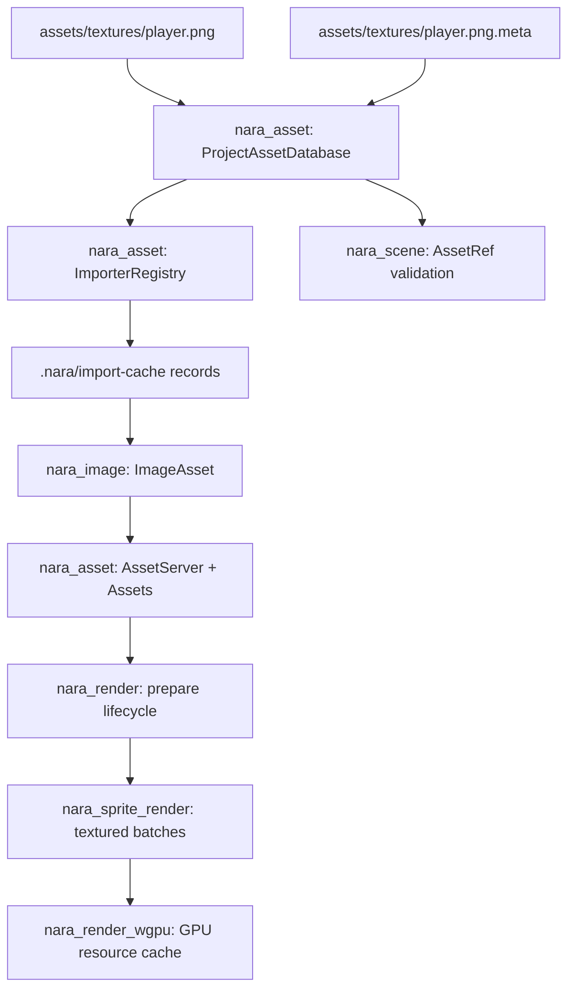

# Asset Render Resource Seam - Plan

## Goal Capsule

| Field | Decision |
|---|---|
| Objective | Implement the first asset import and render resource preparation seam: `.meta` stable identity, project asset database, importer/artifact cache records, image assets, asset versions and reload events, backend-neutral render preparation, wgpu texture cache, and textured sprite/tilemap rendering through typed handles. |
| Authority | ADR 0007, 0008, 0012, 0017, 0020, 0032, and 0033 define the boundary: source assets and imported artifacts are separate, GPU resources stay backend-private, and gameplay/scene data stores typed handles or semantic asset refs rather than backend handles. |
| Execution profile | Deep cross-crate engine-foundation work. Breaking changes, crate splits, and deletion of placeholder behavior are allowed because nara is pre-1.0 and the current texture path is intentionally incomplete. |
| Stop conditions | Stop only if implementation reveals a dependency cycle that would force `nara_asset` or gameplay-facing crates to depend on `wgpu`, or if a planned serialized shape contradicts an accepted ADR. |
| Tail ownership | Implement in dependency order, keep progress outside this plan, commit focused milestones with Conventional Commit messages, and update architecture docs and engineering memory when the implemented boundary changes. |

---

## Product Contract

### Summary

This slice turns nara's asset path placeholders into a real source-asset to render-resource pipeline.
The first concrete asset is a 2D image texture, but the seam should avoid image-only assumptions and include a lightweight extension proof for later UI images, fonts, materials, meshes, and editor asset tools.

### Problem Frame

nara can now serialize scenes and render colored sprite/tilemap batches, but textured rendering is still deliberately blocked.
`AssetRef::StableId` is a reserved variant, `AssetServer` is only a path-to-runtime-ID table, `Assets<T>` allocates IDs independently, `SpriteBatches` cannot carry texture/UV identity, and the wgpu backend has no texture/sampler/bind-group cache.

If textured sprites are implemented by loading image paths directly in `nara_render_wgpu`, future rename-safe asset IDs, import caches, hot reload, runtime UI images, sprite atlases, materials, and 3D meshes will all need a rewrite.
The correct next step is to build the asset import and render preparation seam first, then make sprite/tilemap textures the first pressure test.

### Requirements

**Asset identity and project database**

- R1. Source assets have validated logical paths and source-side `.meta` records that carry stable project asset IDs.
- R2. `AssetRef::Path` and `AssetRef::StableId` both resolve through a project asset database before scene/world mutation.
- R3. Duplicate stable IDs, missing source files, missing metadata, path/meta mismatches, and unsupported asset types produce structured diagnostics.
- R4. Runtime `Handle<T>` allocation is unified so a reserved handle and a loaded asset value cannot silently land in different `AssetId` spaces.
- R5. `nara_asset` exposes load state, asset version, dependency edges, and reload/change events without depending on render or backend crates.

**Import and artifact cache**

- R6. Importer registration records importer ID, version, supported source extensions, settings hash, target/import profile, dependencies, and output asset type.
- R7. Imported artifact identity is deterministic from stable asset ID, source content hash, dependency digest, importer ID/version, settings hash, and import profile.
- R8. Generated artifacts and records live under `.nara/import-cache/`; source `.meta` files remain beside source assets.
- R9. Phase 1 import can run synchronously, but the public model must leave room for engine-owned IO/task-pool integration.

**Image assets and render preparation**

- R10. Introduce a backend-neutral image asset model with pixel format, color space, extent, sampler intent, source metadata, and raw pixel data.
- R11. Image import produces `ImageAsset` data and render-resource descriptors without creating backend-native handles.
- R12. `nara_render` owns backend-neutral prepare state: render asset versions, prepared resource keys, invalidation, retry/failure state, and prepare/queue ordering.
- R13. Render resource preparation invalidates when asset version, descriptor, importer version, or source hash changes while preserving stable handles.

**2D authoring and rendering**

- R14. `nara_sprite` stores sprite texture handles to reusable image assets, not sprite-local GPU or path data.
- R15. `nara_tilemap` tilesets carry minimal atlas/image metadata: image handle, tile size, columns/rows or equivalent layout, and color tint support.
- R16. `nara_sprite_render` queues textured and untextured items with explicit texture/material/UV batch keys; it no longer filters all textured sprites as unsupported.
- R17. `nara_render_wgpu` owns texture, view, sampler, bind-group, buffer, and pipeline caches and consumes prepared image/texture resources from backend-neutral data.
- R18. The root facade default feature set stays backend-free; `winit` and `wgpu` remain optional and isolated.

**Scene, examples, and docs**

- R19. Scene/prefab validation resolves known stable asset IDs before world mutation and reports unknown asset refs with field/entity/component context.
- R20. JSON/RON scene and prefab data never serialize runtime `AssetId`, `Handle<T>`, `Entity`, or backend-native handles.
- R21. Examples prove path refs, stable ID refs, import/cache records, image prepare, textured sprite rendering, and reload invalidation at compile or unit-test level.
- R22. Architecture docs, open questions, `.gitignore`, and engineering memory align on `.nara/import-cache/` and the implemented crate boundaries.
- R23. A lightweight mock importer and mock prepared resource prove the asset/import/render-prepare seam is not hardcoded to image or sprite assets without implementing future UI/font/material/mesh features.

### Scope Boundaries

- Do not implement a full file watcher or platform-specific hot reload loop; model reload events and version invalidation first.
- Do not implement a full task-pool crate in this slice; keep synchronous import internals behind async-ready state/events.
- Do not implement a full RenderGraph; keep explicit phases and named resource lifetimes per ADR 0017.
- Do not implement material graphs, PBR, 3D mesh import, texture streaming, compression profiles, mipmap generation, atlas packing, or platform texture format matrices.
- Do not implement editor asset browsers, import setting UI, undo integration, or package/export remapping.
- Do not add GPU types, wgpu descriptors, bind groups, or backend handles to `nara_asset`, `nara_image`, `nara_sprite`, `nara_tilemap`, `nara_render`, or scene documents.

### Acceptance Examples

- AE1. A source asset `textures/player.png` can receive or validate a sidecar `textures/player.png.meta`, resolve by path, and resolve by stable ID to the same typed handle.
- AE2. Duplicate stable IDs or mismatched `.meta` paths are reported as hard diagnostics before scene instantiation mutates a target `World`.
- AE3. Changing source hash, importer version, import settings hash, or import profile changes the artifact cache key while stable asset ID and runtime handle identity remain stable.
- AE4. A generated image fixture imports into a backend-neutral `ImageAsset` with extent, pixel format, color space, and pixel bytes without any `wgpu` dependency.
- AE5. Asset version changes produce render-prepare invalidation and leave the stable `Handle<ImageAsset>` unchanged.
- AE6. A textured sprite and a colored sprite can be extracted, queued, sorted, and batched; batches split when texture, sampler/material key, phase, layer, or sort key changes.
- AE7. A tilemap tileset with an image atlas lowers tile cells into textured items with deterministic UVs and stable batching.
- AE8. The wgpu backend creates or reuses cached texture resources for prepared images, invalidates bind groups on version change, and keeps all GPU objects private.
- AE9. A scene with `AssetRef::StableId` succeeds when the ID exists in the project asset database and fails without world mutation when it does not.
- AE10. Boundary searches still show `wgpu` only in `crates/nara_render_wgpu` and `winit` only in `crates/nara_winit` plus manifest metadata.
- AE11. Code-first game code can use the public facade to resolve an `AssetRef::Path` or `AssetRef::StableId` into `Handle<ImageAsset>`, bind it to `Sprite` or `TileSet`, and render through the texture path without touching backend types.
- AE12. A test-only non-image importer or prepared-resource type can register through the same asset/import/render-prepare APIs without changes to the core seam.

---

## Planning Contract

### Assumptions

- The user's latest instruction authorizes proceeding without another scoping checkpoint and favors correctness over compatibility.
- The first project asset database can be an in-memory index built from a configured asset root and explicit scan/import calls; persistent editor UX comes later.
- Stable asset IDs should be opaque typed values. A UUID-compatible textual representation is the preferred first implementation because it matches mature engine `.meta` workflows and remains AI-editable.
- `image`, `uuid`, and `blake3` are acceptable focused dependencies if they remain in non-backend crates and are pinned through workspace dependencies.
- `nara_image` should start with a narrow codec policy: PNG/RGBA8 import with `image` default features disabled unless implementation proves another format is required.
- `notify` or any file watcher dependency is deferred; manual reload/invalidation APIs are enough for the first hot-reload-ready proof.
- A new `nara_image` crate is justified because image assets will be shared by sprites, tilemaps, runtime UI, text/font atlases, materials, and future 3D.

### Key Technical Decisions

- KTD1. `nara_asset` owns source identity, `.meta`, project asset indexing, importer registry metadata, artifact cache records, load state, dependency graph data, asset events, and asset versions. It does not decode image pixels and does not know about render resource preparation.
- KTD2. `AssetServer` is the only runtime handle allocation authority. `Assets<T>` becomes storage keyed by caller-provided `Handle<T>` values, and any convenience add API must allocate through `AssetServer`; `Assets<T>::insert` or its replacement must not let later allocation overwrite a reserved handle.
- KTD3. Source metadata lives beside source assets as `.meta`; generated cache records live under `.nara/import-cache/`. ADR 0020 should be updated to match ADR 0033 instead of keeping parallel `.nara/import` and `.nara/cache` names.
- KTD4. Importers output backend-neutral assets and descriptors. The first importer is image import, producing `nara_image::ImageAsset`; it must not create texture views, samplers, bind groups, or wgpu descriptors.
- KTD5. `nara_render` owns generic preparation lifecycle types and typed prepared-resource tables, not image decoding. `nara_image` owns the concrete image prepare system: it reads `Assets<ImageAsset>` plus asset versions, writes prepared image resources using `nara_render` keys/snapshots, and leaves `nara_sprite_render` to consume only render resource keys and UVs.
- KTD6. `nara_sprite` and `nara_tilemap` depend on reusable image asset handles. `nara_sprite::Texture2d` as a sprite-local asset marker should be removed or replaced by a compatibility-free `Handle<nara_image::ImageAsset>` API.
- KTD7. Sprite/tilemap render batches must include texture/resource keys and UV data. Different textures, samplers, material states, phases, layers, or sort keys cannot be merged into one draw batch.
- KTD8. Wgpu resource caches are backend-private and version-keyed. Device loss or asset version changes invalidate cached texture views, samplers, bind groups, and dependent pipelines without changing gameplay handles.
- KTD9. Scene validation remains two-phase. Component codecs or an asset-aware preflight layer must validate `AssetRef::StableId` and path refs before allocating entities or inserting components.
- KTD10. Hot reload readiness is version/event driven. The first implementation may use manual `reload_asset` or `mark_asset_modified` calls, but render preparation must consume version changes rather than path strings.
- KTD11. Asset data, descriptor/import hashes, `AssetVersion`, and asset events share one commit boundary. Render prepare reads a `(handle, version, descriptor hash)` snapshot and discards prepared results whose version no longer matches current asset state.
- KTD12. `AssetPath` is a logical UTF-8 path with `/` separators, no absolute path, no drive prefix, no empty segment, no `.` or `..`, and case-sensitive identity. Project database scans must diagnose case-insensitive collisions, meta path mismatches, and filesystem canonicalization that escapes the configured asset root through symlinks or equivalent platform behavior.
- KTD13. Imported artifact keys include an importer-reported dependency digest. Phase 1 image imports may have an empty dependency digest, but the cache format and tests must cover sorted dependency hashes so future atlas/font/material sidecars cannot return stale artifacts.

### High-Level Technical Design



Asset load/import/prepare flow:

```text
AssetRef::Path or AssetRef::StableId
  -> ProjectAssetDatabase resolves source asset and metadata
  -> AssetServer reserves stable typed handle
  -> ImporterRegistry selects importer from source type/profile
  -> importer computes source hash and artifact key
  -> cache hit loads artifact record, cache miss imports source data
  -> Assets<ImageAsset> stores data under the reserved handle
  -> AssetEvent and AssetVersion mark the handle ready/modified
  -> render prepare creates or invalidates prepared resource records
  -> wgpu backend builds or reuses GPU resource cache entries
```

### System-Wide Impact

- `nara_asset` will likely split from one `lib.rs` into focused modules for identity, metadata, database, import, storage, state, and events.
- `nara_image` becomes a new workspace crate and facade export.
- `nara_sprite`, `nara_tilemap`, `nara_sprite_render`, and scene codecs will break their current `Texture2d`/`TileSet` assumptions.
- `nara_render_wgpu` will move from color-only sprite pipeline to separate untextured/textured or unified textured pipeline paths.
- `.gitignore`, ADR 0020, ADR 0033-adjacent open questions, `docs/architecture/nara-foundation.md`, and engineering memory must align with the implemented project cache layout.
- Dependency boundary checks become more important because `image`/`uuid`/`blake3` may enter default crates, while `wgpu`/`winit` must not.

### Dependencies and Constraints

- Keep root default features empty and backend-free.
- Keep `repo-ref/` read-only.
- Prefer workspace dependencies for new crates so versions are visible in the root manifest.
- Candidate dependencies as of this plan: `image = { version = "0.25.10", default-features = false, features = ["png"] }`, `uuid = "1.23.4"`, and `blake3 = "1.8.5"`.
- Do not add `notify` in this slice unless implementation proves manual reload events cannot satisfy the acceptance examples.

### Sources & Research

- `docs/architecture/adr/0007-asset-identity-and-import-pipeline.md`
- `docs/architecture/adr/0008-runtime-concurrency-and-task-pools.md`
- `docs/architecture/adr/0012-render-crate-boundaries.md`
- `docs/architecture/adr/0017-render-graph-policy.md`
- `docs/architecture/adr/0020-project-layout-and-package-format.md`
- `docs/architecture/adr/0032-render-backend-integration-boundary.md`
- `docs/architecture/adr/0033-asset-import-and-render-resource-preparation-seam.md`
- `docs/architecture/nara-foundation.md`
- `docs/architecture/open-questions.md`
- `docs/knowledge/engineering/decisions/2026-07-08T093608Z-next-priority-asset-import-render-resource-seam.md`
- `crates/nara_asset/src/lib.rs`
- `crates/nara_sprite/src/lib.rs`
- `crates/nara_tilemap/src/lib.rs`
- `crates/nara_sprite_render/src/types.rs`
- `crates/nara_sprite_render/src/queue.rs`
- `crates/nara_render/src/lib.rs`
- `crates/nara_render_wgpu/src/lib.rs`
- `repo-ref/bevy/crates/bevy_asset/src/id.rs`
- `repo-ref/bevy/crates/bevy_asset/src/meta.rs`
- `repo-ref/bevy/crates/bevy_asset/src/event.rs`
- `repo-ref/bevy/crates/bevy_render/src/render_asset.rs`
- `repo-ref/bevy/crates/bevy_render/src/texture/gpu_image.rs`
- `repo-ref/godot/core/io/resource_importer.cpp`
- `repo-ref/godot/editor/import/resource_importer_texture.cpp`
- `repo-ref/dear-imgui-rs/backends/dear-imgui-wgpu/src/render_resources.rs`
- `repo-ref/wgpu/wgpu-types/src/texture.rs`

---

## Implementation Units

### U1. Build asset identity, metadata, and project database

- **Goal:** Turn `AssetRef::StableId` from a reserved branch into a real project asset resolution path and fix handle allocation semantics before loading imported assets.
- **Requirements:** R1, R2, R3, R4, AE1, AE2
- **Dependencies:** None
- **Files:** Modify `crates/nara_asset/src/lib.rs`; optionally split into `crates/nara_asset/src/identity.rs`, `meta.rs`, `database.rs`, and `storage.rs`; modify `crates/nara_asset/Cargo.toml`; modify root `Cargo.toml`; update `src/lib.rs`; update `.gitignore`.
- **Approach:** Add `StableAssetId`, `AssetMeta`, `AssetSourceKind`, `ProjectAssetDatabase`, and `AssetRecord`. Define `.meta` validation, logical path normalization, root containment checks, and path-to-meta mapping. Make path and stable-ID lookup return the same source record. Make `AssetServer` the only `AssetId` allocator and change `Assets<T>` into storage keyed by allocated handles or into an API that allocates only through `AssetServer`. Add diagnostics for missing, duplicate, case-colliding, out-of-root, or mismatched metadata.
- **Execution note:** Start proof-first by adding tests that expose the current `AssetRef::StableId` unsupported behavior and the `AssetServer`/`Assets<T>` ID split, then implement the new identity path.
- **Patterns to follow:** Existing `AssetPath` validation in `crates/nara_asset/src/lib.rs`; ADR 0007; Bevy's split between stable IDs and runtime asset IDs.
- **Test scenarios:** Path and stable ID resolve to the same typed handle; invalid paths still fail normalization; missing `.meta` can be generated or diagnosed according to explicit API mode; duplicate stable IDs fail; mismatched meta path fails; case-insensitive logical path collisions are diagnosed; canonicalized filesystem paths cannot escape the asset root; inserting an imported asset under a reserved handle makes `Assets<T>::get(handle)` succeed; inserting under a reserved handle followed by adding another asset cannot overwrite the reserved value.
- **Verification:** `cargo nextest run -p nara_asset`; `cargo check --workspace --features serde`.

### U2. Add importer registry and import artifact cache records

- **Goal:** Model deterministic source-to-artifact import without mixing generated data with source assets.
- **Requirements:** R6, R7, R8, R9, R23, AE3, AE12
- **Dependencies:** U1
- **Files:** Modify or add `crates/nara_asset/src/import.rs`; modify or add `crates/nara_asset/src/artifact.rs`; update `crates/nara_asset/Cargo.toml`; update tests.
- **Approach:** Add `ImporterId`, `ImporterVersion`, `ImportSettingsHash`, `ImportProfile`, `SourceHash`, `ImportDependencyDigest`, `ImportArtifactKey`, `ImportArtifactRecord`, `ImportDependency`, and `ImporterRegistry`. Compute deterministic cache keys and generated artifact paths under `.nara/import-cache/`. Sort dependency records and hash their stable ID/path, content hash, kind, and import role into the key. Keep importer execution synchronous behind APIs that return state transitions, not direct world mutation.
- **Execution note:** Keep this unit backend-neutral and image-agnostic; image import plugs in during U3.
- **Patterns to follow:** ADR 0033 artifact key definition; Godot source/import split; Bevy metadata/settings hash shape without Bevy's full processor runtime.
- **Test scenarios:** Cache key changes when source hash, dependency digest, importer version, settings hash, or profile changes; stable asset ID participates in the key; generated artifact paths are deterministic and under `.nara/import-cache/`; dependency records are sorted before hashing; unknown importer selection returns a structured error; a mock non-image importer can register and produce a test artifact record without image-specific branches.
- **Verification:** `cargo nextest run -p nara_asset`; `cargo check --workspace`.

### U3. Introduce `nara_image` and the first image importer

- **Goal:** Provide the reusable backend-neutral image asset that sprites, tilemaps, UI, text, materials, and future 3D can share.
- **Requirements:** R10, R11, AE4
- **Dependencies:** U1, U2
- **Files:** Modify root `Cargo.toml`; create `crates/nara_image/Cargo.toml`; create `crates/nara_image/src/lib.rs`; update `src/lib.rs`.
- **Approach:** Add `ImageAsset`, `ImageFormat`, `ImageColorSpace`, `ImageExtent`, and an `ImageImporter` registered through `nara_asset`. Decode PNG bytes through the `image` crate with default features disabled into RGBA8. Preserve source metadata and descriptor information in backend-neutral types. Do not create GPU objects. Sprite and tilemap API migration happens in U6. The image-local sampler idea from this slice was superseded by the later `nara_material` material/sampler boundary.
- **Execution note:** Use generated test image bytes or temporary fixtures in tests so the repository does not need binary fixture churn for the first implementation.
- **Patterns to follow:** `nara_core::Color` and `nara_render::Extent2d` style for small typed data; Bevy `Image`/`GpuImage` split as conceptual reference, not API to copy.
- **Test scenarios:** A generated PNG fixture imports as RGBA8 with correct extent and byte length; unsupported image formats fail with importer diagnostics; importer registration selects by source extension; imported image stores into `Assets<ImageAsset>` under the reserved handle; no `wgpu` references appear in `nara_image`; default dependency tree reflects the intentional PNG-only codec policy.
- **Verification:** `cargo nextest run -p nara_image`; `cargo check --workspace`; boundary search for `wgpu`.

### U4. Add asset events, reload state, and dependency invalidation

- **Goal:** Make asset changes observable through stable handles and versions before a file watcher exists.
- **Requirements:** R5, R9, R13, AE5
- **Dependencies:** U1, U2, U3
- **Files:** Modify `crates/nara_asset/src/state.rs` or equivalent; modify `crates/nara_asset/src/events.rs`; update tests; update `crates/nara_app/src/lib.rs` only if a stage hook is required.
- **Approach:** Add `LoadState`, `AssetVersion`, versioned asset records, modified/removed/reloaded events, dependency edges, and manual reload/invalidation APIs. Imported asset values update behind the existing handle while `AssetVersion` increments. Data value, descriptor/import hashes, version increment, and event publication become one externally visible commit boundary. Keep background work future-ready by applying results through explicit state transitions.
- **Execution note:** Do not add `notify`; model the event contract with manual triggers and tests.
- **Patterns to follow:** ADR 0008 main-world integration rules; Bevy `AssetEvent` vocabulary; existing ECS resource/event-like resource patterns in nara.
- **Test scenarios:** Reloading a source asset increments version and emits a modified event at the same commit boundary as asset data/hash replacement; failed reload records failure state without changing the last good asset value unless the API explicitly chooses otherwise; dependencies can be queried from source to artifact; removed source asset emits removed/failed state; event queues drain deterministically; stale reload results for older versions cannot overwrite newer asset state.
- **Verification:** `cargo nextest run -p nara_asset`; `cargo check --workspace`.

### U5. Define backend-neutral render preparation in `nara_render`

- **Goal:** Establish the render-resource lifecycle that backends consume without exposing GPU types.
- **Requirements:** R12, R13, R23, AE5, AE12
- **Dependencies:** U1, U4
- **Files:** Modify `crates/nara_render/src/lib.rs`; optionally split `crates/nara_render/src/prepare.rs`; modify `crates/nara_image/src/lib.rs`; update `crates/nara_render/Cargo.toml`; update tests.
- **Approach:** Add `RenderResourceKey`, `RenderResourceSnapshot`, `PreparedRenderResource`, typed prepared-resource tables, `RenderPrepareStatus`, `RenderPrepareError`, and invalidation resources/events. Do not create an independent render version source; prepared resources carry `AssetVersion` plus descriptor/import hash. Add the first concrete `nara_image` prepare system that reads `Assets<ImageAsset>` and asset versions, then writes prepared image resource records through the generic render table. Schedule prepare before queueing through existing `CoreStage::Prepare`.
- **Execution note:** Pressure the API with image texture preparation only. Avoid a generic trait hierarchy that has no second consumer yet.
- **Patterns to follow:** Current `RenderFrame` and `ExtractedViews` resources; ADR 0017 phase model; Bevy `RenderAsset` prepare/retry concept.
- **Test scenarios:** A prepared resource key changes or invalidates when source asset version or descriptor/import hash changes; prepare reads a `(handle, version, descriptor hash)` snapshot; a prepare result for an older version is discarded; failed prepare can record retry/failure without panicking; stale prepared resource records can be removed; a mock non-image prepared resource can use the same table; prepare state is backend-neutral and has no `wgpu` dependency.
- **Verification:** `cargo nextest run -p nara_render`; `cargo check --workspace`.

### U6. Upgrade sprite/tilemap authoring and backend-neutral batching for textures

- **Goal:** Remove the color-only placeholder behavior and carry texture/UV/resource keys through extraction, queueing, sorting, and batching.
- **Requirements:** R14, R15, R16, AE6, AE7, AE11
- **Dependencies:** U3, U5
- **Files:** Modify `crates/nara_sprite/src/lib.rs`; modify `crates/nara_tilemap/src/lib.rs`; modify `crates/nara_sprite_render/src/types.rs`; modify `crates/nara_sprite_render/src/extract.rs`; modify `crates/nara_sprite_render/src/queue.rs`; update `crates/nara_sprite_render/src/tests.rs`; update manifests.
- **Approach:** Replace sprite-local `Texture2d` handles with `Handle<ImageAsset>` or a narrowly named texture source handle. Extend `TileSet` with an image handle and atlas layout fields. Add UV/region data to extracted items and batches. Queue textured items when `nara_image`'s prepared image resources expose a `RenderResourceKey`; record missing/unprepared stats rather than treating all textured sprites as unsupported. Split batches by texture/resource key, sampler/material key, phase, layer, and sort key.
- **Execution note:** Characterize the existing `unsupported_textured_sprites` test first, then replace it with missing/unprepared/ready texture behavior.
- **Patterns to follow:** Existing deterministic sorting in `crates/nara_sprite_render/src/queue.rs`; ADR 0012 domain/backend split.
- **Test scenarios:** Colored sprites still batch as before; textured sprites with the same texture and compatible keys batch together; different textures split batches; texture regions produce expected UVs; tilemap tile indices produce deterministic atlas UVs; missing/unprepared textures are counted and skipped without panics; sorting remains deterministic for equal keys.
- **Verification:** `cargo nextest run -p nara_sprite -p nara_tilemap -p nara_sprite_render`; `cargo check --workspace`.

### U7. Add wgpu texture cache and textured sprite submission

- **Goal:** Make the optional wgpu backend consume prepared image resources and draw textured sprite/tilemap batches without leaking GPU state upward.
- **Requirements:** R17, R18, AE8, AE10
- **Dependencies:** U5, U6
- **Files:** Modify `crates/nara_render_wgpu/Cargo.toml`; add `crates/nara_render_wgpu/src/texture.rs`; modify `crates/nara_render_wgpu/src/lib.rs`; modify `crates/nara_render_wgpu/src/sprite.rs`; modify `crates/nara_render_wgpu/src/sprite.wgsl`; update tests.
- **Approach:** Add `WgpuTextureCache` keyed by prepared resource identity, asset version, descriptor/import hash, and sampler descriptor. Store `wgpu::Texture`, `TextureView`, `Sampler`, and `BindGroup` in the backend. Read prepared image resource records and image pixel data through backend-owned integration code, not source paths. Add bind-group layouts and shader UV sampling for textured batches while preserving untextured/color-only rendering. Invalidate cached bind groups on asset version or descriptor change and rebuild after device/surface recovery.
- **Execution note:** Unit-test pure cache policy, instance packing, bind-key selection, and shader layout contracts; rely on feature compile checks for actual wgpu API compatibility.
- **Patterns to follow:** Existing surface/device lifecycle in `crates/nara_render_wgpu/src/lib.rs`; dear-imgui-rs bind group cache invalidation; wgpu texture/bind group examples.
- **Test scenarios:** Cache hit reuses GPU resources for the same prepared resource version; version change invalidates cached texture/bind group; sampler descriptor participates in cache key; draw stats count textured batches; empty or unprepared batches do not panic; backend never queries gameplay `Sprite` or `Tilemap` components directly.
- **Verification:** `cargo nextest run -p nara_render_wgpu`; `cargo check -p nara --features winit,wgpu --example windowed_sprites`; boundary searches.

### U8. Wire scene/prefab asset refs through stable ID preflight

- **Goal:** Make scene/prefab asset references consume the project asset database and keep failed asset resolution from mutating the target world.
- **Requirements:** R2, R3, R19, R20, AE2, AE9
- **Dependencies:** U1, U3, U6
- **Files:** Modify `crates/nara_reflect/src/lib.rs`; modify `crates/nara_scene/src/lib.rs`; modify `crates/nara_sprite/src/lib.rs`; modify `crates/nara_tilemap/src/lib.rs`; update `examples/scene_prefab_roundtrip.rs`; update scene/sprite/tilemap tests.
- **Approach:** Add a `ComponentDecodeContext` or equivalent asset resolver path to component preflight so codecs can resolve `AssetRef` values before apply closures run. Replace stable-ID rejection in sprite/tilemap codecs with asset-aware preflight resolution that prepares typed handles and diagnostics before entity allocation. Ensure `SceneDocument` validation can see the project asset database or an explicit asset resolver before mutating the target world. Preserve `AssetRef` in serialized documents and never expose runtime handle IDs. Add tests for known stable ID, unknown stable ID, missing meta, and no-world-mutation failures.
- **Execution note:** Keep scene validation two-phase. If codec context needs to change, prefer an explicit `ComponentDecodeContext` carrying diagnostics and asset resolver over implicit world mutation during decode.
- **Patterns to follow:** Current `nara_scene` preflight/apply split; scene serialization final verification; ADR 0006 and ADR 0033.
- **Test scenarios:** Known stable image ID in a sprite scene resolves to a texture handle and instantiates; unknown stable ID returns entity/component/field/asset diagnostics and leaves the world unchanged; path refs still work; exporting a known handle can emit path or stable ID according to resolver policy; runtime `AssetId` does not appear in JSON/RON output.
- **Verification:** `cargo nextest run -p nara_scene -p nara_sprite -p nara_tilemap`; `cargo run -q --features serde --example scene_prefab_roundtrip`.

### U9. Update examples, docs, memory, and final verification

- **Goal:** Prove the seam end to end and keep durable architecture state aligned with implementation.
- **Requirements:** R18, R21, R22, R23, AE1-AE12
- **Dependencies:** U1-U8
- **Files:** Modify `examples/windowed_sprites.rs`; add or modify a default-feature asset import example such as `examples/asset_import_texture.rs`; modify root `Cargo.toml`; modify `docs/architecture/nara-foundation.md`; modify `docs/architecture/open-questions.md`; modify `docs/architecture/adr/0020-project-layout-and-package-format.md`; add sharded memory files under `docs/knowledge/engineering/`.
- **Approach:** Add examples that use generated or local temporary source assets to prove import and render preparation without adding fragile binary fixtures. Include a code-first facade path that resolves an `AssetRef` into `Handle<ImageAsset>`, binds it to `Sprite` or `TileSet`, and never touches backend types. Keep the windowed example as a compile/smoke check for textured rendering. Update docs so the next priority no longer says direct texture upload ahead of `.meta` and import cache. Record verification evidence and any intentionally deferred work in engineering memory.
- **Execution note:** Do not edit this plan to track progress; commits and memory are the progress ledger.
- **Patterns to follow:** Existing examples and memory files under `docs/knowledge/engineering/verification/`.
- **Test scenarios:** Default facade can import or prepare an image without `winit`/`wgpu`; optional `winit,wgpu` example compiles with textured sprite code; docs use `.nara/import-cache/` consistently; `.gitignore` excludes generated import cache; memory validation passes.
- **Verification:** Full Verification Contract.

---

## Verification Contract

| Gate | Command | Expected Result |
|---|---|---|
| Format | `cargo fmt --all` | No formatting diff remains. |
| Workspace compile | `cargo check --workspace` | All default-feature crates compile. |
| Serde compile | `cargo check --workspace --features serde` | Scene/prefab and asset ref serialization compile without runtime ID leakage. |
| Examples compile | `cargo check --examples` | Default examples compile without backend features. |
| Scene roundtrip | `cargo run -q --features serde --example scene_prefab_roundtrip` | Scene/prefab example still roundtrips with asset refs. |
| Asset import example | `cargo run -q --example asset_import_texture` | Default-feature asset import path runs without platform/GPU dependencies. |
| Backend clear example | `cargo check -p nara --features winit,wgpu --example windowed_clear` | Existing backend example remains compatible. |
| Backend sprite example | `cargo check -p nara --features winit,wgpu --example windowed_sprites` | Textured sprite backend path compiles behind optional features. |
| Tests | `cargo nextest run --workspace` | All non-ignored tests pass. |
| Backend-free facade tree | `cargo tree -p nara --no-default-features` | Default facade tree does not contain `winit` or `wgpu`, and the image codec footprint matches the PNG-only policy unless a later implementation note justifies expansion. |
| winit boundary | `rg -n "winit::|winit =" crates src Cargo.toml` | Matches only `crates/nara_winit` and workspace dependency metadata needed for that crate. |
| wgpu boundary | `rg -n "wgpu::|wgpu =" crates src Cargo.toml` | Matches only `crates/nara_render_wgpu` and workspace dependency metadata needed for that crate. |
| No path-to-wgpu shortcut | `rg -n "AssetRef|AssetPath|\\.png|\\.ron|\\.json" crates/nara_render_wgpu crates/nara_sprite_render` | Any matches are reviewed to confirm backend code consumes handles/prepared resources, not source paths directly. |
| Runtime ID leakage | `rg -n "Serialize for Handle|Deserialize.*Handle|AssetId.*Serialize|Entity.*Serialize|wgpu::.*Serialize" crates examples` | No persistent scene/prefab path serializes runtime IDs or backend handles. |
| Memory validation | `python "$HOME/.codex/skills/engineering-wiki-memory/scripts/wiki_memory.py" validate --root docs/knowledge/engineering` | Engineering memory bundle remains structurally valid. |

Expected boundary outcomes:

- `nara_asset`, `nara_image`, `nara_sprite`, `nara_tilemap`, `nara_sprite_render`, `nara_render`, and `nara_scene` do not import `wgpu`.
- `nara_winit` remains the only `winit` implementation crate.
- Source `.meta` and generated `.nara/import-cache/` records are represented separately in code and docs.
- Textured rendering goes through typed handles, image import, render preparation, and backend GPU cache rather than source paths.

---

## Risks & Dependencies

| Risk | Severity | Likelihood | Mitigation |
|---|---|---:|---|
| `AssetServer` and `Assets<T>` ID spaces remain split | High | Medium | Address handle allocation in U1 before importing image data. Add tests that reserve then insert/get by the same handle. |
| Render prepare API becomes too abstract | High | Medium | Limit U5 to image texture pressure and avoid broad trait hierarchies until UI/material/3D provide a second consumer. |
| Stable ID resolution mutates world too late | High | Medium | Keep scene validation two-phase and add no-world-mutation tests for unknown stable IDs. |
| Textured sprite batching merges incompatible resources | High | Medium | Include texture/resource key, sampler/material key, UV source, phase, layer, and sort key in queue/batch compatibility tests. |
| wgpu cache leaks upward | High | Low | Keep all `wgpu` types in `nara_render_wgpu`; enforce with dependency search. |
| `.meta` generation policy overreaches | Medium | Medium | Provide explicit validate-only and generate-if-missing APIs. Do not require an editor-owned database. |
| New dependencies bloat default compile | Medium | Medium | Add `image` with default features disabled and PNG-only import first; keep backend crates optional and re-check the default dependency tree. |
| Hot reload semantics overpromise | Medium | Medium | Implement manual version/event invalidation now; defer OS watchers and async task pools. |
| Tilemap atlas semantics are underspecified | Medium | Medium | Ship a minimal rows/columns/tile-size atlas layout and defer packing, padding, animations, and terrain rules. |

---

## Definition of Done

- `AssetRef::StableId` resolves through project asset metadata and no longer exists only as an unsupported branch.
- `AssetServer` and typed `Assets<T>` cannot produce mismatched IDs for imported assets.
- `.meta` records and `.nara/import-cache/` artifact records have deterministic validation and tests.
- `nara_image` exists with a backend-neutral image asset and importer.
- Asset versions and reload/change events can invalidate prepared render resources without changing stable handles.
- `nara_render` exposes backend-neutral prepare lifecycle types and tests.
- A mock importer or mock prepared resource proves the core seam is not image/sprite hardcoded.
- `nara_sprite`, `nara_tilemap`, and `nara_sprite_render` carry texture handles, UVs, and batch keys correctly.
- `nara_render_wgpu` owns texture/sampler/bind-group cache and draws or compiles textured sprite/tilemap batches behind optional `wgpu`.
- Scene/prefab stable asset IDs validate before world mutation and continue to serialize semantic `AssetRef` data only.
- Examples demonstrate default-feature asset import and optional backend textured rendering compile paths.
- Docs, `.gitignore`, open questions, and engineering memory reflect `.nara/import-cache/` and the implemented boundaries.
- Verification Contract gates pass, or any unavailable gate is recorded with a concrete reason and no hidden failures.
- Dead-end or experimental code from abandoned approaches is removed before final commit.

---

## Deferred to Follow-Up Work

- OS file watchers, async IO task pools, import job cancellation, and unload policies.
- Editor import settings UI, asset browser, undo/redo integration, and package/export remapping.
- Full RenderGraph, post-processing, render-to-texture composition, and editor viewport graph nodes.
- Material graphs, sprite material specialization beyond texture/sampler keying, PBR, mesh import, and 3D render phases.
- Texture compression, mipmaps, platform profiles, streaming, atlas packing, animated tiles, terrain rules, and font atlas generation.
- Nested prefab source asset resolution, recursive prefab override merging, and field-level asset patch transactions.
