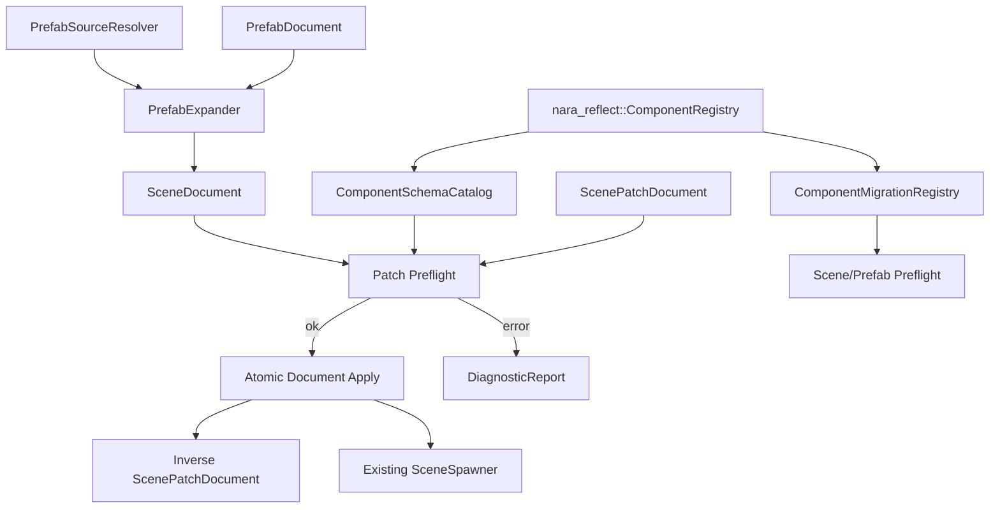
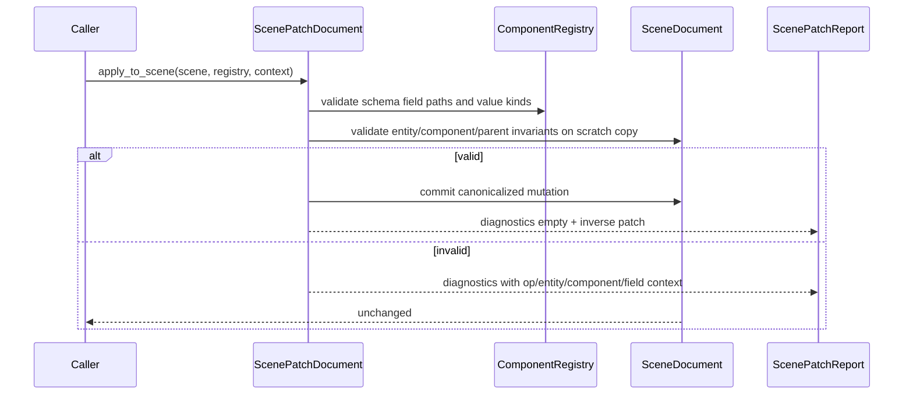

# Scene Patch Prefab Schema Foundation - Plan

## Goal Capsule

| Field | Value |
|---|---|
| Objective | Build the authoring mutation foundation that lets editor UI, AI agents, hot reload, and tests edit scene/prefab data through validated transactions instead of ad hoc document rewrites or direct `World` mutation. |
| Authority | ADR 0026, ADR 0011, ADR 0006, the current `nara_scene` and `nara_reflect` implementation, and the no-runtime-ID serialization rules already enforced by scene/asset plans. |
| Execution profile | Deep refactor is expected. `nara_scene` should be split by responsibility before adding patch and prefab machinery. |
| Stop conditions | Stop if a required patch operation cannot be expressed over `SceneEntityId`, `ComponentTypeId`, `ComponentFieldPath`, and `ComponentValue` without leaking runtime `Entity`, `Handle` IDs, backend handles, or Rust type names into persistent data. |
| Tail ownership | Implementation owns code, focused tests, docs, engineering memory, and a conventional commit on `main` or a feature branch according to repo workflow. |

---

## Product Contract

### Summary

This slice turns scene/prefab authoring into a transaction-based data workflow.
It adds schema-aware field paths, component schema export, component value migrations, scene patch documents, field-level prefab overrides, and a prefab source-resolution seam.
The first implementation edits documents and prefab expansion deterministically; live editor world sync and full undo UI remain consumers of this foundation.

### Problem Frame

`nara_scene` can now validate, spawn, export, and directly instantiate simple prefabs.
That is enough for whole-scene roundtrips, but not enough for a mature editor, AI Agent SDK, hot reload merge flow, or reliable prefab overrides.
Without a patch transaction layer, every caller will learn the raw scene document shape and invent its own validation, undo, conflict handling, and partial-update rules.
Without component schema export and migrations, patches cannot validate field paths and old scene files cannot be upgraded safely.

### Requirements

**Patch Transactions**

- R1. Scene and prefab authoring edits are represented as serializable patch transactions over stable data IDs, not runtime `Entity` values.
- R2. A patch transaction validates all operations against a scratch document before mutating the target document.
- R3. Patch diagnostics identify the operation index, `SceneEntityId`, `ComponentTypeId`, and field path when available.
- R4. Successful patch application canonicalizes entity ordering, component map ordering, and parent links so exported JSON/RON remains deterministic.
- R5. Patch application returns enough inverse data for transaction-level undo in future editor/runtime tooling.
- R6. Patch operations cover adding/removing entities, adding/removing components, replacing component values, setting/removing schema-known fields, reparenting, and setting asset-reference-shaped fields.
- R7. Patch data never serializes `bevy_ecs::Entity`, runtime `AssetId`, `Handle<T>` raw IDs, backend-native handles, or Rust type paths as stable file identity.

**Component Schema and Migration**

- R8. `nara_reflect` exposes a machine-readable schema catalog for registered serializable components.
- R9. Component schemas include stable component ID, current version, serializability, field path, field value kind, required/optional status, and optional default value.
- R10. Schema field paths are structured values, not ad hoc dotted strings.
- R11. Component migrations are registered by component ID and version range and can migrate `ComponentValue` before scene/prefab preflight.
- R12. Unsupported component versions produce diagnostics only after migration lookup fails.
- R13. Schema export is JSON/RON friendly and can be consumed by editor UI and AI validation without importing Bevy reflection internals.

**Prefab Overrides and Source Resolution**

- R14. Whole-component `PrefabComponentOverrides` is replaced or wrapped by a field-level override model based on patch transactions.
- R15. Direct prefab instantiation applies override patches atomically after base prefab validation and migration.
- R16. Unknown prefab override targets, invalid field paths, incompatible value kinds, and invalid asset refs fail before entity spawn.
- R17. Prefab source resolution has an explicit interface that supports an in-memory resolver now and asset-backed resolver later.
- R18. Nested prefab source resolution detects missing sources, cycles, and excessive depth before producing an expanded `SceneDocument`.
- R19. Expanded prefab entity IDs remain deterministic and collision-safe across repeated nested prefab instances.

**Integration and Tooling Readiness**

- R20. `nara_scene` is split into narrow modules for document types, prefab expansion, patch transactions, validation, spawn/export, and serde helpers.
- R21. Existing scene/prefab and asset preflight behavior remains compatible except where whole-component prefab override APIs are intentionally replaced by the new patch-based model.
- R22. Built-in component-owning crates register field schemas beside their codecs.
- R23. Examples prove patch transaction JSON/RON roundtrip, schema export, migration, and field-level prefab override behavior without enabling `winit` or `wgpu`.
- R24. Architecture docs and engineering memory reflect the concrete patch/schema/prefab contracts.

### Scope Boundaries

- This slice does not build a visual editor, undo stack UI, inspector widgets, collaboration protocol, or live hot-reload conflict resolver.
- This slice does not require runtime `WorldCommand` scheduling, though the patch result must leave enough inverse data for a later command/undo layer.
- This slice does not require deriving full field schemas from Bevy reflection. Explicit schema registration by component owners is acceptable and preferred for the first durable interface.
- This slice does not require general-purpose JSON Patch compatibility. nara patch operations are domain-specific and schema-aware.
- This slice does not implement real prefab file IO. A resolver interface plus in-memory resolver is enough; asset-backed file loading can arrive after async IO/import work.

### Acceptance Examples

- AE1. Given a scene with `player` and `enemy`, when a patch adds a `Transform2d` component to `player`, reparents `enemy` under `player`, and sets `player`'s sprite texture field, then the document mutates only after all three operations validate.
- AE2. Given one invalid operation in a multi-operation patch, when the patch is applied, then the original document is byte-for-byte semantically unchanged and diagnostics identify the failing operation.
- AE3. Given a prefab with `enemy/visual` and an override patch that changes only `Sprite.color.r`, when the prefab is instantiated, then the other `Sprite` fields and components remain inherited from the base prefab.
- AE4. Given component data at version 1 and a registered migration to version 2, when scene preflight runs against a current version-2 schema, then the migrated value is validated and spawned without requiring the source file to already be version 2.
- AE5. Given nested prefab sources `enemy -> weapon -> muzzle`, when the in-memory resolver expands them, then generated scene IDs are deterministic and no runtime `Entity` values appear in the expanded document.
- AE6. Given a prefab source cycle `a -> b -> a`, when expansion runs, then diagnostics report the cycle and no document mutation or spawn occurs.

---

## Planning Contract

### Assumptions

- Current `ComponentValue` remains the patch payload value domain.
- `ComponentDecodeContext` and `ComponentEncodeContext` remain the owner of asset-aware codec behavior.
- Scene/prefab documents keep stable `SceneEntityId` as the authoring identity.
- Existing `serde` feature gates stay in place for JSON/RON helpers.
- `nara_scene` can be broken into modules without preserving private function layout.

### Key Technical Decisions

- KTD1. `ComponentFieldPath` belongs in `nara_reflect`, not `nara_scene`. It is shared by schema export, patch validation, diagnostics, animation, editor UI, and future AI tooling.
- KTD2. Field paths are structured segments: `Field(String)` and `Index(u32)` in the first slice. Diagnostic display may use `sprite.color.r` or `cells[0]`, but serialized patch data stores the structured form.
- KTD3. Initial schema export is explicit metadata registered by component owners beside codecs. Avoid exposing raw Bevy reflection as the nara schema contract.
- KTD4. Migrations run on `ComponentValue` before codec preflight. A migration does not touch runtime components or `World`; it transforms persistent data from one schema version to the next.
- KTD5. Scene patch application is document-first. It produces a new or mutated `SceneDocument` plus inverse patch data; live `World` synchronization is a later consumer.
- KTD6. Patch transactions are atomic at the document level. The implementation may clone documents for Phase 1; locality and correctness matter more than optimizing patch application before editor-scale workloads exist.
- KTD7. Prefab field-level overrides are represented as patch transactions applied to an expanded prefab document. The old whole-component map becomes compatibility-free internal migration or is removed.
- KTD8. Prefab expansion uses a resolver interface with at least an in-memory adapter. This is a real seam because tests and future asset-backed loading need different adapters.
- KTD9. Nested prefab expansion prefixes or namespaces scene IDs deterministically to avoid collisions, and the chosen rule must be visible in tests and docs.
- KTD10. `nara_scene` module split is part of the feature, not cleanup. Patch/prefab/schema behavior is too cross-cutting to add safely while validation, spawn, export, and tests live as one monolith.
- KTD11. `RemoveEntity` removes the entity subtree by default. The inverse patch stores the removed records and restores the subtree in one transaction; orphan/reparent delete modes are deferred until an editor interaction proves the need.
- KTD12. `RemoveField` is allowed only for optional schema fields or fields with a registered default value. Required fields without defaults fail validation before patch apply.

### High-Level Technical Design

Patch and migration flow:

### Module Shape

`nara_scene` should move toward this internal shape:

| Module | Responsibility |
|---|---|
| `document` | `SceneDocument`, `SceneEntityRecord`, `SceneComponentRecord`, IDs, canonicalization |
| `prefab` | `PrefabDocument`, prefab source references, override patch types, expansion |
| `patch` | `ScenePatchDocument`, operation enums, patch report, inverse generation |
| `validation` | Scene/prefab/patch diagnostics and preflight helpers |
| `spawn` | `SceneSpawner`, `PreparedScene`, world insertion, hierarchy sync |
| `export` | `export_scene`, export options, scene provenance |
| `serde` or `format` | JSON/RON helpers behind `serde` feature |
| `tests` | Existing behavior preserved through integration/unit tests |

### System-Wide Impact

- Editor UI can later emit patch transactions instead of directly mutating document internals.
- AI agents get a small mutation language with diagnostics instead of rewriting entire scene files.
- Animation and runtime UI can reuse schema-aware field paths.
- Save-game migrations can reuse component migration chains.
- Hot reload can compare and reconcile document patches rather than only replacing whole files.
- Future networking/replication can avoid depending on Rust type names or runtime entity IDs.

### Dependencies and Constraints

- `nara_reflect` changes must stay backend-free and should not depend on `nara_scene`.
- `nara_scene` may depend on `nara_reflect`, `nara_asset`, and diagnostics, but must not depend on sprite/tilemap/render crates directly.
- Built-in schema registrations belong in the crates that own the components.
- Persistent patch and schema data must remain `serde`-friendly when the feature is enabled.
- Existing scene/asset preflight tests are regression contracts and should keep passing after module split.

### Sources & Research

- ADR 0026: `docs/architecture/adr/0026-editor-command-patch-and-undo-model.md`
- ADR 0011: `docs/architecture/adr/0011-component-schema-ids-and-migrations.md`
- ADR 0006: `docs/architecture/adr/0006-scene-and-prefab-data-model.md`
- Current scene implementation: `crates/nara_scene/src/lib.rs`
- Current reflection implementation: `crates/nara_reflect/src/lib.rs`
- Prior scene plan: `docs/plans/2026-07-08-003-feat-scene-prefab-serialization-foundation-plan.md`
- Prior asset/render seam plan: `docs/plans/2026-07-08-004-feat-asset-render-resource-seam-plan.md`

---

## Implementation Units

### U1. Split `nara_scene` into responsibility modules

- **Goal:** Create a maintainable module structure before adding patch and prefab complexity.
- **Requirements:** R20, R21.
- **Files:** `crates/nara_scene/src/lib.rs`, new `crates/nara_scene/src/document.rs`, `prefab.rs`, `validation.rs`, `spawn.rs`, `export.rs`, `format.rs`, `tests.rs`.
- **Approach:** Move existing public types and behavior into narrow modules while preserving the public facade. Keep re-exports in `lib.rs`. Preserve existing tests before adding new features.
- **Test Scenarios:** Existing scene/prefab tests still pass; `scene_prefab_roundtrip` still compiles and runs; no new dependency on sprite/render crates appears in `nara_scene`.
- **Verification:** `cargo nextest run -p nara_scene -p nara`; `cargo run -q --features serde --example scene_prefab_roundtrip`.

### U2. Add structured component field paths and value editing helpers

- **Goal:** Give patches, schema export, diagnostics, and future animation/editor tools one shared field path representation.
- **Requirements:** R3, R6, R10.
- **Files:** `crates/nara_reflect/src/lib.rs`, potential `crates/nara_reflect/src/value.rs`, `schema.rs`, `tests`.
- **Approach:** Add `ComponentFieldPath` and `ComponentFieldPathSegment`. Implement display parsing only if needed for ergonomic tests, but serialized shape should stay structured. Add helpers to get, set, replace, and remove nested `ComponentValue` fields with typed errors.
- **Test Scenarios:** map field set succeeds; missing field fails with path context; wrong container kind fails; list index lookup works; list out-of-range fails; invalid path does not mutate the original value.
- **Verification:** `cargo nextest run -p nara_reflect`.

### U3. Export component schemas from owner-registered metadata

- **Goal:** Make registered component structure visible to tools and AI without exposing Bevy reflection internals.
- **Requirements:** R8, R9, R13, R22.
- **Files:** `crates/nara_reflect/src/lib.rs`, built-in registration sites in `crates/nara_scene/src/*`, `crates/nara_transform/src/lib.rs`, `crates/nara_render/src/lib.rs`, `crates/nara_sprite/src/lib.rs`, `crates/nara_tilemap/src/lib.rs`, `src/lib.rs`, `tests/scene_sprite_serialization.rs`.
- **Approach:** Add `ComponentSchemaCatalog`, `ComponentFieldSchema`, and `ComponentValueKind`. Extend component codec registration to optionally include schema metadata. Register schemas beside built-in codecs. Keep schema export independent from codec implementation closures.
- **Test Scenarios:** registry exports deterministic schema order; `Transform2d` exposes position/rotation/scale fields; `Sprite` exposes color/size/layer/sort/texture shape; runtime-only components remain absent; JSON schema export contains stable IDs and versions, not Rust type paths as identity.
- **Verification:** `cargo nextest run -p nara_reflect -p nara_scene -p nara_sprite -p nara_tilemap`.

### U4. Add component migration registry and scene/prefab migration preflight

- **Goal:** Make old component values upgradeable before codec preflight rejects version mismatches.
- **Requirements:** R11, R12.
- **Files:** `crates/nara_reflect/src/lib.rs`, `crates/nara_scene/src/validation.rs`, `crates/nara_scene/src/document.rs`, tests in `crates/nara_reflect/src/*` and `crates/nara_scene/src/tests.rs`.
- **Approach:** Add a migration registry keyed by `ComponentTypeId` and `(from_version, to_version)`. Compose one-step migrations to the current registered version. Return diagnostics for missing chains, migration failure, and post-migration codec failure. Keep source document mutation separate from validation unless an explicit `migrate_*` API is called.
- **Test Scenarios:** v1 to v2 migration changes field name and preflights; missing migration reports unsupported version; migration failure includes component and field context; multi-step v1->v2->v3 runs in order; input document stays unchanged during validation-only preflight.
- **Verification:** `cargo nextest run -p nara_reflect -p nara_scene`.

### U5. Add scene patch transaction data model and atomic document apply

- **Goal:** Introduce the authoring mutation language for scenes.
- **Requirements:** R1, R2, R3, R4, R5, R6, R7.
- **Files:** `crates/nara_scene/src/patch.rs`, `crates/nara_scene/src/validation.rs`, `crates/nara_scene/src/document.rs`, `crates/nara_diagnostic/src/lib.rs`, `tests/scene_patch_transactions.rs`.
- **Approach:** Add `ScenePatchDocument`, `ScenePatchOperation`, `ScenePatchReport`, and inverse patch generation. Apply operations to a scratch clone, run full scene validation, then commit. Reuse `ComponentFieldPath` for field ops. Extend diagnostics context if operation index is not yet representable.
- **Test Scenarios:** add entity; remove entity subtree and restore it through inverse patch; add/remove component; replace component value; set nested field; remove optional field; reject required field removal without default; reparent; invalid operation leaves document unchanged; inverse patch restores original document.
- **Verification:** `cargo nextest run -p nara_scene -p nara`.

### U6. Replace direct prefab overrides with patch-based field overrides

- **Goal:** Make prefab overrides granular and share the same validation path as editor/AI scene edits.
- **Requirements:** R14, R15, R16, R21.
- **Files:** `crates/nara_scene/src/prefab.rs`, `crates/nara_scene/src/patch.rs`, `crates/nara_scene/src/spawn.rs`, `tests/scene_sprite_serialization.rs`, possible example updates.
- **Approach:** Define `PrefabOverridePatch` or reuse `ScenePatchDocument` directly for direct prefab instantiation. Remove or deprecate `PrefabComponentOverrides` if compatibility would add shallow complexity. Apply override patch after base prefab canonicalization and migration, then run full preflight before spawn.
- **Test Scenarios:** field-level sprite color override preserves texture and size; component add override works; remove component override works; unknown entity override fails without world mutation; invalid asset ref in override fails before spawn; whole-component legacy path is removed or internally translated with tests.
- **Verification:** `cargo nextest run -p nara_scene -p nara_sprite -p nara_tilemap -p nara`.

### U7. Add prefab source resolver and nested prefab expansion

- **Goal:** Reserve the right seam for prefab asset loading without implementing filesystem IO.
- **Requirements:** R17, R18, R19.
- **Files:** `crates/nara_scene/src/prefab.rs`, `crates/nara_scene/src/validation.rs`, `crates/nara_asset/src/lib.rs` only if `AssetRef` diagnostics need small helpers, tests in `crates/nara_scene/src/tests.rs`.
- **Approach:** Add `PrefabSourceResolver` and an in-memory resolver used by tests. Expand nested prefab instances into a `SceneDocument` before spawn. Detect cycles and depth limit. Namespace expanded IDs deterministically and document the rule.
- **Test Scenarios:** one-level prefab reference expands; nested prefab expands; missing source reports asset ref; cycle reports full chain; repeated nested instances produce stable collision-free IDs; asset-aware validation still runs after expansion.
- **Verification:** `cargo nextest run -p nara_scene -p nara_asset -p nara`.

### U8. Add examples and schema/patch serialization proof

- **Goal:** Prove the new authoring workflow is usable from code-first and AI/tooling perspectives.
- **Requirements:** R13, R23.
- **Files:** `examples/scene_patch_roundtrip.rs`, `examples/component_schema_export.rs`, `examples/prefab_patch_override.rs`, `src/lib.rs`.
- **Approach:** Add backend-free examples gated by `serde` where needed. Show schema export, JSON/RON patch roundtrip, applying a patch to a scene, field-level prefab override, migration, and spawn/export after patch.
- **Test Scenarios:** examples compile under default and serde feature sets; JSON output contains stable schema IDs and field paths; no runtime IDs appear in serialized examples.
- **Verification:** `cargo check --examples`; `cargo run -q --features serde --example scene_patch_roundtrip`; `cargo run -q --features serde --example component_schema_export`; `cargo run -q --features serde --example prefab_patch_override`.

### U9. Update docs, architecture memory, and final boundary checks

- **Goal:** Keep durable design docs aligned with the new mutation/schema contracts.
- **Requirements:** R24.
- **Files:** `docs/architecture/nara-foundation.md`, `docs/architecture/adr/0026-editor-command-patch-and-undo-model.md`, `docs/architecture/adr/0011-component-schema-ids-and-migrations.md`, `docs/architecture/open-questions.md`, `docs/knowledge/engineering/*`, `AGENTS.md` if module rules need tightening.
- **Approach:** Update ADR implementation notes only where concrete decisions are now known. Record accepted residuals, especially live `WorldCommand`, editor UI, async prefab IO, and full undo stack.
- **Test Scenarios:** docs name patch transactions as the authoring mutation path; open questions no longer list this slice as unresolved; engineering memory validates.
- **Verification:** engineering memory validation; `git diff --check`; dependency boundary searches.

---

## Verification Contract

| Gate | Command | Applies To | Done Signal |
|---|---|---|---|
| Format | `cargo fmt --all` | All units | No formatting diff required. |
| Workspace check | `cargo check --workspace` | All units | Workspace compiles with default features. |
| Serde check | `cargo check --workspace --features serde` | U3-U9 | JSON/RON-gated code compiles. |
| Examples | `cargo check --examples` | U8-U9 | All examples compile. |
| Patch examples | `cargo run -q --features serde --example scene_patch_roundtrip`; `cargo run -q --features serde --example component_schema_export`; `cargo run -q --features serde --example prefab_patch_override` | U8-U9 | Examples run without panic. |
| Focused tests | `cargo nextest run -p nara_reflect -p nara_scene -p nara_sprite -p nara_tilemap -p nara` | U2-U7 | New patch/schema/prefab tests pass. |
| Full tests | `cargo nextest run --workspace` | Final | Full workspace passes. |
| Backend optional checks | `cargo check -p nara --features winit,wgpu --example windowed_clear`; `cargo check -p nara --features winit,wgpu --example windowed_sprites` | Final | Existing optional backend examples still compile. |
| Backend boundary | `rg -n "winit::|winit =" crates src Cargo.toml`; `rg -n "wgpu::|wgpu =" crates src Cargo.toml` | Final | Matches remain limited to facade feature wiring and backend crates. |
| Serialization leak search | `rg -n "Serialize for Handle|Deserialize.*Handle|AssetId.*Serialize|Entity.*Serialize|wgpu::.*Serialize" crates examples tests` | Final | No persistent runtime/backend identity leakage. |
| Memory | `python "$HOME\\.codex\\skills\\engineering-wiki-memory\\scripts\\wiki_memory.py" validate --root docs\\knowledge\\engineering` | U9 | Engineering memory validates. |
| Diff hygiene | `git diff --check` | Final | No whitespace errors. |

---

## Risks & Dependencies

| Risk | Severity | Likelihood | Mitigation |
|---|---|---:|---|
| Patch ops become too broad and shallow | High | Medium | Start with document-level operations and schema-aware field replacement; defer list insertion/removal and live-world sync unless required by tests. |
| `nara_reflect` schema export overfits current built-ins | Medium | Medium | Keep value-kind schema minimal and explicit; avoid promising full editor widget metadata in this slice. |
| Migration chains hide data loss | High | Medium | Migrations return `Result<ComponentValue, ComponentCodecError>` and have focused tests for missing fields and incompatible kinds. |
| Prefab ID namespacing becomes hard to change | High | Medium | Document and test the chosen deterministic namespacing rule before exposing nested prefab examples. |
| Module split creates churn without better locality | Medium | Medium | Preserve public re-exports, keep each module with one responsibility, and require tests to pass after split before adding behavior. |
| Inverse patch data is too expensive | Medium | Low | Accept clone-based inverse generation for Phase 1; optimize only after editor workloads exist. |

---

## Definition of Done

- All requirements R1-R24 are either implemented or explicitly called out as deferred residuals with rationale.
- `nara_scene` no longer grows as a monolithic file for document, prefab, patch, validation, spawn, and export behavior.
- `ComponentFieldPath`, schema export, and migrations live in `nara_reflect` and remain backend-free.
- Patch transactions are atomic, serializable, schema-aware, deterministic, and tested for no-mutation failures.
- Prefab field-level overrides use the same patch validation path as scene edits.
- Nested prefab expansion has a resolver seam, deterministic ID namespacing, cycle diagnostics, and in-memory tests.
- Examples demonstrate schema export, patch roundtrip, prefab field override, migration, and spawn/export after patch.
- Existing scene/prefab/asset/render behavior and optional backend examples remain green.
- Architecture docs, open questions, engineering memory, and any repo-local agent guidance are updated.
- Abandoned compatibility shims, dead experiments, and obsolete whole-component-only override code are removed unless a documented compatibility reason remains.
