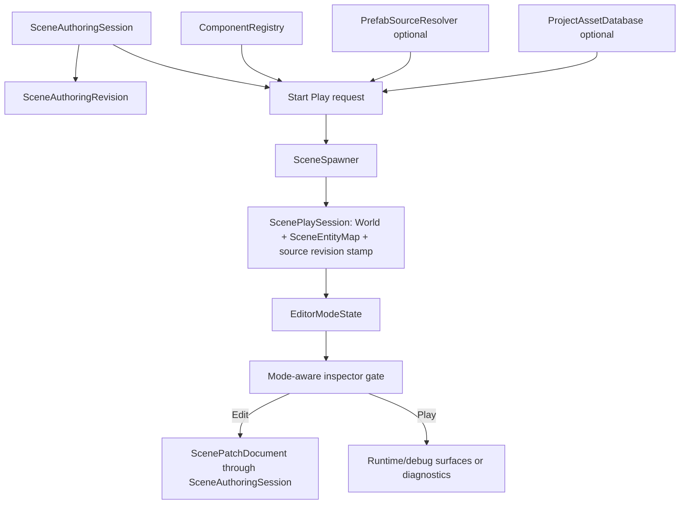
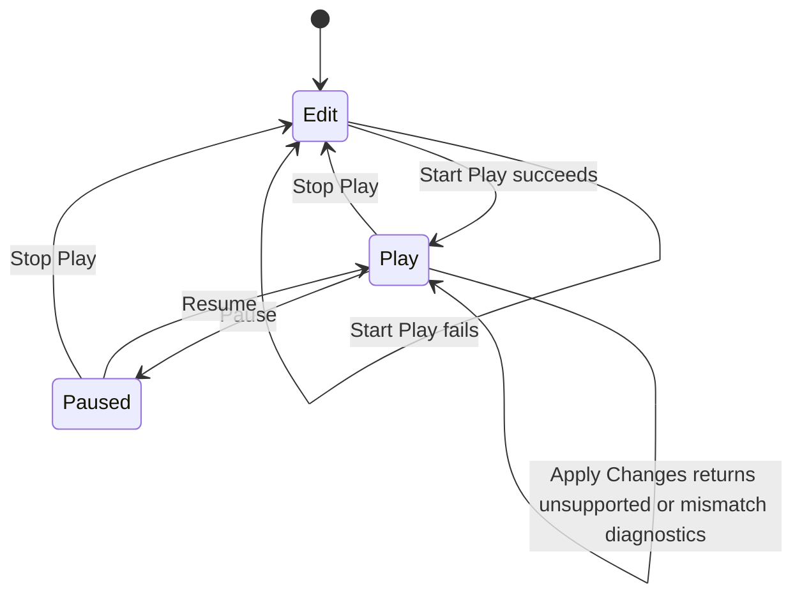

# Editor Play Mode Core - Plan

## Goal Capsule

| Field | Value |
|---|---|
| Objective | Implement the first editor Play Mode core: authoring revision stamps, isolated Play world lifecycle, mode-aware tooling state, and conservative Apply Changes guardrails. |
| Authority | ADR 0034, ADR 0015, ADR 0026, `SceneAuthoringSession`, `SceneSpawner`, and the existing `SceneInspectorState` patch-command boundary. |
| Execution profile | Deep refactor is allowed. `nara_tooling` should be split before adding Play Mode state so later editor, debug UI, and AI SDK work has narrow modules. |
| Stop conditions | Stop if Play Mode requires sharing runtime `Entity` IDs with edit preview, mutating `SceneDocument` from runtime state without `ScenePatchDocument`, or adding `winit` / `wgpu` dependencies to scene/tooling crates. |
| Tail ownership | Implementation owns focused tests, workspace verification, docs/engineering memory updates, and conventional commits. |

---

## Product Contract

### Summary

This slice turns ADR 0034 into executable engine infrastructure.
The editor can enter Play Mode by spawning a fresh runtime `World` from the current validated edit document, observe or mutate that runtime world temporarily, and stop without writing runtime changes back to authoring data.
The slice deliberately implements Apply Changes as a guarded unsupported path rather than a broad diff engine, because silent write-back would be worse than no write-back.

### Problem Frame

`SceneAuthoringSession` already makes a `SceneDocument` the source of truth for edit-time patching, undo/redo, and live preview projection.
`SceneInspectorState` can build UI-agnostic edit models and submit scene patches.
The missing boundary is the Play Mode lifecycle: without an explicit isolated world and source revision stamp, future editor UI, hot reload, and AI operations will either mutate the preview world accidentally or serialize runtime-only state back into scene files.

### Requirements

**Mode and Lifecycle**

- R1. Tooling exposes an editor mode model with `Edit`, `Play`, and `Paused` states without depending on a concrete UI toolkit.
- R2. Starting Play snapshots the current authoring document revision, validates/spawns it into a fresh `World`, and records the resulting `SceneEntityMap`.
- R3. The Play world never reuses edit preview `Entity` values as persistent identity; `SceneEntityId` is the only durable bridge.
- R4. Stopping Play drops the Play world and returns to Edit without mutating the edit document, undo/redo history, or edit preview projection.
- R5. Failed Start Play reports diagnostics and leaves the current edit/play state unchanged.

**Revision and Conflict Safety**

- R6. `SceneAuthoringSession` exposes an opaque source revision stamp that changes only when its authoring document changes successfully.
- R7. Play sessions record the source authoring revision stamp they were spawned from.
- R8. Edit document patches made while Play is running do not automatically mutate the Play world.
- R9. Apply Changes is represented as an explicit capability/status guard in this slice, but it returns diagnostics for unsupported apply-back and revision mismatch rather than serializing runtime state or returning scene patches.

**Tooling and Module Boundaries**

- R10. `nara_tooling` is split by responsibility into snapshot, inspector, and play/mode modules while preserving the public facade.
- R11. Inspector patch commands remain edit-persistent commands. A mode-aware wrapper rejects persistent edit commands during Play unless a later explicit Apply Changes path handles them.
- R12. New public types are re-exported through `nara_tooling` and the root `nara` facade without adding `winit`, `wgpu`, egui, dear-imgui, or future editor UI dependencies.
- R13. Architecture docs and open questions distinguish the implemented Play lifecycle from deferred Apply Changes diffing and runtime command systems; engineering memory is updated when the implementation creates durable boundary knowledge.

### Scope Boundaries

This slice does not build a visual editor, debug UI adapter, viewport UI, gizmos, or runtime UI.
This slice does not implement a full Apply Changes diff/export engine.
This slice does not implement `WorldCommand`, incremental edit-preview sync, edit-while-playing merge UI, save-game persistence, hot-reload asset streaming, or multiple simultaneous Play worlds.
This slice does not introduce a `nara_editor` crate unless implementation proves `nara_tooling` cannot own the UI-agnostic model cleanly.

### Acceptance Examples

- AE1. Given an edit session with a synced preview world, when Play starts, then the Play world contains equivalent scene components through its own `SceneEntityMap` and does not share ECS storage with the preview world.
- AE2. Given a Play world component is mutated at runtime, when Play stops, then the edit `SceneDocument`, undo/redo history, and preview world remain unchanged.
- AE3. Given an authoring document with an unregistered component, when Play starts, then diagnostics report the component failure and no Play session replaces the current mode state.
- AE4. Given a Play session source revision stamp and an edit patch applied afterward, when Apply Changes is requested, then the report rejects the request with a revision mismatch diagnostic even if undo later restores equivalent document content.
- AE5. Given the editor is in Play, when a mode-aware inspector wrapper receives a persistent field edit command, then it rejects the command and leaves the authoring document unchanged.
- AE6. Given an asset-aware or prefab-resolved scene, when Play starts through the matching API, then diagnostics and entity maps follow the same preflight rules as existing scene spawn.

---

## Planning Contract

### Assumptions

- `nara_tooling` is the correct owner for UI-agnostic editor mode state until a future `nara_editor` crate exists.
- `SceneSpawner` remains the right spawn primitive for Play Mode because it already performs preflight before mutating the target `World`.
- Rebuild-style Play start is acceptable for the first implementation; performance optimization should not weaken the isolation contract.
- Tests can use small serializable test components to prove lifecycle behavior without needing window or GPU backends.

### Key Technical Decisions

- KTD1. The authoring revision belongs in `nara_scene`, not `nara_tooling`, because hot reload, apply-back, and any authoring client need the same document-change marker. Treat it as a source revision stamp, not just a globally comparable counter; apply-back checks must compare against the same authoring source that spawned the Play session.
- KTD2. `nara_tooling` owns `EditorMode` and the first Play session/controller types because they are UI-agnostic editor/runtime client models, not app scheduling primitives. This ownership is temporary: when Play Mode needs runner scheduling, input routing, runtime command queues, viewport/render integration, hot reload streaming, or multiple simultaneous Play worlds, orchestration should move to `nara_editor` or another editor-owned crate.
- KTD3. Start Play uses a fresh `World` and a fresh `SceneSpawner`. It does not reuse `SceneAuthoringSession`'s live preview world or live entity map.
- KTD4. Starting Play while already in Play or Paused returns diagnostics and leaves the existing Play session intact. A caller that wants restart semantics must Stop then Start.
- KTD5. Apply Changes lands as a capability/status guard before diffing exists. It should report `applied = false`, expose no `ScenePatchDocument`, and avoid enabling persistent UI actions until a real patchable subset exists.
- KTD6. Existing edit inspector APIs stay useful for direct edit-mode callers, but a new mode-aware wrapper is the recommended editor surface because it can reject persistent edits in Play.

### High-Level Technical Design





Mode transition contract:

| Operation | Valid Modes | Invalid Behavior |
|---|---|---|
| Start Play | `Edit` | Return diagnostics and preserve state in `Play` or `Paused`. |
| Pause | `Play` | Return diagnostics and preserve state in `Edit` or `Paused`. |
| Resume | `Paused` | Return diagnostics and preserve state in `Edit` or `Play`. |
| Stop Play | `Play`, `Paused` | Return diagnostics and preserve state in `Edit`. |
| Apply Changes status check | `Play`, `Paused` | Return diagnostics and preserve state in `Edit` or when no active Play session exists. |
| Persistent inspector patch command | `Edit` | Return diagnostics and preserve authoring data in `Play` or `Paused`. |

### Output Structure

Expected `nara_tooling` shape after this slice:

```text
crates/nara_tooling/src/
  lib.rs
  snapshot.rs
  inspector.rs
  play.rs
```

### System-Wide Impact

The editor/debug UI path gets a stable lifecycle model before any UI toolkit is chosen.
AI agents get a mode-aware boundary that can explain why persistent scene mutation is rejected during Play.
Hot reload and future Apply Changes work can compare source revision stamps instead of guessing whether runtime state is stale.
Runtime crates remain backend-free and UI-free because Play Mode is modeled over `World`, `SceneDocument`, diagnostics, and patches.

### Dependencies and Constraints

- `nara_scene` may expose revision data but must not depend on `nara_tooling`.
- `nara_tooling` may depend on `nara_app`, `nara_scene`, `nara_reflect`, `nara_asset`, `nara_diagnostic`, and `nara_ecs`; it must not depend on platform, renderer backend, or editor UI crates.
- New Play APIs must compose with existing plain, asset-aware, prefab-resolved, and prefab-plus-asset spawn flows.
- Public names can evolve during implementation, but the semantics in R1-R13 must remain intact.

### Sources & Research

- ADR 0034: `docs/architecture/adr/0034-editor-play-mode-world-boundary.md`
- ADR 0015: `docs/architecture/adr/0015-editor-tooling-and-dogfooding-boundary.md`
- ADR 0026: `docs/architecture/adr/0026-editor-command-patch-and-undo-model.md`
- Foundation doc: `docs/architecture/nara-foundation.md`
- Existing authoring code: `crates/nara_scene/src/authoring.rs`
- Existing scene spawn code: `crates/nara_scene/src/spawn.rs`
- Existing tooling code: `crates/nara_tooling/src/lib.rs`
- Existing tests: `tests/scene_authoring_session.rs`, `tests/scene_inspector.rs`

---

## Implementation Units

### U1. Split `nara_tooling` into narrow modules

- **Goal:** Separate snapshot, inspector, and Play Mode surfaces before adding new lifecycle code.
- **Requirements:** R10, R12.
- **Dependencies:** None.
- **Files:** `crates/nara_tooling/src/lib.rs`, new `crates/nara_tooling/src/snapshot.rs`, new `crates/nara_tooling/src/inspector.rs`, new `crates/nara_tooling/src/play.rs`, `src/lib.rs`, `tests/scene_inspector.rs`.
- **Approach:** Move `WorldSnapshot` into `snapshot.rs` and existing inspector state/model/command/report code into `inspector.rs`. Keep `lib.rs` as the public re-export boundary plus `ToolingPlugin`. Add an initially minimal `play.rs` module so later units land without growing `lib.rs` again.
- **Execution note:** Characterize with existing `scene_inspector` tests before and after the move; this unit should be behavior-preserving.
- **Patterns to follow:** `crates/nara_scene/src/lib.rs` re-export style; existing `nara_tooling::ToolingPlugin` facade.
- **Test scenarios:** Existing inspector tests compile without import changes from downstream `nara::prelude::*`; `ToolingPlugin` still builds; no new dependency appears in `crates/nara_tooling/Cargo.toml`.
- **Verification:** The focused inspector tests pass and the workspace still compiles after the module split.

### U2. Add authoring document revision tracking

- **Goal:** Give Play Mode and future hot reload/apply-back code a stable way to detect authoring document changes.
- **Requirements:** R6. This revision primitive supports U3 and U6's R7-R9 work.
- **Dependencies:** U1 is independent, but this unit should complete before Play lifecycle tests.
- **Files:** `crates/nara_scene/src/authoring.rs`, `crates/nara_scene/src/lib.rs`, `src/lib.rs`, `tests/scene_authoring_session.rs`.
- **Approach:** Add an opaque source revision stamp and expose it from `SceneAuthoringSession`. Increment the revision portion on successful document-changing patch, undo, redo, and `replace_document`. Do not increment it on failed patches, empty undo/redo, world sync, failed sync, `clear_history`, or `clear_live_world`. Keep enough source identity in the stamp or companion value so a Play session cannot compare equal against a different authoring session with the same revision number.
- **Execution note:** Start with tests that prove success and failure transitions before changing the implementation.
- **Patterns to follow:** `SceneAuthoringHistoryStatus` for lightweight public state; existing `record_forward_patch` and `record_history_patch` mutation gates.
- **Test scenarios:** Initial revision is stable within one session; successful patch increments once; failed patch does not increment; undo and redo increment on successful mutation; empty undo/redo do not increment; `replace_document` increments and clears history; world sync does not increment; two new sessions with the same numeric revision cannot be treated as the same apply-back source.
- **Verification:** `tests/scene_authoring_session.rs` proves every revision transition and existing history/dirty tests remain green.

### U3. Implement isolated Play session lifecycle

- **Goal:** Add the first Start, Pause, Resume, and Stop Play lifecycle over an owned runtime `World`.
- **Requirements:** R1, R2, R3, R4, R5, R7, R8.
- **Dependencies:** U1, U2.
- **Files:** `crates/nara_tooling/src/play.rs`, `crates/nara_tooling/src/lib.rs`, `src/lib.rs`, new `tests/scene_play_mode.rs`.
- **Approach:** Add UI-agnostic mode/session types that own the optional Play session, expose immutable and mutable access to the Play `World`, and preserve source revision stamp plus `SceneEntityMap`. Start Play uses the current session document and registry to spawn into a fresh world. Stop Play drops the owned world and returns diagnostics or lightweight stats without touching edit state.
- **Execution note:** Prove isolation test-first because accidental world sharing is the highest-risk regression in this slice.
- **Patterns to follow:** Existing `SceneAuthoringSession::sync_world` report style and `SceneSpawner` preflight-first behavior.
- **Test scenarios:** Start Play succeeds for a valid scene and records source revision stamp; Play and edit preview maintain separate `World` storage and separate `SceneEntityMap` ownership for the same `SceneEntityId`; mutating a component in Play does not change the edit document or preview world; Stop Play discards the runtime mutation; Pause/Resume change mode without respawning; invalid Start/Pause/Resume/Stop calls reject with diagnostics and keep the current state.
- **Verification:** `tests/scene_play_mode.rs` proves lifecycle and isolation behavior without enabling `winit` or `wgpu`.

### U4. Add prefab and asset-aware Play start variants

- **Goal:** Make Play Mode use the same validation/spawn paths as scene runtime loading.
- **Requirements:** R2, R5, R12.
- **Dependencies:** U3.
- **Files:** `crates/nara_tooling/src/play.rs`, `tests/scene_play_mode.rs`, `tests/scene_sprite_serialization.rs` if shared helpers need adjustment.
- **Approach:** Add Play start variants that accept a `PrefabSourceResolver`, a `ProjectAssetDatabase`, or both, mirroring existing scene authoring sync and spawn APIs. Bubble diagnostics from prefab expansion, asset-aware preflight, and component decode without mutating edit state on failure.
- **Execution note:** Prefer focused integration tests over broad example changes; the important proof is that Play Mode follows existing preflight contracts.
- **Patterns to follow:** `SceneAuthoringSession::sync_world_with_prefab_resolver_and_asset_database` and `SceneSpawner::spawn_with_prefab_resolver_and_asset_database`.
- **Test scenarios:** Prefab-resolved Play start expands nested prefab IDs into a Play world; missing prefab source fails without entering Play; asset-aware Play start resolves a stable/path asset ref into the Play world's `AssetServer`; invalid asset refs fail before Play starts; these scenarios cover AE6.
- **Verification:** `tests/scene_play_mode.rs` covers plain, prefab, asset, and prefab-plus-asset start paths.

### U5. Add mode-aware inspector/editor model

- **Goal:** Prevent editor UI and AI tools from accidentally treating Play runtime mutations as persistent scene edits.
- **Requirements:** R1, R9, R10, R11, R12.
- **Dependencies:** U3; U4 can proceed independently if file contention is managed serially.
- **Files:** `crates/nara_tooling/src/play.rs`, `crates/nara_tooling/src/inspector.rs`, `crates/nara_tooling/src/lib.rs`, `src/lib.rs`, `tests/scene_inspector.rs`, `tests/scene_play_mode.rs`.
- **Approach:** Add a mode-aware editor/tooling state or wrapper that can build a model containing the current mode, source revision stamp, selected authoring entity, and optional Play world snapshot. Keep direct `SceneInspectorState::apply_command` available for edit-only callers, but make the new editor-facing command path reject persistent patch commands in Play or Paused with diagnostics.
- **Execution note:** Preserve existing edit-mode inspector command behavior before adding Play-mode rejection tests.
- **Patterns to follow:** Existing `SceneInspectorCommandReport` diagnostic shape and `WorldSnapshot::capture` model embedding.
- **Test scenarios:** Edit mode field command still applies a scene patch and selects the target; Play or Paused mode field command through the mode-aware wrapper is rejected and leaves the document unchanged; selection can be maintained across mode changes; model reports Play, Paused, source revision stamp, and Play world snapshot when available.
- **Verification:** `tests/scene_inspector.rs` remains green and `tests/scene_play_mode.rs` covers the new mode-aware wrapper.

### U6. Add Apply Changes guardrails and docs

- **Goal:** Reserve the Apply Changes API shape without pretending runtime diffing is implemented.
- **Requirements:** R9, R13.
- **Dependencies:** U2, U3, U5.
- **Files:** `crates/nara_tooling/src/play.rs`, `tests/scene_play_mode.rs`, `docs/architecture/adr/0034-editor-play-mode-world-boundary.md`, `docs/architecture/open-questions.md`, `docs/architecture/nara-foundation.md`, optional new `docs/knowledge/engineering/logs/2026-07/2026-07-08T000000Z-editor-play-mode-core-implemented.md`, `AGENTS.md` only if implementation exposes new persistent boundary rules.
- **Approach:** Add a report type or status-check result for Apply Changes that checks source revision before any future diffing. Return a revision mismatch diagnostic when the edit document changed after Play start, and return an unsupported-subset diagnostic when revisions match but no apply-back subset exists yet. The result must not return `ScenePatchDocument` or imply that runtime export is implemented. Update docs to say the isolated lifecycle is implemented and full diff/apply-back remains deferred.
- **Execution note:** Keep this as a guardrail unit. Do not implement whole-scene runtime export or broad component diffing in this slice.
- **Patterns to follow:** ADR 0034 failure rules; existing `Diagnostic::error(...).with_entity_id(...)` context style where applicable.
- **Test scenarios:** Apply Changes status check with matching source stamp returns unsupported diagnostics and does not mutate the document; applying an edit patch after Play start causes revision mismatch diagnostics; undoing back to equivalent document content still leaves the old Play session conservatively mismatched; calling Apply Changes in Edit or without an active Play session returns diagnostics; Stop after failed Apply Changes still discards runtime state; docs no longer describe the Play lifecycle as purely future work.
- **Verification:** Play mode tests prove guardrail behavior and docs reflect the implemented/deferred split.

---

## Verification Contract

| Gate | Command | Applies To | Done Signal |
|---|---|---|---|
| Format | `cargo fmt --all` | All units | No formatting drift remains. |
| Workspace check | `cargo check --workspace` | All units | Default workspace compiles. |
| Serde check | `cargo check --workspace --features serde` | U2-U6 | Scene/tooling public exports compile with serialization-enabled crates. |
| Focused tests | `cargo nextest run -p nara_scene -p nara_tooling -p nara` | U1-U6 | Authoring, tooling, and facade tests pass. |
| Full tests | `cargo nextest run --workspace` | Final | Full workspace passes. |
| Examples | `cargo check --examples`; `cargo check --features serde --examples` | Final | Existing backend-free examples still compile. |
| Optional backend examples | `cargo check -p nara --features winit,wgpu --example windowed_clear`; `cargo check -p nara --features winit,wgpu --example windowed_sprites` | Final | Platform/render backend examples still compile. |
| Backend boundary | `rg -n "winit::|wgpu::|winit =|wgpu =" crates/nara_tooling crates/nara_scene` | Final | No platform or GPU backend imports leak into scene/tooling. |
| Runtime identity leak search | `rg -n "Serialize.*Entity|Deserialize.*Entity|AssetId.*Serialize|Handle<.*Serialize|wgpu::" crates/nara_scene crates/nara_tooling tests` | Final | No persistent Play/editor data serializes runtime/backend identity. |
| Diff hygiene | `git diff --check` | Final | No whitespace errors. |

---

## Risks & Dependencies

| Risk | Severity | Likelihood | Mitigation |
|---|---|---:|---|
| Play APIs overfit `nara_tooling` before `nara_editor` exists | Medium | Medium | Keep types UI-agnostic and move them later only if a real editor crate needs ownership. |
| Revision tracking increments on non-mutating operations | Medium | Medium | Test every authoring operation class and increment only through successful document-change gates. |
| Play world access enables accidental persistence by convention | High | Medium | Provide Apply Changes as the only persistence-shaped API and make it diagnostic-only in this slice. |
| Prefab/asset start variants duplicate scene sync APIs | Medium | Medium | Mirror existing `SceneSpawner` and `SceneAuthoringSession` method families instead of inventing a new config DSL. |
| Mode-aware wrapper and direct inspector API confuse callers | Medium | Medium | Document direct inspector methods as edit-mode primitives and export the wrapper as the editor-facing surface. |
| Tests mutate runtime components but fail to prove document isolation | High | Low | Each Play mutation test must assert document value, preview world value, and Play world value separately. |

---

## Definition of Done

- `nara_tooling` is split into snapshot, inspector, and play/mode modules with a small public `lib.rs` facade.
- `SceneAuthoringSession` exposes monotonic authoring revisions and tests cover success, failure, and sync cases.
- Start Play spawns a fresh isolated runtime `World` from plain, prefab-resolved, asset-aware, and combined scene paths.
- Stop Play drops runtime state without mutating edit document, undo/redo history, or edit preview projection.
- Play, Paused, source revision stamps, diagnostics, entity map, and optional Play world snapshots are available to UI-agnostic tooling models.
- Persistent inspector edits in Play are rejected through the mode-aware editor/tooling surface.
- Apply Changes exists only as an explicit status guard that returns unsupported, invalid-mode, or revision-mismatch diagnostics and never returns patches in this slice.
- No scene/tooling crate depends on platform, GPU backend, or UI toolkit crates.
- Architecture docs and open questions reflect the implemented lifecycle and deferred apply-back diffing; engineering memory and repo-local guidance are updated only where they carry durable new boundary rules.
- Abandoned scaffolding, obsolete compatibility shims, and dead experiments from the implementation are removed before final verification.
