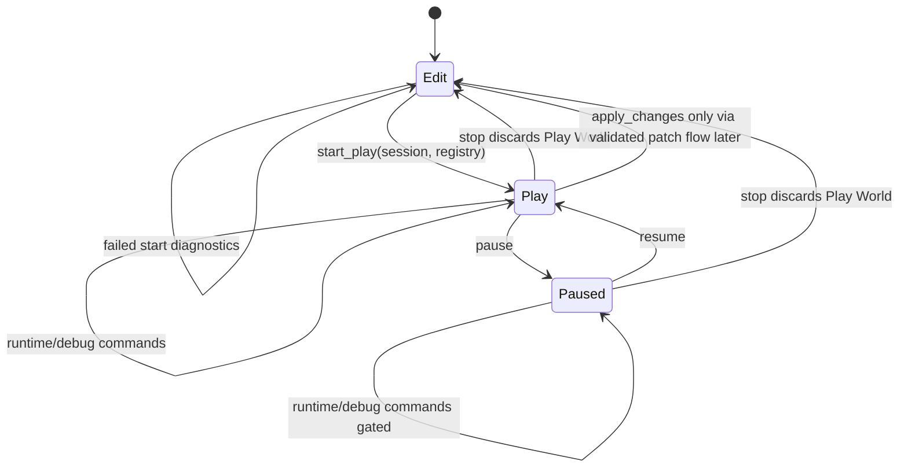
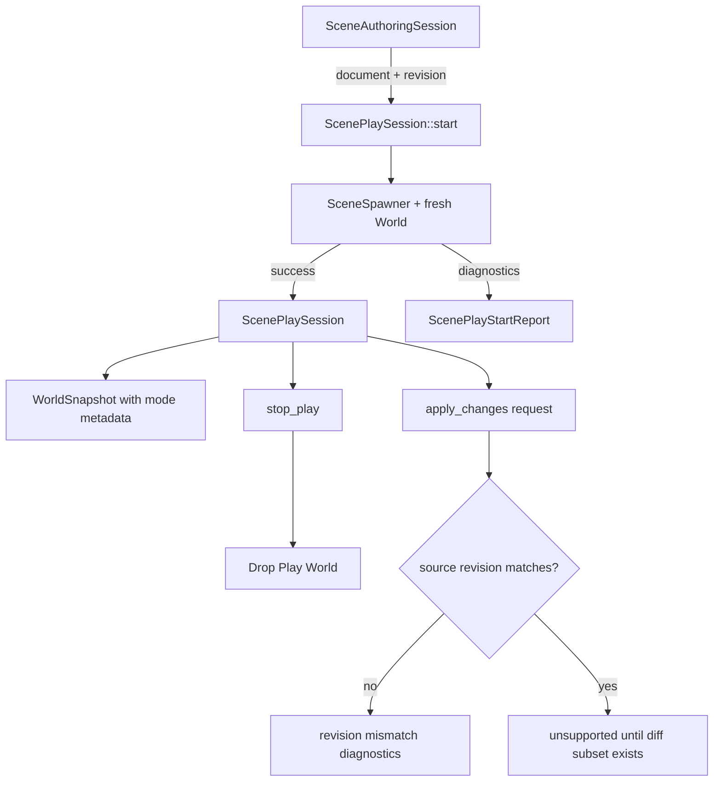

# Editor Play Mode Core - Plan

## Goal Capsule

| Field | Value |
|---|---|
| Objective | Implement the first UI-agnostic Editor Play Mode core: authoring revisions, isolated Play worlds, mode-aware tooling reports, and tests proving Stop discards runtime state by default. |
| Authority | ADR 0034, ADR 0026, ADR 0015, the existing `SceneAuthoringSession`, `SceneSpawner`, `SceneInspectorState`, and the repo rule that persistent scene data never stores runtime `Entity`, runtime `AssetId`, or backend handles. |
| Execution profile | Deep but bounded refactor. `nara_tooling` should be split before adding Play Mode types, and obsolete scaffolding can be removed because nara is pre-1.0. |
| Stop conditions | Stop if Play Mode requires shared edit/play `World` mutation, direct editor writes to runtime ECS storage for persistent edits, or serialization of runtime-only identifiers into scene data. |
| Tail ownership | Implementation owns code, focused tests, docs, engineering memory when useful, verification, and conventional commits according to repo workflow. |

---

## Product Contract

### Summary

This slice turns ADR 0034 from policy into the first executable editor/runtime boundary.
The editor can start a Play world from the current authoring document, inspect or mutate that runtime world without touching the edit document, stop Play and discard runtime state, and expose enough revision metadata for future Apply Changes work to be safe.
The implementation stays UI-agnostic and backend-free so egui, dear-imgui-rs, or a future nara-owned editor UI can all consume the same models.

### Problem Frame

`SceneAuthoringSession` already treats `SceneDocument` as truth and projects it into a disposable live `World`.
That is the right edit-mode model, but it is not enough for a mature editor because pressing Play must not turn runtime simulation into persistent authoring state.
Without an explicit Play Mode owner, every future editor surface would decide for itself whether inspector commands target the edit document, edit preview world, or runtime world.
That ambiguity would make undo, hot reload, apply-back, AI-generated edits, and save-game boundaries expensive to fix later.

### Requirements

**Mode and Lifecycle**

- R1. Starting Play validates the current edit document and spawns a fresh isolated `World` instead of reusing the edit preview world.
- R2. A Play world records the `SceneAuthoringRevision` it was spawned from and the `SceneEntityMap` produced by scene spawn.
- R3. Runtime `Entity` values from the Play world never become persistent scene identity; `SceneEntityId` remains the durable bridge.
- R4. Stopping Play drops or returns the Play world and leaves the edit document, undo/redo history, and edit preview world unchanged by default.
- R5. Failed Play start returns diagnostics and does not mutate the authoring document, authoring history, edit preview map, or any existing edit `World`.
- R6. The mode model exposes `Edit`, `Play`, and `Paused` states with source revision visibility.

**Mode-Aware Tooling**

- R7. Tooling models expose whether their data describes Edit, Play, or Paused mode so editor UI and AI agents do not infer persistence semantics from a raw `WorldSnapshot`.
- R8. Persistent inspector commands still apply through `SceneAuthoringSession` in Edit Mode.
- R9. Mode-aware inspector entry points reject persistent scene patch commands during Play unless a future explicit Apply Changes flow converts runtime state into `ScenePatchDocument` values.
- R10. `nara_tooling` remains UI toolkit and backend agnostic; it must not import `winit`, `wgpu`, egui, or dear-imgui.

**Revision and Apply-Back Readiness**

- R11. `SceneAuthoringSession` exposes a monotonic authoring revision that increments only when the document actually changes.
- R12. Failed patches, failed undo/redo, empty undo/redo, and failed live-world sync do not advance the authoring revision.
- R13. Replacing the authoring document advances the revision and clears history because the document truth changed.
- R14. The first Apply Changes API shape detects source revision mismatch and reports diagnostics instead of silently overwriting edit-time changes.
- R15. Full runtime-to-scene diffing is deferred, but the public types should leave a narrow path for adding supported component subsets later without changing the Play Mode lifecycle contract.

**Maintainability**

- R16. `nara_tooling` is split into responsibility-based modules before or while adding Play Mode so snapshot, inspector, play lifecycle, and plugin exports do not remain in one growing file.
- R17. Public facade exports in `src/lib.rs` expose the new mode and play-session types without enabling optional `winit` or `wgpu` features.
- R18. Tests prove Play isolation, Stop safety, revision behavior, mode-aware command rejection, and failed-start atomicity.

### Scope Boundaries

#### In Scope

- Add authoring revision tracking to `nara_scene`.
- Add UI-agnostic Play Mode lifecycle and mode models to `nara_tooling`.
- Start Play from plain scene documents plus prefab resolver and asset database variants where existing `SceneSpawner` APIs already support them.
- Add a conservative Apply Changes readiness API that reports unsupported or revision-mismatch diagnostics without writing back.
- Split `nara_tooling` into narrow modules and keep current public exports stable where the behavior is still correct.

#### Deferred to Follow-Up Work

- Full Apply Changes diffing from runtime components back into `ScenePatchDocument`.
- Runtime debug command surfaces for editing the Play world from inspector UI.
- A dedicated `nara_editor` crate or full editor application shell.
- Resource cloning or app-world forking beyond the component data spawned from `SceneDocument`.
- Hot-reload merge UI, edit-while-playing merge policy, multiplayer/multi-world Play Mode, and save-game persistence.

#### Outside This Slice

- Renderer, window, game-loop runner, UI widget implementation, scripting, networking, physics, and asset import pipeline changes.

### Acceptance Examples

- AE1. Given an edit session synced to an edit preview world, when Play starts, then the Play world contains spawned scene entities whose runtime `Entity` IDs differ from the edit preview entities and whose source revision equals the session revision.
- AE2. Given a running Play world, when a runtime-only entity or component is added to that Play world and Stop is called, then the edit document and edit preview world remain unchanged.
- AE3. Given an invalid authoring document with an unknown component, when Start Play is requested, then Play does not start and diagnostics identify the scene/component failure without changing authoring revision or live preview state.
- AE4. Given a successful `SceneInspectorCommand::SetField` in Edit Mode, when the patch applies, then the session revision increments, undo history records the inverse, and the live world becomes dirty.
- AE5. Given the same persistent inspector command while the editor mode is Play, when the mode-aware command surface receives it, then it returns a diagnostic, does not apply a scene patch, and leaves the source revision unchanged.
- AE6. Given a Play world spawned from revision N and the edit document later changes to revision N+1, when Apply Changes is requested, then the report rejects the request with revision-mismatch diagnostics and no document mutation.

---

## Planning Contract

### Assumptions

- `nara_tooling` owns the first Play Mode core because no `nara_editor` crate exists yet; a future editor crate can wrap or move these models after the contract is proven.
- `SceneSpawner` remains the only path from scene/prefab documents into runtime worlds for this slice.
- A Play world starts as a fresh `World::new()` with scene-spawned entities; app resources, task pools, and renderer state cloning are deferred.
- `SceneAuthoringRevision` is a simple monotonic value local to one `SceneAuthoringSession`, not a persistent scene-file revision.
- The first Apply Changes API is allowed to reject all content changes as unsupported after it performs source-revision checks.

### Key Technical Decisions

- KTD1. Authoring revision belongs in `nara_scene`, not `nara_tooling`, because patch, undo, redo, replacement, hot reload, and future apply-back all need the same document-change counter.
- KTD2. Play lifecycle belongs in `nara_tooling` for now because it is editor/debug product state, not scene persistence or app scheduling. `nara_scene` should continue to own document validation and spawn only.
- KTD3. Start Play uses `SceneSpawner` and a fresh `World`, not `SceneAuthoringSession::sync_world`, because sync is an edit-preview projection that replaces the managed live slice.
- KTD4. Mode-aware inspector behavior should be additive. Existing `SceneInspectorState::apply_command` can remain the low-level Edit Mode path, while a new mode-aware wrapper or controller guards Play Mode persistence.
- KTD5. Apply Changes is an explicit future bridge, not an implicit Stop behavior. The first API should establish revision checks and diagnostics before diffing exists.
- KTD6. `nara_tooling` module split is part of the feature. Adding Play Mode to the current monolithic `lib.rs` would make snapshot, inspector, plugin, and lifecycle code harder to review and harder for agents to modify safely.
- KTD7. Public types should prefer newtypes and concrete report structs over booleans. The API needs to carry diagnostics, source revision, entity map, mode, and unsupported-operation reasons without forcing UI layers to inspect strings.

### High-Level Technical Design





### Output Structure

```text
crates/nara_tooling/src/
  lib.rs
  inspector.rs
  play.rs
  snapshot.rs
tests/
  scene_play_mode.rs
```

The exact module split may evolve during implementation, but `snapshot`, `inspector`, and `play` should stay separate responsibilities.

### System-Wide Impact

- Editor UI and future AI Agent SDK consumers get a single mode contract instead of inventing separate edit/play semantics.
- `nara_scene` gains a revision primitive that later hot reload, Apply Changes, and collaboration flows can reuse.
- Runtime world mutation remains compatible with future gameplay systems because Play Mode owns a normal ECS `World`.
- Backend crates remain isolated; this slice should not change `nara_render_wgpu`, `nara_winit`, or optional facade features.

### Open Questions

- Deferred: What component subset should the first real Apply Changes diff support?
- Deferred: Should a future `nara_editor` crate own Play Mode state and re-export the `nara_tooling` models, or should `nara_tooling` remain the durable editor-core crate?
- Deferred: How should app resources be cloned or rebuilt for Play Mode once task pools, assets, audio, and scripting become stateful runtime resources?

---

## Implementation Units

### U1. Split `nara_tooling` by Responsibility

**Goal:** Move snapshot, inspector, play, and plugin-facing exports into modules before adding new Play Mode behavior.

**Requirements:** R10, R16.

**Dependencies:** None.

**Files:** Create or modify `crates/nara_tooling/src/lib.rs`, `crates/nara_tooling/src/snapshot.rs`, `crates/nara_tooling/src/inspector.rs`, `crates/nara_tooling/src/play.rs`, and `tests/scene_inspector.rs`.

**Approach:** Move `WorldSnapshot` into `snapshot.rs` and inspector state/model/command types into `inspector.rs`.
Keep `ToolingPlugin` either in `lib.rs` or a small plugin module if that reads better.
Re-export the same public symbols from `lib.rs` so current tests and facade exports continue to compile.

**Execution note:** This is a structural refactor; preserve behavior and use existing inspector tests as characterization coverage before adding Play Mode logic.

**Patterns to follow:** Current `crates/nara_tooling/src/lib.rs`, module splits in `crates/nara_scene/src/lib.rs`, and existing integration tests in `tests/scene_inspector.rs`.

**Test scenarios:**

- Existing `inspector_model_lists_scene_entities_schema_fields_and_live_snapshot` still passes after the module split.
- Existing inspector command tests still compile through `nara::prelude::*` without new imports.
- `cargo check -p nara_tooling` proves module visibility and re-exports are correct.

**Verification:** Tooling behavior is unchanged, public exports remain available, and no backend/UI dependency appears in `nara_tooling`.

### U2. Add Authoring Revision Tracking

**Goal:** Give `SceneAuthoringSession` a monotonic revision value that reflects successful document changes and supports Play source tracking.

**Requirements:** R2, R11, R12, R13, R14.

**Dependencies:** None.

**Files:** Modify `crates/nara_scene/src/authoring.rs`, `crates/nara_scene/src/lib.rs`, `src/lib.rs`, and `tests/scene_authoring_session.rs`.

**Approach:** Add a `SceneAuthoringRevision` newtype and a `revision()` accessor.
Initialize new sessions at revision `0`.
Increment on successful non-empty patch application, successful undo/redo, and `replace_document`.
Do not increment on failed patches, empty patches, failed undo/redo, empty undo/redo, or failed world sync.
Keep revision local to the session and do not serialize it into `SceneDocument`.

**Execution note:** Start with focused revision tests around existing authoring-session patch and history scenarios, then implement the counter.

**Patterns to follow:** `SceneAuthoringHistoryStatus` in `crates/nara_scene/src/authoring.rs`, existing transaction tests in `tests/scene_authoring_session.rs`, and prelude export style in `src/lib.rs`.

**Test scenarios:**

- New session reports revision `0`.
- Successful `SetField` patch advances revision by one and failed `SetField` does not.
- Successful undo and redo each advance revision by one.
- Empty undo/redo reports info diagnostics and leaves revision unchanged.
- `replace_document` advances revision and clears history.
- Failed `sync_world` leaves revision unchanged.

**Verification:** Revision is available from `nara_scene` and `nara::prelude::*`, and all existing authoring-session behavior remains unchanged except for the new revision data.

### U3. Implement Isolated Play Session Lifecycle

**Goal:** Add Play Mode start, pause/resume, stop, and start-failure reports around a fresh runtime `World`.

**Requirements:** R1, R2, R3, R4, R5, R6, R17, R18, AE1, AE2, AE3.

**Dependencies:** U1, U2.

**Files:** Create or modify `crates/nara_tooling/src/play.rs`, `crates/nara_tooling/src/lib.rs`, `src/lib.rs`, and `tests/scene_play_mode.rs`.

**Approach:** Add concrete types for mode and lifecycle such as `EditorMode`, `ScenePlaySession`, `ScenePlayStartReport`, and `ScenePlayStopReport`.
Start Play by creating a fresh `World`, using `SceneSpawner` to spawn the session document with the requested context, and returning diagnostics on failure.
Expose start variants for plain scene spawn, asset database, prefab resolver, and resolver plus asset database where existing spawn APIs already support them.
Store source revision, entity map, diagnostics, and paused state on the Play session.
Stop consumes or drops the Play session and reports source revision plus simple stats without applying patches.

**Execution note:** Add failing Play isolation tests before production code so the test observes distinct edit/play entity maps and Stop discard behavior.

**Patterns to follow:** `SceneAuthoringSession::sync_world` failure handling in `crates/nara_scene/src/authoring.rs`, `SceneSpawner` variants in `crates/nara_scene/src/spawn.rs`, and `WorldSnapshot::capture` in `crates/nara_tooling/src/lib.rs` before U1.

**Test scenarios:**

- Starting Play from a valid scene succeeds, records the current source revision, and creates a non-empty play entity map.
- Edit preview entity IDs and Play entity IDs differ for the same `SceneEntityId`.
- Adding a runtime-only entity to Play does not change `session.document()` or `session.live_entity_map()`.
- Stop returns to Edit semantics and discards the Play world by consuming the session.
- Starting Play from a document with an unknown component fails with diagnostics and leaves authoring revision, history, and live entity map unchanged.
- Pause and resume toggle mode metadata without mutating the Play world or authoring session.

**Verification:** Play lifecycle tests prove isolation and failure atomicity through public tooling APIs.

### U4. Add Mode-Aware Inspector and Snapshot Models

**Goal:** Make tooling consumers ask an explicit mode-aware surface before applying persistent scene edits.

**Requirements:** R6, R7, R8, R9, R10, AE4, AE5.

**Dependencies:** U1, U2, U3.

**Files:** Modify `crates/nara_tooling/src/inspector.rs`, `crates/nara_tooling/src/play.rs`, `crates/nara_tooling/src/snapshot.rs`, `crates/nara_tooling/src/lib.rs`, `src/lib.rs`, `tests/scene_inspector.rs`, and `tests/scene_play_mode.rs`.

**Approach:** Add mode metadata to snapshot or editor tooling models without changing the existing low-level `WorldSnapshot` contract unnecessarily.
Provide a mode-aware command entry point that delegates to `SceneInspectorState::apply_command` in Edit Mode and returns diagnostics in Play Mode for persistent patch commands.
Selection-only commands may remain local UI state when safe, but they must not imply a scene patch in Play Mode.

**Execution note:** Keep the existing inspector API usable for Edit Mode tests; add the guard through a new type or method rather than breaking every caller.

**Patterns to follow:** `SceneInspectorCommandReport` diagnostic shape in `crates/nara_tooling/src/inspector.rs`, `DiagnosticReport` usage in `nara_scene`, and ADR 0034 mode semantics.

**Test scenarios:**

- In Edit Mode, a mode-aware `SetField` command applies through `SceneAuthoringSession`, advances revision, records undo, and marks live world dirty.
- In Play Mode, the same `SetField` command returns an error diagnostic, does not produce a scene patch report, does not advance revision, and does not dirty the edit preview world.
- Selection-only command behavior is documented by tests for Edit and Play so UI adapters know whether selection is global editor state or authoring state.
- Mode-aware model includes current mode and source revision when Play is active.

**Verification:** Tooling exposes persistence semantics directly and no UI/backend crate is introduced.

### U5. Add Apply Changes Readiness Diagnostics

**Goal:** Establish the explicit apply-back API shape without implementing broad runtime-to-scene diffing.

**Requirements:** R14, R15, AE6.

**Dependencies:** U2, U3.

**Files:** Modify `crates/nara_tooling/src/play.rs`, `crates/nara_tooling/src/lib.rs`, `src/lib.rs`, and `tests/scene_play_mode.rs`.

**Approach:** Add an Apply Changes request/report type that compares the Play session source revision with the current `SceneAuthoringSession` revision before any write-back.
If revisions differ, return a revision-mismatch diagnostic and no patch.
If revisions match, return a clear unsupported diagnostic for the initial implementation and no mutation.
Do not export raw runtime `Entity` values, handles, backend resources, or transient components through the report.

**Execution note:** Treat this as a safety contract, not a hidden partial diff implementation.

**Patterns to follow:** Patch command reports in `crates/nara_tooling/src/inspector.rs`, diagnostics in `crates/nara_scene/src/authoring.rs`, and ADR 0034 Apply Changes rules.

**Test scenarios:**

- Apply Changes on a same-revision Play session returns unsupported diagnostics and leaves document, history, and revision unchanged.
- Apply Changes after an edit-session patch advances the edit revision returns revision-mismatch diagnostics before unsupported diagnostics.
- Apply Changes report contains no runtime `Entity` data and no `ScenePatchDocument` unless a future supported subset produces one.

**Verification:** Future diff implementation has a stable revision-gated entry point, and the current behavior is conservatively non-mutating.

### U6. Update Docs, Facade Exports, and Verification Memory

**Goal:** Align architecture docs and public exports with the implemented Play Mode core.

**Requirements:** R17, R18.

**Dependencies:** U1, U2, U3, U4, U5.

**Files:** Modify `src/lib.rs`, `AGENTS.md`, `docs/architecture/nara-foundation.md`, `docs/architecture/open-questions.md`, and create `docs/knowledge/engineering/verification/<timestamp>-editor-play-mode-core.md`.

**Approach:** Re-export new revision and Play Mode types through `nara_scene`, `nara_tooling`, and the root prelude.
Update foundation docs to mark Play Mode core lifecycle and revision tracking as implemented while leaving full Apply Changes diffing open.
Add an AGENTS rule if implementation reveals a new durable boundary, for example that Play Mode must not share edit preview worlds.
Record verification commands and any intentionally deferred tests in engineering memory.

**Execution note:** This unit is documentation and facade cleanup after behavior lands; do not edit the plan file during execution.

**Patterns to follow:** Existing facade export sections in `src/lib.rs`, open-question resolution style in `docs/architecture/open-questions.md`, and verification notes under `docs/knowledge/engineering/verification/`.

**Test scenarios:**

- Test expectation: no standalone behavior tests beyond facade compilation; this unit is proven by `cargo check --workspace`, full tests, and doc diff review.

**Verification:** Public exports compile, docs describe the implemented state accurately, and deferred work remains visible rather than silently treated as complete.

---

## Verification Contract

| Gate | Applies to | Done Signal |
|---|---|---|
| `cargo fmt --all --check` | All units | Formatting is stable after module split and new code. |
| `cargo check -p nara_tooling` | U1, U3, U4, U5 | Tooling modules compile without backend or UI toolkit dependencies. |
| `cargo check -p nara_scene` | U2 | Scene revision API compiles in isolation. |
| `cargo check --workspace` | All units | Workspace compiles with default backend-free features. |
| `cargo nextest run --workspace` | All behavior-bearing units | Authoring, inspector, and Play Mode tests pass. |
| `cargo check --workspace --features serde` | Facade and scene serialization compatibility | Serde feature wiring still compiles. |
| `cargo check -p nara --features winit,wgpu --example windowed_clear` | Facade and optional backend compatibility | Optional backend example still compiles after prelude changes. |
| `cargo check -p nara --features winit,wgpu --example windowed_sprites` | Facade and optional backend compatibility | Sprite example still compiles after prelude changes. |
| `rg -n "winit::|wgpu::|egui|imgui" crates/nara_tooling crates/nara_scene src` | Boundary check | No new direct backend/UI toolkit imports in scene or tooling core. |

---

## Definition of Done

- `SceneAuthoringSession` exposes revision tracking and tests cover successful and failed mutation paths.
- `nara_tooling` is split into focused modules with stable public re-exports.
- A Play session can start from a valid authoring session into an isolated `World`, pause/resume, stop without write-back, and report failed starts atomically.
- Mode-aware tooling rejects persistent scene patch commands during Play Mode and continues to allow Edit Mode patch commands.
- Apply Changes has a revision-gated, diagnostic-only first API that performs no implicit persistence.
- Root prelude exports all new public types needed by examples, tests, and future editor UI.
- Architecture docs and engineering verification memory distinguish implemented Play lifecycle from deferred Apply Changes diffing.
- All gates in the Verification Contract pass, or any unavailable gate is documented with the exact reason and replacement evidence.
- Dead-end code from abandoned implementation attempts is removed before the final commit.

---

## Risks & Dependencies

| Risk | Severity | Mitigation |
|---|---|---|
| Play Mode types land in `nara_tooling` and later need `nara_editor` ownership | Medium | Keep types UI-agnostic and avoid editor-app dependencies so a future crate can wrap or re-export them. |
| Revision semantics become too broad and accidentally track live-world sync | High | Define revision as document truth only and test failed sync/no-op cases. |
| Apply Changes readiness is mistaken for real persistence | Medium | Return explicit unsupported diagnostics and keep docs/open questions clear. |
| Fresh `World::new()` lacks resources future gameplay systems expect | Medium | Document this as deferred app-world forking; this slice only proves scene-spawned ECS data isolation. |
| Mode-aware inspector wrapper duplicates existing inspector API | Medium | Keep low-level Edit API intact and make the new wrapper the editor-facing persistence guard. |
| Tooling module split causes noisy facade churn | Low | Preserve re-export names and use existing tests as characterization coverage. |

---

## Sources & Research

- `docs/architecture/adr/0034-editor-play-mode-world-boundary.md` defines isolated Play worlds, Stop discard semantics, mode visibility, and explicit Apply Changes.
- `docs/architecture/adr/0026-editor-command-patch-and-undo-model.md` defines patch transactions as the editor and AI authoring mutation path.
- `docs/architecture/adr/0015-editor-tooling-and-dogfooding-boundary.md` keeps editor tooling as a runtime API client instead of a coupled black-box editor.
- `crates/nara_scene/src/authoring.rs` already owns document truth, undo/redo history, live dirty tracking, and rebuild-style world sync.
- `crates/nara_scene/src/spawn.rs` already provides scene spawn preflight, prefab resolver variants, asset database variants, `SceneEntitySource`, and `SceneEntityMap`.
- `crates/nara_tooling/src/lib.rs` currently contains snapshot, inspector, command, and plugin code in one file; it should be split before adding Play Mode.
- `tests/scene_authoring_session.rs` and `tests/scene_inspector.rs` are the existing characterization coverage to preserve and extend.
