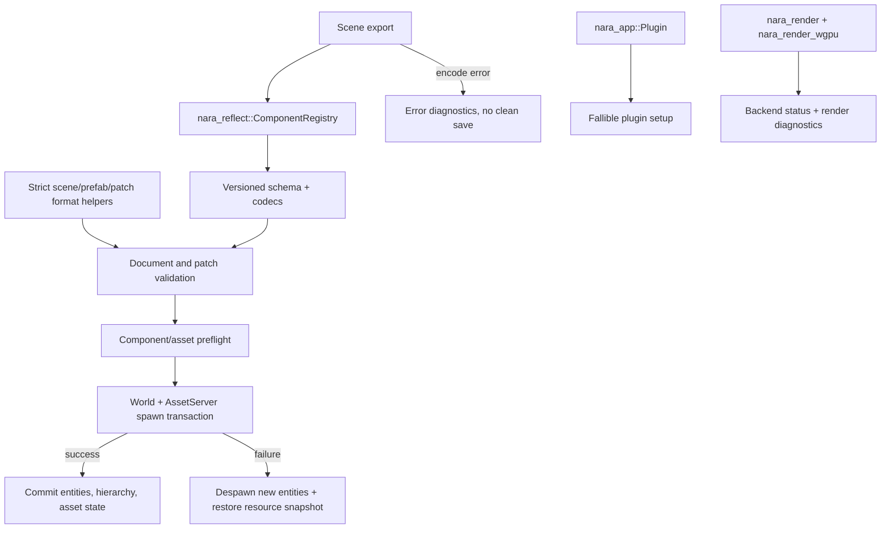

# Foundation Hardening - Plan

## Goal Capsule

| Field | Value |
|---|---|
| Objective | Harden nara's early engine foundation where silent persistence loss, partial world mutation, weak schema/version contracts, and unclear backend/plugin seams would become expensive to change after public API growth. |
| Authority | Current AGENTS.md rules, ADR 0009, ADR 0010, ADR 0011, ADR 0016, ADR 0032, ADR 0033, ADR 0034, `docs/architecture/nara-foundation.md`, and `docs/knowledge/engineering/subagents/2026-07-09-codebase-foundation-audit.md`. |
| Execution profile | Deep, breaking refactor is allowed. Correct long-term contracts take priority over compatibility with pre-1.0 call sites. |
| Stop conditions | Stop if a fix requires persistent scene, prefab, patch, or project data to serialize runtime `Entity`, runtime `AssetId`, `Handle<T>` raw identity, backend handles, Rust type names as stable IDs, or editor-only mutation paths. |
| Tail ownership | Implementation owns code, focused tests, docs, engineering memory, review, verification, and conventional commits according to repo workflow. |

---

## Product Contract

### Summary

This slice converts the current foundation from "usable MVP contracts" into stricter engine contracts for data loss prevention, migration readiness, and backend/tooling isolation.
It does not add flashy feature surface.
It hardens the load-bearing seams that future scene editing, asset hot reload, 3D rendering, runtime UI, scripting, and AI-generated content will rely on.

### Problem Frame

The current codebase already has good crate boundaries and working scene/prefab/tooling flows, but the audit found several early-stage shortcuts that would be painful once real projects depend on serialized data.
Scene export can warn and continue after component encode failure, so a save path can persist a scene missing component data.
Scene spawn preflights first but still mutates the target `World` and `AssetServer` during apply, so a failing custom codec can leave partial state behind.
Scene, prefab, and patch documents lack strict unknown-field and patch-format contracts, which is risky for AI-generated or hand-authored files.
`ComponentRegistry` can overwrite Rust type mappings and stores too many responsibilities in one file just before schema export, derive/codegen, editor widgets, and migrations need to grow.

### Requirements

**Persistent data safety**

- R1. Scene export must fail closed by default when a serializable component cannot encode; callers must not receive a successful save/export report with silently omitted component data.
- R2. Scene, prefab, patch, and project-facing format helpers must reject unknown document fields by default so AI/user typos become diagnostics instead of data loss.
- R3. `ScenePatchDocument` must carry a patch format version, and field-path operations must carry enough component schema version context to support future migrations.
- R4. Scene, prefab, patch, asset, and example serialization must not expose runtime `Entity`, runtime `AssetId`, typed handle internals, backend handles, or Rust type names as persistent identity.
- R5. Runtime-only asset identifiers and runtime asset events must not derive general project-data serde support unless an explicit debug/runtime-only channel is introduced.

**Transactional runtime mutation**

- R6. Scene and prefab spawn must remain two-phase: preflight all components and asset refs first, then mutate the target `World` only through a transaction that can roll back all newly spawned entities and scratch asset changes on apply failure.
- R7. Asset-aware spawn must commit `AssetServer` changes only after full spawn success, or restore the original resource state after any apply failure.
- R8. Spawn failure diagnostics must preserve component, entity, asset, and operation context while returning an empty committed entity map.

**Reflection and schema integrity**

- R9. `ComponentRegistry` must reject duplicate stable component IDs, duplicate Rust `TypeId` mappings, duplicate field paths, incompatible default values, and serializable components without an explicit schema unless a deliberate runtime-only registration API is used.
- R10. `nara_reflect` must be split into narrow modules for value, field path, schema, codec, migration, and registry logic before more derive/codegen or editor metadata is added.
- R11. Component schema and codec APIs must keep migrations and version checks backend-free and independent from `nara_scene`.

**App, plugin, diagnostics, and backend seams**

- R12. Plugin installation must become diagnostics-aware and fallible instead of relying on panic-based prerequisite helpers for expected dependency failures.
- R13. Plugin groups and backend/domain plugins must report missing prerequisites through structured errors or diagnostics while preserving ergonomic app setup.
- R14. `DiagnosticReport` must collect diagnostics without unconditionally emitting tracing side effects; tracing/logging should be an explicit bridge.
- R15. The render backend contract must match the implemented integration path: plugin/resources/systems/backends should expose a clear backend status/error surface, and any unused trait shape should be removed or made real.
- R16. `winit`, `wgpu`, and `egui` dependency boundaries must remain intact after refactors.

**Maintainability and documentation**

- R17. Large mixed-responsibility modules should be split where this hardening work touches them, especially `nara_reflect`, without changing public crate ownership rules.
- R18. Architecture docs, ADR implementation notes, engineering memory, and AGENTS guidance must reflect the hardened contracts and remaining residuals.

### Scope Boundaries

- This slice does not implement a full render graph, 3D pipeline, runtime UI renderer, async hot reload loop, or Apply Changes runtime diffing.
- This slice does not preserve old pre-1.0 API compatibility when the old API encodes the wrong contract.
- This slice does not add a generic JSON Patch layer. nara patch operations stay domain-specific and schema-aware.
- This slice does not introduce editor-only shortcuts around `SceneAuthoringSession`; editor and AI mutation still go through scene patches.
- This slice does not hide failed verification behind compatibility modes. Lenient migration/import paths may exist only as explicit APIs with tests and naming that make the weaker contract visible.
- Strict unknown-field parsing in this slice applies first to scene, prefab, and patch authoring formats. Asset meta and imported artifact records are tightened only where U5 finds runtime identity leakage or an equivalent project-data risk.

### Acceptance Examples

- AE1. Given a world containing a registered serializable component whose encoder returns an error, when `export_scene` runs with default options, then diagnostics contain an error and no caller can treat the export as a clean save.
- AE2. Given a scene JSON file with misspelled top-level, entity, component, prefab, or patch operation fields, when it is parsed through the default format helpers, then parse fails before validation silently drops the field.
- AE3. Given a custom component whose preflight succeeds but apply fails, when `spawn_scene` is called, then no new entities remain in the target `World`, the original `AssetServer` state is restored, and the entity map is empty.
- AE4. Given a patch field operation serialized at component schema version N, when validation sees the registered schema at version N+1, then it can diagnose or migrate intentionally instead of guessing from a bare field path.
- AE5. Given the same Rust component type registered under two different stable IDs, when the second registration runs, then `ComponentRegistry` rejects it unless a future explicit alias API is used.
- AE6. Given an optional schema field with a default value of the wrong value kind, when the schema is registered, then registration fails before editor/AI schema export can publish invalid defaults.
- AE7. Given a missing backend prerequisite plugin, when a dependent plugin is installed, then app setup returns a structured plugin error instead of panicking.
- AE8. Given a skipped wgpu frame or surface/device failure, when the backend reports it, then the error is observable through render/backend diagnostics or status resources and does not rely only on a private `last_error`.

---

## Planning Contract

### Assumptions

- The project remains pre-1.0, so breaking API changes are acceptable when they remove weak contracts.
- `bevy_ecs` remains the ECS substrate and `nara_app` remains the product-facing app/plugin owner.
- Existing scene/prefab patch APIs are the correct authoring mutation direction; this plan strengthens them instead of replacing them.
- Runtime UI will be nara-owned later, but egui remains acceptable only for debug/editor adapters.
- The implementation may use clone-and-rollback approaches before optimizing for large editor workloads.

### Key Technical Decisions

- KTD1. Persistent formats fail closed by default. Lenient parsing is a separate migration/import API, not the default authoring or save path; this slice either lands a named minimal migration entry point or records that entry point as an explicit residual rather than weakening the default parser.
- KTD2. Scene spawn remains an ECS mutation, not a scratch-world wholesale merge. Component apply must be constrained to target entity/component mutation plus explicitly whitelisted rollback-aware resources; any future apply hook that mutates other entities, resources, or external state must register rollback behavior or fail preflight.
- KTD3. Patch versioning belongs in `ScenePatchDocument`; field operations carry `component_type_id` plus required `component_schema_version` so future field renames and migrations have a stable anchor. Missing version context is accepted only through explicit migration/import paths.
- KTD4. `ComponentRegistry` treats one Rust component type mapping to multiple stable component IDs as invalid until a real alias/migration story exists.
- KTD5. Serializable component registration requires explicit field schema. Runtime-only component registration remains possible, but it must be named as runtime-only.
- KTD6. `nara_reflect` module split is part of correctness work. Values, paths, schemas, codecs, migrations, and registry state have different invariants and test surfaces.
- KTD7. Fallible plugin setup should return errors at app/plugin boundaries. Panic remains reserved for invariant violations, not expected missing prerequisites.
- KTD8. Diagnostics collection and logging are separate. Runtime and tooling need to inspect reports without forcing tracing side effects.
- KTD9. The render backend seam is plugin/resources/systems/status today. A standalone trait should not imply a contract the implementation does not honor.

### High-Level Technical Design

The critical flow is "strict data in, total preflight, transactional mutation, strict data out".
Reflection hardening sits under both import and export.
Plugin and render changes keep the same principle at runtime setup boundaries: expected failures return structured information instead of panic or private state.

### Dependencies and Sequencing

- Strict export/import and transactional spawn come first because they protect user data and reveal test fixtures needed by later units.
- Patch versioning depends on current patch operation shapes and must be completed before tooling creates more patch call sites.
- Registry hardening and `nara_reflect` module split should land before plugin/render follow-ups because many crates register built-in component schemas.
- Plugin lifecycle changes should land before render prerequisite helpers are rewritten.
- Final docs and memory must reflect the actual code decisions, not the plan's initial guesses.
- Execute in two commit clusters to lower failure coupling without shrinking scope. Cluster A covers U1-U5 and must be green and committed before Cluster B. Cluster B covers U6-U8 after the data-safety chain is stable, followed by U9-U10 docs, review, and final verification.
- Before U1, restore the local compile baseline if the active worktree already fails. The known `nara_reflect` `MissingSerializableComponentFields` field-name mismatch belongs to the U4 registry-hardening path but must be repaired before broader verification can be trusted.

### Sources & Research

- Codebase audit: `docs/knowledge/engineering/subagents/2026-07-09-codebase-foundation-audit.md`
- Foundation architecture: `docs/architecture/nara-foundation.md`
- Diagnostics ADR: `docs/architecture/adr/0009-diagnostics-errors-and-logging.md`
- Plugin ADR: `docs/architecture/adr/0010-plugin-lifecycle-dependencies-and-failure.md`
- Schema ADR: `docs/architecture/adr/0011-component-schema-ids-and-migrations.md`
- Extension seams ADR: `docs/architecture/adr/0016-extension-seams-for-backends-and-domain-modules.md`
- Render backend ADR: `docs/architecture/adr/0032-render-backend-integration-boundary.md`
- Asset/render seam ADR: `docs/architecture/adr/0033-asset-import-and-render-resource-preparation-seam.md`
- Play Mode ADR: `docs/architecture/adr/0034-editor-play-mode-world-boundary.md`
- Current focus files: `crates/nara_scene/src/export.rs`, `crates/nara_scene/src/spawn.rs`, `crates/nara_scene/src/format.rs`, `crates/nara_scene/src/patch.rs`, `crates/nara_scene/src/prefab.rs`, `crates/nara_reflect/src/lib.rs`, `crates/nara_app/src/lib.rs`, `crates/nara_diagnostic/src/lib.rs`, `crates/nara_render/src/lib.rs`, `crates/nara_render_wgpu/src/lib.rs`.

---

## Implementation Units

### U1. Make scene, prefab, patch, and export persistence strict

- **Goal:** Prevent save/export/import paths from silently dropping authoring intent.
- **Requirements:** R1, R2, R4.
- **Dependencies:** None.
- **Files:** `crates/nara_scene/src/export.rs`, `crates/nara_scene/src/format.rs`, `crates/nara_scene/src/document.rs`, `crates/nara_scene/src/prefab.rs`, `crates/nara_scene/src/patch.rs`, `crates/nara_scene/src/tests.rs`, `tests/scene_sprite_serialization.rs`, examples under `examples/`.
- **Approach:** Treat component encode failures as errors in default export. Add strict serde unknown-field policy to persistent scene, prefab, patch, entity, component, and format wrapper structs while leaving value maps capable of carrying component field names. Keep any lenient compatibility path explicit and tested if needed.
- **Test Scenarios:** Encode failure returns error diagnostics; exported report with errors is not considered clean; unknown scene field fails; unknown entity field fails; unknown component record field fails; unknown prefab field fails; unknown patch operation field fails; existing valid JSON/RON examples still roundtrip.
- **Verification:** `cargo nextest run -p nara_scene -p nara`; `cargo check --workspace --features serde`; `cargo run -q --features serde --example scene_prefab_roundtrip`; `cargo run -q --features serde --example scene_patch_roundtrip`; `cargo run -q --features serde --example prefab_patch_override`.
- **Execution note:** Use proof-first tests for each previous silent-success path before changing production code.

### U2. Make scene and prefab spawn transactional after preflight

- **Goal:** Ensure failed component apply or asset resolution cannot leave partial runtime state.
- **Requirements:** R6, R7, R8.
- **Dependencies:** U1.
- **Files:** `crates/nara_scene/src/spawn.rs`, `crates/nara_scene/src/tests.rs`, possible small helpers in `crates/nara_asset/src/lib.rs`.
- **Approach:** Preserve the current full preflight phase, then wrap apply in a transaction that tracks spawned entities, hierarchy/resource side effects, and original `AssetServer` state. On failure, despawn all transaction-created entities, restore or remove `AssetServer` to its original state, skip hierarchy sync as committed state, and return diagnostics plus an empty committed entity map.
- **Test Scenarios:** Custom apply failure leaves world entity count unchanged; apply failure restores original `AssetServer`; apply failure removes scratch `AssetServer` when none existed before; success still spawns hierarchy and asset-backed components; prefab override preflight failure still mutates nothing.
- **Verification:** `cargo nextest run -p nara_scene -p nara_asset -p nara`; `cargo check --workspace --features serde`.
- **Execution note:** Characterize the current partial-mutation failure with a failing test before implementing rollback.

### U3. Version patch documents and field operations

- **Goal:** Make authoring patches migratable before more editor/AI callers depend on the wire format.
- **Requirements:** R3, R4.
- **Dependencies:** U1, U2.
- **Files:** `crates/nara_scene/src/patch.rs`, `crates/nara_scene/src/prefab.rs`, `crates/nara_scene/src/authoring.rs`, `crates/nara_tooling/src/inspector.rs`, `crates/nara_tooling/src/play.rs`, `crates/nara_tooling_egui/src/lib.rs` only if action models need type updates, tests in `crates/nara_scene/src/tests.rs` and `tests/scene_patch_transactions.rs`.
- **Approach:** Add a patch format version constant and store it in `ScenePatchDocument`. Add required `component_type_id + component_schema_version` context to field-path operations and update constructors/helpers so normal authoring call sites fill it from `ComponentFieldSchema`. Validate unsupported patch versions, missing authoring schema versions, and incompatible schema versions before applying operations; legacy missing version data belongs only in explicit migration/import APIs.
- **Test Scenarios:** Default patch serializes current format version; unsupported patch version fails validation without mutation; field operation with matching component schema version succeeds; field operation with stale schema version diagnoses before mutation; prefab override patches preserve version data through expansion and roundtrip.
- **Verification:** `cargo nextest run -p nara_scene -p nara_tooling -p nara_tooling_egui`; `cargo check --workspace --features serde`.
- **Execution note:** Prefer explicit breakage over compatibility shims for in-repo call sites; update all constructors/tests to the new versioned shape.

### U4. Harden and split `nara_reflect`

- **Goal:** Make component metadata registration trustworthy and maintainable before the schema surface grows.
- **Requirements:** R9, R10, R11, R17.
- **Dependencies:** U1, U3.
- **Files:** `crates/nara_reflect/src/lib.rs`, new `crates/nara_reflect/src/value.rs`, `path.rs`, `schema.rs`, `codec.rs`, `migration.rs`, `registry.rs`, `crates/nara_reflect/Cargo.toml` if module tests need support, owner registration sites in `crates/nara_scene`, `crates/nara_transform`, `crates/nara_render`, `crates/nara_sprite`, `crates/nara_tilemap`.
- **Approach:** Add or strengthen failing tests and characterization around current registry behavior first. Then move existing reflection responsibilities into narrow modules with public re-exports from `lib.rs`, keeping pure movement separate from invariant changes when practical. Add duplicate Rust `TypeId` rejection, default-value kind validation, schema coverage checks for serializable components, and a clearly named runtime-only registration path for components without serializable field schema.
- **Test Scenarios:** Duplicate stable ID fails; duplicate Rust `TypeId` with a different stable ID fails; duplicate field path fails; optional default kind mismatch fails; serializable component without field schema fails; runtime-only registration without field schema succeeds and is absent from schema export; existing built-in schemas still export deterministically.
- **Verification:** `cargo nextest run -p nara_reflect -p nara_scene -p nara_sprite -p nara_tilemap -p nara_transform -p nara_render`; `cargo check --workspace --features serde`.
- **Execution note:** Prove the old weak behavior with tests before implementation, then keep pure module movement and invariant changes in reviewable commit boundaries.

### U5. Tighten asset runtime identity persistence boundaries

- **Goal:** Keep runtime asset IDs and asset events from becoming project file formats by accident.
- **Requirements:** R4, R5.
- **Dependencies:** U1, U2.
- **Files:** `crates/nara_asset/src/identity.rs`, `crates/nara_asset/src/state.rs`, `crates/nara_asset/src/lib.rs`, tests in `crates/nara_asset/src/*` and affected examples.
- **Approach:** Remove general-purpose serde derives from runtime-only identifiers/events or gate them behind an explicit debug/runtime feature if existing tests prove a legitimate internal need. Keep `AssetRef::Path`, `AssetRef::StableId`, meta records, and imported artifact records as the persistent forms.
- **Test Scenarios:** Project-facing examples serialize `AssetRef` not `AssetId`; serde leak search finds no direct runtime ID persistence; asset meta/import records still roundtrip; runtime load-state tests still work without project serde.
- **Verification:** `cargo nextest run -p nara_asset -p nara_scene -p nara_sprite`; `cargo check --workspace --features serde`; `rg -n "AssetId.*Serialize|Deserialize.*AssetId|AssetEvent.*Serialize|Deserialize.*AssetEvent" crates examples tests`.
- **Execution note:** Treat compile errors from removed derives as useful call-site discovery.

### U6. Make plugin installation fallible and remove panic prerequisite helpers

- **Goal:** Align app/plugin lifecycle with a mature engine where setup failures are structured, diagnosable, and testable.
- **Requirements:** R12, R13.
- **Dependencies:** U4.
- **Files:** `crates/nara_app/src/lib.rs`, plugin users in `crates/nara_render`, `crates/nara_sprite_render`, `crates/nara_render_wgpu`, `crates/nara_winit`, `crates/nara_tooling`, `crates/nara_tooling_egui`, root facade examples and tests.
- **Approach:** Change the plugin build/install boundary to return a structured plugin error or installation report. Replace helper methods that panic on missing prerequisite plugins with fallible dependency checks. Preserve ergonomic `App::add_plugin` usage where possible through `Result<&mut App, PluginError>` or a similarly explicit contract.
- **Test Scenarios:** Missing prerequisite returns error instead of panic; successful plugin group install still registers resources/systems; duplicate plugin install behavior stays deterministic; examples handle setup errors ergonomically; old panic helpers are removed.
- **Verification:** `cargo nextest run -p nara_app -p nara_render_wgpu -p nara_winit -p nara_sprite_render -p nara`; `cargo check -p nara --features winit,wgpu --example windowed_clear`; `cargo check -p nara --features winit,wgpu --example windowed_sprites`.
- **Execution note:** This is an intentional breaking change. Prefer compiling all call sites against the new contract over adding parallel legacy APIs.

### U7. Decouple diagnostics from tracing and expose render backend status

- **Goal:** Make diagnostics inspectable by runtime/tooling/AI while keeping logging as a bridge, and make render backend failures observable through the public render seam.
- **Requirements:** R14, R15, R16.
- **Dependencies:** U6.
- **Files:** `crates/nara_diagnostic/src/lib.rs`, `crates/nara_render/src/lib.rs`, `crates/nara_render_wgpu/src/lib.rs`, tests in those crates and affected examples.
- **Approach:** Remove unconditional tracing side effects from `DiagnosticReport::push` and add an explicit emit/log helper if needed. Treat the implemented plugin/resources/systems/status path as the official backend contract. Delete the public `RenderBackend` trait if it still has only one real backend consumer rather than stabilizing a speculative abstraction; expose status, skipped-frame reason, last error, and render diagnostics through resources or events that non-backend crates can observe without importing `wgpu`.
- **Test Scenarios:** Pushing diagnostics does not require tracing side effects; explicit tracing bridge can emit diagnostics; wgpu skipped frame records backend status; render-domain crates still do not import `wgpu`; default facade remains backend-free.
- **Verification:** `cargo nextest run -p nara_diagnostic -p nara_render -p nara_render_wgpu -p nara`; `cargo check --workspace`; backend boundary searches from the Verification Contract.
- **Execution note:** Let the implemented plugin/resource path define the contract; do not preserve an unused abstraction only because it exists.

### U8. Split touched large modules and remove obsolete scaffolding

- **Goal:** Keep future codegen, editor controls, render features, and component domains from growing on monolithic files.
- **Requirements:** R10, R16, R17.
- **Dependencies:** U4, then any previous unit whose touched module is being split.
- **Files:** `crates/nara_reflect/src/*` as the required split, plus any of `crates/nara_sprite/src/*`, `crates/nara_tilemap/src/*`, `crates/nara_tooling_egui/src/*`, or `crates/nara_image/src/*` only when U1-U7 already touched the crate and the split reduces current diff complexity.
- **Approach:** Split `nara_reflect` as required by U4. Split other touched crates only when the current behavior change has created a real maintainability blocker; do not start unrelated broad module surgery. Preserve public crate APIs through re-exports where the contract remains correct. Delete abandoned compatibility shims, dead helper APIs, and obsolete tests that encode removed behavior.
- **Test Scenarios:** Public re-exports compile; examples compile without path changes except intentional breaking plugin/patch APIs; no new backend dependencies leak into gameplay-facing crates; removed old helpers have no in-repo callers.
- **Verification:** `cargo check --workspace`; `cargo nextest run --workspace`; dependency boundary searches.
- **Execution note:** Refactor in small commits after behavior-bearing units are green so mechanical split failures are easy to isolate.

### U9. Update architecture docs, ADR notes, memory, and agent guidance

- **Goal:** Make the hardened contracts durable for future agents and contributors.
- **Requirements:** R18.
- **Dependencies:** U1-U8.
- **Files:** `docs/architecture/nara-foundation.md`, relevant ADRs under `docs/architecture/adr/`, `docs/architecture/open-questions.md`, `docs/knowledge/engineering/current-state.md`, new progress or finding files under `docs/knowledge/engineering/`, `AGENTS.md` if the boundary rules need tightening.
- **Approach:** Update only accepted implementation facts and residual decisions. Record strict persistence, transactional spawn, versioned patches, registry hardening, fallible plugin setup, diagnostic/logging split, and render backend status as the current foundation. Keep unresolved future work visible without re-opening settled decisions.
- **Test Scenarios:** Docs do not claim unsupported Apply Changes diffing, render graph, runtime UI, async hot reload, or 3D pipeline work is implemented; AGENTS rules match code boundaries; engineering memory validates.
- **Verification:** engineering memory validation if available; `git diff --check`; repo searches for stale phrases such as panic prerequisite helpers or unversioned patch assumptions.

### U10. Final verification, review, and cleanup

- **Goal:** Prove the refactor is complete, remove dead attempts, and land reviewable commits.
- **Requirements:** R1-R18.
- **Dependencies:** U1-U9.
- **Files:** Whole workspace.
- **Approach:** Run formatting, focused tests, full workspace checks, optional backend example checks, dependency boundary searches, serialization leak searches, and code review. Apply eligible review fixes and commit logical units with conventional messages.
- **Test Scenarios:** Every prior acceptance example has direct test or documented replacement verification; no failing focused or workspace checks remain; no out-of-scope generated or abandoned code remains in the diff.
- **Verification:** All gates in the Verification Contract.

---

## Verification Contract

| Gate | Command | Applies To | Done Signal |
|---|---|---|---|
| Format | `cargo fmt --all` | All units | Formatting completes without unwanted unrelated churn. |
| Workspace check | `cargo check --workspace` | All units | Workspace compiles with default features. |
| Serde check | `cargo check --workspace --features serde` | U1-U5, U9-U10 | JSON/RON-gated code compiles. |
| Focused scene tests | `cargo nextest run -p nara_scene -p nara_asset -p nara_reflect` | U1-U5 | Persistence, spawn, patch, asset, and registry tests pass. |
| Focused app/render tests | `cargo nextest run -p nara_app -p nara_diagnostic -p nara_render -p nara_render_wgpu -p nara_winit -p nara_sprite_render` | U6-U7 | Plugin, diagnostic, and backend tests pass. |
| Full tests | `cargo nextest run --workspace` | Final | Full workspace test suite passes. |
| Backend optional checks | `cargo check -p nara --features winit,wgpu --example windowed_clear`; `cargo check -p nara --features winit,wgpu --example windowed_sprites` | Final | Optional desktop/wgpu examples compile. |
| Serde examples | `cargo run -q --features serde --example scene_prefab_roundtrip`; `cargo run -q --features serde --example scene_patch_roundtrip`; `cargo run -q --features serde --example prefab_patch_override`; `cargo run -q --features serde --example component_schema_export` | U1-U5, Final | Serialization examples run without panic and show stable IDs. |
| Backend boundary | `rg -n "winit::|winit =" crates src Cargo.toml`; `rg -n "wgpu::|wgpu =" crates src Cargo.toml`; `rg -n "egui::|egui =" crates src Cargo.toml` | Final | Matches remain confined to intended facade feature wiring and adapter crates. |
| Serialization leak search | `rg -n "AssetId.*Serialize|Deserialize.*AssetId|AssetEvent.*Serialize|Deserialize.*AssetEvent|Entity.*Serialize|Deserialize.*Entity|Handle<.*Serialize|Deserialize.*Handle" crates examples tests` | Final | No project-data path serializes runtime identity or backend-native handles. |
| Diff hygiene | `git diff --check` | Final | No whitespace errors. |
| Engineering memory | `python "$HOME\\.codex\\skills\\engineering-wiki-memory\\scripts\\wiki_memory.py" validate --root docs\\knowledge\\engineering` | U9-U10 | Memory validates, or unavailability is documented. |

---

## Risks & Dependencies

| Risk | Severity | Likelihood | Mitigation |
|---|---|---:|---|
| Fallible plugin API causes broad compile churn | High | High | Land after data-safety units, update all in-repo plugins in one commit, and avoid legacy compatibility layers. |
| Spawn rollback misses a side effect outside spawned entities and `AssetServer` | High | Medium | Audit all `PreparedComponent::apply` implementations and add tests for custom failing apply, asset-backed apply, and hierarchy sync. |
| Strict serde rejects future-compatible fields too early | Medium | Medium | Keep explicit lenient/migration API for compatibility imports; default save/editor/AI path stays strict. |
| Patch schema versioning over-specifies current field ops | Medium | Medium | Store only the version context needed for migration and validation; avoid editor widget metadata in patch data. |
| `nara_reflect` split creates noisy diffs | Medium | High | Commit pure module movement separately from invariant changes when possible. |
| Render backend status becomes too wgpu-shaped | Medium | Medium | Keep public status/error categories backend-neutral and store backend-specific detail behind adapter-owned types or strings. |
| Diagnostics/logging split hides useful traces | Low | Medium | Add an explicit tracing bridge and update call sites that relied on automatic emission. |

---

## Definition of Done

- Requirements R1-R18 are implemented or explicitly recorded as deferred residuals with a reason tied to a future plan.
- Default scene/prefab/patch import and export paths fail closed on unknown fields and component encode/apply errors.
- Scene and prefab spawn cannot leave partial entities or scratch asset state after apply failure, and component apply cannot mutate non-target state unless it participates in rollback.
- `ScenePatchDocument` has a versioned wire contract, and field operations carry `component_type_id + component_schema_version` context.
- `ComponentRegistry` rejects duplicate identity, invalid schema defaults, and accidental serializable components without schema.
- `nara_reflect` responsibilities are split enough that value, path, schema, codec, migration, and registry invariants can evolve independently.
- Runtime asset identity remains runtime-only in project-facing serialization.
- Plugin prerequisite failures are fallible and diagnosable, not panic-based expected control flow.
- Diagnostics collection is inspectable without forced tracing, and render backend failures have an observable backend-neutral status path.
- Backend dependency boundaries stay intact for `winit`, `wgpu`, and `egui`.
- Architecture docs, ADR implementation notes, engineering memory, and AGENTS guidance match the implemented contracts.
- All Verification Contract gates pass, or any unavailable gate is documented with a concrete reason.
- Dead compatibility shims, abandoned attempts, and obsolete old-contract tests are removed before completion.
