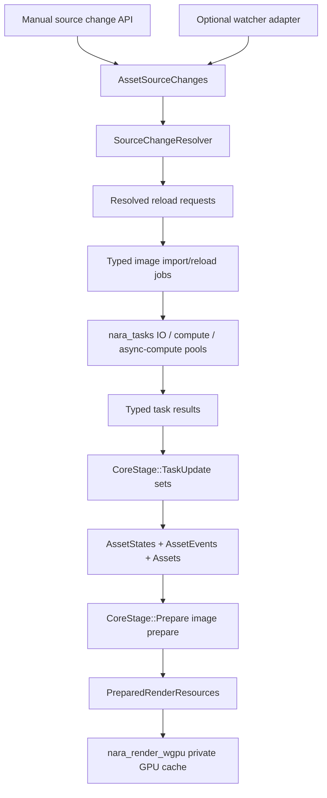
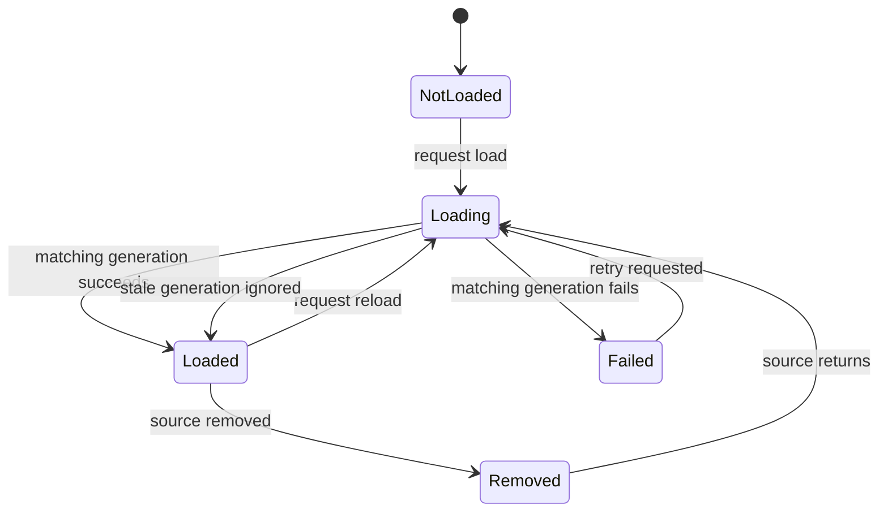

# Async Hot Reload Foundation - Plan

## Goal Capsule

| Field | Value |
|---|---|
| Objective | Implement nara's first engine-owned task execution and asset hot-reload foundation: task pools, deterministic result application, typed asset import jobs, manual reload scheduling, optional file-watcher adapter, and documentation that closes the accepted ADR 0008 follow-up questions. |
| Authority | Current AGENTS.md rules, ADR 0007, ADR 0008, ADR 0020, ADR 0024, ADR 0032, ADR 0033, ADR 0034, `docs/architecture/nara-foundation.md`, and current engineering memory. |
| Execution profile | Deep cross-crate engine foundation. Breaking changes, crate additions, API removal, and deletion of old synchronous-only shortcuts are allowed because nara is pre-1.0. |
| Stop conditions | Stop if the design requires public Tokio/async-std exposure, background tasks mutating `World` or GPU resources directly, persistent data serializing runtime task/asset/entity handles, or `notify`/`wgpu`/`winit` leaking outside their adapter crates. |
| Tail ownership | Implementation owns code, tests, docs, engineering memory, review, verification, and conventional commits. |

---

## Product Contract

### Summary

This plan adds the runtime infrastructure that lets nara load and reload assets without blocking the main world or weakening deterministic scheduling.
The first concrete flow is image import/reload, but the contract is engine-wide: tasks produce typed results, the main app applies them at a known stage, asset versions/events drive render preparation, and file watching stays behind an adapter.

### Problem Frame

nara already has stable asset identity, typed handles, load states, asset events, image import, render preparation snapshots, and wgpu texture caches.
Those pieces are currently driven by synchronous examples and direct test setup.
The missing foundation is the lifecycle between "source changed" and "main world safely observes the new asset".

If each domain crate invents its own thread, channel, watcher, stale-result rule, or render invalidation path, hot reload, editor Play Mode, WASM scripts, audio streaming, and future render threading will all diverge.
ADR 0008 already accepts engine-owned task pools with explicit main-thread integration; this slice turns that decision into code and closes the most expensive open questions.

### Requirements

**Task execution and app scheduling**

- R1. nara must provide an engine-owned task crate with IO, compute, and async-compute task classes, typed task handles, cooperative cancellation, task stats, and deterministic single-thread execution for tests/headless runs.
- R2. Background work must not receive or mutate `World`; task results must be applied only by scheduled main-thread systems.
- R3. `nara_app` must expose a canonical task-result application stage before gameplay update work observes async state.
- R4. Plugins must install task infrastructure through fallible nara plugin APIs without global Bevy task-pool exposure or panic prerequisites.

**Asset loading, import, and reload state**

- R5. `nara_asset` must own an `AssetPlugin`, asset source root, semantic source-change queue, reload request queue, load generations, and coalescing/stale-result policy.
- R6. Asset load state must transition through loading, loaded, failed, and removed states without changing stable handles or persistent asset references.
- R7. Typed importers must return typed asset payloads plus artifact metadata; image import must use the generic typed importer path instead of a private sync-only shortcut.
- R8. Async image import/reload jobs must read source bytes and import CPU-side image data through the task boundary; threaded runtime mode performs that work off the main thread, deterministic/headless mode may execute the same boundary inline, and all commits to `Assets<ImageAsset>`, `AssetStates`, and `AssetEvents` happen only on the main thread.
- R9. Failed first loads must transition to failed without inventing a last-good value; failed reloads must preserve the last good asset value and report `ReloadFailed`; stale or cancelled results must not overwrite newer asset state.

**Hot reload propagation**

- R10. Manual source-change and reload APIs must be enough to drive deterministic hot-reload tests before OS watcher behavior is involved, including a code-first image reload golden path that observes an existing handle update without restart.
- R11. Removed source assets must mark matching runtime assets removed, emit asset events, and invalidate prepared render resources through the existing render preparation seam.
- R12. Image version or descriptor changes must invalidate `PreparedRenderResources<PreparedImageResource>` and let wgpu texture caches rebuild through existing backend-private paths.
- R13. File watcher support is a required deliverable for this plan but must live in an adapter crate or optional feature that translates OS events into semantic asset source changes; it must be disabled by default and must not mutate `Assets<T>`, `AssetStates`, render resources, scene documents, or backend caches directly.

**Boundaries, docs, and AI-friendly contracts**

- R14. The root facade default features must stay backend-free and watcher-free; `winit`, `wgpu`, `egui`, `notify`, Tokio, and async-std must not leak into core gameplay-facing crates.
- R15. Scene, prefab, Play Mode, and editor documents must not be mutated by asset reload; reload affects runtime asset resources and prepared render resources only.
- R16. Architecture docs, open questions, AGENTS guidance, and engineering memory must reflect the implemented task, reload, and watcher boundaries.

### Scope Boundaries

- This slice does not implement scene or prefab file hot reload, document merge conflict handling, or Apply Changes runtime diffing.
- This slice does not implement a render thread, full RenderGraph, async plugin lifecycle, networking runtime, scripting runtime, or WASM hot code reload.
- This slice does not expose Tokio, async-std, Bevy task types, `notify` event types, or OS watcher handles as nara public runtime contracts.
- This slice does not write a complete imported artifact binary cache format; source bytes and imported payloads may remain in-memory while the async lifecycle and stale-result rules land.
- This slice does not add editor UI for reload status. Tooling models may observe status later through resources and diagnostics.
- This slice does not require flaky live OS watcher integration tests. The watcher adapter should be testable through event translation, path normalization, and debouncing inputs.

### Acceptance Examples

- AE1. Given deterministic task mode, when a task is spawned and `App::run_once` advances through the task application stage, then the result becomes visible in the expected stage order and tests are repeatable.
- AE2. Given a background task closure, there is no API path for it to borrow or mutate the ECS `World` directly.
- AE3. Given duplicate installation of task or asset plugins through plugin groups, setup remains idempotent or reports structured `PluginError` according to existing fallible plugin policy.
- AE4. Given an image asset load request, the asset state becomes loading before completion, then commits a loaded value and emits added or modified asset events on the main thread.
- AE5. Given two reload requests for the same asset where the older task finishes last, the older result is discarded and cannot overwrite the newer version.
- AE6. Given a failed image reload after a successful load, the previous image stays available, load state records failure, and a reload-failed event is emitted.
- AE7. Given a removed source asset, the corresponding runtime image asset is removed, prepared image resources are invalidated, and sprite queueing skips the missing texture without panic.
- AE8. Given a source change event for a `.meta` sidecar or source file, the watcher adapter maps it to the same semantic asset source change without importing or committing the asset itself.
- AE9. Given `MinimalPlugins`, code-first examples can rely on task and asset foundation resources without manually inserting `AssetServer` for the common path.
- AE10. Boundary searches show task and asset crates do not import `wgpu`, watcher dependencies do not leak outside watcher adapter code, and no public Tokio/async-std runtime appears.
- AE11. Given a code-first sprite app that has loaded an image asset, when the app triggers the manual source-change/reload API for that image and advances deterministic task application, the same asset handle observes the updated prepared texture without app restart or handle replacement.

---

## Planning Contract

### Assumptions

- The user has authorized proceeding without another scoping checkpoint and prefers the architecturally correct pre-1.0 break over compatibility shims.
- The first task implementation can use a nara-owned standard-library worker-pool backend with deterministic inline mode; the public API should allow a future internal swap to `bevy_tasks` or another executor without changing game code.
- The canonical async result application point should be a new `CoreStage::TaskUpdate` that runs after `First` and before `PreUpdate`.
- The first watcher adapter can use an optional `notify` dependency, but the core source-change model must be independent of `notify`.
- The initial async image import path may keep source bytes and imported artifacts in memory; real import-cache file IO can follow once task/reload lifecycle is proven.
- Before widening beyond the first image reload path, U1 and U5 must prove the executor and reload contracts through a deterministic golden path and a small threaded smoke path.

### Key Technical Decisions

- KTD1. Put task infrastructure in `nara_tasks`, not inside `nara_app`. `nara_app` owns schedule ordering; `nara_tasks` owns executors, handles, cancellation, deterministic mode, and plugin setup.
- KTD2. Add `CoreStage::TaskUpdate` as the canonical main-thread async result application boundary. It runs before gameplay update stages so input, gameplay, tooling, and render prepare see a coherent frame state.
- KTD3. Keep task results typed. `TaskHandle<T>` or typed task sets are the handoff, not type-erased world commands or closures that mutate arbitrary resources.
- KTD4. Use cooperative cancellation and load generations before hard thread interruption. A cancelled task may still finish, but its result must be discarded if the request generation no longer matches.
- KTD5. Add `AssetPlugin` to `nara_asset` and install it from `MinimalPlugins`. It owns `AssetServer`, `AssetStates`, `AssetEvents`, project database/resource roots when configured, reload queues, and common scheduling.
- KTD6. Make typed importers the durable importer contract. Artifact-only import metadata remains useful, but asset-specific importers must return typed payloads plus artifact metadata from owned import job inputs so async jobs can commit strongly typed `Assets<T>` without `Any` downcasts or string payloads.
- KTD7. Manual reload scheduling is the core hot-reload seam. File watching is an adapter that emits semantic source changes into the same queue and can be omitted on platforms or builds that do not support watching.
- KTD8. Source identity remains stable-ID-first. Paths locate source files, but stale-result checks and runtime commit behavior are anchored by reserved handles, stable IDs when known, expected asset versions, and load generations.
- KTD9. Render reload propagation stays version/event based. `nara_render_wgpu` rebuilds backend-private GPU cache entries only after `nara_render`/`nara_image` prepared-resource snapshots change.
- KTD10. Play Mode and editor documents do not own asset reload. A Play world may receive updated runtime asset resources, but reload must not mutate `SceneDocument` or bypass scene patch rules.
- KTD11. Define executor invariants before locking the first backend: task lifetime bounds, `Send + 'static` input/result rules, result polling semantics, cancellation observation, shutdown behavior, task stats guarantees, async-compute support level, and WASM/threadless constraints.
- KTD12. Define `TaskUpdate` internal system sets, not just a stage label. The initial order should distinguish task polling, source-change coalescing, asset job spawning, and asset result application so deterministic and threaded modes share one observable frame contract.
- KTD13. Add a `SourceChangeResolver` contract in `nara_asset`. Manual and watcher inputs may start as paths, but core reload scheduling resolves them through `AssetSourceRoot`, project database/meta records, and dependency graph data into stable IDs, handles, unknown/new cases, removed cases, and dependent runtime assets.
- KTD14. Use explicit typed asset registration for reload dispatch. The generic scheduler owns identity, generations, and source-change coalescing; asset-domain plugins such as image register type-specific reload systems/importers that convert resolved reload requests into typed jobs.

### High-Level Technical Design

### System-Wide Impact

- The workspace gains `nara_tasks` and likely a watcher adapter crate such as `nara_asset_watch`.
- `nara_app::CoreStage` grows a task boundary, so stage-order tests and render pipeline stage tests must be updated together.
- `nara_asset` becomes an app/plugin participant instead of only a data crate, while still keeping GPU, window, UI, and watcher implementation details out of core asset state.
- `nara_image` becomes the first typed async importer consumer and may split synchronous import helpers from scheduled import/reload systems.
- `MinimalPlugins` can initialize task and asset resources, reducing manual example setup and aligning with a productized engine default.

### Risks and Dependencies

| Risk | Mitigation |
|---|---|
| Task pool implementation becomes too large before runtime value is proven | Keep the public API narrow: task classes, handles, cancellation, deterministic mode, and stats. Avoid scoped jobs, priorities, and work stealing until a concrete need appears. Require the U5 deterministic image reload golden path before broadening watcher/facade polish. |
| Executor backend choice leaks into public contracts | Freeze U1 invariants before implementation and keep backend-specific behaviors private; if the std worker-pool prototype cannot satisfy IO, compute, async-compute, cancellation, shutdown, and WASM/threadless constraints, revise the backend before U2-U5 build on it. |
| Async tests become flaky | Require deterministic inline mode for most unit tests; use threaded mode only where completion behavior itself is being tested. |
| Typed importer refactor breaks current examples | Update examples to the new typed importer path instead of preserving private synchronous shortcuts. |
| Watcher behavior differs across platforms | Put OS watcher code in an adapter and unit-test translation/coalescing with synthetic events. Avoid live watcher tests as the proof of correctness. |
| Reload result applies to the wrong asset generation | Store request IDs/generations and expected versions; apply systems discard stale or cancelled results before touching `Assets<T>`. |
| Dependency-driven source changes leave derived assets stale | Use `SourceChangeResolver` and dependency graph records to expand source/meta/settings changes into dependent reload requests before spawning typed jobs. |
| Asset reload bypasses render prepare | Keep render cache invalidation driven by `AssetVersion` and prepared resource snapshots; do not add path-to-wgpu shortcuts. |

### Sources & Research

- Runtime concurrency ADR: `docs/architecture/adr/0008-runtime-concurrency-and-task-pools.md`
- Asset identity ADR: `docs/architecture/adr/0007-asset-identity-and-import-pipeline.md`
- Determinism ADR: `docs/architecture/adr/0024-determinism-fixed-update-and-replay-policy.md`
- Asset/render preparation ADR: `docs/architecture/adr/0033-asset-import-and-render-resource-preparation-seam.md`
- Play Mode boundary ADR: `docs/architecture/adr/0034-editor-play-mode-world-boundary.md`
- Current state memory: `docs/knowledge/engineering/current-state.md`
- Foundation hardening memory: `docs/knowledge/engineering/progress/2026-07-09-foundation-hardening.md`
- Bevy task-pool reference: `repo-ref/bevy/crates/bevy_app/src/task_pool_plugin.rs`, `repo-ref/bevy/crates/bevy_tasks/src/usages.rs`
- Bevy asset watcher reference: `repo-ref/bevy/crates/bevy_asset/src/io/file/file_watcher.rs`
- Godot threaded resource loading reference: `repo-ref/godot/core/io/resource_loader.h`, `repo-ref/godot/core/object/worker_thread_pool.h`

---

## Implementation Units

### U1. Add `nara_tasks` task runtime foundation

- **Goal:** Introduce nara-owned task pools, typed handles, cooperative cancellation, deterministic mode, stats, and plugin setup.
- **Requirements:** R1, R2, R4, R14.
- **Dependencies:** None.
- **Files:** `Cargo.toml`, `crates/nara_tasks/Cargo.toml`, `crates/nara_tasks/src/lib.rs`, `src/lib.rs`, `AGENTS.md`.
- **Approach:** Create `nara_tasks` with `TaskPoolKind`, `TaskPoolConfig`, `TaskExecutionMode`, `TaskPools`, `TaskHandle<T>`, `TaskCancellationToken`, `TaskStats`, and `TaskPlugin`. First pin the executor invariants from KTD11 in tests and docs, then implement deterministic inline execution for tests and a bounded worker-pool backend for threaded mode. Keep the public API closure/result based, `Send + 'static` at the task boundary, and nara-owned; do not expose Tokio, async-std, or Bevy task types.
- **Patterns to follow:** `crates/nara_app/src/lib.rs` plugin resource initialization; `docs/architecture/adr/0008-runtime-concurrency-and-task-pools.md`; Bevy task pool class split in `repo-ref/bevy/crates/bevy_tasks/src/usages.rs`.
- **Test Scenarios:** Deterministic mode returns a typed task result only through the handle; threaded mode completes an IO task; compute and async-compute task classes update stats separately or explicitly document async-compute as an alias/placeholder if no separate executor lands in this slice; cancellation token marks a task cancelled and returned result is observable as cancelled/stale by the caller; dropping `TaskPools` joins or shuts down workers without panic; no task API accepts `World`; one IO job and one async-compute-style job exercise the same public polling contract.
- **Verification:** `cargo nextest run -p nara_tasks`; `cargo check -p nara_tasks`; boundary search for public Tokio/async-std symbols.
- **Execution note:** Start with tests for deterministic mode and cancellation because those define the safety contract.

### U2. Add a canonical app task application stage

- **Goal:** Make async result application part of app lifecycle instead of an ad hoc plugin convention.
- **Requirements:** R2, R3, R4.
- **Dependencies:** U1.
- **Files:** `crates/nara_app/src/lib.rs`, `crates/nara_tasks/src/lib.rs`, `src/lib.rs`, examples under `examples/` that assert stage order.
- **Approach:** Add `CoreStage::TaskUpdate` after `First` and before `PreUpdate`. Add named ordering sets inside the stage, such as `TaskUpdateSet::Poll`, `TaskUpdateSet::CoalesceAssetChanges`, `TaskUpdateSet::SpawnAssetJobs`, and `TaskUpdateSet::ApplyAssetResults`, so plugins register explicit before/after relationships instead of relying on insertion order. Define whether each frame drains a frame-start snapshot or all currently completed task results, and the stable ordering key used when multiple results are ready. Keep `FixedUpdate` untouched so deterministic simulation still runs after async apply.
- **Patterns to follow:** Existing `CoreStage::ALL` ordering tests in `crates/nara_app/src/lib.rs`; render stage order tests.
- **Test Scenarios:** Stage order includes `TaskUpdate` between `First` and `PreUpdate`; named `TaskUpdateSet` ordering is deterministic; a result applied in `TaskUpdate` is visible to an `Update` system in the same frame; multiple ready results apply in a stable order that deterministic and threaded modes both honor; duplicate `TaskPlugin` installation through plugin groups is safe; adding task plugin after finish returns structured plugin error.
- **Verification:** `cargo nextest run -p nara_app -p nara_tasks -p nara`; `cargo check --workspace`.

### U3. Introduce asset plugin, source root, and reload scheduler state

- **Goal:** Give asset loading/reload a canonical resource and scheduling model independent from image-specific code.
- **Requirements:** R5, R6, R9, R10, R15.
- **Dependencies:** U1, U2.
- **Files:** `crates/nara_asset/Cargo.toml`, `crates/nara_asset/src/lib.rs`, `crates/nara_asset/src/state.rs`, `crates/nara_asset/src/server.rs`, new `crates/nara_asset/src/reload.rs`, `src/lib.rs`, `examples/asset_import_texture.rs`, `examples/windowed_sprites.rs`.
- **Approach:** Add `AssetPlugin` that installs `TaskPlugin` if missing and initializes `AssetServer`, `AssetStates`, `AssetEvents`, `AssetSourceChanges`, resolved reload request queues, load-generation tracking, `SourceChangeResolver`, and optional `AssetSourceRoot`. Define manual source-change APIs for modified, removed, and meta-changed source assets. Resolve path-level inputs through source roots, project database/meta records, and dependency graph data before typed asset plugins spawn jobs. Coalesce same-asset changes within the queue and store runtime-only generation/request IDs outside serialized asset state.
- **Patterns to follow:** Existing `AssetStates`, `AssetEvents`, `Assets<T>::commit_reload`, and `ProjectAssetDatabase` validation; plugin idempotency from `MinimalPlugins`.
- **Test Scenarios:** `AssetPlugin` initializes common resources; `MinimalPlugins` includes asset/task foundation resources; manual modified source change creates one resolved reload intent for duplicate same-frame events; `.meta` or settings changes can enqueue dependent reloads through dependency records; removed source change records a removal intent; unknown/new source paths are represented explicitly instead of guessed; `AssetSourceRoot` rejects source paths outside the configured root; load generation increments on each reload request and stale generation checks fail closed.
- **Verification:** `cargo nextest run -p nara_asset -p nara_app -p nara`; `cargo check --workspace --features serde`.
- **Execution note:** Prefer a small runtime-only generation model over changing persistent `LoadState` into a request-ID serialization format.

### U4. Convert importers to typed payload results

- **Goal:** Make async asset import strongly typed so task results can commit without type erasure or image-only shortcuts.
- **Requirements:** R7, R8, R14.
- **Dependencies:** U3.
- **Files:** `crates/nara_asset/src/import.rs`, `crates/nara_asset/src/lib.rs`, `crates/nara_image/src/lib.rs`, `examples/asset_import_texture.rs`, `examples/windowed_sprites.rs`, tests in `crates/nara_asset/src/import.rs` and `crates/nara_image/src/lib.rs`.
- **Approach:** Introduce a typed importer contract such as `TypedImporter<T>` and `ImportedAsset<T>` that carries the typed asset value, source hash, artifact record, dependency digest, settings hash, and profile. Add an owned async job input, such as `ImportJobInput`, that owns `AssetRecord`, source bytes, dependency/settings/profile data, and any task-safe import options; worker tasks may construct borrowed `ImportRequest<'_>` values inside the job. Move `ImageImporter` onto this contract. Remove or narrow artifact-only import APIs if they no longer represent the core path.
- **Patterns to follow:** Current `ImporterRegistry`, `ImportRequest`, `ImageImportedAsset`, and `ImageImporter::import_image` behavior.
- **Test Scenarios:** A mock typed importer registers and imports a non-image test asset; async import jobs capture only owned `Send + 'static` inputs; duplicate importer IDs/extensions still fail; `ImageImporter` returns typed image payload plus artifact metadata through the generic contract; examples no longer need a private image-only import function; import failure remains structured and diagnostics-friendly.
- **Verification:** `cargo nextest run -p nara_asset -p nara_image`; `cargo run -q --example asset_import_texture`; `cargo check --workspace`.
- **Execution note:** Characterize the current image-only path first, then replace it with the typed contract rather than layering a second import path beside it.

### U5. Implement async image load and reload jobs

- **Goal:** Prove the task/reload foundation with real image asset jobs and main-thread commit semantics.
- **Requirements:** R6, R8, R9, R10, R12.
- **Dependencies:** U1, U2, U3, U4.
- **Files:** `crates/nara_image/src/lib.rs`, possible new `crates/nara_image/src/import.rs` and `crates/nara_image/src/reload.rs`, `crates/nara_asset/src/reload.rs`, tests in `crates/nara_image/src/lib.rs`, `examples/asset_import_texture.rs`, `examples/windowed_sprites.rs`.
- **Approach:** Add or rename a public image-domain plugin, such as `ImagePlugin` or `ImageAssetPlugin`, that registers `ImageImporter`, initializes `Assets<ImageAsset>` and pending image job resources, installs request-to-job and result-apply systems into explicit `TaskUpdateSet`s, and keeps `prepare_images` in `CoreStage::Prepare`. Image load/reload systems consume resolved image reload requests, spawn file IO/import jobs through `TaskPools` with owned job inputs, store pending typed handles, and apply completed results in `CoreStage::TaskUpdate`. Successful completion commits through `Assets<ImageAsset>::commit_loaded` or `commit_reload`; failed first load records failed state without a last-good asset; failed reload calls `record_reload_failure`; stale/cancelled completion is discarded without mutation.
- **Patterns to follow:** Existing image import tests, `Assets<T>::commit_reload`, stale prepare-result tests in `nara_render`.
- **Test Scenarios:** New image load request enters loading state; successful async load commits image value and emits added event; failed first load transitions to failed without a loaded asset; successful reload increments version and emits modified event; failed reload keeps last good image and emits reload failed; older completion after newer reload is discarded; cancelled pending reload result is discarded; the code-first image hot-reload golden path updates an existing handle without restart; deterministic mode can execute the full flow in one or two `run_once` calls without sleeping.
- **Verification:** `cargo nextest run -p nara_image -p nara_asset -p nara_tasks -p nara`; `cargo run -q --example asset_import_texture`; `cargo check --workspace --features serde`.
- **Execution note:** Use deterministic task mode for most proof-first tests; reserve threaded tests for a small task-runtime smoke case.

### U6. Propagate hot reload removal and render prepare invalidation

- **Goal:** Ensure reload state changes reach prepared render resources and sprite queueing without backend shortcuts.
- **Requirements:** R11, R12, R15.
- **Dependencies:** U5.
- **Files:** `crates/nara_image/src/lib.rs`, `crates/nara_render/src/prepare.rs`, `crates/nara_sprite_render/src/queue.rs`, `crates/nara_sprite_render/src/tests.rs`, `crates/nara_render_wgpu/src/texture.rs`, tests in affected crates.
- **Approach:** Keep invalidation driven by `AssetVersion`, `LoadState`, descriptor hash, and `AssetEvents`. Removed images should remove prepared resources through `RenderPrepareInvalidations`. Sprite queueing should treat missing or non-loaded textures as skipped/missing asset stats, not panic. Wgpu cache pruning remains backend-private and keyed by prepared resource snapshots.
- **Patterns to follow:** Existing `prepare_images` removal logic, `PreparedRenderResources::invalidate_if_snapshot_changed`, `WgpuSpriteTextureCache` version-keyed behavior.
- **Test Scenarios:** Async-applied image reload changes prepared image snapshot; removed image asset produces `RenderPrepareInvalidationReason::AssetRemoved`; sprite queue skips removed/non-loaded texture and records missing texture asset stats; wgpu texture cache rebuilds for changed prepared snapshot and prunes removed resource keys without importing source paths.
- **Verification:** `cargo nextest run -p nara_image -p nara_render -p nara_sprite_render -p nara_render_wgpu`; `cargo check -p nara --features winit,wgpu --example windowed_sprites`; backend boundary searches for `wgpu`.

### U7. Add optional asset file watcher adapter

- **Goal:** Connect OS file events to nara's semantic source-change queue without making file watching a core dependency.
- **Requirements:** R10, R13, R14.
- **Dependencies:** U3.
- **Files:** `Cargo.toml`, new `crates/nara_asset_watch/Cargo.toml`, `crates/nara_asset_watch/src/lib.rs`, `src/lib.rs`, `AGENTS.md`, tests in `crates/nara_asset_watch/src/lib.rs`.
- **Approach:** Add a required-in-this-plan but optional-at-runtime watcher adapter crate that owns `notify` imports and maps source-file, `.meta`, remove, rename, and modify events into `AssetSourceChanges`. Keep the adapter disabled by default and expose it through an explicit facade feature. Unit-test translation, debouncing, path normalization, root rejection, and handoff into `SourceChangeResolver` with synthetic events; avoid relying on live OS watcher timing as the core proof. After U5, add only a smoke path proving watcher-produced semantic events can feed the same image reload queue, without coupling watcher correctness to image decoding.
- **Patterns to follow:** `nara_winit` and `nara_render_wgpu` optional adapter crate boundaries; Bevy watcher feature separation in `repo-ref/bevy/crates/bevy_asset/Cargo.toml`.
- **Test Scenarios:** Source file modify maps to modified source change; `.meta` modify maps to the matching source asset change; remove maps to removed source change; rename old/new path becomes remove plus modify or equivalent semantic sequence; outside-root path is rejected before scheduling reload; dependency search shows `notify` only in the watcher adapter and root manifest feature wiring.
- **Verification:** `cargo nextest run -p nara_asset_watch -p nara_asset`; `cargo check -p nara --features asset-watch`; dependency boundary search for `notify`.

### U8. Update docs, open questions, examples, and engineering memory

- **Goal:** Keep durable architecture guidance aligned with the new task and reload contracts.
- **Requirements:** R16.
- **Dependencies:** U1-U7.
- **Files:** `AGENTS.md`, `docs/architecture/adr/0003-own-app-plugin-and-schedule-lifecycle.md`, `docs/architecture/adr/0007-asset-identity-and-import-pipeline.md`, `docs/architecture/adr/0008-runtime-concurrency-and-task-pools.md`, `docs/architecture/adr/0024-determinism-fixed-update-and-replay-policy.md`, `docs/architecture/adr/0033-asset-import-and-render-resource-preparation-seam.md`, `docs/architecture/open-questions.md`, `docs/architecture/nara-foundation.md`, `docs/knowledge/engineering/current-state.md`, new memory files under `docs/knowledge/engineering/progress/` and `docs/knowledge/engineering/verification/`.
- **Approach:** Record that task pools live in `nara_tasks`, `TaskUpdate` is the canonical apply stage with named internal sets, cancellation is cooperative/generation-based, import jobs capture owned task inputs, plugins access task pools through resources, watcher code is adapter-owned, and networking/scripting runtime remains deferred. Update examples so common asset setup uses `MinimalPlugins`/`AssetPlugin` and installs the image-domain plugin through the chosen facade/default plugin boundary. Add or update a code-first image hot-reload example or doc snippet that demonstrates manual source-change triggering, deterministic task advancement, stable handle reuse, and prepared texture refresh.
- **Patterns to follow:** Foundation hardening memory and ADR implementation-note style.
- **Test Scenarios:** Test expectation: none for docs-only behavior, but examples referenced by docs must compile or run.
- **Verification:** engineering memory validation; stale-contract searches for old fallible plugin examples, missing task-stage guidance, public Tokio mentions, and watcher leakage.

### U9. Final review, simplification, and verification

- **Goal:** Land the full slice with no abandoned code, no dependency leaks, and clear residuals.
- **Requirements:** R1-R16.
- **Dependencies:** U1-U8.
- **Files:** All files changed by U1-U8.
- **Approach:** Run simplification across task/reload/watcher code after the feature path is green. Run code review, fix eligible findings, and record any residual follow-up only when it is outside this plan's scope. Keep commits focused by completed unit or tightly related unit cluster.
- **Patterns to follow:** Previous foundation hardening verification memory and repo Rust workflow.
- **Test Scenarios:** No new behavior beyond the verification contract; review fixes may add targeted regression tests if findings identify gaps.
- **Verification:** Full Verification Contract and Definition of Done.

---

## Verification Contract

| Gate | Coverage |
|---|---|
| `cargo fmt --all` | Formatting for all Rust changes. |
| `cargo check --workspace` | Default feature compile across all crates. |
| `cargo check --workspace --features serde` | Persistent-data and debug serde paths stay valid. |
| `cargo nextest run --workspace` | Full regression suite, including task, asset, image, render, watcher, and facade tests. |
| `cargo check -p nara --features winit,wgpu --example windowed_clear` | Platform/render example remains intact. |
| `cargo check -p nara --features winit,wgpu --example windowed_sprites` | Textured sprite example compiles after async asset setup changes. |
| `cargo run -q --example asset_import_texture` | Code-first asset import/prepare path still executes. |
| `cargo check -p nara --features asset-watch` | Watcher adapter facade wiring compiles while remaining disabled from default features. |
| `rg -n "tokio::|tokio =|async_std::|async-std =" crates src Cargo.toml` | Public runtime does not expose or depend on Tokio/async-std unless a future adapter explicitly owns it. |
| `rg -n "notify::|notify-debouncer|notify =" crates src Cargo.toml` | Watcher dependency is isolated to watcher adapter crate and optional facade wiring. |
| `rg -n "wgpu::|wgpu =" crates src Cargo.toml` | GPU dependency remains in `nara_render_wgpu` and root optional feature metadata. |
| `rg -n "winit::|winit =" crates src Cargo.toml` | Window backend dependency remains in `nara_winit` and root optional feature metadata. |
| `rg -n "egui::|egui =" crates src Cargo.toml` | egui remains in tooling adapter and optional facade metadata. |
| serialization leak search for runtime `Entity`, runtime `AssetId`, `AssetEvent`, `Handle<T>`, and task handles | Project data must not persist runtime-only identities. |
| engineering memory validation | New progress/verification memory is valid and portable. |
| `git diff --check` | No whitespace or patch hygiene issues. |

---

## Definition of Done

- All implementation units U1-U9 are complete or any deferred residual is explicitly outside the Product Contract scope.
- `nara_tasks` exists, is facade-exported, and provides deterministic and threaded task execution through nara-owned APIs.
- `CoreStage::TaskUpdate` exists, has named internal sets for task/result work, and its ordering relative to `First`, `PreUpdate`, `FixedUpdate`, `Update`, and render stages is tested.
- `MinimalPlugins` installs task and asset foundation resources without backend or watcher dependencies.
- Image assets can load/reload through typed async tasks and main-thread commit systems.
- Image reload has a code-first deterministic golden path that updates an already-loaded handle without app restart.
- Stale, cancelled, failed, and removed reload paths are tested and do not mutate the wrong asset generation.
- Render prepare invalidation responds to async reload/removal through existing asset version and prepared-resource snapshot mechanisms.
- Watcher support is implemented as an adapter-owned optional feature, disabled by default, and tested through semantic event translation rather than direct asset mutation.
- Boundary searches show no leakage of `notify`, Tokio/async-std, `wgpu`, `winit`, or `egui` into core gameplay/runtime crates.
- Architecture docs, ADRs, open questions, AGENTS guidance, and engineering memory describe the implemented task/reload contracts.
- Final code review and simplification gates have run, eligible findings are fixed, and abandoned experimental code is removed before the final commit.
