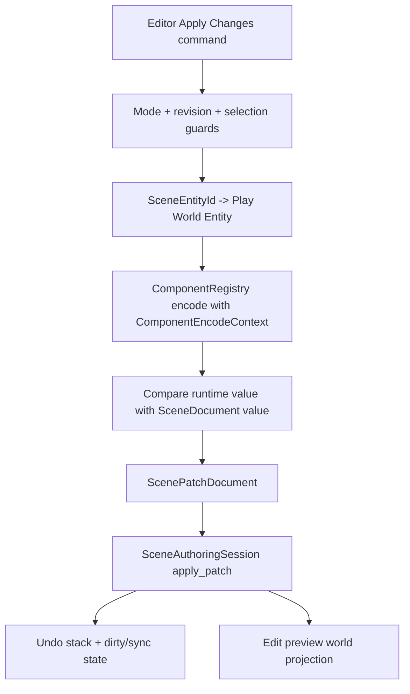
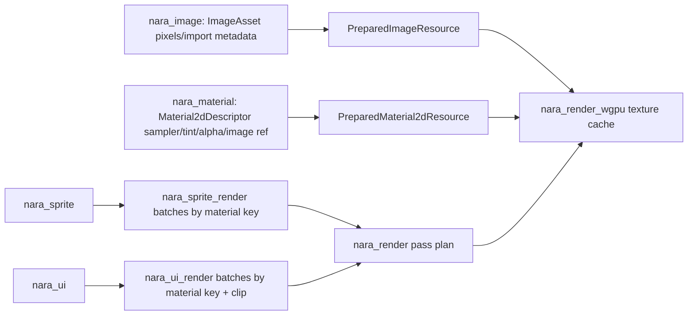
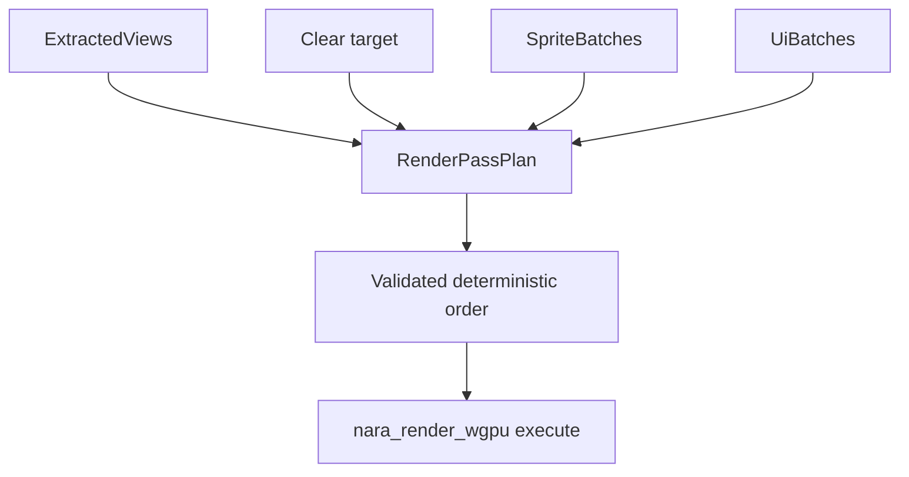

# Render UI Apply Foundation - Plan

## Goal Capsule

| Field | Value |
|---|---|
| Objective | Implement the next high-refactor-cost foundation layer for nara: real Play Mode Apply Changes for a narrow patchable subset, material/sampler authoring above images, a nara-owned runtime UI foundation, and the first render pass plan / graph-ready forcing case. |
| Authority | Current AGENTS.md rules, ADR 0015, ADR 0017, ADR 0025, ADR 0026, ADR 0031, ADR 0032, ADR 0033, ADR 0034, `docs/architecture/nara-foundation.md`, `docs/architecture/open-questions.md`, and current engineering memory. |
| Execution profile | Deep cross-crate engine foundation. Breaking changes, crate additions, public API reshaping, and deletion of obsolete direct-image/single-pass shortcuts are allowed because nara is pre-1.0. |
| Stop conditions | Stop if the design requires shared edit/play `World` identity, runtime IDs in persistent data, `wgpu`/`winit`/egui leaks outside adapter crates, UI depending on editor tooling, material authoring embedded in `ImageAsset`, or gameplay-facing code authoring render graph nodes. |
| Tail ownership | Implementation owns code, tests, docs, engineering memory, review, verification, and conventional commits. |

---

## Product Contract

### Summary

This plan turns four accepted but still-open foundation decisions into working code.
Apply Changes becomes an explicit patch-producing operation instead of a guard-only status report.
Image assets stop owning sampler/material policy.
nara gains the first ECS runtime UI domain and a UI render path.
The renderer gains a deterministic pass plan that can execute sprites and UI in a graph-ready order without exposing render graph authoring to game code.

The key product value is not only more visible features.
It is locking the expensive boundaries before the engine grows: editor/runtime persistence, asset/material/render preparation, UI-as-data, and multi-pass rendering.

### Problem Frame

nara already has strong lower layers: `bevy_ecs` substrate, nara-owned app/plugins, scene/prefab documents, schema-aware patches, isolated Play worlds, asset import/reload, image preparation, sprite/tilemap batching, and a wgpu adapter.

The remaining sharp edges are the places mature engines tend to pay for early shortcuts:

- Play Mode can fork a runtime world, but changes cannot yet be intentionally applied back to the authoring document.
- `ImageAsset` currently carries sampler state, so texture upload is starting to look like the material system.
- Runtime UI is accepted as nara-owned, but no ECS data/layout/render boundary exists yet.
- wgpu still effectively owns a hardcoded clear + sprite draw loop; UI, offscreen targets, post-processing, and editor viewports will become painful if pass ordering is not made explicit now.

This slice should be allowed to be larger than a minimal feature patch.
The goal is to make the next 2D/UI/editor/3D work additive instead of forcing a later rewrite of scene data, render batches, texture caches, and Play Mode semantics.

### Requirements

**Apply Changes and authoring safety**

- R1. `SceneEditorState` must expose a real Apply Changes operation for a narrow, explicit subset: selected scene entity plus explicitly requested registered component IDs from the isolated Play world.
- R2. Apply Changes must reject not-in-play, paused-without-play-world, source revision mismatch, missing scene entity mapping, unsupported prefab-expanded entities, unsupported/non-serializable components, and failed patch validation with structured diagnostics and no document mutation.
- R3. Supported Apply Changes must generate a `ScenePatchDocument`, apply it through `SceneAuthoringSession`, enter normal undo history, and rebuild/sync the edit preview using existing authoring paths.
- R4. Apply Changes must never serialize runtime `Entity`, runtime `AssetId`, backend handles, task handles, GPU resources, timers, events, or runtime-only components into scene/prefab/patch documents.
- R5. Apply Changes reports must be useful to future UI/CLI confirmation flows: per requested component, report requested/applied/no-op/rejected status, rejection reason, and patch operation summary.
- R6. Empty/no-op Apply Changes must report a supported no-op rather than an error, and must not create an undo entry.

**Material and sampler authoring**

- R7. Sampler and alpha/material intent must move out of `ImageAsset` into a backend-neutral material domain that can serve sprites, tilemaps, UI images, and future 3D materials.
- R8. `ImageAsset` and `PreparedImageResource` must describe image content and import identity only: extent, format, color space, source/artifact hashes, and pixels. Changing sampler policy must not require image reimport.
- R9. Sprite/tilemap/UI extraction and batching must group by material-relevant render keys, not just image texture keys.
- R10. wgpu texture/image caches must remain backend-private and consume backend-neutral prepared image/material descriptors; gameplay/domain crates must not import `wgpu`.

**Runtime UI foundation**

- R11. Add a nara-owned ECS UI domain with declarative components for UI roots, nodes, style/layout intent, computed layout, focus/interaction state, images/panels, z/order, clipping, and target views.
- R12. UI layout results are runtime cache/projection data and must not be serialized as authoring truth.
- R13. The first UI slice must support colored panels and image panels through the same material/image prepare seam as sprites. Text shaping and font atlas work remain separate `nara_text` follow-up scope.
- R14. UI input/focus must have an engine-owned data boundary, even if the first behavior is limited to pointer hit testing, hover/pressed state, and focus ownership.
- R15. UI authoring components should be inspectable/serializable where practical through `nara_reflect`, and must not depend on egui, dear-imgui, winit, or wgpu.

**Render pass plan / graph readiness**

- R16. `nara_render` must own a backend-neutral pass plan that expresses per-view target, clear, sprite, UI, and future pass ordering. The first implementation may remain static, but it must have deterministic ordering and cycle/invalid-dependency tests if dependencies are modeled.
- R17. `nara_render_wgpu` must consume the pass plan and execute sprite/UI work from backend-neutral batches instead of hardcoding all pass order inside one monolithic backend loop.
- R18. Runtime UI must be the concrete second render use case that justifies pass-plan work. Do not expose public gameplay-facing render graph authoring APIs in this slice.
- R19. The root `nara` facade default feature set must stay backend-free; optional `winit`, `wgpu`, `asset-watch`, and tooling features must remain isolated.

**Docs and continuity**

- R20. Architecture docs, ADR implementation notes, open questions, AGENTS guidance, examples, and engineering memory must describe the new Apply Changes, material/sampler, runtime UI, and pass-plan contracts.
- R21. Obsolete code paths and names that imply images own material/sampler policy or that Apply Changes is permanently unsupported must be removed rather than compatibility-wrapped.

### Scope Boundaries

- This slice does not implement whole-scene runtime diffing, automatic write-back on Stop Play, or merge UI for edit-while-playing conflicts.
- This slice does not implement prefab override apply-back. Runtime changes to prefab-expanded entities should return diagnostics until a patch-to-prefab-override subset is designed.
- This slice does not implement a full Bevy-style render world, public material shader trait, shader graph, post-processing stack, 3D renderer, or render-thread split.
- This slice does not implement production text shaping, font import, glyph atlas management, rich widgets, scroll containers, accessibility, keyboard navigation, or editor dogfooding of runtime UI.
- This slice does not require live browser/mobile/WASM UI delivery. Desktop examples and headless tests are sufficient.
- This slice does not make egui/dear-imgui the runtime UI foundation. Existing tooling adapters can continue to use egui.

### Acceptance Examples

- AE1. Given a Play world spawned from revision A, when the edit document is still at revision A and a selected entity's registered `Transform2d` component changes in Play, Apply Changes returns a `ScenePatchDocument`, applies it through `SceneAuthoringSession`, records undo, and the edit preview reflects the change.
- AE2. Given the edit document changes after Play starts, Apply Changes rejects with a revision-mismatch diagnostic and does not modify the document or undo stack.
- AE3. Given a selected runtime entity has a runtime-only component with no registered serializable codec, Apply Changes reports that component unsupported and does not best-effort serialize it.
- AE4. Given a selected entity belongs to an expanded prefab source, Apply Changes reports prefab apply-back unsupported and does not write whole-component override maps.
- AE5. Given a supported selected component has no changed persistent value, Apply Changes reports supported no-op and creates no undo transaction.
- AE6. Given sampler mode changes for a sprite or UI image material, the prepared image resource does not change, but sprite/UI batching and wgpu bind-group selection observe a distinct material/sampler key.
- AE7. Given a colored sprite, textured sprite, tilemap cell, colored UI panel, and image UI panel in one view, render queueing produces deterministic pass order and batches split by phase and material key.
- AE8. Given a UI tree with a root targeting the primary camera/window, layout systems compute rectangles without serializing computed layout fields into scene documents.
- AE9. Given a pointer position over two overlapping UI nodes, hit testing chooses the top eligible node, updates hover/focus resources, and does not require egui/winit types in `nara_ui`.
- AE10. Given `MinimalPlugins`, the root facade does not pull `winit`, `wgpu`, egui, or notify into the default dependency tree.
- AE11. Boundary searches show `wgpu` only in `nara_render_wgpu`, `winit` only in `nara_winit`, egui only in tooling adapter paths, and runtime IDs do not appear in persistent scene/prefab/patch output.

---

## Planning Contract

### Assumptions

- The user has explicitly authorized proceeding without another scoping checkpoint and prefers architecturally correct pre-1.0 breaking changes over compatibility shims.
- The first Apply Changes subset should favor correctness and explainability over breadth. Whole-scene diffing is deferred because it would make prefab, runtime-only component, and asset-reference semantics ambiguous too early.
- Runtime UI should start as an engine domain and rendering consumer, not as a full widget framework.
- A `taffy`-backed internal layout adapter is acceptable for the first UI layout engine only after an adapter spike proves that nara-owned style values can map to taffy roots/nodes, produce deterministic rectangles, support clipping and hit-test order, and avoid leaking taffy types through public APIs. If that spike fails, the first slice lands a clearly-scoped absolute/fixed layout subset behind the same nara API.
- Bevy/Godot are references, not upstream contracts. nara should copy their durable boundary lessons, not their entire runtime model.

### Key Technical Decisions

- KTD1. Implement Apply Changes as selected-entity / explicit-component patch export. The bridge is `SceneEntityId`, `SceneEntityMap`, `ComponentRegistry`, `ComponentEncodeContext`, and `ScenePatchDocument`; runtime `Entity` values never cross the authoring boundary.
- KTD2. Use canonicalized component encoding plus document comparison for the first Apply Changes subset. Canonicalize document values through the registered schema/migration/default path before comparing them with Play world encoded values, use a stable `AssetRefExportPolicy`, and only compare explicitly requested component fields. Use exact `ComponentValue` equality unless a component owner registers a more specific comparison policy later.
- KTD2a. Prefer schema-aware field patches for requested fields. Use `ReplaceComponent` only when the whole component was explicitly requested and replacement cannot overwrite unrequested fields. Unsupported values become diagnostics.
- KTD3. Keep prefab-expanded apply-back unsupported in this slice. The correct future model is `ScenePatchDocument` overrides relative to source prefab IDs, not direct mutation of expanded runtime entities.
- KTD4. Treat Apply Changes success as an ordinary authoring transaction. It must use `SceneAuthoringSession::apply_patch*`, produce inverse patches for undo, and mark the live projection dirty/synced through existing session behavior.
- KTD5. Split material/sampler intent from image content. `nara_image` owns pixels/import identity; a new backend-neutral material domain owns sampler, alpha, tint, and image references used by sprite/UI renderers.
- KTD5a. The first persistent material identity is a serializable inline `Material2dDescriptor`. Sprites, tilemaps, and UI store that descriptor or a thin domain wrapper around it; GPU/prepare keys are derived from the canonical descriptor plus dependent asset versions. Asset-backed reusable material handles, project material files, and custom shader materials are deferred.
- KTD6. Start with a standard 2D material descriptor rather than a public custom shader trait. Bevy's `Material2d` trait is useful prior art, but nara should first stabilize data-driven material identity, batching, and render-resource preparation before exposing user shader specialization.
- KTD7. Model UI like sprites: authoring crate, render extraction crate, backend adapter. `nara_ui` owns ECS UI data/layout/input state; `nara_ui_render` owns extracted UI items, queueing, sorting, clipping, and batching; `nara_render_wgpu` owns GPU buffers/pipelines.
- KTD8. Keep text out of the first UI implementation. `nara_text` remains the accepted follow-up domain for shaping, fonts, glyph atlases, and world/UI shared text rendering.
- KTD9. Make pass planning backend-neutral and view-driven. Game code authors cameras, sprites, tilemaps, and UI; `nara_render` builds a pass plan from extracted views/phases/batches; wgpu executes the plan.
- KTD9a. U8 starts with a falsification gate: prove the existing phase labels alone cannot provide the shared backend-neutral clear/world/UI/gizmo ordering needed by sprites plus UI without hardcoding that order in wgpu. If this cannot be shown, land only a narrower phase execution plan and defer fuller graph concepts until multi-target or cross-pass resource dependencies arrive.
- KTD10. Change default 2D phase order to render world content first, runtime UI next, and debug/editor gizmos last. This keeps gameplay UI above world content while leaving a later editor overlay path able to draw on top.
- KTD10a. UI layout uses top-left-origin logical UI pixels for authoring and computed rectangles. The first root resolves its extent from the target viewport; supported units are `px`, `percent`, and `auto` where the chosen layout adapter supports them. Rendering converts computed UI rectangles to clip space at extraction/queue time, and hit testing uses the same computed rectangles.
- KTD10b. First-slice pointer interaction is deterministic: hover is the top eligible hit node each frame; primary pointer down captures `pressed` and moves focus to the top focusable hit; pointer up/cancel, target removal, hidden nodes, or zero-size layout clear invalid pressed/hover/focus state according to tests.
- KTD11. Keep render graph public surface narrow. This slice may introduce `RenderPassPlan`, labels, nodes, dependencies, and validation, but it must not require users to author graph nodes for sprites or UI.
- KTD12. Use examples as product probes. `windowed_sprites` should still be the 2D texture smoke test; add a compact runtime UI example that shows colored/image panels without relying on editor tooling, and back it with headless layout/queue/pass-order assertions so the probe proves behavior, not only compilation.

### High-Level Technical Design

The diagrams below are intentionally non-prescriptive sketches. Implementation should follow existing crate patterns and may rename types as needed while preserving the boundaries.

### System-Wide Impact

- The workspace gains material and UI/domain render crates, likely `nara_material`, `nara_ui`, and `nara_ui_render`.
- `nara_image` loses sampler ownership. Existing tests and examples that construct `ImageAsset` must be updated to the new image-content constructor.
- `nara_sprite`, `nara_tilemap`, `nara_sprite_render`, and `nara_render_wgpu` must migrate from texture-key batching to material-aware batching.
- `nara_tooling` Apply Changes grows from guard-only report to patch-producing and patch-applying APIs, with new diagnostics and no-op semantics.
- `nara_render` grows pass-plan data and validation. wgpu backend code should become smaller at the pass-order boundary, not larger.
- Root facade exports should keep default features backend-free while exposing new domain crates through appropriate preludes/features.
- Docs and memory must be updated because AGENTS currently states Apply Changes is guard-only and sprite rendering consumes image-backed texture batches.

### Risks and Dependencies

| Risk | Mitigation |
|---|---|
| Apply Changes accidentally becomes whole-world export | Keep the API selection-scoped: one selected `SceneEntityId` plus explicit component IDs. Tests should assert unrelated runtime changes are ignored. |
| Apply Changes serializes runtime-only identities | Use `ComponentEncodeContext`, `AssetRefExportPolicy`, registry codecs, and leak searches. Reject unsupported components instead of stringifying runtime state. |
| Prefab apply-back is guessed incorrectly | Reject prefab-expanded entity apply-back in this slice and document the future override-patch model. |
| Material scope explodes into shader graph work | Land only standard 2D material descriptors, sampler/alpha/tint/image identity, prepare invalidation, and batching. Defer custom shader traits/material graphs. |
| Removing sampler from `ImageAsset` breaks many tests | Treat this as an intentional pre-1.0 break and update tests/examples to assert image-content purity. |
| Runtime UI layout becomes too broad | Start with roots, nodes, panels/images, clipping, layout adapter, computed rectangles, and hit testing. Defer widgets, text, scrolling, accessibility, and keyboard navigation. |
| A layout dependency leaks into public API | Hide `taffy` or any layout engine behind nara-owned style/layout types and tests. |
| Render pass plan is either too weak or too abstract | Make it strong enough to order clear, sprite, UI, and gizmo phases per view, with validation tests; do not expose user-authored graph nodes yet. |
| wgpu pass execution regresses sprite rendering | Keep `windowed_sprites` compiling and preserve `SpriteBatches`-style backend-neutral inputs, only expanding batch keys and pass execution. |

### Sources & Research

- Apply Changes and Play Mode: `docs/architecture/adr/0034-editor-play-mode-world-boundary.md`, `crates/nara_tooling/src/play.rs`, `crates/nara_scene/src/authoring.rs`, `crates/nara_scene/src/patch.rs`.
- Patch and undo model: `docs/architecture/adr/0026-editor-command-patch-and-undo-model.md`, `crates/nara_tooling/src/inspector.rs`.
- Runtime UI decision: `docs/architecture/adr/0025-runtime-ui-system.md`, `docs/architecture/adr/0031-text-and-font-strategy.md`.
- Render policy and backend boundary: `docs/architecture/adr/0017-render-graph-policy.md`, `docs/architecture/adr/0032-render-backend-integration-boundary.md`, `crates/nara_render/src/lib.rs`, `crates/nara_render_wgpu/src/lib.rs`.
- Asset/render seam: `docs/architecture/adr/0033-asset-import-and-render-resource-preparation-seam.md`, `crates/nara_image/src/lib.rs`, `crates/nara_render_wgpu/src/texture.rs`.
- Bevy prior art: `repo-ref/bevy/examples/ui/render_ui_to_texture.rs`, `repo-ref/bevy/crates/bevy_ui/src/layout/convert.rs`, `repo-ref/bevy/crates/bevy_ui_render/src/lib.rs`, `repo-ref/bevy/crates/bevy_sprite_render/src/mesh2d/material.rs`, `repo-ref/bevy/crates/bevy_render/src/renderer/mod.rs`.
- Tooling/render interop prior art: `repo-ref/dear-imgui-rs/docs/workstreams/bevy-native-backend/DESIGN.md`.
- Engineering memory: `docs/knowledge/engineering/current-state.md`.

---

## Milestones / Commit Gates

| Milestone | Units | Commit boundary | Minimum gate before moving on |
|---|---|---|---|
| M1. Apply Changes | U1-U2 | Commit once selected Apply Changes export/apply, undo, no-op, and diagnostics are green. | `cargo nextest run -p nara_tooling -p nara_scene -p nara_reflect` plus runtime identity leak search for Apply Changes paths. |
| M2. Material and 2D migration | U3-U5 | Commit once image sampler removal, material descriptors, sprite/tilemap batching, and wgpu cache migration are green. | `cargo nextest run -p nara_image -p nara_material -p nara_sprite -p nara_tilemap -p nara_sprite_render -p nara_render_wgpu` plus `windowed_sprites` check. |
| M3. Runtime UI and pass plan | U6-U8 | Commit once UI authoring/layout/input, UI render batches, wgpu UI path, and pass plan ordering are green. | `cargo nextest run -p nara_ui -p nara_ui_render -p nara_render -p nara_render_wgpu` plus `runtime_ui_panel` check. |
| M4. Docs and final verification | U9-U10 | Commit docs/memory/review/verification after all full gates pass. | Full Verification Contract. |

These gates are implementation rhythm, not compatibility promises.
If a unit reveals obsolete code or a better crate split, refactor fearlessly and keep the milestone's observable contract intact.

---

## Implementation Units

### U1. Implement selected Apply Changes patch export

- **Goal:** Replace guard-only Apply Changes with a real selected-entity / explicit-component patch export path.
- **Requirements:** R1-R6, R20, R21.
- **Dependencies:** None.
- **Files:** `crates/nara_tooling/src/play.rs`, `crates/nara_tooling/src/inspector.rs`, `crates/nara_scene/src/export.rs`, `crates/nara_scene/src/patch.rs`, `crates/nara_reflect/src/registry.rs`, `docs/architecture/adr/0034-editor-play-mode-world-boundary.md`.
- **Approach:** Add an Apply Changes request type that names `SceneEntityId` and component IDs. Guard mode and revision first, then use the play session entity map to find the runtime entity. Encode each requested component through `ComponentRegistry` and `ComponentEncodeContext`. Compare against the edit document's canonical component value and build a `ScenePatchDocument` only when add, remove, replace, or field-level operations are needed and validation can prove the path. Report supported no-op status separately from patches. Keep unsupported component and prefab-expanded cases diagnostic-only. Do not mutate the session during export.
- **Patterns to follow:** `SceneInspectorCommand` patch construction; `export_scene_with_options` component encoding; `ScenePatchDocument::apply` diagnostics.
- **Test Scenarios:** Not in Play returns existing guard diagnostic; revision mismatch rejects; missing selected entity rejects; unsupported component rejects without partial mutation; prefab-expanded entity rejects; changed `Transform2d` creates a patch; changed serializable `Camera2d` or `Sprite` simple field creates a valid patch or documented replace operation; runtime-only component is ignored unless explicitly requested, then diagnosed; no persistent value change returns supported no-op.
- **Verification:** `cargo nextest run -p nara_tooling -p nara_scene -p nara_reflect`; targeted serialization leak search for Apply Changes report and patch output.

### U2. Apply selected changes through authoring undo/session

- **Goal:** Make successful Apply Changes an ordinary undoable authoring transaction.
- **Requirements:** R1-R6.
- **Dependencies:** U1.
- **Files:** `crates/nara_tooling/src/play.rs`, `crates/nara_scene/src/authoring.rs`, `crates/nara_tooling/src/inspector.rs`, tooling tests.
- **Approach:** Add an API on `SceneEditorState` that exports the selected patch, applies it through `SceneAuthoringSession::apply_patch*`, and returns a report with supported/applied/no-op status, patch operation count, patch diagnostics, and current/source revisions. No-op reports must not push undo. Failed patch application must preserve the document and undo stack. After success, keep the existing Play world alive but mark/report that source revision has diverged if further Apply Changes are attempted without restarting Play or explicit rebase support.
- **Patterns to follow:** `SceneAuthoringSession` undo/redo transaction tests; mode-aware inspector command rejection in Play Mode.
- **Test Scenarios:** Successful Apply Changes increments authoring revision and creates an undo entry; undo reverts the applied runtime value; failed validation creates no undo entry; applying once then applying again without Play restart reports revision mismatch or an explicit stale-play diagnostic; stop Play after Apply Changes still drops runtime state, not document state.
- **Verification:** `cargo nextest run -p nara_tooling -p nara_scene`.

### U3. Move sampler/material intent above images

- **Goal:** Introduce a backend-neutral material/sampler domain and make images pure content assets.
- **Requirements:** R7-R10, R19-R21.
- **Dependencies:** None.
- **Files:** `Cargo.toml`, `crates/nara_material/Cargo.toml`, `crates/nara_material/src/lib.rs`, `crates/nara_image/src/lib.rs`, `src/lib.rs`, `AGENTS.md`, `docs/architecture/adr/0033-asset-import-and-render-resource-preparation-seam.md`.
- **Approach:** Add `nara_material` with nara-owned `FilterMode`, `AddressMode`, `SamplerDescriptor`, `AlphaMode2d`, `Material2dDescriptor`, optional semantic image reference (`AssetRef::Path` or `AssetRef::StableId`), material hashing/keying, and plugin/resource setup if needed. Runtime handle/cache indirection stays outside serialized descriptors. Remove sampler fields from `ImageAsset`, `ImageImporter`, `PreparedImageResource`, and image descriptor hashes. Keep all descriptors serde-ready where practical and backend-neutral. Update image importer/tests so sampler changes are material changes, not import changes.
- **Patterns to follow:** Current image import/prepare style; Bevy `ColorMaterial`/`Material2d` prior art for separating material alpha/texture from image content without copying its shader trait yet.
- **Test Scenarios:** Image descriptor hash is unchanged by sampler changes; image import still produces equivalent pixels/extent/format/color space; material descriptor hash changes when sampler, alpha, tint, or image reference changes; serde roundtrip for material descriptors if serde feature is enabled; no `wgpu` imports outside backend crate.
- **Verification:** `cargo nextest run -p nara_image -p nara_material`; `cargo check --workspace --features serde`.

### U4. Migrate sprites and tilemaps to material-aware extraction and batching

- **Goal:** Make 2D render queueing consume material keys rather than direct image texture keys.
- **Requirements:** R7-R10, R16-R19.
- **Dependencies:** U3.
- **Files:** `crates/nara_sprite/Cargo.toml`, `crates/nara_sprite/src/lib.rs`, `crates/nara_tilemap/Cargo.toml`, `crates/nara_tilemap/src/lib.rs`, `crates/nara_sprite_render/Cargo.toml`, `crates/nara_sprite_render/src/types.rs`, `crates/nara_sprite_render/src/extract.rs`, `crates/nara_sprite_render/src/queue.rs`, `crates/nara_sprite_render/src/tests.rs`, examples using sprites/tilemaps.
- **Approach:** Replace sprite/tilemap direct texture+sampler assumptions with an inline `Material2dDescriptor` or a narrow `SpriteMaterial` wrapper around that descriptor. Preserve ergonomic constructors such as color-only and image-backed sprites while making their backing data material-first. Update codecs so persistent data stores semantic asset refs and material descriptor fields, not runtime handles or backend data. Change extracted sprites, queued items, and batches to carry material/image/sampler keys and split batches accordingly.
- **Patterns to follow:** Existing `Sprite` codec and sprite render split; existing `image_resource_key` prepare lookup; Bevy's `SpriteMaterial` and `MeshMaterial2d` separation as prior art, without adopting Bevy's render world.
- **Test Scenarios:** Color-only sprite batches use a default material key; two sprites with same image and different samplers split into distinct batches; two sprites with same material merge; tilemap cells inherit tileset/material state and split when material differs; invalid texture regions still skip safely; sprite codec roundtrips material descriptor with `AssetRef::Path` or `AssetRef::StableId`.
- **Verification:** `cargo nextest run -p nara_sprite -p nara_tilemap -p nara_sprite_render`; `cargo check -p nara --features winit,wgpu --example windowed_sprites`.

### U5. Update wgpu texture/material cache boundaries

- **Goal:** Keep GPU resources backend-private while consuming material-aware prepared data.
- **Requirements:** R7-R10, R16-R19.
- **Dependencies:** U3, U4.
- **Files:** `crates/nara_render_wgpu/Cargo.toml`, `crates/nara_render_wgpu/src/texture.rs`, `crates/nara_render_wgpu/src/sprite.rs`, `crates/nara_render_wgpu/src/lib.rs`, render backend tests.
- **Approach:** Split image texture upload from sampler/material bind-group identity. Cache GPU textures by prepared image snapshot and cache sampler/bind-group choices by material key. Keep fallback texture/material behavior explicit. Remove errors that compare prepared image sampler to image sampler because images no longer own sampler. Update prune logic to retain only resources referenced by material-aware sprite/UI batches.
- **Patterns to follow:** Existing `WgpuSpriteTextureCache` resource-cache invalidation; ADR 0033 backend-private GPU cache rule.
- **Test Scenarios:** Prepared image snapshot reuse avoids texture rebuild when only sampler changes; sampler/material change creates a distinct bind group; missing prepared image reports backend-neutral skipped/error status; fallback material renders color-only batches; no `nara_material` type leaks `wgpu` handles.
- **Verification:** `cargo nextest run -p nara_render_wgpu`; `cargo check -p nara --features winit,wgpu --example windowed_clear`; `cargo check -p nara --features winit,wgpu --example windowed_sprites`.

### U6. Add runtime UI domain and layout/input foundation

- **Goal:** Establish nara-owned ECS UI authoring and runtime projection without editor UI dependencies.
- **Requirements:** R11-R15, R19-R21.
- **Dependencies:** U3.
- **Files:** `Cargo.toml`, `crates/nara_ui/Cargo.toml`, `crates/nara_ui/src/lib.rs`, possible modules `style.rs`, `layout.rs`, `interaction.rs`, `codec.rs`, `crates/nara_input/src/lib.rs`, `src/lib.rs`, UI tests.
- **Approach:** Start with the layout-adapter spike from the Assumptions section, then add UI components/resources for roots, nodes, style/layout intent, computed rectangles, z/order, clipping, interaction state, focus ownership, and panel/image rendering intent using material descriptors. Keep public style/layout types nara-owned and use logical UI pixels with top-left origin per KTD10a. If using `taffy`, hide it behind a private adapter. Add component codecs for authoring fields that are stable, while computed layout and interaction state remain runtime-only. Add pointer hit testing against computed rectangles and focus/hover/pressed state through nara input resources using KTD10b.
- **Patterns to follow:** `nara_sprite` authoring/codec style; Bevy UI split between `Node`, `ComputedNode`, `UiTargetCamera`, and `bevy_ui_render`; ADR 0025/0031 domain split.
- **Test Scenarios:** UI style/component serde or codec roundtrip for stable fields; computed layout is not exported as scene data; root targeting primary view produces deterministic child rectangles; hidden/zero-size nodes do not hit test; overlapping nodes choose highest order; hover/pressed/focus resources update without egui/winit types; no text APIs are required for first UI example.
- **Verification:** `cargo nextest run -p nara_ui`; boundary search for egui/winit/wgpu imports in UI crates.

### U7. Add UI render extraction, queueing, batching, and wgpu execution

- **Goal:** Make runtime UI a real render consumer and the concrete second pass-plan use case.
- **Requirements:** R11-R18.
- **Dependencies:** U3, U5, U6.
- **Files:** `Cargo.toml`, `crates/nara_ui_render/Cargo.toml`, `crates/nara_ui_render/src/lib.rs`, `crates/nara_ui_render/src/types.rs`, `crates/nara_ui_render/src/extract.rs`, `crates/nara_ui_render/src/queue.rs`, `crates/nara_render_wgpu/Cargo.toml`, `crates/nara_render_wgpu/src/ui.rs`, `crates/nara_render_wgpu/src/lib.rs`, `examples/runtime_ui_panel.rs`, UI render tests.
- **Approach:** Mirror the sprite render architecture: extract UI panels/images from `nara_ui`, queue per target/view from computed logical UI-pixel rectangles, convert to clip space at queue/extraction time, sort by root/node order, batch by material key and clip rectangle, then let wgpu draw the batches through backend-private buffers/pipeline. Share image/material preparation with sprites rather than adding a separate UI texture path.
- **Patterns to follow:** `nara_sprite_render::{types,extract,queue}` split; Bevy `bevy_ui_render` extraction/render phase split; dear-imgui-bevy note that engine backends should integrate with the host renderer instead of instantiating a separate renderer.
- **Test Scenarios:** Colored panel queues without image asset; image panel queues only when prepared image/material is ready; UI-local order, clipping, and material batching are deterministic; pending/missing image panels still participate in layout and hit testing, render their panel background or transparent output, and increment UI render stats without panic; wgpu example compiles with UI plugin installed.
- **Verification:** `cargo nextest run -p nara_ui_render -p nara_render_wgpu`; `cargo check -p nara --features winit,wgpu --example runtime_ui_panel`.

### U8. Introduce backend-neutral render pass plan

- **Goal:** Make render pass ordering explicit and graph-ready while keeping game-facing APIs simple.
- **Requirements:** R16-R18, R21.
- **Dependencies:** U4, U7.
- **Files:** `crates/nara_render/src/lib.rs`, possible `crates/nara_render/src/pass_plan.rs`, `crates/nara_render_wgpu/src/lib.rs`, `crates/nara_sprite_render/src/queue.rs`, `crates/nara_ui_render/src/queue.rs`, render tests.
- **Approach:** Start with the KTD9a falsification gate. If the current phase-only model cannot provide shared backend-neutral ordering without wgpu hardcoding, add pass plan types for per-view clear, sprite/tilemap phase execution, UI execution, and gizmo/future phases. Build the plan from extracted views and queued/batched resources during render-stage setup. Validate deterministic order and reject cycles/unknown dependencies if dependency edges are modeled. Let wgpu consume the plan; it may internally coalesce compatible passes into one native render pass, but the observable order comes from `nara_render`. If the falsification gate fails, land a narrower phase execution plan and update docs to defer fuller graph concepts.
- **Patterns to follow:** ADR 0017 render-graph-ready rules; existing `RenderPhaseLabel`, `ExtractedView`, `RenderTarget`, and Bevy's root `RenderGraph` schedule as prior art.
- **Test Scenarios:** Empty views skip render with existing backend status; one view with sprites and UI produces clear -> world -> UI -> gizmo order; multiple camera orders sort deterministically; invalid dependency/cycle reports validation error; adding a future phase label does not require changing sprite/UI authoring APIs; pass plan contains no `wgpu` types.
- **Verification:** `cargo nextest run -p nara_render -p nara_render_wgpu`; `cargo check -p nara --features winit,wgpu --example windowed_clear`; `cargo check -p nara --features winit,wgpu --example windowed_sprites`; `cargo check -p nara --features winit,wgpu --example runtime_ui_panel`.

### U9. Update facade, examples, docs, and engineering memory

- **Goal:** Make the new foundation discoverable and keep durable architecture guidance aligned with code.
- **Requirements:** R19-R21.
- **Dependencies:** U1-U8.
- **Files:** `src/lib.rs`, `Cargo.toml`, `examples/windowed_sprites.rs`, `examples/runtime_ui_panel.rs`, `README.md` if relevant, `AGENTS.md`, `docs/architecture/nara-foundation.md`, `docs/architecture/open-questions.md`, ADRs 0017/0025/0033/0034, `docs/knowledge/engineering/current-state.md`, progress/verification memory.
- **Approach:** Export new domain preludes through the root facade without default backend dependencies. Update examples to use material-first sprite/UI APIs. Remove stale docs that say Apply Changes is guard-only or that sprite batches are texture-only. Record implementation notes and residuals where intentionally deferred.
- **Patterns to follow:** Existing ADR implementation-note style; previous engineering memory progress/verification entries.
- **Test Scenarios:** Docs-only changes have no behavioral tests, but examples referenced by docs must compile. Stale-contract searches should not find old guard-only or image-owned sampler language except in historical ADR context explicitly marked as superseded.
- **Verification:** Full documentation diff review; engineering memory validation; `cargo check` example gates.

### U10. Final review, simplification, and verification

- **Goal:** Land the full slice with no abandoned transitional code, boundary leaks, or unverified cross-crate assumptions.
- **Requirements:** R1-R21.
- **Dependencies:** U1-U9.
- **Files:** All files changed by U1-U9.
- **Approach:** Run simplification after the full path is green, then code review. Fix eligible findings, add regression tests for real risks, and only record residual follow-ups that are outside this plan's scope. Commit coherent unit clusters with Conventional Commit messages.
- **Patterns to follow:** Previous foundation-hardening and async-hot-reload verification memory.
- **Test Scenarios:** No new behavior beyond the Verification Contract; review findings may add targeted tests.
- **Verification:** Full Verification Contract and Definition of Done.

---

## Verification Contract

| Gate | Coverage |
|---|---|
| `cargo fmt --all` | Formatting for all Rust changes. |
| `cargo check --workspace` | Default feature compile across all crates. |
| `cargo check --workspace --features serde` | Persistent-data and debug serde paths stay valid. |
| `cargo nextest run --workspace` | Full regression suite, including scene/tooling/material/UI/render tests. |
| `cargo check -p nara --features winit,wgpu --example windowed_clear` | Clear pass and platform/render backend still compile. |
| `cargo check -p nara --features winit,wgpu --example windowed_sprites` | Sprite/tilemap material migration preserves desktop render example. |
| `cargo check -p nara --features winit,wgpu --example runtime_ui_panel` | New runtime UI render example compiles. |
| Headless UI/render assertions inside `nara_ui`, `nara_ui_render`, and `nara_render` tests | Runtime UI product probe proves colored panel, image panel, material key, hit testing, and UI-after-world pass order behavior rather than only compiling an example. |
| `cargo run -q --example asset_import_texture` | Existing image import/prepare path still executes after sampler removal. |
| `cargo check -p nara --features asset-watch` | Optional watcher wiring still compiles after material/image changes. |
| `rg -n "wgpu::|wgpu =" crates src Cargo.toml` | GPU dependency remains in `nara_render_wgpu` and root optional feature metadata. |
| `rg -n "winit::|winit =" crates src Cargo.toml` | Window backend dependency remains in `nara_winit` and root optional feature metadata. |
| `rg -n "egui::|egui =" crates src Cargo.toml` | egui remains in tooling adapter and optional facade metadata. |
| `rg -n "notify::|notify =" crates src Cargo.toml` | Watcher dependency remains isolated to watcher adapter and optional facade metadata. |
| runtime identity leak searches for scene/prefab/patch output | Persistent documents do not serialize runtime `Entity`, runtime `AssetId`, backend handles, task handles, timers, or transient events. |
| stale-contract searches for `ImageSamplerDescriptor`, texture-only batch keys, and guard-only Apply Changes language | Obsolete public contracts are removed or explicitly marked historical. |
| engineering memory validation | New progress/verification memory is valid and portable. |
| `git diff --check` | No whitespace or patch hygiene issues. |

---

## Definition of Done

- All implementation units U1-U10 are complete or any deferred residual is explicitly outside the Product Contract scope.
- Apply Changes supports selected scene entity plus explicit component IDs, produces `ScenePatchDocument` values for supported changes, applies through `SceneAuthoringSession`, records undo, and rejects ambiguous cases with diagnostics.
- Apply Changes no-op, revision mismatch, unsupported component, missing entity, prefab-expanded entity, and failed validation paths are tested.
- `ImageAsset` and `PreparedImageResource` no longer own sampler/material policy.
- A backend-neutral material/sampler domain exists and is used by sprite/tilemap/UI render paths.
- Sprite/tilemap render extraction, queueing, sorting, batching, and wgpu caches are material-aware and still preserve existing 2D example behavior.
- Runtime UI has ECS authoring components, runtime computed layout/interaction state, hit testing/focus foundation, UI extraction/queueing/batching, and a desktop wgpu example.
- Text/font work remains correctly deferred to `nara_text`; no placeholder text system is buried in UI rendering.
- `nara_render` owns an explicit backend-neutral pass plan for clear/world/UI/gizmo ordering, and wgpu consumes that plan.
- Root facade default features remain backend-free and tooling-free.
- Boundary searches show no `wgpu`, `winit`, egui, notify, or runtime persistence identity leaks outside approved seams.
- Architecture docs, ADR implementation notes, open questions, AGENTS guidance, examples, and engineering memory reflect the implemented contracts.
- Final code review and simplification gates have run, eligible findings are fixed, and abandoned experimental code is removed before the final commit.
