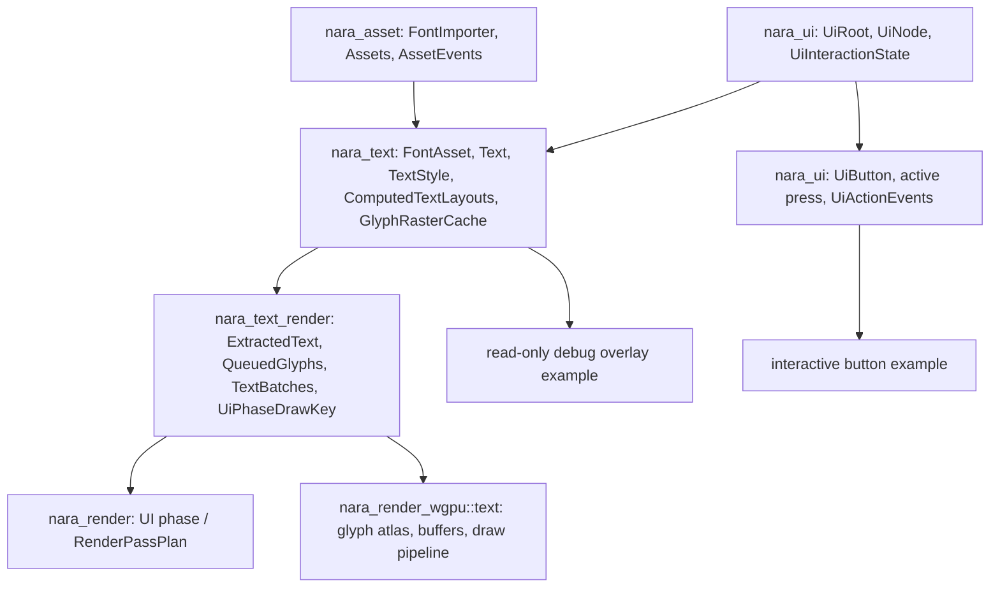

# Text UI Dogfood Foundation - Plan

## Goal Capsule

| Field | Value |
|---|---|
| Objective | Build the next runtime UI usability foundation: typed font/text assets, a nara-owned text layout and glyph rendering path, minimal label/button UI widgets, and small nara UI dogfood examples. |
| Authority | Current `AGENTS.md`, ADR 0025, ADR 0031, ADR 0033, `docs/architecture/nara-foundation.md`, `docs/architecture/open-questions.md`, and the final render/UI/apply foundation verification memory. |
| Execution profile | Deep cross-crate engine foundation. Breaking changes and crate additions are allowed because nara is pre-1.0; compatibility shims for old UI/text assumptions should be deleted. |
| Stop conditions | Stop if implementation would make text a hidden side effect of `nara_ui_render`, serialize glyph atlas/backend handles into scene data, expose `wgpu`/`winit`/egui types through text/UI public APIs, or require CI/GitHub Actions work. |
| Tail ownership | Implementation owns code, tests, docs, engineering memory, review, verification, and conventional commits. CI is intentionally out of scope for this plan. |

---

## Product Contract

### Summary

The previous slice made runtime UI real enough to draw colored and image panels, compute rectangles, route pointer hover/press/focus, and execute the UI render phase.
It is still not usable for HUDs, menus, buttons, debug overlays, or editor dogfooding because it cannot display text and has no widget-level interaction model.

This plan adds text as a dedicated engine domain and uses it to make UI useful without turning UI rendering into a font engine.
The first deliverable is intentionally narrow but structurally mature: font assets, a deterministic default text path, shaped text layout, CPU glyph raster records, backend-neutral glyph batches, wgpu atlas rendering, UI labels/buttons, and read-only plus interactive runtime UI examples.

### Problem Frame

Text is one of the highest-refactor-cost domains in a game engine because it touches assets, layout, glyph caches, render phases, DPI/scaling, international text, editor UX, and user-facing UI APIs.
ADR 0031 already decided that text must be a dedicated domain, not a side effect of UI rendering.
If nara now adds ad hoc ASCII labels or wgpu-only glyph shortcuts, future UI, editor dogfooding, localization, and world-space text will inherit the wrong boundary.

The right first slice should be small but explicit about ownership.
It should prove that text can be authored as data, shaped and laid out without backend handles, rasterized through backend-neutral records, rendered through an ordered UI phase, and used by minimal button/overlay workflows.

### Requirements

**Text and font domain**

- R1. Add a dedicated text/font domain that owns font asset identity, text authoring components, text style data, text layout requests, and computed text layout results.
- R2. Fonts must be typed assets resolved through `nara_asset`; persistent text data stores semantic `AssetRef` or stable text style data, not runtime `AssetId`, backend handles, or host-specific font objects.
- R3. Add a font importer integration for `.ttf` / `.otf` through `ImporterRegistry`, typed `Assets<FontAsset>`, `AssetEvents`, `LoadState`, and reload generation propagation.
- R4. The first text implementation must support UTF-8 strings and avoid ASCII-only architecture, even if examples use simple strings.
- R5. Text layout/shaping/rasterization must be powered by an internal adapter over a mature Rust text stack, with `cosmic-text` as the preferred candidate and no `cosmic_text` types in nara public authoring APIs.
- R6. Provide a deterministic default text style and default font asset path for examples and first-use UI. Host/system font discovery is not user-visible scope for this slice and must not become persistent scene identity.
- R7. Computed text layout, glyph raster caches, and glyph atlas/cache state are runtime projections and must not serialize as scene/prefab authoring data.

**Text rendering**

- R8. Add a backend-neutral text render extraction/queue/batch layer that consumes computed text layout and emits glyph batches for the UI render phase.
- R9. CPU glyph raster production belongs to `nara_text` private runtime adapter resources. `nara_text_render` consumes backend-neutral raster records plus glyph instances; `nara_render_wgpu` only packs/uploads those records into an atlas and draws them.
- R10. Glyph layout/raster/atlas invalidation must respond to font asset changes, text content/style changes, viewport scale/DPI changes, and text bounds changes without requiring scene data mutation.
- R11. Text rendering must support clipping to the same UI clip rectangles used by panels.
- R12. Text and panel ordering inside the UI phase must be explicit and backend-neutral, not an implicit append order inside `nara_render_wgpu`.
- R13. The root `nara` facade must export text and text-render public types without making `winit`, `wgpu`, egui, or notify default dependencies.

**UI usability**

- R14. Runtime UI must gain a data-first label path that attaches text to UI nodes without embedding text shaping in `nara_ui`.
- R15. Runtime UI must gain a minimal button foundation with stable authoring data, enabled/disabled state, visual state derivation, and a backend-neutral action/event signal.
- R16. UI widgets must use existing `UiInteractionState`, `PointerState`, and `ButtonInput<MouseButton>` instead of creating a parallel input model. Keyboard traversal and keyboard activation are deferred.
- R17. Button actions must be data identifiers or event records, not Rust callback closures serialized into scene data.

**Dogfood examples**

- R18. Add a read-only nara UI debug overlay example that renders real runtime/engine debug state using `nara_ui` plus `nara_text`, proving that UI can show real text without egui.
- R19. Add a separate interactive button dogfood example or test surface that exercises `UiActionEvents`; the read-only overlay must not depend on button work.
- R20. The dogfood slice must not replace the existing egui tooling adapter or claim the editor is fully dogfooded. It is a narrow runtime/debug overlay milestone.

**Docs and continuity**

- R21. Update ADR 0031, `docs/architecture/nara-foundation.md`, `docs/architecture/open-questions.md`, `AGENTS.md`, examples, and engineering memory to describe text/font/UI widget boundaries.
- R22. Remove stale text/UI wording that implies runtime UI is only panels or that text should be implemented inside UI rendering.
- R23. CI/GitHub Actions work is out of scope for this plan. Local verification remains mandatory.

### Scope Boundaries

- This slice does not implement a full rich text editor, editable text input, IME, accessibility, text selection, cursor movement, bidirectional editing commands, or markdown/rich-text markup.
- This slice does not implement keyboard focus traversal or keyboard button activation. Pointer/click focus is the only widget interaction target here.
- This slice does not require full font fallback UI, full localization tooling, emoji completeness, variable font UI, signed distance field text, color glyph rendering, or subpixel LCD rendering. The architecture must leave room for them.
- This slice does not implement user-visible system font discovery. A runtime fallback is allowed only if the text stack cannot initialize without one; persistent/project data must still use semantic font assets.
- This slice does not implement full editor replacement with nara UI. egui remains the early editor/debug adapter.
- This slice does not implement a public custom text shader API or general material system for glyphs.
- This slice does not introduce CI workflows.

### Acceptance Examples

- AE1. Given a UI node with text and a valid font asset, layout produces deterministic glyph positions within the node bounds and does not serialize computed glyph data into a scene document.
- AE2. Given a UI text entity without an explicit font, the deterministic default text style resolves to a repo-known font asset path rather than a host-specific system font identity.
- AE3. Given a text string containing non-ASCII characters, the text domain accepts the UTF-8 string and either shapes supported glyphs or reports missing-glyph diagnostics without assuming ASCII-only storage.
- AE4. Given a changed font asset, reload generation advances through asset state/events and invalidates affected layout/raster/atlas state without changing persistent scene data.
- AE5. Given changed text content/style, viewport scale/DPI, or text bounds, layout and glyph queue state update deterministically.
- AE6. Given a clipped UI node containing text, glyph batches inherit the UI clip rectangle and render only inside the visible bounds.
- AE7. Given a panel with a label on the same UI entity, panel/image draw items sort before text draw items for the same root/order/z/source key so the label is visible.
- AE8. Given two labels with different font sizes or colors, queueing splits or keys batches so wgpu can render them without leaking backend handles into `nara_text_render`.
- AE9. Given a button, a down-inside then up-inside pointer sequence on the same enabled button emits one data action event; down-inside/up-outside, disabled-before-up, hidden-before-up, removed-before-up, and disabled buttons emit no action.
- AE10. Given a disabled button, pointer hover may be observable but press/action emission is suppressed and visual state can distinguish disabled from enabled.
- AE11. Given the read-only debug overlay example, it compiles with `winit,wgpu`, uses nara UI/text APIs rather than egui, and displays at least one real runtime/backend debug signal.
- AE12. Boundary searches show text/UI crates do not import `wgpu`, `winit`, egui, or notify; only `nara_render_wgpu` owns glyph GPU resources.

---

## Planning Contract

### Key Technical Decisions

- KTD1. Use three layers for text: `nara_text` for authoring/font/layout/raster data, `nara_text_render` for backend-neutral glyph extraction/queue/batches, and `nara_render_wgpu::text` for glyph atlas and GPU draw state.
- KTD2. Prefer `cosmic-text` as the internal text shaping/layout/raster adapter because its current docs describe shaping, font discovery, fallback, layout, rasterization, and editing abstractions. Keep the adapter private so nara can replace or wrap it later.
- KTD3. Treat `glyphon` as wgpu implementation prior art and an optional private spike, not as nara's public text renderer. A direct `glyphon` dependency may only remain in `nara_render_wgpu` after verifying wgpu version compatibility, no public API/re-export leakage, ability to consume nara `TextBatches`, integration with `RenderPassPlan`/backend status, and an ADR note recording the choice. Otherwise implement a nara-owned atlas/draw path.
- KTD4. Store fonts as typed assets in the nara asset system. `TextPlugin` registers a `FontImporter` for `.ttf` / `.otf`, typed `Assets<FontAsset>`, load failure diagnostics, and reload generation propagation from `AssetEvents`.
- KTD5. Provide `DefaultTextStyle` / `DefaultFont` runtime resources backed by a deterministic project/example asset path. System font discovery is not part of the first user-visible contract.
- KTD6. Computed text layout stores logical glyph runs keyed by entity, text revision, font asset identity/revision, style, bounds, viewport scale factor, and clip context. It is a runtime resource, not a component to serialize.
- KTD7. `nara_text` owns CPU glyph raster production through private adapter resources such as `GlyphRasterCache` and backend-neutral `RasterizedGlyph` records. The first pixel format is alpha coverage (`Alpha8`) with color supplied by glyph instances; unsupported color glyphs are reported as diagnostics rather than silently widening the contract.
- KTD8. `nara_text_render` does not rasterize or own GPU resources. It emits `GlyphRasterKey`, references to available `RasterizedGlyph` records, glyph instances, text stats, clip rectangles, and UI-phase draw keys.
- KTD9. `nara_render_wgpu` owns atlas packing, texture upload, bind groups, pipelines, buffers, and draw submission. It must not reach back into `cosmic-text` state or persistent scene data.
- KTD10. UI phase ordering uses a backend-neutral key shared by UI panel/image batches and text batches, such as `(view_order, view_index, ui_root_order, z_index, source_order, entity_bits, item_kind, material_key, clip_rect)`. `item_kind` orders panels/images before text for equal entity/source keys; gizmos remain a separate phase.
- KTD11. UI labels are ordinary UI nodes with text authoring data. `nara_ui` does not own shaping; it provides layout rectangles and interaction state consumed by `nara_text` / `nara_text_render`.
- KTD12. Button behavior is data-first. The first slice adds `UiButton`, `UiActionEvent(s)`, an active-press runtime tracker, and visual-state derivation from `UiInteractionState`. Do not introduce a generic `UiWidgetState` store unless it carries non-duplicated data required by current tests.
- KTD13. Button actions are single-frame data events. The button system clears/rebuilds events in `CoreStage::Extract` after `update_ui_interaction`; user systems can read the resulting events until the next button update. Input transitions are still cleared by `nara_input` in `CoreStage::Last`.
- KTD14. Button visual state priority is `Disabled > Pressed > Hovered > Focused > Normal`. Focus is pointer/click focus only in this slice and is not a click-completion condition.
- KTD15. The read-only dogfood milestone is a debug overlay, not editor replacement. It must show real runtime state, such as backend status, frame state, view count, UI stats, or text stats; synthetic placeholder data alone is not sufficient.
- KTD16. Do not add CI. The verification contract is local and repo-command based.

### High-Level Technical Design

The first implementation should keep text authoring and UI authoring loosely coupled by entity composition.
A UI entity may have `UiNode` plus `Text` plus optional `UiButton`.
`nara_ui` computes rectangles and interaction state.
`nara_text` shapes text into logical glyph runs and produces backend-neutral raster records.
`nara_text_render` queues glyph instances into the UI phase with explicit draw ordering.
`nara_render_wgpu` owns the atlas and draw state.

### Schedule Contract

The expected plugin/schedule relationship is part of the implementation contract:

- `TextPlugin` initializes font/text resources, registers component codecs and font importers, and computes text layouts in `CoreStage::Extract`.
- `compute_text_layouts` runs after `nara_ui::compute_ui_layouts` and after button visual-state updates if the implementation allows button-derived text style.
- `TextRenderPlugin` runs in `CoreStage::Extract`, `CoreStage::Queue`, and `CoreStage::Sort`, mirroring `UiRenderPlugin`.
- `extract_text` runs after `compute_text_layouts`; queue/sort systems produce UI-phase text batches before `Render`.
- `WgpuRenderPlugin` installs `TextRenderPlugin` if missing, just as it installs sprite/UI render plugins.
- `MinimalPlugins` / root facade behavior must stay backend-free; examples may explicitly add text/render plugins through feature-gated bundles.

### Button Lifecycle Contract

- Press starts only when the primary mouse button is just pressed while the top hit enabled button is under the pointer.
- Action emits only when the same primary button is just released while the same entity is still enabled, visible, focus-eligible as needed by existing UI rules, and still the top hit.
- Down-inside/up-outside, down-outside/up-inside, disabled-before-up, hidden-before-up, removed-before-up, and disabled-at-press all cancel without action.
- Focus is updated by existing UI interaction rules and may be observed for styling, but focus alone does not complete an action.
- `UiActionEvents` contains data action IDs plus source entity and frame/generation metadata if available; it contains no Rust callbacks and is not persistent scene data.

### Sequencing

Text/font assets and importer integration come first because every later unit needs a stable source for font identity.
Text layout and raster cache ownership come before rendering so headless tests can prove shaping, bounds, invalidation, and missing-glyph behavior without wgpu.
Glyph batching and wgpu atlas follow as separate render slices.
Labels and buttons come after the core text path because widget examples should render real text.
The read-only overlay is independent from buttons and should land before the interactive button dogfood example.
Docs, memory, and review close the loop after behavior is implemented.

### Risks and Mitigations

| Risk | Severity | Mitigation |
|---|---:|---|
| Text scope expands into full editor text input | High | Keep this slice display-only; defer editing, IME, selection, and cursor semantics. |
| `cosmic-text` shapes the public API too strongly | High | Put all third-party types behind `nara_text` adapter structs/resources and add boundary searches/tests. |
| Glyph raster ownership drifts into the backend | High | Keep CPU raster records in `nara_text`; make `nara_render_wgpu` consume records only for atlas upload. |
| UI text ordering becomes implicit backend behavior | High | Add/shared UI-phase draw order keys and tests proving panel-before-text for same entity. |
| Font reload invalidation is incomplete | High | Connect `FontImporter`, `AssetEvents`, asset versions/reload generation, layout cache keys, and atlas cache invalidation tests. |
| Font fixture licensing becomes messy | Medium | Use an explicitly licensed small example font asset with a license note, or keep examples using a repo-owned fixture path added with license metadata. |
| UI widgets become an immediate-mode framework | Medium | Store widget authoring data as ECS components and runtime state/events as resources; no callback closures. |
| Dogfood examples compile but render nothing | Medium | Add headless smoke tests that assert layouts, raster records, text batches, and example overlay data are non-empty; record manual GPU screenshots/diagnostics in engineering memory when available. |

### Sources

- ADR 0031: `docs/architecture/adr/0031-text-and-font-strategy.md`
- Runtime UI implementation memory: `docs/knowledge/engineering/progress/2026-07-09-runtime-ui-pass-plan-m3.md`
- `cosmic-text` docs: https://docs.rs/cosmic-text
- `glyphon` docs: https://docs.rs/glyphon
- `taffy` docs for later layout pressure: https://docs.rs/taffy

---

## Implementation Units

### U1. Text/font architecture docs and workspace seams

- **Goal:** Make text/font crate ownership, glyph raster ownership, UI phase ordering, and deferred scope explicit before adding behavior.
- **Requirements:** R1-R2, R5-R13, R21-R23.
- **Dependencies:** None.
- **Files:** Modify `Cargo.toml`, `AGENTS.md`, `docs/architecture/adr/0031-text-and-font-strategy.md`, `docs/architecture/nara-foundation.md`, `docs/architecture/open-questions.md`; create crates only as empty or minimal shell if needed for compileable workspace setup.
- **Approach:** Record that `nara_text` owns authoring/font/layout/raster records, `nara_text_render` owns glyph extraction/queueing/draw keys, and `nara_render_wgpu::text` owns GPU atlas state. Add dependency boundary rules before implementation.
- **Test Scenarios:** Workspace still checks with no text behavior; dependency boundary search shows no new backend leakage; docs do not claim UI rendering owns shaping.
- **Verification:** `cargo check --workspace`; `rg -n "wgpu::|wgpu =" crates/nara_text crates/nara_text_render` once crates exist.

### U2. Typed font asset, importer, default style, and private text adapter

- **Goal:** Add typed font assets, importer/reload integration, deterministic first-use defaults, and the internal text adapter boundary without rendering anything yet.
- **Requirements:** R1-R7, R21.
- **Dependencies:** U1.
- **Files:** Create `crates/nara_text/Cargo.toml`, `crates/nara_text/src/lib.rs`, likely split modules `font.rs`, `import.rs`, `style.rs`, `layout.rs`, `raster.rs`, `codec.rs`, `tests.rs`; modify workspace `Cargo.toml` and root `src/lib.rs`.
- **Approach:** Define `FontAsset`, `FontSourceMetadata`, `FontImporter`, `DefaultFont`, `DefaultTextStyle`, `Text`, `TextStyle`, `TextBounds`, `TextPlugin`, and private adapter resources around `cosmic-text`. Register `.ttf` / `.otf` extensions through `ImporterRegistry`; update typed font assets, load state, diagnostics, and reload generation through existing asset event/state primitives. Keep third-party types private.
- **Test Scenarios:** Font importer registers `.ttf`/`.otf` without duplicate extension conflicts; imported font assets record source metadata and bytes without runtime handles; load failure produces diagnostics; reload advances font generation; default text style resolves deterministically; text/style component codecs roundtrip; non-ASCII strings are accepted; computed/runtime resources are not registered as persistent component schemas.
- **Verification:** `cargo nextest run -p nara_text`; `cargo check -p nara_text --features serde`; `cargo check --workspace`.

### U3. Text layout and glyph raster projection for UI nodes

- **Goal:** Compute text layout runs and backend-neutral glyph raster records from UI rectangles, text content, font/style data, and target scale without backend handles.
- **Requirements:** R1, R4-R12, R14.
- **Dependencies:** U2.
- **Files:** Modify `crates/nara_text/src/layout.rs`, `crates/nara_text/src/raster.rs`; add tests in `crates/nara_text/src/tests.rs`; modify `crates/nara_ui` only if a narrow layout hook is needed.
- **Approach:** Add `ComputedTextLayouts`, `TextLayoutCacheKey`, `GlyphRasterKey`, `RasterizedGlyph`, `GlyphRasterCache`, and text/raster stats as runtime resources. Systems read `UiNode` / `ComputedUiLayouts` plus `Text` components and write deterministic layout runs and raster records. Track invalidation from text revision, font asset identity/revision, style, bounds, viewport scale factor, and clip context.
- **Test Scenarios:** A text entity with a UI layout produces glyph positions within bounds; changing text content, text style, font asset revision, node bounds, or viewport scale changes layout/raster keys; hidden or zero-size UI nodes do not emit layout; non-ASCII text is accepted and missing glyphs are diagnosed rather than panicking; unsupported color glyphs do not widen the first pixel-format contract; computed text layouts and raster records are not scene-exported.
- **Verification:** `cargo nextest run -p nara_text -p nara_ui`; `cargo check --workspace --features serde`.

### U4. Backend-neutral glyph extraction, UI-phase ordering, queueing, and batching

- **Goal:** Add `nara_text_render` so text rendering follows the same extract/queue/batch discipline as sprites and UI panels while keeping panel/text draw order explicit.
- **Requirements:** R8-R13.
- **Dependencies:** U3.
- **Files:** Create `crates/nara_text_render/Cargo.toml`, `crates/nara_text_render/src/{lib.rs,types.rs,extract.rs,queue.rs,tests.rs}`; modify workspace `Cargo.toml`, root `src/lib.rs`, and likely `crates/nara_render` or a narrow shared module to hold UI-phase ordering keys shared with `nara_ui_render`.
- **Approach:** Emit `ExtractedTextGlyphs`, `QueuedTextGlyphs`, `TextBatches`, glyph raster keys, references to available `RasterizedGlyph` records, color/style keys, clip rectangles, view indices, and UI phase labels. Introduce or move a backend-neutral UI draw order key so panel/image and text batches sort with the same `(view, root order, z, source order, entity, item kind)` semantics.
- **Test Scenarios:** Ready text layouts queue glyphs into UI phase; missing raster records record stats without panicking; clip rectangles split batches; text color/font size/style keys split batches deterministically; panel/image items sort before text for equal UI entity/source keys; no `wgpu`, `winit`, `cosmic_text`, or `glyphon` imports exist in `nara_text_render`.
- **Verification:** `cargo nextest run -p nara_text_render -p nara_text -p nara_ui -p nara_ui_render -p nara_render`; dependency boundary searches for `nara_text` and `nara_text_render`.

### U5. wgpu glyph atlas and text draw path

- **Goal:** Render text batches in the existing wgpu UI phase using backend-private glyph atlas resources.
- **Requirements:** R8-R13.
- **Dependencies:** U4.
- **Files:** Modify `crates/nara_render_wgpu/src/lib.rs`; create `crates/nara_render_wgpu/src/text.rs` and shader file if needed; add focused backend tests.
- **Approach:** Start with a private `glyphon` adapter evaluation gate. Keep `glyphon` only if it can consume nara `TextBatches`, obey `RenderPassPlan`/backend status, match the workspace wgpu version, stay private to `nara_render_wgpu`, and avoid public re-export leakage; otherwise implement a nara-owned atlas/draw path. In either path, `nara_render_wgpu` uploads `RasterizedGlyph` records into an atlas, creates private bind groups/buffers/pipeline state, and draws text batches according to UI-phase order.
- **Test Scenarios:** Backend pass plan draws world, UI panels/images, UI text, and gizmos in deterministic order; atlas upload keys change when glyph raster keys change; font revision/style/scale changes invalidate relevant atlas entries; glyph clipping is honored in batch selection; empty text frames do not create unnecessary GPU resources; backend status reports errors without panics; public APIs do not expose `glyphon`/`cosmic_text` types.
- **Verification:** `cargo nextest run -p nara_render_wgpu -p nara_text_render -p nara_render`; boundary search for `glyphon::|cosmic_text::` outside private adapter/backend modules.

### U6. UI label and button foundation

- **Goal:** Add the first reusable UI widget data model on top of text and existing pointer interaction.
- **Requirements:** R14-R17.
- **Dependencies:** U3; U4 for rendered label acceptance.
- **Files:** Modify `crates/nara_ui/src/lib.rs`, `crates/nara_ui/src/interaction.rs`, likely add `crates/nara_ui/src/widget.rs` and tests; modify `crates/nara_ui/src/codec.rs` for persistent widget authoring fields.
- **Approach:** Add `UiButton`, optional `UiLabel` convenience data if composition alone is too verbose, `UiActionId`, `UiActionEvent(s)`, and an active-press runtime resource. Derive visual state from `UiInteractionState` plus button enabled state; avoid a generic `UiWidgetState` store unless it has non-duplicated fields and tests. Run button update after `update_ui_interaction` and before text/render extraction consumers.
- **Test Scenarios:** Button hover/press/focus follows pointer state; visual state priority is disabled, pressed, hovered, focused, normal; down-inside/up-inside on the same enabled top-hit button emits exactly one action; down-inside/up-outside, disabled-before-up, hidden-before-up, removed-before-up, and disabled buttons emit no action; events are single-frame data and clear on the next button update; action IDs serialize cleanly; runtime press/event state is not persistent; label/button components can coexist with `Text` and `UiNode`.
- **Verification:** `cargo nextest run -p nara_ui -p nara_text`; `cargo check -p nara_ui --features serde`.

### U7. Runtime UI text and read-only debug overlay examples

- **Goal:** Prove text with user-facing examples and the first narrow read-only nara UI dogfood overlay.
- **Requirements:** R18, R20.
- **Dependencies:** U5.
- **Files:** Add `examples/runtime_ui_text.rs`, `examples/runtime_ui_debug_overlay.rs`, example font fixture and license note if needed; modify root `Cargo.toml`.
- **Approach:** `runtime_ui_text` demonstrates a panel plus label using the deterministic default text path. `runtime_ui_debug_overlay` renders a small overlay with real runtime/engine state such as backend status, frame state, view count, UI render stats, and text render stats using nara UI/text APIs, not egui. Synthetic debug rows may supplement real data but are not sufficient acceptance.
- **Test Scenarios:** Both examples compile with `winit,wgpu`; example data uses semantic asset paths/stable IDs for fonts; no egui imports appear in examples; default facade remains backend-free; a headless example-scene smoke test asserts non-empty UI layouts, computed text layouts, raster records, and text batches.
- **Verification:** `cargo check -p nara --features winit,wgpu --example runtime_ui_text`; `cargo check -p nara --features winit,wgpu --example runtime_ui_debug_overlay`; `cargo tree -p nara --no-default-features | rg -n "wgpu|winit|egui|notify"`.

### U8. Interactive button dogfood example

- **Goal:** Prove the minimal button contract with a small interactive example and non-interactive ECS tests.
- **Requirements:** R15-R19.
- **Dependencies:** U6, U7.
- **Files:** Add `examples/runtime_ui_button_overlay.rs` or extend an equivalent example module with a clear button scene builder; modify root `Cargo.toml`.
- **Approach:** Build a compact overlay with one enabled button and one disabled button. The enabled button emits a data action event that toggles or increments visible debug text; the disabled button demonstrates disabled visual state without action emission. Keep the interaction behavior covered by ECS tests rather than relying on manual clicking for correctness.
- **Test Scenarios:** Example compiles with `winit,wgpu`; ECS tests simulate pointer down/up transitions and assert `UiActionEvents`; disabled and canceled transitions do not emit; visual state can be rendered as text/style data without backend-specific callbacks.
- **Verification:** `cargo check -p nara --features winit,wgpu --example runtime_ui_button_overlay`; `cargo nextest run -p nara_ui -p nara_text -p nara_text_render`.

### U9. Docs, memory, review, and final verification

- **Goal:** Keep durable architecture records aligned with the shipped text/UI dogfood foundation.
- **Requirements:** R21-R23.
- **Dependencies:** U1-U8.
- **Files:** Modify `AGENTS.md`, `docs/architecture/adr/0031-text-and-font-strategy.md`, `docs/architecture/nara-foundation.md`, `docs/architecture/open-questions.md`; add `docs/knowledge/engineering/progress/`, `verification/`, and `logs/` entries.
- **Approach:** Record implementation notes, residual text/widget/editor dogfood scope, and final verification. Remove stale wording that says runtime UI lacks text or that UI rendering should own shaping. Record any local GPU screenshot/frame diagnostics if available, but do not require CI.
- **Test Scenarios:** Docs-only changes have no behavioral tests, but stale-contract searches must not find old text-inside-UI-render assumptions except historical notes explicitly marked superseded.
- **Verification:** Full Verification Contract below plus engineering memory validation.

---

## Verification Contract

| Gate | Coverage |
|---|---|
| `cargo fmt --all` | Formatting for all Rust changes. |
| `cargo check --workspace` | Default feature compile across all crates. |
| `cargo check --workspace --features serde` | Persistent data and schema paths stay valid. |
| `cargo nextest run --workspace` | Full regression suite including asset, UI, text, render, scene, and tooling tests. |
| `cargo check -p nara --features winit,wgpu --example runtime_ui_text` | Text rendering example compiles. |
| `cargo check -p nara --features winit,wgpu --example runtime_ui_debug_overlay` | Read-only nara UI dogfood overlay example compiles. |
| `cargo check -p nara --features winit,wgpu --example runtime_ui_button_overlay` | Interactive button dogfood example compiles. |
| Existing winit/wgpu example checks for `windowed_clear`, `windowed_sprites`, and `runtime_ui_panel` | Existing desktop render examples remain intact. |
| Headless text/UI smoke tests in `cargo nextest run --workspace` | Example scene builders produce non-empty `ComputedUiLayouts`, `ComputedTextLayouts`, `GlyphRasterCache`, `TextBatches`, and real overlay debug rows. |
| `cargo run -q --example asset_import_texture` | Existing asset import path still executes after font/text additions. |
| `cargo check -p nara --features asset-watch` | Optional watcher wiring still compiles. |
| `rg -n "wgpu::|wgpu =" crates src Cargo.toml` | GPU dependency remains in `nara_render_wgpu` and root optional feature metadata. |
| `rg -n "winit::|winit =" crates src Cargo.toml` | Window backend dependency remains in `nara_winit` and root optional feature metadata. |
| `rg -n "egui::|egui =" crates src Cargo.toml` | egui remains in tooling adapter and optional facade metadata. |
| `rg -n "notify::|notify =" crates src Cargo.toml` | Watcher dependency remains isolated to watcher adapter and optional facade metadata. |
| `rg -n "glyphon::|cosmic_text::" crates src` | Third-party text stack usage remains in private adapter/backend modules and does not leak into public authoring/render APIs. |
| Runtime identity leak searches for scene/prefab/text/UI output | Persistent documents do not serialize runtime `Entity`, runtime `AssetId`, backend handles, glyph atlas handles, raster cache internals, task handles, timers, or transient events. |
| Stale-contract searches for text-in-UI-render and panel-only UI language | Obsolete contracts are removed or explicitly marked historical. |
| Engineering memory validation | New progress/verification memory is valid and portable. |
| `git diff --check` | No whitespace or patch hygiene issues. |

CI/GitHub Actions setup is intentionally excluded. Failing local verification blocks completion.

---

## Definition of Done

- `nara_text` owns typed font/text authoring data, font importer integration, deterministic default text style resources, private text adapter resources, component codecs, runtime computed text layout resources, and CPU glyph raster records.
- Fonts are typed assets resolved through `nara_asset`; persistent scene/prefab data never stores runtime font handles, host font objects, raster cache internals, or backend glyph resources.
- Font reload generation, text/style changes, viewport scale/DPI changes, and bounds changes invalidate the correct layout/raster/atlas state.
- Text layout accepts UTF-8 strings and keeps non-ASCII support architecturally open.
- `nara_text_render` owns backend-neutral text extraction, queueing, clipping, sorting, UI-phase draw keys, and batching.
- UI phase ordering is explicit and proves panels/images render before text for the same UI entity/source order.
- `nara_render_wgpu` owns glyph atlas, text GPU resources, and text draw submission inside the existing pass plan / UI phase.
- UI labels render real text through `nara_text`; `nara_ui` does not own shaping or glyph caches.
- `UiButton` provides data-first enabled/action state, integrates with existing pointer interaction, derives visual state, and emits backend-neutral runtime action events with defined cancellation semantics.
- A small read-only runtime debug overlay example uses real nara UI/text APIs and does not use egui.
- A small interactive button example or equivalent dogfood surface exercises `UiActionEvents`.
- Root `nara` facade exports text/text-render APIs while default features remain backend-free.
- ADRs, foundation docs, open questions, AGENTS guidance, examples, and engineering memory describe the new text/UI dogfood boundary.
- CI/GitHub Actions are not added in this plan.
- Full Verification Contract passes, and abandoned experimental code is removed before commit.
