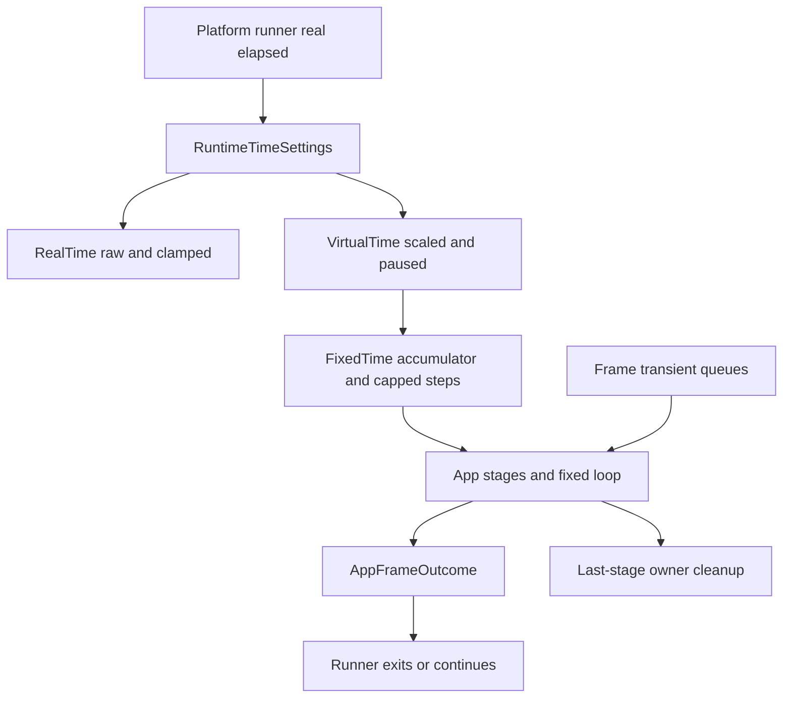
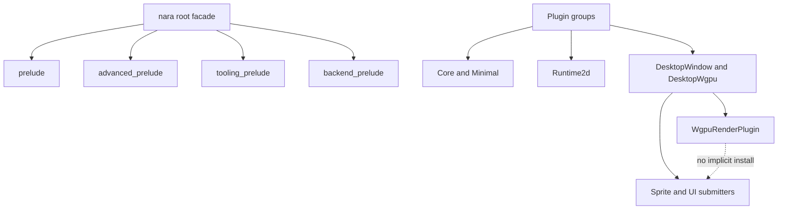
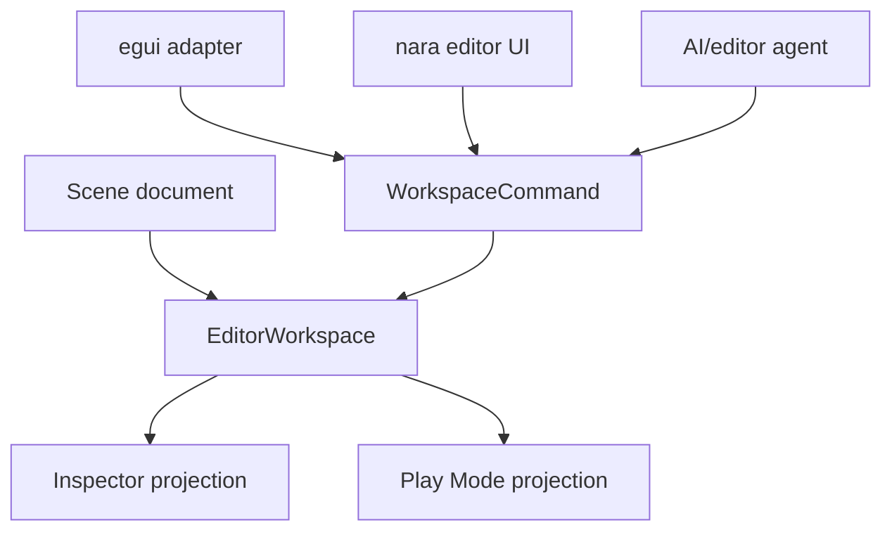

# Engine Lifecycle Contracts - Plan

## Goal Capsule

| Field | Contract |
|---|---|
| Objective | Make nara's cross-cutting runtime contracts executable in code: plugin identity, public facade shape, component schema capabilities, explicit time domains, frame-transient events, asset watch diagnostics, render resource lifetime, editor workspace state, and viewport-aware UI interaction. |
| Authority | ADRs 0036, 0039, 0040, 0041, 0042, 0044, 0045, 0046, and 0047 are the architectural source of truth. Existing code is a pre-1.0 implementation candidate, not a compatibility constraint. |
| Execution profile | Fearless refactor on `main`, with logical commits and periodic pushes to `origin/main` as authorized by the user. |
| Compatibility posture | Break obsolete public APIs instead of keeping compatibility aliases when an alias would preserve ambiguous semantics. |
| Stop conditions | Stop only for a contradiction with an ADR, a plan assumption that proves false and changes scope, or an implementation-time discovery that would require a different architecture contract. |
| Tail ownership | Implementation owns tests, code review, cleanup of abandoned attempts, engineering memory, commits, and pushes. |

---

## Product Contract

### Summary

This plan hardens the runtime foundations that future engine features will stand on.
It turns recent ADR decisions into code contracts and removes older scaffolding whose semantics would make later 3D, editor, UI, asset, and AI-agent work expensive to retrofit.

### Problem Frame

nara already has the right direction: a nara-owned app/plugin boundary, `bevy_ecs` as the ECS substrate, backend crates behind adapters, persistent scene documents, asset identity/import seams, and phase-first rendering.
The current risk is not a wrong product direction; it is that several horizontal lifecycle contracts remain implicit in code.
If these seams stay implicit, later modules will invent their own retention rules, plugin dependencies, time semantics, editor state stores, render caches, and UI input routing.

The project is pre-1.0 and the user has explicitly authorized breakage and deletion of obsolete code.
The correct product move is therefore to make the public runtime contract sharper now, even when that means examples and tests need broad migration.

### Requirements

**Runtime lifecycle**

- R1. The app loop must expose explicit real, virtual, fixed, and render/interpolation time domains instead of one ambiguous `Time` resource.
- R2. Runtime time policy must cover pause, time scale, max delta clamping, fixed-step catch-up caps, and frame status diagnostics.
- R3. App exit must become an app-level frame outcome that systems can request and platform runners consume after systems run.
- R4. Window events must be frame-transient, owner-cleared, replay-capturable data with no gameplay-facing drain/clear API.
- R5. Window close requests must be cancellable by ECS systems before a platform runner exits.

**Plugin and facade boundaries**

- R6. Plugins must have stable metadata, dependency/capability declarations, deterministic duplicate handling, and inspectable plugin group membership.
- R7. The root facade must split gameplay prelude, advanced prelude, tooling prelude, and backend prelude so default imports do not expose backend or tooling internals.
- R8. `MinimalPlugins` must mean a true minimal/core headless set; 2D, desktop, wgpu, tooling, and asset-watch bundles must be named plugin groups.
- R9. `WgpuRenderPlugin` must own backend/device/surface/render status only and must not implicitly install sprite or UI submitters.

**Schema and authoring**

- R10. Component and field schemas must carry deterministic capability metadata for scene save, inspect, edit, animate, replicate, script, asset reference, and entity reference eligibility.
- R11. Scene validation, export, patching, inspector models, and Play Mode apply-back gates must use schema capabilities rather than a single `serializable` boolean.
- R12. Tooling must have a UI-agnostic `EditorWorkspace` that owns open documents, active document, selection sets, dirty/revision state, external reload conflicts, and per-document undo/redo.

**Assets, rendering, and UI**

- R13. Asset watcher backend, queue, translation, and lock failures must surface as structured diagnostics instead of being dropped.
- R14. GPU render resource caches must have explicit keys, generations, grace-frame eviction, upload/reload statistics, and device-loss cleanup.
- R15. Alpha mode and UI render public types must reflect actual backend behavior; opaque materials cannot share an alpha-blended pipeline contract.
- R16. Runtime UI interaction must become viewport-aware and capture-aware so multi-window, editor viewport, and gameplay input can compose later.

### Acceptance Examples

- AE1. A paused app frame still runs real-time and task integration stages, reports real elapsed time, reports zero virtual delta, and runs no fixed steps.
- AE2. A system can cancel a window close request during the frame; the winit runner does not exit for that request.
- AE3. A backend-only wgpu app can install `WgpuRenderPlugin` without installing sprite or UI submitter resources.
- AE4. A scene patch that tries to edit a field without `edit` capability is rejected with a structured diagnostic.
- AE5. A notify watcher error is visible in asset watch diagnostics after the watch drain system runs.
- AE6. A UI element in one viewport does not receive hover, press, or focus from a pointer routed to another viewport.
- AE7. The default `nara::prelude` imports gameplay-facing authoring APIs but not wgpu, winit, egui, asset importer internals, render batch internals, or tooling state models.

### Scope Boundaries

- Full CI/GitHub Actions setup remains out of scope.
- Full runtime diagnostics bus implementation remains out of scope; this plan keeps new diagnostics compatible with ADR 0048 and removes silent-drop paths it directly touches.
- Full untrusted-input parse/decode budget implementation remains out of scope; ADR 0049 is the policy source for future loaders and importers. If this plan changes any file-backed loader/importer/schema-catalog persistence/document-decode path, that unit must either implement the relevant ADR 0049 budget checks or explicitly keep the change encode-only/in-memory and record the budget work as deferred.
- Full asset-root symlink/junction/package-trust implementation remains out of scope; ADR 0050 is the policy source for future filesystem containment work.
- Full persistent file envelope and golden fixture migration remains out of scope; ADR 0051 is the policy source, and this plan must not change persistent file shapes without respecting it.
- Full task-pool backpressure implementation remains out of scope; ADR 0052 is the policy source for future task API changes.
- Full tilemap chunk visibility/cache implementation remains out of scope; ADR 0053 is the policy source for later large-map rendering work.
- Full GPU upload allocator/ring-buffer implementation remains out of scope; this plan implements the first render resource lifetime and stats-compatible steps while ADR 0054 defines the larger policy.
- Full Bevy-style `RenderApp`, full render graph execution, or a separate render world remains out of scope.
- Full Bevy-style state machine, schedules-on-enter/exit ecosystem, and run-condition DSL remain out of scope; this plan only creates the time, exit, and frame outcome contract those features need.
- Full input action map, IME, accessibility semantic tree, and keyboard navigation remain out of scope; this plan creates the routing seam they will use.
- Full editor UI remains out of scope; this plan creates UI-agnostic workspace state and command boundaries.
- Full export/packaging, physics, networking, scripting, and 3D rendering are out of scope.
- Backwards-compatible wrappers for removed pre-1.0 APIs are out of scope unless implementation discovers a test-only helper that preserves new semantics.

---

## Planning Contract

### Key Technical Decisions

- KTD1. Use stable plugin metadata as the plugin identity source.
  Type names and string names are diagnostics only; duplicate detection, dependency errors, group membership, and capabilities use stable `PluginId` values.
- KTD2. Remove function-closure plugins instead of adding metadata shims.
  A closure cannot provide a durable plugin ID or dependency contract, so it conflicts with ADR 0046.
- KTD3. Split plugin groups by product shape.
  `CorePlugins`/`MinimalPlugins` are headless core, `Runtime2dPlugins` adds 2D gameplay domain, `DesktopWindowPlugins` adds winit/window/input integration, `DesktopWgpuPlugins` composes wgpu plus explicit submitters, and `ToolingPlugins` initializes tooling state.
- KTD4. Shrink the default prelude to gameplay authoring.
  Advanced, tooling, backend, asset-import, render-queue, and diagnostic internals remain available through explicit modules or specialized preludes.
- KTD5. Replace `serializable` with capability metadata.
  Persistence, inspection, editing, animation, replication, scripting, asset references, and entity references are separate abilities because save, editor, network, animation, and script systems should not infer each other.
- KTD6. Treat real time as runner input and virtual/fixed time as app policy output.
  Platform runners pass observed elapsed time; `nara_app` owns clamping, scaling, pausing, fixed-step catch-up, interpolation alpha, and frame status.
- KTD7. Make frame-transient queues owner-cleared.
  Producers append, consumers observe, owner systems clear at the declared lifecycle point; gameplay-facing APIs do not drain shared queues.
- KTD8. Resolve close requests inside ECS before platform exit.
  `CloseRequested` is data, not a runner side effect; platform exit occurs only after the app frame outcome asks for it.
- KTD9. Keep render backend ownership narrower than render domain ownership.
  Wgpu owns GPU resources and pass execution; sprite, UI, text, gizmo, and future 3D submitters install separately and provide backend-neutral batches or phases.
- KTD10. Replace one-frame cache pruning with resource lifetime policy.
  Cache eviction must tolerate culling, tab changes, hot reload, and temporary invisibility without resource churn.
- KTD11. Put editor document truth above UI adapters.
  egui and future nara runtime UI render workspace projections and emit workspace commands; neither owns mutation semantics.
- KTD12. Introduce viewport-aware UI routing before full actions/IME.
  The first step is pointer target, hit-test filtering, capture owner, and focus context; higher-level action maps and text input can attach later.

### High-Level Technical Design

### Assumptions

- A1. The latest user instruction authorizes direct work on `main`, logical commits, and pushes to `origin/main`.
- A2. No public compatibility layer is required for old `Time`, string plugin identity, broad prelude exports, public queue drain APIs, or no-field component registry helpers.
- A3. The plan should favor local unit and integration tests over CI setup because the user explicitly said CI is not needed now.
- A4. External engine reference material has already shaped the ADRs; this implementation plan relies on local code and ADRs rather than adding another web research pass.
- A5. Subagents may inspect and review implementation units, but the orchestrating agent owns staging, commits, authoritative verification, and pushes.
- A6. New cross-cutting safety, observability, performance, and quality findings are documented by ADRs 0048 through 0055.
  This plan implements only the portions that overlap its existing units and leaves the rest as explicit follow-up architecture work.

### Sequencing

The first dependency layer is the public app/facade contract: plugin metadata, plugin groups, prelude split, and schema capabilities.
The second layer is runtime frame semantics: explicit time domains, frame outcomes, window event retention, and cancellable close.
The third layer hardens subsystems that depend on those contracts: asset watch diagnostics, render backend/resource lifetime, tooling workspace, and viewport-aware UI interaction.
The final layer updates documentation, memory, examples, and verification evidence.

### Deferred to Implementation

- Exact names for small helper methods and intermediate structs may change if they better match existing local style.
- Render cache policy constants should be chosen after reading the current cache tests and should be easy to tune.
- UI focus clearing semantics should be resolved by tests when the current interaction model reveals which behavior existing examples depend on.
- If a single app-core diff becomes too large, plugin metadata and time/frame outcome may be committed separately even though they both touch `crates/nara_app/src/lib.rs`.

---

## Implementation Units

### U1. Plugin Metadata and Groups

- **Goal:** Replace string/type-name plugin identity with stable metadata and create named plugin groups that express runtime product shapes.
- **Requirements:** R6, R8, R9.
- **Dependencies:** None.
- **Files:** `crates/nara_app/src/lib.rs`, `src/lib.rs`, `crates/nara_render_wgpu/src/lib.rs`, `examples/*.rs`, relevant crate tests.
- **Approach:** Add `PluginId`, `PluginCapability`, `PluginCategory`, `PluginMetadata`, and a lightweight `PluginGroup` contract.
  Make `App` record installed plugins by stable ID, reject duplicates deterministically, and report missing requirements/conflicts with structured IDs.
  Redefine `MinimalPlugins` as core/headless and add explicit groups for runtime 2D, desktop windowing, desktop wgpu, and tooling.
  Remove closure plugin support and string-only prerequisite helpers rather than wrapping them.
- **Execution note:** Start with app plugin tests that prove duplicate IDs, missing requirements, and group installation before removing old identity paths.
- **Patterns to follow:** Existing `PluginError` tests in `crates/nara_app/src/lib.rs`; root plugin bundle pattern in `src/lib.rs`; backend isolation rule in `AGENTS.md`.
- **Test scenarios:**
  - Installing the same stable plugin ID twice reports a duplicate plugin error with the plugin ID.
  - `add_plugin_if_missing` uses stable ID identity and does not run a second build.
  - A plugin with missing required plugin or capability returns a structured missing-prerequisite error.
  - `MinimalPlugins` does not install render, sprite, UI, window, winit, or wgpu resources.
  - `Runtime2dPlugins` installs the 2D gameplay resources that examples need.
  - `DesktopWgpuPlugins` explicitly installs wgpu plus sprite/UI submitters; `WgpuRenderPlugin` alone does not.
- **Verification:** App plugin tests pass; root examples compile after group migration; backend-only wgpu installation is testable without implicit submitter side effects.

### U2. Root Facade and Prelude Layering

- **Goal:** Make the default `nara::prelude` safe for gameplay authors and move backend/tooling/internal APIs behind explicit imports.
- **Requirements:** R7, R8.
- **Dependencies:** U1.
- **Files:** `src/lib.rs`, examples, README/docs snippets if they import root prelude, crate-local prelude modules when needed.
- **Approach:** Shrink `nara::prelude` to ECS/app basics, transforms, assets as handles/references, scene authoring essentials, sprites/tilemaps/UI authoring components, input authoring, and common math/value types.
  Add `advanced_prelude`, `tooling_prelude`, and `backend_prelude` for advanced APIs that should stay one import away but not default.
  Update examples and tests to import backend, asset import/reload, render batch, and tooling types explicitly.
- **Execution note:** This is expected to break wildcard imports; migrate callsites intentionally instead of re-exporting old internals.
- **Patterns to follow:** Narrow preludes in `crates/nara_ecs/src/lib.rs`, `crates/nara_sprite/src/lib.rs`, `crates/nara_ui/src/lib.rs`.
- **Test scenarios:**
  - A small gameplay-style example compiles with `nara::prelude` and no backend features.
  - Windowed/wgpu examples compile after explicit backend imports.
  - Static dependency searches show `nara::prelude` no longer exports wgpu, winit, egui, tooling, render batch internals, importer internals, reload internals, or task-pool internals.
- **Verification:** Workspace check and backend example checks pass; root default features remain backend-free.

### U3. Component Schema Capabilities

- **Goal:** Replace monolithic component serializability with deterministic component and field capability metadata.
- **Requirements:** R10, R11.
- **Dependencies:** U1 can run before or alongside this unit; U2 should update exports after this unit if ordering changes.
- **Files:** `crates/nara_reflect/src/schema.rs`, `crates/nara_reflect/src/registry.rs`, `crates/nara_reflect/src/tests.rs`, built-in component codec registrations under `crates/nara_scene`, `crates/nara_transform`, `crates/nara_render`, `crates/nara_sprite`, `crates/nara_tilemap`, `crates/nara_ui`, scene export/validation/patch files, tooling inspector/play files, schema export examples.
- **Approach:** Add component and field capability sets with stable ordering and serde output.
  Provide builder helpers and presets for scene-save, inspect, edit, animate, replicate, script, asset reference, and entity reference eligibility.
  Migrate built-in schema registrations to declare capabilities.
  Update scene validation/export, patch validation, inspector models, egui field editability, and Play Mode apply-back gates to read capabilities.
  Delete no-field component registration helpers that always fail or encourage incomplete schema.
- **Execution note:** Prefer proof-first tests around scene patch and inspector behavior because capability mistakes will silently corrupt editor and save semantics.
- **Patterns to follow:** Existing schema validation tests in `crates/nara_reflect/src/tests.rs`; scene patch field validation in `crates/nara_scene/src/patch.rs`; inspector field model construction in `crates/nara_tooling/src/inspector.rs`.
- **Test scenarios:**
  - Capability sets deduplicate, sort deterministically, and serialize with stable names.
  - A schema with no capabilities is not scene-save eligible by default.
  - Scene validation rejects a component without scene-save capability.
  - Scene export omits components without scene-save capability.
  - `SetField` rejects fields without edit capability.
  - `SetAssetRefField` requires both edit and asset-reference capability.
  - Inspector models hide non-inspect fields and mark non-editable fields.
  - Play Mode apply-back rejects components or fields that are not scene/edit eligible.
- **Verification:** Reflect, scene, tooling, and schema export tests pass with no reliance on `serializable: bool`.

### U4. App Time Domains and Frame Outcome

- **Goal:** Replace ambiguous single `Time` semantics with explicit real, virtual, fixed, render/interpolation, time policy, frame status, and app frame outcome.
- **Requirements:** R1, R2, R3.
- **Dependencies:** U1 if plugin metadata touches the same app APIs first.
- **Files:** `crates/nara_app/src/lib.rs`, root facade exports, callsites in crates and examples that use `run_once`, `Time`, `FixedTime`, `update`, or `try_update`.
- **Approach:** Introduce explicit time resources and `RuntimeTimeSettings`.
  Treat `run_once` input as real elapsed time, clamp and scale it into virtual time, accumulate fixed steps from virtual time, record catch-up/clamp status, and return a frame outcome that includes requested app exit.
  Remove the old `Time` resource and ambiguous zero-delta update conveniences, or replace test-only helpers with names that preserve new semantics.
- **Execution note:** Characterize current stage ordering before changing the frame loop, then keep the ordering tests green under the new contract.
- **Patterns to follow:** Existing fixed-step tests in `crates/nara_app/src/lib.rs`; task update ordering tests; ADR 0039.
- **Test scenarios:**
  - Real elapsed time records raw and clamped delta while virtual time records scaled delta.
  - Pause zeroes virtual and fixed time but still runs real-time and task integration stages.
  - Time scale changes virtual delta and fixed accumulation.
  - Max delta clamps large elapsed time and records clamp status.
  - Fixed update catch-up respects max steps and records capped/pending status.
  - A system request for app exit is returned in `AppFrameOutcome`.
  - Existing startup, task update, fixed update, render, cleanup, and last-stage ordering remain deterministic.
- **Verification:** App tests pass; all `run_once` callsites compile with frame outcome semantics.

### U5. Window Event Retention and Cancellable Close

- **Goal:** Make window events frame-transient and close requests cancellable before platform exit.
- **Requirements:** R4, R5.
- **Dependencies:** U4.
- **Files:** `crates/nara_window/src/lib.rs`, `crates/nara_winit/src/lib.rs`, root facade exports, window/winit tests.
- **Approach:** Define `WindowEvents` as current-frame observation data with owner cleanup in `CoreStage::Last`.
  Remove public `clear` and `drain` APIs.
  Replace persistent `Window.close_requested` state with same-frame close request data that systems can cancel.
  Resolve uncancelled close requests into app exit requests before cleanup.
  Make winit translate `CloseRequested` into data and exit only after the app frame outcome asks it to exit.
- **Execution note:** Write close-request tests before changing winit exit behavior so cancellation and default-exit behavior are both covered.
- **Patterns to follow:** Input transition cleanup in `crates/nara_input/src/lib.rs`; existing window event push helpers in `crates/nara_window/src/lib.rs`; winit translation tests in `crates/nara_winit/src/lib.rs`.
- **Test scenarios:**
  - Window events are visible during the producing frame and cleared before the next frame.
  - Gameplay-facing code can iterate window events but cannot drain or clear the shared queue.
  - A close request creates a pending same-frame close request.
  - A system cancels close before `Last` and no app exit is requested.
  - An uncancelled close request produces an app exit request.
  - Winit close translation does not call platform exit immediately.
  - Winit exits only after reading an app frame outcome that requests exit.
- **Verification:** Window and winit tests pass; close behavior is driven by ECS data and frame outcome.

### U6. Asset Watch Diagnostics

- **Goal:** Ensure file watcher backend errors, translation failures, and queue failures become structured diagnostics.
- **Requirements:** R13.
- **Dependencies:** U4 if diagnostics rely on updated task/frame ordering; otherwise independent.
- **Files:** `crates/nara_asset_watch/src/lib.rs`, `crates/nara_asset/src/reload.rs` only if diagnostics bridge there, asset-watch tests.
- **Approach:** Add `AssetWatchDiagnostics` or a clearly separated watch diagnostics stream.
  Keep the shape bridgeable to the runtime diagnostics bus in ADR 0048, but do not implement the full bus in this unit.
  Change the watch queue to carry successful events and backend/queue errors.
  Translate notify errors, translation failures, outside-root paths, non-UTF-8 paths, missing rename targets, and lock/poison states into diagnostics.
  Diagnostics must default to logical `AssetPath` or project-relative redacted context. Absolute resolved host paths are available only through an explicit debug/tooling policy, not through default runtime diagnostics, editor problem lists, replay capture, or AI-facing export.
  Keep normal translated events flowing into `AssetSourceChanges`.
- **Execution note:** Start with tests that demonstrate current silent drops, then change queue and drain semantics.
- **Patterns to follow:** `AssetReloadDiagnostics` in `crates/nara_asset/src/reload.rs`; `TaskUpdateSet::Poll` integration in asset reload/watch plugins.
- **Test scenarios:**
  - A notify backend error queued by the callback appears in watch diagnostics.
  - Translation failures produce diagnostics and do not create asset source changes.
  - Outside-root, symlink, or junction translation failures do not expose host absolute paths by default.
  - Normal create/modify/remove/rename events still produce `AssetSourceChanges`.
  - Multiple diagnostics in one frame are retained long enough for systems to inspect them.
  - Queue lock failure has an observable diagnostic path or explicit poison status.
- **Verification:** Asset-watch tests pass; no `if let Ok(event)` or ignored translation-error path remains for watcher errors.

### U7. Render Backend Submitters and Resource Lifetime

- **Goal:** Decouple wgpu backend installation from submitter plugins and implement render resource lifetime semantics that match ADR 0040.
- **Requirements:** R9, R14, R15.
- **Dependencies:** U1, U2.
- **Files:** `crates/nara_render_wgpu/src/lib.rs`, `crates/nara_render_wgpu/src/texture.rs`, `crates/nara_render_wgpu/src/sprite.rs`, `crates/nara_ui_render/src/types.rs`, `crates/nara_ui_render/src/queue.rs`, render tests and examples.
- **Approach:** Make render pass execution tolerate absent sprite/UI batches as empty inputs.
  Add explicit plugin groups for backend plus submitters.
  Replace one-frame-unused texture pruning with cache policy, stats, generation-aware invalidation, grace-frame eviction, explicit removal, and device-loss clear.
  Align stats names with the GPU upload budget vocabulary in ADR 0054 without implementing a full staging/ring-buffer allocator in this unit.
  Add pipeline keying that distinguishes opaque and alpha-blended color target states.
  Replace public UI render type aliases to sprite types with UI-owned types and backend-private conversions.
- **Execution note:** Keep GPU-free cache policy tests separate from wgpu device tests so the lifetime rules are cheap to verify.
- **Patterns to follow:** Existing render backend status and sprite texture cache tests; `nara_sprite_render::{types,extract,queue}` split; ADR 0040.
- **Test scenarios:**
  - Installing `WgpuRenderPlugin` alone does not install sprite/UI submitters and does not require `SpriteBatches` or `UiBatches`.
  - The desktop wgpu plugin group installs backend plus sprite/UI submitters explicitly.
  - A resource unused for one frame is retained; a resource unused beyond the grace policy is evicted.
  - Snapshot or generation change triggers re-upload.
  - Sampler/material-key changes avoid unnecessary texture re-upload when the texture bytes are unchanged.
  - Device-loss cleanup clears GPU-owned caches.
  - Opaque pipeline helper returns a no-blend target state; blend pipeline helper returns alpha blending.
  - UI render public API no longer aliases sprite instance/material/UV types.
- **Verification:** Render and UI render tests pass; wgpu examples compile with explicit plugin groups.

### U8. Editor Workspace and Tooling Command Boundary

- **Goal:** Add the UI-agnostic workspace layer required by ADR 0047 and stop treating inspector/egui state as the editing authority.
- **Requirements:** R12.
- **Dependencies:** U3.
- **Files:** `crates/nara_tooling/src/workspace.rs`, `crates/nara_tooling/src/lib.rs`, `crates/nara_tooling/src/inspector.rs`, `crates/nara_tooling/src/play.rs`, `crates/nara_tooling_egui/src/lib.rs`, tooling tests.
- **Approach:** Add `EditorWorkspace`, document IDs, open scene slots, document revisions, dirty state, external reload state, selection sets, workspace commands, and command reports.
  Store `SceneAuthoringSession` and `SceneEditorState` per open scene slot.
  Move selection ownership from inspector state to workspace; inspector becomes a projection.
  Make egui emit workspace commands rather than owning mutation and selection semantics.
  Make `ToolingPlugin` install real workspace resources and remove the no-op system.
- **Execution note:** Keep prefab/asset document kinds as typed unsupported variants if needed, but implement only scene documents in this unit.
- **Patterns to follow:** `SceneAuthoringSession` undo/redo model; `SceneEditorState` play/apply guard model; tooling model projection in `crates/nara_tooling/src/inspector.rs`.
- **Test scenarios:**
  - Opening two scene documents keeps active document, selection, dirty state, and undo history isolated per slot.
  - Selecting a missing scene entity returns a diagnostic and does not store runtime `Entity`.
  - Editing a scene through a workspace command advances document revision and marks it dirty.
  - Undo/redo applies to the active document only.
  - A clean document with external change becomes reload-pending; a dirty document with external change becomes conflict.
  - `ToolingPlugin` initializes `EditorWorkspace`.
  - egui adapter outputs workspace commands rather than direct inspector mutation commands.
- **Verification:** Tooling and tooling-egui tests pass; no editor mutation path bypasses workspace command reports for covered scene operations.

### U9. Viewport-Aware UI Interaction Seam

- **Goal:** Add the first routing layer for multi-window/editor viewport UI input without implementing the full action map, IME, or accessibility stack.
- **Requirements:** R16.
- **Dependencies:** U4, U5.
- **Files:** `crates/nara_input/src/lib.rs` if pointer target data is needed, `crates/nara_ui/src/interaction.rs`, `crates/nara_ui/src/layout.rs`, `crates/nara_ui/src/lib.rs`, UI tests.
- **Approach:** Introduce pointer route/context data that includes target/window or view identity.
  Update UI hit testing to filter by target/view instead of scanning all computed layouts globally.
  Track hovered, captured/pressed, and focused entities with target context.
  Capture press owner on pointer down and release it on pointer up.
  Keep a primary-window fallback only as a transitional route with explicit tests.
- **Execution note:** Write interaction tests around capture and multi-viewport filtering before changing existing hover/press behavior.
- **Patterns to follow:** Current `ComputedUiLayouts` and `ExtractedViews` use in `crates/nara_ui/src/layout.rs`; input transition cleanup in `crates/nara_input/src/lib.rs`.
- **Test scenarios:**
  - Two viewports with overlapping coordinates only hit UI in the pointer route target.
  - Pointer press inside a node keeps capture when the pointer leaves the node until release.
  - Release outside a captured node does not produce a completed action if button actions are not part of this unit; it still clears capture deterministically.
  - Hidden, clipped, or zero-size nodes preserve existing hit-test exclusion behavior.
  - Focusable nodes can take focus in the routed viewport; non-focusable clicks follow the explicit focus clearing policy chosen during implementation.
  - Input button transitions are consumed by UI routing before input clears them at `Last`.
- **Verification:** UI tests pass; public `top_hit` or interaction APIs can express target context and no longer require global all-layout hit testing.

### U10. Documentation, Engineering Memory, and Final Quality Gates

- **Goal:** Keep architecture documentation and durable engineering memory aligned with the implemented contracts.
- **Requirements:** All.
- **Dependencies:** U1 through U9.
- **Files:** `docs/architecture/nara-foundation.md`, ADRs 0048-0055 if implementation narrows a contract, `AGENTS.md`, `docs/architecture/open-questions.md`, `docs/knowledge/engineering/decisions/*.md`, tests/examples touched by implementation.
- **Approach:** Update foundation docs and AGENTS guidance only after implementation proves exact names and boundaries.
  Add an engineering memory shard summarizing the implemented lifecycle contracts, removed obsolete APIs, verification evidence, and remaining deferred work.
  Remove stale open questions that implementation resolves and add new deferred questions only when they are real.
- **Execution note:** Do not edit the plan body to track progress; progress is commits, tests, and memory.
- **Patterns to follow:** Existing decision memory files under `docs/knowledge/engineering/decisions`; current AGENTS architecture rules.
- **Test scenarios:** Test expectation: none -- documentation and memory updates do not change runtime behavior, but must be validated for repo-relative references and wiki-memory schema health.
- **Verification:** Documentation reflects implemented names, not planned names; engineering memory validates; no stale instruction contradicts the new code contract.

---

## Verification Contract

| Gate | Applies to | Done signal |
|---|---|---|
| `cargo fmt --all` | All units | Formatting completes without changing unrelated user edits beyond touched Rust files. |
| `cargo check --workspace` | All units | Workspace compiles with default backend-free features. |
| `cargo nextest run --workspace` | All behavior-bearing units | Full test suite passes. |
| `cargo check --workspace --features serde` | Schema, scene, tooling, asset units | Serde-enabled workspace compiles. |
| `cargo check -p nara --features winit,wgpu --example windowed_clear` | Plugin groups, app loop, winit, render | Desktop wgpu clear example compiles with explicit plugin groups. |
| `cargo check -p nara --features winit,wgpu --example windowed_sprites` | Plugin groups, render submitters | Sprite example compiles without relying on implicit submitter install. |
| `cargo check -p nara --features winit,wgpu --example runtime_ui_panel` | UI and render seam | Runtime UI example compiles with explicit imports and groups. |
| `cargo check -p nara --features asset-watch` | Asset watch diagnostics | Asset-watch feature compiles. |
| `rg -n "winit::|winit =" crates src Cargo.toml` | Backend boundary | `winit` remains confined to winit/window-facing crates and feature declarations. |
| `rg -n "wgpu::|wgpu =" crates src Cargo.toml` | Backend boundary | `wgpu` remains confined to wgpu backend crates and feature declarations. |
| `rg -n "egui::|egui =" crates src Cargo.toml` | Tooling boundary | egui remains confined to tooling adapter crates and feature declarations. |
| `rg -n "notify::|notify =" crates src Cargo.toml` | Asset watch boundary | notify remains confined to asset-watch adapter crates and feature declarations. |
| `git diff --check` | All units | No whitespace errors. |
| `python C:\Users\Frankorz\.codex\skills\engineering-wiki-memory\scripts\wiki_memory.py validate --root docs\knowledge\engineering` | U10 | Engineering memory validates. |

If an implementation unit touches file-backed loading, importing, schema catalog persistence, or document decoding, the unit's verification must include an ADR 0049 budget check or explicitly prove the change stayed encode-only/in-memory.

If `cargo nextest` is unavailable in the environment, use the closest cargo test fallback, record that fallback in the final summary, and do not claim nextest coverage.

---

## Definition of Done

- All implementation units U1 through U10 are complete or a genuine blocker has been surfaced with the specific contradicted requirement or ADR.
- Obsolete APIs named in the plan are removed rather than kept as misleading compatibility layers.
- New runtime lifecycle, plugin, schema, render, asset-watch, tooling, and UI contracts are covered by focused tests.
- Examples compile with explicit plugin groups and narrowed imports.
- Root default features remain backend-free.
- Backend dependency boundary searches show no new wgpu/winit/egui/notify leakage.
- The full Verification Contract has been run or any unavailable gate is clearly reported with its replacement evidence.
- Engineering memory records the implemented contracts and remaining deferred work.
- The working tree contains no abandoned experiments, dead compatibility shims, or stale documentation contradicting the new design.
- Logical commits have been made with Conventional Commit messages and pushed to `origin/main` per the user's instruction.
