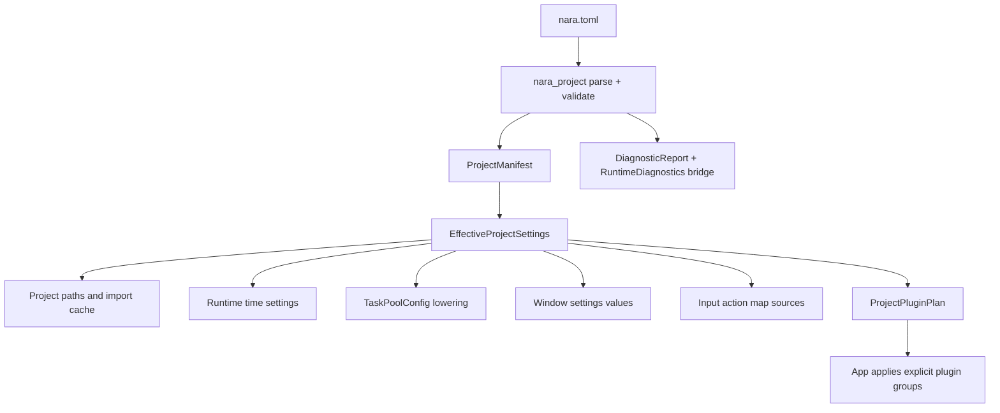
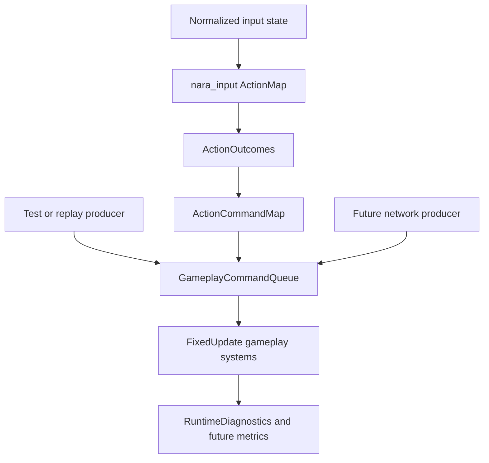
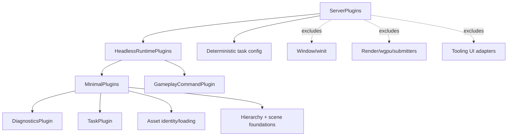

# Server-Ready Runtime Authority - Plan

## Goal Capsule

| Field | Contract |
|---|---|
| Objective | Make file-backed project settings, runtime diagnostics, headless/server plugin composition, input actions, and gameplay commands executable foundations instead of ADR-only policy. |
| Authority | ADRs 0035, 0041, 0048, 0052, 0055, and 0056 are the architectural source of truth. Existing pre-1.0 APIs may be broken or deleted when they preserve ambiguous runtime semantics. |
| Execution profile | Fearless refactor on `main`, with logical commits and pushes to `origin/main` as authorized by the user. |
| Compatibility posture | Prefer correct first-class crates and explicit plugin groups over compatibility shims around old defaults. |
| Stop conditions | Stop only for a contradiction with an accepted ADR, a discovered Cargo dependency cycle that changes the crate-boundary decision, or a manifest/profile default that cannot be resolved without product input. |
| Tail ownership | Implementation owns tests, code review, cleanup of dead attempts, engineering memory, commits, and pushes. |

---

## Product Contract

### Summary

This plan turns nara's next server-ready runtime slice into code.
It adds a pure `nara_project` manifest/profile lowering layer, a shared runtime diagnostics bus, explicit headless/server plugin groups, and the first semantic input-action to gameplay-command boundary.

### Problem Frame

nara now has a solid app/plugin/runtime lifecycle and clear ADR direction, but several future-expensive seams are still policy-only.
File-backed projects still have no concrete `nara.toml` parser or effective profile model.
Runtime diagnostics are split between bounded validation reports and domain-private state, which is not enough for headless processes.
Gameplay systems can still be written directly against raw input state because action outcomes and gameplay commands do not exist as first-class data.

Dedicated server networking is intentionally out of scope, but server readiness cannot wait for a networking crate.
The engine needs product-level profile composition, deterministic-friendly task/time settings, stable command envelopes, and diagnostics that work without windowing, rendering, editor UI, or a tracing subscriber.

### Requirements

**Runtime observability**

- R1. The runtime must expose a bounded `RuntimeDiagnostics` observation bus with stable entry fields, severity filtering, deterministic retention, dedupe, and explicit tracing emission.
- R2. Domain-specific diagnostics may remain local, but runtime-significant task, project, profile, input, and future server issues must be able to bridge into the shared bus.
- R3. Server/headless diagnostics and first metrics-style counters must be inspectable without editor UI, wgpu, winit, audio devices, or a tracing subscriber.

**Project settings authority**

- R4. Add `nara_project` as the pure authority for parsing, validating, and lowering file-backed `nara.toml` project settings.
- R5. The manifest schema must cover project identity, path roots, startup scene, runtime time defaults, task-pool defaults, window defaults, input action map sources, diagnostics settings, and named profile overlays.
- R6. Profile overlays must resolve deterministically into effective value objects; they must not directly create windows, task threads, GPU resources, asset values, or ECS worlds.
- R7. Code-first embedding must remain possible through explicit resources and plugin configuration, not through competing persistent config files.

**Headless and server composition**

- R8. Add explicit `HeadlessRuntimePlugins` and `ServerPlugins` product bundles that do not install window, render, audio-device, editor, egui, winit, or wgpu plugins by default.
- R9. Server-oriented composition must support deterministic task-pool configuration and fixed-step-friendly gameplay without making full lockstep determinism or networking a Phase 1 promise.
- R10. Project profiles must lower into plugin-plan values that can distinguish minimal, runtime 2D, desktop window, desktop wgpu, tooling, headless runtime, and server shapes.

**Input actions and gameplay commands**

- R11. `nara_input` must gain a small action-map/action-outcome layer above raw keys, mouse buttons, and pointer state.
- R12. Gameplay-facing systems must have a semantic command stream they can consume without depending on raw keyboard, mouse, pointer, window, or UI events.
- R13. The command envelope must carry source, tick/frame context, command type, optional stable target identity, and schema-friendly payload data while avoiding runtime `Entity` handles.
- R14. The first local action-to-command bridge must be transport-neutral so replay, AI drivers, and future networking can produce the same command shape.

**Documentation and verification**

- R15. Foundation docs, root exports, AGENTS guidance, and engineering memory must reflect the implemented names and boundaries.
- R16. Verification must include focused unit tests, workspace checks, serde checks for persistent/profile data, feature checks for optional backends, and dependency-boundary searches.

### Acceptance Examples

- AE1. A minimal valid `nara.toml` parses into a `ProjectManifest`, validates without errors, and resolves the default profile into effective settings without starting runtime services.
- AE2. A `server` profile resolves to deterministic task settings and a plugin plan that excludes window, render, audio-device, editor, egui, winit, and wgpu plugins.
- AE3. `ServerPlugins` installs core runtime, diagnostics, project-safe asset/scene foundations, and gameplay command resources while leaving render/window/tooling resources absent.
- AE4. Repeated identical runtime diagnostics dedupe into one entry with an incremented repeat count, while distinct entries retain insertion order until the configured capacity is reached.
- AE5. A key binding can produce an `ActionOutcome` without gameplay code reading `ButtonInput<KeyCode>` directly.
- AE6. A configured action outcome can produce a `GameplayCommandEnvelope` with a stable command type and no runtime `Entity` in the public command data.
- AE7. The same command queue can be populated by a local action bridge, test code, replay code, or future networking code without changing gameplay systems.

### Scope Boundaries

- No networking transport, protocol, replication algorithm, connection/session manager, or dedicated server binary is implemented in this plan.
- No full Bevy-style state machine, run-condition ecosystem, or schedule graph rewrite is implemented.
- No full text/IME, accessibility semantic tree, keyboard navigation, or editor shortcut router is implemented.
- No complete metrics subsystem is implemented; diagnostics gain metrics-compatible counters and context fields, but future metrics snapshots remain separate follow-up work.
- No full task backpressure rewrite is implemented; this plan may expose task diagnostics/profile settings, but bounded spawn outcomes and queue limits remain ADR 0052 follow-up unless directly needed.
- No full untrusted-input parse budget, asset-root symlink containment, package trust, or persistent file envelope migration is implemented beyond the project manifest loader paths touched here.
- No CI workflow is added because the user explicitly deferred CI; local feature and boundary checks remain the gate.
- No compatibility wrappers are kept for pre-1.0 names that would imply raw input or desktop profile defaults are the scalable server contract.

---

## Planning Contract

### Key Technical Decisions

- KTD1. `nara_project` is a pure validation and lowering crate.
  It reads project data into value objects and reports diagnostics; it does not spawn tasks, open windows, touch GPU resources, mutate `World`, or install plugins directly.
- KTD2. Effective settings are data, not behavior.
  Manifest plus profile resolves to `EffectiveProjectSettings` and a plugin-plan enum; app builders and examples choose how to apply those values.
- KTD3. The diagnostics bus lives in `nara_diagnostic`.
  Validation reports stay as `DiagnosticReport`, while frame/runtime observations use bounded `RuntimeDiagnostics` with explicit dedupe and tracing bridge.
- KTD4. Plugin bundles encode product profiles first.
  `MinimalPlugins` remains the smallest headless core, `HeadlessRuntimePlugins` adds richer headless runtime/gameplay foundations, and `ServerPlugins` applies server-safe task and command defaults without pretending to include networking.
- KTD5. Raw input remains observable but not the server-facing gameplay boundary.
  `ButtonInput` and `PointerState` stay useful for local code and adapters; action outcomes and gameplay commands become the scalable route for replay, AI, and server authority.
- KTD6. `nara_gameplay` owns command envelopes and queues.
  `nara_input` owns action maps and action outcomes; the bridge between them is explicit data and systems, not hidden in platform adapters.
- KTD7. Stable identity is represented as semantic command targets.
  The first command target vocabulary may use scene-stable identity and a reserved persistent runtime identity type, but it must not expose `bevy_ecs::Entity` as durable data.
- KTD8. Server readiness is deterministic-friendly, not deterministic-complete.
  The slice supports fixed-stage command application and deterministic task configuration, but cross-platform lockstep, rollback, replication, and authoritative networking remain future domain work.

### High-Level Technical Design

### Assumptions

- A1. The user has authorized direct work on `main`, breakage, deletion of obsolete pre-1.0 APIs, logical commits, and pushes to `origin/main`.
- A2. Adding small workspace crates is acceptable when it improves ownership boundaries.
- A3. A TOML parsing dependency is acceptable because `nara.toml` is the accepted project manifest format.
- A4. `nara_project` should depend on existing value crates, but those crates must not depend back on `nara_project`.
- A5. Server profile defaults can choose deterministic task pools now; threaded server pools can be exposed later as explicit project settings if workloads require them.
- A6. `nara_gameplay` may use schema-friendly payload values and stable IDs without introducing networking or script runtimes.
- A7. Subagents may inspect and review, but the orchestrating agent owns edits, authoritative verification, commits, and pushes.

### System-Wide Impact

- The root facade gains new public crate exports and plugin groups; default features must remain backend-free.
- `MinimalPlugins` membership may change if diagnostics becomes core runtime infrastructure; tests must pin the headless/no-render/no-window contract rather than the old exact member count.
- `nara_input` becomes more than raw retained state, so UI and future editor routing must use the same action/outcome vocabulary instead of private shortcut paths.
- Persistent data surfaces grow because manifests and command payloads are serializable when features enable serde; this requires unknown-field rejection and compatibility-minded tests.

### Risks and Dependencies

| Risk | Severity | Mitigation |
|---|---|---|
| `nara_project` grows into a hidden runtime service | High | Keep it side-effect-free and test that resolving profiles only returns values and diagnostics. |
| Command payloads overfit the first action-map bridge | Medium | Keep envelopes transport-neutral and command-type keyed; do not require every command to originate from input. |
| Diagnostics bus becomes gameplay control flow | High | Make entries observational and avoid systems that branch normal gameplay behavior on diagnostics. |
| Plugin group defaults conflict with code-first overrides | Medium | Let code-first apps install configured `TaskPlugin` or resources before group installation; groups use `add_plugin_if_missing`. |
| TOML dependency or serde feature boundaries leak into default runtime code | Medium | Keep parser code inside `nara_project`; keep serde derives behind existing feature conventions where practical. |

---

## Implementation Units

### U1. Runtime Diagnostics Bus

- **Goal:** Add the shared runtime observability surface required by ADR 0048 and server/headless output.
- **Requirements:** R1, R2, R3.
- **Dependencies:** None.
- **Files:** `crates/nara_diagnostic/Cargo.toml`, `crates/nara_diagnostic/src/lib.rs`, `src/lib.rs`, root plugin group tests, diagnostic tests.
- **Approach:** Add `RuntimeDiagnosticEntry`, `RuntimeDiagnosticContext`, `RuntimeDiagnosticDomain`, `RuntimeDiagnostics`, `RuntimeDiagnosticsSettings`, a dedupe key, capacity/drop counters, severity filters, domain/code filters, and explicit tracing emission.
  Add a lightweight `DiagnosticsPlugin` that installs `RuntimeDiagnostics` and keep `DiagnosticReport` as the bounded operation-report type.
  Update `MinimalPlugins` or the first headless groups to install diagnostics consistently.
- **Execution note:** Write ring-buffer and dedupe tests before wiring the plugin into root groups.
- **Patterns to follow:** Existing `DiagnosticReport` tests in `crates/nara_diagnostic/src/lib.rs`; ADR 0048 bus rules; root plugin group tests in `src/lib.rs`.
- **Test scenarios:**
  - Capacity overflow drops the oldest entries and records a dropped count deterministically.
  - Repeated entries with the same dedupe key increment repeat count and preserve first/last frame metadata.
  - Filtering by severity, domain, and code returns stable entry order.
  - `emit_to_tracing` is explicit; pushing diagnostics does not log implicitly.
  - `DiagnosticsPlugin` installs the bus without requiring backend features.
- **Verification:** Diagnostic tests and root plugin tests pass.

### U2. Project Manifest Schema and Profile Lowering

- **Goal:** Create `nara_project` as the concrete `nara.toml` authority for file-backed projects.
- **Requirements:** R4, R5, R6, R7, R10.
- **Dependencies:** U1 for diagnostic entry integration; the core parser can start independently with `DiagnosticReport`.
- **Files:** `Cargo.toml`, `crates/nara_project/Cargo.toml`, `crates/nara_project/src/lib.rs`, module files under `crates/nara_project/src/`, `src/lib.rs`, manifest tests.
- **Approach:** Add manifest structs for schema version, project identity, paths, startup, runtime time defaults, tasks, window defaults, input sources, diagnostics settings, and profile overlays.
  Parse from TOML, deny unknown fields in persisted data, validate required fields and logical paths, and return `DiagnosticReport` plus typed errors.
  Resolve profile overlays into `EffectiveProjectSettings` value objects and a `ProjectPluginPlan` without mutating runtime state.
- **Execution note:** Add minimal-valid, invalid, and overlay tests first so names stay stable while the crate grows.
- **Patterns to follow:** Asset path validation in `nara_asset`; runtime time settings in `nara_app`; task config in `nara_tasks`; ADR 0035.
- **Test scenarios:**
  - A minimal manifest with required schema and project name parses and validates.
  - Unknown TOML fields are rejected.
  - Invalid logical paths produce structured diagnostics rather than panics.
  - A named profile overlay deterministically overrides runtime, task, window, input, diagnostics, and plugin plan values.
  - Resolving an unknown profile returns a typed error and diagnostic.
  - Profile lowering does not install plugins or insert resources into a `World`.
- **Verification:** `nara_project` tests pass and root serde feature check compiles.

### U3. Headless and Server Plugin Groups

- **Goal:** Add explicit runtime product bundles for headless and server-ready composition.
- **Requirements:** R3, R8, R9, R10.
- **Dependencies:** U1 and U5 for diagnostics and gameplay command resources; can scaffold group names earlier if tests stay pending until dependencies land.
- **Files:** `src/lib.rs`, `crates/nara_tasks/src/lib.rs` only if server configuration helpers are needed, `examples/headless_server.rs` or equivalent headless example, root tests.
- **Approach:** Add `HeadlessRuntimePlugins` and `ServerPlugins`.
  `HeadlessRuntimePlugins` composes minimal headless foundations plus diagnostics and gameplay command resources.
  `ServerPlugins` pre-installs deterministic task pools when no task pools exist, then composes headless runtime foundations and excludes window/render/audio/editor/toolkit plugins by construction.
  Expose group metadata and make `nara_project::ProjectPluginPlan` map to these bundles without requiring backend features.
- **Execution note:** Let tests prove absence of resources from excluded domains; do not rely on human-readable group names only.
- **Patterns to follow:** Existing `MinimalPlugins`, `Runtime2dPlugins`, `DesktopWindowPlugins`, `DesktopWgpuPlugins`, and plugin metadata tests.
- **Test scenarios:**
  - `HeadlessRuntimePlugins` installs runtime diagnostics and gameplay command resources.
  - `ServerPlugins` installs deterministic `TaskPools` when no explicit task pools were configured.
  - `ServerPlugins` does not install `RenderFrame`, sprite/UI batches, window resources, tooling workspace, egui, winit, or wgpu-backed resources.
  - Installing a custom `TaskPlugin` before `ServerPlugins` preserves the explicit code-first override.
  - `ProjectPluginPlan::Server` maps to server group selection without enabling backend features.
- **Verification:** Root plugin tests and default workspace check pass.

### U4. Input Action Outcomes

- **Goal:** Add the smallest useful action-map layer above raw retained input state.
- **Requirements:** R11, R14.
- **Dependencies:** U1 only if action diagnostics bridge to runtime diagnostics; otherwise independent.
- **Files:** `crates/nara_input/src/lib.rs`, root prelude exports, input tests.
- **Approach:** Add `ActionId`, `ActionMap`, `ActionBinding`, `ActionPhase`, `ActionValue`, `ActionOutcome`, `ActionOutcomes`, and an input resolve set that turns current keyboard/mouse transitions into semantic outcomes.
  Keep low-level `ButtonInput` and `PointerState`.
  Make action outcomes frame-transient and owner-cleared in the declared input lifecycle.
  Reserve handled/consumed context without implementing the full UI focus, text/IME, or accessibility stack.
- **Execution note:** Start with tests that currently require reading `ButtonInput` directly, then move them to action outcomes.
- **Patterns to follow:** Existing input transition cleanup; ADR 0041; window event retention rules in ADR 0036.
- **Test scenarios:**
  - A key press binding produces one pressed/start outcome and clears after the frame.
  - A key release binding produces a release outcome.
  - Multiple bindings for one action resolve deterministically.
  - Disabled action contexts do not produce outcomes.
  - Raw `ButtonInput` remains available for local code, but action tests do not require gameplay systems to read raw keys.
- **Verification:** Input tests pass and root prelude exports the gameplay-facing action types.

### U5. Gameplay Command Stream

- **Goal:** Add the semantic command boundary consumed by gameplay, replay, AI drivers, and future server authority.
- **Requirements:** R12, R13, R14.
- **Dependencies:** U4 for local action bridging.
- **Files:** `Cargo.toml`, `crates/nara_gameplay/Cargo.toml`, `crates/nara_gameplay/src/lib.rs`, `src/lib.rs`, gameplay tests.
- **Approach:** Add `GameplayCommandTypeId`, `GameplayCommandSource`, `GameplayTick`, `PersistentRuntimeEntityId`, `GameplayCommandTarget`, `GameplayCommandEnvelope`, `GameplayCommandQueue`, `ActionCommandMap`, and `GameplayCommandPlugin`.
  Support command producers from input actions, tests, replay, AI, or future networking by keeping the public queue transport-neutral.
  Use schema-friendly optional payload data and stable target identity; reject or avoid runtime `Entity` in public command envelopes.
  Add a system that maps action outcomes into command envelopes at a declared stage before fixed gameplay systems consume them.
- **Execution note:** Command queue lifecycle must be explicit: producers append, gameplay systems observe or mark processed, and the owner cleanup policy is tested.
- **Patterns to follow:** `nara_input` frame-transient resources; `SceneEntityId` stable identity model in `nara_scene`; ADR 0056 input/command sequence.
- **Test scenarios:**
  - Test code can push a command envelope without input or networking.
  - Action outcomes map to command envelopes with deterministic source, tick, type, target, and payload.
  - Public command target types do not include runtime `Entity`.
  - Commands remain available for fixed gameplay consumption and are cleared only by the documented owner policy.
  - Multiple command producers preserve deterministic ordering for the same frame/tick.
- **Verification:** Gameplay tests pass and dependency searches show no networking transport crates introduced.

### U6. Project Profile Application Example and Documentation

- **Goal:** Prove the manifest/profile and server-ready runtime path works as a user-facing code pattern.
- **Requirements:** R3, R6, R7, R8, R9, R10, R15.
- **Dependencies:** U1 through U5.
- **Files:** `examples/headless_server.rs` or `examples/project_profile.rs`, `docs/architecture/nara-foundation.md`, `AGENTS.md`, `docs/architecture/open-questions.md`, `docs/knowledge/engineering/*`, `src/lib.rs`.
- **Approach:** Add a backend-free example that parses or constructs effective project settings, applies a server/headless plugin plan, inserts settings resources explicitly, produces an action or command, and runs a frame without window/render/audio/editor resources.
  Update foundation docs, open questions, and AGENTS guidance with the exact implemented names.
  Add an engineering memory shard with verification evidence and remaining deferred work.
- **Execution note:** Do not edit this plan for progress; record progress in commits, verification docs, and engineering memory.
- **Patterns to follow:** Existing examples under `examples/`; engineering memory shards under `docs/knowledge/engineering/verification` and `docs/knowledge/engineering/decisions`.
- **Test scenarios:**
  - The headless example compiles with default features.
  - Documentation no longer calls `nara_project`, server plugin groups, or gameplay commands future-only once implemented.
  - Open questions resolved by implementation are removed or narrowed.
- **Verification:** Documentation links are repo-relative, engineering memory validates, and `git diff --check` passes.

---

## Verification Contract

| Gate | Applies to | Done signal |
|---|---|---|
| `cargo fmt --all` | All units | Formatting completes without unrelated churn. |
| `cargo check --workspace` | All units | Workspace compiles with default backend-free features. |
| `cargo nextest run --workspace` | All behavior-bearing units | Full test suite passes. |
| `cargo check --workspace --features serde` | `nara_project`, diagnostics, gameplay payloads, input settings | Serde-enabled workspace compiles. |
| `cargo check -p nara --example headless_server` or equivalent new backend-free example | Headless/server profile path | Example compiles without optional backend features. |
| `cargo check -p nara --features winit,wgpu --example windowed_clear` | Root plugin group and facade changes | Desktop clear example still compiles. |
| `cargo check -p nara --features winit,wgpu --example windowed_sprites` | Root plugin group and action exports | Sprite example still compiles. |
| `cargo check -p nara --features winit,wgpu --example runtime_ui_panel` | Input/UI/render seam safety | Runtime UI example still compiles. |
| `cargo check -p nara --features asset-watch` | Root feature and diagnostics interaction | Asset-watch feature still compiles. |
| `rg -n "winit::|winit =" crates src Cargo.toml` | Backend boundary | `winit` remains confined to adapter crates and feature declarations. |
| `rg -n "wgpu::|wgpu =" crates src Cargo.toml` | Backend boundary | `wgpu` remains confined to backend crates and feature declarations. |
| `rg -n "egui::|egui =" crates src Cargo.toml` | Tooling boundary | egui remains confined to tooling adapter crates and feature declarations. |
| `rg -n "notify::|notify =" crates src Cargo.toml` | Watch boundary | notify remains confined to asset-watch adapter crates and feature declarations. |
| `rg -n "bevy_ecs::Entity|Entity" crates/nara_project crates/nara_gameplay` | Durable identity boundary | Public manifest and command data do not serialize runtime entity handles. |
| `git diff --check` | All units | No whitespace errors. |
| `python C:\Users\Frankorz\.codex\skills\engineering-wiki-memory\scripts\wiki_memory.py validate --root docs\knowledge\engineering` | U6 | Engineering memory validates. |

If `cargo nextest` is unavailable, use the closest `cargo test --workspace` fallback and record the fallback.
If a unit touches file-backed loader paths beyond manifest parsing, it must either add the relevant ADR 0049 budget guard or prove the change stays encode-only/in-memory.

---

## Definition of Done

- U1 through U6 are complete or a real blocker is surfaced with the contradicted ADR or requirement.
- `nara_project` exists as the side-effect-free manifest/profile authority and is exported by the root facade.
- Runtime diagnostics have a shared bounded bus and explicit tracing bridge.
- Headless/server plugin groups exist, are tested, and do not install excluded desktop/editor/render/audio resources by default.
- Input action outcomes and gameplay command envelopes exist as first-class data with a tested local action-to-command bridge.
- Public command data avoids runtime `Entity` handles and networking transport types.
- Backend-free examples still work and at least one headless/server profile example compiles.
- The Verification Contract has been run or any unavailable gate is recorded with replacement evidence.
- Documentation and engineering memory reflect implemented names and remaining deferred work.
- The working tree contains no abandoned experiments, compatibility shims that preserve obsolete semantics, or stale docs contradicting the new design.
- Logical commits have been made with Conventional Commit messages and pushed to `origin/main`.
