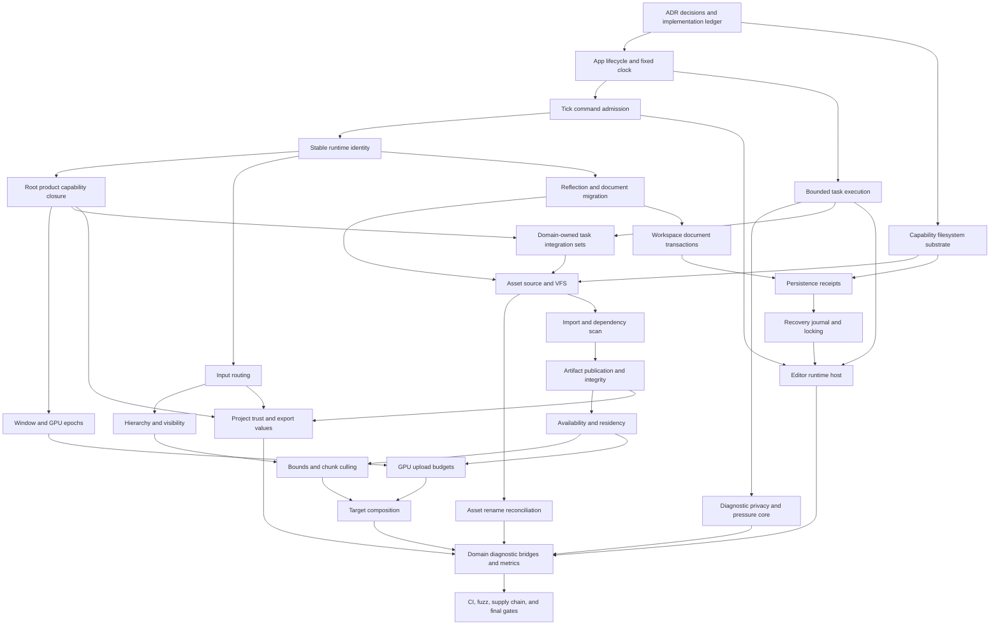
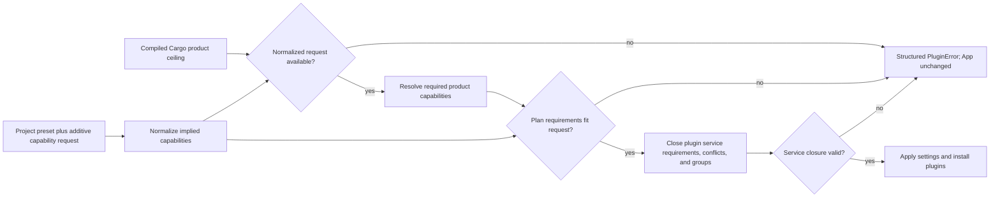
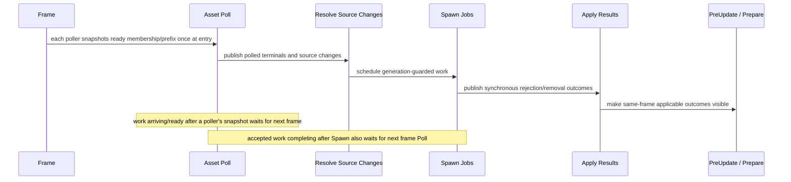
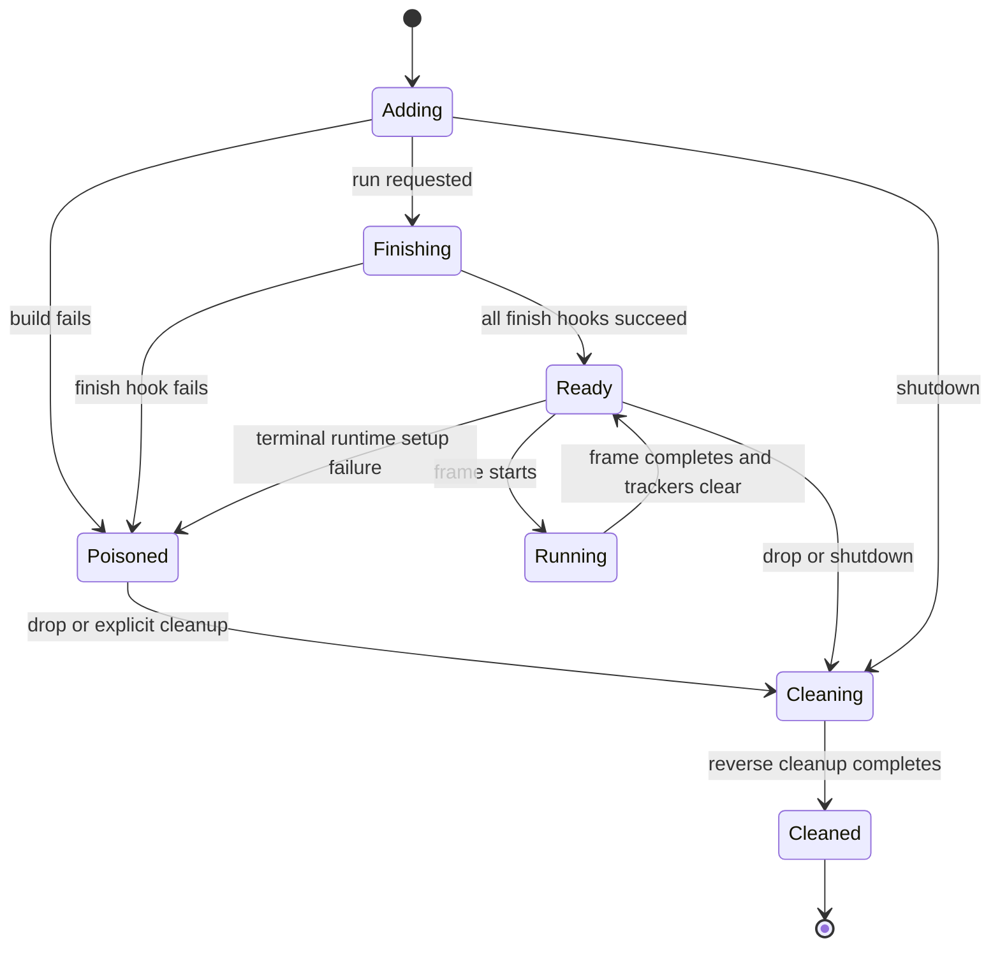
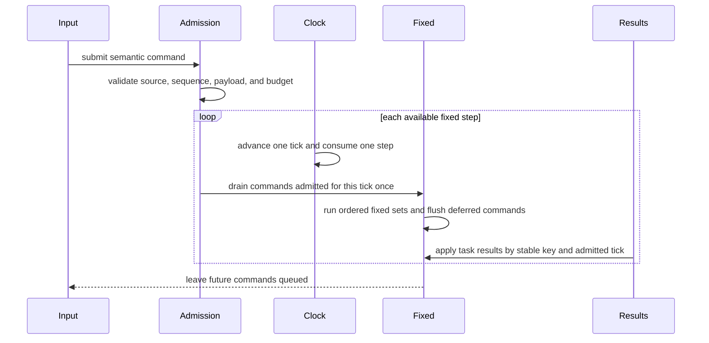
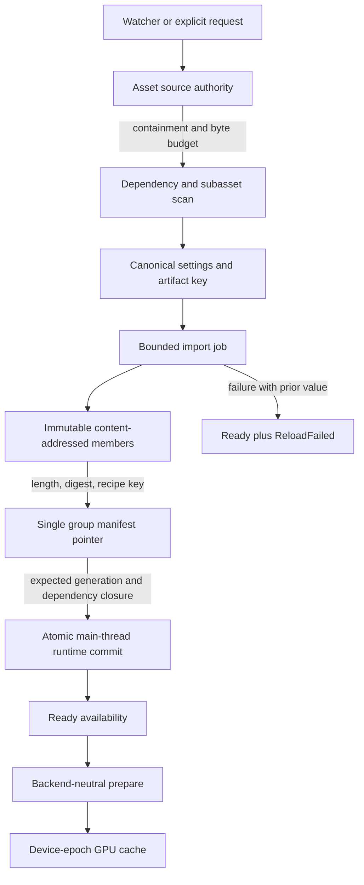
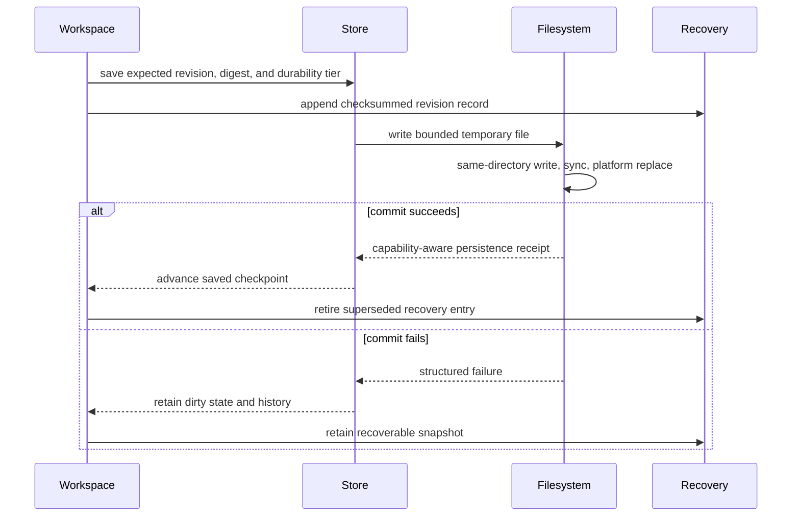

# Engine Foundation Contract Completion - Plan

## Goal Capsule

- **Objective:** Complete the engine-wide lifecycle, determinism, persistence, asset, rendering, editor, observability, and quality contracts found incomplete by the July 2026 architecture audit.
- **Authority:** This plan is subordinate to `AGENTS.md` and accepted ADRs, but it may revise ADRs whose documented contract is incomplete or contradicted by current code.
- **Execution profile:** Fearless pre-1.0 refactoring is authorized. Remove obsolete APIs and update all in-repo callers instead of adding compatibility layers.
- **Preserved boundaries:** Keep `bevy_ecs` as the ECS substrate, keep nara's fallible `App`, keep backend crates isolated, keep persistent data free of runtime `Entity`/`AssetId`/native handles, and keep `CoreStage::TaskUpdate` as the main-thread task integration point.
- **Stop conditions:** Pause at each milestone evidence gate. Continue when its load-bearing decisions are supported, revise this plan and affected ADRs when evidence falsifies them, and stop only for a product-scope contradiction, unclear third-party licensing, or an external dependency/API decision that cannot be resolved from the repository and named reference engines.
- **Tail ownership:** `ce-work` owns implementation, focused commits, simplification, review follow-up, and the full verification matrix. Execution progress stays in engineering memory and git, not this plan.

---

## Product Contract

### Summary

Replace the engine's incomplete foundation semantics with explicit state machines, bounded queues, transactional persistence, trust-aware asset IO, generation-safe rendering, and recoverable editor workflows. The result must remain backend-free by default, deterministic-friendly for servers, inspectable without UI, and intentionally breaking where the current API encodes unsafe or false guarantees.

### Problem Frame

nara has strong crate boundaries and 56 accepted architecture decisions, but decision acceptance has been treated as implementation completion. The current code still contains unsafe surface lifetime ordering, plugin failure corruption, ambiguous fixed-step command delivery, missing Bevy ECS frame cleanup, unbounded task queues, bypassable asset containment, cross-device GPU cache reuse, editor data-loss paths, and persistent formats without the accepted migration envelope.

The existing 335-test baseline is useful regression evidence but does not cover zero/multiple fixed ticks, failure poisoning, queue overload, task panic, filesystem indirection, device regeneration, atomic save, or document migration failures. This plan treats those negative paths as product contracts rather than incidental implementation details.

### Requirements

**Architecture governance and compatibility**

- R1. ADRs must distinguish decision status from implementation status and link implemented claims to code and verification evidence.
- R2. Breaking replacements must remove obsolete APIs and update every in-repo caller, example, facade export, and document without compatibility shims.
- R3. Root Cargo features must define coarse compiled product capabilities; the required product capabilities of a resolved plugin plan must be a subset of the normalized project request, which must be a subset of that compiled ceiling. Plugin service requirements/conflicts close separately, and any product or service closure failure must return structured `PluginError` before `App` mutation. The default compiles only `runtime-core` and remains backend-free, while `ServerPlugins` remains free of window, render, audio-device, editor, toolkit, and raw-input resources.

**App lifecycle, time, commands, and tasks**

- R4. Plugin lifecycle must distinguish pre-mutation rejection, prepared-but-uncommitted failure, committed-plugin failure, and cleanup failure. Built-ins may retry only when a registered preparation/teardown token proves no mutation committed; otherwise `App` becomes terminally poisoned, preserves the first setup error, aggregates cleanup errors separately, cleans committed plugins once in reverse order, and never executes a schedule.
- R5. All built-in plugin and codec prerequisite failures must return contextual `PluginError` values rather than panic.
- R6. Fixed update must expose a monotonic tick, per-tick delta and elapsed time, bounded catch-up debt, interpolation remainder below one tick, and explicit schedule/flush ordering.
- R7. Each completed app frame must establish a Bevy ECS tracker boundary, including removal retention and direct change tracker cleanup.
- R8. Gameplay commands must be admitted to an authoritative tick, ordered deterministically, retained across zero-tick frames, consumed exactly once, and reject invalid, duplicate, late, non-finite, or over-budget payloads.
- R9. Task pools must use bounded queues, explicit accepted/rejected/coalesced outcomes, panic isolation, race-safe cancellation, finite shutdown policy, age/failure statistics, and deterministic main-thread result ordering independent of worker completion order. `nara_app` owns only the `CoreStage::TaskUpdate` integration point, business domains own their integration sets, and `nara_tasks` must not configure domain-specific schedule phases.

**Input, hierarchy, and identity**

- R10. Input must separate physical controls, logical keys, text/IME, retained device state, toolkit-independent UI semantic actions, UI routing, action resolution, and gameplay command mapping. Focus loss must atomically cancel IME and pointer capture before synthesizing retained releases, and repeated loss must not duplicate terminal events.
- R11. Parent mutation, child derivation, transform propagation, inherited visibility, invalid-edge handling, and despawn/orphan behavior must be explicit and scheduled before extraction.
- R12. Runtime entity identity must separate namespace, lifetime, serialization, fork/clone, unload/tombstone, and lookup authority for scene-local, scene-instance, persistent-runtime, and ephemeral `Entity` axes. A world-owned identity domain may index them, but no persistent value may serialize runtime `Entity` values.

**Reflection, documents, and prefabs**

- R13. Component and field capabilities must be conservative and explicit, include save and split script permissions, gate whole-value export/apply when fields differ, and become immutable after registry freeze.
- R14. Scene, prefab, patch, asset metadata, artifact, schema catalog, and editor recovery-journal files must use a common envelope or explicitly versioned record header, publish a `kind x format_version` compatibility matrix, decode document shape before component values, reject unknown or over-budget data on strict paths, and have canonical golden fixtures. Because nara is unreleased, superseded draft shapes/readers/fixtures are deleted and the correct contract becomes canonical `format_version = 1`; migration chains exist only for compatibility windows an ADR explicitly chooses to preserve.
- R15. Scene export/spawn, document migration, reload, and Apply Changes failures must not publish partial documents, mutate the target world, or discard the last valid authoring state.
- R16. Prefab projection identity must preserve source prefab, source entity, anchor, and instance-chain provenance; nested overrides and reference rewrites must address projected descendants deterministically.

**Assets and project IO**

- R17. All file-backed project-manifest, asset, editor, and cache reads/writes must use host-issued directory/file capabilities and a shared capability-oriented filesystem substrate that binds resolution and open/replace to verified parent handles, enforces trust and aggregate byte budgets, rejects unsupported hardlink/mount/volume/reparse cases in untrusted mode, and never returns an authorization-checked raw path to domain callers. Host/composition code reads bounded `nara.toml` bytes through `nara_fs`; `nara_project` only parses, validates, and lowers an immutable candidate.
- R18. Stable asset IDs must be unique within their declared source/project namespace and fail closed on duplicate claims. Same-source rename must preserve identity through an idempotent recoverable transaction that converges path, metadata, dependencies, handles, generation, and pending reload state; cross-source moves must use an explicit copy-validate-publish-delete policy or fail structurally.
- R19. Import jobs must use an engine-built or externally host-approved registered importer and canonical settings hash, bound the full dependency/subasset closure and execution time, require cooperative deadline/cancellation checks, include importer/toolchain/target compatibility in artifact identity, and publish immutable content-addressed artifact members through one verified group manifest pointer.
- R20. Asset availability and latest load operation must be independent so a failed reload preserves and reports the last-good value; residency and ownership policy must be implementable rather than aspirational.
- R21. Project profiles must validate runtime, task, input, trust, budget, and export settings; effective settings must actually configure installed plugins without turning `nara_project` into a side-effect owner. Project content can only lower trust: an external host trust store binds approval to canonical root identity, manifest digest, and approved native-module digests and revokes it on any mismatch.

**Windowing and rendering**

- R22. A GPU surface must own the raw-window-handle lifetime lease and be destroyed before the platform guard; desktop feature omissions must fail structurally instead of silently running one frame.
- R23. Adapter selection, device loss, surface loss, OOM, validation, content errors, and transient acquire failures must be classified; every cache key must include `DeviceDomainId` and device epoch, even while only one domain is instantiated, and a new epoch must invalidate every device-owned cache before reuse.
- R24. Each render target must be acquired and presented once per frame while ordered camera views compose through clear/load/store, viewport, scissor, and UI clip semantics.
- R25. Color-space and alpha semantics, visibility/culling, upload byte budgets, dynamic buffer reuse, and per-target diagnostics must be explicit and enforce backend limits before allocation.

**Editor, diagnostics, and production quality**

- R26. Editor close, save, external reload, conflict resolution, undo/redo, and dirty state must use validated document transactions, an explicit close-confirmation state machine, durability-tier persistence receipts, saved checkpoints, same-directory capability-bound replacement, and bounded checksummed recovery journals whose committed records cannot be resurrected.
- R27. Play Mode must own an isolated runtime `App` host with a closed Starting/Running/Paused/Stepping/Stopping/Stopped/Failed lifecycle, schedules, time, tasks, services, idempotent bounded shutdown, and an explicit resource fork/share policy.
- R28. Runtime-significant asset, watcher, task, window, render, project, and editor failures must bridge into bounded `RuntimeDiagnostics` through source-classified structured fields; metrics and pressure counters must remain distinct from free-text diagnostic events and raw secrets must never enter messages or dedupe keys.
- R29. Runtime and untrusted-parser budgets must cover bytes, items, nesting, time, and cumulative snapshots, remain domain-owned until at least two domains prove identical invariants, apply profile-specific overload policy, redact sensitive diagnostic fields, and expose pressure snapshots in headless/server profiles.
- R30. CI must enforce formatting, workspace tests/checks, serialization and optional feature matrices, backend dependency boundaries, golden/property/fuzz tests, executable-dependency inventory, dependency policy, and the declared licensing/security baseline on ephemeral least-privilege PR runners.
- R31. Every public or persistent breaking change must ship an English migration note that names the removed contract, canonical replacement or deletion rationale, affected examples/fixtures, and any required cache rebuild or source rewrite. Public Rust replacements use the canonical unsuffixed name rather than parallel `V1`/`V2` APIs; notes describe deliberate incompatibility but must not preserve obsolete code.

### Acceptance Examples

- AE1. Given a plugin whose `finish` fails after earlier plugins finished, when the app is run again, then no schedule executes, the original failure remains inspectable, and every installed plugin is cleaned up once in reverse order.
- AE2. Given a frame with zero fixed steps followed by a frame with three fixed steps, when one local action is submitted, then it is retained and consumed by exactly one authoritative tick.
- AE3. Given five ticks of accumulated time with a two-step cap, when the frame runs, then the configured debt policy is observable and render interpolation remains in `[0, 1)`.
- AE4. Given a task queue at capacity or a task that panics, when work is submitted, then the caller receives a bounded outcome, workers remain usable, and no task silently executes on the caller thread.
- AE5. Given focus loss while keys, mouse buttons, or pointers are held, when the platform event is processed, then cancellation/release observations are produced and gameplay state cannot remain stuck.
- AE6. Given a hidden parent with visible descendants, when extraction runs, then descendants are not emitted; a missing or cyclic parent produces a deterministic diagnostic rather than silent stale hierarchy.
- AE7. Given every version fixture declared supported by a format's compatibility matrix, when it is loaded directly or through an explicitly retained migration chain, then it produces the canonical version-1 candidate before component decoding and any failure leaves source bytes and runtime state unchanged.
- AE8. Given a nested prefab override targeting a projected descendant, when the source prefab reloads or an entity is renamed, then the override and entity references either rebase atomically or report a non-destructive conflict.
- AE9. Given an in-root symlink or Windows junction that is swapped before open, when an importer reads the path, then handle-bound source resolution rejects it before any external bytes are returned.
- AE10. Given a process interruption at any same-source rename stage and duplicate or reordered watcher events after restart, when reconciliation completes, then exactly one path is authoritative and the stable ID, generation, handle, metadata, and dependency indexes converge.
- AE11. Given a failed image reload with a valid previous generation, when consumers query state, then availability remains ready and the latest operation reports reload failure.
- AE12. Given a device-loss recovery, when a new device is installed, then no old surface, pipeline, layout, bind group, texture, sampler, or dynamic buffer is reused.
- AE13. Given two cameras targeting one window, when a frame renders, then the surface is acquired and presented once and both viewports compose in declared order without losing UI clips.
- AE14. Given a dirty editor document and an interruption at any journal/write/sync/replace stage, when the workspace reopens, then it reads either the complete old or new file, issues no false receipt, preserves the longest valid journal prefix, and never overwrites a newer disk baseline.
- AE15. Given Play Mode is paused and stepped once, when the host advances, then exactly one fixed tick runs inside the isolated runtime and Stop Play disposes services without mutating the edit world.
- AE16. Given an artifact group write is interrupted or a member is truncated/substituted, when the cache is reopened, then only the last fully verified manifest is visible, last-good runtime content remains active, and orphan candidates are quarantined or reclaimed.
- AE17. Given a minimal headless project using `ServerPlugins`, when it advances a deterministic command stream, then fixed ticks run without window/render/raw-input resources and produce the same admitted command order across repeated runs.
- AE18. Given a desktop 2D project with one imported image, sprite, camera, and runtime UI panel, when it starts and the image reloads, then the window renders the last-good asset through the normal import/prepare/material path without direct filesystem or backend-handle shortcuts.
- AE19. Given an editor user opens a scene, edits and saves it, enters Play, pauses and steps once, stops, closes, and reopens the project, then the saved edit state is restored, Play mutations are absent, and no false dirty/saved state appears.
- AE20. Given a public Rust API or persistent-format replacement, when a downstream developer reads the migration note, then every removed symbol/shape has a named replacement or explicit deletion rationale and all in-repo examples demonstrate only the new contract.
- AE21. Given a project requests a product capability absent from the compiled Cargo feature ceiling, when composition is resolved, then a structured `PluginError` is returned before any resource, plugin, group membership, schedule, or lifecycle state is mutated.
- AE22. Given a current-generation, expected-version eligible, predecessor-unblocked asset terminal ready before its poller captures the entry snapshot, a worker terminal that becomes ready after that snapshot, and an eligible synchronous rejection produced during SpawnJobs, when `TaskUpdate` runs, then the first and third must apply before same-frame `PreUpdate`/`Prepare`, while the second cannot be observed or applied before the next frame. Completion during the Poll set but after that poller's snapshot follows the second case; an observed outcome that becomes stale before ApplyResults is retired once rather than buffered or retried.

### Primary Users and Success Journeys

1. Desktop 2D game developers are the first product priority: import assets, render a windowed scene, author/save scenes, and run isolated Play Mode without data loss.
2. Headless/server developers are the second priority: run bounded deterministic-friendly simulation and semantic commands without backend or raw-input dependencies.
3. Engine maintainers are the enabling priority: inspect failures, migrate formats, recover interrupted writes, and evolve pre-1.0 APIs through explicit evidence and migration notes.

AE17-AE20 are the end-to-end product journeys. Unit-level negative-path contracts remain mandatory because these journeys cannot prove overload, interruption, trust, or recovery semantics alone.

### Initial Platform Support Matrix

| Platform | Workspace/headless | Serde/formats | Desktop adapter compile/examples | GPU smoke | Filesystem security/durability | Status after this plan |
|---|---|---|---|---|---|---|
| Windows x86_64 | Required locally and hosted | Required | Required locally and hosted | Required on an available physical adapter; otherwise record an explicit hardware skip while pure epoch/target tests remain required | Required junction/reparse/replace/lock tests; privileged-only cases use identity-classification fixtures | Supported reference host |
| Linux x86_64 | Required hosted; local when available | Required hosted | Required hosted | Required only where the runner exposes a usable adapter; compile and pure GPU-state tests are never optional | Required symlink/hardlink/permission tests; mount/device boundary uses unprivileged integration where possible plus fixtures | Supported headless; supported desktop adapter with declared hardware evidence |
| macOS arm64/x86_64 | Required hosted | Required hosted | Required hosted | Required only where the runner exposes a usable adapter; compile and pure GPU-state tests are never optional | Required symlink/hardlink/replace tests and capability-tier reporting | Supported headless; supported desktop adapter with declared hardware evidence |
| Other targets | Not required | Not required | Optional experiment | Unsupported | Unsupported | Experimental until an ADR names a consumer and exact matrix |

### Scope Boundaries

**Included**

- Every code-bearing P0/P1 defect from the July 10 audit, including breaking public API changes needed to remove false guarantees.
- ADR governance and revisions needed to make the implementation contract unambiguous.
- First shared capability filesystem substrate, file-source/VFS, editor filesystem adapter, device-domain epoch, runtime host, metrics, and CI implementations sufficient to prove the contracts.
- Root product capability closure, domain-owned task integration sets, and retirement of placeholder crates without real consumers.

**Deferred to Follow-Up Work**

- Full cross-platform lockstep, rollback networking, save-game journaling, and remote asset sources; the identity, tick, command, and source contracts in this plan must leave them implementable.
- Full render graph/render world, HDR tone mapping, arbitrary offscreen graph scheduling, and multiple active GPU device domains. Multiple domains are reconsidered when active surfaces have no common adapter, users require explicit eGPU/adapter selection, or required feature sets are mutually incompatible.
- Rich text shaping, localization catalogs, full accessibility backend integration, animation graph, audio DSP, and WASM guest runtime; their ADRs must be written immediately before their first implementation slice.
- Intrinsic runtime UI measurement and the final `Auto/Content` sizing model; it must land with a real image/text/child measurement source and a persistent-style migration rather than a placeholder semantic rename.
- Remote telemetry upload, crash-symbol service, package signing, console export, and marketplace policy; local privacy, trust, and reproducibility foundations are included now.

**Outside this plan**

- Replacing `bevy_ecs`, adopting `bevy_app`, adopting a Godot-style node/object runtime, or exposing backend-native handles to gameplay/persistent data.
- Adding a compatibility layer for APIs this plan replaces.
- Claiming to sandbox arbitrary in-process native Rust plugins or importers. Untrusted and recovery modes reject them before construction; future isolation requires a process or capability-limited guest boundary.

---

## Planning Contract

### Key Technical Decisions

- KTD1. **Classify plugin mutation before poisoning.** A built-in plugin may use a prepare/commit/teardown token and remain retryable only when failure evidence proves no world/schedule mutation committed. Arbitrary build/finish hooks default to committed-on-entry: failure poisons the app, preserves the first setup error, aggregates cleanup failures separately, and prohibits further build/finish/run operations.
- KTD2. **Advance fixed time one tick at a time.** The accumulator reports available work, but each fixed schedule iteration advances tick, delta, and elapsed before systems run. Interpolation uses only the sub-tick remainder.
- KTD3. **Admit commands before consumption.** Local frame actions target the next authoritative tick; explicit replay/server commands carry source and sequence. Commands are ordered by tick/source/sequence and acknowledged once.
- KTD4. **Make deterministic integration independent of execution backend.** Threaded workers are allowed in server profiles; determinism applies to result keys, admission ticks, and main-thread application order. A separately named inline executor remains for tests.
- KTD5. **Separate physical, logical, text, and semantic UI input.** Serializable gameplay bindings use physical controls by default, logical keys remain UI-oriented, IME/text events never masquerade as key identity, and toolkit-independent `Navigate`/`Activate`/`Cancel`/focus actions share the same-frame focus and gameplay-suppression route as pointer input.
- KTD6. **Treat `Parent` as authored intent and `Children`/global transform/inherited visibility as derived state.** Scene preflight rejects invalid graphs; runtime validation diagnoses and detaches invalid edges through a declared policy.
- KTD7. **Use an explicit world identity domain.** Scene-local ID, scene-instance ID, persistent runtime ID, and runtime `Entity` are separate axes connected by indexes and remap tables. Their namespace, lifetime, serialization, fork, restore, unload, tombstone, and lookup invariants must be proven in a two-world fork/reload spike before document or Play Mode consumers depend on them. A parallel fork receives a new world domain and explicit remap; a same-timeline restore preserves or explicitly rewrites semantic identity so later recorded commands still resolve.
- KTD8. **Freeze reflection registration.** Capability defaults are empty, mutation APIs cannot bypass stable schema ownership after startup, and mixed-capability whole-value writes are rejected until a field projection is used.
- KTD9. **Decode the envelope before payloads.** Domain-neutral envelope/version values live below format owners, while each kind owns its strict compatibility matrix. Unreleased superseded shapes are deleted and the corrected envelope becomes canonical version 1; when an ADR explicitly retains an older version, pure document migration runs before component migration/validation and composed/stepwise results must agree. Runtime loading never rewrites sources.
- KTD10. **Make asset sources the only byte authority.** File sources resolve and open relative to a host-issued root capability so authorization and access cannot be separated by a link/reparse race. Importers receive approved bytes/streams and dependency handles, never checked raw paths. The sidecar location owns the current logical path; metadata owns stable ID and import recipe; a namespace index rejects duplicate stable-ID claims without mutating handles, generations, dependencies, or publication pointers.
- KTD11. **Split asset availability from operation outcome.** Ready content can coexist with a failed reload. Residency uses explicit leases/pins and generations rather than pretending a copyable handle is a strong owner.
- KTD12. **Bind all GPU resources to a device domain and epoch.** Every surface and device-owned cache key includes `DeviceDomainId` plus epoch. This phase instantiates one domain and fails explicitly when one adapter/device cannot support all active surfaces; the identity seam prevents a later multi-domain implementation from rewriting resource identity.
- KTD13. **Let render targets own frame submission.** Acquire/present happens per target, camera views only contribute ordered passes, and viewport/scissor/clip are preserved to backend commands.
- KTD14. **Require capability-aware persistence receipts.** Editor state becomes clean only after a platform adapter operating under a host-issued directory capability reports the actual naming/durability tier reached for the expected document revision/content digest. Temporary files stay beside the target, replacement is platform-specific, and recovery journal retirement happens only after receipt persistence.
- KTD15. **Make Play Mode a real `App`.** The editor owns a runtime host factory and lifecycle but does not move the edit `World` into play; resource sharing is allowlisted and mutable runtime services are isolated.
- KTD16. **Establish diagnostic privacy early and bridge domains late.** `nara_diagnostic` first owns bounded entries, sensitivity classes, safe summaries, dedupe, retention, and pressure snapshots. Foundation crates retain typed errors without depending upward; composition plugins add bridges only after each producer's errors stabilize. Secrets and raw sensitive values never enter `Display`, serialization, logs, provenance, journals, or dedupe keys.
- KTD17. **Separate decision and implementation status.** Accepted ADRs describe chosen direction; an implementation ledger records partial/implemented status, code anchors, tests, owner, and trigger.
- KTD18. **Share units before sharing budget policy.** `nara_core` may own unit-safe non-zero item/byte/depth/time scalar values. Task, parser, asset, render, and journal domains own their budget structures, overload outcomes, composition, and serialization until two independent implementations demonstrate identical invariants; only then may the common contract be promoted. Diagnostics aggregate pressure snapshots and never enforce domain policy.
- KTD19. **Keep first prefab rewrite transactions document-local.** The owning document plus workspace selection/history commits atomically; dependencies outside that transaction produce indexed non-destructive conflicts instead of pretending an all-project transaction exists.
- KTD20. **Publish immutable artifact groups through one pointer.** Content-addressed members are written and verified first; the only publication point is the group manifest/index reference. Unreferenced candidates are recoverable garbage, and integrity checks do not claim package authenticity.
- KTD21. **Share capability-oriented filesystem primitives, not domain transactions.** A low-level `nara_fs` adapter owns host-issued directory/file capabilities, relative no-follow open, identity checks, exclusive temporary creation, replace, sync, lock, and digest primitives. Asset, editor, and future export domains retain their own transaction state machines and must justify any duplicate platform algorithm.
- KTD22. **Keep trust authority outside project content.** A host trust store binds approval to canonical project-root identity, project-manifest digest, and each approved native module digest. Project settings may request or lower capabilities but cannot grant them; copied/replaced roots or changed content downgrade to untrusted until explicitly approved again.
- KTD23. **Gate downstream work on falsifiable milestone evidence.** Stable U-IDs identify work items rather than execution order. Each milestone records continue/revise/abort evidence for its load-bearing lifecycle, identity, filesystem, asset, and GPU/editor decisions before dependent units open.
- KTD24. **Treat compile, request, product installation, and plugin services as explicit closures.** Coarse root features define the compiled product ceiling; the resolved plan's required product capabilities must fit the normalized additive project request, which must fit that ceiling; plugin `provides`/`requires` services close separately before touching `App`. `default = ["runtime-core"]`; `serde` weak-forwards only into already enabled domains; placeholder crates without a real consumer are removed rather than granted empty capabilities.
- KTD25. **Let domains own task-integration schedule sets and observation cutoffs.** `nara_app` owns `CoreStage::TaskUpdate`, `nara_tasks` owns execution mechanics, and `nara_asset` owns the Poll/ResolveSourceChanges/SpawnJobs/ApplyResults chain used by asset, watcher, and image systems. Each poller captures one immutable ready membership or queue prefix at system entry; eligible predecessor-unblocked outcomes must apply in that frame, stale/superseded outcomes retire, and only eligible missing-predecessor work remains buffered. A domain adds another set vocabulary only when its own ordering contract requires one.

### Identity Invariants

| Axis | Namespace and lifetime | Serialized | Fork/clone behavior | Unload/tombstone | Lookup authority |
|---|---|---|---|---|---|
| Scene-local ID | Unique inside one source scene document; durable with that document | Yes | Preserved when cloning source data; remapped when converted into another owning document | Source deletion removes the declaration; references become explicit unresolved values | Scene/prefab document indexes |
| Scene-instance ID | Unique inside one world identity domain for one spawned instance lifetime | No durable project serialization | New value for each forked/spawned instance; internal references remap as a group | Tombstoned until declared retention expires so late commands diagnose deterministically | World identity domain |
| Persistent runtime ID | Unique in a declared runtime/save namespace; stable across supported reload/fork boundaries only when explicitly preserved | Yes where the format capability permits it | Preserve for an authoritative fork; allocate/remap for duplicated content | Tombstone retained by domain policy; reuse is forbidden | World identity domain plus persistence remap table |
| Runtime `Entity` | Generational slot inside one ECS `World` lifetime | Never | Always recreated and remapped | Invalid immediately after despawn | `bevy_ecs::World` only |

### High-Level Technical Design

### Plugin Failure Matrix

| Failure phase | Mutation evidence | Retry | Cleanup and terminal result |
|---|---|---|---|
| Pre-mutation validation | No mutation token was committed | Allowed after correcting input | No cleanup; return contextual `PluginError` |
| Prepared, uncommitted built-in | Preparation token proves owned resources can be discarded | Allowed after teardown succeeds | Tear down prepared resources; teardown failure becomes terminal while preserving the setup error |
| Committed build/finish | World, schedule, registry, or external state may have changed | Forbidden | Poison app; reverse-clean committed plugins once; preserve first setup error and aggregate cleanup errors |
| Cleanup hook failure or panic | Cleanup progress is recorded per plugin | Forbidden | Continue best-effort reverse cleanup without rerunning completed hooks; expose cleanup failures separately from the primary terminal cause |

### Assumptions

- The user authorized destructive pre-1.0 API changes and removal of obsolete code across the workspace.
- Local snapshots under `repo-ref/bevy`, `repo-ref/godot`, and `repo-ref/wgpu` are the authoritative mature-engine inputs for this plan; no external web result overrides repository constraints.
- A poisoned `App` is not recoverable for further execution because arbitrary plugin hooks can mutate world and schedule state; only inspection and once-only best-effort cleanup remain valid. Retry exists only for built-ins that prove uncommitted preparation through the lifecycle token contract.
- Desktop defaults may drop excess catch-up beyond a bounded accumulator with a diagnostic, while server profiles preserve debt across calls but still cap work per call; interpolation always uses the remainder only.
- Late authoritative commands are rejected with diagnostics in this phase because rollback is deferred; future commands remain bounded and queued.
- One `DeviceDomainId` and adapter/device serves all active windows in this phase; incompatible secondary surfaces fail explicitly rather than creating a hidden second domain.
- Recovery mode parses and inspects project data without running project-native plugins, scripts, build steps, or untrusted importers.
- Native Rust importers remain fully trusted in-process code. Trusted mode may run engine-built or externally host-approved importers whose digest remains approved; untrusted/recovery modes reject them before construction or registration callbacks.
- Windows is the full local reference host. Linux and macOS require hosted workspace/headless evidence and supported adapter compile/smoke evidence; lack of hosted GPU hardware is recorded as runner capability, not fabricated as a pass.
- Existing future-only audio, animation, localization, text shaping, WASM, networking, and full render-graph designs receive trigger notes, not empty implementation scaffolding.

### System-Wide Impact

- Public Rust APIs for plugins, fixed time, commands, tasks, input keys, asset state, metadata, editor commands, and Play Mode will break.
- Persistent source files and artifact metadata reset to the correct canonical version-1 envelope; obsolete draft readers and fixtures are removed, while golden fixtures prove the supported contract.
- Cache/artifact compatibility changes from mutable multi-file publication to immutable members plus a verified manifest pointer, so old cache contents may be quarantined or rebuilt.
- Server execution becomes threaded-capable without surrendering deterministic application order.
- Asset and render failures become more observable but may reject workloads that previously grew unbounded or silently degraded.
- Editor workflows gain filesystem/recovery adapters while `nara_tooling` remains UI-toolkit agnostic.
- Root compilation becomes capability-bounded: default builds stop compiling 2D, UI, tooling, watcher, and platform/backend domains, and the unused `nara_audio` placeholder leaves the active workspace until a real vertical slice exists.
- Task execution remains shared, but asset/watch/image integration ordering moves to an asset-owned schedule vocabulary without changing the `TaskUpdate` main-thread boundary.
- Project-manifest loading moves to host composition so `nara_project` no longer owns ambient path authority.

### Risks and Dependencies

| Risk | Mitigation |
|---|---|
| Cross-crate breakage hides behind root re-exports | Update callers in the same unit and run focused tests before each commit; U20 performs facade and stale-symbol searches. |
| Reusing canonical version 1 accepts an obsolete draft shape ambiguously | Delete/update all in-repo draft fixtures and readers, keep strict required/unknown-field validation, document the source rewrite, and never rewrite sources during load. |
| Filesystem containment differs on Windows junctions and Unix symlinks | Put platform-specific integration tests behind the same source contract and run them on the CI OS matrix. |
| Path canonicalization races with open | Resolve/open through an owned root handle where supported; untrusted mode rejects operations when the platform adapter cannot uphold the contract. |
| GPU recovery is hard to trigger on real hardware | Extract epoch/cache transitions into pure state tests and retain windowed examples as smoke tests. |
| Native Rust code cannot be safely sandboxed in-process | Require explicit host trust and prevent construction in untrusted/recovery modes; process/WASM isolation remains a separate future capability. |
| A copied project or replaced native module inherits stale trust | Keep approval outside the project and bind it to root identity plus manifest/module digests; any mismatch downgrades to untrusted. |
| Filesystem durability differs across Windows and Unix | Model adapter capabilities and receipt tiers, use same-directory replacement, and rely on checksummed recovery journals where directory durability is unavailable. |
| Hardlinks, mounts, volumes, and reparse types weaken lexical containment | In untrusted/recovery mode accept only platform objects whose identity the adapter can prove; fail closed and report unsupported capability otherwise. |
| Broad parallel work collides on shared types | Parallelize only disjoint dependency layers; serialize units touching `nara_app`, identity, document envelopes, asset contracts, or root Cargo metadata. |
| CI/fuzz additions become slow or flaky | Keep PR gates deterministic and bounded; schedule longer fuzz/stress jobs separately while retaining seed regression fixtures. |
| Coarse Cargo capabilities still create an untested combination matrix | Keep the feature vocabulary product-sized, define implication closure once, and test every single capability plus named cross-capability products and `--all-features`. |
| Project/plugin preflight drifts from what installation actually mutates | Resolve one inspectable composition value, test closure equality against installed group membership, and prohibit mutation before capability/requirement/conflict validation succeeds. |
| Moving task sets changes same-frame visibility accidentally | Characterize Poll/Spawn/Apply frame boundaries before symbol migration and retain explicit same-frame/next-frame integration tests. |

### Sequencing

U-IDs are stable references and are not an execution sequence. `ce-work` follows this topological wave table and may parallelize only units whose files and public contracts do not overlap.

| Wave | Units | Opens when |
|---|---|---|
| A | U1 | Plan accepted |
| B | U2, U25 | U1 governance/schema and touched-ADR entries exist |
| C | U3, U5 | Their Wave B dependency is verified |
| D | U4, U18 | U3 or U5 respectively is verified |
| E | U8 | U3 and U4 are verified |
| F | U6, U9, U32 | U8 identity core passes; U9 also has U1 and U32 also has U2 |
| G | U7, U10, U13, U33 | Their input/document/capability/task prerequisites are verified |
| H | U11 | Identity, document, filesystem, and asset integration-set contracts are stable |
| I | U12, U15, U26 | U11 is stable; U15 also has U9/U10 |
| J | U27, U29 | Import scan or workspace transaction prerequisites are verified |
| K | U28, U30 | Artifact publication or persistence receipt prerequisites are verified |
| L | U14, U16, U17, U21, U22 | Required asset/editor/input/GPU/capability prerequisites are verified |
| M | U23, U31 | Pure export/version values and all required producer bridges are stable |
| N | U19 | All selected property/fuzz and capability-matrix targets have stable contracts |
| O | U24 | Local policy and verification jobs are green |
| P | U20 | Every prior unit and milestone gate is complete |

### Milestone Evidence Gates

| Milestone | Units | Continue evidence | Revise or abort trigger |
|---|---|---|---|
| M1 Runtime safety | U1-U5, U18, U25 | Plugin phase matrix, fixed-step semantics, bounded tasks, diagnostic privacy core, and filesystem capability prototype pass focused tests | Built-in lifecycle cannot prove retry/cleanup ownership; task integration requires a global type-erased result bus; supported host cannot uphold capability-bound IO |
| M2 Identity and data | U8-U12, U26-U28, U32-U33 | Two-world identity fork/reload, capability/plugin closure, domain-owned task phase semantics, envelope migration matrix, source identity, dependency scan, artifact publication, and availability contracts pass | Identity axes cannot preserve stated fork/unload invariants; unavailable capability rejection mutates `App`; task integration requires app/task ownership of business phases; migrations need source mutation; duplicate asset identity cannot fail closed |
| M3 Interaction and persistence | U6-U7, U10, U15-U17, U29-U30 | Same-frame semantic input, hierarchy, prefab partial states, close/conflict state machines, persistence receipts, recovery budgets, Play host, and trust binding pass | Toolkit-independent transitions remain ambiguous; platform durability cannot issue truthful receipts; Play shutdown cannot be bounded |
| M4 Rendering and product | U13-U14, U19, U21-U24, U31 | Device-domain recovery, target composition, culling/upload budgets, AE17-AE20, domain diagnostics, local quality policy, and hosted workflow structure pass | One-device-domain contract cannot serve the declared desktop journey; backend limits cannot be enforced before allocation; platform matrix cannot be represented honestly |

At each gate, record evidence and a `continue`, `revise`, or `abort` decision in engineering memory. A `revise` decision updates the relevant ADR and this plan before dependent waves begin; the umbrella Goal remains active while the revised milestone is executable.

### Sources and Research

- `docs/knowledge/engineering/subagents/2026-07-09-codebase-foundation-audit.md` records earlier persistence and plugin failures.
- `docs/knowledge/engineering/decisions/2026-07-09-cross-cutting-runtime-risk-policies.md` records why ADRs 0048-0055 were accepted without full implementation.
- `docs/knowledge/engineering/progress/2026-07-09-engine-lifecycle-contracts-implementation.md` identifies diagnostics, migration, task, and GPU follow-ups.
- `docs/knowledge/engineering/subagents/2026-07-10-mature-engine-foundation-audit.md` records the Bevy/Godot/WGPU comparison and the July 10 implementation-gap synthesis that produced this plan.
- `docs/knowledge/engineering/2026-07/2026-07-11T114131Z-root-capability-task-ownership-and-manifest-io-audit-d3b79814f13b4bc3980973c209bf1e72.md` records the fresh Cargo tree, placeholder audio, task-set ownership, and ambient manifest-IO evidence that added U32/U33.
- `docs/plans/2026-07-09-006-refactor-engine-lifecycle-contracts-plan.md` and `docs/plans/2026-07-09-007-feat-server-ready-runtime-authority-plan.md` define preserved boundaries.
- `repo-ref/bevy/crates/bevy_ecs/src/world/mod.rs`, `repo-ref/bevy/crates/bevy_time/src/fixed.rs`, and `repo-ref/bevy/crates/bevy_asset/src` provide ECS frame, per-tick time, and source/dependency prior art.
- `repo-ref/godot/core/object/undo_redo.h`, `repo-ref/godot/editor`, and `repo-ref/godot/main/main.cpp` provide saved-checkpoint, safe-save, recovery, and lifecycle prior art.
- `repo-ref/wgpu/examples/standalone/03_hdr_surface` and wgpu surface/device examples provide capability and color-space prior art.

---

## Implementation Units

| Unit | Title | Primary files | Depends on |
|---|---|---|---|
| U1 | ADR governance and decisions | `docs/architecture/adr/`, `docs/architecture/open-questions.md` | None |
| U2 | App plugin lifecycle | `crates/nara_app/src/lib.rs`, plugin crates | U1 |
| U3 | Fixed tick and ECS frame boundary | `crates/nara_app/src/lib.rs` | U2 |
| U4 | Authoritative command delivery | `crates/nara_gameplay/src/lib.rs` | U3 |
| U5 | Bounded task execution | `crates/nara_tasks/src/lib.rs`, `crates/nara_project/src/` | U2 |
| U6 | Input routing and text identity | `crates/nara_input/`, `crates/nara_winit/`, `crates/nara_ui/` | U3, U4, U8 |
| U7 | Hierarchy, transform, and visibility | `crates/nara_scene/`, `crates/nara_transform/`, render extractors | U3, U6 |
| U8 | Stable runtime identity | `crates/nara_identity/`, `crates/nara_scene/`, `crates/nara_gameplay/`, `crates/nara_reflect/`, `crates/nara_tooling/` | U3, U4 |
| U9 | Reflection and document envelopes | `crates/nara_reflect/`, `crates/nara_scene/`, fixtures | U1, U8 |
| U10 | Prefab provenance and atomic authoring | `crates/nara_scene/`, `crates/nara_tooling/` | U8, U9 |
| U11 | Asset source, containment, and metadata identity | `crates/nara_asset/`, `crates/nara_asset_watch/` | U5, U9, U25, U33 |
| U12 | Importer selection and dependency scanning | `crates/nara_asset/`, `crates/nara_image/` | U5, U11, U33 |
| U13 | Surface lifetime and device epoch | `crates/nara_window/`, `crates/nara_winit/`, `crates/nara_render_wgpu/` | U2, U32 |
| U14 | Render target composition and color | render crates and wgpu submission | U13, U28 |
| U15 | Editor document transactions | `crates/nara_tooling/` | U9, U10, U11 |
| U16 | Editor runtime host | `crates/nara_tooling/`, Play Mode tests | U3, U4, U5, U8, U10, U15, U29, U30 |
| U17 | Project settings origins and trust | `crates/nara_project/`, `src/lib.rs` | U5, U6, U11, U12, U18, U25, U32 |
| U18 | Diagnostic privacy and pressure core | `crates/nara_diagnostic/`, unit-safe core scalars | U5 |
| U19 | Property/fuzz, supply chain, and legal baseline | fuzz/property fixtures and root policy files | U9, U11, U12, U18, U21, U22, U26-U33 |
| U20 | Integration cleanup and final gates | facade, examples, architecture docs, engineering memory | U2-U19, U21-U33 |
| U21 | Bounds and tilemap culling | sprite/tilemap render crates | U7, U28 |
| U22 | GPU upload and dynamic buffer budgets | `nara_render`, `nara_render_wgpu` | U13, U28 |
| U23 | Export manifest and version contract values | `crates/nara_project/`, artifact contracts | U12, U17, U27 |
| U24 | Hosted CI workflow matrix | `.github/workflows/` | U19, U32 |
| U25 | Capability-oriented filesystem substrate | new `crates/nara_fs/`, platform integration tests | U1 |
| U26 | Asset rename and watcher reconciliation | `crates/nara_asset/`, `crates/nara_asset_watch/` | U11 |
| U27 | Artifact publication and integrity | `crates/nara_asset/`, artifact fixtures | U12, U25 |
| U28 | Asset availability and residency | `crates/nara_asset/`, preparation consumers | U12, U27 |
| U29 | Editor filesystem persistence receipts | new `crates/nara_tooling_fs/` | U15, U25 |
| U30 | Editor recovery journal and multi-instance policy | `crates/nara_tooling/`, `crates/nara_tooling_fs/` | U15, U29 |
| U31 | Domain diagnostic bridges and runtime metrics | composition plugins and producer crates | U11-U18, U21-U22, U26-U30, U32-U33 |
| U32 | Root product capabilities and placeholder retirement | `Cargo.toml`, `src/lib.rs`, `crates/nara_project/`, `crates/nara_render_wgpu/` | U2, U8 |
| U33 | Domain-owned TaskUpdate integration sets | `crates/nara_app/`, `crates/nara_tasks/`, `crates/nara_asset/`, watcher/image consumers | U5, U32 |

### U1. ADR Governance and Implementation Ledger

- **Goal:** Separate decision acceptance from implementation completion and establish the durable ledger used by later units.
- **Requirements:** R1-R2, R31, and the decision portions of R6-R30.
- **Dependencies:** None.
- **Files:** `docs/architecture/adr/README.md`, `docs/architecture/adr/implementation-status.md`, `docs/architecture/open-questions.md`, `docs/architecture/nara-foundation.md`, `docs/migrations/2026-07-engine-foundation.md`.
- **Approach:** Define decision status separately from implementation status and add an implementation ledger with owner, code anchors, verification anchors, and trigger. Seed entries only for ADRs directly touched by this plan so urgent code work is not blocked by historical backfill. Create one migration guide; every later breaking unit appends removed symbols/shapes, replacement/deletion rationale, affected fixtures/examples, and cache/source action in the same commit. Each later unit owns its ADR revision/new decision before code and fills implementation anchors after verification; U20 completes the non-blocking classification of untouched ADRs.
- **Patterns to follow:** Existing concise ADR format and `docs/knowledge/engineering/decisions/2026-07-09-cross-cutting-runtime-risk-policies.md`.
- **Test scenarios:** Verify every ADR link resolves, every ledger entry names a valid ADR, no new ADR claims implementation without code/test anchors, and `open-questions.md` contains no already-resolved implementation fact.
- **Verification:** A reviewer can distinguish proposed, accepted, partially implemented, implemented, and superseded contracts without reading git history.

### U2. App Plugin Lifecycle and Failure Containment

- **Goal:** Replace boolean plugin completion with a terminal, cleanup-safe lifecycle and eliminate panic-based setup across built-in plugins.
- **Requirements:** R2-R5.
- **Dependencies:** U1.
- **Files:** `docs/architecture/adr/0010-plugin-lifecycle-dependencies-and-failure.md`, `crates/nara_app/src/lib.rs`, `crates/nara_transform/src/lib.rs`, `crates/nara_render/src/lib.rs`, `crates/nara_sprite/src/lib.rs`, `crates/nara_scene/src/hierarchy.rs`, `crates/nara_tilemap/src/lib.rs`, `crates/nara_ui/src/codec.rs`, affected crate tests and `src/lib.rs`.
- **Approach:** Add a read-only preflight phase for built-in prerequisite checks; preflight rejection is retryable because no mutation was possible. Treat build/finish entry as committed unless an explicit preparation token proves otherwise, poison on committed failure, retain the first setup error, make cleanup fallible and panic-isolated, aggregate cleanup failures separately, continue reverse once-only cleanup, and forbid further mutation/run entry points. Convert component registration prerequisites to fallible helpers with plugin/component context.
- **Execution note:** Add failing lifecycle and registration-conflict tests before replacing the state representation.
- **Patterns to follow:** Existing `PluginError`, stable plugin metadata, and fallible runner boundary in `nara_app`.
- **Test scenarios:** Preflight rejection is retryable and leaves no mutation; committed build failure poisons; finish failure after partial success retains all cleanup hooks; cleanup order is reverse installation; cleanup error/panic is aggregated without replacing the setup error or stopping later cleanup; repeat cleanup is idempotent; run/update after poison returns the original error; duplicate component registration returns `PluginError` instead of panic.
- **Verification:** No built-in plugin setup path uses `expect`/panic for a recoverable prerequisite, and lifecycle tests prove AE1.

### U3. Fixed Tick Clock, Schedule Topology, and ECS Frame Boundary

- **Goal:** Make fixed simulation time and Bevy ECS frame semantics correct for zero, one, and multiple fixed steps.
- **Requirements:** R6-R7.
- **Dependencies:** U2.
- **Files:** `docs/architecture/adr/0024-determinism-fixed-update-and-replay-policy.md`, `docs/architecture/adr/0039-main-loop-time-pause-and-runtime-state.md`, `crates/nara_app/src/lib.rs`, `crates/nara_project/src/sections.rs`, `crates/nara_project/src/effective.rs`, `crates/nara_project/src/tests.rs`.
- **Approach:** Replace bulk step deduction with one-step advancement, introduce monotonic tick/elapsed/remainder/debt state, define fixed set ordering and deferred flush points, validate non-zero settings, expose profile-specific catch-up policy, and call `World::clear_trackers()` at the completed-frame boundary.
- **Execution note:** Start with failing zero/one/many-step, capped-debt, removed-component, and change-tracker tests.
- **Patterns to follow:** Bevy fixed-time advancement in `repo-ref/bevy/crates/bevy_time/src/fixed.rs` without adopting `bevy_app`.
- **Test scenarios:** Tick/delta/elapsed advance once per fixed schedule; zero-step frames do not advance; cap policy leaves valid debt/remainder; interpolation is always below one; pause and time scale preserve declared semantics; invalid settings are rejected; removed components and direct change state rotate at frame end.
- **Verification:** AE3 and frame tracker tests pass without changing the nara-owned runner/schedule boundary.

### U4. Authoritative Gameplay Command Admission and Delivery

- **Goal:** Replace frame-vector command lifetime with bounded, tick-aware, exactly-once delivery.
- **Requirements:** R8 and R12.
- **Dependencies:** U3.
- **Files:** `docs/architecture/adr/0057-authoritative-fixed-tick-and-command-ingress.md`, `crates/nara_gameplay/src/lib.rs`, `crates/nara_input/src/lib.rs`, `src/lib.rs`, `examples/headless_server.rs`.
- **Approach:** Separate submission from admission, assign local actions to the next authoritative tick, key commands by tick/source/sequence, bound future retention and payload sizes, reject late/duplicate/non-finite inputs, and expose a per-tick drain/ack view for fixed systems and replay taps.
- **Execution note:** Prove the existing queue loses/repeats commands with failing zero/many-tick tests before changing production code.
- **Patterns to follow:** Existing semantic envelope/validation/index types and server command boundary; retain the prohibition on runtime `Entity` values.
- **Test scenarios:** Zero-tick retain; multi-tick single consumption; deterministic ordering across sources; duplicate/late rejection; bounded future queue; invalid target and NaN/Inf rejection; same command stream yields the same admitted sequence.
- **Verification:** AE2 passes and `CoreStage::Last` no longer clears unconsumed gameplay commands.

### U5. Bounded Task Pools and Deterministic Result Integration

- **Goal:** Fully implement ADR 0052 and remove execution-mode semantics that block real servers.
- **Requirements:** R9 and R21.
- **Dependencies:** U2.
- **Files:** `docs/architecture/adr/0052-task-backpressure-cancellation-and-long-running-diagnostics.md`, `crates/nara_core/src/limits.rs`, `crates/nara_core/src/lib.rs`, `crates/nara_tasks/src/lib.rs`, `crates/nara_image/src/lib.rs`, `crates/nara_asset/src/reload.rs`, `crates/nara_project/src/sections.rs`, `crates/nara_project/src/profile.rs`, `crates/nara_project/src/effective.rs`, `crates/nara_project/src/tests.rs`, `examples/headless_server.rs`, `src/lib.rs`.
- **Approach:** Introduce only unit-safe non-zero limit scalars in `nara_core`; keep task queue policy and outcomes in `nara_tasks`. Replace unbounded mpsc with a bounded pending queue that supports pending-only coalescing, catches each task panic into a failed terminal while preserving workers, resolves cancellation/result races by first terminal state, rejects after closure without caller-thread fallback, and defines finite drain/cancel/join shutdown with an explicit timed-out/detached report. Delete the production/project `Deterministic` execution mode; `inline_for_tests` drives the same bounded queue explicitly, while server profiles use threaded pools. Submission returns monotonic `TaskId` plus an explicit domain key; workers produce typed terminal handles only. Domain plugins poll and apply in their declared domain-owned integration sets, sort ready results by `(admission_tick, domain_key, task_id)`, and use no type-erased global result bus; `nara_tasks` configures no business phases. Project settings configure real thread/queue/shutdown limits through composition before plugin installation rather than becoming side-effect owners.
- **Execution note:** Write queue-full, panic, cancellation-race, closed-pool, out-of-order completion, and shutdown timeout tests first.
- **Patterns to follow:** Existing typed-terminal ordering and expected-version result application in asset reload; U33 owns the domain schedule vocabulary.
- **Test scenarios:** Queue full rejects/coalesces as configured; panic fails the handle and worker survives; cancel-after-complete retains success; channel closure never runs work inline; shutdown is bounded; reverse completion applies in stable order; server profile uses threaded work without raw input or tick blocking.
- **Verification:** AE4 passes, project task settings are no longer dead configuration, and task stats expose admitted/rejected/failed/age/shutdown outcomes.

### U6. Input Routing, Focus Cancellation, and Text Identity

- **Goal:** Establish same-frame UI-to-gameplay routing and separate physical controls, logical/text input, and toolkit-independent semantic UI actions.
- **Requirements:** R10.
- **Dependencies:** U3, U4, U8.
- **Files:** `docs/architecture/adr/0041-input-routing-actions-text-focus-and-accessibility.md`, `crates/nara_input/src/lib.rs`, `crates/nara_winit/src/lib.rs`, `crates/nara_ui/src/lib.rs`, `crates/nara_ui/src/interaction.rs`, `crates/nara_gameplay/src/lib.rs`, associated tests.
- **Approach:** Add ordered route sets before action resolution, preserve UI consumption/capture decisions, model physical and logical keys separately, add bounded IME composition/commit/cancel events, and route `Navigate`, `Activate`, `Cancel`, `FocusNext`, and `FocusPrevious` independently of any UI toolkit. Focus loss is one idempotent transaction: cancel active IME composition and pointer capture, synthesize keyboard/mouse/pointer releases, then allow declared transient cleanup; it never commits composition text implicitly.
- **Execution note:** Add focus-loss and same-frame UI-consumption regressions before changing the key vocabulary.
- **Patterns to follow:** Existing `InputSet`, target/view-aware UI interaction, and frame-transient queue ownership.
- **Test scenarios:** Physical bindings remain layout-independent; logical/text events retain layout/IME meaning; keyboard and synthetic accessibility input navigate/activate/cancel without a pointer; UI focus prevents same-frame gameplay command; pointer capture persists until release/cancel; focus loss orders IME/capture cancellation before retained releases; duplicate focus loss emits no second terminal event; IME composition is bounded and cleaned at the declared stage.
- **Verification:** AE5 passes and serialized action maps no longer encode localized character text as physical key identity.

### U7. Hierarchy, Transform Propagation, and Inherited Visibility

- **Goal:** Make authored hierarchy produce correct global transforms and inherited visibility before render/UI extraction.
- **Requirements:** R11 and R25.
- **Dependencies:** U3, U6.
- **Files:** `docs/architecture/adr/0059-hierarchy-transform-visibility-and-despawn.md`, `crates/nara_scene/src/hierarchy.rs`, `crates/nara_scene/src/tests.rs`, `crates/nara_transform/src/lib.rs`, `crates/nara_render/src/lib.rs`, `crates/nara_sprite_render/src/extract.rs`, `crates/nara_sprite_render/src/tests.rs`, `crates/nara_ui_render/src/tests.rs`.
- **Approach:** Centralize hierarchy validation/mutation, derive children and global transforms in stable order, compute the sole inherited/effective visibility authority, diagnose/detach invalid runtime edges, and define recursive despawn/orphan commands. Intrinsic UI sizing remains deferred until real content measurement exists. U21 consumes effective visibility and must not reimplement hierarchy propagation.
- **Execution note:** Characterize current local-transform rendering, then write failing parent/visibility tests.
- **Patterns to follow:** Scene graph preflight and backend-neutral extraction resources.
- **Test scenarios:** Deep transform chain; reparent and detach; missing parent; cycle; recursive despawn; orphan policy; hidden ancestor; visible override policy; camera and sprite extraction use global transform.
- **Verification:** AE6 passes and no extractor independently reimplements hierarchy traversal.

### U8. Stable Runtime Identity and Entity References

- **Goal:** Unify command, scene-instance, authoring, and future persistence identity without leaking runtime entities.
- **Requirements:** R8 and R12.
- **Dependencies:** U3, U4.
- **Files:** `docs/architecture/adr/0058-stable-runtime-identity-and-entity-references.md`, `docs/architecture/adr/0076-play-runtime-debug-control-and-observation.md`, `crates/nara_identity/`, `crates/nara_scene/src/document.rs`, `crates/nara_scene/src/spawn.rs`, `crates/nara_scene/src/export.rs`, `crates/nara_scene/src/tests.rs`, `crates/nara_gameplay/src/lib.rs`, `crates/nara_reflect/src/value.rs`, `crates/nara_reflect/src/schema.rs`, `crates/nara_tooling/src/snapshot.rs`, `crates/nara_tooling/src/inspector.rs`, `src/lib.rs`.
- **Approach:** Implement the Identity Invariants table in the dedicated `nara_identity` deep owner through a narrow two-world fork, duplicate-scene, unload/reload, tombstone, command lookup, and tooling-observation core. Use one world identity-domain allocator/index, make scene instance allocation domain-global, represent structured entity references in reflected values, distinguish scene-local and persistent runtime targets, and define deterministic remap/tombstone behavior for spawn, clone, fork, restore, unload, and lookup. Migrate scene, gameplay, reflection, tooling, and facade consumers to that vocabulary. Runtime-only/internal entities must be explicitly omitted/count-only or use a world-scoped non-persistent observation locator; do not assign persistent identity solely for tooling.
- **Execution note:** The identity core and its collision/remap evidence are the M2 entry gate; migrate every consumer and remove the duplicate gameplay-only stable ID vocabulary before opening U9/U10/U16. Revise KTD7 if consumer migration falsifies any axis.
- **Patterns to follow:** `SceneEntityId`, runtime-only handle separation, and existing two-phase scene spawn.
- **Test scenarios:** Multiple spawners and convenience spawn calls cannot collide; `Default`/`new` allocation policy is identical; zero/exhaustion/duplicate registration and map insertion fail atomically without wrap, saturation reuse, or silent overwrite; two instances of the same scene have distinct targets; equal runtime `Entity` bit patterns in different worlds never alias in observations; bare scene-local lookup is rejected when instance context is required; clone/fork remaps internal references; same-timeline restore into fresh `Entity` slots preserves or explicitly remaps semantic references; missing/tombstoned reference is diagnostic; export uses an explicit collision-checked remap rather than magic instance-name concatenation; runtime-only/internal observations follow the chosen omitted/count-only or world-scoped non-persistent policy; serialization contains stable reference data but no `Entity`; command lookup resolves through the world index.
- **Verification:** No duplicate scene-stable identity type remains and identity searches find no persisted `Entity`/`AssetId`.

### U9. Reflection Authority and Persistent Document Envelopes

- **Goal:** Implement conservative schema capabilities, registry freeze, bounded strict decoding, explicit compatibility policy, and canonical persistent formats.
- **Requirements:** R13-R15.
- **Dependencies:** U1, U8.
- **Files:** `docs/architecture/adr/0043-scene-prefab-and-patch-document-migration-policy.md`, `docs/architecture/adr/0045-component-schema-capability-metadata.md`, `docs/architecture/adr/0051-persistent-file-envelope-migration-and-golden-fixtures.md`, `crates/nara_core/src/format.rs`, `crates/nara_core/src/lib.rs`, `crates/nara_reflect/src/schema.rs`, `crates/nara_reflect/src/registry.rs`, `crates/nara_reflect/src/value.rs`, `crates/nara_reflect/src/tests.rs`, `crates/nara_scene/src/document.rs`, `crates/nara_scene/src/prefab.rs`, `crates/nara_scene/src/patch.rs`, `crates/nara_scene/src/format.rs`, `crates/nara_scene/src/validation.rs`, `crates/nara_scene/src/export.rs`, `crates/nara_scene/src/spawn.rs`, `crates/nara_scene/src/tests.rs`, `tests/fixtures/`.
- **Approach:** Introduce domain-neutral envelope/version values in `nara_core`, strict bounded readers, a compatibility matrix, optional per-kind migration registries only for explicitly retained versions, field-path migration context, explicit capabilities and freeze, field-aware export/apply gates, and owned candidate documents/world mutations that publish only after full success. Delete superseded pre-launch readers/types/fixtures, rename the corrected Rust API to the canonical unsuffixed name, and write the corrected persistent shape as version 1. Each later format-owning unit adds canonical fixtures before enabling its new shape.
- **Execution note:** Add canonical golden fixtures and failure-atomicity tests before replacing serialized shapes; update all in-repo source documents in the same unit rather than adding a compatibility reader.
- **Patterns to follow:** Existing component migration registry, scratch `AssetServer`, inverse patch validation, and `nara_project` unknown-field rejection.
- **Test scenarios:** Every declared `kind x version` edge; retained stepwise/composed migration equivalence where an ADR preserves a version; obsolete draft version-1 shape rejection; unsupported future version; unknown field rejection; byte/depth/count limits; field path rename; mixed-capability field export/apply rejection; registry mutation after freeze; encode/apply failure leaves source/target unchanged; canonical version-1 JSON/RON roundtrip.
- **Verification:** AE7 passes for the declared compatibility matrix, all persisted kinds have canonical fixtures, and searches find no superseded `V1`/`V2` API pair or obsolete reader.

### U10. Prefab Projection Provenance and Atomic Authoring

- **Goal:** Make nested prefab projections addressable, inspectable, and safely writable through overrides or conversion.
- **Requirements:** R15-R16 and R26.
- **Dependencies:** U8, U9.
- **Files:** `docs/architecture/adr/0038-scene-prefab-authoring-identity-and-provenance.md`, `docs/architecture/adr/0066-prefab-projection-provenance-and-reference-rewrite.md`, `crates/nara_scene/src/prefab.rs`, `crates/nara_scene/src/patch.rs`, `crates/nara_scene/src/spawn.rs`, `crates/nara_scene/src/tests.rs`, `crates/nara_tooling/src/inspector.rs`, `crates/nara_tooling/src/workspace.rs`, `crates/nara_tooling/src/play.rs`, integration tests under `tests/`.
- **Approach:** Replace flat projection source data with instance-chain provenance and projection paths. Resolver outcomes are `Resolved`, `Partial`, `Loading`, `Missing`, and `Failed`; `Partial` carries the readable projection, unresolved paths, and per-path causes but blocks override/rebase/rename/convert operations that require complete provenance. Add override/rebase/convert-to-local operations and atomically rewrite references, selection, and overrides inside the owning authoring document transaction. Other dependent documents receive indexed non-destructive conflicts until an explicit workspace-wide transaction exists.
- **Execution note:** Add nested-override and source-reload conflict tests before changing patch operations.
- **Patterns to follow:** Existing patch `op + args`, inverse patches, and prefab anchor/source namespace rule.
- **Test scenarios:** Nested descendant override; two nested instances remain distinct; source revision conflict is non-destructive; resolved/empty/partial/loading/missing/failed resolver outcomes differ; partial projection remains read-only and retryable; rename rewrites owning-document references and selection; open/closed external dependents receive conflicts; failed rebase leaves document/history unchanged; convert-to-local preserves data and removes source coupling.
- **Verification:** AE8 passes and tooling selection uses one provenance-aware authoring target.

### U11. Asset Source/VFS, Containment, Metadata Identity, and Input Budgets

- **Goal:** Make the asset source boundary the only path from logical identity to filesystem bytes.
- **Requirements:** R17-R18 and R29.
- **Dependencies:** U5, U9, U25, U33.
- **Files:** `docs/architecture/adr/0036-event-message-and-resource-queue-lifetime.md`, `docs/architecture/adr/0049-untrusted-project-input-and-parse-budget-policy.md`, `docs/architecture/adr/0050-asset-root-symlink-junction-and-package-trust-policy.md`, new `docs/architecture/adr/0060-asset-source-vfs-trust-and-metadata-identity.md`, `crates/nara_asset/src/identity.rs`, `crates/nara_asset/src/database.rs`, `crates/nara_asset/src/reload.rs`, new focused source modules under `crates/nara_asset/src/`, `crates/nara_asset/tests/filesystem_source.rs`, `crates/nara_asset_watch/src/lib.rs`, `crates/nara_project/src/` budget/profile modules, asset metadata fixtures under `tests/fixtures/`.
- **Approach:** Introduce source IDs/locators over U25 host-issued capabilities, make the asset source the only reader/stat/metadata authority, and enforce aggregate bounded reads. Metadata becomes path-independent and envelope-aware. A stable-ID namespace index rejects duplicate claims and quarantines both conflicting candidates without changing handles, dependencies, generations, or publication pointers. Replace unbounded unresolved history with bounded retry/diagnostic lifecycle; rename transaction policy belongs to U26.
- **Execution note:** Write traversal, resolution/open race, link/object-identity, duplicate stable-ID, and retry-retention failures before removing `source_path()` bypasses.
- **Patterns to follow:** Logical `AssetPath` validation and source-change generation guards.
- **Test scenarios:** Normal in-root read; lexical traversal rejection; intermediate/root/leaf replacement between resolution and open; symlink/junction/hardlink/mount/volume/unknown-reparse policy; source ID collision; same-source and cross-source duplicate stable-ID claims across restart and watcher reorder; bounded unresolved retries; import-cache read/write cannot escape its capability root.
- **Verification:** AE9 passes and domain importers/watchers cannot obtain an unchecked filesystem path.

### U12. Importer Selection, Dependency Scanning, and Decode Budgets

- **Goal:** Replace the image-specific reload bypass with a generic, deterministic, dependency-aware, cooperatively cancellable import path.
- **Requirements:** R19 and R29.
- **Dependencies:** U5, U11, U33.
- **Files:** `docs/architecture/adr/0037-asset-load-request-cache-and-lifetime-policy.md`, new `docs/architecture/adr/0061-importer-selection-dependency-scanning-and-compatibility.md`, `crates/nara_asset/src/import.rs`, `crates/nara_asset/src/reload.rs`, `crates/nara_image/src/lib.rs`, related tests and import fixtures.
- **Approach:** Select only engine-built or externally host-approved importers from the registry, reject native importer construction in untrusted/recovery mode, canonicalize settings, and scan/bound dependencies and subassets before decode. Import contracts receive a deadline and cancellation token for scan, dependency resolution, decode, and candidate generation; implementations declare cooperative cancellation support, timeouts never publish candidates, and a timed-out worker releases pool capacity. Include implementation/toolchain/target/output recipe inputs in the candidate key; U27 owns publication.
- **Execution note:** Add importer-selection, settings-key collision, dependency-cycle, decode-budget, pathological-timeout, cancellation-race, and worker-recovery tests before deleting the direct image path.
- **Patterns to follow:** Existing artifact key ingredients, stable runtime handles, generation-stamped apply, and typed imported assets.
- **Test scenarios:** Host-approved custom importer is used in trusted mode; untrusted/recovery mode invokes no native importer constructor or callback; color-space setting changes key; dependency digest changes key; cycles/depth/fan-out/cumulative bytes and subasset output are bounded; oversized or multi-frame image rejects before dangerous allocation with checked arithmetic; timeout/cancel publishes nothing and the worker pool accepts later work.
- **Verification:** The import stage of AE18 passes and `ImageImporter::default()`/`std::fs::read` do not appear in reload job construction.

### U13. Window Surface Lifetime, Feature Contracts, and GPU Device Epoch

- **Goal:** Repair unsafe window/surface ordering and make GPU recovery generation-safe.
- **Requirements:** R22-R23.
- **Dependencies:** U2, U32.
- **Files:** `docs/architecture/adr/0032-render-backend-integration-boundary.md`, `docs/architecture/adr/0040-render-resource-lifetime-and-submitter-ownership.md`, `docs/architecture/adr/0062-gpu-device-epoch-surface-recovery-and-capabilities.md`, `crates/nara_window/src/lib.rs`, `crates/nara_winit/src/lib.rs`, `crates/nara_render_wgpu/src/lib.rs`, `crates/nara_render_wgpu/src/surface.rs`, `crates/nara_render_wgpu/src/texture.rs`, `crates/nara_render_wgpu/src/sprite.rs`, `crates/nara_render_wgpu/src/ui.rs`, `src/lib.rs`.
- **Approach:** Store a raw-handle lease in each surface state, synchronize ECS window create/update/destroy with platform acknowledgements, consume U32's `desktop-winit`/`render-wgpu` capability contract for desktop bundles, choose an adapter compatible with the primary surface, key surface config fully, classify errors, and transition all surfaces/caches through one `(DeviceDomainId, DeviceEpoch)` invalidation. One domain is instantiated; no global bare epoch may enter cache keys.
- **Execution note:** Add pure lifetime/epoch/error-classification tests before touching unsafe surface creation.
- **Patterns to follow:** Existing backend status resources and wgpu's surface-compatible adapter selection.
- **Test scenarios:** Surface outlives temporary provider removal attempt; destroy releases surface before guard; domain/epoch clears every cache class; same numeric epoch in a different domain cannot alias; transient timeout does not recreate device; lost surface reconfigures only target state; incompatible surface fails explicitly; present-mode change reconfigures; missing feature returns plugin error.
- **Verification:** AE12 passes and the unsafe surface precondition is represented by owned state rather than comments alone.

### U14. Render Target Composition, Camera Stacks, and Color Semantics

- **Goal:** Submit one coherent frame per render target with ordered camera composition and explicit color/alpha semantics.
- **Requirements:** R24-R25.
- **Dependencies:** U13, U28.
- **Files:** `docs/architecture/adr/0063-render-target-view-composition-and-color-space.md`, `crates/nara_core/src/lib.rs`, `crates/nara_render/src/lib.rs`, `crates/nara_render/src/pass_plan.rs`, `crates/nara_sprite_render/src/queue.rs`, `crates/nara_ui_render/src/`, `crates/nara_render_wgpu/src/lib.rs`, `crates/nara_render_wgpu/src/sprite.rs`, `crates/nara_render_wgpu/src/ui.rs`, associated tests.
- **Approach:** Group views by target, acquire once, encode ordered camera/pass contributions, preserve viewport/scissor/clip, distinguish linear and sRGB authoring/render values, and define alpha/surface color-space selection without prematurely adding a full render graph.
- **Execution note:** Write target grouping, camera stack, UI clip, and color conversion tests before replacing the draw loop.
- **Patterns to follow:** `RenderPassPlan`, backend-neutral batch resources, material-aware keys, and existing grace-generation caches.
- **Test scenarios:** Two-camera composition; split viewport; camera clear/load order; UI clip survives backend conversion; linear/sRGB roundtrip; opaque and blended phases use declared alpha semantics; target status records individual failures.
- **Verification:** AE13 passes and one target is acquired/presented once regardless of view count.

### U15. Editor Workspace Transactions, Dirty Checkpoints, Close, and Conflicts

- **Goal:** Remove direct editor data-loss paths from toolkit-independent workspace commands while leaving platform persistence and recovery to explicit adapters.
- **Requirements:** R14-R16 and R26.
- **Dependencies:** U9, U10, U11.
- **Files:** `docs/architecture/adr/0047-editor-workspace-and-scene-document-state.md`, new `docs/architecture/adr/0064-editor-workspace-transactions-close-and-conflicts.md`, `crates/nara_tooling/src/workspace.rs`, `crates/nara_tooling/src/inspector.rs`, `crates/nara_tooling/Cargo.toml`, `src/lib.rs`, editor fixtures.
- **Approach:** Generalize open document slots by kind/source/digest, make selection a single provenance-aware authority, replace `MarkSaved` with expected-revision/digest/durability receipt consumption, and derive dirty state from saved history checkpoint/content digest. Close uses `SaveAndClose`, `DiscardAndClose`, or `Cancel`; Play sessions enter `StopPending`, and stop/save failure keeps the document open and dirty. External state is `Checking`, `Current`, `DirtyConflict`, `InvalidExternal`, `RecoveryAvailable`, or `Resolving`, records local/saved/disk digests, and resolves through expected-digest-guarded `KeepLocal`, `AcceptExternal`, `SaveLocalCopyThenAccept`, or `RetryResolution` commands. U29 produces receipts; U30 owns recovery and locking.
- **Execution note:** Add state-machine tests for close, receipt consumption, external reload/conflict resolution, and undo-to-savepoint before removing the old commands.
- **Patterns to follow:** UI-agnostic workspace commands and Godot-style per-document saved history checkpoints without adopting editor singletons.
- **Test scenarios:** Edit then undo to checkpoint becomes clean; failed write remains dirty; stale or insufficient-tier receipt is rejected; SaveAndClose/DiscardAndClose/Cancel behave identically for one document, close-all, and app exit; Play close waits for successful stop; stop/save failure remains open; invalid external data preserves state/history; every external/recovery conflict command validates expected digests and failure is non-destructive.
- **Verification:** No public command can mark a document saved without a persistence receipt, close a dirty/playing document without a terminal confirmation, or resolve an external conflict without expected-digest evidence.

### U16. Editor Runtime Host and Apply Changes Boundary

- **Goal:** Replace the raw Play `World` projection with an isolated, fully scheduled nara runtime host.
- **Requirements:** R12, R15, R16, R27-R28.
- **Dependencies:** U3, U4, U5, U8, U10, U15, U29, U30.
- **Files:** `docs/architecture/adr/0034-editor-play-mode-world-boundary.md`, `docs/architecture/adr/0065-editor-runtime-host-and-resource-forking.md`, `docs/architecture/adr/0076-play-runtime-debug-control-and-observation.md`, `crates/nara_app/src/lib.rs`, `crates/nara_gameplay/src/lib.rs`, `crates/nara_tooling/src/play.rs`, `crates/nara_tooling/src/workspace.rs`, `crates/nara_tooling/Cargo.toml`, `tests/scene_play_mode.rs`, `tests/scene_inspector.rs`, examples and a focused cross-crate runtime-host integration target as appropriate.
- **Approach:** Inject a runtime-host factory that builds an `App` from a validated edit snapshot and profile, isolate mutable services/tasks/assets, and allowlist immutable/shareable resources. Define Starting/Running/Paused/Stepping/Stopping/Stopped/Failed and legal commands. Fixed step starts only from Paused and uses a dedicated exact-step frame plan: for timestep `H`, Real advances from the actual runner delta, Virtual advances exactly `H`, Fixed advances one tick/`H`, and the injected `H` is consumed so pre-existing pending time, debt, remainder, and render interpolation stay unchanged. Time scale, max delta, catch-up caps, debt limits, and discard policy cannot change the one-tick result. The step completes fixed Prepare/Simulate/Finalize plus gameplay Admit/Consume/Capture/Acknowledge, rotates trackers at the app boundary once, preserves configured pause/time scale, and returns to Paused. `GameplayCommandSet::Capture` is not itself a checkpoint safe point; the app publishes a per-tick observation only after the fixed schedule returns, while the initial checkpoint slice waits for a stable paused completed-app-frame boundary. Stop is idempotent and reaches Stopped only after bounded service join, otherwise exposes an inspectable failed/stopping outcome; startup failure publishes no host. Apply Changes accepts only stable Paused or Stopped snapshots and routes through provenance-aware field projections and normal authoring transactions.
- **Execution note:** Add pause/step/shutdown/isolation/apply-failure integration tests before replacing `ScenePlaySession` ownership.
- **Patterns to follow:** Existing `SceneEditorState`, fresh Play spawn, Stop Play discard, and explicit Apply Changes subset.
- **Test scenarios:** Start builds scheduled app; start failure publishes no host; duplicate/illegal lifecycle commands reject; pause advances Real/frame counters and always-on policy while Virtual delta/elapsed, fixed tick, pending time, debt, and remainder stay unchanged; single-step uses actual Real delta but exactly one-timestep Virtual/Fixed advancement, preserves pre-existing pending/debt/remainder/interpolation and pause/time-scale settings, ignores elapsed-derived step count and per-frame catch-up/discard limits, completes Admit/Consume/Capture/Acknowledge once, clears trackers at the app boundary once, and returns to Paused; per-tick observation cannot be mistaken for checkpoint eligibility; repeated stop is idempotent; stop timeout remains inspectable and cannot claim Stopped; edit world/resources remain unchanged; stale/unsupported apply is non-destructive; prefab projection writes only through override/convert flow.
- **Verification:** AE15 passes and `ScenePlaySession` no longer presents a bare `World` as a runtime.

### U17. Project Settings Origins, Trust Modes, and Runtime Application

- **Goal:** Make project profile origins and trust/budget settings operational without giving `nara_project` side effects or executing untrusted native code.
- **Requirements:** R3, R17, R21, and R29.
- **Dependencies:** U5, U6, U11, U12, U18, U25, U32.
- **Files:** `docs/architecture/adr/0035-project-manifest-and-runtime-settings-authority.md`, `docs/architecture/adr/0067-project-trust-settings-origins-and-executable-code.md`, `docs/architecture/adr/0070-capability-oriented-filesystem-substrate.md`, `crates/nara_fs/src/`, `crates/nara_project/src/lib.rs`, `crates/nara_project/src/manifest.rs`, `crates/nara_project/src/sections.rs`, `crates/nara_project/src/profile.rs`, `crates/nara_project/src/effective.rs`, `crates/nara_project/src/tests.rs`, `src/lib.rs`, project fixtures.
- **Approach:** Make host/composition code open and bound `nara.toml` through `nara_fs`, then pass an immutable candidate into side-effect-free project parsing and lowering. Track value origin/precedence and restart/runtime mutability, lower domain-owned budget/input/capability configuration as pure data, validate secrets are external, and apply U32's preflighted composition without giving `nara_project` side effects. Resolve trust monotonically against an external host store keyed by canonical root capability identity, manifest digest, and approved native module digests; project content cannot raise trust and any root/manifest/module mismatch downgrades before plugin/importer construction.
- **Execution note:** Add capability-bound read, ambient-path rejection, unknown-field, invalid-profile, secret-leak, precedence, trust-mode, and composition fixture tests before extending manifest lowering.
- **Patterns to follow:** Existing side-effect-free `ProjectManifest` validation/lowering and explicit plugin plan values.
- **Test scenarios:** Host-issued capability reads a bounded manifest candidate; absolute/unchecked paths and an over-budget manifest are rejected before parsing; profile origin is inspectable; invalid zero/budget/capability settings reject; server defaults remain strict; untrusted/recovery mode executes zero native project importer/plugin callbacks; trusted mode requires external host approval; copied/replaced root, changed manifest, changed native module, and manifest self-elevation all downgrade; secrets are refused from persistent settings; effective task/input/runtime/budget/capability settings reach composition data.
- **Verification:** Effective settings configure runtime/task/input/budget/trust/capability composition from capability-read bytes, `nara_project` remains pure data, and ambient `File::open`/path parsing APIs are absent.

### U18. Diagnostic Privacy, Retention, and Pressure Snapshot Core

- **Goal:** Stabilize the bounded diagnostic privacy and pressure vocabulary early without taking policy or typed-error ownership from producer domains.
- **Requirements:** R28-R29.
- **Dependencies:** U5.
- **Files:** `docs/architecture/adr/0048-runtime-diagnostics-and-observability-bus.md`, `docs/architecture/adr/0068-global-resource-budgets-metrics-and-diagnostic-privacy.md`, `crates/nara_diagnostic/src/lib.rs`, `crates/nara_core/src/limits.rs`, `src/lib.rs`, focused tests.
- **Approach:** Define stable code identity, public/project-relative/sensitive/secret field classes, safe-summary construction, field-byte truncation, dedupe, drop accounting, retention, and numeric pressure snapshots distinct from diagnostic entries. The crate aggregates reports but never applies task/asset/render overload policy; U31 adds producer bridges after typed errors stabilize.
- **Execution note:** Add oversized-field, secret-leak, dedupe, retention, and pressure-snapshot tests before exposing bridge APIs.
- **Patterns to follow:** Existing O(1) bounded `RuntimeDiagnostics`, explicit tracing bridge, and backend status resources.
- **Test scenarios:** Repeated failures dedupe and count drops; bearer tokens, credential URLs, environment values, and absolute user paths cannot enter summaries/serialization/log bridge/dedupe keys; oversized allowed fields truncate deterministically; pressure snapshots work without tracing subscriber; cleanup follows declared retention.
- **Verification:** A headless app can inspect bounded synthetic diagnostics and numeric pressure snapshots without UI or tracing, and no API lets diagnostics enforce producer-domain overload behavior.

### U19. Property/Fuzz, Supply-Chain, License, and Security Baseline

- **Goal:** Locally machine-enforce parser/data-integrity, dependency, license, and security-policy risk surfaces.
- **Requirements:** R30.
- **Dependencies:** U9, U11, U12, U18, U21, U22, U26-U33.
- **Files:** `deny.toml`, fuzz/property test configuration and targets, `tests/fixtures/`, `LICENSE-MIT`, `LICENSE-APACHE`, `SECURITY.md`, `CHANGELOG.md`, `THIRD_PARTY.md` or generated-notice policy, `Cargo.toml`.
- **Approach:** Add dependency policy for advisories/licenses/sources, bounded parser/import/journal fuzz targets, property tests for canonicalization/inverse/migration/atomicity, U32's no-feature/default/coarse-feature/weak-serde closure matrix, dual-license texts, private vulnerability-report guidance, and third-party asset/dependency attribution policy. Before Cargo execution, statically inventory lockfile changes, build scripts, proc macros, and native build dependencies as trusted executable code; policy must require explicit review rather than claiming `cargo deny` sandboxes them.
- **Execution note:** Treat policy/config as smoke-first work and retain every minimized fuzz failure as a deterministic regression seed.
- **Patterns to follow:** Existing local verification matrix and Bevy's split CI/dependency workflows, right-sized for nara.
- **Test scenarios:** Arbitrary bounded document/image/meta input cannot panic or partially mutate; canonicalization is idempotent; patch plus inverse restores; migration roundtrips fixtures; path containment corpus remains rejected; dependency policy accepts current lockfile; no-feature, default, each coarse feature, weak-serde-only, named product combinations, and all-features compile with the declared dependency closure; each optional feature example compiles on its supported target.
- **Verification:** All locally executable property/fuzz seeds and dependency policies pass, and the repository's declared license/security baseline is complete and machine-checkable.

### U21. Bounds, Per-View Selection, and Tilemap Chunk Culling

- **Goal:** Implement backend-neutral per-view visibility and stop large tilemaps from expanding all cells every frame.
- **Requirements:** R11, R25, R29.
- **Dependencies:** U7, U28.
- **Files:** `docs/architecture/adr/0053-visibility-culling-and-tilemap-render-cache.md`, `crates/nara_render/src/lib.rs`, `crates/nara_sprite_render/src/extract.rs`, `crates/nara_sprite_render/src/queue.rs`, `crates/nara_tilemap/src/lib.rs`, `crates/nara_sprite_render/src/tests.rs`.
- **Approach:** Consume U7 effective visibility, produce stable bounds, cull per view, and cache tilemap render chunks by source revision/material/visibility generation without moving backend handles into domain crates. This unit does not own hierarchy traversal or inherited visibility propagation.
- **Execution note:** Add scale-oriented extraction tests before replacing the full-cell path.
- **Patterns to follow:** Backend-neutral extraction/queue/batch data and tilemap dirty chunk revisions.
- **Test scenarios:** Effective-hidden inputs are skipped without traversal; view-frustum exclusion; bounds change invalidates selection; large sparse map expands only visible chunks; dirty chunk alone rebuilds; material/image generation invalidates the right cache; no camera yields bounded/no work.
- **Verification:** Render batches contain only visible entities/chunks and work scales with visible chunks rather than total cells.

### U22. GPU Upload Budgets, Dynamic Buffers, and Last-Good Preparation

- **Goal:** Implement ADR 0054 independently of target composition and eliminate per-batch/per-frame allocation as the product path.
- **Requirements:** R25, R29.
- **Dependencies:** U13, U28.
- **Files:** `docs/architecture/adr/0054-gpu-upload-budget-and-buffer-allocation-policy.md`, `crates/nara_render/src/prepare.rs`, `crates/nara_render_wgpu/src/lib.rs`, `crates/nara_render_wgpu/src/sprite.rs`, `crates/nara_render_wgpu/src/texture.rs`, associated pure state and backend tests.
- **Approach:** Reuse dynamic buffer arenas/rings per `(DeviceDomainId, DeviceEpoch)`, enforce checked byte/texture/adapter limits before allocation, defer or reject by render-owned profile policy, expose pressure snapshots through U18 types, and prepare candidates before swapping out active last-good resources.
- **Execution note:** Add allocation reuse, overflow, budget, epoch reset, and candidate failure tests before changing GPU allocation paths.
- **Patterns to follow:** Device-domain epoch caches from U13, unit-safe limit scalars from U5 with render-owned policy, and active/candidate asset state from U28.
- **Test scenarios:** Buffer capacity reuse; growth under budget; checked multiplication overflow; per-frame and resident byte limit; deferred work resumes; OOM classification; texture dimensions/row bytes respect adapter limits; failed candidate retains active resource; epoch clears arenas.
- **Verification:** No steady-state sprite/UI batch creates a new buffer per batch, and all upload paths report bounded outcomes.

### U23. Export Manifest and Version Contract Values

- **Goal:** Define pure reproducible export-manifest inputs and compatibility axes without inventing an adapter that has no current CLI/editor consumer.
- **Requirements:** R19, R21, R30.
- **Dependencies:** U12, U17, U27.
- **Files:** `docs/architecture/adr/0069-project-export-reproducibility-and-version-axes.md`, `crates/nara_project/src/sections.rs`, `crates/nara_project/src/effective.rs`, `crates/nara_asset/src/artifact.rs`, related pure-value fixtures and `src/lib.rs` exports.
- **Approach:** Define canonical export settings, bounded dependency-closure inputs, package/member manifest values, output digests, and tool/importer provenance as pure data. Keep secrets external and separate Rust source API, persistent file, artifact, package, and future guest ABI version axes. Defer `nara_project_export` and filesystem publication until a concrete CLI/editor command becomes the first consumer.
- **Execution note:** Add deterministic pure-value fixtures and bounded-closure tests; do not create side-effect scaffolding.
- **Patterns to follow:** `nara_project` pure lowering and U27 artifact manifest values.
- **Test scenarios:** Same source/settings/toolchain values yield the same manifest digest; changed target/profile changes identity; dependency closure input is complete and bounded; secret fields reject; native plugins are declared trusted inputs rather than embedded as safe code; each version axis changes only its declared compatibility surface.
- **Verification:** Package provenance values are inspectable and deterministic, `nara_project` stays side-effect-free, and no unused export adapter crate exists.

### U24. Hosted CI Workflow and Least-Privilege Matrix

- **Goal:** Encode the local verification contract in least-privilege hosted workflows without making external runner availability a local completion blocker.
- **Requirements:** R30.
- **Dependencies:** U19, U32.
- **Files:** `docs/architecture/adr/0055-feature-matrix-boundary-checks-and-compatibility-fixtures.md`, `.github/workflows/ci.yml`, `.github/workflows/dependencies.yml`, workflow policy tests or validation configuration.
- **Approach:** Generate jobs from the Initial Platform Support Matrix for Windows/Linux/macOS serialization, headless, U32's product capability combinations, optional adapter/example, dependency, and fuzz-seed gates. Pin actions by immutable commit, use top-level read-only permissions and `persist-credentials: false`, run PR code only on ephemeral hosted runners with no secrets/OIDC or writable shared cache, pass `--locked`, and prohibit unsafe `pull_request_target` checkout. Privileged release jobs must rebuild a trusted ref rather than consume PR artifacts.
- **Execution note:** Validate workflow structure and local-equivalent commands; hosted results become post-push landing evidence rather than a prerequisite the local executor can fabricate.
- **Patterns to follow:** Bevy's split validation/dependency workflow shape, reduced to nara's current targets.
- **Test scenarios:** Static policy rejects tag-pinned actions, implicit write permissions, credential persistence, secrets/OIDC for PR code, writable shared caches, missing `--locked`, unsafe event/checkout combinations, unreviewed executable-dependency changes, and privileged reuse of PR artifacts; matrix contains all declared supported host/feature gates.
- **Verification:** Workflow syntax/policy validation and every local equivalent pass; actual hosted OS results are recorded after push when available.

### U25. Capability-Oriented Filesystem Substrate

- **Goal:** Establish one narrow platform adapter for capability-bound filesystem primitives without moving asset/editor transaction policy into a shared crate.
- **Requirements:** R17, R26, and R29.
- **Dependencies:** U1.
- **Files:** `docs/architecture/adr/0050-asset-root-symlink-junction-and-package-trust-policy.md`, new `docs/architecture/adr/0070-capability-oriented-filesystem-substrate.md`, `crates/nara_fs/Cargo.toml`, focused modules under `crates/nara_fs/src/`, platform integration tests, root `Cargo.toml`, `Cargo.lock`, and `src/lib.rs` advanced exports.
- **Approach:** Accept host-issued directory/file capabilities and relative validated components. Own no-follow/reparse-aware open/stat/create, file and parent identity validation, exclusive same-directory temporary creation, replace, file/directory sync capability reporting, advisory/exclusive lock primitives, and streaming digest verification. In untrusted/recovery mode accept regular single-link files only when the adapter can prove they remain on the approved device/volume and do not cross a mount, junction, or unrecognized reparse boundary; fail closed otherwise. Return handles/receipts, never an authorization-checked raw path.
- **Execution note:** Prototype Windows and Unix identity/open invariants before downstream APIs stabilize. This is an M1 evidence gate; revise ADR 0070 if a supported host cannot uphold the contract rather than weakening callers silently.
- **Patterns to follow:** ADR 0050 threat model and source-root ownership, with domain transactions kept in their owning crates.
- **Test scenarios:** Normal relative open; lexical traversal; root/intermediate/leaf swap; symlink/junction/unknown-reparse escape; multi-hardlink file; device/volume or mount boundary; unsupported identity proof fails closed; exclusive temp collision; replacement at every failure point; file/directory sync tier reporting; lock contention; digest mismatch; capability cannot be converted into an unchecked authorized path.
- **Verification:** The supported-platform capability matrix is explicit, platform integration tests pass where required, and U11/U29 can reuse primitives without duplicating platform authorization/replacement algorithms.

### U26. Asset Rename and Watcher Reconciliation

- **Goal:** Preserve stable asset identity across recoverable rename while converging duplicate, reordered, and atomic-save watcher observations.
- **Requirements:** R18 and R28.
- **Dependencies:** U11.
- **Files:** `docs/architecture/adr/0060-asset-source-vfs-trust-and-metadata-identity.md`, new `docs/architecture/adr/0075-asset-rename-and-watcher-reconciliation.md`, `crates/nara_asset/src/database.rs`, `crates/nara_asset/src/reload.rs`, a focused rename/reconciliation module, `crates/nara_asset_watch/src/lib.rs`, and restart fixtures/tests.
- **Approach:** Represent same-source rename as an idempotent intent with expected source identity/version and explicit prepared/metadata-moved/content-moved/index-published/committed states. Startup reconciliation chooses the only state consistent with verified file identity and metadata, never aliases duplicate stable IDs, and updates path/dependency/handle/generation/reload indexes as one logical commit. Same-frame watcher changes coalesce by last semantic event; cross-source move is structurally rejected or uses copy-validate-new-namespace-publish-delete with a new validation transaction.
- **Execution note:** Add interruption and event-permutation fixtures for every transition before replacing ad hoc rename handling.
- **Patterns to follow:** Existing expected-version reload guards and last-semantic-event coalescing.
- **Test scenarios:** Interruption at every same-source stage; duplicate/reordered events; atomic-save remove/create/modify orderings; target conflict; duplicate stable-ID injection; restart replay; same-source convergence; explicit cross-source rejection and copy policy; stale intent cannot overwrite newer path/generation state.
- **Verification:** AE10 passes and reconciliation is idempotent across repeated restarts.

### U27. Artifact Publication, Integrity, and Recovery

- **Goal:** Publish dependency-complete imported artifacts atomically without exposing incomplete or substituted member groups.
- **Requirements:** R19 and R29.
- **Dependencies:** U12, U25.
- **Files:** `docs/architecture/adr/0061-importer-selection-dependency-scanning-and-compatibility.md`, new `docs/architecture/adr/0071-artifact-publication-integrity-and-recovery.md`, `crates/nara_asset/src/artifact.rs`, focused publication/cache modules, artifact fixtures, and integration tests.
- **Approach:** Include canonical settings, importer implementation, toolchain, target, dependency, subasset, and output-schema digests in recipe identity. Write immutable content-addressed candidate members relative to the cache capability, verify length/content digest/recipe key and dependency closure, then publish exactly one group manifest/index pointer. Reopen verifies the pointer and every referenced member before visibility; interrupted/orphan candidates are quarantined or reclaimed under a bounded policy. Integrity is not authenticity and remote/shared cache trust remains out of scope.
- **Execution note:** Write member truncation/substitution/path-escape and interruption tests before enabling the new cache format.
- **Patterns to follow:** KTD20 immutable group publication and U25 capability primitives.
- **Test scenarios:** Deterministic recipe keys; changed dependency/toolchain/target/output schema changes identity; member truncation/substitution/path escape; interrupted member and manifest pointer writes; stale pointer; orphan scan budgets; previous verified group remains visible; corrupt first group remains unavailable.
- **Verification:** AE16 passes and no reader can observe a candidate group before complete verification.

### U28. Asset Availability, Operation Outcome, and Residency

- **Goal:** Make last-good availability truthful and give current preparation consumers explicit bounded residency ownership.
- **Requirements:** R20 and R29.
- **Dependencies:** U12, U27.
- **Files:** `docs/architecture/adr/0037-asset-load-request-cache-and-lifetime-policy.md`, new `docs/architecture/adr/0072-asset-availability-operation-outcome-and-residency.md`, `crates/nara_asset/src/state.rs`, `crates/nara_asset/src/storage.rs`, `crates/nara_asset/src/reload.rs`, `crates/nara_image/src/lib.rs`, render preparation consumers, and tests.
- **Approach:** Split content availability from latest operation outcome, guard apply/remove with expected generation/version, and keep the last-good typed value on reload/import/prepare failure. Add generation-aware leases used by image preparation/render cache and isolated Play runtime ownership; a copyable handle remains identity, not a strong residency claim. Reclaim only when no active lease/pin and the domain-owned byte/item policy permits it; do not expose a generic lease abstraction without these concrete consumers.
- **Execution note:** Characterize current removal/reload behavior and add consumer-held lease tests before changing public load-state types.
- **Patterns to follow:** Stable runtime handles, expected-version application, and prepared-image last-good behavior.
- **Test scenarios:** First load failure unavailable; reload failure ready plus failed latest operation; stale remove cannot delete newer content; prepare failure retains active resource; image/render and Play consumers pin the referenced generation; unpin permits bounded reclaim; old generation lease cannot retain or alias a replaced generation indefinitely.
- **Verification:** AE11 passes and availability/residency state has at least the named production consumers rather than a self-only abstraction.

### U29. Editor Filesystem Persistence Receipts

- **Goal:** Turn document bytes into truthful naming/durability receipts through a capability-bound platform adapter.
- **Requirements:** R17, R26, and R29.
- **Dependencies:** U15, U25.
- **Files:** `docs/architecture/adr/0064-editor-workspace-transactions-close-and-conflicts.md`, new `docs/architecture/adr/0073-capability-bound-editor-persistence-receipts.md`, `crates/nara_tooling_fs/Cargo.toml`, `crates/nara_tooling_fs/src/lib.rs`, focused platform modules, `crates/nara_tooling_fs/tests/filesystem_transactions.rs`, root `Cargo.toml`, `Cargo.lock`, and `src/lib.rs` advanced exports.
- **Approach:** Consume a host-issued document-directory capability and a bounded encoded candidate. Exclusively create a same-directory temporary file, write and file-sync, validate the expected target identity/digest, perform platform-aware replace, and directory-sync when supported. Return a receipt carrying document revision, content digest, naming result, durability tier, and capability identity only after the corresponding stage completes; failure never produces or upgrades a receipt.
- **Execution note:** Inject failure before/after every write/sync/replace step on Windows and Unix adapters before wiring workspace save.
- **Patterns to follow:** U15 receipt consumption and U25 primitives; no UI toolkit dependencies.
- **Test scenarios:** Old/new atomic visibility; temp collision; short write; file-sync failure; target changed before replace; Windows sharing/reparse failure; Unix permission/link failure; directory-sync supported/unsupported tiers; stale or wrong-capability receipt; caller cannot request an absolute project-supplied output path.
- **Verification:** The persistence portion of AE14 passes and U15 becomes clean only from a valid receipt at the requested durability tier.

### U30. Editor Recovery Journal, Replay Budgets, and Multi-Instance Policy

- **Goal:** Recover unsaved workspace history without resurrecting committed state or allowing hostile journals to exhaust resources.
- **Requirements:** R14, R26, R28, and R29.
- **Dependencies:** U15, U29.
- **Files:** `docs/architecture/adr/0064-editor-workspace-transactions-close-and-conflicts.md`, new `docs/architecture/adr/0074-bounded-editor-recovery-journal-and-multi-instance.md`, `crates/nara_tooling/src/workspace.rs`, `crates/nara_tooling_fs/src/lib.rs`, focused journal/lock modules, recovery fixtures, and integration tests.
- **Approach:** Use versioned checksummed append records under a document-directory capability, stream-validate the longest prefix, and bound total bytes, record count, per-record bytes, nesting, replay time, and cumulative snapshot bytes. Compare journal baseline and committed receipt digests before replay; quarantine over-budget/invalid journals while opening the source read-only. Compact through U29-style replace, retire committed records only after receipt persistence, and acquire a workspace lock or fall back to explicit read-only mode for a competing instance.
- **Execution note:** Add torn-tail, oversized-valid-record, record-flood, nested/compressed-bomb, stale-baseline, compaction-interruption, and lock-contention tests before enabling automatic replay.
- **Patterns to follow:** Strict migration-first candidate parsing and explicit transient queue ownership.
- **Test scenarios:** Longest valid prefix; duplicate replay idempotence; committed revision cannot resurrect; newer disk baseline creates `RecoveryAvailable` conflict; over-budget journal quarantines; replay timeout leaves source unchanged/read-only; compaction interruption preserves old valid journal; competing instance rejects writes or opens read-only.
- **Verification:** The recovery portion of AE14 passes and hostile or damaged journal input cannot partially mutate the workspace.

### U31. Domain Diagnostic Bridges and Runtime Metrics

- **Goal:** Make stable producer failures and pressure results observable in headless/server composition without coupling foundation crates upward.
- **Requirements:** R28-R29.
- **Dependencies:** U11-U18, U21-U22, U26-U30, U32-U33.
- **Files:** `docs/architecture/adr/0048-runtime-diagnostics-and-observability-bus.md`, `docs/architecture/adr/0068-global-resource-budgets-metrics-and-diagnostic-privacy.md`, domain bridge modules in asset/watch/task/window/render/project/tooling composition crates, `src/lib.rs`, headless/server examples, and integration tests.
- **Approach:** Preserve each producer's typed error and policy ownership. Composition plugins map allowed structured fields into U18 stable codes/sensitivity classes, expose numeric task/asset/render/frame/editor counters as pressure snapshots, and declare producer, consumer, retention, cleanup stage, and replay role. Add a bridge only after the producer unit stabilizes its errors; safe summaries and dedupe keys contain public/project-relative data only.
- **Execution note:** Add one headless bridge test per producer plus cross-domain retention/dedupe/privacy integration before facade exposure.
- **Patterns to follow:** Existing explicit tracing bridge and backend status resources; tracing remains an optional sink, not the data authority.
- **Test scenarios:** Asset/watch/task/window/render/project/editor/runtime-host failures bridge with stable codes; repeated failures dedupe/drop count; bearer tokens, credential URLs, environment values, absolute user paths, and native-module paths remain absent; producer-owned overload decisions appear as counters without being re-decided; diagnostics survive without tracing subscriber and clean at the declared stage.
- **Verification:** A headless app can inspect all required producer failures and numeric pressure metrics through stable resources only.

### U32. Root Product Capabilities and Placeholder Domain Retirement

- **Goal:** Make root Cargo features, facade visibility, project capability requests, and installed plugin closures describe one truthful product boundary while retiring crates that have no real consumer.
- **Requirements:** R2-R3, R21, and R30-R31.
- **Dependencies:** U2, U8.
- **Files:** `docs/architecture/adr/0079-root-product-capabilities-and-placeholder-domain-retirement.md`, `Cargo.toml`, `Cargo.lock`, `src/lib.rs`, `crates/nara_app/src/lib.rs`, `crates/nara_project/src/sections.rs`, `crates/nara_project/src/profile.rs`, `crates/nara_project/src/effective.rs`, `crates/nara_project/src/tests.rs`, `crates/nara_render_wgpu/Cargo.toml`, focused modules under `crates/nara_render_wgpu/src/`, deletion of `crates/nara_audio/`, `tests/product_capabilities.rs`, affected examples, architecture docs, and the migration guide.
- **Approach:** Make every root domain dependency optional and define coarse `runtime-core`, `runtime-2d`, `runtime-ui`, `tooling`, `asset-watch`, `desktop-winit`, `render-wgpu`, and `tooling-egui` capabilities plus cross-cutting `serde`; set the default to `runtime-core` and weak-forward serde only into activated domains. Keep runtime UI independent from sprite/tilemap compilation, remove UI from `Runtime2dPlugins`, add a runtime-UI group, and make wgpu sprite/UI submitters internal optional features over a backend-private quad representation. Replace `ProjectPluginPlan` with a narrow runtime preset plus additive capability set, validate `required_product_capabilities(resolved plan) <= normalized request <= compiled product ceiling`, then close plugin service requirements/conflicts separately before mutating `App`; return structured failures from either closure. Delete the unused audio crate/export/prelude/lockfile surface while retaining ADR 0030 as future direction. A new crate needs a real consumer and at least two of: dependency/platform isolation, cohesive deep ownership, independent optionality/testing, or multiple consumers.
- **Execution note:** Capture no-feature/default dependency trees and pre-mutation composition state first; land manifest, facade, examples, migration notes, and stale-symbol deletion as one breaking unit without aliases for old feature or plugin-plan names.
- **Patterns to follow:** Existing optional adapter crates, plugin metadata/group inspection, pre-mutation plugin prerequisite errors, and the root prelude layering policy.
- **Test scenarios:** `--no-default-features` activates no engine product domain; default `runtime-core` excludes image/render/sprite/tilemap/UI/tooling/watch/platform/backend/audio crates while including input compilation; `serde` alone activates no product capability; every coarse feature, named product combination, and all-features build has the declared tree; Covers AE21: unavailable compiled capability, a resolved plan requiring an unrequested product capability, a missing plugin service requirement, and a declared conflict each leave resources/plugins/groups/schedules/lifecycle unchanged and permit a later valid install; preset and explicit capability forms normalize identically; server installs no raw input despite input compilation; runtime 2D installs no UI; runtime UI pulls no sprite/tilemap path; base wgpu pulls no sprite/UI submitter; audio and obsolete `winit`/`wgpu`/`egui`/`ProjectPluginPlan` names are absent.
- **Verification:** Dependency, facade, project-composition, and installed-group matrices prove `required_product_capabilities(resolved plan) <= normalized request <= compiled product ceiling` plus a valid independent plugin service closure; migration notes cover every removed name and no placeholder-domain surface remains active.

### U33. Domain-Owned TaskUpdate Integration Sets

- **Goal:** Preserve deterministic main-thread task integration while moving business schedule ownership out of `nara_app` and `nara_tasks`.
- **Requirements:** R2 and R9.
- **Dependencies:** U5, U32.
- **Files:** `docs/architecture/adr/0080-domain-owned-task-update-integration-sets.md`, `docs/migrations/2026-07-engine-foundation.md`, `crates/nara_app/src/lib.rs`, `crates/nara_tasks/src/runtime.rs`, `crates/nara_tasks/src/tests.rs`, `crates/nara_asset/src/lib.rs`, `crates/nara_asset/src/reload.rs`, `crates/nara_asset_watch/src/lib.rs`, `crates/nara_image/src/lib.rs`, `src/lib.rs`, and `tests/task_update_integration.rs`.
- **Approach:** Keep only `CoreStage::TaskUpdate` in `nara_app`; keep bounded execution, terminal handles, cancellation, ordered integration helpers, and shutdown in `nara_tasks`. Define `AssetTaskUpdateSet::{Poll, ResolveSourceChanges, SpawnJobs, ApplyResults}` in `nara_asset` and configure the chained ordering from `AssetPlugin`; watcher polling, source resolution, and image job systems join those asset-owned sets. Each poller captures one immutable ready membership or queue prefix at system entry and drains only that snapshot: task pollers record ready terminal IDs and watcher pollers atomically take the existing prefix. ApplyResults must commit every current-generation, expected-version eligible, predecessor-unblocked observed or synchronous outcome in the same frame, retire stale/superseded outcomes, buffer only eligible missing-predecessor work, and leave later-ready work for the next poll. Delete `nara_app::TaskUpdateSet` without an alias and expose the asset set only through the advanced facade.
- **Execution note:** Characterize current frame-boundary behavior before moving symbols, then migrate every in-repo consumer and canonical ADR vocabulary in the same unit.
- **Patterns to follow:** Existing `CoreStage::TaskUpdate`, chained Bevy schedule sets, typed task terminals, and generation-stamped asset apply guards.
- **Test scenarios:** Covers AE22: an eligible terminal in its poller's entry snapshot and an eligible synchronous rejection/removal produced during SpawnJobs must apply before same-frame `PreUpdate`/`Prepare`; worker readiness or watcher input arriving after that poller's snapshot, including during Poll or after SpawnJobs, is observed no earlier than the next frame; an outcome that becomes stale between Poll and ApplyResults retires once; an eligible ordered-prefix terminal with a missing predecessor remains buffered; `TaskPlugin` installs no business set; watcher Poll, source resolution, job spawn, and result apply retain stable order; schedule graph/ambiguity inspection proves independent domain sets gain no implicit cross-domain dependency edge; stale imports, exports, and current ownership claims for `nara_app::TaskUpdateSet` or asset phases in `nara_tasks` are absent from live source, examples, tests, facade, and canonical policy sections, while migration ADRs and immutable history may retain the old vocabulary.
- **Verification:** Focused app/tasks/asset/watch/image tests pass, the advanced facade exports only the asset-owned set, migration guidance names the breaking replacement, and scoped ownership searches find no live asset scheduling vocabulary in `nara_app` or `nara_tasks`.

### U20. Facade Cleanup, Documentation Alignment, Review, and Final Gates

- **Goal:** Remove abandoned code and stale vocabulary, align public examples/docs, and prove the complete plan against the workspace.
- **Requirements:** R1-R3 and all cross-cutting verification requirements.
- **Dependencies:** U2-U19, U21-U33.
- **Files:** `src/lib.rs`, `Cargo.toml`, `Cargo.lock`, affected examples/tests, `AGENTS.md`, `docs/architecture/nara-foundation.md`, `docs/architecture/open-questions.md`, `docs/architecture/adr/implementation-status.md`, `docs/knowledge/engineering/` sharded progress/verification/decision entries.
- **Approach:** Remove old symbols and dead feature/config paths, complete non-blocking implementation-ledger classification for untouched ADRs, verify `bevy_ecs` uses only intentional features, keep advanced/backend exports out of the default prelude, update examples/architecture/migration notes, run simplification and full code review, resolve actionable findings, then record durable verification evidence.
- **Patterns to follow:** Existing facade layering, dependency-boundary searches, Conventional Commits, and sharded engineering memory.
- **Test scenarios:** All prior unit scenarios remain green together; no-feature/default/coarse-feature trees match U32's ceilings; server bundle has no raw input/backend resources; no app/task crate owns asset integration-set vocabulary; pure project/asset/image paths contain no ambient authorization bypass; stale API and placeholder-domain searches return no matches; persistent identity searches find no runtime handles; examples compile and documented flows match behavior.
- **Verification:** Every locally executable Definition of Done item and Verification Contract gate passes on a clean feature branch with no abandoned experiments or untracked generated output; hosted CI evidence is recorded after push when available.

---

## Verification Contract

| Gate | Applies to | Completion signal |
|---|---|---|
| `cargo fmt --all -- --check` | Every Rust unit and final | No formatting diff. |
| Focused `cargo nextest run -p <affected crates>` | U2-U19, U21-U33 | Unit-specific happy, boundary, failure, and integration scenarios pass before commit. |
| `cargo nextest run --workspace` | U20 | Full workspace tests pass with every planned regression retained. |
| `cargo check --workspace` | Every milestone boundary and U20 | Default backend-free workspace compiles. |
| `cargo check --workspace --features serde` | U9-U12, U15, U17, U23, U26-U30, U32, U20 | Canonical persistent/document/profile/intent/artifact/journal/export shapes compile with serialization and no obsolete versioned Rust API remains. |
| `cargo check -p nara --all-features --all-targets` | U32, U20 | Optional capabilities, adapters, and targets compile together for the current host; hosted jobs cover the remaining declared hosts rather than treating unsupported cross-host targets as local failures. |
| Root capability matrix and dependency trees | U19, U24, U32, U20 | No-default, default, each coarse feature, weak-serde-only, named product combinations, and all-features compile; each tree matches ADR 0079, while missing compiled capability, unrequested plan requirement, missing service, and conflict rejection satisfy AE21 before mutation. |
| Three desktop-winit/render-wgpu example checks from `AGENTS.md` | U13-U14, U21-U22, U32, U20 | Clear, sprite, and runtime UI examples compile against the new backend and product-capability contracts. |
| `asset_import_texture`, `headless_server`, and scene/prefab/editor examples | U11-U18, U21-U23, U26-U33, U20 | AE17-AE19 import, server, migration, authoring, persistence, and Play flows compile and run where applicable. |
| `cargo deny check` | U19, U24, U20 | Advisory, license, ban, and source policy passes or has documented reviewed exceptions. |
| Property and bounded fuzz corpus | U9-U12, U15, U19, U21-U23, U25-U30 | No panic, budget escape, partial mutation, non-idempotent canonicalization, inverse/migration failure, containment escape, journal exhaustion, or corrupt publication for retained seeds. |
| Dependency boundary searches from `AGENTS.md` | U11-U14, U17, U21-U23, U25, U29, U32-U33, U20 | `winit` and `wgpu` imports remain isolated to adapter crates; platform filesystem side effects stay in `nara_fs`/`nara_tooling_fs`; pure domains do not gain backend dependencies. Pure project/image/asset paths contain no authoritative `File::open`, `std::fs::read`, or canonicalize-then-open flow. |
| Executable dependency inventory | U19, U24, U20 | Lockfile changes, build scripts, proc macros, and native build dependencies are enumerated and reviewed before Cargo execution in CI. |
| Hosted workflow structure and least-privilege policy | U24, U20 | Workflow syntax, immutable action pins, read-only permissions, no PR secrets/OIDC/shared writable cache, event safety, `--locked`, trusted-ref release rebuild, and platform matrix coverage validate locally; hosted results are recorded after push. |
| Stale-contract and runtime-handle searches | Every breaking unit and U20 | Removed APIs are absent and persistent data does not contain runtime identities/handles. |
| Migration guide check | Every breaking unit and U20 | AE20 holds: every removed public symbol/persistent shape is mapped to a replacement or explicit deletion rationale with fixture/cache action. |
| `git diff --check` and engineering memory validation | Every commit cluster, milestone gate, and U20 | No whitespace errors; memory bundle remains structurally valid; each milestone records continue/revise/abort evidence. |
| `ce-code-review` full pass plus follow-up | U20 | No unresolved actionable P0/P1 finding; accepted residuals are explicit and non-blocking. |

---

## Definition of Done

- U1-U33 are implemented according to the topological waves, with focused verification evidence and intentional Conventional Commits; stable U-IDs are not treated as sequence numbers.
- Every milestone gate has a recorded `continue`, or an evidence-backed `revise` followed by updated ADR/plan and re-verification; no dependent wave bypasses a falsified KTD.
- Every behavior-bearing unit has a regression test that failed or a characterization baseline observed before production changes, unless the unit documents a justified non-test smoke strategy.
- All P0/P1 defects named in the audit are fixed or replaced by a stronger contract; no issue is merely restated in an ADR.
- Revised/new ADRs match the final implementation, carry implementation status/evidence, and leave `open-questions.md` with only genuine future triggers; untouched ADRs have non-blocking ledger classifications.
- Plugin lifecycle satisfies AE1; fixed tick/command/task semantics satisfy AE2-AE4 and AE22; input routing satisfies AE5; hierarchy/identity/persistence satisfies AE6-AE11 and AE16; GPU/editor runtime satisfies AE12-AE15; product journeys and migration notes satisfy AE17-AE20; capability preflight satisfies AE21.
- Persistent readers are bounded and compatibility-matrix-aware; obsolete pre-launch shapes/readers are deleted, canonical shapes are version 1, and failure paths do not publish partial world, document, artifact, or workspace state.
- File project-manifest/asset/editor/cache access is capability-authorized and containment-safe on supported platforms; `nara_project` owns no ambient file IO, duplicate stable IDs fail closed, and rename preserves stable identity.
- External trust binding prevents project content, copied roots, changed manifests, or changed native modules from self-elevating.
- GPU recovery invalidates all device-domain-owned resources, and one target is acquired/presented once per frame regardless of camera count.
- Editor documents cannot be silently closed or marked saved without confirmation/receipt, and Play Mode runs a real isolated `App` with bounded shutdown.
- Recovery journals replay valid prefixes idempotently, never overwrite a newer baseline, and cannot resurrect an already committed revision.
- Headless/server profiles expose diagnostics, metrics, and pressure outcomes without UI, tracing, or backend dependencies.
- Root no-default/default/coarse-feature trees match the compiled capability contract, project capability rejection is pre-mutation, server installs no raw input, and no placeholder domain crate remains without a real consumer.
- `nara_app` owns only the `TaskUpdate` stage, `nara_tasks` owns no business schedule sets, and asset/watch/image integration uses the asset-owned Poll/ResolveSourceChanges/SpawnJobs/ApplyResults chain with the AE22 frame boundary.
- CI workflow structure, executable-dependency inventory, dependency policy, license, security, golden/property/fuzz, optional feature, and backend boundary gates are present and green where locally executable; hosted OS/hardware results and explicit capability skips are recorded after push rather than fabricated locally.
- `cargo fmt --all`, full workspace nextest/check/serde/optional examples, dependency searches, `git diff --check`, memory validation, simplification, and full code review pass.
- No abandoned attempts, dead compatibility wrappers, obsolete exports, temporary files, generated caches, or unrelated user changes remain in the branch.
