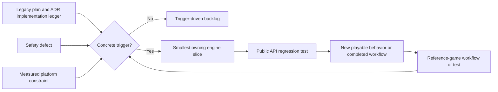
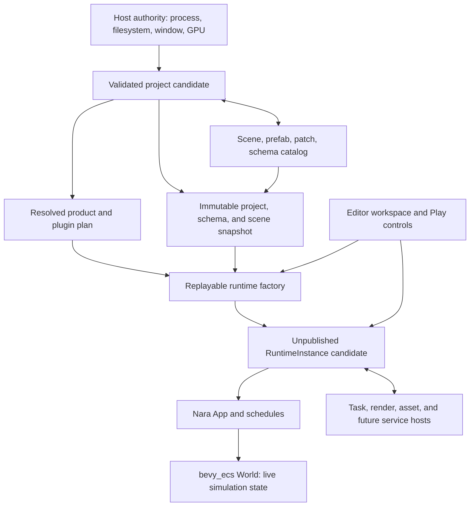
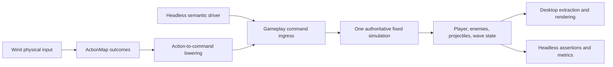
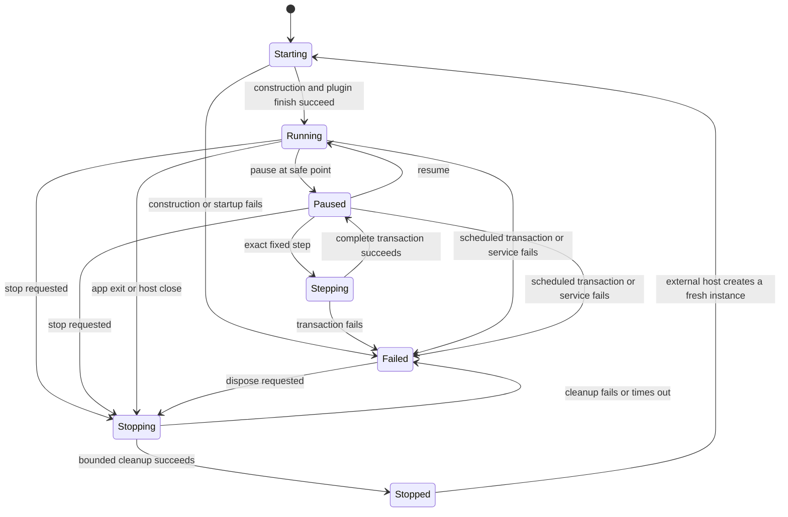
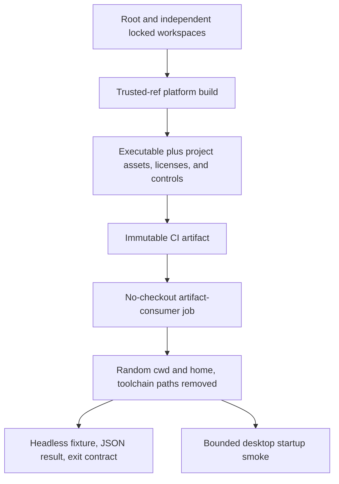

# Reference-Game-Driven Foundation Refactor - Plan

## Goal Capsule

- **Objective:** Replace the engine-wide contract-completion sequence with a first-playable, independently consumable reference-game slice that proves Nara's Rust authoring, modular composition, runtime lifecycle, headless parity, and delivery path.
- **Authority:** `AGENTS.md` and `STRATEGY.md` govern product scope. Accepted ADRs govern implemented boundaries until evidence in this plan requires a focused revision. This plan supersedes the execution sequence and Definition of Done in `docs/plans/2026-07-10-001-refactor-engine-foundation-contracts-plan.md`, but it does not erase that plan's completed work or audit evidence. Cross-document references use the `RGF-U<N>` namespace; `legacy U<N>` always refers to the superseded plan.
- **Execution profile:** Fearless pre-1.0 refactoring is authorized. Remove obsolete APIs, placeholder crates, draft formats, and unused abstractions instead of preserving compatibility layers.
- **Preserved foundation:** Keep Rust as the complete official authoring language, `bevy_ecs` as the ECS substrate, Nara's fallible `App`, stable persistent identity, bounded task and diagnostic foundations, backend isolation, and semantic headless gameplay commands.
- **Evidence rule:** A new engine abstraction, crate, or ADR must answer a failing reference-game workflow, a concrete safety defect, or a measured platform constraint. Architecture completeness alone is not admission evidence.
- **Stop conditions:** Revise the active unit when its reference-game acceptance test disproves the proposed boundary. Stop and re-plan if two consecutive engine units produce no new playable behavior or completed production workflow, or if the first playable requires a broad return to the legacy 33-unit waterfall.
- **Tail ownership:** `ce-work` owns implementation, focused Conventional Commits, deletion of abandoned attempts, review follow-up, verification evidence, and updates to the implementation ledger. It must preserve all concurrent user changes in the existing dirty worktree.

---

## Product Contract

### Summary

Nara will complete one narrow foundation slice by building through its public surface, not by finishing every accepted architecture direction first. The slice starts from the in-progress legacy U9 work, gives ordinary Rust components a low-boilerplate persistent authoring path, makes compiled and installed modules truthful, replaces the editor's bare Play `World` with a scheduled runtime, and delivers one Brotato-like wave through desktop and headless entry points.

The legacy plan remains an architecture-gap ledger. Its unfinished units become trigger-driven backlog unless this plan names them directly.

### Problem Frame

The July 10 plan correctly found serious lifecycle, identity, persistence, filesystem, rendering, and tooling gaps. It then converted nearly every gap into a prerequisite for product acceptance. That sequence now conflicts with `STRATEGY.md`: Nara has 29 workspace crates and many accepted ADRs, but no representative game proving that its public Rust APIs form a productive engine.

Progress is also easier to overstate than the current code permits. Legacy U1-U5, legacy U8, legacy U18, and legacy U25 have implementation evidence. Legacy U6 and legacy U7 remain partial. Legacy U9 is an unverified working-tree intermediate state: the shared envelope exists, registry freeze tests call production APIs that do not yet exist, and stable field identities have not reached scene patches. Play Mode still stores a bare `World`, root features still compile most domains unconditionally, `PluginGroupBuilder` cannot replace or disable entries, and generic task crates still own asset schedule vocabulary.

Continuing the old sequence would spend months closing speculative contracts before testing the most important hypothesis: whether a normal Rust project can build, iterate, inspect, run, and ship a small complete game through Nara's supported product surface.

### Current Progress Baseline

- **Implemented evidence:** legacy U1-U5, legacy U8, legacy U18, and legacy U25.
- **Partial evidence:** legacy U6-U7, legacy U9-U17, legacy U26-U29, and legacy U31-U33. Partial means a real subset exists; it does not authorize completing the remaining unit wholesale.
- **No implementation evidence:** legacy U19, legacy U21-U22, legacy U24, and legacy U30.
- **Deferred or obsolete in the current strategy:** legacy U20 and legacy U23.

This baseline comes from source and `docs/architecture/adr/implementation-status.md`, not ADR acceptance or plan prose. RGF-U9 migrates ledger authority, RGF-U1 records the verified schema subset, and later units update only what they actually prove.

### Requirements

#### Plan Governance and Evidence

- R1. The completed legacy U1-U5, legacy U8, legacy U18, and legacy U25 contracts remain the verified baseline and must not be reimplemented unless a regression test proves a defect.
- R2. Unfinished legacy units enter active work only when a reference-game failure, a safety defect, or a measured platform constraint names the required subset.
- R3. Every engine change made for the reference game must add a public regression test or a dependency-boundary assertion that prevents a private shortcut from becoming the product path.
- R4. The legacy plan, active-plan pointers, ADR ledger, and engineering state must identify this successor and its `RGF-U<N>` namespace before implementation begins; accepted ADRs must distinguish a narrowed implemented slice from remaining direction.

#### Persistent Rust Authoring

- R5. Scene, prefab, scene-patch, and component-schema-catalog files must use one strict canonical version-1 envelope and reject incompatible, unknown, or over-budget input before publishing runtime or authoring state.
- R6. Persistent component and field identities must survive Rust and display-name changes through opaque stable IDs, aliases, retained tombstones, and separation of the persistent catalog from native Rust/Bevy bindings.
- R7. A runtime registry must freeze atomically before execution and reject every later schema, binding, codec, migration, or reflected-type mutation without changing the frozen snapshot.
- R8. A normal persistent Rust component must declare its schema, stable IDs, capabilities, and codec from one source without a handwritten `ComponentValue` codec or a duplicate field-kind table.
- R9. A runtime-only ECS component must continue to require only the normal Rust/`bevy_ecs` component contract; persistence metadata is opt-in.
- R10. Canonical version 1 contains only capabilities exercised by a current scene, inspector, patch, or reference-game workflow; animation, replication, scripting, dynamic ECS, and universal schema-source promises remain absent.

#### Product Composition and Runtime Ownership

- R11. Root Cargo features must form the coarse capability ceiling defined by ADR 0079: no-default compiles no product domain, default compiles only `runtime-core`, and optional 2D, runtime UI, tooling, watcher, platform, and backend domains compile only when selected.
- R12. File-backed project composition must read bounded `nara.toml` bytes through host-issued filesystem authority, lower a side-effect-free settings candidate, and validate compiled, requested, required, service, conflict, and group closures before mutating `App`.
- R13. A default plugin group must expose stable, versioned slot IDs for supported replacement, disabling, and relative ordering before installation; slot identity remains separate from the installed plugin's identity, and invalid composition leaves the `App` reusable for a later valid attempt.
- R14. `nara_app` must own only the `TaskUpdate` stage, `nara_tasks` only execution mechanics, and `nara_asset` the asset integration-set vocabulary and ordering.
- R15. A `RuntimeInstance` must own one scheduled `App`, lifecycle state, pause/resume, exact complete fixed-tick stepping, observable control results, main-thread driving, and bounded cooperative shutdown; editor Play Mode must own this runtime instead of a bare `World`.
- R16. One exact step from Paused must run one complete fixed Prepare/Simulate/Finalize and gameplay Admit/Consume/Capture/Acknowledge transaction, preserve prior debt/remainder, rotate trackers once, surface transaction faults, and return to Paused only on success.
- R17. Editor Restart must stop the old owner and construct a fresh `App`, `World`, queue, task/backend state, and runtime generation from a host-owned validated build recipe. The recipe may share an immutable catalog/binding snapshot for the same project revision; a structural schema change creates a new project snapshot. Desktop Retry is a game-owned run reset inside the existing runtime, while standalone structural edits use process restart.
- R24. Through public tooling APIs, an author must be able to inspect and patch a persistent game component, start scheduled Play, execute an exact step, stop and restart through the runtime factory, and observe the edited value in authoritative gameplay state without a private world mutation path.

#### Reference Game and Delivery Proof

- R18. The reference game must be an in-repository independent Cargo workspace with its own lockfile and a single path dependency on the public root `nara` package.
- R19. The first playable must include player movement, deterministic enemy spawning, automatic projectiles, hit/death resolution, one completed or defeated wave, and a non-text runtime HUD whose health, progress, and terminal geometry track authoritative state through public scene, prefab, data, sprite, input, gameplay-command, and UI APIs.
- R20. Desktop physical input and headless semantic-command input must converge on the same fixed-tick gameplay systems and produce equivalent authoritative state for the same command sequence.
- R21. The reference game must not depend directly on `crates/nara_*`, workspace dependency inheritance, `[patch]`, engine-private hooks, or reference-game-only branches inside engine crates.
- R22. The first instrumented slice must record P50/P95 edit-to-result latency for data, compatible Rust function-body, and structural Rust changes; clean-project-to-first-playable time; add-module and supported-slot-replacement success/time; public production coverage; frame-time P99; memory; build time; and artifact size.
- R23. Windows and Linux CI must test the root and independent reference-game workspaces separately, then build an executable-relative `project/` artifact whose headless runner and bounded desktop smoke run from a random working directory without Cargo, a Rust toolchain, a Nara source checkout, or hidden user-home state.

### Acceptance Examples

- AE1. Given a scene, prefab, patch, or catalog envelope with the wrong kind, a future format version, an unknown field, or an exceeded byte/depth/count budget, loading rejects before unbounded payload construction or component decoding and leaves the prior document, registry, and world unchanged.
- AE2. Given a field whose Rust name and display alias change while its field ID remains stable, the existing durable patch still resolves to the field; a committed prior catalog proves that a removed ID became a tombstone and can never be reactivated.
- AE3. Given `Player`, `Enemy`, `Weapon`, and `Projectile` Rust components, their declarations generate schemas and codecs without handwritten `ComponentValue` conversion code; a component with no persistence derive remains an ordinary ECS component.
- AE4. Given an unsupported field type, missing stable ID, duplicate field ID, or capability unsupported by canonical version 1, compilation or registry freeze fails with a focused error rather than inferring a contract.
- AE5. Given a project request outside the compiled Cargo ceiling, a compiled-but-unrequested capability required by a replacement, a missing plugin service, a disabled prerequisite, or a plugin conflict, composition returns a structured error before resources, schedules, plugins, groups, or lifecycle state change; a later valid composition succeeds on the same `App`.
- AE6. Given the first-party desktop group, the reference game can replace the versioned window slot with a configured `WindowPlugin`, disable the optional tilemap slot, and place its gameplay plugin relative to a stable slot without editing Nara source; public slot conformance tests pass without claiming arbitrary plugins are behaviorally equivalent.
- AE7. Given a paused runtime with retained fixed debt and a queued command, exact step advances one tick, consumes and acknowledges the command once, preserves prior debt and remainder, and returns to Paused.
- AE8. Given a failed runtime start, a never-completing service shutdown, or Close/Reload/Restart while Play owns resources, no false Running/Stopped state or silent owner drop is published; a fresh restart contains none of the old runtime's mutable ECS, queue, task, or native-handle state.
- AE9. Given the same semantic movement command sequence, desktop-lowered input and direct headless ingress finish at the same tick and outcome with the same stable-ID-sorted player, enemy, projectile, and score snapshot; losing focus releases held movement and command rejection is observable rather than silently diverging.
- AE10. Given a clean artifact-consumer job with no source checkout and a random current/home directory, the headless binary loads its bundled fixture, emits one stable JSON result, exits with the documented code, and the desktop binary completes a bounded startup smoke using only executable-relative project files.
- AE11. Given an edit document containing a derive-backed game component, a public inspector patch changes its value; scheduled Play and exact step consume that value; Stop and factory-backed Restart rebuild the runtime; the restarted authoritative state retains the edited document value and none of the prior runtime state.

### Success Criteria

- The first playable is complete through public APIs, and the dependency audit reports 100% public production coverage for the implemented slice.
- Ordinary reference-game persistent components contain no handwritten codec or duplicate schema field table.
- The desktop group demonstrates a versioned window slot replacement, tilemap disable, and gameplay-plugin ordering without core edits; metadata validation and public conformance tests define the supported claim.
- Headless parity tests replay the desktop semantic command stream deterministically for the fixed first-wave scenario.
- Data, body, and structural edit paths each have reproducible P50/P95 baselines; clean-project-to-first-playable, add-module, and window-slot-replacement workflows have timed success records; no latency claim is made before these measurements exist.
- Windows and Linux CI independently build and test the reference game with its own lockfile and produce runnable standalone artifacts.
- Every engine crate or ADR added during execution cites its concrete consumer and admission evidence; otherwise the work deepens an existing module or is deleted.
- A versioned evidence review records comparison subjects, acceptable ranges, anomaly treatment, and the rule for selecting the next vertical slice before any successor implementation starts.

### Scope Boundaries

**In scope**

- Narrow completion of the dirty legacy U9 envelope, stable field identity, catalog/binding, patch-address, and registry-freeze work.
- A reference-game-proven Rust derive/provider path for persistent components.
- ADR 0079 compiled capability ceilings, atomic project composition, placeholder audio retirement, configurable plugin slots, and post-playable ADR 0080 task-set ownership.
- A minimal `RuntimeInstance` and scheduled editor Play host.
- One deterministic 2D arena-survival wave with a semantic non-text HUD, desktop input, headless parity, metrics, CI, and standalone artifacts built from the source-distributed reference workspace.
- Focused repairs to legacy U6, U7, U10-U14, U28, or U31 only when a named first-playable test fails without them.

**Deferred until evidence triggers a later vertical slice**

- An official Luau, C#, Rhai, Wasm, or other second author language; a universal behavior host; dynamic non-Rust ECS components; or a stable native dynamic ABI.
- Subsecond or another native hot-patching product commitment. This plan measures safe data reload, incremental rebuild, fresh restart, and compatible body-edit experiments separately.
- Text shaping, IME, accessibility, full pointer capture, audio, save games, persistent replay/checkpoints, system stepping, and backwards debugging.
- Full inherited visibility and hierarchy semantics not required by the flat first-wave scene, nested prefab rebase, edit-while-playing merge, editor persistence receipts, recovery journals, and multi-instance editing.
- Asset rename recovery, artifact-group publication, generalized residency, multi-target rendering, render graphs, GPU upload arenas, large-map culling caches, high-end 3D, networking, browser, mobile, console, marketplace infrastructure, and Steam publication.
- Artifact signing, transparency/provenance attestations, auto-update distribution, and long-term release-channel policy. CI trust isolation in this plan is not a claim of artifact authenticity.

---

## Planning Contract

### Key Technical Decisions

1. **Create a successor and migrate execution authority before code work.** The old plan contains valuable audit and completion evidence and concurrent uncommitted edits. `RGF-U9` preserves those changes while marking the old artifact `superseded_by`, repointing active engineering state, and moving cross-document unit references into the `RGF-U<N>` or `legacy U<N>` namespace.
2. **Make the reference game an independent nested workspace.** `reference-game/Cargo.toml` owns its package and lockfile, while the root workspace uses `exclude = ["reference-game"]`. This exposes feature unification, workspace inheritance, private-crate access, and packaging failures that a root workspace member would hide.
3. **Keep Rust complete and make persistence opt-in.** Nara does not add a mandatory script language. A proc-macro derive plus a runtime provider trait removes repetitive persistent-component registration, while ordinary ECS components remain free of schema requirements.
4. **Use explicit IDs and a checked catalog lineage.** Derive input must name stable type and field IDs. Rust paths, field names, and display aliases may help diagnostics but cannot become wire identity. Source-controlled catalog compatibility compares the generated catalog with its committed predecessor so deletion requires a tombstone and tombstones can never reactivate.
5. **Narrow schema vocabulary before making it canonical.** U1 implements only scene/inspect/edit and reference kinds used by current consumers. Future save, animation, replication, script, and diagnostic projections add capabilities in their own consumer-backed format revisions or ADR refinements.
6. **Stage composition before touching `App`.** Cargo capabilities, normalized project requests, resolved plugin slots, actual plugin identities, declared dependencies, service requirements, conflicts, disabled entries, and ordering are pure inspectable values. Production plugins stop installing hidden nested plugins during `build`; the committed build/finish phase executes only the fully resolved plan, while arbitrary build side effects are not falsely promised to be rollback-safe.
7. **Adopt Bevy's configurable-group affordances with narrower replacement claims.** Nara keeps its fallible `App` and closed core lifecycle. Stable, versioned group-slot IDs support configured replacement, disable, add-before, and add-after, while installed plugins retain their own identities. The first supported replacement is the desktop window slot and its public conformance contract; arbitrary plugin implementation equivalence and custom schedules remain deferred.
8. **Treat ECS as runtime state, not the process control plane.** The ownership chain is host -> validated project context -> `RuntimeInstance` -> `App` -> `World`. Filesystem authority, project documents, GPU/audio/task hosts, and editor workspace state retain their domain owners rather than becoming universal ECS resources.
9. **Separate three restart meanings.** Desktop Retry resets game-owned run state at a fixed-tick safe point inside one runtime. Editor Restart asks an external tooling host to stop and rebuild a fresh runtime from a reusable recipe. Structural edits to a standalone game use process restart; this slice does not invent `EngineHost` to hide those different lifecycles.
10. **Construct runtimes from a host-owned replayable recipe.** A public factory consumes validated project settings, resolved plugin plan, immutable project/schema snapshot, and scene snapshot, then returns an unpublished ready candidate. Editor, headless, and desktop adapters drive the same runtime contract without storing the recipe or lifecycle authority in the ECS `World`.
11. **Make shutdown cooperative and deadline-bound.** Plugin cleanup starts non-blocking close work. Services that may wait expose pollable completion and a deadline; the runtime drives them at safe points, reports timeout as Failed, and never claims a synchronous callback can bound arbitrary blocking code.
12. **Bind packaged project authority to the artifact.** Release layout places `project/` beside the executable and resolves it without consulting the current directory or user home. Development may pass an explicit host-authorized project root; file-backed reads still use opaque `nara_fs` capabilities and opened handles.
13. **Measure before claiming productivity, then freeze the decision rule.** The first slice records distributions, workflow success, fallback paths, and runtime tails. A versioned evidence review must set comparison subjects, acceptable ranges, anomaly handling, and successor priority before further implementation; this plan does not backfill an arbitrary success threshold after seeing one sample.

### High-Level Technical Design

#### Evidence-Driven Work Intake



The implementation ledger remains broad. The active code lane remains narrow. A legacy unit is not resumed wholesale when one of its subcontracts is needed.

#### Ownership Topology



The diagram names ownership scopes, not a requirement to create one crate or public type for every box. This plan introduces `RuntimeInstance`; it does not introduce speculative `EngineHost` or universal `ProjectContext` frameworks.

#### Shared Desktop and Headless Simulation



The two paths share commands and systems, not merely similar test logic. Rendering and physical input are adapters around the authoritative fixed simulation.

#### Runtime Lifecycle



Restart is an external factory action after the old owner reaches Stopped; it is not an in-place transition that reuses mutable runtime state. Desktop Retry is game state and does not appear in this lifecycle.

#### Artifact Build and Consumption



The consumer job does not inherit the checkout that produced the artifact. This makes absolute paths, undeclared assets, and accidental toolchain dependencies observable.

### Output Structure

```text
reference-game/
  Cargo.toml
  Cargo.lock
  nara.toml
  assets/
  src/
    bin/
      desktop.rs
      headless.rs
  tests/
  packaging/
  tools/

artifact/
  desktop[.exe]
  headless[.exe]
  project/
    nara.toml
    assets/
  README.md
  LICENSE-MIT
  LICENSE-APACHE
```

The source workspace and packaged layout are separate contracts. Packaging may choose platform-native archive names, but executable-relative `project/` and the shipped license/control files are stable.

### Assumptions

- The existing dirty legacy U9 files are authorized in-progress work, not a green baseline. Execution must inspect and complete them without reverting, stashing, or overwriting unrelated edits.
- Nara is pre-1.0 and has no downstream compatibility promise that outweighs removing a false or unused API.
- The first reference-game wave uses deterministic spawn data and simple game-owned collision math; it does not require a general physics or RNG domain.
- The first HUD uses runtime UI geometry, bars, color, and icons. Health current/max changes geometry and reaches an empty death state; wave progress follows authoritative counts; completion and defeat have distinct terminal geometry. Text waits for its own production slice.
- Windows is the local development host. Linux behavior is proven through hosted CI and headless/runtime artifact checks.
- Source distribution and downloadable Windows/Linux artifacts satisfy the first proof; Steam publication is excluded.
- A proc-macro crate is admitted only because at least four real reference-game components consume it in U2 and it isolates compile-time code generation from runtime reflection ownership.
- The editor workspace supports at most one active Play runtime in this slice. Closing, reloading, restarting, or exiting while Play owns resources must stop it first; cleanup failure retains the owner and a Failed diagnostic instead of silently dropping it.
- `WaveOutcome` is game-owned. Defeat wins when player death and final-enemy death occur in the same tick; desktop freezes gameplay at a terminal outcome until Retry or Quit, while headless reports both Completed and Defeated as valid scenario outcomes.

### System-Wide Impact

- Persistent scene, prefab, patch, and schema-catalog prototype shapes become deliberate breaking deletions in favor of strict canonical version 1.
- Durable patch addressing moves from current field-name paths to stable field IDs resolved through the current catalog.
- Root feature names and public exports change to the ADR 0079 capability vocabulary; most root dependencies become optional.
- `ProjectPluginPlan`, `DesktopWgpuPlugins`, legacy adapter feature names, the audio placeholder, and app/task-owned asset integration sets are removed without aliases.
- Plugin groups become staged and configurable before installation; inspection exposes slot identity, slot-contract version, and actual plugin identity separately.
- Production plugins declare dependencies instead of mutating the plugin plan from inside `build`.
- Editor Play APIs stop exposing a bare mutable Play `World`; workspace commands gain safe-point results, legal-operation projection, per-frame driving, fresh restart, and stop-before-remove semantics.
- Potentially blocking services move from synchronous cleanup assumptions to cooperative close work with deadlines.
- The repository gains a second lockfile and CI lifecycle for the independent reference-game consumer.

### Risks and Dependencies

| Risk | Mitigation |
|---|---|
| Legacy U9's current intermediate state expands into a universal type system | Freeze scope at the four file kinds and current consumer capabilities; dynamic ECS, scripts, and general sidecars fail the unit's stale-surface review. |
| Explicit stable IDs replace codec boilerplate with attribute boilerplate | Count declarations and generated code for four real components; if metadata still exceeds gameplay code, simplify the derive/provider API before adding more schema semantics. |
| Proc-macro diagnostics make author errors opaque | Add compile-fail fixtures for every required ID and supported-type error, with errors anchored to the offending field or attribute. |
| Cargo feature combinations become combinatorial | Test single coarse capabilities, named products, weak serde, the reference-game combination, and all-features rather than every powerset. |
| Plugin replacement claims exceed what first-party contracts support | Support only named versioned slots, beginning with the desktop window slot; run the slot's public conformance tests and state that metadata cannot prove arbitrary behavioral equivalence. |
| Hidden nested plugin installation defeats non-mutating preflight | Move production dependencies into metadata/resolved factories and reject plugin-plan mutation once committed build begins. |
| `RuntimeInstance` becomes a second `App` abstraction | Keep it a lifecycle owner around one `App`; schedules, plugins, world mutation, and time semantics remain in `nara_app::App`. |
| A blocking cleanup hook defeats bounded shutdown | Make cleanup initiation non-blocking, poll service close work against a deadline, and use a never-completing fixture to prove truthful timeout failure. |
| Fresh editor restart conflicts with the consuming Winit runner | Keep editor restart outside the runtime factory, desktop Retry inside game state, and process restart for structural edits; adapt Winit as a runtime driver without introducing a universal `EngineHost`. |
| The game becomes a bespoke engine branch | Enforce one public root dependency, audit imports, reject private hooks, and require every engine repair to have a non-game-specific regression test. |
| Flat first-wave gameplay avoids known hierarchy or input gaps | Record the non-claim. Resume only the subset needed by the next concrete scene or interaction instead of marking legacy U6/U7 complete. |
| Separate workspaces drift or duplicate excessive build work | Pin both lockfiles, test both on each supported CI OS, and measure build cost as product evidence rather than hiding it through workspace unification. |
| Measurements overwrite concurrent work or clean unsafe paths | Run edit benchmarks in a validated detached temporary worktree created from a recorded commit; helpers reject the active checkout and validate every cleanup path. |
| Metrics are optimized before they are trustworthy | Record protocol, hardware, sample count, cold/warm state, fallback path, and raw samples; require an approved versioned evidence review before the next implementation plan. |
| CI artifacts inherit secrets, checkout state, or poisoned caches | Use read-only PR permissions, no secrets/OIDC, non-persistent checkout credentials, full-SHA actions, trust-separated caches, and trusted-ref rebuilds; consume artifacts in a separate no-checkout job. |

### Sequencing and Evidence Gates

U9 first migrates execution authority without touching code. U1 closes the current dirty dependency edge. U2 then creates the independent workspace and a minimal runnable headless gameplay tracer, not merely component declarations. U3-U5 must each extend that tracer with a completed production workflow before U6 grows it into the full desktop/headless wave. U8 restores task-set ownership after the first playable, using its active asset/task path as characterization evidence. U7 measures, reviews, and packages the result.

| Gate | Units | Continue evidence | Re-plan trigger |
|---|---|---|---|
| M0 One execution authority | U9 | Legacy plan and ledgers point to this successor and use unambiguous unit namespaces | Two implementation-ready plans or bare cross-document U-IDs still claim authority |
| M1 Runnable Rust authoring | U1-U2 | Four reference-game components round-trip through canonical files and a public headless tracer executes gameplay with no handwritten codec tables | The declaration remains more complex than gameplay types, identity depends on names, or the external consumer cannot run |
| M2 Composable runtime | U3-U5 | The same tracer boots from a host-authorized project, customizes a staged group, runs scheduled exact-step Play, and passes edit-to-Play restart | A unit adds no tracer workflow, composition mutates before validation, or runtime hosting duplicates schedule authority |
| M3 First playable | U6 | One wave completes through desktop and headless public paths with authoritative parity and a complete terminal/retry/quit flow | More than two broad legacy units must be completed before one wave works, or any private engine hook is required |
| M4 Domain ownership | U8 | Asset/task characterization preserves same-frame and next-frame behavior after ownership moves | The move changes observed game behavior or requires generic task code to know an asset domain |
| M5 Production baseline | U7 | Metrics, evidence review, secure CI, and standalone Windows/Linux artifacts are reproducible | Results depend on checkout/home state, hidden credentials, an unreported patch, or post-hoc success criteria |

### Reversal Conditions

- If normal persistent components still require handwritten codecs or repeated field tables after U2, stop schema expansion and redesign the authoring surface.
- If the versioned desktop window slot cannot be replaced without editing the facade or engine crate, narrow the claim to explicit configuration and revisit staged composition before adding package infrastructure.
- If Rust structural edit latency is unacceptable, first optimize and measure incremental rebuild plus fresh runtime restart. Evaluate Subsecond-like body patching only when its supported edit class has measured value.
- If the reference game works only because it shares the root workspace, internal crates, or source-tree state, its product evidence is invalid.
- If the reference game succeeds but a later external project cannot reproduce the same workflow, treat Nara as a flagship game's internal technology until the public boundary is repaired.
- If any U3-U5 unit leaves the runnable tracer with no new completed production workflow, defer its unexercised subcontracts; if two consecutive units add no playable behavior or workflow, stop infrastructure work and rewrite the next slice.

### Sources and Research

- `STRATEGY.md` defines complete-game-outward development, Rust-first production, modular integration, and the current metrics.
- `docs/knowledge/engineering/decisions/2026-07/2026-07-12T003130Z-use-the-brotato-like-reference-game-as-a-production-proof-1e9cf73b7f144e05bed780c0f84bf7a1.md` defines the full reference-game proof and its non-claims.
- `docs/knowledge/engineering/decisions/2026-07/2026-07-11T163345Z-defer-extension-technology-selection-behind-a-unified-package-experience-7f435154e74e45359c661b98d145d693.md` keeps Rust complete while deferring official scripting and universal extension technology.
- `docs/plans/2026-07-10-001-refactor-engine-foundation-contracts-plan.md` remains the historical gap catalog and completed-unit source.
- `docs/architecture/adr/implementation-status.md` is the implementation evidence ledger.
- `docs/architecture/adr/0081-schema-source-stable-identity-catalog-and-runtime-binding.md`, `docs/architecture/adr/0079-root-product-capabilities-and-placeholder-domain-retirement.md`, `docs/architecture/adr/0080-domain-owned-task-update-integration-sets.md`, and `docs/architecture/adr/0076-play-runtime-debug-control-and-observation.md` contain the narrowed architecture inputs.
- `repo-ref/bevy/crates/bevy_app/src/plugin_group.rs` provides mature `set`, `disable`, `add_before`, and `add_after` group customization prior art.
- `repo-ref/bevy/examples/scene/world_serialization.rs` demonstrates derive-based reflected scene authoring without making Bevy's type paths Nara's persistent identity.
- `repo-ref/bevy/crates/bevy_app/src/sub_app.rs` demonstrates a runtime authority outside the primary simulation world; Nara keeps its own smaller `RuntimeInstance` boundary rather than adopting `bevy_app`.
- `docs/knowledge/engineering/subagents/2026-07/2026-07-12-dioxus-subsecond-rust-hot-patching-research.md` limits native body patching claims and motivates measuring safe fallback paths first.
- `crates/nara_tooling/src/{play,workspace}.rs`, `crates/nara_winit/src/lib.rs`, and `crates/nara_app/src/lib.rs` expose the current bare Play world, silent workspace removal paths, nested plugin installation, and consuming runner constraints that shape U4-U6.
- ADRs 0049 and 0050 define the pre-deserialization budget order and opaque filesystem-capability/handle guarantees used by U1, U3, and artifact packaging.

---

## Implementation Units

| Unit | Outcome | Primary files | Depends on |
|---|---|---|---|
| U9 | Active-plan governance migration | Legacy plan, ADR ledger, engineering state | - |
| U1 | Canonical schema and format baseline | `nara_core`, `nara_reflect`, schema owners, scene/tooling tests | U9 |
| U2 | Derive-backed runnable headless tracer | `nara_reflect_derive`, root facade, `reference-game/` | U1 |
| U3 | Truthful capabilities and authorized project boot | Cargo graph, `nara_project`, `nara_fs`, wgpu gates | U1, U2 |
| U4 | Staged configurable plugin slots | `nara_app`, first-party plugin owners, reference game | U3 |
| U5 | Driven and reconstructible runtime lifecycle | app/gameplay/tasks/winit/tooling runtime paths | U3, U4 |
| U6 | Complete desktop/headless wave | `reference-game/`, public contract tests | U2-U5 |
| U8 | Domain-owned asset task integration | tasks/asset/watch/image integration | U6 |
| U7 | Metrics, secure CI, and standalone delivery | workflows, packaging, benchmarks, project docs | U6, U8 |

### U9. Migrate Active Plan Authority and Unit Namespaces

- **Goal:** Make this successor the only active execution contract without discarding the dirty legacy plan or its audit history.
- **Requirements:** R4.
- **Dependencies:** None; this unit precedes code work.
- **Entry trigger:** Both plans currently declare `artifact_readiness: implementation-ready`, while active engineering state and ADR ledger rows still use bare legacy U-IDs.
- **Files:** `docs/plans/2026-07-10-001-refactor-engine-foundation-contracts-plan.md`, `docs/architecture/adr/implementation-status.md`, `docs/knowledge/engineering/current-state.md`, and the smallest affected handoff/index entries under `docs/knowledge/engineering/`.
- **Approach:** Add a reciprocal `superseded_by` pointer to the legacy artifact without rewriting its content. Point active engineering state at this plan, qualify preserved work as `legacy U<N>`, and use `RGF-U<N>` for this plan in cross-document ledgers. Preserve old commit evidence and triggers rather than copying them into the new units.
- **Execution note:** Treat all existing modifications in the legacy plan and engineering memory as concurrent user work. Integrate around them and stage only the governance lines owned by this unit.
- **Test expectation:** No runtime behavior changes. A document audit must find one active plan pointer, reciprocal supersession metadata, no ambiguous bare U-ID in active ledger/handoff prose, and no loss of legacy evidence.
- **Verification:** The latest state/handoff names this plan and `RGF-U1` as the first code unit; the legacy plan remains readable but cannot be mistaken for the active Definition of Done.

### U1. Close the Canonical Schema and File-Format Baseline

- **Goal:** Complete the in-progress legacy U9 work as the smallest stable persistence authority needed by scenes, prefabs, patches, tooling, and the reference game.
- **Requirements:** R1-R10; AE1-AE2 and the registry portion of AE4.
- **Dependencies:** U9 and the existing uncommitted legacy U9 working-tree state; no other legacy unit is a prerequisite.
- **Entry trigger:** Freeze tests already call missing production APIs, durable patches still address fields by name, built-in schemas lack stable field IDs, and the current dirty envelope is not a publishable atomic boundary.
- **Files:** `Cargo.toml`, `Cargo.lock`, `crates/nara_core/Cargo.toml`, `crates/nara_core/src/{format,lib}.rs`, `crates/nara_core/tests/format_contract.rs`, `crates/nara_reflect/src/{schema,registry,path,codec,migration,lib,tests}.rs`, `crates/nara_scene/src/{document,prefab,patch,format,validation,hierarchy,lib,tests}.rs`, `crates/nara_transform/src/lib.rs`, `crates/nara_render/src/lib.rs`, `crates/nara_sprite/src/lib.rs`, `crates/nara_tilemap/src/lib.rs`, `crates/nara_ui/src/{lib,codec}.rs`, `crates/nara_tooling/src/{inspector,play}.rs`, `crates/nara_tooling_egui/src/lib.rs`, affected owner tests, `tests/{scene_inspector,scene_patch_transactions,scene_play_mode}.rs`, `tests/fixtures/formats/v1/`, ADRs 0011/0043/0045/0049/0051/0081, `docs/architecture/adr/implementation-status.md`, and affected migration documentation.
- **Approach:** Preserve the shared envelope already started in `nara_core`, then implement opaque `ComponentFieldId`, aliases, type/field tombstones, runtime-independent catalog records, separate native bindings, and an atomic Building -> Frozen registry. All built-in providers supply explicit field ID, alias, capability, and current-value paths before freeze. Durable patches store type plus field identity and resolve to a current `ComponentFieldPath` only at validation/apply time. Each of the four persistent entry points checks encoded bytes before parsing, then bounds nesting, map/list entries, components/fields, strings, patch operations, and diagnostics before candidate publication. Delete persistent Rust paths, auto-granted capabilities, unsupported speculative variants, unchecked mutable-registry escape hatches, and dual draft readers/fixtures.
- **Execution note:** Characterize and review every dirty file before editing. Do not overwrite concurrent documentation or Cargo changes. Land the completed legacy U9 slice before beginning authoring code generation.
- **Test scenarios:** Covers AE1. Each scene, prefab, patch, and catalog entry rejects oversized bytes before payload decoding and rejects depth/count/string/operation/diagnostic excess without changing the existing document, registry, or `World`. Wrong kind/version/engine minimum, unknown fields, duplicate or tombstoned IDs, alias rename, mixed-capability whole-value access, failed/repeated freeze, every post-freeze mutation path, missing native binding, migration failure, and patch resolution after Rust/display rename are atomic. Every built-in provider freezes with explicit field IDs and no name-only durable target.
- **Verification:** Focused tests for every listed schema owner plus tooling pass; canonical JSON and RON fixtures are stable; searches find no persistent `rust_type_path`, Bevy `ComponentId`, runtime `Entity`, or name-only durable field target; the ledger describes the exact implemented subset.

### U2. Add the Rust Persistent-Component Authoring Tracer

- **Goal:** Make real game components pleasant to declare and immediately run them in an independent public-surface headless tracer.
- **Requirements:** R3 and R6-R10; AE2-AE4.
- **Dependencies:** U1's stable catalog, binding, and freeze contracts.
- **Entry trigger:** Nara has no external consumer, and a normal persistent component currently repeats schema fields plus handwritten `ComponentValue` conversion, while runtime-only components should remain ordinary `bevy_ecs` data.
- **Files:** `.gitignore`, `Cargo.toml`, `Cargo.lock`, new `crates/nara_reflect_derive/Cargo.toml`, new `crates/nara_reflect_derive/src/lib.rs`, `crates/nara_reflect/Cargo.toml`, new `crates/nara_reflect/src/authoring.rs`, `crates/nara_reflect/src/{lib,registry,schema}.rs`, new `crates/nara_reflect/tests/derive_schema.rs`, new `crates/nara_reflect/tests/ui/`, new catalog-lineage fixtures under `tests/fixtures/schema-catalog/`, `src/lib.rs`, new `reference-game/Cargo.toml`, new `reference-game/Cargo.lock`, new `reference-game/src/{lib,components,systems}.rs`, new `reference-game/src/bin/headless.rs`, new `reference-game/tests/{authoring,headless_tracer,public_surface}.rs`, and authoring documentation.
- **Approach:** Add a derive that consumes explicit component/field IDs, aliases, current capabilities, and declared tombstones, then implements one runtime provider for schema metadata and encode/decode bindings. Use dependency-name resolution for the actual root or reflect crate, generate through one hidden support module re-exported by both, and allow an explicit crate-path override so a renamed root dependency and a root-only dependency compile. Generate only field kinds used by `Player`, `Enemy`, `Weapon`, and `Projectile`; unsupported fields fail at compile time. Compare each generated catalog to a committed predecessor so removals require tombstones and reactivation fails. Register providers through normal fallible plugin build. The independent workspace owns its lockfile, depends only on root `nara`, and runs a deterministic fixed-tick headless tracer over the four real components.
- **Authoring target:** A component declaration contains the Rust fields once, stable ID attributes once, and one registration call. It contains no handwritten `ComponentValue` match, no manually repeated `ComponentFieldSchema` list, and no inferred persistent ID.
- **Test scenarios:** Covers AE2-AE4. Valid scalar/vector/reference components round-trip and execute in the tracer; a Rust field rename with the same ID preserves old patches; two-generation catalog fixtures prove rename, deletion-to-tombstone, and reuse rejection; missing/duplicate IDs, unsupported types, invalid capabilities, and tombstone reactivation produce span-focused failures; root-only and renamed-root dependencies compile; generated bindings freeze with handwritten built-ins; runtime-only components compile and run without the derive.
- **Verification:** Proc-macro UI tests, runtime round trips, and the independent locked headless tracer pass; the four game components use only public derive/provider exports; audits find no direct domain dependency, workspace inheritance, generated Rust/Bevy persistence identity, or handwritten game codec/table; ADR 0079 records the crate's real consumers.

### U3. Make Compiled Product Capabilities and Project Ingest Truthful

- **Goal:** Ensure a host compiles only selected Nara products and can reject an invalid project candidate before mutating runtime state.
- **Requirements:** R3, R11-R12, R18, and R21; AE5 and the dependency portion of AE10.
- **Dependencies:** U1 for canonical project-facing persistence vocabulary; U2 so the feature graph includes the admitted derive crate deliberately.
- **Entry trigger:** Root no-default/default builds still compile product domains outside the declared ceiling, the scaffold binary assumes facade exports, and file-backed composition can open by ambient path or discover capability failures after partial setup.
- **Files:** `Cargo.toml`, `Cargo.lock`, affected `crates/*/Cargo.toml`, `crates/nara_project/src/{manifest,sections,effective,profile,lib,tests}.rs`, `crates/nara_fs/src/lib.rs`, `crates/nara_render_wgpu/src/{lib,sprite,ui,texture}.rs`, `src/lib.rs`, deletion of obsolete `src/main.rs`, `tests/{product_capabilities,project_composition}.rs`, root examples, `reference-game/{Cargo.toml,nara.toml}`, `reference-game/src/bin/headless.rs`, `reference-game/tests/project_boot.rs`, `AGENTS.md`, ADRs 0035/0050/0055/0070/0079, `docs/architecture/nara-foundation.md`, and migration documentation; delete `crates/nara_audio/` and its live exports/references.
- **Approach:** Implement ADR 0079's optional root dependencies and coarse features: `runtime-core`, `runtime-2d`, `runtime-ui`, `tooling`, `asset-watch`, `desktop-winit`, `render-wgpu`, `tooling-egui`, and weak `serde`. Set default to `runtime-core`, remove legacy aliases, gate facade modules/preludes, conditionally compile wgpu submitter modules and fields, remove the obsolete root binary, and delete the audio placeholder. File-backed ingestion accepts only an opaque host-issued `nara_fs` capability and reads bounded bytes from its already opened handle. It forbids Path authorization, canonicalize-and-reopen, and name-based reopen; Unsupported or Unproven guarantees fail closed for untrusted input. Composition publishes an immutable settings/capability candidate only after compiled, requested, implied, required, service, conflict, and group closures validate. The tracer gains public file-backed `nara.toml` boot.
- **Test scenarios:** No-default/default/single/named/all-feature builds have the expected trees; `serde` alone activates no product; base wgpu excludes sprite/UI submitters; server installation remains free of raw input/backend resources even in an all-feature binary. Wrong compiled ceiling, unavailable implied capability, hostile/oversized manifest bytes, unchecked absolute path, link/reparse swap, proof failure, and host IO failure publish no settings/runtime and a later valid candidate succeeds. Reference-game metadata cannot inherit root workspace dependencies.
- **Verification:** The named feature/dependency matrices and project-boot tracer pass; old feature names, `ProjectPluginPlan`, `DesktopWgpuPlugins`, ambient manifest path loaders, root scaffold binary, `nara_audio`, and unconditional optional-domain facade exports are absent; examples and docs use the new capabilities.

### U4. Stage Configurable Plugin Composition

- **Goal:** Let projects customize coherent defaults through named public slot contracts without mutating a partially built `App`.
- **Requirements:** R3 and R12-R13; AE5-AE6.
- **Dependencies:** U3's compiled capability and normalized project candidate.
- **Entry trigger:** The reference game must customize window title/size, disable tilemap, and place its gameplay plugin, while current groups cannot replace/disable entries and production plugin `build` methods install undeclared nested dependencies after mutation has begun.
- **Files:** `crates/nara_app/src/lib.rs` and focused `crates/nara_app/src/{plugin,plugin_group}.rs` if split, `crates/nara_asset/src/reload.rs`, `crates/nara_asset_watch/src/lib.rs`, `crates/nara_winit/src/lib.rs`, `crates/nara_image/src/lib.rs`, `crates/nara_render_wgpu/src/lib.rs`, `crates/nara_sprite_render/src/lib.rs`, `crates/nara_ui_render/src/lib.rs`, `crates/nara_ui/src/lib.rs`, `src/lib.rs`, `tests/{plugin_composition,product_capabilities}.rs`, `reference-game/src/{lib,plugins}.rs`, `reference-game/tests/plugin_composition.rs`, ADRs 0046/0079, `docs/architecture/nara-foundation.md`, and migration documentation.
- **Approach:** Introduce stable versioned group-entry/slot IDs separate from actual `PluginId`. Disable and relative ordering address slots; replacement retains the actual plugin identity and must satisfy the slot's declared capability, dependency, service, and version closure. Migrate production nested installation into metadata plus staged plugin factories; once committed build begins, `add_plugin`/`add_plugins` cannot mutate the resolved plan. Keep build/finish/cleanup fallible after validation. The first public slot conformance suite covers the desktop window contract, while metadata validation is not represented as proof of arbitrary behavioral equivalence. The tracer replaces the window slot with a configured first-party `WindowPlugin`, disables tilemap, and inserts its game plugin through the public surface.
- **Test scenarios:** Covers AE5-AE6. Ordering is stable; inspection exposes slot and actual plugin identity; the configured window replacement passes conformance; disabling tilemap and inserting gameplay succeeds. Duplicate/missing slots, disabled prerequisites, cycles, conflicts, version mismatch, missing services/capabilities, and a replacement requiring a compiled-but-unrequested capability fail before any resource, schedule, plugin, group, or lifecycle mutation; a later valid plan succeeds on the same `App`. A plugin attempting nested installation during committed build is rejected.
- **Verification:** Focused app and every migrated plugin-owner test pass; public reference-game customization needs no facade edit; searches find no production `add_plugin_if_missing` dependency installation inside plugin build; group inspection matches resolved slot order and membership.

### U5. Introduce `RuntimeInstance` and Replace the Bare Play World

- **Goal:** Turn the existing pause labels and isolated world projection into a driven, reconstructible, and truthfully stoppable runtime boundary.
- **Requirements:** R3, R15-R17, and R24; AE7-AE8 and AE11.
- **Dependencies:** U3's validated project candidate and U4's resolved plugin plan.
- **Entry trigger:** Play still owns a bare `World`, pause is an enum rather than execution control, workspace APIs have no Step/Restart/frame pump, and Close/Reload can silently drop the future owner of task or native state.
- **Files:** new `crates/nara_app/src/runtime.rs`, `crates/nara_app/src/lib.rs`, `crates/nara_gameplay/src/{lib,queue}.rs`, `crates/nara_tasks/src/runtime.rs`, `crates/nara_winit/src/lib.rs`, `crates/nara_tooling/src/{play,workspace,lib}.rs`, `crates/nara_tooling_egui/src/lib.rs`, `tests/{scene_play_mode,runtime_instance,workspace_play_runtime}.rs`, `reference-game/src/bin/headless.rs`, `reference-game/tests/runtime_drive.rs`, `src/lib.rs`, ADRs 0034/0039/0076, `docs/architecture/nara-foundation.md`, and migration documentation.
- **Approach:** Keep one `App` as schedule/world authority and wrap it in a thin lifecycle owner. Define a host-supplied replayable runtime factory that consumes validated project settings, a resolved plugin plan, immutable project/schema revision, and scene snapshot, then completes plugin build/finish, registry freeze, and scene spawn before publishing Running. Tooling stores the recipe outside the `World`, pumps one runtime frame per editor frame, and re-invokes the factory for fresh restart. Winit and headless adapters drive the same lifecycle contract; desktop Retry remains game state. Safe-point pause/resume/step/stop requests return a runtime-local control token with Accepted/Rejected followed by observable Pending/Applied/Failed state and legal operations. Exact step uses a distinct app-frame plan and a domain-writable transaction fault channel; gameplay Admit/Acknowledge faults cannot return to Paused as success. Plugin cleanup only initiates non-blocking close; potentially waiting services expose pollable deadline-bound close work.
- **Workspace rule:** Only one Play runtime may exist per workspace. Close Scene, external reload, Restart, second-document Start Play, and editor exit must stop the current owner first. Cleanup failure retains the Failed owner and diagnostic; it cannot remove or replace the session silently.
- **Restart contract:** The tooling host accepts Restart from Running, Paused, Failed, or Stopped. An active/failed owner must reach Stopped before a new candidate can publish Running; Starting, Stepping, and Stopping reject Restart. Cleanup or candidate-start failure leaves an observable Failed result and publishes no replacement.
- **Test scenarios:** Covers AE7-AE8 and AE11. Startup failure publishes no session; illegal and competing requests do not mutate state; duplicate Step before a safe point has a deterministic result; paused frames advance permitted real-time work but no fixed tick; exact step runs one complete command transaction/tracker boundary and preserves debt/remainder. Poisoned ingress, active-batch, and acknowledgement failures enter Failed. A never-completing close fixture reaches timeout without blocking the host or claiming Stopped. Close/Reload/Restart/exit and a second document obey single-owner stop-first rules. Factory restart changes runtime generation and mutable state while same-revision immutable schema may be shared. Public inspect/patch -> Play -> exact step -> Stop -> Restart preserves the edit document value and no old runtime state.
- **Verification:** App/gameplay/task/winit/tooling integration and tracer-drive tests pass; scheduled systems execute in Play; workspace UI projects legal operations and terminal control results; searches find no `ScenePlaySession`-owned bare `World`, enum-only pause behavior, or silent session replacement/drop path; ADR status leaves replay, system stepping, recovery, and universal host abstractions deferred.

### U6. Complete the Independent First-Playable Wave

- **Goal:** Deliver the smallest complete game loop that exercises Nara as an external Rust engine consumer.
- **Requirements:** R2-R3 and R18-R21; AE3 and AE9.
- **Dependencies:** U2 authoring, U3 compiled product, U4 composition, and U5 runtime lifecycle.
- **Entry trigger:** The U2 tracer proves authoring and fixed execution but lacks the complete movement/combat/terminal loop, desktop projection, stable parity snapshot, and standalone CLI behavior needed to validate Nara as a game engine.
- **Files:** `reference-game/Cargo.toml`, `reference-game/Cargo.lock`, `reference-game/nara.toml`, `reference-game/assets/`, `reference-game/src/{lib,components,resources,systems,input,ui,snapshot}.rs`, `reference-game/src/bin/{desktop,headless}.rs`, `reference-game/tests/{first_wave,desktop_flow,headless_cli,headless_parity,public_surface}.rs`, root `tests/reference_game_contract.rs`, and only engine files named by a failing public regression test.
- **Approach:** Extend the same tracer into a deterministic arena simulation with semantic movement commands, table-driven spawns, enemy pursuit, timed automatic fire, game-owned circle collision, damage/death, and `WaveOutcome::{Running, Completed, Defeated}`; Defeated wins a same-tick terminal tie. Load configuration through canonical project/scene/prefab/schema paths. Physical desktop input lowers into the same command ingress as headless, and focus loss synthesizes release/stop state. Rejected local commands become structured run faults. A game-owned snapshot sorts entities by stable game/scene identity and includes tick, outcome, player health/position, enemies, projectiles, and score; same-target paths compare exactly, while cross-OS CI compares only declared semantic fields rather than claiming unproven machine-level bitwise parity.
- **Desktop flow:** Startup automatically loads and begins the fixed wave. WASD moves. Completion or defeat freezes authoritative gameplay and shows distinct non-text terminal geometry. Enter requests a fixed-safe-point game run reset with a new run generation inside the same runtime. Escape or window close requests bounded Stop before process exit.
- **Headless flow:** By default the binary loads a bundled semantic-command fixture, accepts an explicit host-authorized scenario path for development, enforces a maximum tick count, and runs to Completed, Defeated, or technical failure. Completed/Defeated emit one stable JSON summary on stdout and exit zero; project/input/runtime/tick-limit failures emit structured diagnostics on stderr and exit nonzero. All paths drive cleanup.
- **Engine-repair rule:** Before touching a legacy U6/U7/U10-U14/U28/U31 area, add the failing reference-game or engine regression test and record the smallest missing contract. Implement only that contract, update its ADR ledger row as partial or implemented truthfully, and return to the game loop. Do not resume the legacy unit wholesale.
- **Test scenarios:** A scripted stream moves, fights, and reaches each terminal outcome at a stable tick; same-tick death/completion resolves Defeated; desktop-lowered and direct headless streams produce the declared authoritative snapshot; zero/multiple fixed steps do not duplicate commands; held movement followed by focus loss stops movement; ingress rejection faults the run; despawn leaves no stale stable identity; asset/data reload failure preserves last-good playable state. HUD batches prove initial health, damage/empty death, wave progress, and distinct Completed/Defeated geometry without mutating gameplay. CLI tests cover bundled/default input, explicit input, maximum ticks, JSON schema, stdout/stderr separation, exit codes, Retry, Quit, and cleanup.
- **Verification:** Independent locked tests, root public-surface contract, and desktop feature checks pass; the documented flow is manually playable on Windows and the headless binary completes locally on Windows. U7 owns hosted Linux headless/artifact evidence. The game has no private dependency/hook/conditional, and every engine repair has a reusable regression test.

### U8. Restore Domain-Owned Task Integration Sets

- **Goal:** Move asset integration vocabulary out of generic app/task modules without changing the now-running game's asynchronous behavior.
- **Requirements:** R3 and R14.
- **Dependencies:** U6 first playable, which provides a production asset/task tracer.
- **Entry trigger:** `nara_tasks` and app-level schedule vocabulary currently know asset poll/resolve/spawn/apply concepts, violating module independence even though the first playable must preserve their same-frame and next-frame semantics.
- **Files:** `crates/nara_app/src/lib.rs`, `crates/nara_tasks/src/{runtime,tests}.rs`, `crates/nara_asset/src/{lib,reload}.rs`, `crates/nara_asset_watch/src/lib.rs`, `crates/nara_image/src/lib.rs`, `tests/task_update_integration.rs`, `reference-game/tests/asset_task_flow.rs`, ADR 0080, `docs/architecture/nara-foundation.md`, and migration documentation.
- **Approach:** Leave only `CoreStage::TaskUpdate` in `nara_app` and bounded execution mechanics in `nara_tasks`. Move `AssetTaskUpdateSet::{Poll, ResolveSourceChanges, SpawnJobs, ApplyResults}` and ordering into `nara_asset`; watcher/image adapters join through asset-owned public vocabulary. Characterize the first playable's ready-prefix and predecessor behavior before moving symbols, then delete old aliases and ownership paths.
- **Test scenarios:** Poll captures one ready membership/prefix at entry; eligible predecessor-unblocked results apply in the same frame; later-ready or missing-predecessor work waits; stale/superseded outcomes retire; watcher coalescing and image reload preserve last-good behavior; the reference-game asset/task flow produces the same authoritative result before and after the ownership move; `TaskPlugin` configures no asset sets.
- **Verification:** Focused task/asset/watch/image and reference-game characterization tests pass; searches find no asset integration sets in `nara_app` or `nara_tasks`; ADR 0080 and foundation docs describe ownership without claiming new gameplay behavior.

### U7. Establish Measurement, CI, Standalone Delivery, and the Next Evidence Gate

- **Goal:** Turn the first playable into reproducible product evidence and leave the repository ready for the next vertical slice.
- **Requirements:** R3-R4 and R22-R23; AE10.
- **Dependencies:** U6 first playable and U8 ownership cleanup.
- **Entry trigger:** No reproducible iteration baseline, hosted Linux proof, secure cross-workspace CI, license/readme onboarding, artifact layout, or checkout-free runtime smoke currently exists.
- **Files:** new `.github/workflows/ci.yml`, new `reference-game/packaging/`, new `reference-game/tools/` measurement/packaging helpers, new `reference-game/README.md`, new `README.md`, new `LICENSE-MIT`, new `LICENSE-APACHE`, new `tests/ci_policy.rs`, new `docs/benchmarks/{reference-game-baseline,reference-game-evidence-review}.md`, `docs/architecture/adr/implementation-status.md`, `docs/architecture/nara-foundation.md`, affected ADRs/migration docs, and sharded verification/handoff records under `docs/knowledge/engineering/`.
- **Approach:** Define sampled protocols for data reload, compatible body edit, structural edit plus rebuild/process restart, clean-project-to-first-playable, adding a public game module, and replacing the supported window slot. Record success/failure, time, mechanism, and fallback. Edit protocols run only in a validated detached temporary worktree created from a recorded commit; helpers refuse the active checkout and validate each cleanup path. Measure cold/incremental build, frame P99, memory, artifact size, and public dependency coverage on named hardware. Package an executable plus sibling `project/`, licenses, and control documentation; development-only `--project-root` remains explicit and host-authorized.
- **CI and trust boundary:** Root and independent workspace jobs run on Windows/Linux with committed locks. PR jobs declare read-only permissions, receive no secrets or OIDC, disable checkout credential persistence, pin third-party actions to full commit SHAs, and cannot write a cache later consumed by trusted builds. Distributable artifacts are rebuilt from a trusted ref. A separate artifact-consumer job performs no checkout, downloads only the package, randomizes cwd/home, removes Cargo/Rustup/Nara/source paths and the toolchain from PATH, rejects absolute or link/reparse package entries, then runs headless and platform-appropriate desktop smoke.
- **Evidence gate:** The baseline records raw samples and non-claims. A separate versioned review freezes comparison subjects, acceptable ranges, anomaly treatment, and the priority rule for the next vertical slice. No successor implementation begins until that review is approved; inability to state a defensible rule is a planning blocker rather than a reason to keep expanding infrastructure.
- **Test scenarios:** Root green with the reference game broken fails CI; reference-game green with a private dependency fails the public-surface gate; workflow-policy violations fail a static gate; missing lockfile/license/declared asset fails packaging. An artifact consumer with no checkout/toolchain and random cwd/home loads only sibling `project/`; headless validates JSON/exit semantics and desktop performs bounded startup/cleanup. Repeated measurements preserve raw samples, separate cold/warm paths, and report P50/P95/P99 plus workflow success rates without touching the active worktree.
- **Verification:** CI is green on Windows/Linux; both workspaces pass locked checks independently; checkout-free artifact consumers pass; root/reference-game READMEs and dual licenses are packaged; baseline and evidence-review documents contain protocol, hardware, sample count, raw-data location, percentiles, workflow success/time, comparison/range rules, fallbacks, and non-claims; final simplification/review finds no abandoned path, stale symbol, compatibility shim, or unsupported claim.

---

## Verification Contract

Execution runs the owning focused gate after each unit and the full matrix at U7. Root dependency-resolving commands use the committed lockfile. Because prior verification found broad parallel builds memory-heavy, use one Cargo build job and one nextest test thread when the host is under pressure.

### Focused Gates

```powershell
$env:CARGO_BUILD_JOBS = '1'

# RGF-U1
cargo nextest run --locked -p nara_core -p nara_reflect -p nara_scene -p nara_transform -p nara_render -p nara_sprite -p nara_tilemap -p nara_ui -p nara_tooling -p nara_tooling_egui --test-threads=1
cargo nextest run --locked -p nara --test scene_inspector --test scene_patch_transactions --test scene_play_mode --test-threads=1

# RGF-U2
cargo nextest run --locked -p nara_reflect -p nara_reflect_derive --test-threads=1
cargo check --manifest-path reference-game/Cargo.toml --locked --all-targets
cargo nextest run --manifest-path reference-game/Cargo.toml --locked --test authoring --test headless_tracer --test public_surface --test-threads=1

# RGF-U3
cargo nextest run --locked -p nara_project -p nara_fs -p nara_render_wgpu --test-threads=1
cargo nextest run --locked -p nara --test product_capabilities --test project_composition --test-threads=1
cargo nextest run --manifest-path reference-game/Cargo.toml --locked --test project_boot --test-threads=1

# RGF-U4
cargo nextest run --locked -p nara_app -p nara_asset -p nara_asset_watch -p nara_winit -p nara_image -p nara_render_wgpu -p nara_sprite_render -p nara_ui_render -p nara_ui --test-threads=1
cargo nextest run --locked -p nara --test plugin_composition --test product_capabilities --test-threads=1
cargo nextest run --manifest-path reference-game/Cargo.toml --locked --test plugin_composition --test-threads=1

# RGF-U5
cargo nextest run --locked -p nara_app -p nara_gameplay -p nara_tasks -p nara_winit -p nara_tooling -p nara_tooling_egui --test-threads=1
cargo nextest run --locked -p nara --test runtime_instance --test scene_play_mode --test workspace_play_runtime --test-threads=1
cargo nextest run --manifest-path reference-game/Cargo.toml --locked --test runtime_drive --test-threads=1

# RGF-U6
cargo nextest run --locked -p nara --test reference_game_contract --test-threads=1
cargo nextest run --manifest-path reference-game/Cargo.toml --locked --test-threads=1

# RGF-U8
cargo nextest run --locked -p nara_app -p nara_tasks -p nara_asset -p nara_asset_watch -p nara_image --test-threads=1
cargo nextest run --locked -p nara --test task_update_integration --test-threads=1
cargo nextest run --manifest-path reference-game/Cargo.toml --locked --test asset_task_flow --test-threads=1
```

Exact test-target names may be split during implementation, but each named scenario in its U-ID must retain a focused executable owner.

### Root Workspace Gates

```powershell
cargo fmt --all -- --check
$env:CARGO_BUILD_JOBS = '1'
cargo nextest run --workspace --locked --test-threads=1
cargo check --workspace --locked
cargo check -p nara --locked --no-default-features
cargo check -p nara --locked
cargo check -p nara --locked --no-default-features --features runtime-core
cargo check -p nara --locked --no-default-features --features runtime-2d
cargo check -p nara --locked --no-default-features --features runtime-ui
cargo check -p nara --locked --no-default-features --features tooling
cargo check -p nara --locked --no-default-features --features asset-watch
cargo check -p nara --locked --no-default-features --features desktop-winit
cargo check -p nara --locked --no-default-features --features render-wgpu
cargo check -p nara --locked --no-default-features --features tooling-egui
cargo check -p nara --locked --all-features --all-targets
```

### Desktop and Backend Gates

```powershell
cargo check -p nara --locked --no-default-features --features runtime-2d,runtime-ui,desktop-winit,render-wgpu --example windowed_clear
cargo check -p nara --locked --no-default-features --features runtime-2d,runtime-ui,desktop-winit,render-wgpu --example windowed_sprites
cargo check -p nara --locked --no-default-features --features runtime-2d,runtime-ui,desktop-winit,render-wgpu --example runtime_ui_panel
rg -n "winit::|winit =" crates src Cargo.toml
rg -n "wgpu::|wgpu =" crates src Cargo.toml
```

Only adapter crates and their manifests may match backend-native imports after review.

### Independent Reference-Game Gates

```powershell
cargo fmt --manifest-path reference-game/Cargo.toml --all -- --check
cargo check --manifest-path reference-game/Cargo.toml --locked --all-targets
cargo nextest run --manifest-path reference-game/Cargo.toml --locked --test-threads=1
cargo nextest run --locked -p nara --test reference_game_contract --test-threads=1
cargo build --manifest-path reference-game/Cargo.toml --locked --release --bin desktop
cargo build --manifest-path reference-game/Cargo.toml --locked --release --bin headless
pwsh -File reference-game/tools/package.ps1 -Configuration Release -OutputRoot target/reference-game-package
pwsh -File reference-game/tools/smoke-artifact.ps1 -ArtifactRoot target/reference-game-package -RandomizeEnvironment
rg -n "crates/nara_|nara_[a-z_]+\s*=|\[patch" reference-game
rg -n "use\s+nara_[a-z_]+|extern\s+crate\s+nara_" reference-game/src reference-game/tests
```

The dependency audit permits `nara = { path = ".." }` and ordinary third-party dependencies. It rejects direct Nara domain crates, workspace dependency inheritance, patch overrides, and source-level private imports. The smoke helper must reject active-checkout execution, unsafe cleanup roots, absolute/link/reparse package entries, missing licenses/assets, cwd/home lookup, and toolchain-dependent startup.

### Feature-Tree Assertions

- All `cargo tree` assertions run with `--locked`.
- `cargo tree --locked -p nara --no-default-features` contains no `nara_*` product-domain dependency.
- Default contains the documented `runtime-core` closure and excludes image, material, render, sprite, tilemap, runtime UI, tooling, watcher, winit, wgpu, egui, and audio domains.
- `serde` alone activates no product domain.
- Runtime UI alone does not activate sprite or tilemap; runtime 2D alone does not activate UI.
- Base wgpu excludes sprite/UI submitters until the corresponding product feature is also active.
- Server runtime inspection excludes raw input, window, render, toolkit, watcher, and device resources even when all capabilities were compiled.

### Evidence and Review Gates

- Every `RGF-U<N>` ends in one focused Conventional Commit after its owning gates pass; unrelated user changes remain unstaged.
- Each U1-U5 entry trigger and each engine repair from U6 links the failing workflow, safety defect, or concrete current-code evidence plus its public regression owner; untriggered subcontracts return to backlog.
- Hosted PR workflow policy proves read-only permissions, no secrets/OIDC, non-persistent credentials, immutable action refs, and trust-separated caches. Distributable artifacts are rebuilt from a trusted ref rather than promoting PR output.
- Windows and Linux artifact-consumer jobs do not checkout source. They download the package, randomize cwd/home, sanitize toolchain/project environment, and exercise the binary-level result/exit and bounded startup contracts.
- U7 runs simplification and bug/regression-focused review over the complete successor diff, resolves P0/P1 findings, repeats affected gates, and removes abandoned attempts.
- `docs/benchmarks/reference-game-evidence-review.md` is approved before any successor implementation plan begins; it records comparison objects, acceptable ranges, anomaly handling, and the next-slice selection rule.
- Hosted-only Linux artifact or runner limitations are recorded as limitations. They are never converted into fabricated local pass claims.

---

## Definition of Done

- U9 makes this successor the sole active execution contract, preserves the legacy plan as historical audit/trigger backlog, and removes cross-document unit-ID ambiguity.
- U1 closes and verifies the current dirty legacy U9 state, migrates every built-in schema owner, and enforces pre-decode budgets without discarding or overwriting concurrent user work.
- U2 proves low-boilerplate persistent Rust authoring with four real game components and a runnable independent headless tracer while runtime-only ECS remains schema-free.
- U3 proves truthful no-default/default/product feature trees, bounded host-owned manifest ingest, atomic capability rejection, and complete audio-placeholder retirement.
- U4 proves versioned-slot window replacement, tilemap disable, and gameplay ordering through the reference consumer; invalid and hidden nested composition cannot partially mutate `App`.
- U5 proves a replayable runtime factory, scheduled editor/headless/desktop driving, exact complete stepping, observable control/fault results, single-owner workspace rules, cooperative deadline-bound shutdown, and public edit-to-Play fresh restart without a bare-world lifecycle.
- U6 completes one deterministic playable wave through desktop and headless public paths with stable parity snapshots, terminal/retry/quit flows, semantic HUD feedback, binary I/O/exit contracts, and 100% public production coverage for the slice.
- U8 restores task integration-set ownership to `nara_asset` without changing characterized first-playable behavior.
- U7 records reproducible iteration/runtime/workflow baselines, publishes an approved evidence review, and produces secure green Windows/Linux CI plus licensed standalone artifacts consumed without checkout, toolchain, source tree, cwd, or home-state dependencies.
- Every changed public/persistent contract has aligned English ADR, foundation, migration, example, and implementation-ledger documentation.
- Every completed unit has focused tests, a precise Conventional Commit, and verification evidence; no unrelated dirty file is staged or reverted.
- Root and reference-game READMEs explain the supported build/run/controls boundary, and `LICENSE-MIT` plus `LICENSE-APACHE` ship in source and artifacts.
- No compatibility shim, placeholder crate, unused abstraction, reference-game-only engine branch, abandoned experiment, generated scratch file, or false implemented claim remains in the final diff.
- Work deferred by this plan remains absent from production APIs unless a recorded trigger admitted it during execution.
