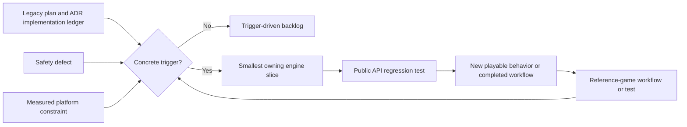
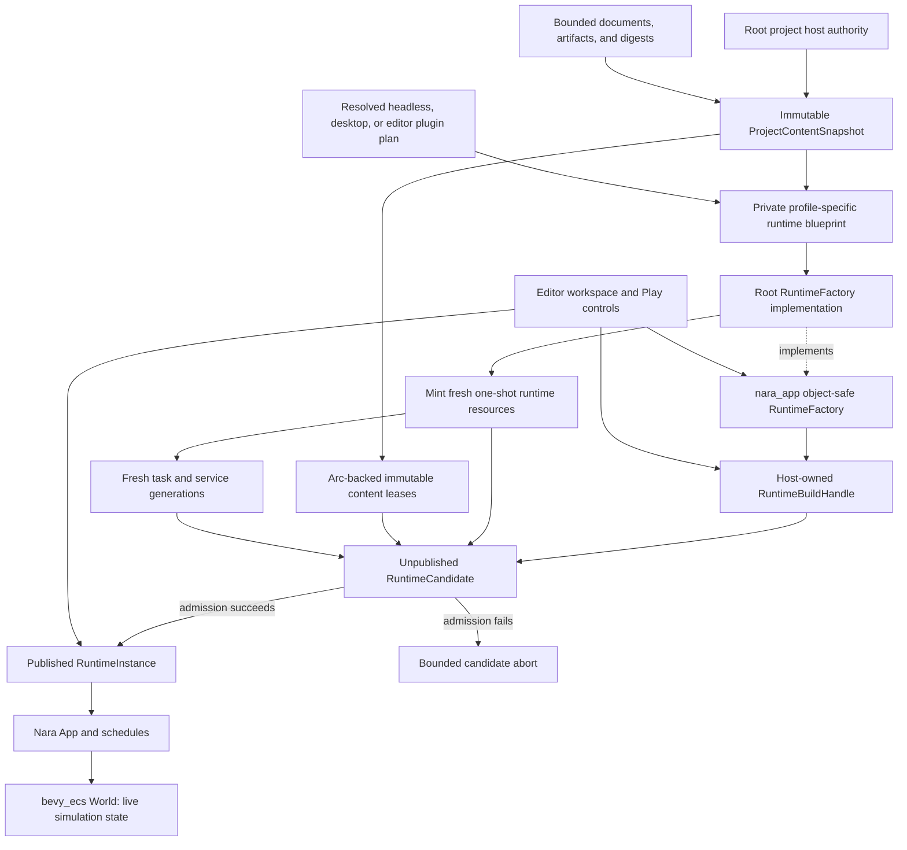
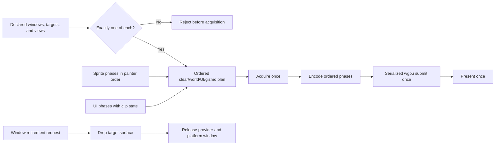
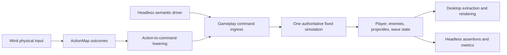
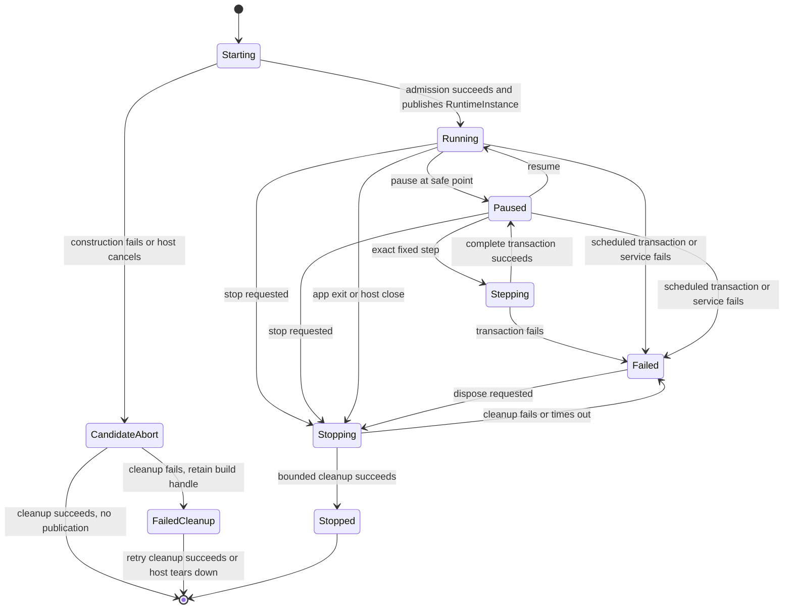
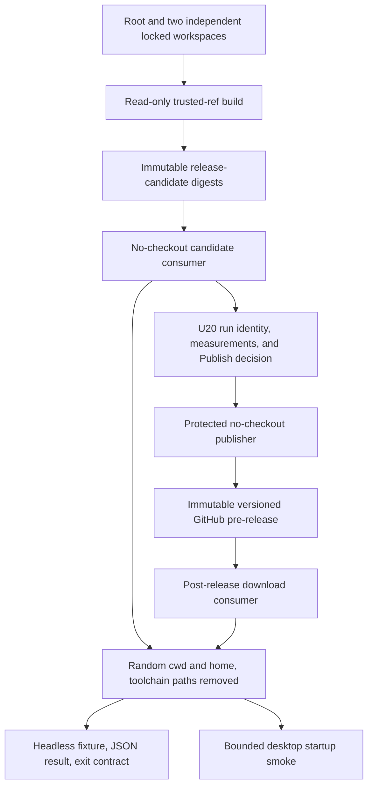

# Reference-Game-Driven Foundation Refactor - Plan

## Goal Capsule

- **Objective:** Replace the engine-wide contract-completion sequence with a first-playable, independently consumable reference-game slice that proves Nara's Rust authoring, modular composition, authorized content boot, runtime lifecycle, headless/desktop parity, renderer safety, and delivery path.
- **Authority:** `AGENTS.md` and `STRATEGY.md` govern product scope. Accepted ADRs govern implemented boundaries until evidence in this plan requires a focused revision. This plan supersedes the execution sequence and Definition of Done in `docs/plans/2026-07-10-001-refactor-engine-foundation-contracts-plan.md`, but it does not erase that plan's completed work or audit evidence. Cross-document references use the `RGF-U{N}` namespace; `legacy U{N}` always refers to the superseded plan.
- **Execution profile:** Fearless pre-1.0 refactoring is authorized. Remove obsolete APIs, placeholder crates, draft formats, and unused abstractions instead of preserving compatibility layers.
- **Preserved foundation:** Keep Rust as the complete official authoring language, `bevy_ecs` as the ECS substrate, Nara's fallible `App`, stable persistent identity, bounded task and diagnostic foundations, backend isolation, and semantic headless gameplay commands.
- **Evidence rule:** A new engine abstraction, crate, or ADR must answer a failing reference-game workflow, a concrete safety defect, or a measured platform constraint. Architecture completeness alone is not admission evidence.
- **Stop conditions:** Revise the active unit when its reference-game acceptance test disproves the proposed boundary. Stop and re-plan if two consecutive engine units produce no new playable behavior or completed production workflow, or if the first playable requires a broad return to the legacy 33-unit waterfall.
- **Tail ownership:** `ce-work` owns implementation, focused Conventional Commits, deletion of abandoned attempts, review follow-up, verification evidence, and updates to the implementation ledger. It must preserve all concurrent user changes in the existing dirty worktree.

---

## Product Contract

### Summary

Nara will complete one narrow foundation slice by building through its public surface, not by finishing every accepted architecture direction first. The slice starts from the in-progress legacy U9 work, gives ordinary Rust components a low-boilerplate persistent authoring path, makes compiled and installed modules truthful, replaces the editor's bare Play `World` with a scheduled runtime, and delivers one Brotato-like wave through desktop and headless entry points.

The legacy plan remains an architecture-gap ledger. Its unfinished units become trigger-driven backlog unless this plan names them directly.

### Problem Frame

The July 10 plan correctly found serious lifecycle, identity, persistence, filesystem, rendering, and tooling gaps. It then converted nearly every gap into a prerequisite for product acceptance. That sequence now conflicts with `STRATEGY.md`: Nara has 29 workspace crates and many accepted ADRs, but no representative game proving that its public Rust APIs form a productive engine.

Progress is also easier to overstate than the current code permits. Legacy U1-U5, legacy U8, legacy U18, and legacy U25 have implementation evidence. Legacy U6 and legacy U7 remain partial. Legacy U9 is an unverified working-tree intermediate state: the shared envelope exists, registry freeze tests call production APIs that do not yet exist, and stable field identities have not reached scene patches. Play Mode still stores a bare `World`, root features still compile most domains unconditionally, `PluginGroupBuilder` cannot replace or disable entries, and generic task crates still own asset schedule vocabulary.

Continuing the old sequence would spend months closing speculative contracts before testing the most important hypothesis: whether a normal Rust project can build, iterate, inspect, run, and ship a small complete game through Nara's supported product surface.

A subsequent source audit found two concrete exceptions to pure consumer-triggered deferral: unsafe wgpu raw-handle lifetime can release the window/provider before its live surface, and file-backed PNG loading can read and expand untrusted input without Nara-owned budgets. It also confirmed that manifest ingest stops before assets/startup scene, while UI clipping and transparent painter order are not yet truthful. The first desktop slice handles the current per-camera surface bug by admitting one window, one target, and one view and rejecting any additional topology before acquisition; generalized coordination remains deferred. These defects now have explicit evidence units instead of hiding inside the first-playable repair rule.

### Current Progress Baseline

- **Implemented evidence:** legacy U1-U5, legacy U8, legacy U18, and legacy U25.
- **Partial evidence:** legacy U6-U7, legacy U9-U17, legacy U26-U29, and legacy U31-U33. Partial means a real subset exists; it does not authorize completing the remaining unit wholesale.
- **No implementation evidence:** legacy U19, legacy U21-U22, legacy U24, and legacy U30.
- **Deferred or obsolete in the current strategy:** legacy U20 and legacy U23.

This baseline comes from source and `docs/architecture/adr/implementation-status.md`, not ADR acceptance or plan prose. RGF-U9 migrates ledger authority, RGF-U1 records the verified schema subset, and later units update only what they actually prove.

### Requirements

#### Plan Governance and Evidence

- R1. The completed legacy U1-U5, legacy U8, legacy U18, and legacy U25 contracts remain the verified baseline and must not be reimplemented unless a regression test proves a defect.
- R2. Unfinished legacy units enter active work only when a reference-game failure, a safety defect, or a measured platform constraint names the required subset.
- R3. Every engine change made for the reference game must add a public regression test or a dependency-boundary assertion that prevents a private shortcut from becoming the product path.
- R4. The legacy plan, active-plan pointers, ADR ledger, and engineering state must identify this successor and its `RGF-U{N}` namespace before product or runtime implementation begins; accepted ADRs must distinguish a narrowed implemented slice from remaining direction.

#### Persistent Rust Authoring

- R5. Scene, prefab, scene-patch, and component-schema-catalog files must use one strict canonical version-1 envelope and reject incompatible, unknown, or over-budget input before publishing runtime or authoring state.
- R6. Persistent component and field identities must survive Rust and display-name changes through opaque stable IDs, aliases, retained tombstones, and separation of the persistent catalog from native Rust/Bevy bindings.
- R7. A runtime registry must freeze atomically before execution and reject every later schema, binding, codec, migration, or reflected-type mutation without changing the frozen snapshot.
- R8. A normal persistent Rust component must declare its schema, stable IDs, capabilities, and codec from one source without a handwritten `ComponentValue` codec or a duplicate field-kind table.
- R9. A runtime-only ECS component must continue to require only the normal Rust/`bevy_ecs` component contract; persistence metadata is opt-in.
- R10. Canonical version 1 contains only capabilities exercised by a current scene, inspector, patch, or reference-game workflow; animation, replication, scripting, dynamic ECS, and universal schema-source promises remain absent.

#### Product Composition and Runtime Ownership

- R11. Root Cargo features must form the coarse capability ceiling defined by ADR 0079: no-default compiles no product domain, default compiles only `runtime-core`, and optional 2D, runtime UI, tooling, watcher, platform, and backend domains compile only when selected.
- R12. File-backed project composition must read bounded `nara.toml` bytes through host-issued filesystem authority, lower a side-effect-free settings candidate, and validate compiled, requested, required, service, conflict, and group closures before mutating `App`.
- R13. A default plugin group must expose stable slot IDs for disabling, configuration, and relative ordering before installation; slot identity remains separate from installed plugin identity. Replacement and slot-contract version compatibility enter the product contract only with U13's real desktop window-slot consumer, and invalid preflight composition leaves the `App` reusable for a later valid attempt.
- R14. `nara_app` must own only the `TaskUpdate` stage, `nara_tasks` only execution mechanics, and `nara_asset` the asset integration-set vocabulary and ordering.
- R15. A `RuntimeInstance` must own one scheduled `App`, lifecycle state, pause/resume, exact complete fixed-tick stepping, observable control results, main-thread driving, sticky fault propagation, and bounded cooperative shutdown.
- R16. One exact step from Paused must run one complete fixed Prepare/Simulate/Finalize and gameplay Admit/Consume/Capture/Acknowledge transaction, preserve prior debt/remainder, rotate trackers once, surface transaction faults, and return to Paused only on success.
- R17. Editor Restart must stop the old owner and construct a fresh `App`, `World`, queue, task/backend state, and runtime generation from a profile-specific runtime blueprint. Headless, desktop, and editor blueprints may share one immutable `ProjectContentSnapshot` and catalog/binding revision but must own separately resolved plugin plans; a structural schema or authoring-document change creates a new snapshot/factory revision. Desktop Retry is a game-owned run reset inside the existing runtime, while standalone structural edits use process restart.
- R24. Editor Play Mode must own a UI-agnostic `RuntimeBuildHandle` while Starting or aborting and a `RuntimeInstance` only after publication, never a bare `World` or private blueprint. Low-level Start and Restart reject an absent or stale factory, while the integrated host turns an author Play or Restart command into one pending refresh intent, installs the current validated authoring revision, and automatically continues into runtime build without requiring a second click. Through public tooling APIs, an author must be able to inspect and patch a persistent component, start scheduled Play, observe Pause Applied, execute an exact step, stop and restart, and observe the edited value in authoritative gameplay state without a private world mutation path.
- R25. Every file-backed image path must reserve its encoded ceiling before read or dispatch, inspect dimensions through bounded header parsing, reject pixel-count and decoded-byte overflow, then atomically upgrade to a conservative host-wide peak before decode. The complete peak covers encoded retention, decoder scratch, native decoded output, RGBA conversion, and publication overlap; exceeding any stage publishes neither a new asset nor a failed-reload replacement.
- R26. The executable host must complete one authorized `nara.toml` -> startup scene/prefab/asset dependency closure -> runtime path using only host-issued capabilities and opened handles during content-snapshot construction. The first host resolves `AssetRef::Path`; `AssetRef::StableId` fails with a structured unsupported-reference diagnostic until a bounded stable-ID catalogue has a concrete consumer. Discovery must bound directory depth/entries, cumulative path bytes, simultaneous handles, files, import jobs, dependency edges, encoded source bytes, decoded/work bytes, imported-artifact residency, and total retained snapshot bytes. `nara_project` remains side-effect-free, runtime attempts consume immutable validated values and digests without reopening source, and no domain reconstructs ambient paths.
- R27. A backend surface must never outlive the window/provider authority that made its raw handles valid. Window retirement requires an explicit renderer retirement result before provider removal. The first desktop product supports one window, one render target, and one camera/view; an owned immutable `RenderFramePacket` captures that admitted topology at the final pre-acquire boundary, additional or generation-drifted topology rejects before acquisition, and the serialized wgpu host acquires, submits, and presents the supported packet at most once per frame.
- R28. The desktop first playable must preserve transparent painter order across material changes and carry UI clip rectangles into backend scissor state; batching may split at material or clip boundaries but may not reorder visible semantics.
- R29. The root facade must keep `nara::prelude` gameplay-first and backend-free; backend/tooling internals, diagnostic storage, command-queue lifecycle, project-host implementation, render extraction/queue/batch types, and native bundles remain in module-specific or advanced surfaces rather than the default authoring namespace.
- R30. A separate locked consumer must depend directly on `nara_scene` and its documented public prerequisites, without the root `nara` facade, then load and spawn a committed scene fixture through the supported module boundary.
- R31. Runtime construction must register each plugin and service attempt before invoking a fallible build, finish, or acquisition hook. First-party hooks must remain nonblocking; waitable admission and cleanup work is candidate-owned, pollable, cancellable, and deadline-bound. A mid-hook failure or host cancellation must abort the unpublished candidate without publishing a partially owned `App` or `RuntimeInstance`.

#### Reference Game and Delivery Proof

- R18. The reference game must be an in-repository independent Cargo workspace with its own lockfile and a single path dependency on the public root `nara` package.
- R19. The first playable must include player movement, deterministic enemy spawning, automatic projectiles, hit/death resolution, one completed or defeated wave, and a non-text runtime HUD whose health, progress, and terminal geometry track authoritative state through public scene, prefab, data, sprite, input, gameplay-command, and UI APIs.
- R20. Desktop physical input and headless semantic-command input must converge on the same fixed-tick gameplay systems and produce equivalent authoritative state for the same command sequence.
- R21. The reference game must not depend directly on `crates/nara_*`, workspace dependency inheritance, `[patch]`, engine-private hooks, or reference-game-only branches inside engine crates.
- R22. The first instrumented slice must record P50/P95 edit-to-result latency for data, compatible Rust function-body, and structural Rust changes; clean checkout-to-headless-wave and clean checkout-to-manually-playable-desktop time; add-module and supported-slot-replacement success/time; public production coverage; frame-time P99; memory; build time; and artifact size.
- R23. Windows and Linux CI must test the root, independent reference-game, and direct module-consumer workspaces under separate lockfiles, then build an executable-relative `project/` release candidate whose headless runner and bounded desktop smoke run from a random working directory without Cargo, a Rust toolchain, a Nara source checkout, or hidden user-home state. After final evidence approval, a protected publisher must release the exact approved candidate identities and digests as a versioned immutable GitHub pre-release evidence build and repeat download-consumer smoke.
- R32. Before U6 begins, a versioned headless evidence protocol must freeze comparison subjects, core acceptable ranges, sample rules, anomaly treatment, and Continue/Redirect/Stop logic. U14 may record Continue only when every predeclared core range passes, and it must freeze the desktop, release-candidate, and Publish rules before U13 begins.
- R33. Before U20 may record Publish, a fresh human or coding-agent runner that did not implement the affected APIs must use only committed public documentation to run the headless wave, change one persistent component, configure one supported plugin slot, and produce a standalone candidate. Evidence must identify the runner class; agent-only success must not be generalized into an unaided-human usability claim.
- R34. U21 publishes an immutable GitHub pre-release evidence build, not a stable compatibility release. Release notes must name the intended early-adopter audience, supported slice, deferred capabilities, and pre-1.0 breaking-change policy.

### Acceptance Examples

- AE1. Given a scene, prefab, patch, or catalog envelope with the wrong kind, a future format version, an unknown field, or an exceeded byte/depth/count budget, loading rejects before unbounded payload construction or component decoding and leaves the prior document, registry, and world unchanged.
- AE2. Given a field whose Rust name and display alias change while its field ID remains stable, the existing durable patch still resolves to the field; a committed prior catalog proves that a removed ID became a tombstone and can never be reactivated.
- AE3. Given `Player`, `Enemy`, `Weapon`, and `Projectile` Rust components, their declarations generate schemas and codecs without handwritten `ComponentValue` conversion code; a component with no persistence derive remains an ordinary ECS component.
- AE4. Given an unsupported field type, missing stable ID, duplicate field ID, or capability unsupported by canonical version 1, compilation or registry freeze fails with a focused error rather than inferring a contract.
- AE5. Given a project request outside the compiled Cargo ceiling, a compiled-but-unrequested capability required by a configured entry, a missing plugin service, a disabled prerequisite, or a plugin conflict, composition returns a structured error before resources, schedules, plugins, groups, or lifecycle state change; a later valid composition succeeds on the same `App`.
- AE6. Given generic staged slots, the reference game can disable the optional tilemap slot, configure image limits, and place its gameplay plugin relative to a stable slot without editing Nara source. After U14 Continue, the first real replacement operation accepts a version-compatible configured `WindowPlugin` for the desktop window slot; it does not claim arbitrary plugins are behaviorally equivalent or productize other desktop slots.
- AE7. Given a paused runtime with retained fixed debt and a queued command, exact step advances one tick, consumes and acknowledges the command once, preserves prior debt and remainder, and returns to Paused.
- AE8. Given a failed runtime start, a never-completing service shutdown, or Close/Reload/Restart while Play owns resources, no false Running/Stopped state or silent owner drop is published; a fresh restart contains none of the old runtime's mutable ECS, queue, task, or native-handle state.
- AE9. Given the same semantic movement command sequence, desktop-lowered input and direct headless ingress finish at the same tick and outcome with the same stable-ID-sorted player, enemy, projectile, and score snapshot; losing focus releases held movement and command rejection is observable rather than silently diverging.
- AE10. Given a clean artifact-consumer job with no source checkout and a random current/home directory, the headless binary loads its bundled fixture, emits one stable JSON result, exits with the documented code, and the desktop binary completes a bounded startup smoke using only executable-relative project files.
- AE11. Given an edit document containing a derive-backed game component, a public inspector patch increments its revision and invalidates the prior factory. Low-level Start with that stale factory rejects; integrated Play exposes PreparingFactory, installs the current validated factory, and automatically reaches Building/Running without a second click. Pause reaches Applied and exact Step consumes the value; Stop and a fresh same-revision Restart retain the edited document value and none of the prior runtime state.
- AE12. Given an encoded image at every exact per-image and aggregate peak limit, import succeeds; given limit+1 bytes, oversized declared dimensions, pixel-count overflow, a decompression bomb, or concurrent individually valid jobs whose complete peak reservations exceed the host budget, import fails before the unreserved allocation and preserves the last good asset generation.
- AE13. Given a packaged project and a random current/home directory, the public host opens the executable-relative project authority once, resolves only the path-addressed startup scene/prefab/asset closure within every aggregate discovery budget, freezes leased immutable values and digests into a `ProjectContentSnapshot`, combines it with the selected profile plan, and reaches the first fixed tick without ambient lookup, payload duplication, source reopen by the runtime build, or a reference-game-only engine hook; each aggregate limit+1 rejects before partial publication.
- AE14. Given a window with an existing wgpu surface, close/destroy first retires that surface and then releases the provider/window. Given the supported one-camera/one-target `RenderFramePacket`, the wgpu host acquires, submits, and presents once; a second camera/target in the captured packet, packet-generation drift, or a second acquire request rejects before touching the surface.
- AE15. Given overlapping transparent sprites with different materials and a clipped HUD child, the backend draw sequence follows declared painter order and the child is scissored to the effective clip; changing a material cannot move it in front of or behind a sibling.
- AE16. Given a clean independent workspace that depends on `nara_scene` but not the root facade, its committed scene fixture parses, validates, and spawns through documented public dependencies; adding root-facade use, workspace inheritance, or a private Nara crate fails the dependency gate.
- AE17. Given a first-party plugin or service that acquires an owned resource and then fails inside `build` or `finish`, the current attempt was already registered, every acquired owner is cleaned exactly once, and no Running runtime is published. A never-completing waitable admission remains host-drivable; Stop/cancel moves its `RuntimeBuildHandle` through abort and deadline-bound FailedCleanup without blocking the main thread.
- AE18. Given an evidence-approved final candidate, a protected no-checkout publisher can publish only the exact handed-off run/artifact identities and digests under an authorized immutable `vX.Y.Z` pre-release. An unreviewed publisher commit, unprotected tag, unreachable commit, version mismatch, expired or mismatched artifact, unsafe archive table, mutable asset, or post-publication download mismatch prevents announcement and extraction; successful downloads repeat headless and desktop smoke.
- AE19. Given a clean environment and only committed public documentation, a fresh runner with no implementation context can run the headless wave, change one persistent component, configure one supported slot, and produce the standalone candidate without a private API or undocumented step; the evidence labels whether the runner was human or agent-assisted.

### Success Criteria

- The first playable is complete through public APIs, and the dependency audit reports 100% public production coverage for the implemented slice.
- Ordinary reference-game persistent components contain no handwritten codec or duplicate schema field table.
- Generic staged slots demonstrate configuration, disable, and ordering before the headless wave; after the U14 Continue gate, the desktop group demonstrates the first versioned window-slot replacement without core edits. Metadata validation and the window slot's public conformance tests define the supported claim.
- The direct `nara_scene` consumer builds and runs independently, proving module reuse without claiming arbitrary cross-engine compatibility.
- Headless parity tests replay the desktop semantic command stream deterministically for the fixed first-wave scenario.
- Data, body, and structural edit paths each have reproducible P50/P95 baselines; clean-to-headless and clean-to-manually-playable-desktop journeys, add-module, and window-slot-replacement workflows have separate timed success records; no latency claim is made before these measurements exist.
- Headless comparison subjects, core ranges, and decision logic are committed before U6. The authoritative wave receives an explicit evidence review before desktop investment; Continue is legal only when every core range passes, while Redirect or Stop preserves the bounded headless proof.
- Windows and Linux CI independently build and test the root, reference-game, and module-consumer workspaces with separate lockfiles, produce runnable standalone artifacts, and publish trusted tagged packages through a versioned immutable GitHub pre-release evidence build.
- Hostile image fixtures, window-retirement tests, single-target admission tests, transparent ordering tests, and UI clipping tests pass before the desktop first playable is accepted.
- Every engine crate or ADR added during execution cites its concrete consumer and admission evidence; otherwise the work deepens an existing module or is deleted.
- A versioned evidence review records the pre-implementation protocol, raw lineage, a docs-only clean-room journey, and the rule for selecting the next vertical slice before any successor implementation starts.

### Scope Boundaries

**In scope**

- Narrow completion of the dirty legacy U9 envelope, stable field identity, catalog/binding, patch-address, and registry-freeze work.
- A reference-game-proven Rust derive/provider path for persistent components.
- ADR 0079 compiled capability ceilings, atomic project composition, placeholder audio retirement, configurable plugin slots, and post-headless-wave ADR 0080 task-set ownership.
- A gameplay-first root prelude plus explicit advanced/module-specific surfaces; crate boundaries remain reusable without forcing every domain into the default compile or import path.
- A minimal `RuntimeInstance` and scheduled editor Play host.
- Bounded image decode, safe owning surface creation plus explicit surface/window retirement, honest single-window/single-camera admission, transparent painter-order preservation, and backend UI clipping required by the first desktop wave.
- One public default-host content boot from authorized project root through asset roots and startup scene; this is a concrete product path, not a universal `EngineHost` or arbitrary virtual filesystem framework.
- One deterministic 2D arena-survival wave with a semantic non-text HUD, desktop input, headless parity, a precommitted headless productivity gate, a docs-only clean-room journey, metrics, three-workspace CI, and standalone GitHub pre-release evidence artifacts built from the source-distributed reference workspace.
- Focused repairs to legacy U6, U7, U10-U14, U28, or U31 only when a named first-playable test fails without them.

**Deferred until evidence triggers a later vertical slice**

- An official Luau, C#, Rhai, Wasm, or other second author language; a universal behavior host; dynamic non-Rust ECS components; or a stable native dynamic ABI.
- Subsecond or another native hot-patching product commitment. This plan measures safe data reload, incremental rebuild, fresh restart, and compatible body-edit experiments separately.
- Text shaping, IME, accessibility, full pointer capture, audio, save games, persistent replay/checkpoints, system stepping, and backwards debugging.
- Full inherited visibility and hierarchy semantics not required by the flat first-wave scene, nested prefab rebase, edit-while-playing merge, editor persistence receipts, recovery journals, and multi-instance editing.
- Asset rename recovery, artifact-group publication, generalized residency, multi-camera/multi-target coordination, offscreen/image-target production and cross-target dependency rendering, render graphs, GPU upload arenas, large-map culling caches, high-end 3D, networking, browser, mobile, console, marketplace infrastructure, and Steam publication.
- A project-wide stable-ID-to-path asset catalogue and `AssetRef::StableId` startup lookup; the first authorized host supports path references and fails closed without scanning the asset root.
- Artifact signing, transparency/provenance attestations, auto-update distribution, and long-term release-channel policy. CI trust isolation in this plan is not a claim of artifact authenticity.

---

## Planning Contract

### Key Technical Decisions

1. **Create a successor and migrate execution authority before code work.** The old plan contains valuable audit and completion evidence and concurrent uncommitted edits. `RGF-U9` preserves those changes while marking the old artifact `superseded_by`, repointing active engineering state, and moving cross-document unit references into the `RGF-U{N}` or `legacy U{N}` namespace.
2. **Make both public consumers independent nested workspaces.** `reference-game/` and `module-consumer/` own their packages and lockfiles, while the root workspace uses `exclude = ["reference-game", "module-consumer"]`. The reference game proves the integrated product surface; the direct consumer proves documented module reuse. Both expose feature unification, workspace inheritance, private-crate access, and packaging failures that root workspace members would hide.
3. **Keep Rust complete and make persistence opt-in.** Nara does not add a mandatory script language. A proc-macro derive plus a runtime provider trait removes repetitive persistent-component registration, while ordinary ECS components remain free of schema requirements.
4. **Use explicit IDs and a checked catalog lineage.** Derive input must name stable type and field IDs. Rust paths, field names, and display aliases may help diagnostics but cannot become wire identity. Source-controlled catalog compatibility compares the generated catalog with its committed predecessor so deletion requires a tombstone and tombstones can never reactivate.
5. **Narrow schema vocabulary before making it canonical.** U1 implements only scene/inspect/edit and reference kinds used by current consumers. Future save, animation, replication, script, and diagnostic projections add capabilities in their own consumer-backed format revisions or ADR refinements.
6. **Stage composition before touching `App`.** Cargo capabilities, normalized project requests, resolved plugin slots, actual plugin identities, declared dependencies, service requirements, conflicts, disabled entries, and ordering are pure inspectable values. Production plugins stop installing hidden nested plugins during `build`; the committed build/finish phase executes only the fully resolved plan, while arbitrary build side effects are not falsely promised to be rollback-safe.
7. **Adopt configurable groups only as consumers arrive.** Nara keeps its fallible `App` and closed core lifecycle. U4 introduces stable slot identity, configuration, disable, add-before, and add-after because the headless product consumes them. U13 adds replacement plus slot-contract version compatibility only when the desktop window slot becomes the first real replacement consumer. Arbitrary plugin implementation equivalence and custom schedules remain deferred.
8. **Treat ECS as runtime state, not the process control plane.** The ownership chain is host -> validated project context -> `RuntimeInstance` -> `App` -> `World`. Filesystem authority, project documents, GPU/audio/task hosts, and editor workspace state retain their domain owners rather than becoming universal ECS resources.
9. **Separate three restart meanings.** Desktop Retry resets game-owned run state at a fixed-tick safe point inside one runtime. Editor Restart asks the integrated host to stop, refresh any stale content/factory revision, and drive a fresh runtime build. Structural edits to a standalone game use process restart; this slice does not invent `EngineHost` to hide those different lifecycles.
10. **Separate content, profile policy, and build ownership.** The root project host privately owns an immutable `ProjectContentSnapshot`; it combines that snapshot with a separately resolved headless, desktop, or editor plugin plan to form a private profile-specific runtime blueprint. `nara_app` owns the object-safe `RuntimeFactory` and UI-agnostic `RuntimeBuildHandle` contracts. `begin_build` returns the handle immediately; headless/tooling hosts drive and cancel it until it yields a published `RuntimeInstance` or retains FailedCleanup ownership. Tooling never imports the root facade or private snapshot/blueprint types.
11. **Make shutdown cooperative and qualify fatal faults.** First-party synchronous plugin hooks are audited non-blocking code, not preemptible runtime work. Services that may wait expose pollable completion and a deadline; the runtime drives them at safe points and reports timeout as Failed. A typed fatal-runtime-fault channel accepts gameplay lifecycle invariants, fallible systems, and explicitly required task/service integrations; optional task failures and last-good-preserving asset reload failures remain domain diagnostics.
12. **Bind packaged project authority to the artifact.** Release layout places `project/` beside the executable and resolves it without consulting the current directory or user home. Development may pass an explicit host-authorized project root; file-backed reads still use opaque `nara_fs` capabilities and opened handles.
13. **Freeze evidence before implementing what it judges.** U22 commits headless comparison subjects, hard ranges, sampling, anomaly, and Continue/Redirect/Stop rules before U6. U14 applies those rules, then freezes the desktop, candidate, and Publish protocol before U13. A later rule change records Redirect and starts a new protocol version; it cannot approve the implementation that informed the change.
14. **Safety defects bypass the playable-trigger wait.** A reachable unsafe lifetime or unbounded untrusted-input allocation is itself admission evidence. Image decode and surface retirement receive explicit units and regression owners instead of waiting for the reference game to fail nondeterministically.
15. **Keep file authority in a concrete product host without freezing a universal host API.** The root product integration owns the first file-backed content snapshot, profile-specific factories, and process-lifetime capabilities; `nara_project`, `nara_asset`, and `nara_scene` keep parsing, import, and spawn semantics in their domains. Extract another public crate only if two real hosts require the same boundary.
16. **Fail closed on render topology the first game does not consume.** The first desktop path admits exactly one window, target, and camera/view, then performs one serialized wgpu acquire/encode/submit/present transaction. Additional views or targets reject before acquisition. Multi-camera and multi-target coordination wait for a concrete consumer rather than making a generalized coordinator a first-playable prerequisite.
17. **Preserve visible order before maximizing batches.** Transparent sprite ordering is `(view, phase, layer, sort key, source tie-break)`; material is a batch-compatibility key only after order is fixed. UI clip is backend-visible state and therefore part of batch compatibility and draw encoding.
18. **Measure the headless product before funding the desktop tail.** The first evidence review runs immediately after the authoritative headless wave and records representative data, compatible function-body, structural edit, clean-to-wave, module-addition, and public-coverage results. It decides whether to continue, redirect, or stop the desktop slice. U20 owns the final desktop/runtime/release-candidate measurements and preserves the earlier samples as evidence lineage; U21 publishes only an approved exact candidate.
19. **Move the minimum CI feedback loop ahead of the long implementation chain.** Once U3 stabilizes the feature graph and U18 adds the direct module consumer, Windows and Linux jobs build the root, reference game, and module consumer with separate lockfiles on disposable hosted runners. Release-candidate packaging and consumption stay in U7; protected publication and post-release consumption stay in U21.
20. **Keep ADR decision status separate from implementation evidence.** `Accepted` means Nara selected a decision; `implemented` in the ledger means code and verification prove it. High-cost candidates remain Proposed while a named plan unit runs a bounded evidence trial. Adding `Trial` to the ADR decision enum would conflate authority with execution progress, so U19 strengthens set/link/anchor validation without redefining that lifecycle.
21. **Bind each runtime blueprint to one immutable content and authoring revision.** Runtime attempts consume the exact bounded documents, imported artifact values, and digests in their shared `ProjectContentSnapshot`; they do not reopen project source. Profile-specific blueprints differ only in validated runtime policy such as the resolved plugin plan. Source or authoring-document changes create a new snapshot/factory revision, and tooling rejects stale factories before Start/Restart.
22. **Resolve only the startup dependency closure under aggregate admission budgets.** The executable host does not index an entire asset root. It lazily follows the startup scene, prefab, and asset dependency closure while charging structural counts plus encoded, decoded/work, imported-residency, and retained-snapshot bytes. Editor-wide indexing waits for its own consumer and budget contract.
23. **Separate release-candidate capability from final candidate and publication.** U7 establishes a repeatable read-only candidate build/consumer pipeline. After all pre-publication dependencies land, U20 reruns that pipeline from the exact reviewed source commit, binds the final artifact IDs and digests to that trusted workflow run, measures the result, and records Publish/Redirect/Stop plus its retention deadline. U21 first lands and reviews the privileged publisher code, then publishes the exact U20-approved bytes without checkout or rebuild and repeats download smoke before announcing the pre-release evidence build.
24. **Share immutable content without duplicating its residency.** `ProjectContentSnapshot` stores documents and imported payloads behind `Arc`-backed content leases. Candidates and runtimes clone leases, not payload bytes; runtime handles, generations, prepared backend objects, and other mutable projections remain instance-local. A lease keeps one host residency charge alive until its last snapshot/runtime owner drops, while a new content revision receives separate charges so old/new overlap remains visible.

### High-Level Technical Design

#### Evidence-Driven Work Intake



The implementation ledger remains broad. The active code lane remains narrow. A legacy unit is not resumed wholesale when one of its subcontracts is needed.

#### Ownership Topology



The diagram names ownership scopes, not a requirement to create one crate or public type for every box. This plan introduces `RuntimeInstance`; it does not introduce speculative `EngineHost` or universal `ProjectContext` frameworks.

#### Authorized Project Content Boot

```mermaid
flowchart LR
    Process[Executable host authority] --> Root[Opened project directory capability]
    Root --> Manifest[Opened nara.toml handle]
    Manifest --> Candidate[Bounded manifest and composition candidate]
    Candidate --> Roots[Authorized project roots]
    Roots --> Closure[Budgeted startup dependency closure]
    Closure --> Import[Bounded staged asset generations]
    Closure --> Scene[Bounded scene and prefab documents]
    Import --> Snapshot[Validated immutable ProjectContentSnapshot]
    Scene --> Snapshot
    Candidate --> Snapshot
    Snapshot --> Blueprint[Profile-specific runtime blueprint]
    Profile[Resolved profile plugin plan and authoring revision] --> Blueprint
    Blueprint --> Attempt[Fresh RuntimeBuildHandle from exact immutable values]
    Attempt --> Freeze[Freeze native registry and bindings]
    Freeze --> Preflight[Final scene codec and spawn preflight]
    Preflight -->|success| Runtime[Published RuntimeInstance]
    Preflight -->|failure| Abort[Bounded candidate abort]
```



Only the process-facing host acquires ambient authority. Every downstream edge carries an opened capability, bounded owned data, or a validated immutable candidate; domain crates do not reconstruct filesystem names into authority.

#### First Desktop Render Transaction



Material and clip changes may split batches inside the ordered plan. They do not become sort authorities. The first product fails closed instead of generalizing unsupported camera/target topology, and window destruction cannot release the handle provider before the surface retires.

#### Shared Desktop and Headless Simulation



The two paths share commands and systems, not merely similar test logic. Rendering and physical input are adapters around the authoritative fixed simulation.

#### Runtime Lifecycle



`Starting` and `CandidateAbort` belong to an unpublished candidate owned by `RuntimeBuildHandle`. A normal construction failure or host cancellation that cleans up successfully publishes no runtime state. Only incomplete cleanup retains the handle in FailedCleanup.

After the old instance reaches `Stopped`, the external host/factory may create a distinct fresh candidate. A new `RuntimeInstance` becomes observable only when admission publishes `Running`; this is not a transition on the stopped object.

Restart is an external factory action after the old owner reaches Stopped; it is not an in-place transition that reuses mutable runtime state. Desktop Retry is game state and does not appear in this lifecycle.

#### Artifact Build and Consumption



The consumer job does not inherit the checkout that produced the artifact. This makes absolute paths, undeclared assets, and accidental toolchain dependencies observable.

### Output Structure

```text
reference-game/
  Cargo.toml
  Cargo.lock
  nara.toml
  assets/
  prefabs/
  scenes/
  src/
    bin/
      desktop.rs
      headless.rs
  tests/
  packaging/
  tools/

module-consumer/
  Cargo.toml
  Cargo.lock
  fixtures/
  src/
  tests/

.github/
  workflows/
    ci.yml

artifact/
  desktop[.exe]
  headless[.exe]
  project/
    nara.toml
    assets/
    prefabs/
    scenes/
  README.md
  LICENSE-MIT
  LICENSE-APACHE
  manifest.json
  SHA256SUMS
```

The source workspace and packaged layout are separate contracts. Packaging may choose platform-native archive names, but executable-relative `project/` and the shipped license/control files are stable.

### Assumptions

- The existing dirty legacy U9 files are authorized in-progress work, not a green baseline. Execution must inspect and complete them without reverting, stashing, or overwriting unrelated edits.
- Nara is pre-1.0 and has no downstream compatibility promise that outweighs removing a false or unused API.
- The first reference-game wave uses deterministic spawn data and simple game-owned collision math; it does not require a general physics or RNG domain.
- The first HUD uses runtime UI geometry, bars, color, and icons. Health current/max changes geometry and reaches an empty death state. Wave progress is defeated-enemy count divided by the wave's planned-enemy count, clamped to `0..1`; Completed fixes it at `1`, Defeated preserves the failure value, and an Applied Retry resets it to `0`. Completion and defeat have distinct terminal geometry. Text waits for its own production slice.
- Windows is the local development host. Linux behavior is proven through hosted CI; desktop smoke uses an explicit virtual display and software GPU profile rather than assuming runner hardware.
- Source distribution and a versioned immutable GitHub pre-release evidence build containing downloadable Windows/Linux artifacts satisfy the first proof; it carries no stable compatibility claim, and Steam publication is excluded.
- A proc-macro crate is admitted only because at least four real reference-game components consume it in U2 and it isolates compile-time code generation from runtime reflection ownership.
- The editor workspace supports at most one active Play runtime in this slice. Closing, reloading, restarting, or exiting while Play owns resources must stop it first; cleanup failure retains the owner and a Failed diagnostic instead of silently dropping it.
- The first packaged desktop binary keeps a console/stderr diagnostic surface. A GUI-only subsystem, native crash dialog, persistent log browser, and editor-hosted failure panel require later product evidence.
- `WaveOutcome` is game-owned. Defeat wins when player death and final-enemy death occur in the same tick; desktop freezes gameplay at a terminal outcome until Retry or Quit, while headless reports both Completed and Defeated as valid scenario outcomes.

### System-Wide Impact

- Persistent scene, prefab, patch, and schema-catalog prototype shapes become deliberate breaking deletions in favor of strict canonical version 1.
- Durable patch addressing moves from current field-name paths to stable field IDs resolved through the current catalog.
- Root feature names and public exports change to the ADR 0079 capability vocabulary; most root dependencies become optional.
- File-backed project boot becomes a root-product host workflow over opaque `nara_fs` authority, a byte-and-count-bounded immutable `ProjectContentSnapshot`, and profile-specific runtime blueprints rather than ambient reads or one universal plugin plan.
- Image import gains engine-owned per-file and aggregate in-flight decode budgets shared by initial load and reload.
- Window close becomes a renderer-acknowledged retirement protocol, and the serialized wgpu host owns one admitted acquire/submit/present transaction rather than letting camera iteration own surface lifecycle.
- Transparent material keys and UI clip state become batch-compatibility inputs without becoming visible-order authorities.
- `ProjectPluginPlan`, `DesktopWgpuPlugins`, legacy adapter feature names, the audio placeholder, and app/task-owned asset integration sets are removed without aliases.
- Plugin groups become staged and configurable before installation; inspection exposes slot identity, slot-contract version, and actual plugin identity separately.
- Production plugins declare dependencies instead of mutating the plugin plan from inside `build`.
- Editor Play APIs stop exposing a bare mutable Play `World`; workspace commands gain revision-checked factory replacement, a host-owned build handle, safe-point results, legal-operation projection, per-frame driving, fresh restart, and stop-before-remove semantics.
- Potentially blocking admission and cleanup move from synchronous plugin-hook assumptions to candidate-owned pollable work with cancellation and deadlines.
- The repository gains independent lockfiles and CI lifecycles for the reference-game and direct module consumers.
- Standalone delivery separates read-only release-candidate construction from evidence approval and reviewed protected no-checkout GitHub pre-release publication.

### Risks and Dependencies

| Risk | Mitigation |
|---|---|
| Legacy U9's current intermediate state expands into a universal type system | Freeze scope at the four file kinds and current consumer capabilities; dynamic ECS, scripts, and general sidecars fail the unit's stale-surface review. |
| Explicit stable IDs replace codec boilerplate with attribute boilerplate | Count declarations and generated code for four real components; if metadata still exceeds gameplay code, simplify the derive/provider API before adding more schema semantics. |
| Proc-macro diagnostics make author errors opaque | Add compile-fail fixtures for every required ID and supported-type error, with errors anchored to the offending field or attribute. |
| Cargo feature combinations become combinatorial | Test single coarse capabilities, named products, weak serde, the reference-game combination, and all-features rather than every powerset. |
| Plugin replacement claims exceed what first-party contracts support | Keep replacement absent from U4; admit it only with U13's real desktop window slot, public conformance tests, and explicit non-equivalence claim. |
| Hidden nested plugin installation defeats non-mutating preflight | Move production dependencies into metadata/resolved factories and reject plugin-plan mutation once committed build begins. |
| A plugin acquires resources and fails inside its current build or finish hook | Mark the plugin attempted before invocation, require first-party acquisitions to register with the candidate-owned attempt scope, and clean the current plus prior attempts exactly once before discarding the unpublished candidate. |
| `RuntimeInstance` becomes a second `App` abstraction | Keep it a lifecycle owner around one `App`; schedules, plugins, world mutation, and time semantics remain in `nara_app::App`. |
| A blocking synchronous plugin hook defeats host cancellation | Treat non-blocking synchronous hooks as a reviewed first-party admission rule, detect a deliberately blocking fixture in a watchdog subprocess, and limit runtime cancellation/deadline guarantees to registered pollable work. |
| An unsafe raw-handle surface survives provider or native-window destruction | First use wgpu 30's safe owning `Instance::create_surface` path so the surface retains its handle source. Keep explicit retirement for semantic shutdown; permit an unsafe raw-handle path only after the safe path is disproved for a named adapter and real pre-destroy lifecycle evidence closes its safety case. |
| A compressed or oversized image exhausts memory before validation | Use one pinned and audited PNG-specific path, checked metadata arithmetic, and a host reservation for encoded retention, decoder scratch, native output, RGBA conversion, and last-good/new-generation overlap. Treat upstream `image::Limits::max_alloc` as defense in depth rather than proof of the process peak. |
| A failed runtime build leaks threads, watchers, or partially admitted services | Make `RuntimeBuildHandle` retain the unpublished candidate and pollable cleanup ownership through Starting, abort, and FailedCleanup until completion or process teardown. |
| Optional domain failures poison the whole runtime | Route only typed fatal faults from lifecycle invariants, fallible systems, and declared required integrations into `RuntimeInstance`; keep optional failures and last-good reload diagnostics in their owning domains. |
| One immutable blueprint freezes the wrong product profile | Share only `ProjectContentSnapshot`; resolve independent headless, desktop, and editor plugin plans and bind each factory to one content plus profile revision. |
| Reusable snapshots duplicate large imported payloads into every candidate/runtime | Share immutable payloads through charged content leases; keep mutable indices/generations local and release the unique-payload charge only after the last owner drops. |
| A stable-ID asset reference cannot resolve without indexing the asset root | Support `AssetRef::Path` in the first host, reject `StableId` structurally, and wait for a bounded catalogue consumer rather than adding a hidden scan. |
| Unsupported camera or target topology reintroduces duplicate surface transactions | Capture one immutable generation-stamped `RenderFramePacket` at the final pre-acquire boundary, admit exactly one window/target/view, and never re-query mutable topology during that frame. |
| Batching changes painter order or loses UI clipping | Sort visible transparent work without material, split adjacent batches by material/clip, and encode clip changes as scissor state with overlapping-content pixel tests. |
| Fresh editor restart runs a stale authoring snapshot or conflicts with the consuming Winit runner | Increment document revision on accepted edits, reject mismatched factories, install a new root-built factory before Start/Restart, keep desktop Retry inside game state, and avoid a universal `EngineHost`. |
| The game becomes a bespoke engine branch | Enforce one public root dependency, audit imports, reject private hooks, and require every engine repair to have a non-game-specific regression test. |
| Flat first-wave gameplay avoids known hierarchy semantics | Keep ADR 0085 Proposed and record the non-claim. Admit propagation/reparent/visibility work only when a nested scene/UI consumer fails, instead of treating parity with Bevy/Godot as implementation evidence. |
| Separate workspaces drift or duplicate excessive build work | Pin all three lockfiles, test every workspace on each supported CI OS, and measure build cost as product evidence rather than hiding it through workspace unification. |
| Measurements overwrite concurrent work or clean unsafe paths | Run edit benchmarks in a validated detached temporary worktree created from a recorded commit; helpers reject the active checkout and validate every cleanup path. |
| Metrics or thresholds are chosen after the evaluated implementation exists | Commit U22's headless protocol before U6 and U14's desktop/release protocol before U13; rule changes invalidate the current approval path and require a new version. |
| Later engine changes silently invalidate early productivity evidence | Keep a small versioned path-class-to-protocol table with unknown changes invalidating the full suite; rerun under the original rules and preserve prior samples as immutable lineage rather than building a general dependency tracker. |
| CI artifacts inherit secrets, checkout state, poisoned caches, unsafe archive entries, or substituted contents | Run untrusted code only on disposable read-only runners; bind candidates to immutable workflow/artifact IDs; preflight the exact digest-matched archive table before sandboxed extraction; and retain post-extraction validation. |
| An approved artifact expires before protected publication | Record the repository policy, artifact ID, run attempt, and retention deadline in U20; missing or expired bytes re-enter U20 and can never be rebuilt inside U21. |
| Release authority can run unreviewed code or trust an unrelated smoke result | Review the final permission-bearing workflow commit, restrict `contents: write` to no-checkout draft-upload/finalize jobs that never run candidates, and bind the intervening read-only smoke run to exact draft release/asset identities. |
| Hosted desktop smoke depends on accidental GPU/display availability | Pin an explicit virtual-display and software-adapter profile on Linux and a software fallback profile on Windows; failed prerequisite probes are CI configuration failures, not skipped evidence. |

### Sequencing and Evidence Gates

U9 first migrates execution authority through documents and governance tests before product/runtime code. U1 closes the current dirty dependency edge. U2 creates the independent reference-game workspace and a runnable headless tracer. U3 makes compiled capabilities and bounded manifest ingest truthful, then U18 proves direct module consumption and U15 establishes the minimum three-workspace cross-platform feedback loop. U10 and U11 independently close the image and surface safety defects before broader product work can hide them. U4 stages only the composition consumed by headless, U12 builds the authorized immutable content snapshot, and U5 combines it with a headless plugin plan and publishes driven build handles/runtime instances. U22 then freezes the headless evidence rules before U6 grows the tracer into the authoritative wave. U14 measures that product and decides whether desktop investment continues while freezing the later desktop/release rules. If it continues, U13 builds the desktop-profile blueprint, supplies the single-window input/render/HUD proof, and admits the first real replacement slot. U17 integrates revision-checked runtime builds into editor Play after U6. U8 restores internal task-set ownership after U6 on an independent lane, U19 independently repairs bounded ADR governance validation, and U7 builds checkout-free release candidates without waiting for those lanes. Once U7, U8, U17, and U19 all complete, U20 reviews the complete pre-publication successor, runs clean-room authoring, and measures the exact final candidate. Only a Publish result admits U21's reviewed protected pre-release publisher.

| Gate | Units | Continue evidence | Re-plan trigger |
|---|---|---|---|
| M0 One execution authority | U9 | Legacy plan and ledgers point to this successor and use unambiguous unit namespaces | Two implementation-ready plans or bare cross-document U-IDs still claim authority |
| M1 Runnable Rust authoring | U1-U2 | Four reference-game components round-trip through canonical files and a public headless tracer executes gameplay with no handwritten codec tables | The declaration remains more complex than gameplay types, identity depends on names, or the external consumer cannot run |
| M2 Public modules, safety, and feedback | U3, U18, U10-U11, U15 | Capability/manifest tests, direct scene consumption, complete image-peak reservations, safe owning surface lifecycle tests, and all three workspace CI jobs pass independently; the headless tracer makes no surface-retirement claim | A domain opens ambient input, an allocation escapes reservation, a provider can die before its surface, or one workspace can be green while another is untested |
| M3 Composable headless runtime | U4, U12, U5 | The tracer uses generic staged slots, one byte-bounded content snapshot, a headless-profile blueprint, and a host-driven build handle; exact step and every construction/runtime fault are observable | Composition mutates before validation, an attempt reopens source, aggregate residency escapes its budget, a hook blocks the host, or runtime hosting duplicates schedule authority |
| M4 Headless first wave | U22, U6 | The decision protocol is committed before implementation, then one authoritative wave reaches both terminal states through the public semantic-command/runtime path and produces a stable snapshot | Rules change after U6 starts, more than two broad legacy units are required, or any private engine hook is needed |
| M5 Early product evidence | U14 | Predeclared core ranges support an explicit Continue, Redirect, or Stop decision, and Continue freezes the later desktop/release protocol | A core range fails but Continue is recorded, evidence depends on the active checkout, or desktop work starts without frozen rules |
| M6 Desktop first playable | U13 | Desktop-lowered input matches headless state; the admitted one-window/one-target/one-view transaction preserves painter order, clip, HUD, terminal, retry, and quit behavior while additional topology rejects before acquire | A second view reaches acquisition, clipping/order is lost, native ownership is released early, or a private renderer hook is required |
| M7 Editor and internal ownership | U17, U8 | Tooling proves revision-checked Build/Pause/Step/Restart, while asset/task characterization preserves same-frame and next-frame behavior after ownership moves | Tooling regains a bare `World`, a stale factory runs, a build handle loses ownership, or the ownership move changes observed game behavior |
| M8 Governance and release candidate | U19, U7 | ADR sets/statuses and affected relationships agree, while fixed-layout Windows/Linux candidates pass archive preflight plus checkout-free consumption under trusted run/artifact identities | An ADR set row is missing, or candidate results depend on unsafe extraction, checkout/home/toolchain state, hidden credentials, unbounded input, or an unverified layout |
| M9 Final evidence | U20 | Pre-publication review, immutable lineage, clean-room authoring, and exact-final-candidate measurements approve Publish/Redirect/Stop and one next-slice rule | Affected samples are stale, a frozen range is changed, P0/P1 findings remain, clean-room steps need hidden context, or artifact identity/digest/retention is incomplete |
| M10 Public release | U21 | The final permission-bearing workflow passes independent review; no-checkout write jobs publish exact U20 artifacts around a read-only draft smoke, then anonymous public smoke passes before announcement | Publisher review, tag/version/branch authority, artifact identity/retention, archive preflight, immutable state, or either download smoke fails |

### Reversal Conditions

- If normal persistent components still require handwritten codecs or repeated field tables after U2, stop schema expansion and redesign the authoring surface.
- If the versioned desktop window slot cannot be replaced without editing the facade or engine crate, narrow the claim to explicit configuration and revisit staged composition before adding package infrastructure.
- If U14 cannot reproduce the headless workflow without private hooks or shows that representative Rust iteration is outside the approved comparison range, stop U13 and redirect the next slice to the measured bottleneck rather than completing desktop infrastructure by inertia.
- If any evidence rule changes after its evaluated implementation begins, record Redirect and create a new protocol version; the changed rule cannot approve the current implementation or candidate.
- If U20 records Redirect or Stop, do not create U21's public tag or Release; preserve the candidate and evidence as a bounded failed trial.
- If Rust structural edit latency is unacceptable, first optimize and measure incremental rebuild plus fresh runtime restart. Evaluate Subsecond-like body patching only when its supported edit class has measured value.
- If the reference game works only because it shares the root workspace, internal crates, or source-tree state, its product evidence is invalid.
- If the reference game succeeds but a later external project cannot reproduce the same workflow, treat Nara as a flagship game's internal technology until the public boundary is repaired.
- If any U3-U5 or U10-U12 unit leaves the runnable tracer with no new completed production or safety workflow, defer its unexercised subcontracts; if two consecutive non-safety units add no playable behavior or workflow, stop infrastructure work and rewrite the next slice.

### Sources and Research

- `STRATEGY.md` defines complete-game-outward development, Rust-first production, modular integration, and the current metrics.
- `docs/knowledge/engineering/decisions/2026-07/2026-07-12T003130Z-use-the-brotato-like-reference-game-as-a-production-proof-1e9cf73b7f144e05bed780c0f84bf7a1.md` defines the full reference-game proof and its non-claims.
- `docs/knowledge/engineering/decisions/2026-07/2026-07-11T163345Z-defer-extension-technology-selection-behind-a-unified-package-experience-7f435154e74e45359c661b98d145d693.md` keeps Rust complete while deferring official scripting and universal extension technology.
- `docs/plans/2026-07-10-001-refactor-engine-foundation-contracts-plan.md` remains the historical gap catalog and completed-unit source.
- `docs/architecture/adr/implementation-status.md` is the implementation evidence ledger.
- `docs/architecture/adr/0081-schema-source-stable-identity-catalog-and-runtime-binding.md`, `docs/architecture/adr/0079-root-product-capabilities-and-placeholder-domain-retirement.md`, `docs/architecture/adr/0080-domain-owned-task-update-integration-sets.md`, and `docs/architecture/adr/0076-play-runtime-debug-control-and-observation.md` contain the narrowed architecture inputs.
- `repo-ref/bevy/crates/bevy_app/src/plugin_group.rs` provides mature `set`, `disable`, `add_before`, and `add_after` group customization prior art.
- `repo-ref/bevy/examples/scene/world_serialization.rs` demonstrates derive-based reflected scene authoring without making Bevy's type paths Nara's persistent identity.
- `repo-ref/bevy/crates/bevy_app/src/sub_app.rs` demonstrates a runtime authority outside the primary simulation world; Nara keeps its own smaller `RuntimeInstance` boundary rather than adopting `bevy_app`.
- `docs/knowledge/engineering/subagents/2026-07/2026-07-12-dioxus-subsecond-rust-hot-patching-research.md` limits native body patching claims and motivates measuring safe fallback paths first.
- `crates/nara_tooling/src/{play,workspace}.rs`, `crates/nara_winit/src/lib.rs`, and `crates/nara_app/src/lib.rs` expose the current bare Play world, silent workspace removal paths, nested plugin installation, and consuming runner constraints that shape U4-U6.
- ADRs 0049 and 0050 define the pre-deserialization budget order and opaque filesystem-capability/handle guarantees used by U1, U3, and artifact packaging.
- wgpu 30's safe `Instance::create_surface` owns the supplied handle source inside `Surface`; U11 must exhaust that path before retaining any `create_surface_unsafe` integration.
- The `image` 0.25 allocation limit is not a process-wide peak-memory guarantee; U10 owns a conservative PNG-specific reservation model and treats decoder limits as a secondary guard.
- GitHub's immutable Releases contract (`https://docs.github.com/en/code-security/concepts/supply-chain-security/immutable-releases`) supplies U21's tag/asset lock after the draft has passed authenticated download smoke; U20's trusted run/artifact identity plus digest handoff remains the CI trust anchor.

---

## Implementation Units

| Unit | Outcome | Primary files | Depends on |
|---|---|---|---|
| U9 | Active-plan governance migration | Legacy plan, ADR ledger, engineering state | - |
| U1 | Canonical schema and format baseline | `nara_core`, `nara_reflect`, schema owners, scene/tooling tests | U9 |
| U2 | Derive-backed runnable headless tracer | `nara_reflect_derive`, root facade, `reference-game/` | U1 |
| U3 | Truthful capabilities and authorized manifest ingest | Cargo graph, `nara_project`, `nara_fs`, wgpu gates | U1, U2 |
| U18 | Direct `nara_scene` module consumer | `module-consumer/`, root workspace exclusions | U3 |
| U15 | Minimum three-workspace CI feedback | hosted workflow and policy tests | U18 |
| U10 | Bounded PNG ingest and peak reservation | `nara_image`, asset/task input path, hostile fixtures | U3 |
| U11 | Safe owning surface lifecycle | window/winit/wgpu lifetime | U9 |
| U4 | Headless slot configuration and attempt cleanup | `nara_app`, first-party plugin owners, reference game | U3, U10 |
| U12 | Authorized immutable project content snapshot | root product host, project/asset/scene adapters | U3, U10 |
| U5 | Headless runtime factory, build handle, and lifecycle | app/gameplay/tasks/root host | U4, U12 |
| U22 | Precommit headless evidence protocol | measurement policy, protocol fixture, verification helper | U5, U15 |
| U6 | Complete authoritative headless wave | `reference-game/`, public contract tests | U2-U5, U10, U12, U22 |
| U14 | Early headless product evidence gate | measurement helpers and evidence review | U6, U15, U22 |
| U17 | Editor Play and workspace runtime integration | tooling, egui adapter, scene Play tests | U5, U6 |
| U13 | Single-window desktop input/render wave | reference-game desktop, sprite/UI/wgpu regressions | U6, U11, U14 |
| U8 | Domain-owned asset task integration | tasks/asset/watch/image integration | U6 |
| U19 | Bounded ADR governance validation | ADR catalogue, ledger, architecture-doc tests | U1 |
| U7 | Standalone release-candidate packaging | workflows, packaging, licenses, candidate smoke | U13, U15 |
| U20 | Pre-publication successor and exact-candidate evidence review | measurement helpers, raw lineage, benchmark review | U7, U8, U13, U14, U17, U19 |
| U21 | Reviewed protected immutable GitHub pre-release | publisher workflow, post-release consumer | U20 |

### U9. Migrate Active Plan Authority and Unit Namespaces

- **Goal:** Make this successor the only active execution contract without discarding the dirty legacy plan or its audit history.
- **Requirements:** R4.
- **Dependencies:** None; this unit precedes product and runtime code but may strengthen architecture-document tests.
- **Entry trigger:** Both plans currently declare `artifact_readiness: implementation-ready`, while active engineering state and ADR ledger rows still use bare legacy U-IDs.
- **Files:** `docs/plans/2026-07-10-001-refactor-engine-foundation-contracts-plan.md`, `docs/architecture/adr/implementation-status.md`, `docs/knowledge/engineering/current-state.md`, `tests/architecture_docs.rs`, and the smallest affected handoff/index entries under `docs/knowledge/engineering/`.
- **Approach:** Add a reciprocal `superseded_by` pointer to the legacy artifact without rewriting its content. Point active engineering state at this plan, qualify preserved work as `legacy U{N}`, and use `RGF-U{N}` for this plan in cross-document ledgers. Preserve old commit evidence and triggers rather than copying them into the new units.
- **Execution note:** Treat all existing modifications in the legacy plan and engineering memory as concurrent user work. Integrate around them and stage only the governance lines owned by this unit.
- **Test scenarios:** No runtime behavior changes. Architecture-document fixtures reject a missing or non-reciprocal supersession pointer, multiple active execution plans, an ambiguous bare cross-document U-ID, or deletion of retained legacy evidence; the current successor relation passes.
- **Verification:** The latest state/handoff names this plan and `RGF-U1` as the first code unit; the legacy plan remains readable but cannot be mistaken for the active Definition of Done.

### U1. Close the Canonical Schema and File-Format Baseline

- **Goal:** Complete the in-progress legacy U9 work as the smallest stable persistence authority needed by scenes, prefabs, patches, tooling, and the reference game.
- **Requirements:** R1-R10; AE1-AE2 and the registry portion of AE4.
- **Dependencies:** U9 and the existing uncommitted legacy U9 working-tree state; no other legacy unit is a prerequisite.
- **Entry trigger:** Freeze tests already call missing production APIs, durable patches still address fields by name, built-in schemas lack stable field IDs, and the current dirty envelope is not a publishable atomic boundary.
- **Files:** `Cargo.toml`, `Cargo.lock`, `crates/nara_core/Cargo.toml`, `crates/nara_core/src/{format,lib}.rs`, `crates/nara_core/tests/format_contract.rs`, `crates/nara_reflect/src/{schema,registry,path,codec,migration,lib,tests}.rs`, `crates/nara_scene/src/{document,prefab,patch,format,validation,hierarchy,lib,tests}.rs`, `crates/nara_transform/src/lib.rs`, `crates/nara_render/src/lib.rs`, `crates/nara_sprite/src/lib.rs`, `crates/nara_tilemap/src/lib.rs`, `crates/nara_ui/src/{lib,codec}.rs`, `crates/nara_tooling/src/{inspector,play}.rs`, `crates/nara_tooling_egui/src/lib.rs`, affected owner tests, `tests/{scene_inspector,scene_patch_transactions,scene_play_mode}.rs`, `tests/fixtures/formats/v1/`, ADRs 0011/0043/0045/0049/0051/0081, `docs/architecture/adr/implementation-status.md`, and affected migration documentation.
- **Approach:** Preserve the shared envelope already started in `nara_core`, then implement opaque `ComponentFieldId`, aliases, type/field tombstones, runtime-independent catalog records, separate native bindings, and an atomic Building -> Frozen registry. All built-in providers supply explicit field ID, alias, capability, and current-value paths before freeze. Durable patches store type plus field identity and resolve to a current `ComponentFieldPath` only at validation/apply time. Each of the four persistent entry points checks encoded bytes before parsing, then bounds nesting, map/list entries, components/fields, strings, patch operations, and diagnostics before candidate publication. Delete persistent Rust paths, auto-granted capabilities, unsupported speculative variants, unchecked mutable-registry escape hatches, and dual draft readers/fixtures.
- **Execution note:** Characterize and review every dirty file before editing. Do not overwrite concurrent documentation or Cargo changes. Land the completed legacy U9 slice before beginning authoring code generation.
- **Test scenarios:** Covers AE1. Each scene, prefab, patch, and catalog entry rejects oversized bytes before payload decoding and rejects depth/count/string/operation/diagnostic excess without changing the existing document, registry, or `World`. Wrong kind/version/engine minimum, unknown fields, duplicate or tombstoned IDs, alias rename, mixed-capability whole-value access, failed/repeated freeze, every post-freeze mutation path, missing native binding, migration failure, and patch resolution after Rust/display rename are atomic. Every built-in provider freezes with explicit field IDs and no name-only durable target.
- **Verification:** Focused tests for every listed schema owner plus tooling pass; canonical JSON and RON fixtures are stable; searches find no persistent `rust_type_path`, Bevy `ComponentId`, runtime `Entity`, or name-only durable field target; the ledger describes the exact implemented subset.

### U2. Add the Rust Persistent-Component Authoring Tracer

- **Goal:** Make real game components pleasant to declare and immediately run them in an independent public-surface headless tracer.
- **Requirements:** R3 and R6-R10; AE2-AE4.
- **Dependencies:** U1's stable catalog, binding, and freeze contracts.
- **Entry trigger:** Nara has no external consumer, and a normal persistent component currently repeats schema fields plus handwritten `ComponentValue` conversion, while runtime-only components should remain ordinary `bevy_ecs` data.
- **Files:** `.gitignore`, `Cargo.toml`, `Cargo.lock`, new `crates/nara_reflect_derive/Cargo.toml`, new `crates/nara_reflect_derive/src/lib.rs`, `crates/nara_reflect/Cargo.toml`, new `crates/nara_reflect/src/authoring.rs`, `crates/nara_reflect/src/{lib,registry,schema}.rs`, new `crates/nara_reflect/tests/derive_schema.rs`, new `crates/nara_reflect/tests/ui/`, new catalog-lineage fixtures under `tests/fixtures/schema-catalog/`, `src/lib.rs`, new `reference-game/Cargo.toml`, new `reference-game/Cargo.lock`, new `reference-game/src/{lib,components,systems}.rs`, new `reference-game/src/bin/headless.rs`, new `reference-game/tests/{authoring,headless_tracer,public_surface}.rs`, and authoring documentation.
- **Approach:** Add a derive that consumes explicit component/field IDs, aliases, current capabilities, and declared tombstones, then implements one runtime provider for schema metadata and encode/decode bindings. Use dependency-name resolution for the actual root or reflect crate, generate through one hidden support module re-exported by both, and allow an explicit crate-path override so a renamed root dependency and a root-only dependency compile. Generate only field kinds used by `Player`, `Enemy`, `Weapon`, and `Projectile`; unsupported fields fail at compile time. Compare each generated catalog to a committed predecessor so removals require tombstones and reactivation fails. Register providers through normal fallible plugin build. The independent workspace owns its lockfile, depends only on root `nara`, and runs a deterministic fixed-tick headless tracer over the four real components.
- **Authoring target:** A component declaration contains the Rust fields once, stable ID attributes once, and one registration call. It contains no handwritten `ComponentValue` match, no manually repeated `ComponentFieldSchema` list, and no inferred persistent ID.
- **Test scenarios:** Covers AE2-AE4. Valid scalar/vector/reference components round-trip and execute in the tracer; a Rust field rename with the same ID preserves old patches; two-generation catalog fixtures prove rename, deletion-to-tombstone, and reuse rejection; missing/duplicate IDs, unsupported types, invalid capabilities, and tombstone reactivation produce span-focused failures; root-only and renamed-root dependencies compile; generated bindings freeze with handwritten built-ins; runtime-only components compile and run without the derive.
- **Verification:** Proc-macro UI tests, runtime round trips, and the independent locked headless tracer pass; the four game components use only public derive/provider exports; audits find no direct domain dependency, workspace inheritance, generated Rust/Bevy persistence identity, or handwritten game codec/table; ADR 0079 records the crate's real consumers.

### U3. Make Compiled Product Capabilities and Project Ingest Truthful

- **Goal:** Ensure a host compiles only selected Nara products and can reject an invalid project candidate before mutating runtime state.
- **Requirements:** R3, R11-R12, R18, R21, and R29; AE5's compiled/requested/implied capability subset and the manifest-ingest portion of AE10.
- **Dependencies:** U1 for canonical project-facing persistence vocabulary; U2 so the feature graph includes the admitted derive crate deliberately.
- **Entry trigger:** Root no-default/default builds still compile product domains outside the declared ceiling, the scaffold binary assumes facade exports, and file-backed composition can open by ambient path or discover capability failures after partial setup.
- **Files:** `Cargo.toml`, `Cargo.lock`, affected `crates/*/Cargo.toml`, `crates/nara_project/src/{manifest,sections,effective,profile,lib,tests}.rs`, `crates/nara_fs/src/lib.rs`, `crates/nara_render_wgpu/src/{lib,sprite,ui,texture}.rs`, `src/lib.rs`, deletion of obsolete `src/main.rs`, `tests/{product_capabilities,project_composition}.rs`, root examples, `reference-game/{Cargo.toml,nara.toml}`, `reference-game/src/bin/headless.rs`, `reference-game/tests/project_manifest_ingest.rs`, `AGENTS.md`, ADRs 0035/0050/0055/0070/0079, `docs/architecture/nara-foundation.md`, and migration documentation; delete `crates/nara_audio/` and its live exports/references.
- **Approach:** Implement ADR 0079's optional root dependencies and coarse features: `runtime-core`, `runtime-2d`, `runtime-ui`, `tooling`, `asset-watch`, `desktop-winit`, `render-wgpu`, `tooling-egui`, and weak `serde`. Set default to `runtime-core`, remove legacy aliases, gate facade modules/preludes, conditionally compile wgpu submitter modules and fields, remove the obsolete root binary, and delete the audio placeholder. Shrink `nara::prelude` to common gameplay authoring while moving diagnostic storage, queue lifecycle, project internals, render extraction/batches, tooling, and backend bundles to module-specific or `advanced_prelude` exports. File-backed ingestion accepts only an opaque host-issued `nara_fs` capability and reads bounded bytes from its already opened handle. It forbids Path authorization, canonicalize-and-reopen, and name-based reopen; Unsupported or Unproven guarantees fail closed for untrusted input. This unit publishes an immutable settings/capability candidate only after the compiled ceiling, normalized project request, and implied/required capability subset validate. U4 owns service/conflict/group/slot closure and complete AE5 composition. The tracer gains public file-backed `nara.toml` ingest; U12 owns roots, assets, and startup scene.
- **Test scenarios:** No-default/default/single/named/all-feature builds have the expected trees; `serde` alone activates no product; base wgpu excludes sprite/UI submitters; server installation remains free of raw input/backend resources even in an all-feature binary. Public compile fixtures prove gameplay authoring from `nara::prelude` while backend, tooling-internal, diagnostic-storage, queue-lifecycle, and host-implementation names require explicit advanced/module imports. Wrong compiled ceiling, unavailable implied capability, hostile/oversized manifest bytes, unchecked absolute path, link/reparse swap, proof failure, and host IO failure publish no settings/runtime and a later valid candidate succeeds. Host, proof, manifest, and capability failures lower to static diagnostic codes and summaries with bounded classified fields; canary paths, native IDs, upstream error text, environment values, and credentials do not appear in Debug output, serialization, tracing, or CLI stderr. Reference-game metadata cannot inherit root workspace dependencies.
- **Verification:** The named feature/dependency matrices, three desktop example builds under the new feature vocabulary, and project-manifest-ingest tracer pass; old feature names, `ProjectPluginPlan`, `DesktopWgpuPlugins`, ambient manifest path loaders, root scaffold binary, `nara_audio`, and unconditional optional-domain facade exports are absent; examples and docs use the new capabilities without claiming assets/startup scene or complete plugin closure are already booted.

### U18. Prove Direct `nara_scene` Module Consumption

- **Goal:** Prove that one documented engine module can be consumed without the integrated root facade or workspace coupling.
- **Requirements:** R3 and R30; AE16.
- **Dependencies:** U3's truthful compiled capability and public-export graph.
- **Entry trigger:** Nara claims explicit reusable modules, but every current consumer reaches them through the root facade or root workspace and therefore cannot expose undocumented prerequisites or facade leakage.
- **Files:** `Cargo.toml`, new `module-consumer/Cargo.toml`, new `module-consumer/Cargo.lock`, new `module-consumer/src/lib.rs`, new `module-consumer/tests/scene_spawn.rs`, new `module-consumer/fixtures/basic.scene.ron`, `tests/module_consumer_boundary.rs`, `crates/nara_scene/README.md` or equivalent module-authoring documentation, and affected foundation documentation.
- **Approach:** Exclude both independent consumers from the root workspace. The locked consumer depends directly on `nara_scene` plus only its documented public prerequisites, constructs the required registry and `bevy_ecs::World` through public APIs, then parses, validates, and spawns one committed scene fixture. Keep this as evidence for documented module reuse; do not introduce compatibility shims, a second facade, or a claim that arbitrary Nara modules compose with arbitrary engines.
- **Test scenarios:** Covers AE16. The committed fixture loads and spawns with the expected stable scene identities and component values. Removing one documented prerequisite produces a focused compile failure. Adding the root `nara` facade, workspace dependency inheritance, `[patch]`, a private Nara crate, or an undeclared source import fails the root boundary test. A clean locked build from the independent manifest succeeds without root feature unification.
- **Verification:** The module-consumer check and tests pass under their own lockfile; its manifest and source contain no root-facade, workspace-inheritance, patch, or private-crate escape; module documentation lists the exact supported prerequisites and does not promise arbitrary cross-engine compatibility.

### U15. Establish Minimum Three-Workspace CI Feedback

- **Goal:** Detect cross-platform, lockfile, feature-tree, integrated-product, and direct-module regressions while later product units are still small enough to repair locally.
- **Requirements:** R3, R18, R21, R30, and the early build/test feedback subset of R23.
- **Dependencies:** U18's direct module consumer; U3 and U2 are transitive prerequisites.
- **Entry trigger:** Nara has no hosted workflow, so Windows/Linux and root/reference-game/module-consumer drift can accumulate until final packaging; U7 is too late to become the first cross-platform feedback loop.
- **Files:** new `.github/workflows/ci.yml`, new `tests/ci_policy.rs`, the minimum workflow documentation in `README.md` if needed, and focused engineering verification records under `docs/knowledge/engineering/`.
- **Approach:** Run separate locked root, reference-game, and module-consumer jobs on GitHub-hosted Windows and Linux runners. Every job declares a finite `timeout-minutes`; PR runs share a ref-scoped concurrency group with `cancel-in-progress: true`. PR jobs use read-only permissions, no secrets or OIDC, non-persistent checkout credentials, full-commit action pins, and caches that cannot feed a later trusted-ref candidate build. The workflow proves compilation, focused tests, and both public dependency boundaries only; candidate packaging/consumption remain U7 and protected publication remains U21.
- **Test scenarios:** A failure in any one workspace cannot be hidden by green siblings. A missing independent lockfile, forbidden dependency edge, workspace inheritance, patch override, mutable action tag, absent/excessive timeout, missing PR cancellation, write permission, secret/OIDC request, self-hosted/persistent PR runner, or trust-shared cache fails the policy gate. Windows and Linux exercise the committed capability names, the reference game's public root dependency, and the module consumer's direct scene dependency.
- **Verification:** The minimum workflow is green on disposable hosted Windows/Linux runners, policy tests reject each forbidden mutation including removal of timeout or cancellation controls, and no job claims packaging or standalone-runtime evidence that U7 has not yet implemented.

### U10. Bound PNG Read, Decode, and Publication

- **Goal:** Make every initial image import and reload reject hostile or accidental memory amplification before it can exhaust the process or replace a last-good asset.
- **Requirements:** R2-R3 and R25; AE12.
- **Dependencies:** U3's capability-backed bounded read primitive. Conservative built-in limits land before U4 exposes their plugin configuration path.
- **Entry trigger:** `nara_image` currently performs unbounded `std::fs::read`, decodes a complete PNG, expands it with `to_rgba8`, and only then checks output length; ADR 0049 requires encoded, dimension, pixel, decoded-byte, and aggregate allocation boundaries before publication.
- **Files:** `Cargo.toml`, `Cargo.lock`, `crates/nara_asset/src/{import,reload}.rs`, new `crates/nara_image/src/{limits,import}.rs`, `crates/nara_image/src/lib.rs`, `crates/nara_fs/src/lib.rs`, `crates/nara_tasks/src/runtime.rs`, hostile fixtures under `tests/fixtures/images/`, `tests/image_import_limits.rs`, `reference-game/tests/image_asset_safety.rs`, ADRs 0049/0068, `docs/architecture/nara-foundation.md`, and migration documentation.
- **Approach:** Replace generic `load_from_memory` plus `to_rgba8` with one lockfile-pinned, audited PNG-specific path. Reserve the encoded ceiling before any read or dispatch, use checked `limit + 1` reads and bounded header parsing, then atomically upgrade the reservation to a version-controlled conservative peak before decode. The peak covers retained encoded bytes, decoder input/chunk and interlace scratch, native decoded output, RGBA conversion, task/result copies, and last-good/new-generation publication overlap; each category is released only when its allocation drops. Upstream decoder limits remain defense in depth and cannot satisfy the host-wide budget by themselves. Initial load and reload call the same importer, reservation, and publication path. Remove image-owned ambient path reads; the host supplies an opened file capability or already bounded owned bytes. Return static structured budget diagnostics with bounded classified fields and no host path or decoder error string.
- **Test scenarios:** Covers AE12. Exact encoded/dimension/pixel/RGBA/working/aggregate limits succeed; each limit+1 case fails at its earliest boundary. A small compressed PNG with oversized IHDR, unsupported or interlaced shapes outside the audited formula, RGB/gray input whose RGBA expansion exceeds budget, checked-multiplication overflow, and adversarial chunk expansion fail before an unreserved allocation. Concurrent individually valid jobs cannot exceed the aggregate charged peak, and instrumentation proves the measured category high-water mark never exceeds its reservation. First-load rejection publishes no value; reload rejection preserves the last-good handle/value/generation while recording a privacy-safe structured fault. Success, cancellation, decode failure, task rejection, stale result, and publication failure release every charge exactly once.
- **Verification:** Focused asset/image/fs/task and reference-game safety tests pass; source search finds no `std::fs::read`, ambient `Path` open, generic `load_from_memory`, or `to_rgba8` in `nara_image`; every PNG decode carries the audited formula and aggregate reservation; ADR 0049 evidence names initial and reload paths without claiming arbitrary codec safety or treating `image::Limits::max_alloc` as a strict process-memory proof.

### U11. Retire Surfaces Through a Safe Owning Lifetime

- **Goal:** Repair the confirmed raw-window-handle lifetime violation before any desktop runtime or frame transaction depends on it.
- **Requirements:** R2-R3 and the surface-lifetime portion of R27 and AE14.
- **Dependencies:** U9's active-plan authority and the current platform/render baseline. This safety slice is deliberately independent of U1-U6 and desktop evidence.
- **Entry trigger:** `WgpuSurfaceState` stores a `Surface<'static>` created through `create_surface_unsafe`, while Winit `Destroyed` removes the provider and platform-window owners before render cleanup; the comment asserting the opposite is not enforced by ownership or the event loop.
- **Files:** `crates/nara_window/src/{lib,backend}.rs` if split, `crates/nara_winit/src/lib.rs`, `crates/nara_render_wgpu/src/{lib,surface}.rs`, `tests/window_surface_retirement.rs`, ADRs 0032/0040/0042/0078, `docs/architecture/nara-foundation.md`, and migration documentation.
- **Approach:** First adapt the owned window/provider guard to wgpu 30's safe `Instance::create_surface`, which stores the supplied handle source inside `Surface`; an unsafe raw-handle path is admissible only if a named platform adapter proves the safe path cannot express its affinity and supplies a reviewed pre-destroy lifetime proof. Keep an explicit target lease for semantic shutdown: Active -> RetireRequested -> SurfaceRetired -> ProviderReleased -> NativeDestroyed. Close, runner exit, runner error, partial initialization failure, and per-window removal synchronously or cooperatively retire current textures and the surface through the serialized render authority before external provider removal. Repeated events are idempotent and observable. A platform whose unsolicited destruction callback cannot prove a still-valid owned handle fails closed rather than inheriting a desktop-support claim.
- **Test scenarios:** Covers AE14's retirement case. A fake lease probe verifies state/order and idempotence for normal close, runner exit, runner failure, repeated close, one window of many, surface loss, device loss, and every partial initialization boundary. Provider removal before acknowledgement is rejected. Real platform smoke closes a successfully presented window and exits the loop without a live surface. Any supported external-destroy path proves the safe surface still owns the handle source or completes retirement before invalidation; unsupported paths remain an explicit non-claim.
- **Verification:** Focused window/winit/wgpu lifecycle tests and the platform smoke pass; source review finds safe owning `create_surface` on supported paths, no unexplained `create_surface_unsafe`, and no provider removal path that bypasses an active target lease. U13 separately owns admission and the supported single-view frame transaction.

### U4. Stage Headless Plugin Composition

- **Goal:** Let the headless product configure, disable, and order coherent defaults through named slots while making every committed first-party plugin attempt cleanly abortable.
- **Requirements:** R3, R12, R13's identity/configuration/disable/order subset, and R31; AE5 and AE17, plus AE6's headless subset.
- **Dependencies:** U3's compiled capability and normalized project candidate plus U10's conservative image-limit configuration contract.
- **Entry trigger:** The headless reference game must disable tilemap, configure image limits, and place its gameplay plugin, while current groups cannot disable or reorder configured entries and production plugin `build` methods install undeclared nested dependencies after mutation has begun.
- **Files:** `crates/nara_app/src/lib.rs` and focused `crates/nara_app/src/{plugin,plugin_group}.rs` if split, `crates/nara_asset/src/reload.rs`, `crates/nara_asset_watch/src/lib.rs`, `crates/nara_winit/src/lib.rs`, `crates/nara_image/src/lib.rs`, `crates/nara_render_wgpu/src/lib.rs`, `crates/nara_sprite_render/src/lib.rs`, `crates/nara_ui_render/src/lib.rs`, `crates/nara_ui/src/lib.rs`, `src/lib.rs`, `tests/{plugin_composition,product_capabilities}.rs`, `reference-game/src/{lib,plugins}.rs`, `reference-game/tests/plugin_composition.rs`, ADRs 0046/0079, `docs/architecture/nara-foundation.md`, and migration documentation.
- **Approach:** Introduce stable group-entry/slot IDs separate from actual `PluginId`. Configuration, disable, and relative ordering address slots; U4 intentionally exposes no replacement or slot-contract version API. Migrate production nested installation into metadata plus staged plugin factories; once committed build begins, `add_plugin`/`add_plugins` cannot mutate the resolved plan. The caller supplies an attempt scope that marks each plugin Attempted before invoking `build` or `finish`; audited first-party hooks may perform bounded immediate work but must not wait. Acquired owners register before the next fallible operation, while waitable admission and cleanup register pollable operations with cancellation/deadline state owned by the attempt. A hook error cleans the current and prior attempts exactly once and discards the candidate `App`; FailedCleanup retains the scope for later drive/retry. Synchronous Rust hooks are not preemptible: a watchdog subprocess detects a deliberately blocking conformance fixture, while runtime cancellation guarantees apply only after work has registered as pollable. U13 owns replacement, contract versions, and the first real window-slot conformance suite.
- **Test scenarios:** Covers AE5 and AE17. Slot configuration, disable, ordering, inspection of slot versus plugin identity, image-limit configuration, and gameplay insertion succeed. Duplicate/missing slots, disabled prerequisites, cycles, conflicts, missing services/capabilities, and a configured entry requiring a compiled-but-unrequested capability fail before mutation; a later valid preflight succeeds on the same `App`. Separate fixtures acquire one owner and then fail inside `build`, acquire another and fail inside `finish`, register never-completing admission/cleanup work, and receive cancellation between acquisition polls; the current plugin was already Attempted, every owner cleans exactly once, the host thread remains drivable, no candidate publishes, and deadline expiry retains a truthful FailedCleanup owner. Nested installation rejects during committed build. A deliberately blocking hook times out only inside the watchdog subprocess and is recorded as a first-party contract violation, not a runtime-cancellable path.
- **Verification:** Focused app and every migrated plugin-owner test pass; public headless customization needs no facade edit; searches find no production `add_plugin_if_missing` dependency installation inside plugin build, first-party acquisition outside an attempt scope, wait inside admitted first-party hooks, or replacement/version surface before U13; group inspection matches resolved slot order and membership; U3 no longer carries unproved service/conflict/slot closure claims.

### U12. Build an Authorized Immutable Project Content Snapshot

- **Goal:** Close `nara.toml` -> bounded startup dependency closure -> immutable validated `ProjectContentSnapshot` as reusable content authority before any profile-specific runtime build.
- **Requirements:** R3, R12, R18-R19, R21, and R26; the pre-publication portions of AE10 and AE13.
- **Dependencies:** U3's manifest/capability candidate and U10's bounded image importer. Plugin-plan resolution remains profile-specific U5/U13/U17 work.
- **Entry trigger:** Project settings expose asset roots and a default scene, but no production consumer opens them, `AssetServer` is primarily an identity binding table, examples import manually, and the reference game has no real `nara.toml`/startup-scene chain.
- **Files:** new `src/project_host.rs`, `src/lib.rs`, `crates/nara_fs/src/lib.rs`, `crates/nara_project/src/{effective,lib}.rs`, `crates/nara_asset/src/{server,reload,source_host}.rs`, `crates/nara_scene/src/{format,spawn,lib}.rs`, `tests/{project_content_boot,project_host_boundary}.rs`, `reference-game/{nara.toml,assets/,prefabs/,scenes/}`, `reference-game/src/lib.rs`, `reference-game/tests/{project_content_boot,prefab_startup}.rs`, ADRs 0035/0050/0070/0082/0087/0089 as evidence or proposal refinements only, `docs/architecture/nara-foundation.md`, and migration documentation.
- **Approach:** The executable-facing root `ProjectHost` owns process-lifetime filesystem authority and opens `nara.toml` plus only the startup scene, recursively referenced prefabs, and path-addressed asset dependencies relative to that authority. It does not scan or index the complete asset root; `AssetRef::StableId` returns a structured unsupported-reference diagnostic in this slice. One aggregate admission reservation charges directory depth/entries, cumulative path bytes, simultaneous handles, discovered files, import jobs, dependency edges, encoded source bytes before read, decoded document/component and migration/prefab work bytes before construction, imported-artifact residency, and total retained-snapshot bytes. Immutable documents and imported payloads enter `Arc`-backed content leases; one reservation remains charged until the last snapshot, candidate, or runtime lease drops. A new revision receives separate leases, making old/new overlap observable, while transient charges release with their allocations. Duplicate nodes coalesce and cycles reject with bounded diagnostics. `nara_project` decodes bytes and lowers settings without I/O. `nara_asset` owns load/import/publication semantics while one concrete host adapter owns authorized open/cache policy. After envelopes, migrations, catalog lineage, imports, startup scene, and repeated-enemy prefab validate, the private snapshot owns leased immutable values, project/schema/authoring revisions, and content digests, but no resolved plugin plan, source authority, or one-shot runtime service. Profile-specific runtime blueprints later combine that snapshot with validated policy. A source or accepted authoring-document change must publish a new snapshot revision before Start/Restart can observe it. Native binding and final scene spawn preflight remain U5 work. This unit does not freeze a universal `EngineHost`, VFS, stable-ID catalogue, editor-wide indexer, or arbitrary cross-engine asset interface.
- **Test scenarios:** Covers AE10 and AE13's pre-publication path. A real committed `nara.toml` resolves the startup scene, enemy prefab, and path-addressed image dependency through opened capabilities and produces the expected immutable snapshot from a random cwd/home. A `StableId` reference rejects without scanning or partial publication. Exact structural and encoded/decoded/work/artifact/retained-byte limits succeed; each limit+1 and many individually valid files whose aggregate exceeds one byte budget reject before partial publication. Cycles and duplicate-edge amplification remain bounded. Two snapshots/candidates/runtimes over one revision share payload allocation identity and one content charge while keeping mutable indices separate; a new revision is charged independently and can coexist with the old. Changing or deleting source leaves old-revision consumers byte-for-byte equivalent; only a newly validated snapshot observes the change. Missing/oversized/invalid manifest, escaped root, symlink/junction/reparse uncertainty, missing dependency, hostile scene/image, importer failure, or catalog mismatch publishes no snapshot or partial asset state; replacing invalid input and retrying succeeds. Host/importer failures lower to static privacy-safe diagnostics across Debug, serialization, tracing, and CLI stderr. Static boundary tests reject whole-root indexing, `std::fs`, ambient `Path` open, canonicalize-and-reopen, manual reference-game import, resolved plugin plans/source capabilities/one-shot services inside the snapshot, and domain-to-host dependency inversion.
- **Verification:** Root and independent project-content boot tests pass from random cwd/home; the reference game contains a real manifest, startup scene, enemy prefab, and path-addressed image resolved through public root APIs; every structural and byte reservation remains within its declared high-water mark and releases exactly when its last lease drops; repeated consumers observe identical values/digests and shared payload identity without file opens or byte duplication; `nara_project` remains side-effect-free; host authority and domain parsing/import/final-spawn ownership match the documented dependency graph without claiming U5's native preflight has already happened.

### U5. Introduce the Headless `RuntimeInstance` Core

- **Goal:** Turn one scheduled `App` into a host-driven build handle and a reconstructible, fault-propagating, cancellable, truthfully stoppable runtime without depending on editor or desktop hosts.
- **Requirements:** R3, R15-R16, R17's headless/profile-reconstruction subset, and R31; AE7, the runtime construction/failure/shutdown subset of AE8, and AE17. U17 owns AE8's complete Play Close/Reload/Restart behavior.
- **Dependencies:** U4's resolved plugin attempt contract and U12's authorized immutable project content snapshot. Headless/runtime proof does not depend on U11, tooling, or desktop work.
- **Entry trigger:** Pause is an enum rather than execution control, gameplay submission/Admit/Acknowledge errors are discarded, and no owner can prove fresh construction, mid-hook abort, exact stepping, or bounded shutdown across task and service state.
- **Files:** new `crates/nara_app/src/runtime.rs`, `crates/nara_app/src/lib.rs`, `crates/nara_gameplay/src/{lib,queue}.rs`, `crates/nara_tasks/src/runtime.rs`, `tests/runtime_instance.rs`, `reference-game/src/bin/headless.rs`, `reference-game/tests/runtime_drive.rs`, `src/{project_host,lib}.rs`, ADRs 0034/0039/0076/0084, `docs/architecture/nara-foundation.md`, and migration documentation.
- **Approach:** Keep one `App` as schedule/world authority and wrap it in a thin lifecycle owner. `nara_app` defines object-safe `RuntimeFactory::begin_build` plus UI-agnostic `RuntimeBuildHandle`; the root project host combines U12's immutable snapshot with U4's resolved headless plan in a private runtime blueprint and implements the factory without exposing either type. `begin_build` returns immediately. The host retains and drives the handle through Starting, Aborting, Ready, or FailedCleanup; Ready yields the only published `RuntimeInstance`. Each build clones immutable content leases and exact digests without duplicating payload bytes while minting fresh runtime handles, queues, tasks, services, and backend generations. The handle owns U4's attempt scope, registry freeze, native codec binding, final scene preflight/spawn, and pollable admission/cleanup. Host cancellation starts abort after the current audited synchronous hook returns; deadline guarantees apply only to registered pollable work, and expiry retains the same handle in FailedCleanup for drive/retry or process teardown. Exact Step uses a distinct app-frame plan and typed fatal-runtime-fault channel. Local submission, gameplay Admit/Acknowledge, fallible systems, and explicitly required task/service integration failures enter that sticky channel before success; optional tasks and last-good-preserving asset reload failures remain domain diagnostics and do not fail the runtime.
- **Control matrix:** A Building handle accepts drive and one Stop/cancel; duplicate Start/Restart is Busy. Cancel transitions to Aborting and can never yield Ready. FailedCleanup accepts drive/retry-cleanup or host teardown but cannot publish Stopped. Running accepts Pause and Stop. Paused accepts Resume, one Step, and Stop. A second Step while Pending or Stepping is Busy. Stepping and Stopping reject unrelated controls; Failed accepts disposal/Stop only; Stopped accepts no runtime-local control. Accepted controls expose Pending then exactly one Applied or Failed result. Pause/Resume/Step apply only at the owning safe point, and Stop has priority over a not-yet-applied lower-priority control without reporting that control as Applied.
- **Reconstruction contract:** Two builds from the same factory/profile revision use identical snapshot content and policy but distinct mutable generations. The old runtime or failed-cleanup handle remains owned until Stopped/cleaned before an external host publishes a replacement. A new validated snapshot and profile-specific factory revision is required to observe source, schema, authoring-document, or plugin-plan changes; the runtime core exposes no in-place restart or source reopen.
- **Test scenarios:** Covers AE7, AE17, and AE8's runtime subset. Fixtures acquire and fail inside both plugin `build` and `finish`, then inject failure after freeze, spawn, and required-service admission; no Ready/Running result publishes and every attempted owner cleans exactly once. A never-completing pollable admission proves cancel reaches Aborting without blocking the host; a never-completing cleanup reaches FailedCleanup without claiming Stopped. Two sequential successful builds and failed-first/retry builds share immutable payload identity and one content charge but use distinct runtime, queue, task, service, and backend generations. Illegal and competing build/runtime controls follow the matrix; duplicate Step is Busy; paused frames advance permitted real-time work but no fixed tick. Exact Step runs one complete command transaction/tracker boundary and preserves debt/remainder. Local submit rejection, poisoned ingress, active-batch, acknowledgement, a fallible-system fault, and a declared required task/service fault enter Failed before success. Optional task failure and failed asset reload with a last-good value remain observable without changing runtime lifecycle.
- **Verification:** App/gameplay/task and headless tracer-drive tests pass; source searches find no discarded gameplay lifecycle `Result`, synchronous wait in first-party admission/cleanup, source reopen from a build, reused mutable generation, unowned Starting/FailedCleanup state, enum-only pause behavior, or false Ready/Running/Stopped publication; ADR status leaves editor Play integration to U17 and Winit target integration, replay, system stepping, recovery, and universal host abstractions deferred.

### U22. Precommit the Headless Evidence Protocol

- **Goal:** Make the productivity decision falsifiable before the authoritative wave being judged is implemented.
- **Requirements:** R3, R22, and R32's pre-U6 headless-protocol subset.
- **Dependencies:** U5's runnable headless factory/runtime path and U15's disposable Windows/Linux feedback path.
- **Entry trigger:** The prior sequence chose comparison subjects and acceptable ranges only after U6 existed, allowing implementation knowledge to bias the Continue rule.
- **Files:** new `reference-game/tools/measure-headless-iteration.ps1`, new `tests/measurement_policy.rs`, new `docs/benchmarks/reference-game-headless-protocol.md`, and focused verification records under `docs/knowledge/engineering/`.
- **Approach:** Commit a versioned protocol digest before U6 changes begin. It names hardware/environment labels, comparison subjects, hard core ranges for data/body/structural edit-to-result and clean-to-headless, module-consumer and public-coverage pass criteria, sample count, cold/warm classification, raw-record shape, anomaly treatment, and deterministic Continue/Redirect/Stop logic. The protocol commit becomes an ancestry prerequisite of U6. A later rule change creates a new version and records Redirect; it cannot approve an implementation whose results informed the change. The helper validates protocol shape and safe detached-worktree behavior but collects no U6 result yet.
- **Test scenarios:** A missing comparison subject, non-numeric or unbounded range, optional core criterion, absent failure-rate rule, insufficient sample count, mutable protocol input, unsafe worktree/cleanup root, or protocol commit that is not an ancestor of the evaluated U6 commit fails verification. Repeating validation over unchanged committed inputs yields the same digest. A changed rule produces a new digest and cannot inherit Continue from its predecessor.
- **Verification:** The protocol-only helper and measurement-policy tests pass before U6 begins; the committed digest and ancestry rule are recorded, every core range has a named comparison, and no headless result sample exists in the protocol commit.

### U6. Complete the Authoritative Headless Wave

- **Goal:** Deliver the complete deterministic simulation and CLI contract before desktop rendering can hide gameplay, lifecycle, or content-host defects.
- **Requirements:** R2-R3 and R18-R21; AE3, AE8's headless runtime failure and bounded-cleanup subset, and the authoritative-state portion of AE9.
- **Dependencies:** U2 authoring, U3/U4 composition, U10 bounded assets, U12 authorized content, U5 runtime lifecycle, and U22's precommitted evidence protocol. No window, surface, or desktop unit is a headless prerequisite.
- **Entry trigger:** The U2 tracer proves authoring and fixed execution but lacks movement/combat/terminal behavior, stable authoritative snapshots, real startup content, and standalone CLI semantics. The former combined U6 also mixed these failures with desktop input and rendering, making root causes hard to localize.
- **Files:** `reference-game/Cargo.toml`, `reference-game/Cargo.lock`, `reference-game/nara.toml`, `reference-game/assets/`, `reference-game/prefabs/`, `reference-game/scenes/`, `reference-game/src/{lib,components,resources,systems,snapshot}.rs`, `reference-game/src/bin/headless.rs`, `reference-game/tests/{first_wave,headless_cli,headless_snapshot,public_surface,prefab_startup}.rs`, `tests/reference_game_contract.rs`, and only engine files named by a failing public regression test.
- **Approach:** Extend the same public tracer into a deterministic arena simulation with semantic movement commands, table-driven spawns that instantiate U12's committed enemy prefab through public scene/prefab APIs, enemy pursuit, timed automatic fire, game-owned circle collision, damage/death, and `WaveOutcome::{Running, Completed, Defeated}`; Defeated wins a same-tick terminal tie. Both tests and the binary start through U12's committed manifest/startup scene and U5's runtime factory. Rejected command submission writes the same sticky runtime fault channel as Admit/Acknowledge. A game-owned snapshot sorts entities by stable game/scene identity and includes tick, outcome, player health/position, enemies, projectiles, and score; same-target runs compare exactly, while cross-OS CI compares only declared semantic fields rather than claiming unproven machine-level bitwise parity.
- **Headless flow:** By default the binary loads a bundled semantic-command fixture and accepts an explicit host-authorized scenario capability for development. One loader enforces ADR 0049 encoded bytes, parse depth, submission/command counts, strings, payload bytes, and diagnostic budgets before deserializing or queuing any command. The runtime then enforces a maximum tick count and runs to Completed, Defeated, or technical failure. Completed/Defeated emit one stable JSON summary on stdout and exit zero; project/content/command/runtime/tick-limit failures emit static-code, bounded, privacy-classified diagnostics on stderr and exit nonzero. No raw host path, native ID, environment value, upstream error string, credential, or failed-frame success snapshot may reach the public sinks. All paths drive bounded cleanup.
- **Engine-repair rule:** Before touching a legacy U6/U7/U10-U14/U28/U31 area, add the failing reference-game or engine regression test and record the smallest missing contract. Implement only that contract, update its ADR ledger row as partial or implemented truthfully, and return to the game loop. Do not resume the legacy unit wholesale.
- **Test scenarios:** A scripted stream moves, instantiates repeated enemies from the committed prefab, fights, and reaches each terminal outcome at a stable tick; prefab round-trip/spawn preserves source identity, and same-tick death/completion resolves Defeated. Repeated runs from the same committed project/command input produce the declared snapshot. Exact command-file limits succeed; encoded/depth/count/string/payload/diagnostic limit+1 input rejects before queue mutation for bundled and explicit-capability paths. Zero/multiple fixed steps do not duplicate commands; local submit, ingress, Admit, Acknowledge, required-task, content, and tick-limit failures fault the run before success output; despawn leaves no stale stable identity; optional task and asset/data reload failure preserve last-good playable state. CLI tests cover bundled/default input, explicit authorized input, maximum ticks, JSON schema, stdout/stderr separation, exit codes, diagnostic privacy canaries, and cleanup.
- **Verification:** Independent locked headless tests and the root public-surface contract pass; the headless binary completes locally on Windows from a random cwd/home through the real project boot. The game has no private dependency/hook/conditional, and every engine repair has a reusable non-game-specific regression test. U13 owns desktop parity and U7 owns hosted Linux/artifact evidence.

### U14. Run the Early Headless Product Evidence Gate

- **Goal:** Decide whether Nara's proven Rust/headless workflow justifies the desktop adapter and rendering tail before investing in product polish.
- **Requirements:** R2-R3, R22's early headless subset, and R32's pre-U13 desktop/release-protocol subset.
- **Dependencies:** U6's authoritative headless wave, U15's disposable Windows/Linux feedback path, and U22's immutable protocol digest.
- **Entry trigger:** The current plan can otherwise finish most infrastructure before learning whether representative Rust edits, rebuild/restart, project boot, and module composition are productive enough to continue.
- **Files:** `reference-game/tools/measure-headless-iteration.ps1`, `tests/measurement_policy.rs`, `docs/benchmarks/reference-game-headless-protocol.md`, new `docs/benchmarks/reference-game-headless-gate.md`, and bounded raw samples under `docs/benchmarks/data/`.
- **Approach:** Collect results only under U22's committed protocol digest. Record a small version-controlled invalidation table whose coarse path classes cover engine/runtime dependencies, project content/boot, independent consumers, and measurement helpers; each class names affected protocols, while every unknown or ambiguously mapped change invalidates the full U14 suite. In validated detached temporary worktrees, record data edit-to-result, compatible Rust function-body edit through incremental rebuild plus fresh process/runtime, structural Rust edit through rebuild plus fresh process/runtime, clean checkout-to-headless-wave, U18 direct-module setup/build success and time, and public production coverage. Record the actual mechanism and fallback; do not relabel rebuild/restart as hot reload. Continue is legal only if every U22 core range passes. Before U13 begins, a Continue review also freezes a second digest for clean-to-desktop, supported window-slot replacement, desktop frame/runtime tails, candidate size/startup, clean-room authoring, and Publish rules. Later mapped changes rerun the named protocol subset under frozen rules; uncertain changes rerun all. Every rerun preserves original samples plus successor lineage. Redirect or Stop creates a successor decision focused on the measured bottleneck rather than weakening either protocol.
- **Test scenarios:** The helper refuses the active or dirty checkout, a U22 protocol that is missing, changed, or not ancestral to U6, changed decision rules after implementation, unsafe cleanup roots, insufficient samples, mixed cold/warm data, missing failures, and percentile-only output without raw records. A failed core range cannot produce Continue. A simulated change to each coarse class invalidates the named protocols, while an unmapped path invalidates all; every rerun retains prior raw samples with parent/child lineage. Repeated unchanged runs preserve inputs and report P50/P95 plus success rates. A private dependency or engine-only hook makes public coverage fail. Windows local and Linux hosted samples carry separate environment labels rather than being averaged into one claim. The desktop/release protocol digest must exist before U13's first implementation commit.
- **Verification:** The approved review names U22's protocol digest, coarse invalidation table, raw-data location, ranges, fallbacks, non-claims, and one Continue/Redirect/Stop outcome. Continue proves every core range and freezes the desktop/release digest before U13; uncertain later changes cannot reuse stale samples, and measurement leaves the active worktree unchanged.

### U17. Integrate `RuntimeInstance` with Editor Play and Workspace State

- **Goal:** Replace the tooling bare Play `World` with revision-checked factory/build/runtime ownership while preserving document authority and observable editor lifecycle operations.
- **Requirements:** R3, R15, R17's editor-restart subset, and R24; AE8 and AE11.
- **Dependencies:** U5's headless runtime core and U6's authoritative public game flow. This unit may run in parallel with the desktop lane and does not block U13 or U7.
- **Entry trigger:** `ScenePlaySession` still owns a bare `World`; tooling cannot drive scheduled frames, Pause Applied, exact Step, bounded Stop, or fresh Restart through a runtime factory, and workspace close/reload paths can silently remove the future owner.
- **Files:** `crates/nara_tooling/src/{play,workspace,lib}.rs`, `crates/nara_tooling_egui/src/lib.rs`, `src/{project_host,lib}.rs`, `tests/{scene_play_mode,workspace_play_runtime}.rs`, ADRs 0039/0076/0084, `docs/architecture/nara-foundation.md`, and migration documentation.
- **Approach:** Tooling owns one UI-agnostic Play owner state: Empty, PreparingFactory(pending intent and revision only), Building(`RuntimeBuildHandle`), Runtime(`RuntimeInstance` plus projected lifecycle/cleanup disposition), or BuildFailedCleanup(`RuntimeBuildHandle`). It never imports root/private snapshot, blueprint, or refresh-job types. The integrated root host owns factory refresh. An accepted patch increments the document revision, invalidates the installed factory, and schedules refresh; an author Play/Restart command against an absent or stale factory records one pending intent, exposes PreparingFactory, and automatically continues after the host installs the exact current revision. Low-level Start/Restart still rejects stale factories, and refresh/validation failure produces one Failed result without a second-click workflow. One editor frame drives the visible state, build handle, or runtime and projects legal controls, Pending/Applied/Rejected/Failed results, and structured faults into UI-agnostic workspace models. Runtime failure projection distinguishes an ordinary fatal fault from a cleanup-incomplete fault that still owns resources. Only one Play owner may exist per workspace. Close Scene, external reload, Restart, second-document Start Play, and editor exit create one observable pending workspace intent, cancel Preparing/Building, or Stop Running. Successful abort/Stop resumes the original intent; timeout cancels it, retains BuildFailedCleanup or runtime cleanup-incomplete ownership plus the document, and exposes Retry Cleanup. A second intent is Busy. Restart from Running, Paused, or ordinary Failed first stops the owner, refreshes if needed, and starts a new build handle; cleanup-incomplete, Building, Stepping, and Stopping reject competing Restart.
- **Editor control contract:** The egui adapter renders current status and command result rather than inventing lifecycle state. Empty exposes Play; PreparingFactory and Building expose Cancel/Stop; Running exposes Pause, Stop, and Restart; Paused exposes Resume, Step, Stop, and Restart; Stepping and Stopping expose status with conflicting controls disabled; ordinary runtime Failed exposes Dispose/Restart; runtime cleanup-incomplete and BuildFailedCleanup expose Retry Cleanup mapped to their existing Stop/disposal retry. Pending workspace intents are visible, and every unavailable control remains dimensionally stable and disabled rather than disappearing.
- **Test scenarios:** Covers AE8 and AE11. A public inspector patch increments the document revision; low-level Start with the prior factory rejects, while integrated Play enters PreparingFactory, installs the current validated factory, then automatically transitions through Building to Running without a second click. Pause reaches Applied and one exact Step consumes the edit. Stop completes and same-revision Restart publishes fresh mutable state while retaining the edit value. A second Start/Restart during Preparing or Building is Busy; Close/Reload/exit cancels the host refresh or build handle and resumes its single pending intent only after clean abort. Refresh failure publishes no RuntimeInstance. Scheduled systems run during Play, and paused editor frames advance only permitted real-time work. Build cleanup timeout retains BuildFailedCleanup; runtime cleanup timeout retains cleanup-incomplete Runtime ownership; each exposes a distinct Retry Cleanup command and can later finish without losing the document. Ordinary fatal Failed keeps Dispose/Restart and cannot be mistaken for incomplete cleanup. Click-level egui tests cover every visible status, enabled command, disabled conflict, pending intent, and Pending/Applied/Rejected/Failed result in the control contract. Static boundaries reject tooling ownership of a bare `World`, root/private snapshot/blueprint/refresh imports, stale factory use, direct gameplay mutation, and silent owner removal.
- **Verification:** Tooling, root integration, egui click/projection, scene Play, and workspace runtime tests pass; the public patch -> automatic factory refresh -> Building -> Play -> Pause Applied -> Step -> Stop -> Restart flow is executable without a private world path or second author action; searches find no `ScenePlaySession`-owned bare `World`, private host type in tooling, unowned Preparing/Starting/build/runtime cleanup-incomplete state, silent owner drop, or editor-only schedule authority.

### U13. Complete the Desktop Input and Render Wave

- **Goal:** Project the proven headless simulation into one correct, manually playable desktop product path without changing authoritative gameplay.
- **Requirements:** R3, R13's replacement/version subset, R17's desktop-profile subset, R19-R21, and R27-R28; AE6, AE9, AE14, and AE15.
- **Dependencies:** U6's authoritative wave, U11's safe surface lifetime, and a Continue result from U14. U8 and U17 do not block desktop evidence.
- **Entry trigger:** The headless wave proves game and runtime semantics, but Nara is not yet a usable desktop game engine until physical input, sprite/UI extraction, visible ordering/clipping, terminal feedback, Retry, and safe Quit share the same production path.
- **Files:** `reference-game/src/{input,ui}.rs`, `reference-game/src/bin/desktop.rs`, `reference-game/tests/{desktop_flow,desktop_parity,desktop_render,plugin_composition}.rs`, `crates/nara_winit/src/lib.rs`, `crates/nara_input/src/lib.rs`, `crates/nara_gameplay/src/lib.rs`, `crates/nara_sprite_render/src/{types,extract,queue,tests}.rs`, `crates/nara_ui_render/src/{types,extract,queue,tests}.rs`, `crates/nara_render_wgpu/src/{lib,sprite,ui}.rs`, `tests/{desktop_reference_game,render_order_and_clip,render_target_lifecycle}.rs`, ADRs 0039/0040/0041/0057/0077, `docs/architecture/nara-foundation.md`, and migration documentation.
- **Approach:** Add the first replacement operation only now: a versioned desktop-window slot whose configured `WindowPlugin` must satisfy compiled/requested capabilities, dependencies, services, conflicts, slot-contract version, and public title/size/event-loop conformance before installation. Replacement retains actual plugin identity separately from slot identity; arbitrary plugin equivalence remains unsupported. The root host combines the same U12 content snapshot used by headless with a newly resolved desktop plugin plan; it never mutates the headless blueprint. Extraction captures one owned, generation-stamped `RenderFramePacket` containing the admitted single window/target/view at the final pre-acquire boundary. Frame planning and the serialized wgpu authority consume only that packet and never re-query mutable ECS topology; a second view/target in the packet, generation drift, or repeated acquire fails before touching the surface. Winit physical input resolves through `ActionMap` and lowers into U6's semantic ingress. Focus loss clears retained action state and emits release/stop; focus regain ignores stale repeats or held keys until a new press. Sprite queueing fixes visible transparent order before adjacent material batching. UI batches retain effective clips, split when clip changes, reject non-finite coordinates, and encode clamped target-space scissor state. A game-owned desktop projection reads authoritative state only; it cannot mutate combat/wave outcomes outside commands and fixed-safe-point Retry. U11's retirement result is integrated into Winit Stop/Quit without moving target ownership into U5.
- **Desktop flow:** Startup builds the desktop-profile factory from the committed content snapshot and automatically begins the fixed wave. The first packaged desktop remains a console-subsystem binary: startup/runtime failures emit one bounded privacy-safe diagnostic to stderr and exit nonzero; no pre-Running loading UI or persistent failure UI is promised. WASD moves. Completion or defeat freezes authoritative gameplay and shows distinct game-terminal geometry. Health current/max changes HUD geometry through empty death; progress follows the defeated/planned contract. Enter is accepted only on a game-terminal just-pressed edge, with at most one Pending reset per run generation. Applied reset publishes a new run generation; duplicate, Running-state, or already-Pending requests reject. Runtime/reset failure and Quit request bounded Stop plus mandatory local surface retirement. Window/provider release waits for SurfaceRetired. If other cleanup times out, the host emits `shutdown_timeout`, retains the Failed owner without claiming Stopped until process teardown, and exits nonzero after the window is safely released; successful cleanup exits normally.
- **Test scenarios:** Covers AE6, AE9, AE14, and AE15. The versioned window slot accepts a conforming configured `WindowPlugin`; duplicate/missing slot, contract-version mismatch, missing capability/service, conflict, or failed conformance rejects before mutation, and the production desktop factory contains the resolved actual plugin identity while sharing headless content leases/digests. A captured physical action stream and direct headless stream finish at the same tick/snapshot. Focus loss stops movement and focus regain needs a new press. Local command rejection faults both paths. Overlapping transparent sprites with alternating materials preserve painter order while batching only adjacent compatible items. Effective UI clips survive queue/backend conversion; production readback proves clipping, target clamping, and non-finite rejection. The supported packet acquires/submits/presents once. Injecting a second view after extraction cannot affect the current packet and causes the next packet to reject before acquire; stale generation and repeated acquire also perform zero surface work. HUD batches prove health, death, progress, and game-terminal geometry. Startup/runtime failures are captured on stderr. Retry, duplicate/Pending behavior, normal Quit, and cleanup-timeout Quit prove retirement order, truthful non-Stopped state, retained ownership until process teardown, and exit code.
- **Verification:** Independent desktop/parity tests, window-slot conformance, root render regressions, packet-generation/admission counters, stderr/exit tests, production-path pixel checks, and all three named desktop example builds pass; the flow is manually playable on Windows. Public-surface and dependency audits find no private hook, reference-game branch, test renderer, mutable-world topology re-query after extraction, per-camera acquire/present, or target-owned submit. U7 owns hosted software-adapter artifact smoke and records unsupported macOS lifecycle claims rather than inferring them from Windows/Linux.

### U8. Restore Domain-Owned Task Integration Sets

- **Goal:** Move asset integration vocabulary out of generic app/task modules without changing the now-running game's asynchronous behavior.
- **Requirements:** R3 and R14.
- **Dependencies:** U6 authoritative headless wave, which provides a production asset/task tracer. This internal ownership move does not block U14, U17, U13, or U7 release-candidate packaging, but it must land before U20's pre-publication review and public publication.
- **Entry trigger:** `nara_tasks` and app-level schedule vocabulary currently know asset poll/resolve/spawn/apply concepts, violating module independence even though the first playable must preserve their same-frame and next-frame semantics.
- **Files:** `crates/nara_app/src/lib.rs`, `crates/nara_tasks/src/{runtime,tests}.rs`, `crates/nara_asset/src/{lib,reload}.rs`, `crates/nara_asset_watch/src/lib.rs`, `crates/nara_image/src/lib.rs`, `tests/task_update_integration.rs`, `reference-game/tests/asset_task_flow.rs`, ADR 0080, `docs/architecture/nara-foundation.md`, and migration documentation.
- **Approach:** Leave only `CoreStage::TaskUpdate` in `nara_app` and bounded execution mechanics in `nara_tasks`. Move `AssetTaskUpdateSet::{Poll, ResolveSourceChanges, SpawnJobs, ApplyResults}` and ordering into `nara_asset`; watcher/image adapters join through asset-owned public vocabulary. Characterize the first playable's ready-prefix and predecessor behavior before moving symbols, then delete old aliases and ownership paths.
- **Test scenarios:** Poll captures one ready membership/prefix at entry; eligible predecessor-unblocked results apply in the same frame; later-ready or missing-predecessor work waits; stale/superseded outcomes retire; watcher coalescing and image reload preserve last-good behavior; the reference-game asset/task flow produces the same authoritative result before and after the ownership move; `TaskPlugin` configures no asset sets.
- **Verification:** Focused task/asset/watch/image and reference-game characterization tests pass; searches find no asset integration sets in `nara_app` or `nara_tasks`; ADR 0080 and foundation docs describe ownership without claiming new gameplay behavior.

### U19. Enforce Bounded ADR Governance Validation

- **Goal:** Make ADR set membership, decision authority, active-plan relations, and affected implementation evidence dynamically checkable without turning all historical prose into a release prerequisite.
- **Requirements:** R4.
- **Dependencies:** U1's reconciled schema ADR subset and the current ADR catalogue/implementation ledger.
- **Entry trigger:** The repository now has 78 ADR files and 78 ledger rows, with 67 Accepted, 10 Proposed, and one Superseded, but the current architecture-doc test only validates rows that already exist and cannot detect a missing ADR, ledger row, or catalogue entry.
- **Files:** `tests/architecture_docs.rs`, `docs/architecture/adr/{README,implementation-status}.md`, affected ADR links/anchors, and focused governance documentation.
- **Approach:** Derive the ADR file, catalogue, and implementation-ledger sets from repository contents and require exact equality without hard-coding the current count. Validate decision-status vocabulary independently from implementation status; do not add `Trial`. Require reciprocal links for the active plan supersession relation and ADRs changed by this successor, reject duplicate/extra/stale catalogue entries, validate paths/symbol anchors on changed ledger rows, and assert that ADRs 0045 and 0081 expose the same canonical-v1 capability set. Preserve Proposed for bounded evidence trials and use the implementation ledger for partial/implemented proof. Unrelated historical prose/link cleanup remains trigger-driven backlog rather than a U20 blocker.
- **Test scenarios:** Removing any ADR file, catalogue entry, or ledger row; adding an extra/stale/duplicate entry; using an unknown decision or implementation status; breaking the active-plan or changed-ADR reciprocal relation; naming a missing path or symbol anchor in a changed row; or diverging the 0045/0081 canonical capability sets fails a focused fixture. An unrelated legacy narrative link is outside this unit. Accepted with partial implementation remains valid, Proposed with an evidence unit remains valid, and no test assumes a fixed ADR count.
- **Verification:** Architecture-doc tests prove exact dynamic set equality, status separation, active-plan/affected-link integrity, and changed-row anchors; the current 78/78 repository passes as observed evidence rather than a baked-in constant; no full historical link crawl becomes a release prerequisite.

### U7. Build and Consume Standalone Release Candidates

- **Goal:** Produce immutable Windows/Linux candidate packages that run without a checkout or toolchain and are safe to measure before public publication.
- **Requirements:** R3 and the release-candidate subset of R23; AE10 and the packaged form of AE13.
- **Dependencies:** U13's desktop first playable and U15's minimum hosted CI skeleton. U8, U17, and U19 do not block candidate construction but must land before U20 approval.
- **Entry trigger:** The integrated desktop/headless product and minimum CI exist, but there is no license/readme onboarding, fixed package layout, checkout-free consumer smoke, or immutable candidate digest for final measurement.
- **Files:** `.github/workflows/ci.yml`, new `reference-game/packaging/`, new `reference-game/tools/{package,smoke-artifact}.ps1`, new `reference-game/README.md`, new root `README.md`, new `LICENSE-MIT`, new `LICENSE-APACHE`, `tests/{ci_policy,artifact_package_policy}.rs`, candidate/release documentation, and focused verification records under `docs/knowledge/engineering/`.
- **Approach:** Build an allowlisted staging tree containing the release executables, sibling `project/`, licenses, README, controls, and a machine-readable manifest. Before archiving, reject links/reparse points, non-regular files, missing/unexpected paths, case collisions, and entry/expanded-byte excess. Use one fixed documented archive format per platform and an encoded-byte ceiling. Read-only trusted-ref jobs build the candidate with trust-separated caches and record repository, workflow/ref, run ID/attempt, source commit, immutable artifact ID, size, retention deadline, and SHA-256 digest. A no-checkout consumer first enforces transfer size and exact digest, then uses a pinned standard lister to reject absolute/traversal paths, platform aliases, duplicate destinations, links/special files, case collisions, and count/expanded-byte excess before extraction. Only a passing archive enters a fresh disposable secret-free root through the pinned standard extractor; post-extract layout/type/count/byte validation remains defense in depth before headless/desktop smoke. This is not a general external-package ingest path and does not implement a custom archive parser. Linux smoke explicitly provisions/probes Xvfb plus a pinned Mesa software Vulkan adapter; Windows probes and selects the documented software fallback. Missing display/adapter prerequisites fail CI rather than skip evidence. PR and candidate jobs remain read-only, secret-free, disposable, time-bounded, and cancellable; they cannot publish.
- **Test scenarios:** A staging tree with a missing license/manifest/executable/asset/startup scene, unexpected path, link/reparse/special file, case collision, or byte/count excess fails before archive creation. Oversized transfer, digest mismatch, wrong run/artifact identity, absolute/traversal/aliased/duplicate archive destination, link/special entry, case collision, expanded-byte excess, lister/extractor failure, or post-extract layout/type/count/byte mismatch fails without accepting a consumer root; a mismatched or unlisted archive is never extracted. A no-checkout consumer with randomized cwd/home and toolchain/project paths removed runs headless JSON/exit semantics and bounded desktop startup/cleanup using only sibling `project/`. Linux succeeds under the explicit virtual-display/software-Vulkan profile and fails when either probe is absent; Windows proves its fallback profile. No PR/candidate job has Release credentials.
- **Verification:** Hosted Windows/Linux candidate and consumer jobs pass with explicit timeouts; exact trusted-run/artifact identities, candidate digests, source commit, sizes, and retention deadlines are retained for U20; root/reference-game READMEs and dual licenses ship in source and candidates; no smoke depends on unsafe extraction, checkout, Cargo, Rustup, the Nara source tree, cwd, home state, incidental GPU/display availability, or a custom archive-security framework.

### U20. Complete Pre-Publication Successor and Release-Candidate Evidence

- **Goal:** Review every pre-publication code, content, tooling, governance, and candidate unit and extend U14's immutable evidence over a newly rerun final candidate before deciding whether publication and the next vertical slice are justified.
- **Requirements:** R2-R3, R22, R32-R33, and AE19.
- **Dependencies:** U7's immutable candidates, U8's ownership cleanup, U13's desktop first playable, U14's approved headless gate, U17's editor runtime integration, and U19's governance validation.
- **Entry trigger:** Headless evidence made the desktop funding decision and candidate packages exist, but the complete pre-publication diff, clean-to-desktop, supported window-slot replacement, desktop runtime tails, exact candidate delivery, and final publication/next-slice decisions remain unreviewed.
- **Files:** expanded `reference-game/tools/measure-headless-iteration.ps1`, new `reference-game/tools/measure-desktop-product.ps1`, `tests/measurement_policy.rs`, new `docs/benchmarks/{reference-game-baseline,reference-game-evidence-review}.md`, bounded raw samples under `docs/benchmarks/data/`, and focused verification records.
- **Approach:** First run simplification and bug/regression-focused review over the complete pre-publication diff, resolve P0/P1 findings, remove abandoned attempts, and repeat affected gates. A fresh runner with no implementation context then follows committed docs in a disposable checkout to run headless, make a temporary persistent-component edit, configure one supported slot, and produce a clearly non-publishable trial candidate; evidence labels human versus agent-assisted execution and records every undocumented intervention as failure. Any API/docs fix discovered by that journey returns to full pre-publication review and repeats the clean-room run. Only after both pass without further source changes does U20 rerun U7's read-only pipeline from the exact reviewed source commit to create the final publishable candidate; all earlier and clean-room candidates remain lineage only. Bind the final repository/workflow/ref, run ID/attempt, source commit, immutable artifact IDs, sizes, retention policy/deadline, and digests into evidence. Preserve every U14 raw sample/protocol digest/lineage record and apply its frozen desktop/release rules. Mapped changes rerun named protocols; unknown or ambiguous changes rerun all U14 protocols under the original rules. On named hardware, add clean checkout-to-manually-playable desktop, supported window-slot replacement success/time, desktop frame-time P99, process memory, cold/incremental build time, final candidate size/startup, editor Play workflow, and public production coverage. The review records Publish/Redirect/Stop plus one next-slice rule without changing frozen comparison ranges.
- **Test scenarios:** The helper rejects a final candidate built before the last clean-room/review commit; a repository/workflow/ref/run/attempt/artifact/digest/size/source mismatch; expired or insufficient retention; stale samples without the required mapped/full rerun; rewritten parent samples; post-implementation range changes; unsafe temporary roots; insufficient raw samples; mixed cold/warm populations; hidden failures; percentile-only summaries; and unlabeled hardware/OS differences. A no-change run reuses valid lineage; mapped and unknown changes rerun the correct scope and preserve ancestors. Clean-to-desktop includes dependency fetch/build, authorized content snapshot/profile blueprint, window publication, and a documented manual-playable observation point. The clean-room journey fails on private knowledge, undocumented commands, private dependencies, engine-only hooks, reuse of a publishable artifact identity, or any resulting fix not followed by full review and a fresh final-candidate run. Publish fails while any P0/P1 review item, frozen-range gate, unit gate, final candidate identity/rerun, clean-room step, or U8/U17/U19 evidence remains incomplete.
- **Verification:** Baseline and evidence-review documents contain the reviewed source commit, final trusted-run/artifact identities, sizes, retention deadline, candidate and protocol digests, invalidation lineage, runner class, hardware, sample count, raw-data locations, P50/P95/P99, workflow success/time, frozen comparison rules, fallbacks, and non-claims; the complete pre-publication diff has no unresolved P0/P1 finding or abandoned code; one Publish/Redirect/Stop result and next-slice rule exist; measurement and candidate rerun leave the active worktree unchanged.

### U21. Publish the Evidence-Approved Immutable GitHub Pre-release

- **Goal:** Review the privileged publisher, then publish only the exact U20-approved final candidates as a least-privilege immutable pre-release evidence build and verify public downloads before announcement.
- **Requirements:** R23, R34, and AE18.
- **Dependencies:** U20 must record Publish for its exact final trusted-run/artifact identities and digests, with retention remaining beyond the publication window.
- **Entry trigger:** Candidates and final evidence are approved, but public distribution still needs tag authority, immutable asset publication, and post-release download proof.
- **Files:** `.github/workflows/ci.yml`, new `reference-game/tools/verify-release.ps1`, `tests/ci_policy.rs`, release documentation, `docs/benchmarks/reference-game-evidence-review.md`, and focused release verification records under `docs/knowledge/engineering/`.
- **Approach:** First commit the final permission-bearing workflow, verifier, policy tests, and pre-release notes. Only two no-checkout jobs hold `contents: write`: draft-upload and release-finalize; neither checks out or executes candidate/repository code. Build, test, candidate, evidence, draft-smoke, and public-smoke jobs remain `contents: read`; smoke jobs are disposable, draft-smoke receives no publication secret, and public-smoke downloads anonymously. Run independent security plus bug/regression review over that exact workflow commit and resolve every P0/P1 before an authorized maintainer creates the protected annotated `vX.Y.Z` tag or approves either protected Release environment. The tag target equals U20 evidence's reviewed source commit, is reachable from the protected default branch, and matches the packaged version. Draft-upload fetches only U20's repository/workflow/ref/run/attempt/artifact IDs before their deadline, verifies source/digest/size, creates the draft, uploads exact assets, and records workflow SHA, draft release ID, asset IDs, sizes, and digests. Missing or expired artifacts return to U20. Draft-smoke accepts only those recorded identities, preflights each archive, extracts into a fresh secret-free root, repeats headless/desktop smoke, and records its run ID/conclusion. Release-finalize verifies the reviewed workflow SHA, tag, U20 evidence, draft/asset identities, and exact successful draft-smoke run before making the pre-release public and immutable. Public-smoke then downloads from the public asset URLs without a token, repeats size/digest/archive/layout plus headless/desktop smoke, and records its run identity. Only a successful public-smoke permits announcement of the supported slice, deferred capabilities, audience, and breaking policy. A public-smoke failure leaves the immutable evidence build unannounced and starts a new U20/U21 version. Adjacent checksums are user convenience; signing/independent provenance remains deferred.
- **Test scenarios:** Covers AE18. A permission-bearing workflow commit without independent P0/P1-clear review, any third write-capable job, candidate execution or checkout in draft-upload/finalize, publication secret in either smoke job, authenticated rather than public download in public-smoke, unprotected/lightweight/malformed tag, tag target differing from U20's reviewed source or unreachable from the protected default branch, version mismatch, missing environment approval, wrong workflow/run/attempt/artifact/draft/asset/draft-smoke/public-smoke identity, expired artifact, candidate/digest/size mismatch, unsafe archive table, stable-release flag, incomplete evidence notes, mutable Release settings, failed draft/public download, or failed smoke prevents announcement. A valid two-stage publisher accepts only U20 identities/digests, binds read-only smoke to exact draft assets, publishes once as an immutable pre-release, and proves anonymous public downloads retain and run those bytes. Re-upload, tag move, or asset deletion is rejected after publication; a later defect starts a new U20/U21 version.
- **Verification:** CI policy, final permission-bearing workflow review, and verifier tests pass before tag/environment approval; only draft-upload and release-finalize have `contents: write`, both have no checkout and run no candidate; the read-only secret-free draft smoke is identity-bound between them; the immutable GitHub pre-release contains the exact U20-approved Windows/Linux candidates, source archive, README/licenses, and convenience checksums; authenticated draft checks and anonymous public archive/API/digest/runtime smoke prove no rebuild or substitution before announcement.

---

## Verification Contract

Execution runs the owning focused gate after each unit, the full code/candidate matrix before U20 approval, and protected publication checks at U21. Root dependency-resolving commands use the committed lockfile. Because prior verification found broad parallel builds memory-heavy, use one Cargo build job and one nextest test thread when the host is under pressure.

### Focused Gates

```powershell
$env:CARGO_BUILD_JOBS = '1'

# RGF-U9
cargo nextest run --locked -p nara --test architecture_docs --test-threads=1

# RGF-U1
cargo nextest run --locked -p nara_core -p nara_reflect -p nara_scene -p nara_transform -p nara_render -p nara_sprite -p nara_tilemap -p nara_ui -p nara_tooling -p nara_tooling_egui --test-threads=1
cargo nextest run --locked -p nara --test scene_inspector --test scene_patch_transactions --test scene_play_mode --test-threads=1

# RGF-U2
cargo nextest run --locked -p nara_reflect -p nara_reflect_derive --test-threads=1
cargo check --manifest-path reference-game/Cargo.toml --locked --all-targets
cargo nextest run --manifest-path reference-game/Cargo.toml --locked --test authoring --test headless_tracer --test public_surface --test-threads=1

# RGF-U3
cargo nextest run --locked -p nara_project -p nara_fs -p nara_render_wgpu --test-threads=1
cargo nextest run --locked -p nara --features serde --test product_capabilities --test project_composition --test-threads=1
cargo nextest run --manifest-path reference-game/Cargo.toml --locked --test project_manifest_ingest --test-threads=1
cargo check -p nara --locked --no-default-features --features desktop-winit,render-wgpu --example windowed_clear
cargo check -p nara --locked --no-default-features --features runtime-2d,desktop-winit,render-wgpu --example windowed_sprites
cargo check -p nara --locked --no-default-features --features runtime-ui,desktop-winit,render-wgpu --example runtime_ui_panel

# RGF-U18
cargo nextest run --locked -p nara --test module_consumer_boundary --test-threads=1
cargo check --manifest-path module-consumer/Cargo.toml --locked --all-targets
cargo nextest run --manifest-path module-consumer/Cargo.toml --locked --test-threads=1

# RGF-U15
cargo nextest run --locked -p nara --test ci_policy --test-threads=1
cargo check --workspace --locked
cargo check --manifest-path reference-game/Cargo.toml --locked --all-targets
cargo check --manifest-path module-consumer/Cargo.toml --locked --all-targets

# RGF-U10
cargo nextest run --locked -p nara_asset -p nara_fs -p nara_image -p nara_tasks --test-threads=1
cargo nextest run --locked -p nara --test image_import_limits --test-threads=1
cargo nextest run --manifest-path reference-game/Cargo.toml --locked --test image_asset_safety --test-threads=1

# RGF-U11
cargo nextest run --locked -p nara_window -p nara_winit -p nara_render_wgpu --test-threads=1
cargo nextest run --locked -p nara --test window_surface_retirement --test-threads=1

# RGF-U4
cargo nextest run --locked -p nara_app -p nara_asset -p nara_asset_watch -p nara_winit -p nara_image -p nara_render_wgpu -p nara_sprite_render -p nara_ui_render -p nara_ui --test-threads=1
cargo nextest run --locked -p nara --test plugin_composition --test product_capabilities --test-threads=1
cargo nextest run --manifest-path reference-game/Cargo.toml --locked --test plugin_composition --test-threads=1

# RGF-U12
cargo nextest run --locked -p nara_fs -p nara_project -p nara_asset -p nara_scene --test-threads=1
cargo nextest run --locked -p nara --test project_content_boot --test project_host_boundary --test-threads=1
cargo nextest run --manifest-path reference-game/Cargo.toml --locked --test project_content_boot --test prefab_startup --test-threads=1

# RGF-U5
cargo nextest run --locked -p nara_app -p nara_gameplay -p nara_tasks --test-threads=1
cargo nextest run --locked -p nara --test runtime_instance --test-threads=1
cargo nextest run --manifest-path reference-game/Cargo.toml --locked --test runtime_drive --test-threads=1

# RGF-U22
cargo nextest run --locked -p nara --test measurement_policy --test-threads=1
pwsh -File reference-game/tools/measure-headless-iteration.ps1 -VerifyProtocolOnly

# RGF-U6
cargo nextest run --locked -p nara --test reference_game_contract --test-threads=1
cargo nextest run --manifest-path reference-game/Cargo.toml --locked --test first_wave --test headless_cli --test headless_snapshot --test public_surface --test prefab_startup --test-threads=1

# RGF-U14
cargo nextest run --locked -p nara --test measurement_policy --test-threads=1
pwsh -File reference-game/tools/measure-headless-iteration.ps1 -VerifyProtocolOnly

# RGF-U17
cargo nextest run --locked -p nara_tooling -p nara_tooling_egui --test-threads=1
cargo nextest run --locked -p nara --test scene_play_mode --test workspace_play_runtime --test-threads=1

# RGF-U13
cargo nextest run --locked -p nara_winit -p nara_input -p nara_gameplay -p nara_sprite_render -p nara_ui_render -p nara_render_wgpu --test-threads=1
cargo nextest run --locked -p nara --test desktop_reference_game --test render_order_and_clip --test render_target_lifecycle --test plugin_composition --test-threads=1
cargo nextest run --manifest-path reference-game/Cargo.toml --locked --test desktop_flow --test desktop_parity --test desktop_render --test plugin_composition --test-threads=1
cargo check -p nara --locked --no-default-features --features runtime-2d,runtime-ui,desktop-winit,render-wgpu --example windowed_clear
cargo check -p nara --locked --no-default-features --features runtime-2d,runtime-ui,desktop-winit,render-wgpu --example windowed_sprites
cargo check -p nara --locked --no-default-features --features runtime-2d,runtime-ui,desktop-winit,render-wgpu --example runtime_ui_panel

# RGF-U8
cargo nextest run --locked -p nara_app -p nara_tasks -p nara_asset -p nara_asset_watch -p nara_image --test-threads=1
cargo nextest run --locked -p nara --test task_update_integration --test-threads=1
cargo nextest run --manifest-path reference-game/Cargo.toml --locked --test asset_task_flow --test-threads=1

# RGF-U19
cargo nextest run --locked -p nara --test architecture_docs --test-threads=1

# RGF-U7
cargo nextest run --locked -p nara --test ci_policy --test artifact_package_policy --test-threads=1
pwsh -File reference-game/tools/package.ps1 -Configuration Release -OutputRoot target/reference-game-package
pwsh -File reference-game/tools/smoke-artifact.ps1 -ArtifactRoot target/reference-game-package -RandomizeEnvironment

# RGF-U20
cargo nextest run --locked -p nara --test measurement_policy --test-threads=1
pwsh -File reference-game/tools/measure-headless-iteration.ps1 -VerifyProtocolOnly
pwsh -File reference-game/tools/measure-desktop-product.ps1 -VerifyProtocolOnly

# RGF-U21
cargo nextest run --locked -p nara --test ci_policy --test-threads=1
pwsh -File reference-game/tools/verify-release.ps1 -VerifyPolicyOnly
```

Exact test-target names may be split during implementation, but each named scenario in its U-ID must retain a focused executable owner.

### Root Workspace Gates

```powershell
cargo fmt --all -- --check
$env:CARGO_BUILD_JOBS = '1'
cargo nextest run --workspace --locked --test-threads=1
cargo check --workspace --locked
cargo check -p nara --locked --no-default-features
cargo check -p nara --locked
cargo check -p nara --locked --no-default-features --features runtime-core
cargo check -p nara --locked --no-default-features --features runtime-2d
cargo check -p nara --locked --no-default-features --features runtime-ui
cargo check -p nara --locked --no-default-features --features tooling
cargo check -p nara --locked --no-default-features --features asset-watch
cargo check -p nara --locked --no-default-features --features desktop-winit
cargo check -p nara --locked --no-default-features --features render-wgpu
cargo check -p nara --locked --no-default-features --features tooling-egui
cargo check -p nara --locked --all-features --all-targets
```

### Desktop and Backend Gates

```powershell
cargo check -p nara --locked --no-default-features --features runtime-2d,runtime-ui,desktop-winit,render-wgpu --example windowed_clear
cargo check -p nara --locked --no-default-features --features runtime-2d,runtime-ui,desktop-winit,render-wgpu --example windowed_sprites
cargo check -p nara --locked --no-default-features --features runtime-2d,runtime-ui,desktop-winit,render-wgpu --example runtime_ui_panel
rg -n "winit::|winit =" crates src Cargo.toml
rg -n "wgpu::|wgpu =" crates src Cargo.toml
```

Only adapter crates and their manifests may match backend-native imports after review.

### Independent Consumer Gates

```powershell
cargo fmt --manifest-path reference-game/Cargo.toml --all -- --check
cargo check --manifest-path reference-game/Cargo.toml --locked --all-targets
cargo nextest run --manifest-path reference-game/Cargo.toml --locked --test-threads=1
cargo nextest run --locked -p nara --test reference_game_contract --test-threads=1
cargo fmt --manifest-path module-consumer/Cargo.toml --all -- --check
cargo check --manifest-path module-consumer/Cargo.toml --locked --all-targets
cargo nextest run --manifest-path module-consumer/Cargo.toml --locked --test-threads=1
cargo build --manifest-path reference-game/Cargo.toml --locked --release --bin desktop
cargo build --manifest-path reference-game/Cargo.toml --locked --release --bin headless
pwsh -File reference-game/tools/package.ps1 -Configuration Release -OutputRoot target/reference-game-package
pwsh -File reference-game/tools/smoke-artifact.ps1 -ArtifactRoot target/reference-game-package -RandomizeEnvironment
rg -n "crates/nara_|nara_[a-z_]+\s*=|\[patch" reference-game
rg -n "use\s+nara_[a-z_]+|extern\s+crate\s+nara_" reference-game/src reference-game/tests
rg -n "(^|\s)nara\s*=|workspace\s*=|\[patch" module-consumer/Cargo.toml
rg -n "use\s+nara::|extern\s+crate\s+nara\b" module-consumer/src module-consumer/tests
```

The reference-game dependency audit permits `nara = { path = ".." }` and ordinary third-party dependencies while rejecting direct Nara domain crates, workspace inheritance, patch overrides, and source-level private imports. The module consumer does the inverse proof: it permits only the documented direct `nara_scene` domain dependency and its declared public prerequisites, not the root facade. Candidate consumers accept only the exact trusted run/artifact identity and digest; U21 accepts only U20's approved identity/digest before its retention deadline. The pinned standard lister rejects unsafe archive tables before the extractor writes into a fresh disposable root; post-extraction layout, entry/expanded-byte budgets, licenses/assets, cwd/home independence, toolchain-free startup, and explicit software display/GPU profiles are then verified.

### Feature-Tree Assertions

- All `cargo tree` assertions run with `--locked`.
- `cargo tree --locked -p nara --no-default-features` contains no `nara_*` product-domain dependency.
- Default contains the documented `runtime-core` closure and excludes image, material, render, sprite, tilemap, runtime UI, tooling, watcher, winit, wgpu, egui, and audio domains.
- `serde` alone activates no product domain.
- Runtime UI alone does not activate sprite or tilemap; runtime 2D alone does not activate UI.
- Base wgpu excludes sprite/UI submitters until the corresponding product feature is also active.
- Server runtime inspection excludes raw input, window, render, toolkit, watcher, and device resources even when all capabilities were compiled.

### Evidence and Review Gates

- Every `RGF-U{N}` ends in one focused Conventional Commit after its owning gates pass; unrelated user changes remain unstaged.
- Every implementation unit's entry trigger, plus each engine repair from U6/U13, links the failing workflow, safety defect, or concrete current-code evidence to its public regression owner; untriggered subcontracts return to backlog.
- U15 and U7 hosted PR/candidate policy proves disposable hosted runners, finite job timeouts, cancellation of superseded PR runs, read-only permissions, no secrets/OIDC, non-persistent credentials, immutable action refs, and trust-separated caches.
- U22's protocol commit is an ancestor of U6; U14 records Continue only when every predeclared core range passes and freezes the desktop/release protocol before U13 begins. Redirect or Stop changes the active execution plan instead of becoming a soft warning.
- Windows and Linux candidate/download consumers do not checkout source. They randomize cwd/home, sanitize toolchain/project environment, and exercise the binary-level result/exit and bounded startup contracts under explicit software display/GPU profiles.
- U7 validates an allowlisted staging tree before archive creation, binds output to trusted run/artifact identity, and preflights the exact digest-matched archive table before extraction. U21 repeats those checks for U20's approved identity and delegates extraction to the pinned standard tool only in a fresh secret-free root.
- U21's final permission-bearing workflow commit passes independent security and bug/regression review with no P0/P1 before tag/environment approval. Only no-checkout draft-upload and release-finalize hold `contents: write`; an identity-bound read-only draft smoke separates them, and anonymous public smoke verifies the immutable pre-release before announcement.
- U19 proves exact dynamic equality among ADR files, catalogue entries, and implementation-ledger rows, plus bounded active/affected relations, without changing the decision-status lifecycle or crawling unrelated historical prose.
- U20 runs simplification and bug/regression-focused review over the complete pre-publication diff, resolves P0/P1 findings, repeats affected gates, removes abandoned attempts, completes the labeled docs-only clean-room journey, and approves the exact final run/artifact identities in `docs/benchmarks/reference-game-evidence-review.md` before U21.
- Hosted-only Linux or software-adapter limitations are recorded as limitations. Missing prerequisites fail CI and are never converted into fabricated pass claims.

---

## Definition of Done

- U9 makes this successor the sole active execution contract, preserves the legacy plan as historical audit/trigger backlog, and removes cross-document unit-ID ambiguity.
- U1 closes and verifies the current dirty legacy U9 state, migrates every built-in schema owner, and enforces pre-decode budgets without discarding or overwriting concurrent user work.
- U2 proves low-boilerplate persistent Rust authoring with four real game components and a runnable independent headless tracer while runtime-only ECS remains schema-free.
- U3 proves truthful no-default/default/product feature trees, a gameplay-first/backend-free default prelude, bounded host-owned manifest ingest, privacy-safe capability rejection, and complete audio-placeholder retirement without claiming complete plugin closure or startup content.
- U18 proves a locked direct `nara_scene` consumer can parse, validate, and spawn a committed fixture through documented public prerequisites without the root facade, workspace inheritance, patching, or private crates.
- U15 establishes time-bounded, cancellable, disposable hosted Windows/Linux feedback for the locked root, reference-game, and module-consumer workspaces without claiming standalone artifact evidence.
- U10 proves bounded encoded read, audited PNG metadata/decode/RGBA preflight, complete aggregate peak reservation, privacy-safe typed rejection, exact charge release, and last-good reload behavior through one import path.
- U11 proves safe owning surface creation plus surface/provider/native-target retirement ordering before any desktop support claim, without claiming target coordination or device submission.
- U4 proves complete AE5 preflight composition plus slot identity/configuration/disable/order, image-limit configuration, and candidate-owned acquire-then-fail cleanup in both build and finish; hidden nested composition cannot partially publish an `App`, and replacement remains absent until U13.
- U12 proves a public authorized manifest -> bounded path-addressed startup dependency closure -> leased immutable document/artifact/digest `ProjectContentSnapshot` from random cwd/home, including every structural and encoded/decoded/work/residency/retained-byte limit+1, structured StableId rejection, shared payload identity, and no whole-root scan, ambient reopen, duplicate runtime payload, resolved plugin plan/source capability in the snapshot, partial publication, or speculative universal host API.
- U5 proves the object-safe runtime factory plus host-owned `RuntimeBuildHandle`, a headless-profile blueprint over exact leased snapshot values, nonblocking pollable admission/cleanup, acquire-then-fail and host-cancel abort, truthful FailedCleanup ownership, native registry/scene preflight, exact complete Step, qualified sticky fatal faults, and bounded shutdown without claiming synchronous-hook preemption or coupling editor/desktop.
- U22 commits the headless comparison subjects, hard core ranges, sampling/anomaly rules, and Continue/Redirect/Stop logic before U6, with a reproducible protocol digest and ancestry gate.
- U6 completes one deterministic authoritative headless wave using the committed enemy prefab, budgeted semantic-command input, stable snapshots, both terminal outcomes, privacy-safe binary I/O/exit contracts, bounded cleanup, and 100% public production coverage for that slice.
- U14 evaluates U22 without changing its rules, records reproducible headless edit/build/restart/module-consumer evidence plus immutable invalidation lineage, allows Continue only when every core range passes, and freezes the desktop/release protocol before U13.
- U17 replaces the tooling bare Play `World` with automatic current-revision factory preparation, build/runtime ownership, and distinct build-versus-runtime cleanup-incomplete projections, proving the public patch -> one-click factory refresh -> Play -> Pause Applied -> Step -> Stop -> fresh Restart flow, complete egui state/control coverage, and one pending workspace intent without a root/tooling dependency cycle.
- U13 admits and proves the first replacement through a versioned desktop window slot plus a desktop-profile blueprint, desktop/headless input parity, focus recovery, one immutable generation-stamped window/target/view packet, pre-acquire rejection of extra/drifted topology, painter-order-safe sprite batching, backend UI clipping, game-terminal HUD, stderr failure contract, truthful cleanup-timeout exit, precise Retry/Quit, and the manually playable Windows flow without changing authoritative gameplay.
- U8 restores task integration-set ownership to `nara_asset` without blocking or changing characterized first-playable behavior.
- U19 enforces dynamic exact equality among ADR files, catalogue entries, and implementation-ledger rows plus bounded active/affected relations while keeping decision status separate from implementation evidence and unrelated historical prose outside the release gate.
- U7 packages licensed executable-relative release candidates from an allowlisted tree, records exact trusted run/artifact identity, preflights the archive table, and verifies checkout-free software-adapter smoke without any publication credential.
- U20 waits for U7/U8/U13/U14/U17/U19, reviews the complete pre-publication successor, completes clean-to-desktop, slot-replacement, frame-time, memory, build, candidate, editor-workflow, public-coverage, and labeled docs-only clean-room measurements, reruns invalidated protocols with preserved lineage, and records Publish/Redirect/Stop against one exact final candidate plus the next-slice rule.
- U21 first clears independent P0/P1 review of its final permission-bearing workflow commit, then publishes no rebuild: no-checkout draft-upload/finalize jobs release only U20-approved identities and digests before retention expiry under an authorized immutable `vX.Y.Z` pre-release tag, while read-only draft and anonymous public headless/desktop smoke gate publication and announcement; any later defect starts a new U20/U21 version.
- Every changed public/persistent contract has aligned English ADR, foundation, migration, example, and implementation-ledger documentation.
- Every completed unit has focused tests, a precise Conventional Commit, and verification evidence; no unrelated dirty file is staged or reverted.
- Root and reference-game READMEs explain the supported build/run/controls/pre-release evidence boundary, and `LICENSE-MIT` plus `LICENSE-APACHE` ship in source and GitHub pre-release artifacts.
- No compatibility shim, placeholder crate, unused abstraction, reference-game-only engine branch, abandoned experiment, generated scratch file, or false implemented claim remains in the final diff.
- Work deferred by this plan remains absent from production APIs unless a recorded trigger admitted it during execution.
