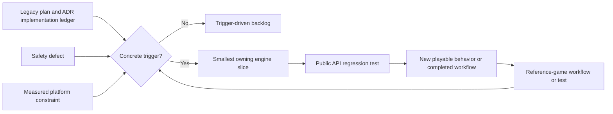
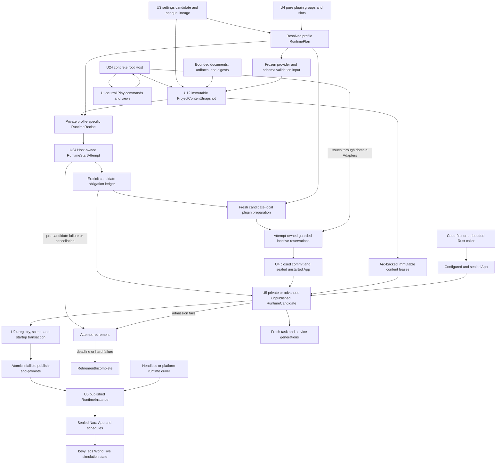
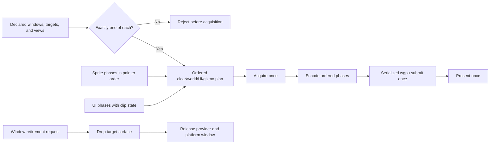
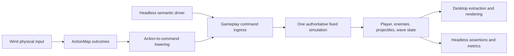
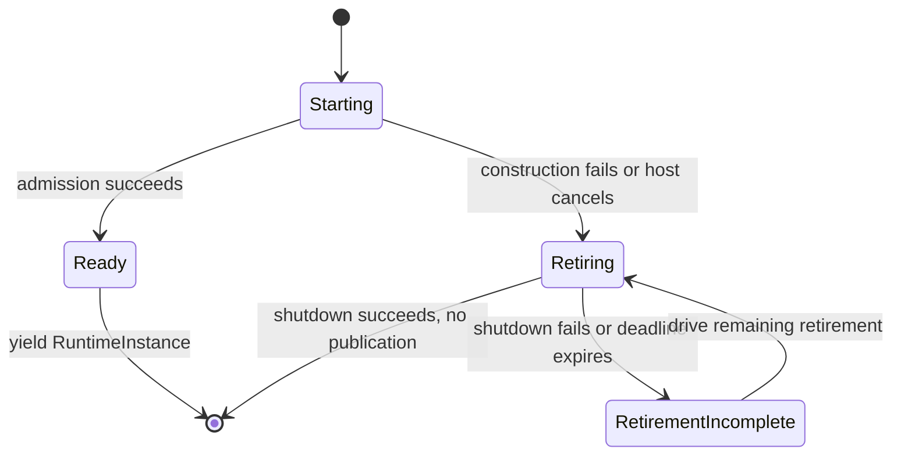
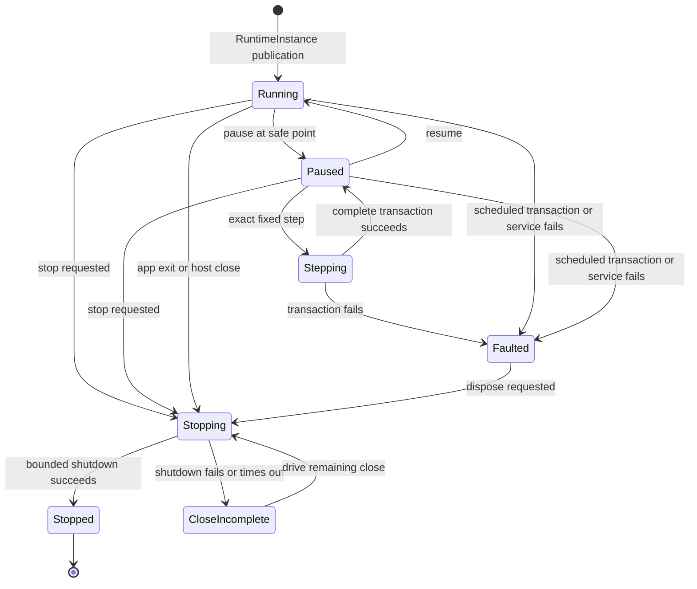
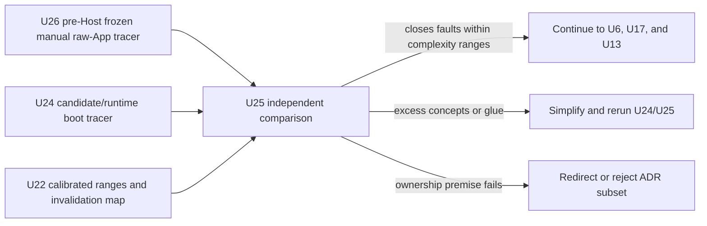
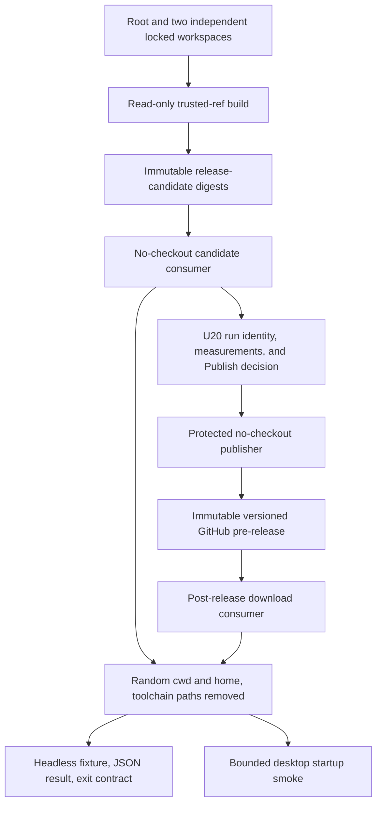

# Reference-Game-Driven Foundation Refactor - Plan

## Goal Capsule

- **Objective:** Replace the engine-wide contract-completion sequence with a first-playable, independently consumable reference-game slice that proves Nara's Rust authoring, modular composition, authorized content boot, runtime lifecycle, headless/desktop parity, renderer safety, and delivery path.
- **Authority:** `AGENTS.md` and `STRATEGY.md` govern product scope. Accepted ADRs govern implemented boundaries until evidence in this plan requires a focused revision. This plan supersedes the execution sequence and Definition of Done in `docs/plans/2026-07-10-001-refactor-engine-foundation-contracts-plan.md`, but it does not erase that plan's completed work or audit evidence. Cross-document references use the `RGF-U{N}` namespace; `legacy U{N}` always refers to the superseded plan.
- **Execution profile:** Fearless pre-1.0 refactoring is authorized. Remove obsolete APIs, placeholder crates, draft formats, and unused abstractions instead of preserving compatibility layers.
- **Preserved foundation:** Keep Rust as the complete official authoring language, `bevy_ecs` as the ECS substrate, Nara's fallible `App`, stable persistent identity, bounded task and diagnostic foundations, backend isolation, and semantic headless gameplay commands.
- **Evidence rule:** A new engine abstraction, crate, or ADR must answer a failing reference-game workflow, a concrete safety defect, or a measured platform constraint. Architecture completeness alone is not admission evidence.
- **Stop conditions:** Revise the active unit when its reference-game acceptance test disproves the proposed boundary. Stop and re-plan if two consecutive non-safety engine units add no playable behavior or completed production, safety, or falsifiable-evidence workflow, or if the first playable requires a broad return to the legacy 33-unit waterfall.
- **Tail ownership:** `ce-work` owns implementation, focused Conventional Commits, deletion of abandoned attempts, review follow-up, verification evidence, and updates to the implementation ledger. It must preserve all concurrent user changes in the existing dirty worktree.

---

## Product Contract

### Summary

Nara will complete one narrow foundation slice by building through its public surface, not by finishing every accepted architecture direction first. The slice builds on the landed U9, U1, U2, and U3 governance, authoring, and composition baseline, replaces the editor's bare Play `World` with a scheduled runtime, and delivers one Brotato-like wave through desktop and headless entry points.

The legacy plan remains an architecture-gap ledger. Its unfinished units become trigger-driven backlog unless this plan names them directly.

### Problem Frame

The July 10 plan correctly found serious lifecycle, identity, persistence, filesystem, rendering, and tooling gaps. It then converted nearly every gap into a prerequisite for product acceptance. That sequence now conflicts with `STRATEGY.md`: Nara has 29 workspace crates and many accepted ADRs, but no representative game proving that its public Rust APIs form a productive engine.

The active branch has since closed the canonical schema/authoring tracer, root capability and prelude split, safe surface retirement, and bounded PNG ingest. Those results remove four findings from the current critical path; they do not close the product workflow. Play Mode still stores a bare `World`, project ingest still stops before the startup scene and its asset closure, `PluginGroupBuilder` still mutates `App` while expanding a group, gameplay lifecycle errors are discarded, and no product Host owns a complete start attempt or published runtime.

Continuing the old sequence would still spend months closing speculative contracts before testing the most important hypothesis: whether a normal Rust project can build, iterate, inspect, run, and ship a small complete game through Nara's supported product surface. The next refactor therefore separates the already-useful Rust execution core from the integrated product Host instead of making either one wait for the other.

The remaining desktop correctness defects are narrower than a renderer rewrite: UI clipping is lost at the wgpu adapter, transparent sprite sorting still lets material identity influence painter order, and unsupported multi-view topology must reject before surface acquisition. Full transform propagation, RenderGraph compilation, browser WebGPU, GPU arenas, and tilemap chunk caches remain evidence-triggered work. The flat first wave must fail closed when a parented spatial or inherited-visibility contract would otherwise produce silently wrong state.

### Established Baseline

- The legacy runtime-safety foundation remains reusable: Nara owns `App`, fixed-time execution, stable identity, schema-aware scene documents, bounded tasks, structured diagnostics, and backend adapters.
- The active successor has public evidence for persistent Rust authoring, truthful root feature/prelude boundaries, capability-backed manifest ingest, safe native surface retirement, and bounded PNG import/publication.
- The remaining critical path spans four distinct ownership contracts plus one counterfactual freeze: a pure plugin plan is the shared prerequisite; the thin code-first runtime owner and immutable startup-content snapshot may then proceed in parallel; U26 freezes the manual snapshot/App baseline after content exists but before Host implementation; and the concrete product Host transaction combines the production owners.
- The implementation ledger remains the authority for partial versus implemented ADR evidence. Decision acceptance alone does not place work on the critical path.

### Requirements

#### Plan Governance and Evidence

- R1. The completed legacy U1-U5, legacy U8, legacy U18, and legacy U25 contracts remain the verified baseline and must not be reimplemented unless a regression test proves a defect.
- R2. Unfinished legacy units enter active work only when a reference-game failure, a safety defect, or a measured platform constraint names the required subset.
- R3. Every engine change made for the reference game must add a public regression test or a dependency-boundary assertion that prevents a private shortcut from becoming the product path.
- R4. The legacy plan, active-plan pointers, ADR ledger, and engineering state must identify this successor and its `RGF-U{N}` namespace before product or runtime implementation begins; accepted ADRs must distinguish a narrowed implemented slice from remaining direction.

#### Persistent Rust Authoring

- R5. Scene, prefab, scene-patch, and component-schema-catalog files must use one strict canonical version-1 envelope and reject incompatible, unknown, or over-budget input before publishing runtime or authoring state.
- R6. Persistent component and field identities must survive Rust and display-name changes through opaque stable IDs, aliases, retained tombstones, and separation of the persistent catalog from native Rust/Bevy bindings.
- R7. A runtime registry must freeze atomically before execution and reject every later schema, binding, codec, migration, or reflected-type mutation without changing the frozen snapshot.
- R8. A normal persistent Rust component must declare its schema, stable IDs, capabilities, and codec from one source without a handwritten `ComponentValue` codec or a duplicate field-kind table.
- R9. A runtime-only ECS component must continue to require only the normal Rust/`bevy_ecs` component contract; persistence metadata is opt-in.
- R10. Canonical version 1 contains only capabilities exercised by a current scene, inspector, patch, or reference-game workflow; animation, replication, scripting, dynamic ECS, and universal schema-source promises remain absent.

#### Product Composition and Runtime Ownership

- R11. Root Cargo features must form the coarse capability ceiling defined by ADR 0079: no-default compiles no product domain, default compiles only `runtime-core`, and optional 2D, runtime UI, tooling, watcher, platform, and backend domains compile only when selected.
- R12. File-backed project composition must read bounded `nara.toml` bytes through host-issued filesystem authority and lower a side-effect-free settings candidate with one opaque project/settings/profile lineage. Startup content and plugin planning carry that lineage independently. Compiled/requested capability admission and plugin/service/conflict/order planning remain separate pure phases; neither may create or mutate an `App`.
- R13. A default plugin group must expose stable slot IDs for disabling, same-plugin configuration, and relative ordering before installation; slot identity remains separate from installed plugin identity. A resolved plan stores repeatable typed definitions and canonical configuration, then privately prepares a fresh move-only plugin set for each candidate; it never retains an installed/live plugin object. Cross-plugin replacement and slot-contract version compatibility remain trigger backlog until a second concrete `PluginId` and public conformance suite prove them. Closed commit targets only a fresh unpublished or direct code-first App, so plugin-hook failure never requires rollback of a caller's existing running `App`.
- R14. `nara_app` must own only the `TaskUpdate` stage, `nara_tasks` only execution mechanics, and `nara_asset` the asset integration-set vocabulary and ordering.
- R15. A `RuntimeInstance` must remain a thin executable owner around one sealed `App`: lifecycle state, pause/resume, exact complete fixed-tick stepping, observable control results, main-thread driving, sticky fault propagation, and bounded cooperative shutdown. A private or advanced `RuntimeCandidate` admits only a sealed, unstarted App with no active hook or raw runner, owns every explicitly registered runtime close obligation, and promotes to `RuntimeInstance` only after startup succeeds. Arbitrary caller-injected resources are caller-owned by default and remain outside runtime isolation and `Stopped` evidence unless their ownership is explicitly transferred through the registration contract. The runtime layer must not own project loading, plugin-plan resolution, filesystem authority, scene documents, or a second schedule/time model.
- R16. One exact step from Paused must run one complete fixed Prepare/Simulate/Finalize and gameplay Admit/Consume/Capture/Acknowledge transaction, preserve prior debt/remainder, rotate trackers once, surface transaction faults, and return to Paused only on success.
- R17. A concrete product Host must combine one immutable `ProjectContentSnapshot` with one separately resolved profile `RuntimePlan` only when both carry the same opaque project-settings/profile lineage and compatible schema fingerprint. It retains the resulting `RuntimeStartAttempt`, transfers the sealed unstarted App plus registered obligation ledger into an unpublished `RuntimeCandidate` before registry/scene/startup work, and only after candidate startup succeeds performs one atomic, infallible publish-and-promote move into a fresh visible `RuntimeInstance`. No promoted-but-unpublished owner or fallible hook may exist across that boundary. Editor Restart stops the old owner before constructing a fresh `App`, `World`, queue, task/backend state, and runtime generation. A structural schema or authoring-document change creates a new snapshot/recipe revision; desktop Retry remains game-owned state inside one runtime, while standalone structural edits use process restart.
- R24. A concrete Editor Host must own one `RuntimeStartAttempt` while starting or retiring and one `RuntimeInstance` only after publication, never a bare `World`; `nara_tooling` owns only UI-neutral commands, views, observations, and Apply Changes models. Low-level Start and Restart reject an absent or stale `RuntimeRecipe`, while the integrated Host turns an author Play or Restart command into one pending refresh intent, prepares the current validated authoring revision, and automatically continues into runtime start without requiring a second click. Through public tooling APIs, an author must be able to inspect and submit a safe-point runtime patch for a persistent component, start scheduled Play, observe Pause Applied, execute an exact fixed-tick step, stop and restart, and persist an explicitly selected change only through schema-aware Apply Changes without a private world mutation path.
- R25. Every file-backed image path must reserve its encoded ceiling before read or dispatch, inspect dimensions through bounded header parsing, reject pixel-count and decoded-byte overflow, then atomically upgrade to a conservative host-wide peak before decode. The complete peak covers encoded retention, decoder scratch, native decoded output, RGBA conversion, and publication overlap; exceeding any stage publishes neither a new asset nor a failed-reload replacement.
- R26. The executable host must complete one authorized `nara.toml` -> startup scene/prefab/asset dependency closure -> runtime path using only host-issued capabilities and opened handles during content-snapshot construction. The first host resolves `AssetRef::Path`; `AssetRef::StableId` fails with a structured unsupported-reference diagnostic until a bounded stable-ID catalogue has a concrete consumer. Discovery must bound directory depth/entries, cumulative path bytes, simultaneous handles, files, import jobs, dependency edges, encoded source bytes, decoded/work bytes, imported-artifact residency, and total retained snapshot bytes. `nara_project` remains side-effect-free, runtime attempts consume immutable validated values and digests without reopening source, and no domain reconstructs ambient paths.
- R27. A backend surface must never outlive the window/provider authority that made its raw handles valid. Window retirement requires an explicit renderer retirement result before provider removal. The first desktop product supports one window, one render target, and one camera/view; an owned immutable `RenderFramePacket` captures that admitted topology at the final pre-acquire boundary, additional or generation-drifted topology rejects before acquisition, and the serialized wgpu host acquires, submits, and presents the supported packet at most once per frame.
- R28. The desktop first playable must preserve transparent painter order across material changes and carry UI clip rectangles into backend scissor state; batching may split at material or clip boundaries but may not reorder visible semantics.
- R29. The root facade must keep `nara::prelude` gameplay-first and backend-free; backend/tooling internals, diagnostic storage, command-queue lifecycle, project-host implementation, render extraction/queue/batch types, and native bundles remain in module-specific or advanced surfaces rather than the default authoring namespace.
- R30. A separate locked consumer must depend directly on `nara_scene` and its documented public prerequisites, without the root `nara` facade, then load and spawn a committed scene fixture through the supported module boundary.
- R31. The concrete product Host must establish one candidate-local ownership/obligation ledger before the first fallible preparation, hook, or acquisition. Each successful guard enters that ledger exactly once. First-party plugins and services that create threads, native handles, or waitable close work must register those obligations before App sealing; arbitrary resources cannot be inferred as obligations from Rust type storage. Failed or cancelled admission retires the same ledger in reverse dependency order; successful candidate creation atomically moves the sealed App and complete ledger into `RuntimeCandidate`, and the final publish-and-promote boundary atomically moves that same owner into the Host's visible `RuntimeInstance` slot without a second copy or later failure point. First-party hooks must remain nonblocking; waitable admission and shutdown work is pollable, cancellable, and deadline-bound. The ledger is not a runtime service locator.
- R35. Rust-only and embedded callers must be able to configure and seal an `App`, explicitly register runtime-owned obligations when transferring them, retain arbitrary external resources as caller-owned by default, and use the thin candidate/runtime lifecycle without adopting `nara.toml`, startup-content loading, an editor, or a universal Host Interface. The integrated root Host is the supported first-party product path, not a mandatory control plane for every Nara module consumer.

#### Reference Game and Delivery Proof

- R18. The reference game must be an in-repository independent Cargo workspace with its own lockfile and a single path dependency on the public root `nara` package.
- R19. The first playable must include player movement, deterministic enemy spawning, automatic projectiles, hit/death resolution, one completed or defeated wave, and a non-text runtime HUD whose health, progress, and terminal geometry track authoritative state through public scene, prefab, data, sprite, input, gameplay-command, and UI APIs.
- R20. Desktop physical input and headless semantic-command input must converge on the same fixed-tick gameplay systems and produce equivalent authoritative state for the same command sequence.
- R21. The reference game must not depend directly on `crates/nara_*`, workspace dependency inheritance, `[patch]`, engine-private hooks, or reference-game-only branches inside engine crates.
- R22. The first instrumented U14 slice must record P50/P95 edit-to-result latency for data, compatible Rust function-body, and structural Rust changes; clean checkout-to-headless-wave and clean checkout-to-manually-playable-desktop time; add-module and supported-slot-configuration success/time; public production coverage; frame-time P99; memory; and build time. U20 records candidate artifact size and startup only after U7 produces immutable candidates.
- R23. Windows and Linux CI must test the root, independent reference-game, and direct module-consumer workspaces under separate lockfiles, then build an executable-relative `project/` release candidate whose headless runner and bounded desktop smoke run from a random working directory without Cargo, a Rust toolchain, a Nara source checkout, or hidden user-home state. Candidate identity must bind repository owner/name, workflow path and reviewed definition SHA, event/trigger chain, protected ref, run/attempt, source commit, immutable artifact ID, size, retention deadline, and digest; fork, `pull_request_target`, untrusted `workflow_run`, and unpinned reusable-workflow candidates are ineligible. After final evidence approval, a protected publisher must revalidate and release the exact approved candidate identities and digests as a versioned immutable GitHub pre-release evidence build and repeat download-consumer smoke.
- R32. Before the remaining composition, startup-content, runtime, or root-Host implementation begins, a versioned first-playable evidence protocol must freeze the semantic headless and desktop subjects, U25 author-concept/caller-glue/lifecycle/fault comparison, scope, sourced ranges, minimum samples, per-metric environment-equivalence fields, digest-bound source and environment invalidation rules, hard stop conditions, and Continue/Redirect/Stop logic. Later units may bind those subjects to concrete public entry points without changing the protocol digest. A failed U25 gate blocks diffusion; a headless hard stop blocks U13 immediately; otherwise U14 evaluates both the authoritative headless wave and the manually playable desktop path without changing those rules.
- R33. Before U20 may record Publish, a fresh human or coding-agent runner that did not implement the affected APIs must use only committed public documentation to run the headless wave, change one persistent component, configure one supported plugin slot, and produce a standalone candidate. Evidence must identify the runner class; agent-only success must not be generalized into an unaided-human usability claim.
- R34. U21 publishes an immutable GitHub pre-release evidence build, not a stable compatibility release. Release notes must name the intended early-adopter audience, supported slice, deferred capabilities, and pre-1.0 breaking-change policy.
- R36. After U4/U12 but before U24 implementation, U26 must freeze and independently review an evidence-only manual raw-App tracer, caller-glue/concept inventory, and baseline record for the exact plan, snapshot, fixed-tick task, and shutdown target. U25 later runs that unchanged tracer and the U24 Host tracer on the same current source revision, toolchain, content, command input, and U22 environment class while the manual path bypasses U24 ownership orchestration. Post-U26 changes to the tracer or its dependency surface are allowed only when the protocol proves them mechanically semantics-preserving; any change to concepts, caller glue, states, fault boundaries, or shutdown flow invalidates the comparison and requires a newly blinded baseline review before U24 continues. Landed U2/U3 samples remain historical lineage. The new model may continue only when it closes named failure/ownership gaps without exceeding U22's independently calibrated complexity limits; otherwise it must be simplified, redirected, or rejected before U6/U17/U13.
- R37. Every U14/U25/U20 result crossing from an untrusted or credential-free collector into trusted review, repository, or publication state must use one versioned non-executable evidence envelope with encoded-byte, depth, record-count, field-count, and string-length budgets. The envelope allowlists typed fields and safe relative identifiers, binds source run, source revision, protocol digest, environment class, subject, and payload digest, and carries normalized redacted records rather than arbitrary logs or shell text. Trusted ingestion fetches by expected identity and size, uses structured parsing without shell interpolation, rejects links, special files, traversal, aliases, unexpected archive entries, forged identity/environment fields, and digest mismatch, and never executes candidate-controlled content. Raw logs that cannot be safely normalized remain in access-controlled, time-bounded artifact storage and are referenced only by non-secret identity and digest.
- R38. Before U20 begins its non-program-author journey, one bounded first-party project-creation candidate must start outside an existing project, accept one author-facing product preset, and generate a mutually consistent Cargo feature ceiling, `nara.toml` capability request, first-party plugin composition, and runnable product entry without manual Cargo edits. The candidate is selected by a pre-implementation alternatives comparison, remains reversible, and supplies evidence to OQ-037 rather than accepting the permanent CLI/Editor/template Interface.

### Acceptance Examples

- AE1. Given a scene, prefab, patch, or catalog envelope with the wrong kind, a future format version, an unknown field, or an exceeded byte/depth/count budget, loading rejects before unbounded payload construction or component decoding and leaves the prior document, registry, and world unchanged.
- AE2. Given a field whose Rust name and display alias change while its field ID remains stable, the existing durable patch still resolves to the field; a committed prior catalog proves that a removed ID became a tombstone and can never be reactivated.
- AE3. Given `Player`, `Enemy`, `Weapon`, and `Projectile` Rust components, their declarations generate schemas and codecs without handwritten `ComponentValue` conversion code; a component with no persistence derive remains an ordinary ECS component.
- AE4. Given an unsupported field type, missing stable ID, duplicate field ID, or capability unsupported by canonical version 1, compilation or registry freeze fails with a focused error rather than inferring a contract.
- AE5. Given a project request outside the compiled Cargo ceiling, a compiled-but-unrequested capability required by a configured entry, a missing plugin service, a disabled prerequisite, a plugin conflict, or a preparation failure, the correct `CompositionError` / `PluginPlanError` / `PluginPrepareError` phase rejects before committed `App` mutation or service reservation. A later valid plan resolves from the same inputs; preparing it twice creates distinct plugin owners with stable definition/configuration identity, and only a fresh unpublished candidate receives `PluginError` hooks.
- AE6. Given generic staged slots, the reference game can disable the optional tilemap slot, configure image limits, place its gameplay plugin relative to a stable slot, and configure the existing `WindowPlugin` for desktop without editing Nara source. It does not claim that a different plugin implementation is replaceable.
- AE7. Given a paused runtime with retained fixed debt and a queued command, exact step advances one tick, consumes and acknowledges the command once, preserves prior debt and remainder, and returns to Paused.
- AE8. Given a failed product-Host start, a never-completing service shutdown, or Close/Reload/Restart while Play owns resources, no false Running/Stopped state or silent owner drop is published; the Host retains the start attempt or runtime until retirement completes, and a fresh restart contains none of the old runtime's mutable ECS, queue, task, or native-handle state.
- AE9. Given the same semantic movement command sequence, desktop-lowered input and direct headless ingress finish at the same tick and outcome with the same stable-ID-sorted player, enemy, projectile, and score snapshot; losing focus releases held movement and command rejection is observable rather than silently diverging.
- AE10. Given a clean artifact-consumer job with no source checkout and a random current/home directory, the headless binary loads its bundled fixture, emits one stable JSON result, exits with the documented code, and the desktop binary completes a bounded startup smoke using only executable-relative project files.
- AE11. Given an edit document containing a derive-backed game component, a public inspector patch increments its revision and invalidates the prior runtime recipe. Low-level Start with that stale recipe rejects; integrated Play exposes PreparingPlay, prepares the current validated recipe, and automatically reaches Starting/Running without a second click. Pause reaches Applied and exact Step consumes the value; Stop and a fresh same-revision Restart retain the edited document value and none of the prior runtime state.
- AE12. Given an encoded image at every exact per-image and aggregate peak limit, import succeeds; given limit+1 bytes, oversized declared dimensions, pixel-count overflow, a decompression bomb, or concurrent individually valid jobs whose complete peak reservations exceed the host budget, import fails before the unreserved allocation and preserves the last good asset generation.
- AE13. Given a packaged project and a random current/home directory, the root-owned public product action opens the executable-relative project authority once, resolves only the path-addressed startup scene/prefab/asset closure within every aggregate discovery budget, freezes leased immutable values and digests into a `ProjectContentSnapshot`, combines it only with a profile plan carrying the same project lineage and schema fingerprint, and reaches the first fixed tick without ambient lookup, payload duplication, source reopen by the runtime start attempt, or a reference-game-only engine hook; each aggregate limit+1 or lineage mismatch rejects before candidate construction or partial publication.
- AE14. Given a window with an existing wgpu surface, close/destroy first retires that surface and then releases the provider/window. Given the supported one-camera/one-target `RenderFramePacket`, the wgpu host acquires, submits, and presents once; a second camera/target in the captured packet, packet-generation drift, or a second acquire request rejects before touching the surface.
- AE15. Given overlapping transparent sprites with different materials and a clipped HUD child, the backend draw sequence follows declared painter order and the child is scissored to the effective clip; changing a material cannot move it in front of or behind a sibling.
- AE16. Given a clean independent workspace that depends on `nara_scene` but not the root facade, its committed scene fixture parses, validates, and spawns through documented public dependencies; adding root-facade use, workspace inheritance, or a private Nara crate fails the dependency gate.
- AE17. Given a first-party plugin or service that registers an owned resource and then fails inside preparation, `build`, `finish`, activation, startup, or publication preflight, the candidate ledger already owns that acquisition, every acquired owner is shut down exactly once in reverse dependency order, and no Running runtime is published. On candidate admission, the sealed App and ledger move once into `RuntimeCandidate`; the final atomic publish-and-promote move makes that same owner the visible `RuntimeInstance` and leaves the start attempt with no shutdown authority. A never-completing waitable admission remains Host-drivable; Stop/cancel moves its `RuntimeStartAttempt` through retirement and deadline-bound `RetirementIncomplete` without blocking the main thread.
- AE18. Given an evidence-approved final candidate, a protected no-checkout publisher can publish only the exact handed-off run/artifact identities and digests under an authorized immutable `vX.Y.Z` pre-release. An unreviewed publisher commit, unprotected tag, unreachable commit, version mismatch, expired or mismatched artifact, unsafe archive table, mutable asset, or post-publication download mismatch prevents announcement and extraction; successful downloads repeat headless and desktop smoke.
- AE19. Given a clean environment and only committed public documentation, a fresh runner with no implementation context can run the headless wave, change one persistent component, configure one supported slot, and produce the standalone candidate without a private API or undocumented step; the evidence labels whether the runner was human or agent-assisted.
- AE20. Given an embedded or code-first Rust application with no project manifest, the caller can configure and seal one public `App`, explicitly transfer any runtime-owned close obligations, choose manual or nara-owned runtime driving, run/pause/step/stop it, and observe typed faults without constructing a project Host or importing editor/backend internals. An already-started App, plugin-selected raw runner, or first-party obligation-bearing adapter that failed to register its obligation rejects before candidate admission; arbitrary caller resources remain caller-owned rather than being guessed from their Rust types.
- AE21. Given U26's pre-Host frozen manual tracer and the same current-source U4 plan, U12 content snapshot, minimal headless scene, toolchain, command input, fixed tick, bounded stop, and environment class, the unchanged manual raw-App tracer and U24 Host tracer produce the same authoritative result. The U25 review records the required author-facing concepts, caller glue, lifecycle transitions, injected-fault coverage, and shutdown proof for both; target-aware baseline edits, task drift, environment inequivalence, missing provenance, a new unowned state, or an exceeded precommitted complexity limit prevents the ownership model from spreading to U6/U17/U13.
- AE22. Given collector output containing limit+1 bytes/records/depth/string length, an absolute or traversing path, symlink or special file, unexpected archive entry, forged source/environment identity, digest mismatch, shell metacharacters, or path/username/proxy-URL/credential canaries, trusted evidence ingestion rejects it without execution, interpolation, repository mutation, or secret disclosure. A valid bounded envelope publishes only normalized redacted records bound to the expected run, source, protocol, subject, environment, and digest; restricted raw logs remain outside the repository under explicit retention.
- AE23. Given an empty authorized destination outside an existing project and one supported product preset, the provisional first-party creation path atomically produces a project whose Cargo features, `nara.toml` request, plugin plan, startup content, and Run/Play action agree. Existing/non-empty destinations, path escape, partial-write injection, unsupported presets, or generated closure drift reject without publishing a half-project. A fresh contributor can run, stop, and reopen the result without constructing infrastructure IDs or editing Cargo; success does not accept OQ-037's permanent Interface.

### Success Criteria

- The first playable is complete through public APIs, and the dependency audit reports 100% public production coverage for the implemented slice.
- Ordinary reference-game persistent components contain no handwritten codec or duplicate schema field table.
- Generic staged slots demonstrate same-plugin configuration, disable, and ordering before the headless wave; U13 configures the existing desktop-window slot before U14 evaluates the complete product path. Cross-plugin replacement remains absent until a second implementation proves a separate contract.
- The direct `nara_scene` consumer builds and runs independently, proving module reuse without claiming arbitrary cross-engine compatibility.
- Headless parity tests replay the desktop semantic command stream deterministically for the fixed first-wave scenario.
- Data, body, and structural edit paths each have reproducible P50/P95 baselines; clean-to-headless and clean-to-manually-playable-desktop journeys, add-module, and window-slot-configuration workflows have separate timed success records; no latency claim is made before these measurements exist.
- Headless and desktop comparison subjects, independently sourced ranges, hard stops, sample rules, per-metric environment-equivalence classes, evidence-envelope rules, digest-bound source/environment invalidation rules, and decision logic are committed before U4/U12/U5/U24. U26 freezes the manual counterfactual after U4/U12 and before U24; later units may bind public entry points but cannot rewrite the protocol or baseline semantics. U25 must Continue before the model spreads; a failed headless hard stop prevents U13; otherwise the final U14 decision requires both the authoritative headless wave and a manually playable desktop path.
- Windows and Linux CI independently build and test the root, reference-game, and module-consumer workspaces with separate lockfiles, produce runnable standalone artifacts, and publish trusted tagged packages through a versioned immutable GitHub pre-release evidence build.
- Hostile image fixtures, window-retirement tests, single-target admission tests, transparent ordering tests, and UI clipping tests pass before the desktop first playable is accepted.
- Every engine crate or ADR added during execution cites its concrete consumer and admission evidence; otherwise the work deepens an existing module or is deleted.
- A versioned evidence review records the pre-implementation protocol, raw lineage, a docs-only clean-room journey, and the rule for selecting the next vertical slice before any successor implementation starts.
- One pre-U20 project-creation candidate proves that a single product choice can generate a coherent runnable project without exposing capability-closure or plugin-planning machinery; the permanent template/CLI/Editor shape remains OQ-037 evidence-gated.

### Scope Boundaries

**In scope**

- The landed U9-U3 governance, stable identity, catalog/binding, patch-address, registry-freeze, Rust-authoring, and project-composition baseline remains authoritative evidence.
- A reference-game-proven Rust derive/provider path for persistent components.
- ADR 0079 compiled capability ceilings, atomic project composition, placeholder audio retirement, configurable plugin slots, and post-headless-wave ADR 0080 task-set ownership.
- A gameplay-first root prelude plus explicit advanced/module-specific surfaces; crate boundaries remain reusable without forcing every domain into the default compile or import path.
- A sealed code-first `App` -> thin `RuntimeInstance` path, pure replayable plugin planning/preparation, one lineage-bound immutable startup-content snapshot, one concrete root product Host start transaction, and scheduled Editor Play integration.
- Bounded image decode, safe owning surface creation plus explicit surface/window retirement, honest single-window/single-camera admission, transparent painter-order preservation, and backend UI clipping required by the first desktop wave.
- One public default-host content boot from authorized project root through asset roots and startup scene; this is a concrete product path, not a universal `EngineHost` or arbitrary virtual filesystem framework.
- One deterministic 2D arena-survival wave with a semantic non-text HUD, desktop input, headless parity, a precommitted headless productivity gate, a docs-only clean-room journey, metrics, three-workspace CI, and standalone GitHub pre-release evidence artifacts built from the source-distributed reference workspace.
- One provisional first-party project-creation path for the U20 clean-room trial, selected from bounded alternatives and explicitly not frozen as the permanent project-authoring Interface.
- Focused repairs to legacy U6, U7, U10-U14, U28, or U31 only when a named first-playable test fails without them.

**Deferred until evidence triggers a later vertical slice**

- An official Luau, C#, Rhai, Wasm, or other second author language; a universal behavior host; dynamic non-Rust ECS components; or a stable native dynamic ABI.
- Subsecond or another native hot-patching product commitment. This plan measures safe data reload, incremental rebuild, fresh restart, and compatible body-edit experiments separately.
- Text shaping, IME, accessibility, full pointer capture, audio, save games, persistent replay/checkpoints, system stepping, and backwards debugging.
- Full inherited visibility and hierarchy semantics not required by the flat first-wave scene, nested prefab rebase, edit-while-playing merge, editor persistence receipts, recovery journals, and multi-instance editing. Parented spatial/visibility content that requires those semantics fails closed in this slice.
- Asset rename recovery, artifact-group publication, generalized residency, multi-camera/multi-target coordination, offscreen/image-target production and cross-target dependency rendering, render graphs, GPU upload arenas, large-map culling caches, high-end 3D, networking, browser, mobile, console, marketplace infrastructure, and Steam publication.
- A project-wide stable-ID-to-path asset catalogue and `AssetRef::StableId` startup lookup; the first authorized host supports path references and fails closed without scanning the asset root.
- Artifact signing, transparency/provenance attestations, auto-update distribution, and long-term release-channel policy. CI trust isolation in this plan is not a claim of artifact authenticity.

---

## Planning Contract

### Key Technical Decisions

1. **Create a successor and migrate execution authority before code work.** The old plan contains valuable audit and completion evidence and concurrent uncommitted edits. `RGF-U9` preserves those changes while marking the old artifact `superseded_by`, repointing active engineering state, and moving cross-document unit references into the `RGF-U{N}` or `legacy U{N}` namespace.
2. **Make both public consumers independent nested workspaces.** `reference-game/` and `module-consumer/` own their packages and lockfiles, while the root workspace uses `exclude = ["reference-game", "module-consumer"]`. The reference game proves the integrated product surface; the direct consumer proves documented module reuse. Both expose feature unification, workspace inheritance, private-crate access, and packaging failures that root workspace members would hide.
3. **Keep Rust complete and make persistence opt-in.** Nara does not add a mandatory script language. A proc-macro derive plus a runtime provider trait removes repetitive persistent-component registration, while ordinary ECS components remain free of schema requirements.
4. **Use explicit IDs and a checked catalog lineage.** Derive input must name stable type and field IDs. Rust paths, field names, and display aliases may help diagnostics but cannot become wire identity. Source-controlled catalog compatibility compares the generated catalog with its committed predecessor so deletion requires a tombstone and tombstones can never reactivate.
5. **Narrow schema vocabulary before making it canonical.** U1 implements only scene/inspect/edit and reference kinds used by current consumers. Future save, animation, replication, script, and diagnostic projections add capabilities in their own consumer-backed format revisions or ADR refinements.
6. **Resolve composition without an `App`, then prepare fresh plugin owners privately.** Cargo capability admission, plugin planning, plugin preparation, and App hooks retain distinct `CompositionError`, `PluginPlanError`, `PluginPrepareError`, and `PluginError` phases. U4 resolves static declarations, stable definition/configuration keys, requirements, conflicts, provider selection, disable state, and ordering into one immutable `RuntimePlan` plus frozen schema-validation input. Each preparation materializes a candidate-local move-only plugin set from typed repeatable definitions; a plan never stores an already installed/live plugin object, and the root Host never switches on plugin IDs. U24 closed-commits that set only to a fresh unpublished candidate, so arbitrary plugin hook effects never require rollback of an existing caller-owned `App`.
7. **Adopt configurable groups only as consumers arrive.** Nara keeps its fallible `App` and closed core lifecycle. U4 introduces stable slot identity, same-plugin configuration, disable, add-before, and add-after because the headless/desktop products consume them. Cross-plugin replacement, slot-contract version compatibility, custom main-loop insertion, and broader schedule customization remain deferred until concrete consumers and conformance evidence exist.
8. **Treat ECS as runtime state, not the process control plane.** The integrated ownership chain is concrete Host -> immutable snapshot plus resolved plan -> `RuntimeStartAttempt` -> `RuntimeCandidate` -> `RuntimeInstance` -> `App` -> `World`. Filesystem authority, project documents, GPU/audio/task hosts, and editor workspace state retain their domain owners. A code-first caller may enter at configured `App` without adopting the outer product scopes.
9. **Separate three restart meanings.** Desktop Retry resets game-owned run state at a fixed-tick safe point inside one runtime. Editor Restart asks the integrated Host to stop, refresh any stale content/recipe revision, and drive a fresh runtime start. Structural edits to a standalone game use process restart; this slice does not invent `EngineHost` to hide those different lifecycles.
10. **Keep four contracts distinct until the product join.** U4 owns pure profile/provider planning, private preparation, and sealed App commit from U2/U3 declarations; it is the shared prerequisite for U12's immutable authorized startup content and U5's candidate admission plus thin published lifecycle around one sealed `App`. U12 and U5 proceed in parallel only after U4, and U24 is the sole product join through a private recipe and Host-owned `RuntimeStartAttempt`. This preserves the Rust-only embedding path and prevents either `RuntimeInstance` or `ProjectContentSnapshot` from becoming the product control plane.
11. **Make ownership transfer and shutdown explicit.** U24 creates one obligation ledger before the first fallible action. First-party obligation-bearing plugins and services register into it explicitly; arbitrary caller resources remain caller-owned unless transferred. Failure retires that ledger. Once U4 has sealed an unstarted App, U24 moves the App and ledger into U5's unpublished `RuntimeCandidate`; after every fallible startup and publication-preflight step succeeds, one infallible publish-and-promote move makes that same owner the visible `RuntimeInstance` and leaves the attempt empty. No intermediate promoted-but-unpublished owner exists. The ledger supports close/fault traversal but no service lookup. First-party synchronous hooks are audited non-blocking code, not preemptible runtime work. U24 retains incomplete pre-publication retirement; U5 retains incomplete post-publication close. A typed fatal-runtime-fault channel accepts gameplay lifecycle invariants, fallible systems, and explicitly required task/service integrations; malformed external submissions, optional task failures, and last-good-preserving asset reload failures remain structured domain outcomes rather than automatically faulting a healthy runtime.
12. **Bind packaged project authority to the artifact.** Release layout places `project/` beside the executable and resolves it without consulting the current directory or user home. Development may pass an explicit host-authorized project root; file-backed reads still use opaque `nara_fs` capabilities and opened handles.
13. **Calibrate and freeze a small evidence contract before implementing what it judges.** U22 records semantic headless and desktop subjects, metric scope, minimum samples, per-metric environment-equivalence fields, hard stops, and Continue/Redirect/Stop rules before U4/U12/U5/U24. Every non-safety range names a source: the landed U2/U3 path, a strategy budget, or a pinned task-level external comparison selected by a reviewer who has not seen U4+ target results. A required metric without a defensible source cannot produce Continue. The digest also covers the versioned path-class invalidation map and environment invalidation rules: multi-match source changes take the union, shared engine/build/config changes invalidate the full affected suite, and a changed environment may reuse a metric only when every declared field remains in its precommitted equivalence class. Later units may bind concrete public entry points but cannot change the digest. U22 does not build a benchmark framework; U14 implements bounded collection helpers and judges the complete path under the unchanged contract.
14. **Safety defects bypass the playable-trigger wait.** A reachable unsafe lifetime or unbounded untrusted-input allocation is itself admission evidence. Image decode and surface retirement receive explicit units and regression owners instead of waiting for the reference game to fail nondeterministically.
15. **Keep file authority in a concrete product host without freezing a universal host API.** U4 derives provider selection and a frozen schema/codec validation input from U2 declarations plus U3's side-effect-free settings/profile candidate. U12 extends the existing root project host with the first file-backed snapshot load and process-lifetime capabilities, borrows that validation authority, and stores only its fingerprint and common lineage in content. U24's root Host owns private profile recipes and runtime start attempts. `nara_project`, `nara_reflect`, `nara_asset`, and `nara_scene` keep parsing, validation, import, and spawn semantics in their domains. Extract another public crate only if two real hosts require the same boundary.
16. **Fail closed on render topology the first game does not consume.** The first desktop path admits exactly one window, target, and camera/view, then performs one serialized wgpu acquire/encode/submit/present transaction. Additional views or targets reject before acquisition. Multi-camera and multi-target coordination wait for a concrete consumer rather than making a generalized coordinator a first-playable prerequisite.
17. **Preserve visible order before maximizing batches.** Transparent sprite ordering is `(view, phase, layer, sort key, source tie-break)`; material is a batch-compatibility key only after order is fixed. UI clip is backend-visible state and therefore part of batch compatibility and draw encoding.
18. **Use headless as a fail-fast checkpoint, not the product verdict.** U6 must satisfy U22's hard headless stops before U13 begins, but Nara is a game engine product only when the same public path produces a manually playable desktop game. U14 makes the first Continue/Redirect/Stop decision from both paths. U20 later adds Editor, clean-room, and exact release-candidate evidence; U21 publishes only an approved candidate.
19. **Move the minimum CI feedback loop ahead of the long implementation chain.** Once U3 stabilizes the feature graph and U18 adds the direct module consumer, Windows and Linux jobs build the root, reference game, and module consumer with separate lockfiles on disposable hosted runners. Release-candidate packaging and consumption stay in U7; protected publication and post-release consumption stay in U21.
20. **Keep ADR decision status separate from implementation evidence.** `Accepted` means Nara selected a decision; `implemented` in the ledger means code and verification prove it. High-cost candidates remain Proposed while named plan units run bounded evidence trials. U5/U24/U17/U13 do not silently admit ADRs 0082/0084: U23 evaluates the thin runtime and outer Host decisions independently, then checks their product compatibility. One may be accepted while the other is rejected, but U20 remains blocked until every required product authority is Accepted or replaced by an Accepted successor and the affected evidence is rerun. Adding `Trial` to the ADR decision enum would conflate authority with execution progress, so U19 strengthens set/link/anchor validation without redefining that lifecycle.
21. **Bind each runtime recipe to one common project lineage and immutable content/authoring revision.** The authorized U3 settings candidate creates an opaque project/settings/profile lineage. U4 resolves a `RuntimePlan` and frozen provider/schema input against it; U12 consumes that input and carries the same lineage plus validation fingerprint into `ProjectContentSnapshot`. U24 rejects individually valid but cross-lineage values before candidate creation, then verifies the fresh runtime registry fingerprint before scene spawn. The start attempt consumes exact leased values and does not reopen project source. Source or authoring-document changes create a new snapshot/recipe revision, and the concrete Host rejects stale recipes before Start/Restart.
22. **Resolve only the startup dependency closure under aggregate admission budgets.** The executable host does not index an entire asset root. It lazily follows the startup scene, prefab, and asset dependency closure while charging structural counts plus encoded, decoded/work, imported-residency, and retained-snapshot bytes. Editor-wide indexing waits for its own consumer and budget contract.
23. **Separate release-candidate capability from final candidate and publication.** U7 establishes a repeatable read-only candidate build/consumer pipeline. After all pre-publication dependencies land, U20 reruns that pipeline from the exact reviewed source commit, binds the final artifact IDs and digests to that trusted workflow run, measures the result, and records Publish/Redirect/Stop plus its retention deadline. U21 first lands and reviews the privileged publisher code, then publishes the exact U20-approved bytes without checkout or rebuild and repeats download smoke before announcing the pre-release evidence build.
24. **Share immutable content without duplicating its residency.** `ProjectContentSnapshot` stores documents and imported payloads behind `Arc`-backed content leases. Candidates and runtimes clone leases, not payload bytes; runtime handles, generations, prepared backend objects, and other mutable projections remain instance-local. A lease keeps one host residency charge alive until its last snapshot/runtime owner drops, while a new content revision receives separate charges so old/new overlap remains visible.
25. **Keep unsupported hierarchy semantics observable.** The flat first wave may use scene identity and prefab provenance without claiming inherited transform or visibility propagation. Any parented spatial/visibility content whose result depends on those semantics rejects before runtime publication; ADR 0085 remains Proposed until a real game needs propagation and reparenting behavior.
26. **Seal `App` before runtime ownership and drive only through the runtime boundary.** U4 makes plugin declarations, pure resolution, preparation, closed commit, and the ban on hook-time plugin/group/runner mutation one App contract. U5's unpublished `RuntimeCandidate` admits only an unstarted sealed App plus explicitly registered runtime obligations; arbitrary resources remain caller-owned. Startup work stays candidate-scoped, and only the atomic publish-and-promote boundary yields a visible `RuntimeInstance`. A nara runner or platform event loop receives the candidate/runtime drive boundary, never a raw `&mut App` path that can call `App::run_once` behind the lifecycle state machine.
27. **Freeze the counterfactual before building the target, then falsify before diffusion.** U26 lands and independently reviews the exact manual raw-App task plus caller-glue/concept inventory after U4/U12 and before U24. U25 later compares that frozen path with the minimal U24 path on the same current source, plan, snapshot, toolchain, task, and environment class; only protocol-proven mechanical rebinding may touch the baseline after U26. It measures public concepts, caller glue, lifecycle transitions, fault coverage, and ownership proof under U22's precommitted ranges; U2/U3 remains historical lineage only. Redirect or Stop blocks the complete game, Editor, and desktop adapters.

### High-Level Technical Design

#### Evidence-Driven Work Intake



The implementation ledger remains broad. The active code lane remains narrow. A legacy unit is not resumed wholesale when one of its subcontracts is needed.

#### Ownership Topology



The product path joins at U24; the code-first path enters U5's candidate/runtime lifecycle after U4's App sealing contract. The diagram names ownership scopes, not a requirement to create one crate or public type for every box. The lineage token proves that separately cached content and plan values came from one settings/profile input; it is not a global current-project lookup. This plan introduces no speculative `EngineHost`, universal `ProjectContext`, or mandatory project-host framework.

#### Authorized Project Content Boot

```mermaid
flowchart LR
    Process[Executable host authority] --> Root[Opened project directory capability]
    Root --> Manifest[Opened nara.toml handle]
    Manifest --> Settings[Bounded settings candidate plus opaque lineage]
    Settings --> Roots[Authorized project roots]
    Providers[U2 persistent component providers] --> Plan[U4 profile and provider plan]
    Settings --> Plan
    Plan --> Schema[Frozen schema and codec validation authority]
    Roots --> Closure[Budgeted startup dependency closure]
    Schema --> Closure
    Closure --> Import[Bounded staged asset generations]
    Closure --> Scene[Bounded scene and prefab documents]
    Import --> Snapshot[Validated immutable ProjectContentSnapshot]
    Scene --> Snapshot
    Settings --> Snapshot
    Schema -->|fingerprint only| Snapshot
    Snapshot --> Recipe[U24 profile-specific RuntimeRecipe]
    Plan --> Recipe
    Revision[Authoring revision] --> Recipe
    Recipe --> Attempt[U24 fresh RuntimeStartAttempt]
    Attempt --> Candidate[U5 RuntimeCandidate owns sealed App and ledger]
    Candidate --> Freeze[Freeze fresh native registry and bindings]
    Freeze --> Match{Schema fingerprint matches?}
    Match -->|yes| Preflight[Final scene codec and spawn preflight]
    Match -->|no| Abort[Bounded candidate abort]
    Preflight -->|success| Startup[Candidate-scoped startup]
    Startup --> Publish[Atomic infallible publish-and-promote]
    Publish --> Runtime[U5 published RuntimeInstance]
    Preflight -->|failure| Abort[Bounded candidate abort]
```



Only the process-facing host acquires ambient authority. Every downstream edge carries an opened capability, bounded owned data, or a validated immutable candidate; domain crates do not reconstruct filesystem names into authority.

#### First Desktop Render Transaction



Material and clip changes may split batches inside the ordered plan. They do not become sort authorities. The first product fails closed instead of generalizing unsupported camera/target topology, and window destruction cannot release the handle provider before the surface retires.

#### Shared Desktop and Headless Simulation



The two paths share commands and systems, not merely similar test logic. Rendering and physical input are adapters around the authoritative fixed simulation.

#### Runtime Start and Published Lifecycle





`Starting`, `Retiring`, and `RetirementIncomplete` belong to U24's Host-owned
`RuntimeStartAttempt`; its private candidate exists only after authority-free preparation and
guarded reservation succeed. A normal construction failure or host cancellation that shuts down
successfully publishes no runtime state. Incomplete shutdown retains that same attempt. Continuing
retirement or close polls unfinished participants and never reinvokes a once-only shutdown hook.
The candidate ledger is the single shutdown truth on both sides of publication: rejection retires
it in place. Once U4 seals the unstarted `App`, the attempt moves both values into U5's unpublished
`RuntimeCandidate`. After all fallible startup and publication-preflight work succeeds, one atomic,
infallible publish-and-promote move makes that same owner the visible `RuntimeInstance` and leaves no
attempt-owned copy or intermediate promoted-but-unpublished state.

U5 owns the published lifecycle beginning at `Running` and delegates every frame or exact step to
its one sealed `App`. Headless and platform drivers call the runtime boundary; they do not retain a
raw `App` runner or invoke `App::run_once` directly. After the old instance reaches `Stopped`, the concrete Host may begin a distinct fresh attempt. A
new `RuntimeInstance` becomes observable only when U24 admission publishes `Running`; this is not a
transition on the stopped object.

Restart is a Host action after the old owner reaches Stopped; it is not an in-place transition that
reuses mutable runtime state. Desktop Retry is game state and does not appear in this lifecycle.

#### Early Ownership Counterevidence Gate



The comparison is deliberately before the complete game and adapter integrations. Both tracers use
the same post-U12 content, U4 plan, source revision, toolchain, and fixed-tick task; landed U2/U3 data
is historical lineage rather than the decision baseline. The gate does not reward fewer types in
isolation. It asks whether each added concept closes a named ownership, fault, or shutdown gap and
whether a normal caller can still complete the same fixed-tick workflow.

#### Artifact Build and Consumption



The consumer job does not inherit the checkout that produced the artifact. This makes absolute paths, undeclared assets, and accidental toolchain dependencies observable.

### Output Structure

```text
reference-game/
  Cargo.toml
  Cargo.lock
  nara.toml
  assets/
  prefabs/
  scenes/
  src/
    bin/
      desktop.rs
      headless.rs
  tests/
  packaging/
  tools/

module-consumer/
  Cargo.toml
  Cargo.lock
  fixtures/
  src/
  tests/

.github/
  workflows/
    ci.yml

artifact/
  desktop[.exe]
  headless[.exe]
  project/
    nara.toml
    assets/
    prefabs/
    scenes/
  README.md
  LICENSE-MIT
  LICENSE-APACHE
  manifest.json
  SHA256SUMS
```

The source workspace and packaged layout are separate contracts. Packaging may choose platform-native archive names, but executable-relative `project/` and the shipped license/control files are stable.

### Assumptions

- The landed legacy U9 work is historical baseline evidence. The current dirty worktree may also contain concurrent user changes; execution must identify ownership precisely and never revert, stash, overwrite, or stage unrelated edits.
- Nara is pre-1.0 and has no downstream compatibility promise that outweighs removing a false or unused API.
- The first reference-game wave uses deterministic spawn data and simple game-owned collision math; it does not require a general physics or RNG domain.
- The first HUD uses runtime UI geometry, bars, color, and icons. Health current/max changes geometry and reaches an empty death state. Wave progress is defeated-enemy count divided by the wave's planned-enemy count, clamped to `0..1`; Completed fixes it at `1`, Defeated preserves the failure value, and an Applied Retry resets it to `0`. Completion and defeat have distinct terminal geometry. Text waits for its own production slice.
- Windows is the local development host. Linux behavior is proven through hosted CI; desktop smoke uses an explicit virtual display and software GPU profile rather than assuming runner hardware.
- Source distribution and a versioned immutable GitHub pre-release evidence build containing downloadable Windows/Linux artifacts satisfy the first proof; it carries no stable compatibility claim, and Steam publication is excluded.
- A proc-macro crate is admitted only because at least four real reference-game components consume it in U2 and it isolates compile-time code generation from runtime reflection ownership.
- The Editor workspace supports at most one active Play runtime in this slice. Closing, reloading, restarting, or exiting while Play owns resources must stop it first; a pre-publication retirement failure retains `RuntimeStartAttempt` with `RetirementIncomplete`, while a published-runtime failure retains `RuntimeInstance` with `CloseIncomplete`. Neither owner may be silently dropped.
- Code-first callers may deliberately inject shared external resources. Arbitrary resources are caller-owned by default; only an explicit registration/transfer enters the candidate ledger and Nara's runtime isolation plus `Stopped` proof. The engine cannot infer shutdown semantics from an arbitrary Rust `Resource` type.
- The first packaged desktop binary keeps a console/stderr diagnostic surface. A GUI-only subsystem, native crash dialog, persistent log browser, and editor-hosted failure panel require later product evidence.
- `WaveOutcome` is game-owned. Defeat wins when player death and final-enemy death occur in the same tick; desktop freezes gameplay at a terminal outcome until Retry or Quit, while headless reports both Completed and Defeated as valid scenario outcomes.

### System-Wide Impact

- Persistent scene, prefab, patch, and schema-catalog prototype shapes become deliberate breaking deletions in favor of strict canonical version 1.
- Durable patch addressing moves from current field-name paths to stable field IDs resolved through the current catalog.
- Root feature names and public exports change to the ADR 0079 capability vocabulary; most root dependencies become optional.
- File-backed project boot becomes a U12 content-loader workflow over opaque `nara_fs` authority, U4's resolved frozen schema/codec validation input, and a byte-and-count-bounded immutable `ProjectContentSnapshot`; U4 and U12 carry one U3 lineage, while U24 verifies lineage and runtime-registry fingerprints before combining them. The U5 code-first candidate/runtime path remains independent of project files.
- Image import gains engine-owned per-file and aggregate in-flight decode budgets shared by initial load and reload.
- Window close becomes a renderer-acknowledged retirement protocol, and the serialized wgpu host owns one admitted acquire/submit/present transaction rather than letting camera iteration own surface lifecycle.
- Transparent material keys and UI clip state become batch-compatibility inputs without becoming visible-order authorities.
- `ProjectPluginPlan`, `DesktopWgpuPlugins`, legacy adapter feature names, the audio placeholder, and app/task-owned asset integration sets are removed without aliases.
- Plugin groups become pure, staged, and configurable without an `App`; inspection exposes slot identity, same-plugin definition/config identity, and actual plugin identity separately. Private preparation materializes a fresh move-only plugin set per candidate, and closed commit preserves the four error phases.
- Production plugins declare dependencies instead of mutating plugin/group membership or selecting a runner from inside `build`/`finish`.
- Editor Play APIs stop exposing a bare mutable Play `World`; UI-neutral workspace commands gain revision-checked recipe refresh, safe-point results, legal-operation views, fresh restart, and stop-before-remove semantics while the concrete Editor Host owns start/runtime driving.
- Potentially blocking pre-publication admission/retirement moves to U24's start attempt; one explicitly registered obligation ledger either retires there or moves with the sealed App into U5's unpublished candidate, then crosses the atomic publish-and-promote boundary as published close work with cancellation and deadlines.
- Platform runners stop driving raw `App` values and instead drive `RuntimeInstance`, so Pause, Step, sticky faults, and CloseIncomplete cannot be bypassed by Winit or an embedded custom runner.
- The repository gains independent lockfiles and CI lifecycles for the reference-game and direct module consumers.
- Standalone delivery separates read-only release-candidate construction from evidence approval and reviewed protected no-checkout GitHub pre-release publication.

### Risks and Dependencies

| Risk | Mitigation |
|---|---|
| Legacy U9's current intermediate state expands into a universal type system | Freeze scope at the four file kinds and current consumer capabilities; dynamic ECS, scripts, and general sidecars fail the unit's stale-surface review. |
| Explicit stable IDs replace codec boilerplate with attribute boilerplate | Count declarations and generated code for four real components; if metadata still exceeds gameplay code, simplify the derive/provider API before adding more schema semantics. |
| Proc-macro diagnostics make author errors opaque | Add compile-fail fixtures for every required ID and supported-type error, with errors anchored to the offending field or attribute. |
| Cargo feature combinations become combinatorial | Test single coarse capabilities, named products, weak serde, the reference-game combination, and all-features rather than every powerset. |
| Plugin replacement claims exceed what first-party contracts support | Keep cross-plugin replacement absent until a second concrete `PluginId`, public conformance suite, and explicit non-equivalence claim exist. |
| A replayable plan accidentally retains a live or stateful plugin object | Store static declarations plus canonical configuration and repeatable typed materializers, create a fresh move-only prepared set per candidate, and prove two preparations share identity but no plugin-instance state. |
| Hidden nested plugin installation defeats non-mutating preflight | Move production dependencies into static declarations, reject plugin/group/runner mutation from `build`/`finish`, and preserve pure plan -> private prepare -> closed commit phases. |
| A plugin acquires resources and fails inside its current build or finish hook | Mark the plugin attempted before invocation, require first-party acquisitions to register with the candidate-owned attempt scope, and retain the failed unpublished candidate until current plus prior attempts reach terminal shutdown. |
| `RuntimeInstance` becomes a second `App` abstraction | Keep U5 independent of project/content/composition and delegate schedules, plugins, world mutation, and time semantics to its one `App`; code-first tests enforce the boundary. |
| An arbitrary configured App bypasses or overstates runtime ownership | Admit only sealed, unstarted Apps; require explicit registration for transferred runtime obligations; treat all other caller resources as caller-owned; move runner selection to the runtime/Host boundary; scope isolation and `Stopped` evidence to registered obligations. |
| A first-party adapter hides a thread/native owner in an ordinary resource | Make obligation registration part of its declaration/sealing contract and reject a declared obligation-bearing adapter with no registration; do not claim that arbitrary Rust resources can be discovered reflectively. |
| A blocking synchronous plugin hook defeats host cancellation | Treat non-blocking synchronous hooks as a reviewed first-party admission rule, detect a deliberately blocking fixture in a watchdog subprocess, and limit runtime cancellation/deadline guarantees to registered pollable work. |
| An unsafe raw-handle surface survives provider or native-window destruction | First use wgpu 30's safe owning `Instance::create_surface` path so the surface retains its handle source. Keep explicit retirement for semantic shutdown; permit an unsafe raw-handle path only after the safe path is disproved for a named adapter and real pre-destroy lifecycle evidence closes its safety case. |
| A compressed or oversized image exhausts memory before validation | Use one pinned and audited PNG-specific path, checked metadata arithmetic, and a host reservation for encoded retention, decoder scratch, native output, RGBA conversion, and last-good/new-generation overlap. Treat upstream `image::Limits::max_alloc` as defense in depth rather than proof of the process peak. |
| A failed product start leaks threads, watchers, or partially admitted services | Make U24's `RuntimeStartAttempt` retain the unpublished candidate and pollable shutdown ownership through Starting, Retiring, and RetirementIncomplete until completion or process teardown. |
| Candidate admission or publication loses or double-owns a shutdown obligation | Use one ledger from the first fallible action; failed admission retires it, sealed-App candidate admission moves it once into U5, promotion preserves the same owner, and neither side keeps a second traversal path. |
| Optional domain failures poison the whole runtime | Route only typed fatal faults from lifecycle invariants, fallible systems, and declared required integrations into `RuntimeInstance`; keep optional failures and last-good reload diagnostics in their owning domains. |
| One immutable recipe freezes the wrong product profile | Share only `ProjectContentSnapshot`; resolve independent headless, desktop, and Editor runtime plans and bind each recipe to one content plus profile revision. |
| Separately valid content and plugin plans come from different project revisions | Stamp both with one opaque settings/profile lineage and reject mismatches before candidate construction; separately verify the frozen content schema fingerprint against the fresh runtime registry. |
| Reusable snapshots duplicate large imported payloads into every candidate/runtime | Convert large immutable payload fields, starting with image pixels, to `Arc`-backed immutable storage; keep `Assets<T>` slots, handles, generations, and backend preparation instance-local; release the unique-payload charge only after the last snapshot/runtime lease drops. |
| A stable-ID asset reference cannot resolve without indexing the asset root | Support `AssetRef::Path` in the first host, reject `StableId` structurally, and wait for a bounded catalogue consumer rather than adding a hidden scan. |
| Unsupported camera or target topology reintroduces duplicate surface transactions | Capture one immutable generation-stamped `RenderFramePacket` at the final pre-acquire boundary, admit exactly one window/target/view, and never re-query mutable topology during that frame. |
| Batching changes painter order or loses UI clipping | Sort visible transparent work without material, split adjacent batches by material/clip, and encode clip changes as scissor state with overlapping-content pixel tests. |
| Fresh Editor restart runs a stale authoring snapshot or conflicts with the consuming Winit runner | Increment document revision on accepted edits, reject mismatched recipes, prepare the new root-owned recipe before Start/Restart, keep desktop Retry inside game state, and avoid a universal `EngineHost`. |
| The game becomes a bespoke engine branch | Enforce one public root dependency, audit imports, reject private hooks, and require every engine repair to have a non-game-specific regression test. |
| U20 requires a project-creation flow that no earlier unit produced | U27 compares bounded template/CLI/Editor candidates, lands one reversible supported path, and freezes its evidence identity before U20 begins. |
| Flat first-wave gameplay silently accepts wrong hierarchy semantics | Keep ADR 0085 Proposed, reject parented spatial/visibility content that requires unimplemented propagation, and admit propagation/reparent work only when a concrete scene/UI consumer fails. |
| Separate workspaces drift or duplicate excessive build work | Pin all three lockfiles, test every workspace on each supported CI OS, and measure build cost as product evidence rather than hiding it through workspace unification. |
| Measurements overwrite concurrent work or clean unsafe paths | Run edit benchmarks in a validated detached temporary worktree created from a recorded commit; helpers reject the active checkout and validate every cleanup path. |
| The manual ownership baseline is designed after seeing U24 and biases Continue | Commit and independently review U26 after U4/U12 but before U24; freeze its task, concept/glue inventory, owner graph, and evidence identities, and invalidate target-aware or semantic post-freeze edits. |
| Untrusted collectors smuggle oversized, executable, forged, traversing, or sensitive evidence into trusted review/publication | Freeze one budgeted typed evidence envelope in U22; fetch by expected identity/size, parse without shell interpolation, reject links/special files/path aliases/archive surprises and forged fields, publish only canonical redacted records, and retain unsafe raw logs only in access-controlled expiring storage. |
| Metrics or thresholds are arbitrary even though they were frozen early | Require every non-safety range to cite a landed baseline, strategy budget, or pinned task-level comparison selected without seeing U4+ target results; a missing source cannot approve Continue. |
| Metrics or thresholds are chosen after the evaluated implementation exists | Commit U22's semantic subjects, calibrated ranges, per-metric environment classes, source/environment invalidation rules, and complete decision contract before U4/U12/U5/U24; later units only bind entry points, U14 evaluates without changing the digest, and rule changes require a new version plus Redirect. |
| Later source or environment changes silently invalidate early productivity evidence | Include versioned path and per-metric environment-equivalence rules in U22's digest; union multiple source matches, make shared engine/build/config or unknown changes invalidate the full affected suite, rerun when any required environment field leaves its declared class, and preserve prior samples as immutable lineage. |
| CI artifacts inherit secrets, checkout state, poisoned caches, unsafe archive entries, or substituted contents | Run untrusted code only on disposable read-only runners; bind candidates to immutable workflow/artifact IDs; preflight the exact digest-matched archive table before sandboxed extraction; and retain post-extraction validation. |
| An approved artifact expires before protected publication | Record the repository policy, artifact ID, run attempt, and retention deadline in U20; missing or expired bytes re-enter U20 and can never be rebuilt inside U21. |
| Release authority can run unreviewed code or trust an unrelated smoke result | Review the final permission-bearing workflow commit, restrict `contents: write` to no-checkout draft-upload/finalize jobs that never run candidates, and bind the intervening read-only smoke run to exact draft release/asset identities. |
| Hosted desktop smoke depends on accidental GPU/display availability | Pin an explicit virtual-display and software-adapter profile on Linux and a software fallback profile on Windows; failed prerequisite probes are CI configuration failures, not skipped evidence. |

### Sequencing and Evidence Gates

U9 through U3, U11, and U10 are landed baseline evidence: active-plan authority, Rust authoring, truthful capabilities, bounded manifest input, safe surface retirement, and bounded PNG ingest. The next serial priority is U22: independently calibrate and freeze the semantic evidence, envelope, and source/environment invalidation contracts before more of the measured path exists. U4 then replaces the overlapping plugin lifecycle and resolves the common profile/provider/schema input without depending on file content. U12 content snapshot work and U5's code-first candidate/runtime lifecycle proceed in parallel from U4. As soon as U12 lands, U26 freezes the task-equivalent manual raw-App counterfactual without seeing U24. U24 is then the only product join: it combines U12, U4, and U5 through one explicitly registered obligation ledger while leaving the U26 baseline semantically unchanged. U25 compares those paths on the same current source and environment class; a Redirect or Stop blocks diffusion. Thus the critical path is `U22 -> U4 -> ((U12 -> U26) || U5) -> U24 -> U25 -> U6`. A hard stop exposed by U6 blocks desktop work immediately; otherwise U13 projects the same runtime driver path into the manually playable desktop game, and U14 makes the first product Continue/Redirect/Stop decision from both paths.

U18 -> U15 and U19 remain independent evidence/governance lanes; U15 must converge before U14. After U6, U17 may integrate the same U24 start path into Editor Play while U13 proceeds, and U8 may restore internal task-set ownership. A Continue result from U14 admits U7 candidate packaging. Once U13, U17, and that Continue result exist, U27 compares bounded project-creation candidates and freezes one reversible supported path for the final clean-room trial. Once U5, U24, U25, U13, U17, and U19 have supplied the complete evidence/governance set, U23 independently decides ADR 0084's thin runtime and ADR 0082's outer Host, then verifies the accepted combination. U20 may proceed only when both required authorities are Accepted, or an Accepted successor replaces a rejection and affected product evidence has been rerun, and when U27 has supplied the project-creation subject. U20 then joins U7/U8/U27 evidence, reviews the complete pre-publication successor, runs clean-room authoring, and measures the exact final candidate. Only a Publish result admits U21's reviewed protected pre-release publisher.

Milestone rows are evidence joins, not implicit global barriers. The unit dependency table and each unit's declared dependencies remain authoritative when lanes overlap.

| Gate | Units | Continue evidence | Re-plan trigger |
|---|---|---|---|
| M0 One execution authority | U9 | Legacy plan and ledgers point to this successor and use unambiguous unit namespaces | Two implementation-ready plans or bare cross-document U-IDs still claim authority |
| M1 Runnable Rust authoring | U1-U2 | Four reference-game components round-trip through canonical files and a public headless tracer executes gameplay with no handwritten codec tables | The declaration remains more complex than gameplay types, identity depends on names, or the external consumer cannot run |
| M2 Public modules, safety, and feedback | U3, U18, U10-U11, U15 | Capability/manifest tests, direct scene consumption, complete image-peak reservations, safe owning surface lifecycle tests, and all three workspace CI jobs pass independently; the headless tracer makes no surface-retirement claim | A domain opens ambient input, an allocation escapes reservation, a provider can die before its surface, or one workspace can be green while another is untested |
| M3 Independent content/composition/runtime contracts | U22, U4, U12, U5, U26 | Calibrated subjects and evidence envelope predate implementation; U4 resolves the common provider/schema input; startup content carries one bounded lineage/fingerprint; a sealed code-first App enters a truthful candidate/runtime lifecycle; and the manual counterfactual is independently frozen before Host work | Rules follow results, U12 captures runtime/native state, U4 retains live plugin state or permits hook-time runner mutation, U5 guesses arbitrary resource ownership, aggregate residency escapes its budget, the baseline reviewer sees U24, evidence crosses trust without a bounded envelope, or a wrapper duplicates schedule authority |
| M4 Concrete product start and reversal gate | U24, U25 | The root Host joins matching values, moves one sealed App plus registered ledger into an unpublished candidate, atomically publishes-and-promotes only after startup, and beats U26's task-equivalent current-source manual path on named fault/ownership coverage without exceeding calibrated complexity limits | A start attempt reopens source, loses/double-owns an obligation, blocks the Host, creates a promoted-but-unpublished owner, accepts mismatched lineage, semantically rewrites U26, compares inequivalent tasks/environments, mutates U22, adds unjustified concepts/glue, or requires a universal Host/factory Interface |
| M5 Headless first wave | U22, U6 | The small evidence contract predates implementation, then one authoritative wave reaches both terminal states through the public semantic-command/runtime path and produces a stable snapshot | Rules change after U6 starts, a hard stop is ignored, more than two broad legacy units are required, or any private engine hook is needed |
| M6 Desktop first playable | U13 | Desktop-lowered input matches headless state; the admitted one-window/one-target/one-view transaction preserves painter order, clip, HUD, terminal, retry, and quit behavior while additional topology rejects before acquire | A second view reaches acquisition, clipping/order is lost, native ownership is released early, parented spatial content runs with false semantics, or a private renderer hook is required |
| M7 First product evidence | U14 | Predeclared headless and desktop ranges support one explicit Continue, Redirect, or Stop decision from the complete first-playable path | A hard range fails but Continue is recorded, evidence depends on the active checkout, or the rules changed after U6/U13 began |
| M8 Editor and internal ownership | U17, U8 | The concrete Editor Host proves revision-checked Start/Pause/Step/Restart through tooling commands/views, while asset/task characterization preserves same-frame and next-frame behavior after ownership moves | Tooling regains a bare `World` or live runtime owner, a stale recipe runs, a start attempt loses ownership, or the ownership move changes observed game behavior |
| M9 Governance and release candidate | U19, U7 | ADR sets/statuses and affected relationships agree, while fixed-layout Windows/Linux candidates pass archive preflight plus checkout-free consumption under trusted run/artifact identities | An ADR set row is missing, U14 did not Continue, or candidate results depend on unsafe extraction, checkout/home/toolchain state, hidden credentials, unbounded input, or an unverified layout |
| M10 Runtime ownership admission | U23 | An independent matrix decides ADR 0084 and ADR 0082 on their own evidence, then proves the accepted product combination or names the required successor | Either proposal is cited as authority before its decision, a rejected requirement has no accepted successor, or compatibility evidence is missing |
| M11 Project creation candidate | U27 | A pre-implementation comparison selects one reversible first-party path, and an outside-project fixture generates one coherent runnable product without manual Cargo or infrastructure vocabulary | No candidate exists, generated capability layers diverge, publication is partial, or the trial silently freezes OQ-037's permanent Interface |
| M12 Final evidence | U20 | Pre-publication review, immutable lineage, project creation, clean-room authoring, and exact-final-candidate measurements approve Publish/Redirect/Stop and one next-slice rule | Required U23 authorities are not Accepted/compatibly replaced, U27 is missing/stale, affected samples are stale, a frozen range is changed, P0/P1 findings remain, clean-room steps need hidden context, or artifact identity/digest/retention is incomplete |
| M13 Public release | U21 | The final permission-bearing workflow passes independent review; no-checkout write jobs publish exact U20 artifacts around a read-only draft smoke, then anonymous public smoke passes before announcement | Publisher review, tag/version/branch authority, artifact identity/retention, archive preflight, immutable state, or either download smoke fails |

### Reversal Conditions

- If normal persistent components still require handwritten codecs or repeated field tables after U2, stop schema expansion and redesign the authoring surface.
- If the desktop window slot cannot be configured without editing the facade or engine crate, revisit staged composition before adding package infrastructure; do not relabel same-plugin configuration as replacement.
- If U6 hits a predeclared headless hard stop, do not begin U13. Preserve the bounded proof and redirect to the measured bottleneck.
- If U14 cannot reproduce both headless and manually playable desktop workflows without private hooks, or a predeclared range fails, record Redirect or Stop instead of funding packaging by inertia.
- If any evidence rule changes after its evaluated implementation begins, record Redirect and create a new protocol version; the changed rule cannot approve the current implementation or candidate.
- If U25 shows that the candidate/runtime/Host split adds unbounded author glue, unexplained states, or weaker fault ownership than the task-equivalent current-source manual path, do not begin U6/U17/U13. Simplify and rerun, or reject the failing ADR premise while its reversal cost is still local.
- If U23 rejects either ADR 0082 or ADR 0084, do not enter U20 until an Accepted successor replaces the rejected product requirement and affected evidence is rerun. Preserve an independently supported decision instead of forcing the other ADR to share its status; never publish on an implicit or incompatible mixed state.
- If U20 records Redirect or Stop, do not create U21's public tag or Release; preserve the candidate and evidence as a bounded failed trial.
- If Rust structural edit latency is unacceptable, first optimize and measure incremental rebuild plus fresh runtime restart. Evaluate Subsecond-like body patching only when its supported edit class has measured value.
- If the reference game works only because it shares the root workspace, internal crates, or source-tree state, its product evidence is invalid.
- If the reference game succeeds but a later external project cannot reproduce the same workflow, treat Nara as a flagship game's internal technology until the public boundary is repaired.
- If any U4-U5, U10-U12, U22, or U24-U25 unit leaves the runnable tracer with no new completed production, safety, or falsifiable evidence workflow, defer its unexercised subcontracts; if two consecutive non-safety units add no such workflow, stop infrastructure work and rewrite the next slice.

### Sources and Research

- `STRATEGY.md` defines complete-game-outward development, Rust-first production, modular integration, and the current metrics.
- `docs/knowledge/engineering/decisions/2026-07/2026-07-12T003130Z-use-the-brotato-like-reference-game-as-a-production-proof-1e9cf73b7f144e05bed780c0f84bf7a1.md` defines the full reference-game proof and its non-claims.
- `docs/knowledge/engineering/decisions/2026-07/2026-07-11T163345Z-defer-extension-technology-selection-behind-a-unified-package-experience-7f435154e74e45359c661b98d145d693.md` keeps Rust complete while deferring official scripting and universal extension technology.
- `docs/plans/2026-07-10-001-refactor-engine-foundation-contracts-plan.md` remains the historical gap catalog and completed-unit source.
- `docs/architecture/adr/implementation-status.md` is the implementation evidence ledger.
- `docs/architecture/adr/0081-schema-source-stable-identity-catalog-and-runtime-binding.md`, `docs/architecture/adr/0079-root-product-capabilities-and-placeholder-domain-retirement.md`, `docs/architecture/adr/0080-domain-owned-task-update-integration-sets.md`, and `docs/architecture/adr/0076-play-runtime-debug-control-and-observation.md` contain the narrowed architecture inputs.
- `repo-ref/bevy/crates/bevy_app/src/plugin_group.rs` provides mature `set`, `disable`, `add_before`, and `add_after` group customization prior art.
- `repo-ref/bevy/crates/bevy_asset/src/server/mod.rs` and `repo-ref/bevy/crates/bevy_transform/src/plugins.rs` show the difference between a product-facing load/propagation workflow and Nara's current identity-only asset server plus registration-only transform plugin; Nara borrows the workflow lesson without making full hierarchy a prerequisite for the flat first wave.
- `repo-ref/godot/core/io/resource_loader.cpp`, `repo-ref/godot/editor/editor_file_system.cpp`, and `repo-ref/godot/editor/run/editor_run.cpp` show explicit content discovery, runtime launch, and editor-owned lifecycle hosts. Nara keeps Rust-typed domain boundaries instead of copying Godot's Node/ClassDB/RID control plane.
- `repo-ref/bevy/examples/scene/world_serialization.rs` demonstrates derive-based reflected scene authoring without making Bevy's type paths Nara's persistent identity.
- `repo-ref/bevy/crates/bevy_app/src/sub_app.rs` demonstrates a runtime authority outside the primary simulation world; Nara keeps its own smaller `RuntimeInstance` boundary rather than adopting `bevy_app`.
- `docs/knowledge/engineering/subagents/2026-07/2026-07-12-dioxus-subsecond-rust-hot-patching-research.md` limits native body patching claims and motivates measuring safe fallback paths first.
- `crates/nara_app/src/lib.rs`, `crates/nara_winit/src/lib.rs`, `crates/nara_gameplay/src/lib.rs`, `crates/nara_tooling/src/{play,workspace}.rs`, `crates/nara_asset/src/server.rs`, and `crates/nara_transform/src/lib.rs` expose the current imperative composition, raw-App Winit runner, discarded gameplay lifecycle errors, bare Play world, identity-only asset server, and registration-only transform plugin that shape U4-U6/U12/U24 and the hierarchy fail-closed rule.
- `docs/architecture/runtime-composition-interface-design.md` and ADR 0010 define the static declaration -> pure plan -> private fresh preparation -> closed App commit phases that U4 must complete before U5 can admit a sealed App into an unpublished candidate.
- ADRs 0049 and 0050 define the pre-deserialization budget order and opaque filesystem-capability/handle guarantees used by U1, U3, and artifact packaging.
- wgpu 30's safe `Instance::create_surface` owns the supplied handle source inside `Surface`; U11 must exhaust that path before retaining any `create_surface_unsafe` integration.
- The `image` 0.25 allocation limit is not a process-wide peak-memory guarantee; U10 owns a conservative PNG-specific reservation model and treats decoder limits as a secondary guard.
- GitHub's immutable Releases contract (`https://docs.github.com/en/code-security/concepts/supply-chain-security/immutable-releases`) supplies U21's tag/asset lock after the draft has passed authenticated download smoke; U20's trusted run/artifact identity plus digest handoff remains the CI trust anchor.

---

## Implementation Units

| Unit | Outcome | Primary files | Depends on |
|---|---|---|---|
| U9 | Landed active-plan governance migration | Legacy plan, ADR ledger, engineering state | - |
| U1 | Landed canonical schema and format baseline | `nara_core`, `nara_reflect`, schema owners, scene/tooling tests | U9 |
| U2 | Landed derive-backed runnable headless tracer | `nara_reflect_derive`, root facade, `reference-game/` | U1 |
| U3 | Landed truthful capabilities and authorized manifest ingest | Cargo graph, `nara_project`, `nara_fs`, wgpu gates | U1, U2 |
| U11 | Landed safe owning surface lifecycle | window/winit/wgpu lifetime | U9 |
| U10 | Landed bounded PNG ingest and peak reservation | `nara_image`, asset/task input path, hostile fixtures | U3 |
| U19 | Bounded ADR governance validation | ADR catalogue, ledger, architecture-doc tests | U1 |
| U18 | Direct `nara_scene` module consumer | `module-consumer/`, root workspace exclusions | U3 |
| U15 | Minimum three-workspace CI feedback | hosted workflow and policy tests | U18 |
| U22 | Calibrate and precommit first-playable evidence contract | measurement policy, calibration, and invalidation fixture | U3, U10, U11 |
| U4 | Pure profile/provider composition and sealed App commit | `nara_app`, plugin definitions/groups, reference-game plan | U3, U10, U22 |
| U12 | Authorized immutable startup-content snapshot | root content loader, project/schema/asset/scene adapters | U4, U10, U22 |
| U5 | Thin code-first runtime lifecycle | sealed `nara_app`, gameplay fault bridge, runtime tests | U4 |
| U26 | Pre-Host manual ownership counterfactual | frozen raw-App tracer, inventory, baseline policy, evidence envelope | U4, U12, U22 |
| U24 | Concrete root Host start transaction | root Host, start attempt, candidate ownership transfer | U4, U5, U12, U22, U26 |
| U25 | Minimal Host tracer and ownership reversal gate | current-source task-equivalent manual/Host comparison and evidence review | U22, U24, U26 |
| U6 | Complete authoritative headless wave | `reference-game/`, public contract tests | U2, U10, U22, U25 Continue |
| U13 | Single-window desktop input/render wave | reference-game desktop, sprite/UI/wgpu regressions | U6, U11, U24 |
| U14 | Complete first-playable product evidence gate | headless/desktop measurement helpers and evidence review | U6, U13, U15, U22 |
| U17 | Editor Play and workspace runtime integration | tooling, egui adapter, scene Play tests | U6, U24 |
| U23 | Independent runtime/Host decision and compatibility review | ADR 0082/0084 evidence, authority docs, governance tests | U5, U13, U17, U19, U24, U25, U26 |
| U8 | Domain-owned asset task integration | tasks/asset/watch/image integration | U6 |
| U7 | Standalone release-candidate packaging | workflows, packaging, licenses, candidate smoke | U13, U14 Continue, U15 |
| U20 | Pre-publication successor and exact-candidate evidence review | measurement helpers, raw lineage, benchmark review | U7, U8, U13, U14, U17, U19, U23 compatible accepted decisions |
| U21 | Reviewed protected immutable GitHub pre-release | publisher workflow, post-release consumer | U20 |

U9, U1, U2, U3, U10, and U11 are retained below as landed baseline evidence and verification contracts, not pending implementation. Their historical triggers explain why the work was admitted; execution derives completion from the cited commits and tests and begins the remaining critical path at U22.

### U9. Migrate Active Plan Authority and Unit Namespaces

- **Goal:** Make this successor the only active execution contract without discarding the dirty legacy plan or its audit history.
- **Requirements:** R4.
- **Dependencies:** None; this unit precedes product and runtime code but may strengthen architecture-document tests.
- **Historical admission trigger (closed by `65370b5`):** Both plans declared `artifact_readiness: implementation-ready`, while active engineering state and ADR ledger rows still used bare legacy U-IDs.
- **Files:** `docs/plans/2026-07-10-001-refactor-engine-foundation-contracts-plan.md`, `docs/architecture/adr/implementation-status.md`, `docs/knowledge/engineering/current-state.md`, `tests/architecture_docs.rs`, and the smallest affected handoff/index entries under `docs/knowledge/engineering/`.
- **Approach:** Add a reciprocal `superseded_by` pointer to the legacy artifact without rewriting its content. Point active engineering state at this plan, qualify preserved work as `legacy U{N}`, and use `RGF-U{N}` for this plan in cross-document ledgers. Preserve old commit evidence and triggers rather than copying them into the new units.
- **Execution note:** Treat all existing modifications in the legacy plan and engineering memory as concurrent user work. Integrate around them and stage only the governance lines owned by this unit.
- **Test scenarios:** No runtime behavior changes. Architecture-document fixtures reject a missing or non-reciprocal supersession pointer, multiple active execution plans, an ambiguous bare cross-document U-ID, or deletion of retained legacy evidence; the current successor relation passes.
- **Verification:** The latest state/handoff names this plan and `RGF-U1` as the first code unit; the legacy plan remains readable but cannot be mistaken for the active Definition of Done.

### U1. Record the Canonical Schema and File-Format Baseline

- **Goal:** Preserve the landed legacy U9 work as the smallest stable persistence authority needed by scenes, prefabs, patches, tooling, and the reference game.
- **Requirements:** R1-R10; AE1-AE2 and the registry portion of AE4.
- **Dependencies:** U9 and the existing uncommitted legacy U9 working-tree state; no other legacy unit is a prerequisite.
- **Historical admission trigger (closed by `fb862e0`):** Freeze tests called missing production APIs, durable patches addressed fields by name, built-in schemas lacked stable field IDs, and the dirty envelope was not a publishable atomic boundary.
- **Files:** `Cargo.toml`, `Cargo.lock`, `crates/nara_core/Cargo.toml`, `crates/nara_core/src/{format,lib}.rs`, `crates/nara_core/tests/format_contract.rs`, `crates/nara_reflect/src/{schema,registry,path,codec,migration,lib,tests}.rs`, `crates/nara_scene/src/{document,prefab,patch,format,validation,hierarchy,lib,tests}.rs`, `crates/nara_transform/src/lib.rs`, `crates/nara_render/src/lib.rs`, `crates/nara_sprite/src/lib.rs`, `crates/nara_tilemap/src/lib.rs`, `crates/nara_ui/src/{lib,codec}.rs`, `crates/nara_tooling/src/{inspector,play}.rs`, `crates/nara_tooling_egui/src/lib.rs`, affected owner tests, `tests/{scene_inspector,scene_patch_transactions,scene_play_mode}.rs`, `tests/fixtures/formats/v1/`, ADRs 0011/0043/0045/0049/0051/0081, `docs/architecture/adr/implementation-status.md`, and affected migration documentation.
- **Approach:** Preserve the shared envelope already started in `nara_core`, then implement opaque `ComponentFieldId`, aliases, type/field tombstones, runtime-independent catalog records, separate native bindings, and an atomic Building -> Frozen registry. All built-in providers supply explicit field ID, alias, capability, and current-value paths before freeze. Durable patches store type plus field identity and resolve to a current `ComponentFieldPath` only at validation/apply time. Each of the four persistent entry points checks encoded bytes before parsing, then bounds nesting, map/list entries, components/fields, strings, patch operations, and diagnostics before candidate publication. Delete persistent Rust paths, auto-granted capabilities, unsupported speculative variants, unchecked mutable-registry escape hatches, and dual draft readers/fixtures.
- **Execution note:** Characterize and review every dirty file before editing. Do not overwrite concurrent documentation or Cargo changes. Land the completed legacy U9 slice before beginning authoring code generation.
- **Test scenarios:** Covers AE1. Each scene, prefab, patch, and catalog entry rejects oversized bytes before payload decoding and rejects depth/count/string/operation/diagnostic excess without changing the existing document, registry, or `World`. Wrong kind/version/engine minimum, unknown fields, duplicate or tombstoned IDs, alias rename, mixed-capability whole-value access, failed/repeated freeze, every post-freeze mutation path, missing native binding, migration failure, and patch resolution after Rust/display rename are atomic. Every built-in provider freezes with explicit field IDs and no name-only durable target.
- **Verification:** Focused tests for every listed schema owner plus tooling pass; canonical JSON and RON fixtures are stable; searches find no persistent `rust_type_path`, Bevy `ComponentId`, runtime `Entity`, or name-only durable field target; the ledger describes the exact implemented subset.

### U2. Add the Rust Persistent-Component Authoring Tracer

- **Goal:** Make real game components pleasant to declare and immediately run them in an independent public-surface headless tracer.
- **Requirements:** R3 and R6-R10; AE2-AE4.
- **Dependencies:** U1's stable catalog, binding, and freeze contracts.
- **Historical admission trigger (closed by `cb3ebde`):** Nara had no external consumer, and a normal persistent component repeated schema fields plus handwritten `ComponentValue` conversion, while runtime-only components needed to remain ordinary `bevy_ecs` data.
- **Files:** `.gitignore`, `Cargo.toml`, `Cargo.lock`, new `crates/nara_reflect_derive/Cargo.toml`, new `crates/nara_reflect_derive/src/lib.rs`, `crates/nara_reflect/Cargo.toml`, new `crates/nara_reflect/src/authoring.rs`, `crates/nara_reflect/src/{lib,registry,schema}.rs`, new `crates/nara_reflect/tests/derive_schema.rs`, new `crates/nara_reflect/tests/ui/`, new catalog-lineage fixtures under `tests/fixtures/schema-catalog/`, `src/lib.rs`, new `reference-game/Cargo.toml`, new `reference-game/Cargo.lock`, new `reference-game/src/{lib,components,systems}.rs`, new `reference-game/src/bin/headless.rs`, new `reference-game/tests/{authoring,headless_tracer,public_surface}.rs`, and authoring documentation.
- **Approach:** Add a derive that consumes explicit component/field IDs, aliases, current capabilities, and declared tombstones, then implements one runtime provider for schema metadata and encode/decode bindings. Use dependency-name resolution for the actual root or reflect crate, generate through one hidden support module re-exported by both, and allow an explicit crate-path override so a renamed root dependency and a root-only dependency compile. Generate only field kinds used by `Player`, `Enemy`, `Weapon`, and `Projectile`; unsupported fields fail at compile time. Compare each generated catalog to a committed predecessor so removals require tombstones and reactivation fails. Register providers through normal fallible plugin build. The independent workspace owns its lockfile, depends only on root `nara`, and runs a deterministic fixed-tick headless tracer over the four real components.
- **Authoring target:** A component declaration contains the Rust fields once, stable ID attributes once, and one registration call. It contains no handwritten `ComponentValue` match, no manually repeated `ComponentFieldSchema` list, and no inferred persistent ID.
- **Test scenarios:** Covers AE2-AE4. Valid scalar/vector/reference components round-trip and execute in the tracer; a Rust field rename with the same ID preserves old patches; two-generation catalog fixtures prove rename, deletion-to-tombstone, and reuse rejection; missing/duplicate IDs, unsupported types, invalid capabilities, and tombstone reactivation produce span-focused failures; root-only and renamed-root dependencies compile; generated bindings freeze with handwritten built-ins; runtime-only components compile and run without the derive.
- **Verification:** Proc-macro UI tests, runtime round trips, and the independent locked headless tracer pass; the four game components use only public derive/provider exports; audits find no direct domain dependency, workspace inheritance, generated Rust/Bevy persistence identity, or handwritten game codec/table; ADR 0079 records the crate's real consumers.

### U3. Make Compiled Product Capabilities and Project Ingest Truthful

- **Goal:** Ensure a host compiles only selected Nara products and can reject an invalid project candidate before mutating runtime state.
- **Requirements:** R3, R11-R12, R18, R21, and R29; AE5's compiled/requested/implied capability subset and the manifest-ingest portion of AE10.
- **Dependencies:** U1 for canonical project-facing persistence vocabulary; U2 so the feature graph includes the admitted derive crate deliberately.
- **Historical admission trigger (closed by `347ce55`):** Root no-default/default builds compiled product domains outside the declared ceiling, the scaffold binary assumed facade exports, and file-backed composition could open by ambient path or discover capability failures after partial setup.
- **Files:** `Cargo.toml`, `Cargo.lock`, affected `crates/*/Cargo.toml`, `crates/nara_project/src/{manifest,sections,effective,profile,lib,tests}.rs`, `crates/nara_fs/src/lib.rs`, `crates/nara_render_wgpu/src/{lib,sprite,ui,texture}.rs`, `src/lib.rs`, deletion of obsolete `src/main.rs`, `tests/{product_capabilities,project_composition}.rs`, root examples, `reference-game/{Cargo.toml,nara.toml}`, `reference-game/src/bin/headless.rs`, `reference-game/tests/project_manifest_ingest.rs`, `AGENTS.md`, ADRs 0035/0050/0055/0070/0079, `docs/architecture/nara-foundation.md`, and migration documentation; delete `crates/nara_audio/` and its live exports/references.
- **Approach:** Implement ADR 0079's optional root dependencies and coarse features: `runtime-core`, `runtime-2d`, `runtime-ui`, `tooling`, `asset-watch`, `desktop-winit`, `render-wgpu`, `tooling-egui`, and weak `serde`. Set default to `runtime-core`, remove legacy aliases, gate facade modules/preludes, conditionally compile wgpu submitter modules and fields, remove the obsolete root binary, and delete the audio placeholder. Shrink `nara::prelude` to common gameplay authoring while moving diagnostic storage, queue lifecycle, project internals, render extraction/batches, tooling, and backend bundles to module-specific or `advanced_prelude` exports. File-backed ingestion accepts only an opaque host-issued `nara_fs` capability and reads bounded bytes from its already opened handle. It forbids Path authorization, canonicalize-and-reopen, and name-based reopen; Unsupported or Unproven guarantees fail closed for untrusted input. This unit publishes an immutable settings/capability candidate only after the compiled ceiling, normalized project request, and implied/required capability subset validate. U4 owns service/conflict/group/slot closure and complete AE5 composition. The tracer gains public file-backed `nara.toml` ingest; U12 owns roots, assets, and startup scene.
- **Test scenarios:** No-default/default/single/named/all-feature builds have the expected trees; `serde` alone activates no product; base wgpu excludes sprite/UI submitters; server installation remains free of raw input/backend resources even in an all-feature binary. Public compile fixtures prove gameplay authoring from `nara::prelude` while backend, tooling-internal, diagnostic-storage, queue-lifecycle, and host-implementation names require explicit advanced/module imports. Wrong compiled ceiling, unavailable implied capability, hostile/oversized manifest bytes, unchecked absolute path, link/reparse swap, proof failure, and host IO failure publish no settings/runtime and a later valid candidate succeeds. Host, proof, manifest, and capability failures lower to static diagnostic codes and summaries with bounded classified fields; canary paths, native IDs, upstream error text, environment values, and credentials do not appear in Debug output, serialization, tracing, or CLI stderr. Reference-game metadata cannot inherit root workspace dependencies.
- **Verification:** The named feature/dependency matrices, three desktop example builds under the new feature vocabulary, and project-manifest-ingest tracer pass; old feature names, `ProjectPluginPlan`, `DesktopWgpuPlugins`, ambient manifest path loaders, root scaffold binary, `nara_audio`, and unconditional optional-domain facade exports are absent; examples and docs use the new capabilities without claiming assets/startup scene or complete plugin closure are already booted.

### U18. Prove Direct `nara_scene` Module Consumption

- **Goal:** Prove that one documented engine module can be consumed without the integrated root facade or workspace coupling.
- **Requirements:** R3 and R30; AE16.
- **Dependencies:** U3's truthful compiled capability and public-export graph.
- **Entry trigger:** Nara claims explicit reusable modules, but every current consumer reaches them through the root facade or root workspace and therefore cannot expose undocumented prerequisites or facade leakage.
- **Files:** `Cargo.toml`, new `module-consumer/Cargo.toml`, new `module-consumer/Cargo.lock`, new `module-consumer/src/lib.rs`, new `module-consumer/tests/scene_spawn.rs`, new `module-consumer/fixtures/basic.scene.ron`, `tests/module_consumer_boundary.rs`, `crates/nara_scene/README.md` or equivalent module-authoring documentation, and affected foundation documentation.
- **Approach:** Exclude both independent consumers from the root workspace. The locked consumer depends directly on `nara_scene` plus only its documented public prerequisites, constructs the required registry and `bevy_ecs::World` through public APIs, then parses, validates, and spawns one committed scene fixture. Keep this as evidence for documented module reuse; do not introduce compatibility shims, a second facade, or a claim that arbitrary Nara modules compose with arbitrary engines.
- **Test scenarios:** Covers AE16. The committed fixture loads and spawns with the expected stable scene identities and component values. Removing one documented prerequisite produces a focused compile failure. Adding the root `nara` facade, workspace dependency inheritance, `[patch]`, a private Nara crate, or an undeclared source import fails the root boundary test. A clean locked build from the independent manifest succeeds without root feature unification.
- **Verification:** The module-consumer check and tests pass under their own lockfile; its manifest and source contain no root-facade, workspace-inheritance, patch, or private-crate escape; module documentation lists the exact supported prerequisites and does not promise arbitrary cross-engine compatibility.

### U15. Establish Minimum Three-Workspace CI Feedback

- **Goal:** Detect cross-platform, lockfile, feature-tree, integrated-product, and direct-module regressions while later product units are still small enough to repair locally.
- **Requirements:** R3, R18, R21, R30, and the early build/test feedback subset of R23.
- **Dependencies:** U18's direct module consumer; U3 and U2 are transitive prerequisites.
- **Entry trigger:** Nara has no hosted workflow, so Windows/Linux and root/reference-game/module-consumer drift can accumulate until final packaging; U7 is too late to become the first cross-platform feedback loop.
- **Files:** new `.github/workflows/ci.yml`, new `tests/ci_policy.rs`, the minimum workflow documentation in `README.md` if needed, and focused engineering verification records under `docs/knowledge/engineering/`.
- **Approach:** Run separate locked root, reference-game, and module-consumer jobs on GitHub-hosted Windows and Linux runners. Every job declares a finite `timeout-minutes`; PR runs share a ref-scoped concurrency group with `cancel-in-progress: true`. PR jobs use read-only permissions, no secrets or OIDC, non-persistent checkout credentials, full-commit action pins, and caches that cannot feed a later trusted-ref candidate build. The workflow proves compilation, focused tests, and both public dependency boundaries only; candidate packaging/consumption remain U7 and protected publication remains U21.
- **Test scenarios:** A failure in any one workspace cannot be hidden by green siblings. A missing independent lockfile, forbidden dependency edge, workspace inheritance, patch override, mutable action tag, absent/excessive timeout, missing PR cancellation, write permission, secret/OIDC request, self-hosted/persistent PR runner, or trust-shared cache fails the policy gate. Windows and Linux exercise the committed capability names, the reference game's public root dependency, and the module consumer's direct scene dependency.
- **Verification:** The minimum workflow is green on disposable hosted Windows/Linux runners, policy tests reject each forbidden mutation including removal of timeout or cancellation controls, and no job claims packaging or standalone-runtime evidence that U7 has not yet implemented.

### U10. Bound PNG Read, Decode, and Publication

- **Goal:** Make every initial image import and reload reject hostile or accidental memory amplification before it can exhaust the process or replace a last-good asset.
- **Requirements:** R2-R3 and R25; AE12.
- **Dependencies:** U3's capability-backed bounded read primitive. Conservative built-in limits land before U4 exposes their plugin configuration path.
- **Historical admission trigger (closed by `7fe0310`):** `nara_image` performed unbounded `std::fs::read`, decoded a complete PNG, expanded it with `to_rgba8`, and only then checked output length; ADR 0049 required encoded, dimension, pixel, decoded-byte, and aggregate allocation boundaries before publication.
- **Files:** `Cargo.toml`, `Cargo.lock`, `crates/nara_asset/src/{import,reload}.rs`, new `crates/nara_image/src/{limits,import}.rs`, `crates/nara_image/src/lib.rs`, `crates/nara_fs/src/lib.rs`, `crates/nara_tasks/src/runtime.rs`, hostile fixtures under `tests/fixtures/images/`, `tests/image_import_limits.rs`, `reference-game/tests/image_asset_safety.rs`, ADRs 0049/0068, `docs/architecture/nara-foundation.md`, and migration documentation.
- **Approach:** Replace generic `load_from_memory` plus `to_rgba8` with one lockfile-pinned, audited PNG-specific path. Reserve the encoded ceiling before any read or dispatch, use checked `limit + 1` reads and bounded header parsing, then atomically upgrade the reservation to a version-controlled conservative peak before decode. The peak covers retained encoded bytes, decoder input/chunk and interlace scratch, native decoded output, RGBA conversion, task/result copies, and last-good/new-generation publication overlap; each category is released only when its allocation drops. Upstream decoder limits remain defense in depth and cannot satisfy the host-wide budget by themselves. Initial load and reload call the same importer, reservation, and publication path. Remove image-owned ambient path reads; the host supplies an opened file capability or already bounded owned bytes. Return static structured budget diagnostics with bounded classified fields and no host path or decoder error string.
- **Test scenarios:** Covers AE12. Exact encoded/dimension/pixel/RGBA/working/aggregate limits succeed; each limit+1 case fails at its earliest boundary. A small compressed PNG with oversized IHDR, unsupported or interlaced shapes outside the audited formula, RGB/gray input whose RGBA expansion exceeds budget, checked-multiplication overflow, and adversarial chunk expansion fail before an unreserved allocation. Concurrent individually valid jobs cannot exceed the aggregate charged peak, and instrumentation proves the measured category high-water mark never exceeds its reservation. First-load rejection publishes no value; reload rejection preserves the last-good handle/value/generation while recording a privacy-safe structured fault. Success, cancellation, decode failure, task rejection, stale result, and publication failure release every charge exactly once.
- **Verification:** Focused asset/image/fs/task and reference-game safety tests pass; source search finds no `std::fs::read`, ambient `Path` open, generic `load_from_memory`, or `to_rgba8` in `nara_image`; every PNG decode carries the audited formula and aggregate reservation; ADR 0049 evidence names initial and reload paths without claiming arbitrary codec safety or treating `image::Limits::max_alloc` as a strict process-memory proof.

### U11. Retire Surfaces Through a Safe Owning Lifetime

- **Goal:** Repair the confirmed raw-window-handle lifetime violation before any desktop runtime or frame transaction depends on it.
- **Requirements:** R2-R3 and the surface-lifetime portion of R27 and AE14.
- **Dependencies:** U9's active-plan authority and the current platform/render baseline. This safety slice is deliberately independent of U1-U6 and desktop evidence.
- **Historical admission trigger (closed by `4821ce8`):** `WgpuSurfaceState` stored a `Surface<'static>` created through `create_surface_unsafe`, while Winit `Destroyed` removed provider and platform-window owners before render cleanup; ownership and event-loop ordering did not enforce the claimed lifetime.
- **Files:** `crates/nara_app/src/lib.rs`, `crates/nara_window/src/{lib,backend}.rs`, `crates/nara_winit/src/lib.rs`, `crates/nara_render_wgpu/src/{lib,backend,error,surface}.rs`, `tests/window_surface_retirement.rs`, `examples/window_surface_retirement_smoke.rs`, ADRs 0010/0032/0040/0042/0078, `docs/architecture/adr/implementation-status.md`, `docs/architecture/nara-foundation.md`, and migration documentation.
- **Approach:** First adapt the owned window/provider guard to wgpu 30's safe `Instance::create_surface`, which stores the supplied handle source inside `Surface`; an unsafe raw-handle path is admissible only if a named platform adapter proves the safe path cannot express its affinity and supplies a reviewed pre-destroy lifetime proof. Keep one exclusive target lease for controlled shutdown: Active -> RetireRequested -> SurfaceRetired -> ProviderReleased -> NativeDestroyed. Close, runner exit, runner error, partial initialization failure, per-window removal, and direct first-party backend replacement synchronously or cooperatively drop current textures and the surface before lease acknowledgement and external provider removal. Winit drives only targets it registered. The current native Winit surface create/use/retire system is pinned to the main-thread executor; browser agent placement remains outside this unit. Existing surfaces still evaluate resize/dirty configuration every frame. A native device-loss callback invalidates the complete current backend state and reports cleanup failure without claiming device epochs or bounded recovery. Repeated events are idempotent and observable. A platform callback that reports native destruction before controlled retirement enters a distinct ExternallyDestroyed failure path, immediately stops acquisition and retires backend ownership without claiming the normal ordering guarantee. A platform that cannot prove the safe surface still owns a valid handle source fails closed rather than inheriting a desktop-support claim.
- **Test scenarios:** Covers AE14's retirement case. Fake lease probes verify atomic duplicate-lease rejection, generation-stamped stale-lease rejection, and the state, order, idempotence, and failure aggregation of published target owners for normal close, runner exit, runner failure, repeated close, one window of many, surface loss, device-loss invalidation, and ExternallyDestroyed. An ownership-publication audit enumerates every recoverable partial-initialization boundary and proves that unpublished native candidates remain RAII-owned until atomic handoff; dynamic probes exercise the shared post-publication invalidation path while surface-configuration failure wiring remains source-audited. Provider removal before acknowledgement is rejected on the controlled path; the external-destroy path cannot acquire or report normal retirement success. A foreign target in the shared registry remains untouched by Winit shutdown. Plugin installation proves `WgpuRenderBackend` is a real queryable resource, and the render-system test proves current native surface work is non-send/main-thread placed. Real platform smoke presents, changes the configured extent, then proves both explicit cleanup and direct backend-resource Drop reach real `Destroyed` without a live surface. Any supported external-destroy path proves the safe surface still owns the handle source or completes retirement before invalidation; unsupported paths remain an explicit non-claim.
- **Verification:** Focused window/winit/wgpu lifecycle tests and both platform-smoke modes pass; source review finds safe owning `create_surface` on supported paths, no unexplained `create_surface_unsafe`, no public activation/drop mutation outside the unique lease, and no provider removal path that bypasses an active target lease. U13 separately owns admission and the supported single-view frame transaction.

### U22. Calibrate and Precommit the First-Playable Evidence Contract

- **Goal:** Make the first-playable product decision falsifiable before the remaining composition, startup-content, runtime, and root-Host paths being judged exist, with independently sourced ranges and invalidation rules but no premature benchmark framework.
- **Requirements:** R3, R22, R32, R36, and R37; AE22.
- **Dependencies:** U3's truthful project/capability baseline plus the completed U10/U11 safety boundaries. It precedes U4, U12, U5, U24, and U25.
- **Entry trigger:** The prior sequence selected ranges after important parts of the measured path existed and front-loaded a measurement harness. Freezing arbitrary numbers would still permit a meaningless Continue, while keeping invalidation outside the digest would let result-aware edits preserve stale evidence.
- **Files:** new `tests/{measurement_policy,evidence_envelope}.rs`, new `docs/benchmarks/reference-game-first-playable-protocol.md`, bounded calibration/envelope fixtures in `docs/benchmarks/data/`, ADRs 0048/0049/0068 as evidence-boundary refinements, and focused verification records under `docs/knowledge/engineering/`.
- **Approach:** Commit one small versioned protocol digest before U4 begins. It names semantic headless and desktop workflows, U25's current-source task-equivalent manual raw-App and Host subjects, author-facing concept/caller-glue/lifecycle-state/fault-coverage measures, data/body/structural edit classes, clean-to-headless and clean-to-manually-playable subjects, module/slot/public-coverage checks, frame/memory/build measures, minimum samples, cold/warm separation, raw-record requirements, hard headless stops, and deterministic Continue/Redirect/Stop logic. Safety hard stops are normative. Every other range cites a pre-target source selected by a reviewer who has not seen U4+ results: landed U2/U3 measurements, an explicit strategy budget, or a pinned task-level comparison; a required metric without a defensible source forces Redirect rather than Continue. For every reusable metric, the digest defines its environment-equivalence fields and class rules, including OS/runner image, Rust toolchain, CPU class, GPU or software-adapter stack where relevant, build profile, and collector/tool versions. A sample remains reusable only when all fields required by that metric fall within the predeclared class. The digest also includes a versioned path-class-to-protocol invalidation map: multiple matches take the union, shared engine/build/config changes invalidate the full affected suite, and unknown source or environment changes invalidate the full affected suite. U25 owns its paired ownership comparison, U14 owns first-playable collection, and U20 owns artifact size, candidate startup, clean-room, and environment-invalidated final-candidate reruns. Later units bind subjects to concrete public entry points without changing the digest. A later rule, source, environment class, or invalidation-map change creates a new version and cannot approve work whose results informed it.
- **Evidence-envelope contract:** The protocol also freezes one canonical non-executable envelope schema and ingestion policy for U26/U25, U14, and U20. It budgets bytes/depth/records/fields/strings; allowlists typed fields and safe relative identifiers; binds run/source/protocol/subject/environment/payload identities and digests; forbids arbitrary logs, commands, links, special files, and unvalidated archives; and requires normalized privacy-classified records before repository publication. Restricted raw logs remain access-controlled artifacts with explicit retention. Collector output is untrusted data even when the collector itself had no credentials.
- **Test scenarios:** Missing workflow/metric ownership, absent source provenance, a calibrator exposed to U4+ target results, absent range or hard-stop behavior, optional core criteria, insufficient minimum samples, mixed environment/cold-warm populations, result-only summaries without raw records, mutable protocol input, an omitted source/environment invalidation rule, first-match rather than union semantics, under-invalidation of shared engine/build/config paths, reuse after a required OS/runner-image/toolchain/CPU/GPU/software-adapter/build-profile/tool-version field leaves its declared equivalence class, or a protocol commit that is not an ancestor of U4/U12/U5/U24 fails the policy fixture. Revalidating unchanged input yields the same digest. Binding a concrete entry point preserves the digest; changing a range, source, environment class, default invalidation rule, or path mapping yields a new digest and cannot inherit a predecessor decision.
- **Ancestry scenario:** The same policy rejects a U26 baseline or U25 comparison not descended from the frozen U22 protocol, and rejects U24 when its parent chain does not contain the independently reviewed U26 baseline commit.
- **Evidence-envelope scenarios:** Covers AE22. Limit+1 bytes/depth/records/fields/strings, absolute/traversing/aliased paths, symlinks, special files, unexpected archive entries, forged run/source/protocol/subject/environment identity, digest mismatch, shell metacharacters, and path/username/proxy-URL/credential canaries reject before trusted publication. Valid envelopes round-trip canonically without executing or interpolating payload text, and restricted raw-log references disclose no host path or secret.
- **Verification:** The policy fixture and independent calibration review pass before U4 begins; the committed digest, source provenance, source/environment invalidation rules, per-metric environment-equivalence classes, evidence-envelope schema/policy, and ancestry rule are recorded; each metric names U14, U20, U25, or U26 as its collector; the protocol is an ancestor of U26 and U24; later units may bind but not redefine subjects; hard headless failures block U13; and the commit contains no U4+ target-result sample or generic benchmark runner.

### U12. Build an Authorized Immutable Project Content Snapshot

- **Goal:** Close `nara.toml` -> bounded startup dependency closure -> immutable validated `ProjectContentSnapshot` as reusable content authority before any profile-specific runtime start.
- **Requirements:** R3, R12, R18-R19, R21, and R26; the pre-publication portions of AE10 and AE13.
- **Dependencies:** U4's resolved profile/provider/schema-validation input, U10's bounded image importer, and U22's frozen semantic evidence contract. U3 is transitive through U4; `App` construction and runtime lifecycle remain U4/U24/U5 work.
- **Entry trigger:** U3 provides authorized bounded manifest ingest and the reference game consumes its time settings, but no production consumer follows `paths` and `startup` into a scene, prefab, or asset dependency closure. `AssetServer` remains primarily an identity binding table, examples import manually, and the reference game still seeds gameplay through a Rust startup system instead of its committed project content.
- **Files:** existing `src/project_host.rs`, new `src/project_content.rs`, `src/lib.rs`, `crates/nara_fs/src/lib.rs`, `crates/nara_project/src/{effective,lib}.rs`, `crates/nara_reflect/src/{authoring,registry,lib}.rs`, `crates/nara_asset/src/{server,reload,source_host,storage}.rs`, `crates/nara_image/src/asset.rs`, `crates/nara_image/src/tests.rs`, `crates/nara_scene/src/{format,spawn,lib}.rs`, `tests/{project_composition,project_content_boot,project_content_boundary}.rs`, `reference-game/{nara.toml,assets/,prefabs/,scenes/}`, `reference-game/src/lib.rs`, `reference-game/tests/{project_manifest_ingest,project_content_boot,prefab_startup}.rs`, ADRs 0035/0050/0070/0082/0087/0089 as evidence or proposal refinements only, `docs/architecture/nara-foundation.md`, and migration documentation.
- **Approach:** Extend the existing root project host so U3's bounded settings candidate carries an opaque project/settings/profile lineage. A concrete `ProjectContentLoader` owns the host-issued project capability and borrows U4's frozen schema/codec validation authority; the published snapshot retains only its fingerprint and revision, not native bindings. The loader follows only the startup scene, recursively referenced prefabs, and path-addressed asset dependencies. It exposes an explicit bounded work queue and maximum in-flight count; the first implementation may drive one job at a time, but it cannot materialize an unbounded future/job list or silently retry aggregate contention. `AssetRef::StableId` rejects structurally without scanning the asset root. One aggregate reservation charges directory depth/entries, cumulative path bytes, simultaneous handles, discovered files, queued/importing jobs, dependency edges, encoded bytes, decoded/migration/prefab work, imported residency, and retained snapshot bytes. Immutable documents and imported payloads enter charged `Arc`-backed leases. Large immutable fields, starting with `ImageAsset` pixel bytes, use reference-counted immutable payload storage whose serialized form remains byte content, while `Assets<T>` handles, slot revisions, generations, and backend-prepared objects remain runtime-local. Old and new revisions remain separately charged while overlapping. Duplicate nodes coalesce, cycles reject, and source/import failures produce bounded privacy-safe diagnostics. The snapshot owns immutable values, lineage, schema/authoring revisions, fingerprints, and digests only: no `RuntimePlan`, `App`, source authority, native binding, one-shot service, or final world spawn. A source or accepted document change requires a new snapshot. Parented spatial or inherited-visibility content whose result depends on unimplemented propagation rejects before snapshot publication. This unit introduces no universal `EngineHost`, process-global `AssetHost`, VFS, editor-wide indexer, or arbitrary cross-engine asset interface.
- **Test scenarios:** Covers AE10 and AE13's pre-publication path. A real committed manifest and U4-frozen provider registry resolve the startup scene, enemy prefab, and path-addressed image through opened capabilities from a random cwd/home. Exact structural, queue/in-flight, encoded/decoded/work/artifact/retained-byte limits succeed; each limit+1 and aggregate excess reject without partial snapshot or asset publication. Stable-ID references, cycles, duplicate-edge amplification, escaped roots, link/reparse uncertainty, hostile scene/image input, importer failure, missing/changed schema providers, catalog mismatch, and transient budget contention have bounded deterministic outcomes. A parented `Transform2d` or inherited-visibility fixture rejects with an explicit unsupported-semantics diagnostic, while flat content succeeds. Two snapshots/runtimes of one revision share document and image-pixel payload identity plus one residency charge through a crate-private probe; their asset handles, slot revisions, generations, and backend state differ. Dropping one owner retains the charge, dropping the last releases it exactly once, a new revision receives a distinct charge, and old consumers remain byte-for-byte stable after source changes. Static tests reject whole-root indexing, ambient `Path`/`std::fs` opens, canonicalize-and-reopen, hidden manual reference-game import, unbounded job creation/retry, runtime plans/services/native bindings inside the snapshot, and domain-to-host dependency inversion.
- **Verification:** Existing project-composition/manifest tests plus root and reference-game content-boot tests pass from random cwd/home; every structural, queue, and byte reservation has an observed high-water mark and releases with its last lease; repeated consumers observe identical values/digests without reopen or payload duplication; the schema fingerprint is reproducible from the frozen validation authority; `nara_project` remains side-effect-free; U12 publishes no configured `App`, runtime, or final world and makes no hierarchy-propagation claim.

### U4. Resolve Pure Profile Plugin Composition and Sealed App Commit

- **Goal:** Let ordinary Rust authors configure coherent defaults through type-directed edits, resolve one inspectable profile plan, prepare fresh plugin owners, and closed-commit a sealed `App` without conflating composition phases.
- **Requirements:** R3, R12-R13, R15's App-admission prerequisite, and R35; AE5, AE6's headless subset, and AE20's sealing subset.
- **Dependencies:** U3's settings/capability candidate, U10's image-limit contract, U22's frozen evidence contract, and U2's landed provider declarations. It does not depend on U12 file content.
- **Entry trigger:** `PluginGroupBuilder` currently owns `&mut App`, expanding a group immediately runs hooks, plugin hooks may install nested plugins or choose the runner, and the reference game cannot produce a replayable profile plan or a sealed direct-App input for U5/U24.
- **Files:** `crates/nara_app/src/lib.rs` and focused `crates/nara_app/src/{plugin,plugin_group}.rs` if split, first-party plugin definition owners, `src/lib.rs`, `tests/{plugin_composition,product_capabilities}.rs`, `reference-game/src/{lib,plugins}.rs`, `reference-game/tests/plugin_composition.rs`, ADRs 0003/0010/0046/0079, `docs/architecture/{runtime-composition-interface-design,nara-foundation}.md`, and migration documentation.
- **Approach:** Replace imperative group expansion with static `Plugin::declaration()`, stable definition/configuration keys, sealed plugin/group/tuple inputs, and a data-only builder that records group/slot identity, actual `PluginId`, requirements, conflicts, services, schema providers, obligation-bearing declarations, disable state, and relative ordering. Preserve `CompositionError` for compiled/requested product admission, `PluginPlanError` for pure closure, `PluginPrepareError` for private materialization, and `PluginError` for closed App hooks. File-backed profile resolution starts from U3's settings lineage and U2 providers, then carries the resolved provider set plus reproducible frozen schema-validation fingerprint through capability/dependency/service/conflict/cycle/disable/order closure into an immutable `RuntimePlan`; U12 later consumes that input. The direct code-first App path accepts equivalent typed definitions/configuration without inventing a project lineage or requiring a manifest. Each preparation uses type-directed repeatable materializers to create a fresh candidate-local move-only plugin set; the plan never stores an installed/live plugin object and the root Host never dispatches by plugin ID. Closed commit seals one fresh App after hooks complete. `build`/`finish` cannot install plugins/groups or select a runner, including on the direct App path; first-party obligation-bearing declarations must register their close owner before sealing; terminal immediate teardown uses the unambiguous `shutdown` vocabulary. Ordinary authors use typed facades, not infrastructure keys. Cross-plugin replacement, slot-contract versions, custom main-loop insertion, and a universal runtime/service factory remain deferred.
- **Ordinary-author surface gate:** A derive, const helper, domain helper, generated root glue, or another task-tested public mechanism must keep `PluginDeclaration`, `PluginDefinition`, `PluginId`, schema-provider IDs, preflight contexts, plan insertion, fingerprints, and factory carriers out of ordinary game Plugin implementations and project entry points. Package/root maintainers may use an explicitly advanced layer when their role requires it, but the reference game's normal gameplay and Plugin-author journey cannot hand-assemble composition infrastructure merely to satisfy U4.
- **Test scenarios:** Covers AE5, AE6's headless subset, and AE20's sealing prerequisite. Type-directed and stable-slot configuration, disable, ordering, image-limit configuration, provider/schema fingerprint resolution, gameplay insertion, deterministic inspection, repeated resolution, private preparation, manifest-free direct-App closed commit, obligation registration, and sealing succeed. Preparing the same plan twice yields equal definition/config identities but distinct stateful plugin instance probes. Duplicate/missing slots, mismatched project lineage, disabled prerequisites, cycles, conflicts, missing services/capabilities, compiled-but-unrequested requirements, one-shot/non-repeatable definitions, a declared obligation-bearing first-party adapter without registration, or preparation failure reject in the correct error phase before committed App mutation or service reservation; a corrected request then resolves from the same inputs. Hook-time nested plugin/group installation and runner selection become sticky violations. Clean-room authors do not construct definition IDs, fingerprints, slot constants, erased factories, candidates, or Host types.
- **Verification:** Focused app/root/reference-game composition tests pass; the public headless and direct-App plans require no facade edit or stable-infrastructure vocabulary; source review finds no `&mut App` in group planning, no live plugin instance retained in `RuntimePlan`, no root plugin-ID switchboard, no hook-time membership/runner mutation, no flattened phase error, and no cross-plugin replacement/version surface without a second concrete implementation. U5 owns generic candidate admission/control; U24 owns product start-attempt driving and retirement.

### U5. Introduce the Thin Code-First Candidate and `RuntimeInstance`

- **Goal:** Admit one U4-sealed, unstarted `App` into an unpublished candidate, then consume it through one publish-and-promote ownership cut into a fault-propagating, controllable, truthfully stoppable executable runtime without depending on project files, Editor, or desktop Hosts.
- **Requirements:** R3, R15-R16, and R35; AE7, AE20, and AE8's published-runtime shutdown subset.
- **Dependencies:** U4's sealed App, immediate shutdown, and runner-selection contract plus the existing `nara_app` fixed-frame/time baseline. It does not depend on project content or a product Host.
- **Entry trigger:** `App::run_once` owns normal frame execution, but there is no exact manual fixed-tick transaction or executable lifecycle owner; Winit currently drives raw `&mut App`, tooling pause remains an enum, gameplay mapping/Admit/Acknowledge discard errors, and synchronous shutdown cannot represent pending or incomplete close.
- **Files:** new `crates/nara_app/src/runtime.rs`, `crates/nara_app/src/lib.rs`, `crates/nara_gameplay/src/{lib,queue}.rs`, `crates/nara_tasks/src/runtime.rs`, `crates/nara_winit/src/lib.rs`, `tests/{runtime_instance,runtime_driver_boundary}.rs`, `reference-game/tests/runtime_core.rs`, ADRs 0003/0039/0057/0076/0084 as proposal evidence, `docs/architecture/{runtime-composition-interface-design,nara-foundation}.md`, and migration documentation.
- **Approach:** Keep one sealed `App` as the only schedule, plugin, time, tracker, and `World` authority. A private or advanced `RuntimeCandidate` admits only Configured/Ready-but-unstarted App state with no active hook or raw runner, plus the ledger of explicitly registered runtime-owned obligations. Arbitrary App/World resources remain caller-owned and outside shutdown proof unless transferred; U5 does not inspect Rust types to guess obligations. The candidate exposes only scoped pre-publication registry/scene/startup driving needed by U24 and code-first startup, owns failure retirement, and supplies one infallible consuming ownership move for the same App/ledger owner into a thin Running `RuntimeInstance`. A code-first caller receives that instance directly; U24 couples the same move atomically to its Host-visible slot, so the primitive never creates a promoted-but-unpublished product state. The published instance supplies a non-reused generation plus `Running`, `Paused`, `Stepping`, `Faulted`, `Stopping`, `CloseIncomplete`, and `Stopped` lifecycle. Manual and nara-owned runners drive the candidate/runtime boundary; no platform adapter receives a raw `&mut App` path that can bypass control/fault state. Controls have separate Accepted/Rejected request and Pending/Applied/Failed operation results and apply at App safe points. U4's immediate `shutdown` hook runs once; registered waitable close participants are polled to a deadline without reinvoking completed work. `Stopped` proves only registered runtime-owned obligations. The first runtime fault is sticky. Engine-owned local intent loss, queue poison/lifecycle invariant failure, Admit/Acknowledge failure, fallible-system failure, and required task/service integration failure enter the typed fault channel before a frame/step reports success. Malformed, late, duplicate, over-budget, or policy-rejected external submissions remain producer-visible rejections unless they expose an invariant failure. U5 owns no `RuntimeRecipe`, `RuntimeStartAttempt`, snapshot, file capability, service reservation, profile plan, scene loading policy, or restart orchestration.
- **Control contract:** Running accepts Pause and Stop. Paused accepts Resume, one StepFixedTick, and Stop. A second StepFixedTick while Pending or Stepping is Busy. Stepping and Stopping reject unrelated controls; Faulted accepts observation and Stop/disposal only; CloseIncomplete accepts Retry Close; Stopped accepts none. Stop wins over a lower-priority control that has not applied. Exact StepFixedTick delegates one complete App fixed/gameplay transaction, preserves debt/remainder/interpolation/time-scale state, rotates trackers once, and returns to Paused only on success.
- **Test scenarios:** Covers AE7 and AE20. A manifest-free code-first test configures and seals a public `App`, admits it to a candidate, completes startup, consumes the publish-and-promote cut once, manually drives and nara-runner-drives it, pauses, exact-steps, resumes, faults, and stops without root Host/tooling/backend imports. Already-started, active-hook, unsealed, raw-runner, duplicate-consumption, or declared first-party obligation-bearing Apps without registration reject before candidate/publication. An ordinary arbitrary resource is treated as caller-owned rather than rejected or falsely included in `Stopped`; an explicitly transferred test owner is closed exactly once. Candidate startup failure retires its registered obligations and publishes no instance. A hostile custom runner cannot call `App::run_once` behind runtime state. Paused frames run only allowed real-time work. Exact step consumes and acknowledges one queued command once and preserves time debt/remainder. Illegal/competing controls follow the matrix. Engine-owned local intent loss, queue poison, Admit/Acknowledge, fallible-system, and required task/service failures become the first sticky fault; malformed/late/duplicate/over-budget external submissions and optional task/last-good reload failures do not fault a healthy runtime. Immediate shutdown succeeds once; a never-completing registered participant reaches CloseIncomplete and later retry polls only unfinished work. Two engine-owned runtime generations share no World/queue/time/task state.
- **Verification:** App/gameplay/task, code-first candidate/runtime, sealing, and runner-boundary tests pass; source review finds no discarded engine-owned gameplay lifecycle result, direct platform `App::run_once`, arbitrary-resource obligation inference, second schedule/time/tracker authority, project/content import in the runtime module, false Stopped result, repeated once-only shutdown hook, or public universal runtime/factory trait. U24 owns product construction attempts and fresh reconstruction; U17 owns Editor Play integration.

### U26. Freeze the Manual Raw-App Ownership Counterfactual

- **Goal:** Land a task-equivalent manual startup baseline before U24 exists, so the later Host comparison cannot choose or inflate its counterfactual after seeing target results.
- **Requirements:** R3, R32, R36-R37; AE21's manual-path subset and AE22.
- **Dependencies:** U4's resolved plan and closed App commit, U12's immutable startup-content snapshot, and U22's frozen protocol/evidence envelope. It does not depend on U5 or U24, and U24 may not begin until this unit is committed and independently reviewed.
- **Entry trigger:** Historical U2/U3 evidence predates the authorized content and profile task, while creating the manual tracer after U24 would let target-aware choices bias its concepts, glue, state handling, and shutdown proof.
- **Files:** new `reference-game/tests/support/manual_raw_app_boot.rs`, new `reference-game/tests/manual_raw_app_baseline.rs`, new `tests/runtime_ownership_baseline_policy.rs`, `docs/benchmarks/reference-game-first-playable-protocol.md`, new `docs/benchmarks/runtime-ownership-baseline.md`, bounded canonical envelope data under `docs/benchmarks/data/`, and focused independent-review records.
- **Approach:** An independent reviewer who has U22's task/protocol but no U24 implementation or result constructs the smallest supported lower-level Rust/module path over U4's exact plan/closed commit and U12's exact snapshot. It manually materializes the scene, drives one fixed tick, records the authoritative result, and retires every owner without using U5 candidate/runtime or U24 Host orchestration. Commit the tracer, source/content/plan/toolchain/environment identities, complete author-facing concept and caller-glue inventory, lifecycle/fault/shutdown matrix, and normalized evidence envelope before any U24 code. Later U24-only additions may leave the unchanged tracer runnable on the same final source. A post-freeze edit is admissible only when an independent protocol check proves it is a mechanical API rebind with identical task, inventory, control flow, owner graph, and evidence fields. Any other baseline or dependency-surface change invalidates U24/U25 eligibility and requires a newly independent baseline before Host work resumes; compatibility scaffolding is forbidden.
- **Test scenarios:** Covers AE21's counterfactual half and AE22. The frozen tracer consumes the committed plan/snapshot and command input, reaches the declared first-tick snapshot, and completes bounded manual shutdown with a canonical redacted envelope. Policy tests reject a baseline first committed after U24, a reviewer exposed to U24 implementation/results, missing task/inventory/owner provenance, private product helpers, U5/U24 imports, hidden setup, envelope budget/privacy/identity failure, or a post-freeze edit that changes concepts, glue, control flow, states, fault boundaries, owner graph, shutdown, or evidence fields. An allowlisted mechanical rename/rebind preserves the inventory/digest relation; any semantic diff forces Redirect and cannot inherit Continue evidence.
- **Verification:** The manual tracer and policy fixture pass before U24 begins; U22 is an ancestor; the immutable baseline names exact source/content/plan/toolchain/environment/protocol identities and reviewer independence; the current source still runs the unchanged or mechanically verified tracer; no product API, compatibility wrapper, candidate/runtime owner, or Host abstraction exists solely for comparison.

### U24. Compose the Concrete Root Host Start Transaction

- **Goal:** Combine one U12 content snapshot, one U4 profile plan, and U5's candidate/runtime core into the first complete product-owned start/publication/retirement transaction.
- **Requirements:** R3, R12, R17, R26, R31-R32, and R36; AE8, AE13, and AE17.
- **Dependencies:** U4's pure `RuntimePlan`/private preparation, U5's sealed-App candidate/runtime lifecycle, U12's immutable startup-content snapshot, U22's frozen protocol, and U26's pre-Host manual baseline. U24 may add its own path but cannot semantically rewrite that baseline or its dependency surface.
- **Entry trigger:** The product currently has no owner for `nara.toml` -> matching content/plan lineage -> fresh `App` -> registry freeze -> scene spawn -> startup -> published runtime. Keeping that join inside U5 would make project hosting mandatory for code-first Rust and would mix pre-publication retirement with published runtime close.
- **Files:** existing `src/project_host.rs`, new `src/project_host/runtime.rs`, `src/lib.rs`, focused candidate/admission support in `crates/nara_app/src/{lib,runtime}.rs`, `tests/{project_composition,project_runtime_boot,project_host_boundary,runtime_start_attempt}.rs`, `reference-game/src/bin/headless.rs`, `reference-game/tests/{project_manifest_ingest,runtime_drive}.rs`, ADRs 0034/0035/0042/0082/0084, `docs/architecture/{runtime-composition-interface-design,nara-foundation}.md`, and migration documentation.
- **Approach:** The concrete root Host privately binds a snapshot and `RuntimePlan` only when their opaque project/settings/profile lineage and declared schema fingerprints agree. `begin_start` returns a unique Host-owned `RuntimeStartAttempt` immediately, establishes its exclusive publication slot/epoch, and creates one ownership/obligation ledger before the first fallible action. `begin_start` and `RuntimeStartAttempt` are concrete Host-maintainer integration details, not the ordinary reference-game or headless product Interface. The ordinary caller invokes one concrete public product action that owns the attempt/candidate, drives publication and bounded close, and returns only the product outcome and structured diagnostics; it never names or retains `RuntimeRecipe`, `RuntimeStartAttempt`, `RuntimeCandidate`, or ready-candidate publication state. Preparation and every inactive service reservation run under that existing ledger; each acquired owner enters it before the next fallible action. The attempt constructs one fresh unpublished `App`, closed-commits and seals the prepared set, then transfers that App plus the complete registered ledger into U5's unpublished `RuntimeCandidate`. Registry/native binding freeze, fingerprint verification, required-session activation, scene preflight/spawn, startup, U22 subject binding, stale-revision checks, and every other publication precondition run through candidate-scoped admission; U24 never hands U5 an already-started App. Once they succeed, one atomic and infallible publish-and-promote move consumes the candidate into the Host's visible Running `RuntimeInstance` slot. There is no independently fallible promotion, final-publication hook, or promoted-but-unpublished owner. Failure or cancellation before that boundary retires the same ledger in reverse order. A deadline/error retains `RetirementIncomplete` for continued drive or process teardown. The ledger supports retirement/fault traversal, not service lookup. The start attempt never reopens source, reuses a mutable generation, blocks on waitable work, or reinvokes a once-only hook. The Host owns stop-first replacement and rejects stale revisions. This unit freezes neither the concrete product action's final Rust spelling nor a public object-safe `RuntimeFactory`, universal `EngineHost`, `ProjectContext`, `AssetHost`, or service registry; the U5 code-first path remains available without it.
- **Test scenarios:** Covers AE8, AE13, and AE17. From a random cwd/home, the root-owned public product action consumes the committed manifest, startup scene, prefab, and image snapshot into the first fixed tick and bounded Stop without source reopen or the Rust-only seed path; root-private fault tests observe the Host and attempt owners underneath that action. Two individually valid content/plan values with different project lineages reject before preparation; a schema fingerprint mismatch rejects before scene spawn. Fixtures fail during preparation, plugin build, plugin finish, candidate admission, registry freeze, service activation, scene preflight/spawn, startup, subject binding, and publication preflight; no runtime becomes visible and every registered owner retires exactly once in reverse dependency order. Candidate admission proves App/ledger ownership moved once. The final boundary is tested as a binary compare-and-consume ownership/visibility cut: before it the attempt owns the candidate and no runtime is visible; after it the Host owns the visible `RuntimeInstance`, the attempt is empty, and no obligation exists on both sides. A stale attempt epoch, duplicate publish, cancellation followed by a late completion, or conflicting publication slot rejects before consumption and cannot make a runtime visible. Cancellation before candidate creation, between reservations, and during pollable admission is nonblocking. A never-completing retirement reaches `RetirementIncomplete`, blocks replacement, and later retries only unfinished work. Two starts from one recipe share immutable payload identity/charge and stable definition identity but use fresh plugin owners plus distinct `App`, World, queue, time, task, service, backend, and runtime generations. A stale revision, hidden source reopen, missing ledger guard, unregistered declared first-party obligation, protocol-digest mutation, semantic post-U26 baseline change, or candidate publication before startup rejects. Existing U3 project-composition/manifest ingest and code-first U5 tests remain green.
- **Verification:** Existing project ingest plus root Host/start-attempt and reference-game drive tests pass; a public-surface fixture proves the reference-game/headless caller crosses only the concrete product action, while fault-injection tests may exercise the root-private or advanced start-attempt seam. Static boundaries find no ordinary caller import of recipe/attempt/candidate publication types, project/content ownership inside U5, root plugin-ID switchboard, already-started App admission, raw `App` publication, duplicated obligation ledger, unowned Starting/RetirementIncomplete state, synchronous wait in first-party admission/retirement, source reopen, protocol mutation, speculative public Host/factory trait, or public type name frozen solely by this unit. ADRs 0082/0084 remain Proposed until U23 evaluates their evidence independently and checks the product combination.

### U25. Run the Minimal Host Tracer and Ownership Reversal Gate

- **Goal:** Challenge the proposed candidate/runtime/Host split before the complete game, Editor, and desktop adapters make reversal expensive.
- **Requirements:** R3, R15, R17, R32, and R36-R37; AE20-AE22.
- **Dependencies:** U24's minimal product start path, U26's frozen manual counterfactual, and U22's calibrated protocol/evidence envelope. U4/U12 are transitive through U26; it precedes U6, U17, and U13.
- **Entry trigger:** U24 can prove its own state machine while still adding more public concepts and caller glue than the ownership failures justify. A historical U2/U3 tracer is not a task-equivalent counterfactual once the Host path also performs profile planning, authorized content closure, schema binding, and startup transactions, so U25 must compare both ownership paths on the same current inputs before the model diffuses.
- **Files:** new `tests/runtime_ownership_counterevidence.rs`, new `reference-game/tests/minimal_runtime_boot.rs`, frozen `reference-game/tests/{manual_raw_app_baseline,support/manual_raw_app_boot}.rs` as verification inputs, `docs/benchmarks/reference-game-first-playable-protocol.md`, `docs/benchmarks/runtime-ownership-baseline.md`, new `docs/benchmarks/runtime-ownership-gate.md`, bounded canonical comparison envelopes under `docs/benchmarks/data/`, and focused verification records.
- **Approach:** Run U26's frozen manual raw-App tracer and U24's product tracer from the same source revision, U4 plan, U12 snapshot/content digests, command input, toolchain, build profile, and U22 environment-equivalence class. U25 does not design the baseline. It first proves the manual tracer and dependency surface are byte-identical to U26 or changed only by a protocol-approved mechanical rebind with identical inventory, control flow, owner graph, and evidence fields; otherwise it records Redirect before comparing results. Landed U2/U3 remains immutable historical lineage. The canonical evidence envelopes count required author-facing concepts, explicit caller glue, lifecycle states/transitions, injected-fault boundaries, registered shutdown owners, private imports, and undocumented interventions. The review evaluates those observations against U22's precommitted sources/ranges; it does not optimize for type or line count alone, and every extra concept must close a named failure, ownership, or diagnostic gap. Continue admits U6/U17/U13. Redirect requires a bounded simplification plus fresh U24/U25 evidence and, when the baseline changed semantically, a newly independent U26 baseline before Host work resumes. Stop rejects the failing ownership premise without preserving compatibility scaffolding.
- **Test scenarios:** Covers AE21-AE22. Both paths prove identical source/toolchain/profile/content/command/task/environment identity, reach the same first-tick authoritative snapshot, shut down without leaked owners, and cross the trust boundary only through U22's bounded redacted envelope. The gate rejects target-aware or semantic post-U26 baseline edits, task drift, a stale manual tracer, different content or plan lineage, an environment-equivalence violation, missing source/protocol provenance, hidden/private product helpers, undocumented setup, an unowned or unreachable state, weaker fault coverage, false `Stopped`, an invalid evidence envelope, a range without U22 source, a post-result rule change, or caller concepts/glue above a calibrated hard limit. A strictly larger internal model may Continue only when the record maps each added concept to a proven gap and the author-facing ranges pass. Redirect preserves prior envelopes as immutable lineage and cannot be relabeled Continue after edits without rerunning both paths.
- **Verification:** The frozen manual and Host tracers plus baseline-integrity, evidence-envelope, and counterevidence policy tests pass on the same current evidence identity; the immutable review records one Continue/Redirect/Stop decision with exact U26/source/protocol/environment revisions and normalized evidence; a non-Continue leaves U6/U17/U13 unstarted; no production compatibility wrapper or public API exists solely to make the comparison pass.

### U6. Complete the Authoritative Headless Wave

- **Goal:** Deliver the complete deterministic simulation and CLI contract before desktop rendering can hide gameplay, lifecycle, or content-host defects.
- **Requirements:** R2-R3 and R18-R21; AE3, AE8's headless runtime failure and bounded-shutdown subset, and the authoritative-state portion of AE9.
- **Dependencies:** U2 authoring, U10 bounded assets, a Continue result from U25 over U24's complete product start transaction, and U22's precommitted evidence contract. U4/U5/U12 are transitive through U24; no window, surface, or desktop unit is a headless prerequisite.
- **Entry trigger:** The U2 tracer proves authoring and fixed execution but lacks movement/combat/terminal behavior, stable authoritative snapshots, real startup content, and standalone CLI semantics. The former combined U6 also mixed these failures with desktop input and rendering, making root causes hard to localize.
- **Files:** `reference-game/Cargo.toml`, `reference-game/Cargo.lock`, `reference-game/nara.toml`, `reference-game/assets/`, `reference-game/prefabs/`, `reference-game/scenes/`, `reference-game/src/{lib,components,resources,systems,snapshot}.rs`, `reference-game/src/bin/headless.rs`, `reference-game/tests/{first_wave,headless_cli,headless_snapshot,public_surface,prefab_startup}.rs`, `tests/reference_game_contract.rs`, and only engine files named by a failing public regression test.
- **Approach:** Extend the same public tracer into a deterministic arena simulation with semantic movement commands, table-driven spawns that instantiate U12's committed enemy prefab through public scene/prefab APIs, enemy pursuit, timed automatic fire, game-owned circle collision, damage/death, and `WaveOutcome::{Running, Completed, Defeated}`; Defeated wins a same-tick terminal tie. Both tests and the binary start through U24's root-owned public product action over U12's committed content and U4's headless plan. Rejected engine-owned command submission writes the same sticky runtime fault channel as Admit/Acknowledge. A game-owned snapshot sorts entities by stable game/scene identity and includes tick, outcome, player health/position, enemies, projectiles, and score; same-target runs compare exactly, while cross-OS CI compares only declared semantic fields rather than claiming unproven machine-level bitwise parity. If a U22 hard headless stop fails, record the evidence and halt before U13 instead of weakening the rule.
- **Headless flow:** By default the binary loads a bundled semantic-command fixture and accepts an explicit Host-authorized scenario capability for development. One loader enforces ADR 0049 encoded bytes, parse depth, submission/command counts, strings, payload bytes, and diagnostic budgets before deserializing or queuing any command. The runtime then enforces a maximum tick count and runs to Completed, Defeated, or technical failure. Completed/Defeated emit one stable JSON summary on stdout and exit zero; project/content/command/runtime/tick-limit failures emit static-code, bounded, privacy-classified diagnostics on stderr and exit nonzero. No raw Host path, native ID, environment value, upstream error string, credential, or failed-frame success snapshot may reach the public sinks. All paths drive bounded shutdown.
- **Engine-repair rule:** Before touching a legacy U6/U7/U10-U14/U28/U31 area, add the failing reference-game or engine regression test and record the smallest missing contract. Implement only that contract, update its ADR ledger row as partial or implemented truthfully, and return to the game loop. Do not resume the legacy unit wholesale.
- **Test scenarios:** A scripted stream moves, instantiates repeated enemies from the committed prefab, fights, and reaches each terminal outcome at a stable tick; prefab round-trip/spawn preserves source identity, and same-tick death/completion resolves Defeated. Repeated runs from the same committed project/command input produce the declared snapshot. Exact command-file limits succeed; encoded/depth/count/string/payload/diagnostic limit+1 input rejects before queue mutation for bundled and explicit-capability paths. Zero/multiple fixed steps do not duplicate commands; local submit, ingress, Admit, Acknowledge, required-task, content, and tick-limit failures fault the run before success output; despawn leaves no stale stable identity; optional task and asset/data reload failure preserve last-good playable state. CLI tests cover bundled/default input, explicit authorized input, maximum ticks, JSON schema, stdout/stderr separation, exit codes, diagnostic privacy canaries, and shutdown.
- **Verification:** Independent locked headless tests and the root public-surface contract pass; the headless binary completes locally on Windows from a random cwd/home through the real project boot. The game has no private dependency/hook/conditional, and every engine repair has a reusable non-game-specific regression test. U13 owns desktop parity and U7 owns hosted Linux/artifact evidence.

### U17. Integrate Host-Owned Runtime Play with Tooling Commands and Views

- **Goal:** Replace the tooling bare Play `World` with a concrete Editor Host-owned recipe/start/runtime lifecycle while preserving UI-neutral tooling commands/views, document authority, and observable editor operations.
- **Requirements:** R3, R15, R17's editor-restart subset, and R24; AE8 and AE11.
- **Dependencies:** U6's authoritative public game flow and U24's concrete start transaction over U5. This unit may run in parallel with U13 and does not block the first U14 product verdict or candidate construction after that verdict.
- **Entry trigger:** `ScenePlaySession` still owns a bare `World`; tooling cannot request scheduled frames, Pause Applied, exact StepFixedTick, bounded Stop, or fresh Restart through a stable command/view Interface, and workspace close/reload paths can silently remove the future concrete Host owner.
- **Files:** `crates/nara_tooling/src/{play,workspace,lib}.rs`, `crates/nara_tooling_egui/src/lib.rs`, `src/{project_host,lib}.rs`, `src/project_host/runtime.rs`, `tests/{scene_play_mode,workspace_play_runtime}.rs`, ADRs 0039/0076/0084, `docs/architecture/{runtime-composition-interface-design,nara-foundation,ui-product-boundaries-editor-dogfood-and-porting-strategy}.md`, and migration documentation.
- **Approach:** One concrete root `EditorProjectSession` owns the single Play owner and delegates every construction attempt to U24: Empty, PreparingPlay(pending intent and exact revision), Starting(`RuntimeStartAttempt`), RetiringPlay(`RuntimeStartAttempt`), Active(`RuntimeInstance`), or RetirementIncomplete(`RuntimeStartAttempt`). `RetiringPlay` is a status projection of the attempt's existing `Retiring` state, not another owner. `nara_tooling` owns only `EditorPlayCommand`, `EditorPlayView`, generation-stamped runtime edit/observation requests, Apply Changes models, and Pending/Applied/Rejected/Failed operation results; neither tooling nor egui imports a recipe, start attempt, runtime instance, process handle, native lease, or root-private refresh job. An accepted document patch increments the revision and invalidates the current snapshot/recipe. Play/Restart against an absent or stale recipe records one pending intent, exposes PreparingPlay, and automatically continues after the Host prepares the exact current revision; validation/build failure produces one Failed result without a second click. One Editor frame drives the concrete owner and derives the tooling view from that single truth. Close Scene, external reload, Restart, second-document Play, and editor exit create one observable pending workspace intent, cancel PreparingPlay/Starting, or Stop Active. Candidate cancellation/failure enters RetiringPlay while the Host drives retirement; successful retirement returns to Empty or resumes the retained intent, while timeout/failure cancels that intent and retains RetirementIncomplete ownership plus the document. Published Stop follows the parallel Stopping -> Empty/CloseIncomplete path. A second intent is Busy. Restart from Running, Paused, or Faulted first stops the owner, refreshes if needed, and begins a fresh attempt; RetiringPlay, incomplete retirement/close, Starting, Stepping, and Stopping reject competing Restart. This Interface remains valid whether Play is initially in-process or later a child-process Adapter.
- **Editor control contract:** The egui adapter renders `EditorPlayView` and submits commands rather than inventing lifecycle state. Empty exposes Play; PreparingPlay and Starting expose Cancel/Stop; RetiringPlay shows the retained pending intent with Play, Cancel, Stop, Restart, and conflicting workspace controls disabled; Running exposes Pause, Stop, and Restart; Paused exposes Resume, Step Fixed Tick, Stop, and Restart; Stepping and Stopping expose status with conflicting controls disabled; Faulted exposes Dispose/Restart; RetirementIncomplete and CloseIncomplete expose Retry Retirement/Close. Request acceptance and eventual operation result remain separate. Pending workspace intents are visible, and every unavailable control remains dimensionally stable and disabled rather than disappearing.
- **Runtime edit and Apply Changes contract:** A runtime Inspector edit is a one-shot, generation-stamped, schema-gated command applied at a safe point; later simulation may overwrite it, so it is not named or modeled as a retained override. Apply Changes separately requests a bounded export of explicitly selected `SceneEntityId` plus registered scene/edit-capable components at a safe point, derives a candidate `ScenePatchDocument`, checks source revision/provenance, and applies it through normal validation/inverse-patch/undo. It never exports runtime `Entity`, raw World memory, backend handles, or whole-scene diffs, and successful document persistence does not imply edit-while-playing merge back into the current runtime.
- **Inspector operation state contract:** Runtime edit and Apply Changes are enabled only for an Active runtime in Running or Paused with a current stable selection and no conflicting pending operation. The request snapshots runtime generation, document revision, selected `SceneEntityId` values, component IDs, and provenance; later selection changes do not retarget it. Running applies/exports at the next safe point, while Paused uses the permitted tooling safe point without simulating a fixed tick. PreparingPlay, Starting, RetiringPlay, Stepping, Stopping, Faulted, RetirementIncomplete, and CloseIncomplete reject new edit/export work with a typed reason. Stop, Restart, Close, Reload, or exit wins over a pending export: the export completes as Cancelled/Rejected and cannot mutate the document after ownership retirement begins. A successful Apply Changes advances the edit-document revision, retains an explicit Applied result until acknowledged, and marks the still-running recipe/runtime `OutOfDate`; it does not merge the patch back into that runtime. `OutOfDate` keeps one-shot runtime-only Inspector edits and Restart available but disables further Apply Changes with a typed reason until Restart publishes a runtime from the current document revision. Rejected, failed, and cancelled results remain inspectable until acknowledged or superseded.
- **Test scenarios:** Covers AE8 and AE11. A public inspector patch increments the document revision; low-level Start with the prior recipe rejects, while integrated Play enters PreparingPlay, prepares the current validated recipe, then automatically transitions through Starting to Running without a second click. Pause reaches Applied and one exact StepFixedTick consumes a generation-stamped runtime edit. Stop completes and same-revision Restart publishes fresh mutable state while retaining only edit-document truth. Running and Paused accept generation/revision/selection-stamped runtime edit and Apply Changes requests at their specified safe points; every other state rejects them with the table's typed reason. Selection changes after request do not retarget the captured export. Stop/Restart/Close/Reload/exit cancels a pending export before document mutation. A selected runtime value persists only after explicit Apply Changes produces and applies a valid patch, advances the document revision, leaves an acknowledged Applied result, and marks the active runtime OutOfDate; OutOfDate still permits runtime-only edits and Restart but rejects a second Apply Changes until the fresh runtime is current. Unsupported/prefab-ambiguous/stale requests reject without document mutation or live merge. A second Start/Restart during PreparingPlay or Starting is Busy; Close/Reload/exit cancels Host preparation or the start attempt and resumes its single pending intent only after clean retirement. Preparation failure publishes no RuntimeInstance. Scheduled systems run during Play, and paused Editor frames advance only permitted real-time work. Start shutdown timeout retains RetirementIncomplete; runtime close timeout retains CloseIncomplete; each exposes a distinct retry command and can later finish without losing the document. Faulted keeps Dispose/Restart and cannot be mistaken for incomplete retirement/close. Click-level egui tests cover every visible status, enabled command, disabled conflict, captured selection, result retention/acknowledgement, stale-runtime indicator, pending intent, and Pending/Applied/Rejected/Failed/Cancelled result. Static boundaries reject tooling ownership of a bare `World`, RuntimeStartAttempt`, RuntimeInstance`, root/private snapshot/recipe/refresh types, process/native authority, direct gameplay mutation, and silent owner removal.
- **Retirement-view scenarios:** Close/Reload/exit cancels Host preparation or the start attempt, enters visible RetiringPlay for every nonterminal retirement frame, keeps the pending intent visible, and disables Play/Cancel/Stop/Restart plus conflicting workspace controls. Clean retirement returns to Empty or resumes the retained intent without flashing RetirementIncomplete; timeout or failure alone enters RetirementIncomplete. Faulted, RetiringPlay, RetirementIncomplete, and CloseIncomplete remain visually and behaviorally distinct in click-level tests.
- **Verification:** Tooling, concrete Host integration, egui click/view, scene Play, and workspace runtime tests pass; the public patch -> automatic recipe preparation -> Starting -> Play -> Pause Applied -> StepFixedTick -> Stop -> Restart flow is executable without a private world path or second author action; searches find no `ScenePlaySession`-owned bare `World`, authority-bearing owner in tooling, unowned Preparing/Starting/RetiringPlay/RetirementIncomplete/CloseIncomplete state, silent owner drop, or editor-only schedule authority.

### U13. Complete the Desktop Input and Render Wave

- **Goal:** Project the proven headless simulation into one correct, manually playable desktop product path without changing authoritative gameplay.
- **Requirements:** R3, R13's same-plugin configuration subset, R17's desktop-profile subset, R19-R21, and R27-R28; AE6, AE9, AE14, and AE15.
- **Dependencies:** U6's authoritative wave, U11's safe surface lifetime, and U24's product start transaction. U8 and U17 do not block desktop evidence. A U22 hard stop observed during U6 blocks this unit.
- **Entry trigger:** The headless wave proves game and runtime semantics, but Nara is not yet a usable desktop game engine until physical input, sprite/UI extraction, visible ordering/clipping, terminal feedback, Retry, and safe Quit share the same production path.
- **Files:** `reference-game/src/{input,ui}.rs`, `reference-game/src/bin/desktop.rs`, `reference-game/tests/{desktop_flow,desktop_parity,desktop_render,plugin_composition}.rs`, `crates/nara_winit/src/lib.rs`, `crates/nara_input/src/lib.rs`, `crates/nara_gameplay/src/lib.rs`, `crates/nara_sprite_render/src/{types,extract,queue,tests}.rs`, `crates/nara_ui_render/src/{types,extract,queue,tests}.rs`, `crates/nara_render_wgpu/src/{lib,sprite,ui}.rs`, `tests/{desktop_reference_game,render_order_and_clip,render_target_lifecycle}.rs`, ADRs 0039/0040/0041/0057/0078/0094, `docs/architecture/nara-foundation.md`, and migration documentation.
- **Approach:** Configure the existing desktop-window slot with an explicit `WindowPlugin` definition whose `PluginId` remains unchanged and whose settings must satisfy compiled/requested capabilities, dependencies, services, conflicts, and public title/size/event-loop expectations before installation. This proves same-plugin configuration, not replacement or arbitrary plugin equivalence. U24 combines the same U12 content snapshot used by headless with a separately resolved U4 desktop `RuntimePlan`; it never mutates the headless recipe. Replace Winit's raw-`App` runner path with a platform Host/driver that owns and drives `RuntimeInstance`, passes normalized events and elapsed time through its public drive boundary, and observes faults/close state without calling `App::run_once` directly. Extraction captures one owned, generation-stamped `RenderFramePacket` containing the admitted single window/target/view at the final pre-acquire boundary. Frame planning and the serialized wgpu authority consume only that packet and never re-query mutable ECS topology; a second view/target in the packet, generation drift, or repeated acquire fails before touching the surface. Winit physical input resolves through `ActionMap` and lowers into U6's semantic ingress. Focus loss clears retained action state and emits release/stop; focus regain ignores stale repeats or held keys until a new press. Sprite queueing fixes visible transparent order before adjacent material batching. UI batches retain effective clips, split when clip changes, reject non-finite coordinates, and encode clamped target-space scissor state. A game-owned desktop projection reads authoritative state only; it cannot mutate combat/wave outcomes outside commands and fixed-safe-point Retry. Any parented spatial/visibility content requiring unimplemented propagation rejects before publication. U11's retirement result is integrated into Winit Stop/Quit without moving target ownership into U5.
- **Driver Interface gate:** U13 replaces the broad U5 trial `RuntimeDriverScope::world_mut` escape hatch with typed, state-gated platform operations for normalized events, elapsed time, redraw, target retirement, and close integration, or proves an equivalently narrow scoped carrier. It must not freeze generic `World`/`App` mutation as the Platform Adapter contract. OQ-038 requires a second production Platform Adapter before choosing a shared trait, static-generic carrier, or other reusable driver shape; OQ-017 continues to own advanced raw event access.
- **Desktop flow:** U24 prepares the desktop-profile `RuntimeRecipe`, begins one start attempt, and automatically continues into the fixed wave after publication. The first packaged desktop remains a console-subsystem binary: startup/runtime failures emit one bounded privacy-safe diagnostic to stderr and exit nonzero; no pre-Running loading UI or persistent failure UI is promised. WASD moves. Completion or defeat freezes authoritative gameplay and shows distinct game-terminal geometry. Health current/max changes HUD geometry through empty death; progress follows the defeated/planned contract. Enter is accepted only on a game-terminal just-pressed edge, with at most one Pending reset per run generation. Applied reset publishes a new run generation; duplicate, Running-state, or already-Pending requests reject. Runtime/reset failure and Quit request bounded Stop plus mandatory local surface retirement. Window/provider release waits for SurfaceRetired. If other shutdown times out, the Host emits `shutdown_timeout`, retains the CloseIncomplete owner without claiming Stopped until process teardown, and exits nonzero after the window is safely released; successful shutdown exits normally.
- **Test scenarios:** Covers AE6, AE9, AE14, and AE15. The window slot accepts an explicitly configured `WindowPlugin`; duplicate/missing slot, missing capability/service, or conflict rejects before mutation, and the production desktop recipe retains the same resolved plugin identity while sharing headless content leases/digests. A Winit driver probe proves every frame, Pause, fault, and Stop passes through `RuntimeInstance`; static and dynamic tests reject a platform-held raw `&mut App` or direct `App::run_once`. A captured physical action stream and direct headless stream finish at the same tick/snapshot. Focus loss stops movement and focus regain needs a new press. Local command rejection faults both paths. Overlapping transparent sprites with alternating materials preserve painter order while batching only adjacent compatible items. Effective UI clips survive queue/backend conversion; production readback proves clipping, target clamping, and non-finite rejection. The supported packet acquires/submits/presents once. Injecting a second view after extraction cannot affect the current packet and causes the next packet to reject before acquire; stale generation and repeated acquire also perform zero surface work. HUD batches prove health, death, progress, and game-terminal geometry. Startup/runtime failures are captured on stderr. Retry, duplicate/Pending behavior, normal Quit, and shutdown-timeout Quit prove retirement order, truthful non-Stopped state, retained ownership until process teardown, and exit code.
- **Driver-boundary scenarios:** Public-surface and source-boundary fixtures reject a Winit/platform Adapter that retains `&mut App`, calls a generic driver `world_mut`, directly schedules gameplay, or mutates runtime state outside the admitted typed operations. Faulted, Stopping, CloseIncomplete, and Stopped states cannot regain ambient World mutation through the platform path. The first-party path may stay concrete; one implementation does not manufacture a public `RuntimeDriver` trait.
- **Verification:** Independent desktop/parity tests, window-slot configuration, root render regressions, packet-generation/admission counters, stderr/exit tests, production-path pixel checks, and all three named desktop example builds pass; the flow is manually playable on Windows. Public-surface and dependency audits find no private hook, reference-game branch, test renderer, mutable-world topology re-query after extraction, per-camera acquire/present, or target-owned submit. U7 owns hosted software-adapter artifact smoke and records unsupported macOS lifecycle claims rather than inferring them from Windows/Linux.

### U14. Run the First-Playable Product Evidence Gate

- **Goal:** Decide whether Nara's complete headless plus manually playable desktop workflow justifies packaging and the next product slice.
- **Requirements:** R2-R3, R22's pre-candidate subset, R32, and R37; AE22.
- **Dependencies:** U6's authoritative headless wave, U13's desktop first playable, U15's disposable Windows/Linux feedback path, and U22's immutable protocol digest.
- **Entry trigger:** Headless-only success can prove simulation and server seams while still hiding a poor game-production experience. The first product verdict must include startup content, physical input, rendering, HUD, failure handling, and edit-to-result behavior without waiting for Editor/release infrastructure.
- **Files:** new `reference-game/tools/{measure-headless-iteration,measure-desktop-product}.ps1`, new `reference-game/tools/tests/measurement-helpers.tests.ps1`, `tests/{measurement_policy,measurement_helpers,evidence_envelope}.rs`, `docs/benchmarks/reference-game-first-playable-protocol.md`, new `docs/benchmarks/reference-game-first-playable-gate.md`, bounded canonical normalized samples under `docs/benchmarks/data/`, and restricted raw-log artifact references.
- **Approach:** Collect only the U22-owned measures assigned to U14: data/body/structural edit-to-result with the actual reload/rebuild/restart mechanism named, clean checkout-to-headless, clean checkout-to-manually-playable desktop, direct-module and supported-slot setup success/time, public production coverage, frame-time P99, process memory, and cold/incremental build time. Run helpers only in validated detached temporary worktrees; separate environment and cold/warm populations and preserve raw failures. Record every U22-required OS/runner-image/toolchain/CPU/GPU-or-software-adapter/build-profile/collector-version field and compare results only within each metric's predeclared equivalence class. Compare results with U22's unchanged sourced ranges and hard stops. Continue requires both product paths and every required range; Redirect or Stop names the measured bottleneck and changes the active successor before U7. Apply U22's digest-bound source/environment invalidation rules exactly: multiple source matches take the union, shared engine/build/config changes invalidate the full affected suite, an out-of-class environment change invalidates each affected metric, and ambiguous/unknown changes rerun all U14 measures. U20 later adds Editor, clean-room, candidate size/startup, and exact-artifact evidence.
- **Evidence transfer:** Collectors write only U22's bounded canonical envelope into the trusted review path. The trusted step fetches by expected identity/size, structurally parses and verifies source/protocol/subject/environment/payload digests, normalizes and redacts fields, and rejects archives unless their exact table passes the same no-link/no-special-file/no-traversal policy as release artifacts. Commands and diagnostic text are data, never interpolated. Raw process logs remain access-controlled artifacts when they cannot pass normalization.
- **Test scenarios:** Rust policy tests own U22 digest/range/outcome semantics. PowerShell helper tests and a bounded disposable-repository smoke own worktree creation, path containment, cleanup, process failure capture, raw-lineage writes, and repeat collection. Helpers reject the active/dirty checkout, missing or non-ancestral U22 protocol, post-implementation rule changes, unsafe temporary roots, insufficient samples, mixed environment/cold-warm populations, omitted required environment fields, out-of-class sample reuse, omitted failures, result-only summaries, and private dependency/hook coverage. A failed headless or desktop range cannot produce Continue. Repeated source-and-environment-equivalent collection preserves inputs and reports P50/P95 or P99 as assigned. Windows local and Linux hosted results retain separate declared classes. A simulated affected, out-of-class, or ambiguous later change invalidates the required measurements without rewriting prior raw lineage.
- **Evidence-transfer scenarios:** Covers AE22 through the shared `tests/evidence_envelope.rs` contract plus PowerShell serialization/ingestion smoke. Limit, traversal, link/special-file/archive-table, forged identity/environment, digest, shell-metacharacter, and privacy-canary failures publish no review record; a valid envelope produces canonical normalized data without executing collector-controlled text.
- **Verification:** Policy, helper-unit, and bounded disposable-repository smoke tests pass before real collection. The review names U22's digest, raw-data locations, mechanisms, environments, ranges, non-claims, and one Continue/Redirect/Stop outcome. Continue proves both public paths and every required range before U7; Redirect/Stop leaves packaging unstarted; measurement leaves the active worktree unchanged.

### U23. Decide Runtime and Host Proposals Independently, Then Reconcile

- **Goal:** Decide ADR 0084's thin executable runtime and ADR 0082's outer Host topology on their own evidence, then prove that the accepted decisions form one compatible product path before Publish can rely on them.
- **Requirements:** R3, R15-R17, and R24 as proposal evidence rather than pre-accepted architecture; the admission requirements and success metrics in ADRs 0082/0084.
- **Dependencies:** U5's code-first runtime evidence, U26's pre-Host counterfactual, U24's concrete Host/candidate evidence, U25's early counterevidence decision, U17's Editor command/view and stop-first evidence, U13's desktop driver/close evidence, and U19's ADR-governance validation.
- **Entry trigger:** The three product paths may implement and prove the proposed owner model, but implementation evidence alone cannot change either ADR from Proposed or let Accepted ADRs/foundation text cite it as current authority.
- **Files:** ADRs 0082/0084, their reciprocal related/refinement metadata, affected Accepted ADRs or explicit successor ADRs, `docs/architecture/adr/{README,implementation-status}.md`, `docs/architecture/nara-foundation.md`, `tests/architecture_docs.rs`, and one immutable decision matrix under `docs/knowledge/engineering/`.
- **Approach:** An independent reviewer first evaluates ADR 0084 against exact U5 candidate/runtime, fault, driver, and close evidence without requiring the outer product Host. It separately evaluates ADR 0082 against U26/U24/U25/U17/U13 counterfactual, content/plan lineage, parent lifetime, start-attempt, Editor, and desktop Host evidence while treating the accepted/runtime result as an explicit dependency rather than a shared verdict. Each ADR becomes Accepted, Rejected, or remains Proposed on its own metrics. The review then evaluates the resulting pair: Accepted/Accepted may unblock U20 only when integration evidence is compatible; an Accepted/Rejected or Rejected/Accepted result preserves the supported decision but requires an Accepted successor for the rejected product requirement plus rerun of affected evidence; Proposed leaves the corresponding authority blocked. Authority/foundation text changes only for the decision actually accepted. This review does not add code, rename types from preference alone, or infer desktop/Editor parity from headless evidence.
- **Test scenarios:** Deleting a required evidence set, citing either Proposed/Rejected ADR as current authority, accepting an ADR with a failed metric, hiding a mixed result, omitting the compatibility verdict, or updating unrelated foundation authority fails governance checks. Complete runtime evidence may accept ADR 0084 while ADR 0082 remains Proposed/Rejected, and vice versa when its dependency is represented by an Accepted successor. A rejected product requirement without an Accepted successor blocks U20. Complete compatible evidence permits Accepted/Accepted; a coherent contradiction may reject either or both with explicit successor linkage.
- **Verification:** The independent matrix names exact evidence revisions and a metric-by-metric verdict for each ADR plus the combination; ADR files, catalogue, ledger, related/refinement links, foundation authority, and active plan agree with those independent outcomes; `cargo nextest run --test architecture_docs` passes; U20 remains blocked until every required product authority is Accepted and the combination is proven compatible.

### U8. Restore Domain-Owned Task Integration Sets

- **Goal:** Move asset integration vocabulary out of generic app/task modules without changing the now-running game's asynchronous behavior.
- **Requirements:** R3 and R14.
- **Dependencies:** U6 authoritative headless wave, which provides a production asset/task tracer. This internal ownership move does not block U14, U17, U13, or U7 release-candidate packaging, but it must land before U20's pre-publication review and public publication.
- **Entry trigger:** `nara_tasks` and app-level schedule vocabulary currently know asset poll/resolve/spawn/apply concepts, violating module independence even though the first playable must preserve their same-frame and next-frame semantics.
- **Files:** `crates/nara_app/src/lib.rs`, `crates/nara_tasks/src/{runtime,tests}.rs`, `crates/nara_asset/src/{lib,reload}.rs`, `crates/nara_asset_watch/src/lib.rs`, `crates/nara_image/src/lib.rs`, `tests/task_update_integration.rs`, `reference-game/tests/asset_task_flow.rs`, ADR 0080, `docs/architecture/nara-foundation.md`, and migration documentation.
- **Approach:** Leave only `CoreStage::TaskUpdate` in `nara_app` and bounded execution mechanics in `nara_tasks`. Move `AssetTaskUpdateSet::{Poll, ResolveSourceChanges, SpawnJobs, ApplyResults}` and ordering into `nara_asset`; watcher/image adapters join through asset-owned public vocabulary. Characterize the first playable's ready-prefix and predecessor behavior before moving symbols, then delete old aliases and ownership paths.
- **Test scenarios:** Poll captures one ready membership/prefix at entry; eligible predecessor-unblocked results apply in the same frame; later-ready or missing-predecessor work waits; stale/superseded outcomes retire; watcher coalescing and image reload preserve last-good behavior; the reference-game asset/task flow produces the same authoritative result before and after the ownership move; `TaskPlugin` configures no asset sets.
- **Verification:** Focused task/asset/watch/image and reference-game characterization tests pass; searches find no asset integration sets in `nara_app` or `nara_tasks`; ADR 0080 and foundation docs describe ownership without claiming new gameplay behavior.

### U19. Enforce Bounded ADR Governance Validation

- **Goal:** Make ADR set membership, decision authority, active-plan relations, and affected implementation evidence dynamically checkable without turning all historical prose into a release prerequisite.
- **Requirements:** R4.
- **Dependencies:** U1's reconciled schema ADR subset and the current ADR catalogue/implementation ledger.
- **Entry trigger:** The repository now has 79 ADR files and 79 ledger rows, with 67 Accepted, 10 Proposed, and two Superseded, but the current architecture-doc test only validates rows that already exist and cannot detect a missing ADR, ledger row, or catalogue entry.
- **Files:** `tests/architecture_docs.rs`, `docs/architecture/adr/{README,implementation-status}.md`, affected ADR links/anchors, and focused governance documentation.
- **Approach:** Derive the ADR file, catalogue, and implementation-ledger sets from repository contents and require exact equality without hard-coding the current count. Validate decision-status vocabulary independently from implementation status; do not add `Trial`. Require reciprocal links for the active plan supersession relation and ADRs changed by this successor, reject duplicate/extra/stale catalogue entries, validate paths/symbol anchors on changed ledger rows, and assert that ADRs 0045 and 0081 expose the same canonical-v1 capability set. Every Accepted row that is not implemented must retain a non-empty remaining gap and admission trigger; Proposed decisions must not be cited by product or foundation documents as current authority. Preserve Proposed for bounded evidence trials and use the implementation ledger for partial/implemented proof. U23 owns the concrete ADR 0082/0084 decision matrix; U19 does not invent a generic atomic-admission metadata framework for one consumer. Unrelated historical prose/link cleanup remains trigger-driven backlog rather than a U20 blocker.
- **Test scenarios:** Removing any ADR file, catalogue entry, or ledger row; adding an extra/stale/duplicate entry; using an unknown decision or implementation status; breaking the active-plan or changed-ADR reciprocal relation; naming a missing path or symbol anchor in a changed row; diverging the 0045/0081 canonical capability sets; omitting the remaining gap or admission trigger from an Accepted non-implemented row; or citing a Proposed ADR as current product authority fails a focused fixture. An unrelated legacy narrative link is outside this unit. Accepted with partial implementation remains valid when its residual work and trigger are explicit, Proposed with an evidence unit remains valid, and no test assumes a fixed ADR count or generic atomic group.
- **Verification:** Architecture-doc tests prove exact dynamic set equality, status separation, active-plan/affected-link integrity, changed-row anchors, residual-evidence completeness, and Proposed-authority exclusion; the current 79/79 repository passes as observed evidence rather than a baked-in constant; no atomic-group parser or full historical link crawl becomes a release prerequisite.


### U27. Trial a First-Party Project Creation and Product Preset Path

- **Goal:** Produce one reversible first-party project-creation candidate that U20 can test from outside an existing project without pretending that OQ-037's permanent template/CLI/Editor Interface is already known.
- **Requirements:** R3 and R38; AE23.
- **Dependencies:** U3's capability layers, U4's ordinary-author composition surface, U24's concrete product action, U13's desktop path, U17's Editor Play integration, and a Continue result from U14.
- **Entry trigger:** OQ-037 and U20 require a fresh-user project-creation subject, but no earlier unit owns a template, CLI, or Editor New Project candidate; asking U20 to test a nonexistent path would make its final evidence circular.
- **Files:** new `tests/project_creation.rs`, new `reference-game/tests/project_creation.rs`, new `docs/benchmarks/project-creation-candidate-review.md`, public user documentation, and the one root/template/Editor candidate file set named by the pre-implementation comparison before code begins.
- **Approach:** Compare at least a versioned starter template invoked by a concrete root action, a small CLI command, and an Editor New Project adapter as bounded candidates. Record ordinary-author concepts, closure ownership, destination safety, failure atomicity, automation, and reversal cost before selecting the smallest candidate that can satisfy AE23; implement one candidate, not all three. One author-facing preset owns generation of the compiled Cargo feature ceiling, `nara.toml` request, first-party plugin composition, startup content, and product entry so users cannot create a split-brain closure. Creation uses an explicit destination capability, rejects existing/non-empty or escaping targets, stages output privately, validates the generated project through the normal U3/U4/U24 path, and publishes the directory only after complete success. Generated code may use private/generated glue, but the project author does not construct IDs, plans, candidate typestates, or Host internals. This unit creates no package manager, native-code trust grant, universal project builder, or permanent UI promise; arbitrary downloaded/external projects remain governed by OQ-031.
- **Test scenarios:** Covers AE23. From a randomized cwd/home outside any project, the selected candidate creates its supported preset, and machine checks prove Cargo features, `nara.toml`, plugin closure, startup content, and the Run/Play path agree. Exact path/name/size/count limits succeed; limit+1, invalid names, traversal, links/reparse points, existing/non-empty destinations, unsupported presets, generated closure drift, write/validation failure, and interrupted publication leave no accepted partial project. The generated project builds, starts, stops, and reopens through public product/Editor paths without a manual Cargo edit or stable-infrastructure import. A counterfactual comparison records why the other candidate shapes were not selected and which evidence would reverse the choice.
- **Verification:** Root and independent generated-project tests plus a fresh docs-only task pass; the candidate review records alternatives, metrics, risks, selected source revision, and reversal criteria before implementation. Public-surface searches find no author-visible capability-closure duplication, composition IDs, plan/candidate/Host choreography, ambient destination write, first-party allowlist, or claim that one successful trial accepts OQ-037.

### U7. Build and Consume Standalone Release Candidates

- **Goal:** Produce immutable Windows/Linux candidate packages that run without a checkout or toolchain and are safe to measure before public publication.
- **Requirements:** R3 and the release-candidate subset of R23; AE10 and the packaged form of AE13.
- **Dependencies:** U13's desktop first playable, a Continue result from U14, and U15's minimum hosted CI skeleton. U8, U17, and U19 do not block candidate construction but must land before U20 approval.
- **Entry trigger:** The integrated desktop/headless product and minimum CI exist, but there is no license/readme onboarding, fixed package layout, checkout-free consumer smoke, or immutable candidate digest for final measurement.
- **Files:** `.github/workflows/ci.yml`, new `reference-game/packaging/`, new `reference-game/tools/{package,smoke-artifact}.ps1`, new `reference-game/README.md`, new root `README.md`, new `LICENSE-MIT`, new `LICENSE-APACHE`, `tests/{ci_policy,artifact_package_policy}.rs`, candidate/release documentation, and focused verification records under `docs/knowledge/engineering/`.
- **Approach:** Build an allowlisted staging tree containing the release executables, sibling `project/`, licenses, README, controls, and a machine-readable manifest. Before archiving, reject links/reparse points, non-regular files, missing/unexpected paths, case collisions, and entry/expanded-byte excess. Use one fixed documented archive format per platform and an encoded-byte ceiling. Read-only trusted-ref jobs build the candidate with trust-separated caches and record repository owner/name, workflow path and definition SHA, event type and trigger chain, protected source ref, run ID/attempt, source commit, immutable artifact ID, size, retention deadline, and SHA-256 digest. Only an allowlisted protected-branch push or explicitly protected manual dispatch may create a U20-eligible identity; PR/fork checks remain test evidence and `pull_request_target`, untrusted `workflow_run`, fork-triggered candidates, or reusable workflows not pinned to a reviewed commit are ineligible. A no-checkout consumer first verifies the complete trust record, transfer size, and exact digest, then uses a pinned standard lister to reject absolute/traversal paths, platform aliases, duplicate destinations, links/special files, case collisions, and count/expanded-byte excess before extraction. Only a passing archive enters a fresh disposable secret-free root through the pinned standard extractor; post-extract layout/type/count/byte validation remains defense in depth before headless/desktop smoke. This is not a general external-package ingest path and does not implement a custom archive parser. Linux smoke explicitly provisions/probes Xvfb plus a pinned Mesa software Vulkan adapter; Windows probes and selects the documented software fallback. Missing display/adapter prerequisites fail CI rather than skip evidence. PR and candidate jobs remain read-only, secret-free, disposable, time-bounded, and cancellable; they cannot publish.
- **Test scenarios:** A staging tree with a missing license/manifest/executable/asset/startup scene, unexpected path, link/reparse/special file, case collision, or byte/count excess fails before archive creation. Oversized transfer, digest mismatch, wrong owner/workflow path/definition SHA/event/trigger/ref/run/attempt/source/artifact identity, `pull_request_target`, fork input, untrusted `workflow_run`, unpinned reusable workflow, absolute/traversal/aliased/duplicate archive destination, link/special entry, case collision, expanded-byte excess, lister/extractor failure, or post-extract layout/type/count/byte mismatch fails without accepting a consumer root; a mismatched or unlisted archive is never extracted. A no-checkout consumer with randomized cwd/home and toolchain/project paths removed runs headless JSON/exit semantics and bounded desktop startup/shutdown using only sibling `project/`. Linux succeeds under the explicit virtual-display/software-Vulkan profile and fails when either probe is absent; Windows proves its fallback profile. No PR/candidate job has Release credentials.
- **Verification:** Hosted Windows/Linux candidate and consumer jobs pass with explicit timeouts; exact trusted-run/artifact identities, candidate digests, source commit, sizes, and retention deadlines are retained for U20; root/reference-game READMEs and dual licenses ship in source and candidates; no smoke depends on unsafe extraction, checkout, Cargo, Rustup, the Nara source tree, cwd, home state, incidental GPU/display availability, or a custom archive-security framework.

### U20. Complete Pre-Publication Successor and Release-Candidate Evidence

- **Goal:** Review every pre-publication code, content, tooling, governance, and candidate unit and extend U14's immutable evidence over a newly rerun final candidate before deciding whether publication and the next vertical slice are justified.
- **Requirements:** R2-R3, R22, R32-R33, and R37-R38; AE19, AE22, and AE23.
- **Dependencies:** U7's immutable candidates, U8's ownership cleanup, U13's desktop evidence, U14's approved first-playable gate, U17's editor runtime integration, U19's governance validation, U23's compatible Accepted decisions or Accepted successors for every required ADR 0082/0084 product authority, and U27's frozen project-creation candidate.
- **Entry trigger:** Headless and desktop product evidence admitted candidate packaging and U27 supplied a project-creation subject, but the complete pre-publication diff, Editor workflow, outside-project clean-room journey, exact candidate delivery, artifact size/startup, and final publication/next-slice decisions remain unreviewed.
- **Files:** expanded `reference-game/tools/{measure-headless-iteration,measure-desktop-product}.ps1`, `tests/{measurement_policy,ci_policy,evidence_envelope,project_creation}.rs`, new `docs/benchmarks/{reference-game-baseline,reference-game-evidence-review}.md`, `docs/benchmarks/project-creation-candidate-review.md`, bounded canonical normalized samples under `docs/benchmarks/data/`, restricted raw-log artifact references, and focused verification records.
- **Approach:** First run simplification and bug/regression-focused review over the complete pre-publication diff, resolve P0/P1 findings, remove abandoned attempts, and repeat affected gates. A fresh runner with no implementation context then follows committed docs inside a disposable credential-free hosted runner or VM to run headless, make a temporary persistent-component edit, configure one supported slot, exercise Editor Play, and produce a clearly non-publishable trial candidate. Human and agent-assisted runs both use an isolated HOME, trust-separated caches, sanitized child-process environment, no secrets/OIDC, no SSH/Git/Cargo/release credentials, and no persistent checkout credentials; any evidence upload occurs in a separate trusted step that never executes candidate/repository code. Evidence labels runner class and records every undocumented intervention as failure. Any API/docs fix discovered by that journey returns to full pre-publication review and repeats the clean-room run. Only after both pass without further source changes does U20 rerun U7's read-only pipeline from the exact reviewed source commit to create the final publishable candidate; all earlier and clean-room candidates remain lineage only. Before accepting bytes, verify repository owner/name, workflow path and reviewed definition SHA, allowlisted event/trigger chain, protected source ref, run ID/attempt, source commit, immutable artifact IDs, sizes, retention policy/deadline, and digests. Preserve U14's raw lineage and apply U22's digest-bound source/environment rules per metric: reuse is permitted only when every required environment field remains in its predeclared equivalence class; an out-of-class, ambiguous, shared engine/build/config, or unknown change reruns the full affected suite. Add final candidate size/startup and Editor workflow results; do not re-collect already valid U14 metrics merely to change their ranges. The review records Publish/Redirect/Stop plus one next-slice rule.
- **Evidence transfer:** The untrusted clean-room/candidate jobs emit only U22 envelopes and restricted raw-log artifact references. A separate trusted non-executing step downloads expected identities under explicit size ceilings, preflights any archive table, parses without shell interpolation, validates all bound identities/digests/environment fields, and publishes only normalized redacted records. It rejects symlinks, special files, aliases, path escape, unexpected entries, forged fields, and canaries; it never checks out or executes candidate/repository content.
- **Test scenarios:** The helper rejects a final candidate built before the last clean-room/review commit; an owner/workflow path/definition SHA/event/trigger/ref/run/attempt/artifact/digest/size/source mismatch; fork, `pull_request_target`, untrusted `workflow_run`, or unpinned reusable workflow provenance; expired or insufficient retention; stale samples without U22's required mapped/full rerun; rewritten parent samples; post-implementation range/map/environment-class changes; unsafe temporary roots; insufficient raw samples; mixed cold/warm populations; hidden failures; percentile-only summaries; a missing/stale U27 candidate identity; generated Cargo/manifest/plugin closure drift; and missing or out-of-class OS/runner-image/toolchain/CPU/GPU/software-adapter/build-profile/tool-version fields. A source-and-environment-equivalent run may reuse valid lineage; multi-match invalidation takes the union, shared engine/build/config or out-of-class environment changes rerun the full affected suite, and unknown changes rerun all while preserving ancestors. Clean-to-desktop includes dependency fetch/build, authorized content snapshot/profile RuntimeRecipe, window publication, and a documented manual-playable observation point. The clean-room journey fails on host credentials/secrets/OIDC, inherited SSH agent or Git/Cargo auth, unsanitized credential variables, persistent checkout credentials, trust-shared caches, candidate-code execution in the evidence-upload step, private knowledge, undocumented commands, private dependencies, engine-only hooks, reuse of a publishable artifact identity, or any resulting fix not followed by full review and a fresh final-candidate run. Publish fails while any P0/P1 review item, frozen-range gate, unit gate, U23 authority/compatibility decision, final candidate identity/rerun, project-creation step, clean-room step, or U8/U17/U19/U27 evidence remains incomplete.
- **Evidence-transfer scenarios:** Covers AE22. Trusted ingestion rejects every envelope/archive limit+1, traversal/alias/link/special-file, unexpected entry, forged provenance/environment field, digest mismatch, command-injection string, and path/username/proxy-URL/credential canary without repository mutation or execution. A valid final-candidate envelope remains bound to the exact reviewed candidate and cannot substitute a U14/U25 subject.
- **Verification:** Baseline and evidence-review documents contain the reviewed source commit, U27 candidate identity, generated closure result, final trusted-run/artifact identities, sizes, retention deadline, candidate and protocol digests, invalidation lineage, runner class, credential-isolation policy/result, hardware, sample count, raw-data locations, P50/P95/P99, workflow success/time, frozen comparison rules, fallbacks, and non-claims; the complete pre-publication diff has no unresolved P0/P1 finding or abandoned code; one Publish/Redirect/Stop result and next-slice rule exist; measurement and candidate rerun leave the active worktree unchanged and execute no candidate code in a credential-bearing step.
- **Non-program-author project-creation tracer:** The clean-room review begins outside an existing project and uses U27's documented candidate to select one product preset, create and open the project, build and Run or click Play, Stop, and reopen it. The contributor must not edit Rust or Cargo or manually reconcile Cargo features, `nara.toml` capabilities, and plugin groups. Record creation/run/reopen success, generated product-closure coherence, task time, and every undocumented intervention as admission evidence for OQ-037. Failure blocks a claim that Nara already provides a mature integrated project-creation workflow, but may redirect publication to an explicitly Rust-author-only milestone; one successful path does not accept the permanent project-creation Interface. Asset rename/move, prefab identity, and broad Editor persistence remain outside this tracer and keep their ADR 0083/0087/0091 evidence gates.

### U21. Publish the Evidence-Approved Immutable GitHub Pre-release

- **Goal:** Review the privileged publisher, then publish only the exact U20-approved final candidates as a least-privilege immutable pre-release evidence build and verify public downloads before announcement.
- **Requirements:** R23, R34, and AE18.
- **Dependencies:** U20 must record Publish for its exact final trusted-run/artifact identities and digests, with retention remaining beyond the publication window.
- **Entry trigger:** Candidates and final evidence are approved, but public distribution still needs tag authority, immutable asset publication, and post-release download proof.
- **Files:** `.github/workflows/ci.yml`, new `reference-game/tools/verify-release.ps1`, `tests/ci_policy.rs`, release documentation, `docs/benchmarks/reference-game-evidence-review.md`, and focused release verification records under `docs/knowledge/engineering/`.
- **Approach:** First commit the final permission-bearing workflow, verifier, policy tests, and pre-release notes. Only two no-checkout jobs hold `contents: write`: draft-upload and release-finalize; neither checks out or executes candidate/repository code. Build, test, candidate, evidence, draft-smoke, and public-smoke jobs remain `contents: read`; smoke jobs are disposable, draft-smoke receives no publication secret, and public-smoke downloads anonymously. Run independent security plus bug/regression review over that exact workflow commit and resolve every P0/P1 before an authorized maintainer creates the protected annotated `vX.Y.Z` tag or approves either protected Release environment. The tag target equals U20 evidence's reviewed source commit, is reachable from the protected default branch, and matches the packaged version. Draft-upload fetches only U20's recorded repository owner/name, workflow path and reviewed definition SHA, allowlisted event/trigger/ref, run/attempt/artifact IDs, source commit, sizes, digests, and retention deadline; it repeats those provenance checks before creating the draft, uploads exact assets, and records the publisher workflow SHA, draft release ID, asset IDs, sizes, and digests. Missing, expired, fork/PR-target/untrusted-chain, or provenance-mismatched artifacts return to U20. Draft-smoke accepts only those recorded identities, preflights each archive, extracts into a fresh secret-free root, repeats headless/desktop smoke, and records its run ID/conclusion. Release-finalize verifies both reviewed workflow SHAs, tag, U20 evidence, candidate event/trigger/ref chain, draft/asset identities, and exact successful draft-smoke run before making the pre-release public and immutable. Public-smoke then downloads from the public asset URLs without a token, repeats size/digest/archive/layout plus headless/desktop smoke, and records its run identity. Only a successful public-smoke permits announcement of the supported slice, deferred capabilities, audience, and breaking policy. A public-smoke failure leaves the immutable evidence build unannounced and starts a new U20/U21 version. Adjacent checksums are user convenience; signing/independent provenance remains deferred.
- **Test scenarios:** Covers AE18. A permission-bearing workflow commit without independent P0/P1-clear review, any third write-capable job, candidate execution or checkout in draft-upload/finalize, publication secret in either smoke job, authenticated rather than public download in public-smoke, unprotected/lightweight/malformed tag, tag target differing from U20's reviewed source or unreachable from the protected default branch, version mismatch, missing environment approval, wrong repository owner/workflow path/definition SHA/event/trigger/ref/run/attempt/artifact/draft/asset/draft-smoke/public-smoke identity, fork/`pull_request_target`/untrusted `workflow_run` provenance, unpinned reusable workflow, expired artifact, candidate/digest/size mismatch, unsafe archive table, stable-release flag, incomplete evidence notes, mutable Release settings, failed draft/public download, or failed smoke prevents announcement. A valid two-stage publisher accepts only U20 identities/digests, binds read-only smoke to exact draft assets, publishes once as an immutable pre-release, and proves anonymous public downloads retain and run those bytes. Re-upload, tag move, or asset deletion is rejected after publication; a later defect starts a new U20/U21 version.
- **Verification:** CI policy, final permission-bearing workflow review, and verifier tests pass before tag/environment approval; only draft-upload and release-finalize have `contents: write`, both have no checkout and run no candidate; the read-only secret-free draft smoke is identity-bound between them; the immutable GitHub pre-release contains the exact U20-approved Windows/Linux candidates, source archive, README/licenses, and convenience checksums; authenticated draft checks and anonymous public archive/API/digest/runtime smoke prove no rebuild or substitution before announcement.

---

## Verification Contract

Execution runs the owning focused gate after each unit, the full code/candidate matrix before U20 approval, and protected publication checks at U21. Root dependency-resolving commands use the committed lockfile. Because prior verification found broad parallel builds memory-heavy, use one Cargo build job and one nextest test thread when the host is under pressure.

### Focused Gates

```powershell
$env:CARGO_BUILD_JOBS = '1'

# RGF-U9
cargo nextest run --locked -p nara --test architecture_docs --test-threads=1

# RGF-U1
cargo nextest run --locked -p nara_core -p nara_reflect -p nara_scene -p nara_transform -p nara_render -p nara_sprite -p nara_tilemap -p nara_ui -p nara_tooling -p nara_tooling_egui --test-threads=1
cargo nextest run --locked -p nara --test scene_inspector --test scene_patch_transactions --test scene_play_mode --test-threads=1

# RGF-U2
cargo nextest run --locked -p nara_reflect -p nara_reflect_derive --test-threads=1
cargo check --manifest-path reference-game/Cargo.toml --locked --all-targets
cargo nextest run --manifest-path reference-game/Cargo.toml --locked --test authoring --test headless_tracer --test public_surface --test-threads=1

# RGF-U3
cargo nextest run --locked -p nara_project -p nara_fs -p nara_render_wgpu --test-threads=1
cargo nextest run --locked -p nara --features serde --test product_capabilities --test project_composition --test-threads=1
cargo nextest run --manifest-path reference-game/Cargo.toml --locked --test project_manifest_ingest --test-threads=1
cargo check -p nara --locked --no-default-features --features desktop-winit,render-wgpu --example windowed_clear
cargo check -p nara --locked --no-default-features --features runtime-2d,desktop-winit,render-wgpu --example windowed_sprites
cargo check -p nara --locked --no-default-features --features runtime-ui,desktop-winit,render-wgpu --example runtime_ui_panel

# RGF-U18
cargo nextest run --locked -p nara --test module_consumer_boundary --test-threads=1
cargo check --manifest-path module-consumer/Cargo.toml --locked --all-targets
cargo nextest run --manifest-path module-consumer/Cargo.toml --locked --test-threads=1

# RGF-U15
cargo nextest run --locked -p nara --test ci_policy --test-threads=1
cargo check --workspace --locked
cargo check --manifest-path reference-game/Cargo.toml --locked --all-targets
cargo check --manifest-path module-consumer/Cargo.toml --locked --all-targets

# RGF-U10
cargo nextest run --locked -p nara_asset -p nara_fs -p nara_image -p nara_tasks --test-threads=1
cargo nextest run --locked -p nara --no-default-features --features runtime-2d --test image_import_limits --test-threads=1
cargo nextest run --manifest-path reference-game/Cargo.toml --locked --test image_asset_safety --test-threads=1

# RGF-U11
cargo nextest run --locked -p nara_app -p nara_window -p nara_winit -p nara_render_wgpu --test-threads=1
cargo nextest run --locked -p nara --no-default-features --features desktop-winit,render-wgpu --test window_surface_retirement --test-threads=1
cargo run --locked -p nara --no-default-features --features desktop-winit,render-wgpu --example window_surface_retirement_smoke
cargo run --locked -p nara --no-default-features --features desktop-winit,render-wgpu --example window_surface_retirement_smoke -- --drop-backend-before-exit

# RGF-U22
cargo nextest run --locked -p nara --test measurement_policy --test evidence_envelope --test-threads=1

# RGF-U4
cargo nextest run --locked -p nara_app -p nara_image -p nara_winit -p nara_render_wgpu -p nara_sprite_render -p nara_ui_render -p nara_ui --test-threads=1
cargo nextest run --locked -p nara --test plugin_composition --test product_capabilities --test-threads=1
cargo nextest run --manifest-path reference-game/Cargo.toml --locked --test plugin_composition --test-threads=1

# RGF-U12
cargo nextest run --locked -p nara_fs -p nara_project -p nara_reflect -p nara_asset -p nara_image -p nara_scene --test-threads=1
cargo nextest run --locked -p nara --test project_composition --test project_content_boot --test project_content_boundary --test-threads=1
cargo nextest run --manifest-path reference-game/Cargo.toml --locked --test project_manifest_ingest --test project_content_boot --test prefab_startup --test-threads=1

# RGF-U5
cargo nextest run --locked -p nara_app -p nara_gameplay -p nara_tasks -p nara_winit --test-threads=1
cargo nextest run --locked -p nara --test runtime_instance --test runtime_driver_boundary --test-threads=1
cargo nextest run --manifest-path reference-game/Cargo.toml --locked --test runtime_core --test-threads=1

# RGF-U26
cargo nextest run --locked -p nara --test runtime_ownership_baseline_policy --test evidence_envelope --test-threads=1
cargo nextest run --manifest-path reference-game/Cargo.toml --locked --test manual_raw_app_baseline --test-threads=1

# RGF-U24
cargo nextest run --locked -p nara_app -p nara_project -p nara_asset -p nara_scene -p nara_gameplay -p nara_tasks --test-threads=1
cargo nextest run --locked -p nara --test project_composition --test runtime_start_attempt --test project_runtime_boot --test project_host_boundary --test-threads=1
cargo nextest run --manifest-path reference-game/Cargo.toml --locked --test project_manifest_ingest --test runtime_drive --test-threads=1

# RGF-U25
cargo nextest run --locked -p nara --test runtime_ownership_counterevidence --test-threads=1
cargo nextest run --manifest-path reference-game/Cargo.toml --locked --test minimal_runtime_boot --test-threads=1

# RGF-U6
cargo nextest run --locked -p nara --test reference_game_contract --test-threads=1
cargo nextest run --manifest-path reference-game/Cargo.toml --locked --test first_wave --test headless_cli --test headless_snapshot --test public_surface --test prefab_startup --test-threads=1

# RGF-U13
cargo nextest run --locked -p nara_winit -p nara_input -p nara_gameplay -p nara_sprite_render -p nara_ui_render -p nara_render_wgpu --test-threads=1
cargo nextest run --locked -p nara --test desktop_reference_game --test render_order_and_clip --test render_target_lifecycle --test plugin_composition --test-threads=1
cargo nextest run --manifest-path reference-game/Cargo.toml --locked --test desktop_flow --test desktop_parity --test desktop_render --test plugin_composition --test-threads=1
cargo check -p nara --locked --no-default-features --features runtime-2d,runtime-ui,desktop-winit,render-wgpu --example windowed_clear
cargo check -p nara --locked --no-default-features --features runtime-2d,runtime-ui,desktop-winit,render-wgpu --example windowed_sprites
cargo check -p nara --locked --no-default-features --features runtime-2d,runtime-ui,desktop-winit,render-wgpu --example runtime_ui_panel

# RGF-U14
cargo nextest run --locked -p nara --test measurement_policy --test measurement_helpers --test evidence_envelope --test-threads=1
pwsh -File reference-game/tools/tests/measurement-helpers.tests.ps1
pwsh -File reference-game/tools/measure-headless-iteration.ps1 -VerifyProtocolOnly
pwsh -File reference-game/tools/measure-desktop-product.ps1 -VerifyProtocolOnly

# RGF-U17
cargo nextest run --locked -p nara_tooling -p nara_tooling_egui --test-threads=1
cargo nextest run --locked -p nara --test scene_play_mode --test workspace_play_runtime --test-threads=1

# RGF-U8
cargo nextest run --locked -p nara_app -p nara_tasks -p nara_asset -p nara_asset_watch -p nara_image --test-threads=1
cargo nextest run --locked -p nara --test task_update_integration --test-threads=1
cargo nextest run --manifest-path reference-game/Cargo.toml --locked --test asset_task_flow --test-threads=1

# RGF-U19
cargo nextest run --locked -p nara --test architecture_docs --test-threads=1

# RGF-U23
cargo nextest run --locked -p nara --test architecture_docs --test-threads=1

# RGF-U27
cargo nextest run --locked -p nara --test project_creation --test project_composition --test-threads=1
cargo nextest run --manifest-path reference-game/Cargo.toml --locked --test project_creation --test-threads=1

# RGF-U7
cargo nextest run --locked -p nara --test ci_policy --test artifact_package_policy --test-threads=1
pwsh -File reference-game/tools/package.ps1 -Configuration Release -OutputRoot target/reference-game-package
pwsh -File reference-game/tools/smoke-artifact.ps1 -ArtifactRoot target/reference-game-package -RandomizeEnvironment

# RGF-U20
cargo nextest run --locked -p nara --test measurement_policy --test evidence_envelope --test-threads=1
pwsh -File reference-game/tools/measure-headless-iteration.ps1 -VerifyProtocolOnly
pwsh -File reference-game/tools/measure-desktop-product.ps1 -VerifyProtocolOnly

# RGF-U21
cargo nextest run --locked -p nara --test ci_policy --test-threads=1
pwsh -File reference-game/tools/verify-release.ps1 -VerifyPolicyOnly
```

Exact test-target names may be split during implementation, but each named scenario in its U-ID must retain a focused executable owner.

### Root Workspace Gates

```powershell
cargo fmt --all -- --check
$env:CARGO_BUILD_JOBS = '1'
cargo nextest run --workspace --locked --test-threads=1
cargo check --workspace --locked
cargo check -p nara --locked --no-default-features
cargo check -p nara --locked
cargo check -p nara --locked --no-default-features --features runtime-core
cargo check -p nara --locked --no-default-features --features runtime-2d
cargo check -p nara --locked --no-default-features --features runtime-ui
cargo check -p nara --locked --no-default-features --features tooling
cargo check -p nara --locked --no-default-features --features asset-watch
cargo check -p nara --locked --no-default-features --features desktop-winit
cargo check -p nara --locked --no-default-features --features render-wgpu
cargo check -p nara --locked --no-default-features --features tooling-egui
cargo check -p nara --locked --all-features --all-targets
```

### Desktop and Backend Gates

```powershell
cargo check -p nara --locked --no-default-features --features runtime-2d,runtime-ui,desktop-winit,render-wgpu --example windowed_clear
cargo check -p nara --locked --no-default-features --features runtime-2d,runtime-ui,desktop-winit,render-wgpu --example windowed_sprites
cargo check -p nara --locked --no-default-features --features runtime-2d,runtime-ui,desktop-winit,render-wgpu --example runtime_ui_panel
rg -n "winit::|winit =" crates src Cargo.toml
rg -n "wgpu::|wgpu =" crates src Cargo.toml
```

Only adapter crates and their manifests may match backend-native imports after review.

### Independent Consumer Gates

```powershell
cargo fmt --manifest-path reference-game/Cargo.toml --all -- --check
cargo check --manifest-path reference-game/Cargo.toml --locked --all-targets
cargo nextest run --manifest-path reference-game/Cargo.toml --locked --test-threads=1
cargo nextest run --locked -p nara --test reference_game_contract --test-threads=1
cargo fmt --manifest-path module-consumer/Cargo.toml --all -- --check
cargo check --manifest-path module-consumer/Cargo.toml --locked --all-targets
cargo nextest run --manifest-path module-consumer/Cargo.toml --locked --test-threads=1
cargo build --manifest-path reference-game/Cargo.toml --locked --release --bin desktop
cargo build --manifest-path reference-game/Cargo.toml --locked --release --bin headless
pwsh -File reference-game/tools/package.ps1 -Configuration Release -OutputRoot target/reference-game-package
pwsh -File reference-game/tools/smoke-artifact.ps1 -ArtifactRoot target/reference-game-package -RandomizeEnvironment
rg -n "crates/nara_|nara_[a-z_]+\s*=|\[patch" reference-game
rg -n "use\s+nara_[a-z_]+|extern\s+crate\s+nara_" reference-game/src reference-game/tests
rg -n "(^|\s)nara\s*=|workspace\s*=|\[patch" module-consumer/Cargo.toml
rg -n "use\s+nara::|extern\s+crate\s+nara\b" module-consumer/src module-consumer/tests
```

The reference-game dependency audit permits `nara = { path = ".." }` and ordinary third-party dependencies while rejecting direct Nara domain crates, workspace inheritance, patch overrides, and source-level private imports. The module consumer does the inverse proof: it permits only the documented direct `nara_scene` domain dependency and its declared public prerequisites, not the root facade. Candidate consumers accept only the exact trusted run/artifact identity and digest; U21 accepts only U20's approved identity/digest before its retention deadline. The pinned standard lister rejects unsafe archive tables before the extractor writes into a fresh disposable root; post-extraction layout, entry/expanded-byte budgets, licenses/assets, cwd/home independence, toolchain-free startup, and explicit software display/GPU profiles are then verified.

### Feature-Tree Assertions

- All `cargo tree` assertions run with `--locked`.
- `cargo tree --locked -p nara --no-default-features` contains no `nara_*` product-domain dependency.
- Default contains the documented `runtime-core` closure and excludes image, material, render, sprite, tilemap, runtime UI, tooling, watcher, winit, wgpu, egui, and audio domains.
- `serde` alone activates no product domain.
- Runtime UI alone does not activate sprite or tilemap; runtime 2D alone does not activate UI.
- Base wgpu excludes sprite/UI submitters until the corresponding product feature is also active.
- Server runtime inspection excludes raw input, window, render, toolkit, watcher, and device resources even when all capabilities were compiled.

### Evidence and Review Gates

- Every `RGF-U{N}` ends in one focused Conventional Commit after its owning gates pass; unrelated user changes remain unstaged.
- Every implementation unit's entry trigger, plus each engine repair from U6/U13, links the failing workflow, safety defect, or concrete current-code evidence to its public regression owner; untriggered subcontracts return to backlog.
- U15 and U7 hosted PR/candidate policy proves disposable hosted runners, finite job timeouts, cancellation of superseded PR runs, read-only permissions, no secrets/OIDC, non-persistent credentials, immutable action/reusable-workflow refs, trust-separated caches, and a candidate trust record bound to the reviewed workflow definition SHA plus allowlisted event/trigger/ref chain.
- U22's calibrated first-playable protocol, evidence-envelope schema, and source/environment-invalidation commit is an ancestor of U4/U12/U5/U26/U24/U25 as well as U6/U13; later subject binding preserves its digest. U26 is committed and independently reviewed before U24. U25 must Continue on task- and environment-equivalent current-source tracers before the ownership model spreads. A hard headless stop blocks U13; U14 records Continue only when both public paths and every predeclared required range pass. Redirect or Stop changes the active execution plan instead of becoming a soft warning.
- Windows and Linux candidate/download consumers do not checkout source. They randomize cwd/home, sanitize toolchain/project environment, and exercise the binary-level result/exit and bounded startup contracts under explicit software display/GPU profiles.
- U7 validates an allowlisted staging tree before archive creation, binds output to repository/workflow-definition/event/trigger/ref/run/artifact identity, and preflights the exact digest-matched archive table before extraction. U20 and U21 repeat the full provenance checks for the approved identity and delegate extraction to the pinned standard tool only in a fresh secret-free root.
- U21's final permission-bearing workflow commit passes independent security and bug/regression review with no P0/P1 before tag/environment approval. Only no-checkout draft-upload and release-finalize hold `contents: write`; an identity-bound read-only draft smoke separates them, and anonymous public smoke verifies the immutable pre-release before announcement.
- U19 proves exact dynamic equality among ADR files, catalogue entries, and implementation-ledger rows, plus bounded active/affected relations, without changing the decision-status lifecycle or crawling unrelated historical prose.
- U23 independently reviews ADR 0084 against U5 evidence and ADR 0082 against U26/U24/U25/U17/U13 evidence, records each decision separately, then proves compatibility; U20 requires every product authority to be Accepted or replaced by an Accepted successor with affected evidence rerun.
- U27 freezes one reversible project-creation candidate plus alternatives/reversal evidence before U20; U20 then runs simplification and bug/regression-focused review over the complete pre-publication diff, resolves P0/P1 findings, repeats affected gates, removes abandoned attempts, completes the labeled outside-project clean-room journey in a disposable credential-free runner/VM, and approves the exact final run/artifact identities in `docs/benchmarks/reference-game-evidence-review.md` before U21; candidate code never executes in the trusted evidence-upload step.
- Hosted-only Linux or software-adapter limitations are recorded as limitations. Missing prerequisites fail CI and are never converted into fabricated pass claims.

---

## Definition of Done

- U9 makes this successor the sole active execution contract, preserves the legacy plan as historical audit/trigger backlog, and removes cross-document unit-ID ambiguity.
- U1 records and verifies the landed legacy U9 state, migrated built-in schema owners, and pre-decode budgets as baseline evidence without discarding or overwriting concurrent user work.
- U2 proves low-boilerplate persistent Rust authoring with four real game components and a runnable independent headless tracer while runtime-only ECS remains schema-free.
- U3 proves truthful no-default/default/product feature trees, a gameplay-first/backend-free default prelude, bounded host-owned manifest ingest, privacy-safe capability rejection, and complete audio-placeholder retirement without claiming complete plugin closure or startup content.
- U18 proves a locked direct `nara_scene` consumer can parse, validate, and spawn a committed fixture through documented public prerequisites without the root facade, workspace inheritance, patching, or private crates.
- U15 establishes time-bounded, cancellable, disposable hosted Windows/Linux feedback for the locked root, reference-game, and module-consumer workspaces without claiming standalone artifact evidence.
- U10 proves bounded encoded read, audited PNG metadata/decode/RGBA preflight, complete aggregate peak reservation, privacy-safe typed rejection, exact charge release, and last-good reload behavior through one import path.
- U11 proves safe owning surface creation plus surface/provider/native-target retirement ordering before any desktop support claim, without claiming target coordination or device submission.
- U22 commits independently sourced semantic headless/desktop ranges, ownership, hard stops, minimum samples, per-metric environment-equivalence classes, one bounded non-executable evidence envelope and trusted-ingestion policy, digest-bound source/environment invalidation rules, and Continue/Redirect/Stop logic before U4/U12/U5/U26/U24, with no premature benchmark framework or target-result sample.
- U4 proves complete AE5 pure composition plus static declarations, four distinct error phases, provider/schema input resolution, explicit obligation-bearing declarations, type-directed/stable-slot configuration/disable/order, fresh repeatable preparation, sealed direct-App closed commit, immediate shutdown naming, and hook-time plugin/group/runner prohibition without exposing stable infrastructure vocabulary to ordinary authors; cross-plugin replacement remains trigger backlog.
- U12 proves a public authorized manifest -> bounded path-addressed startup dependency closure -> leased immutable document/artifact/digest `ProjectContentSnapshot` from random cwd/home, consuming U4's provider/schema input and carrying one opaque project lineage/fingerprint, including queue/in-flight and byte limit+1 cases, structured StableId and unsupported hierarchy rejection, shared Arc-backed image-payload identity with instance-local asset state, and no whole-root scan, ambient reopen, duplicate payload, native binding/runtime plan/service/source authority in the snapshot, partial publication, or speculative universal host API.
- U5 proves a manifest-free code-first `RuntimeCandidate` -> `RuntimeInstance` path around one sealed unstarted `App`, explicit registered obligation ownership, caller-owned arbitrary resources, App-owned exact complete StepFixedTick, qualified sticky faults, runtime-only driver authority, observable controls, distinct generations, and bounded retryable close without owning project content, start-attempt policy, reconstruction, or a second execution model.
- U26 freezes and independently reviews the exact manual U4-plan/U12-snapshot raw-App task, author concepts, caller glue, state/fault/owner/shutdown inventory, and bounded redacted evidence before any U24 implementation; later semantic baseline edits invalidate Host comparison eligibility.
- U24 proves the concrete root Host recipe/start transaction without semantically rewriting U26: lineage/schema matching, one registered obligation ledger established before fallible work, sealed-App transfer into U5's unpublished candidate before startup, guarded acquire-then-fail and cancellation retirement, truthful `RetirementIncomplete` ownership, registry/service/scene/startup ordering, frozen-protocol subject binding, first fixed tick from committed project content, and one atomic infallible compare-and-consume publish-and-promote boundary without source reopen, stale/duplicate/late epoch publication, an intermediate promoted owner, or a public universal Host/factory Interface.
- U25 compares U26's frozen task-equivalent manual raw-App tracer with U24 under U22's calibrated ranges, environment classes, and evidence envelope, keeps U2/U3 only as historical lineage, and blocks U6/U17/U13 unless the new ownership model closes named failures without unjustified author concepts, caller glue, or states.
- U6 completes one deterministic authoritative headless wave using the committed enemy prefab, budgeted semantic-command input, stable snapshots, both terminal outcomes, privacy-safe binary I/O/exit contracts, bounded shutdown, and 100% public production coverage for that slice.
- U14 evaluates U22 without changing its rules, proves its PowerShell helpers and bounded evidence ingestion through unit and disposable-repository smoke tests, records reproducible headless plus manually playable desktop edit/build/restart/module/slot/runtime evidence as canonical redacted envelopes with restricted raw-log retention, and allows Continue only when both product paths and every required range pass before U7.
- U17 replaces the tooling bare Play `World` with a concrete Editor Host-owned recipe/start/runtime owner and UI-neutral tooling commands/views, proving the public patch -> one-click recipe preparation -> Play -> Pause Applied -> StepFixedTick -> Stop -> fresh Restart flow, visible status-only RetiringPlay, explicit safe-point runtime edit versus Apply Changes semantics, complete egui state/control coverage, and one pending workspace intent without freezing an in-process topology or creating a root/tooling dependency cycle.
- U13 proves U24 desktop-profile startup plus same-plugin window configuration, Winit-owned driving through `RuntimeInstance` rather than raw `App`, desktop/headless input parity, focus recovery, one immutable generation-stamped window/target/view packet, pre-acquire rejection of extra/drifted topology, fail-closed parented spatial content, painter-order-safe sprite batching, backend UI clipping, game-terminal HUD, stderr failure contract, truthful shutdown-timeout exit, precise Retry/Quit, and the manually playable Windows flow without changing authoritative gameplay.
- U23 records separate metric-by-metric ADR 0084 and ADR 0082 decisions plus a compatibility verdict; a supported decision survives the other's rejection, but final evidence remains blocked until every required authority is Accepted or compatibly superseded.
- U8 restores task integration-set ownership to `nara_asset` without blocking or changing characterized first-playable behavior.
- U19 enforces dynamic exact equality among ADR files, catalogue entries, and implementation-ledger rows plus bounded active/affected relations while keeping decision status separate from implementation evidence; it does not add a generic atomic-group abstraction for one pair.
- U27 compares versioned template/root action, CLI, and Editor New Project candidates before implementation, lands only the smallest reversible path that atomically generates one coherent Cargo/manifest/plugin/startup/product closure, and supplies a docs-only outside-project subject without accepting OQ-037 or arbitrary project trust.
- U7 packages licensed executable-relative release candidates from an allowlisted tree, records exact repository/workflow-definition/event/trigger/ref/run/artifact identity, preflights the archive table, and verifies checkout-free software-adapter smoke without any publication credential.
- U20 waits for U7/U8/U13/U14/U17/U19/U27 plus U23-compatible Accepted authority, reviews the complete pre-publication successor, completes project creation, clean-to-desktop, slot-configuration, frame-time, memory, build, candidate, editor-workflow, public-coverage, and labeled docs-only clean-room measurements in a credential-free disposable runner, accepts collector data only through identity-bound budgeted redacted envelopes in a non-executing trusted step, reuses U14 evidence only within U22's per-metric environment-equivalence classes, reruns all source/environment-invalidated protocols with preserved lineage, and records Publish/Redirect/Stop against one exact final candidate plus the next-slice rule.
- U21 first clears independent P0/P1 review of its final permission-bearing workflow commit, then publishes no rebuild: no-checkout draft-upload/finalize jobs revalidate U20's repository/workflow-definition/event/trigger/ref/run/artifact identity and release only the approved digests before retention expiry under an authorized immutable `vX.Y.Z` pre-release tag, while read-only draft and anonymous public headless/desktop smoke gate publication and announcement; any later defect starts a new U20/U21 version.
- Every changed public/persistent contract has aligned English ADR, foundation, migration, example, and implementation-ledger documentation.
- Every completed unit has focused tests, a precise Conventional Commit, and verification evidence; no unrelated dirty file is staged or reverted.
- Root and reference-game READMEs explain the supported build/run/controls/pre-release evidence boundary, and `LICENSE-MIT` plus `LICENSE-APACHE` ship in source and GitHub pre-release artifacts.
- No compatibility shim, placeholder crate, unused abstraction, reference-game-only engine branch, abandoned experiment, generated scratch file, or false implemented claim remains in the final diff.
- Work deferred by this plan remains absent from production APIs unless a recorded trigger admitted it during execution.
