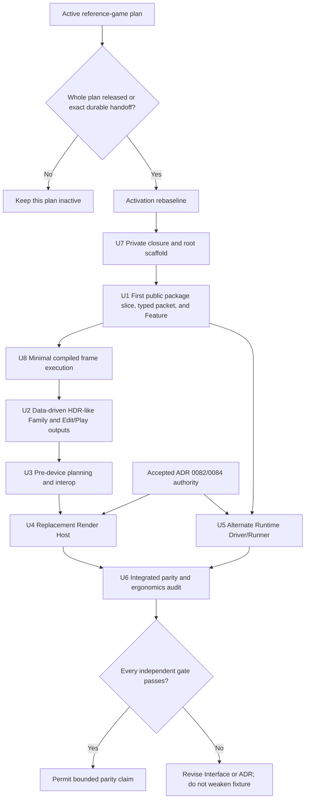
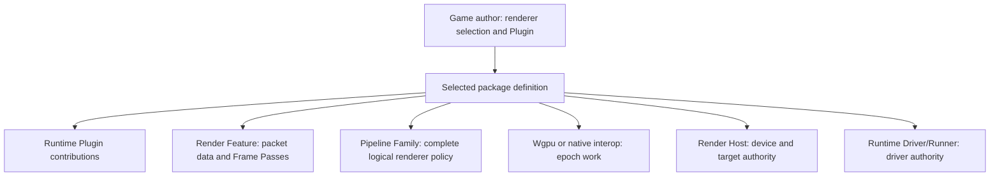

# Render Extension Parity Tracers - Plan

## Goal Capsule

- **Objective:** Prove that external Rust packages can reach Nara's accepted render and runner capability levels through the same public roles as first-party code, without adding speculative public machinery before a failing tracer requires it.
- **Authority:** Accepted ADRs 0046, 0048, 0068, 0077, 0078, and 0079 govern plugin composition, diagnostics, resource budgets, renderer policy, Render Host ownership, and compiled product-capability ceilings. The render extension capability design defines the parity scenarios. The active reference-game plan remains the sole current execution contract.
- **Activation gate:** No unit starts while `docs/plans/2026-07-12-001-refactor-reference-game-driven-foundation-plan.md` remains the active registration. The default gate is completion of that whole plan. An earlier unit may start only after a durable engineering-memory handoff records the baseline commit, completed RGF units, new owner, exact transferred files, files still owned by the RGF executor, and handoff time. After either release path, a read-only activation rebaseline must record the actual public symbols, module owners, accepted ADR state, already-landed capabilities, file ownership, and verification commands before implementation begins.
- **Execution profile:** Implement one clean-room tracer at a time. Each tracer first proves a concrete external outcome, then keeps the smallest public Interface that supports it. First-party code must consume that same Interface before a parity claim passes. Final renamed-dependency acceptance starts only after a durable Interface-freeze checkpoint records its revision and a narrow post-freeze change allowlist containing only the predeclared acceptance-fixture subtree, its lockfile, and a non-normative evidence record.
- **Stop conditions:** Stop and revise the relevant ADR when a tracer requires undeclared authority, two live owners for one device or driver scope, post-device requirement discovery, GPU handles in tooling, or a first-party-only hook. Do not work around a failed tracer with fixture-specific IDs or stock-crate edits.
- **Tail ownership:** The future executor owns focused implementation commits, fixture evidence, documentation synchronization, and removal of abandoned experiments. This planning commit owns no implementation work.

---

## Product Contract

### Summary

Nara will validate renderer extensibility as a sequence of independently falsifiable external-package tracers. The sequence starts with portable typed frame data and declared render work, then adds persistent data-driven complete renderer policy, exact wgpu/native integration, complete Render Host replacement, and alternate process driving. Passing a lower layer never substitutes for a higher-layer proof.

Ordinary game authors continue to see one renderer selection and the normal `Plugin` path. Only authors who request deeper authority learn the corresponding Feature, Pipeline Family, Interop, Render Host, or Runtime Driver/Runner contract.

### Problem Frame

The accepted architecture now grants third-party packages the same reachable render roles as first-party packages, but most of those roles are not implemented. A stock renderer feature alone cannot prove Unity SRP/HDRP-like replacement, raw GPU integration, complete target/submission ownership, or a mature Editor viewport path. Implementing all speculative traits first would also risk recreating a Bevy-sized public render surface without evidence that Nara needs it.

The active reference-game plan already owns the first-playable runtime, one-window render transaction, and product Host work. Mixing renderer parity implementation into that plan would create file conflicts and turn a focused product proof into another architecture waterfall. This plan therefore remains a separate follow-up contract.

### Requirements

**Execution coordination**

- R1. This plan does not supersede, edit, or silently extend the active reference-game plan.
- R2. A read-only activation preflight runs outside the implementation units after registration release or exact handoff. It writes and reviews the activation rebaseline before any production, fixture, or test mutation; after that, each unit rechecks the applicable ownership record and remains inactive without it.
- R3. The first-playable one-window, one-target, one-view path remains valid while each generalized capability is introduced behind separate public contracts and tests.

**Public extension outcomes**

- R4. An external package can contribute a bounded, owned, typed `RenderFramePacket` section without a central enum edit, public `Any`, string downcast, or per-frame package lookup.
- R5. An external Render Feature can contribute extraction, queue/material policy, one or more declared Frame Passes, post-processing, overlay work, and scoped encoding without acquiring ambient Device/Queue authority.
- R6. An external Pipeline Family can own complete material, lighting, visibility, view, feature-compatibility, and logical frame-topology policy and can be selected per recipe or view through the same catalog and compiler path as the stock family.
- R7. Selected Host, every active Family and Feature, every active target, and interop requirements close against Adapter support before `request_device`, with supported, requested, enabled, optional, fallback, and rejection facts kept distinct.
- R8. Exact wgpu/native interop supports Host-submit and predecessor-flushing direct-submit modes, declared resource hazards, retained epoch resources, stale-work rejection, device-loss rebuild, and finite close without claiming sandbox containment of trusted native code.
- R9. An external Render Host can become the sole owner of Device/Queue creation, target transactions, frame-wide submission, presentation or publication, recovery, diagnostics, and teardown for one device domain.
- R10. An external Runtime Driver/Runner can drive a managed `RuntimeInstance` through public event, time, wake, redraw, control, and finite close contracts, reaches only `Stopped` or retained-owner `CloseIncomplete`, and cannot coexist with an installed raw App runner. This tracer receives an opaque selected platform/target service and does not acquire display, window-creation, or target-retirement authority.
- R11. First-party and external candidates use the same public role, catalog or exclusive slot, validation path, and conformance suite; crate paths, first-party IDs, and package-specific root matches are not admission policy.
- R12. One multi-role package containing Runtime Plugin, Feature, Family, interop, Host, and runner contributions can still resolve a headless/server closure with the latter five roles neither compiled nor installed when the selected product does not require them. Editor readiness is a Family semantic-output capability consumed by an optional tooling dependency, not a seventh root contribution role.

**User experience and claim discipline**

- R13. A normal game selects a complete renderer with one package or product-preset action and one renderer or recipe choice; it never assembles internal catalogs, device plans, epochs, or Host bindings.
- R14. A package author sees one opaque `PackageDefinition` plus domain helpers; internal keys, receipts, fingerprints, candidate publication, and erased factories remain private or advanced implementation details.
- R15. User-facing failures preserve the distinct mutation, publication, retry, and terminal semantics of pure composition rejection, Host startup failure, skipped target outcome, live runtime fault, and `CloseIncomplete` while projecting concise domain language and retaining phase evidence.
- R16. Nara makes no render-extension parity claim for a platform profile until every applicable independent gate in this plan passes. If typed declarations cannot express a required external renderer workflow, the project must evaluate a minimal public render execution kernel instead of weakening the tracer.
- R17. Minimal package authoring records three distinct snapshots in order: Cargo feature compiled ceiling, pure product/contribution selection, and runtime installation. A separate Host authorization intersection gates trusted-native interop, Host, and managed runner activation. Project data may request those roles but cannot grant them, make an unavailable role selectable, or silently install an unselected role.
- R18. Direct `App` embedding may use raw `App::set_runner` and `App::run` and remains mutually exclusive with managed runtime admission. Complete renderer, Host, and managed Runtime Driver/Runner selection uses an explicit pre-device root/product builder; no `Plugin::build` side effect may publish those roles.
- R19. This plan proves renderer-side Edit/Play concurrency using one isolated Play runtime view and one concurrent offscreen Edit/Editor consumer in the same Host/device domain. They use independent target transactions and attempt/publication owners while sharing only generation- and epoch-stamped immutable leases. Docking, visible multi-window topology, display ownership, focus, IME, cursor, clipboard, and viewport workspace interaction remain outside the parity claim.
- R20. Public planning and Host carriers do not require `Send + Sync`, blocking device initialization, or native-thread placement. Exact interop may be native-only, and every parity claim names its admitted platform profile.
- R21. File-backed products lower a versioned persistent Pipeline Recipe, the `nara.toml` default selection, and stable per-view overrides through `nara_project` and domain-owned component codecs. Parsing, migration, validation, and failed-reload behavior follow ADR 0049 and ADR 0051 before compiler or runtime publication.
- R22. Packet construction, recipe expansion, logical compilation, semantic output, intermediate allocation estimates, and capture/readback enforce checked count, byte, depth, extent, concurrency, and retained-result budgets before backend allocation or publication; rejection preserves the last complete generation and releases reservations exactly once.
- R23. Render, Host, interop, and runner failures bridge through ADR 0048 and ADR 0068 using bounded static identities and classified fields. Generic `Error`, `Display`, `Debug`, vendor, OS, shader, environment, credential, URL, or absolute-path text cannot enter summaries, dedupe keys, serialization, or tracing.
- R24. Activating a trusted-native role from project intent requires an explicit Host-side grant bound to the resolved package source, lock/features, contribution role, and implementation or binding identity chosen by the admitted trust contract. Identity drift invalidates the grant before any contribution factory or native callback runs; consent and auditability are not a native-code sandbox.

### Acceptance Examples

- AE1. After the generic Feature/frame Interface exists, a renamed-dependency package adds a post-process and Editor overlay without any further stock-crate edit or raw Device/Queue getter.
- AE2. Two logical or offscreen views share one Host/device domain while one selects the stock Family and the other selects a renamed-dependency HDR-like Family with a different topology, material and lighting policy, final-color contract, overlay point, and picking strategy.
- AE3. A renamed-dependency interop package requests a non-baseline device capability before device creation, retains one epoch-scoped resource, submits ordered compute work, survives injected device loss, and retires in finite time.
- AE4. A renamed-dependency Host replaces the stock Host as the only device, target, submission, present, recovery, and close authority and passes the stock conformance suite.
- AE5. A renamed-dependency runner drives a managed runtime, forwards normalized time and events, wakes and closes correctly, and is rejected when mixed with the raw App runner path.
- AE6. A game author enables one multi-role external package and selects its HDR-like renderer through one product-level choice while server compilation and runtime composition exclude its render, wgpu, platform, interop, and optional Editor/tooling dependencies.
- AE7. A Runtime Plugin from the same package installs only already-selected runtime-local systems; attempts from `build` or `finish` to publish Feature, Family, interop, Host, runner, or nested plugin contributions reject as contract violations.
- AE8. A managed external runner stops new frame/event admission, pumps permitted close progress, rejects late generation work, returns `Stopped` only after every participant closes, and otherwise retains ownership in `CloseIncomplete`.
- AE9. A file-backed project selects the external Family through a versioned persistent recipe and `nara.toml` default, while a scene-persistent view selects another recipe by stable reference; malformed, oversized, or migration-incompatible data never reaches compiler or runtime publication.
- AE10. An untrusted project requests a compiled interop, Host, or managed runner role and is rejected before its factory executes; the same resolved identity activates only after an explicit code-first or Host-owned grant, and a lock, feature, binding, or implementation identity change invalidates that grant.
- AE11. An isolated Play runtime view and an offscreen Edit/Editor view render concurrently through independent target transactions; cancellation or failed publication on either axis leaves the other axis and its last-good generation coherent.

### Success Criteria

| Metric | Target | Evidence |
|---|---:|---|
| External path parity | Every supported first-party role has an external candidate using the same public admission and conformance path | Renamed-dependency fixtures and source audit |
| Package closure | One multi-role package produces distinct desktop and server compiled, selected, and installed closures | Independent consumer manifests, Cargo metadata, and runtime audit |
| Packet openness | One new packet domain requires zero central enum edits and zero public runtime downcasts | Portable Feature fixture |
| Packet bounds | All packet sections share one retained count/byte ceiling in addition to local limits | Aggregate exact-limit and limit-plus-one packet tests |
| Complete renderer policy | External Family controls topology, material, lighting, compatibility, and Editor outputs | HDR-like Family fixture |
| Device timing | All selected requirements close before device creation; a live Device is never silently widened | Capability fault matrix |
| Queue order | Host-submit joins global order; direct-submit proves predecessor, interop, successor GPU order | Instrumented submission tests |
| Epoch safety | Registered resources and returned work from an old epoch never reach a replacement device | Injected loss and replacement tests |
| Exclusive ownership | Exactly one Host owns each device domain and one runner owns each driver scope | Permutation and conflict tests |
| Ordinary author cost | One renderer choice plus the normal gameplay Plugin path | Clean-room author task |
| Headless isolation | Server closure contains no unselected render, winit, wgpu, interop, or Editor dependency | Cargo tree and runtime audit |
| Data-driven selection | Project default and per-view recipe references round-trip, migrate, validate, and select stock or external Families without code-only setup | Manifest, recipe, scene, and reload fixtures |
| Editor readiness | Concurrent Play and offscreen Edit/Editor consumers prove independent publication, final color, overlay, picking, bounded capture, cancellation, and stale-result rejection without GPU handles | Family/output and Edit/Play fixture |
| Expansion bounds | Exact-limit candidates pass and limit-plus-one candidates reject before backend allocation across graph and capture dimensions | Budget and reservation fault matrix |
| Trusted-role admission | Project intent cannot activate interop, Host, or managed runner code without an identity-bound Host grant | Pre-factory authorization fixture |
| Acceptance independence | Every post-freeze change belongs to the predeclared acceptance-fixture/evidence allowlist; production, manifests, exports, harnesses, conformance support, normative docs, and claim criteria remain untouched | Git ancestry plus history and endpoint allowlist evidence |
| Claim honesty | No parity statement appears before all required gates pass | Documentation and implementation-ledger review |

### Entry-Point Contract

| Caller | Public entry | Reachable authority | Forbidden shortcut |
|---|---|---|---|
| Runtime Plugin author | `App`, `add_plugins`, Plugin groups, and domain configuration | Runtime-local ECS data, resources, systems, sets, queues, schedules, and already-selected domain registration | Publishing package roles, selecting Host or managed runner, or acquiring Device/Queue from plugin hooks |
| Direct App or embedding author | `App`, raw `App::set_runner`, and `App::run` | Code-first runtime-local composition and one raw runner | Publishing managed renderer/Host/runner roles or admitting the same App as a managed runtime |
| Code-first product author | Explicit pre-device root/product builder | Renderer recipe/Family, Host, managed runner, compiled product choices, and explicit trusted-role grants before runtime admission | Converting a running raw-runner App into a managed runtime or discovering device needs after activation |
| Integrated project/Editor author | Project settings, persistent recipes, and product renderer selector | Inspectable root/product requests lowered through `nara_project`; only Host-authorized trusted roles may activate | Treating project data as a native capability grant or manually assembling catalogs, device plans, epochs, or binding receipts |
| Reusable package author | Opaque `PackageDefinition` plus typed domain helpers | Declared Runtime, Feature, Family, interop, Host, and runner contributions subject to product/profile selection | Executing contribution factories during discovery or compiling server-excluded role dependencies |

### Failure Projection

| Failure class | Owner and mutation state | Primary return channel | Retry or terminal rule |
|---|---|---|---|
| Pure composition rejection | Resolver; no App, device, target, or runtime mutation | Structured composition or plan diagnostic | Correct inputs and resolve again |
| Trusted-role authorization rejection | Product Host; no contribution factory or native callback has executed | Structured authorization diagnostic without sensitive identity text | Grant the exact resolved identity or choose a lower-authority role; drift always reauthorizes |
| Recipe, graph, or capture budget rejection | Parser/compiler/capture owner; no partial candidate or backend allocation is published | Bounded validation diagnostic plus reservation accounting | Reduce input or raise an explicit Host policy limit, then rebuild a complete candidate |
| Host preparation/start failure | Unpublished attempt owner; resources may require retirement but no active publication exists | Typed start failure plus retirement evidence | Retry only after the failed attempt reaches a terminal retirement result |
| Skipped target/frame outcome | Selected Host; active runtime remains valid | Render status and bounded runtime diagnostic | Follow declared redraw, reconfigure, or skip policy |
| Live runtime or device fault | Published runtime/Host owner | Sticky runtime or backend fault state | Recover from admitted plan or construct a fresh candidate; never fake rollback |
| Close timeout or failure | Closing owner remains retained with parent authority | `CloseIncomplete` plus participant evidence | Continue bounded close progress; block conflicting replacement |

### Scope Boundaries

**In scope**

- Typed frame-packet extensibility and portable Render Feature contributions.
- Persistent data-driven recipes, complete external Pipeline Family policy, and concurrent offscreen Edit/Play semantic-output readiness.
- Pre-device capability planning and exact wgpu/native interop under a selected Host.
- Complete external Render Host replacement and alternate Runtime Driver/Runner evidence.
- Author-facing progressive disclosure, diagnostics projection, and first-party/external conformance parity.

**Deferred to follow-up work**

- A dedicated platform/editor ADR for docking, multiple OS windows, visible Edit/Play viewport topology, display ownership, focus, IME, cursor, clipboard, floating surfaces, layout persistence, and shared Render Host routing. That ADR is a hard gate before the corresponding platform implementation begins.
- A public second render World, retained render worker, or minimal public render execution kernel unless a tracer demonstrates that typed packet, Feature, Family, and interop contracts are insufficient.
- Multi-adapter or multi-device products, native external-image semaphore protocols, and concurrent device-domain transfer.
- Full browser WebGPU Host initialization and recovery. This plan must preserve the accepted affinity model and keep public carriers browser-compatible, but native interop evidence does not prove browser execution parity.

**Outside this plan**

- A second RHI or generic RHI abstraction; wgpu remains Nara's only RHI.
- A stable native dynamic plugin ABI, marketplace, package signing system, or binary compatibility promise.
- A complete production HDRP renderer, XR product, or proprietary platform backend.
- Structural Rust hot reload, universal edit-while-playing merge, or whole-scene runtime write-back.

### Dependencies

- `docs/plans/2026-07-12-001-refactor-reference-game-driven-foundation-plan.md` must complete and release its active registration. Any earlier exception requires the exact durable handoff described by the Goal Capsule.
- The release or handoff must be followed by a durable activation rebaseline; pre-release file lists and symbol assumptions are non-authoritative until that record is reviewed.
- ADR 0046, ADR 0048, ADR 0049, ADR 0051, ADR 0068, ADR 0077, ADR 0078, and ADR 0079 remain accepted authority for runtime plugin roles, diagnostics, persistent input, budgets, renderer/Host semantics, and compiled product ceilings.
- U4 and U5 may begin only after ADR 0082 and ADR 0084 are each Accepted, or after every rejected decision's required authority is owned by an Accepted successor and the relevant evidence has been rerun against that successor.
- U7 must resolve the minimum Host authorization contract needed by R17 and R24. If no accepted decision already owns it, U7 first admits a focused trust ADR under OQ-031; broader package marketplaces, signing, isolation, and mod policy remain deferred.
- `docs/architecture/extension-contract-kernel-interface-design.md` and `docs/architecture/source-extension-package-interface-design.md` supply the package-authoring design inputs; their proposed Rust shapes are not implementation evidence.
- The first-playable `RenderFramePacket` and serialized target transaction are the baseline to generalize; this plan does not rebuild their product proof.

---

## Planning Contract

### Key Technical Decisions

- KTD1. Keep this as a separate follow-up plan. (session-settled: user-directed — chosen over editing the active reference-game plan: another executor owns that plan and overlapping edits would create coordination and merge risk.)
- KTD2. Let clean-room tracers determine exact Rust Interfaces. (session-settled: user-approved — chosen over freezing every trait and factory first: capability evidence should select the smallest sufficient public surface.)
- KTD3. Measure parity by reachable outcome, not by copying Bevy's ambient `&mut App`, `RenderApp`, `RenderDevice`, or `RenderQueue` access.
- KTD4. Require separate gates for activation rebaseline, package/root authoring, portable Feature, minimal frame execution, data-driven complete Family, pre-device interop, replacement Host, alternate runtime driver, and Editor semantic readiness. Passing one gate never substitutes for another.
- KTD5. Use existing ADR 0077 and ADR 0078 rather than adding another renderer-replacement ADR. A new ADR is required only if a tracer contradicts their accepted ownership or lifecycle contract.
- KTD6. Prove renderer-side concurrent Edit/Play consumers with offscreen targets now, but defer docking, visible viewport routing, display ownership, and multi-window topology until their concrete editor/platform tracer is available. The dedicated ADR is mandatory before those platform-facing APIs are implemented.
- KTD7. Preserve wgpu as the only RHI while allowing exact-version wgpu/native interop and complete selected-Host replacement within that product boundary.
- KTD8. Add a minimal public render execution kernel only when a clean-room external renderer cannot express required execution through the accepted declarative roles. Do not introduce a public second render World by default.
- KTD9. Use U7 only for activation rebaseline, private closure fixtures, and pure root-selection scaffolding. The first public package/root authoring slice lands with U1's real Runtime Plugin plus portable Feature, not a synthetic placeholder role.
- KTD10. Separate design evidence from acceptance evidence. Before freezing, the harness pre-registers the final renamed-dependency fixture path and claim oracle. The Interface-freeze record then names the revision and the only permitted post-freeze changes: that fixture subtree, its lockfile, and one non-normative evidence record. Acceptance proves the freeze is an ancestor and every path touched in any intervening commit and endpoint diff is allowlisted. Production source, Cargo manifests/features, facade exports, harness and conformance code, normative ADR/design text, and claim criteria are frozen implicitly; any touch restarts the two-stage gate.
- KTD11. The Editor gate combines an offscreen semantic-output consumer with renderer-side concurrent isolated Play and Edit attempts. Full visible viewport workspace topology waits for the dedicated platform/editor ADR.
- KTD12. U3 introduces only a data-only selected-Host support descriptor and exclusive selection result needed for pre-device closure. U4 determines the complete Host factory or static carrier and execution ownership.
- KTD13. Keep public planning and Host carriers placement-neutral and nonblocking. Native interop may be target-gated, but it cannot force the portable Interface to require `Send + Sync` or native-only executor assumptions.
- KTD14. Editor compatibility is a Pipeline Family capability plus an optional tooling consumer, not a seventh package contribution role.
- KTD15. U2 lands the first persistent Pipeline Recipe contract, `nara.toml` default lowering, stable per-view override, migration, and parse-budget evidence. Code-first-only Family selection cannot pass the integrated product claim.
- KTD16. Compiled availability is not trust authorization. Project data requests trusted-native roles; a code-first product author or product Host grants the exact resolved identity before any factory executes. The full source-package trust topology remains owned by OQ-031.
- KTD17. U5 proves a driver-only Runner against the stock or headless selected Host. Window/display creation and target retirement remain behind an opaque platform service until the dedicated platform/editor ADR decides their public boundary.

### High-Level Technical Design

The second diagram shows independent contribution roles behind one package selection. A Family does not need interop, a Host does not imply a custom runner, and ordinary authors do not see internal role registration. Editor tooling consumes Family semantic outputs rather than registering another root role. A future Platform Adapter may own display/window concerns only after the dedicated platform/editor ADR.

### Sequencing and Ownership Rules

1. The active reference-game plan retains ownership until the activation gate passes. An early exception first writes the exact durable handoff record under `docs/knowledge/engineering/`.
2. Outside the implementation units, the read-only activation preflight records the RGF release commit, accepted authority decisions, actual public symbols, precise current owners, already-landed capability evidence, and still-valid verification commands. The rebaseline is reviewed and any stale unit file list is corrected before U7 or any mutation begins.
3. U7 establishes only private closure evidence and root-selection scaffolding; U1 extracts the first public package route from a Runtime Plugin plus a real Feature.
4. Each capability starts with design evidence that may drive a general public Interface and first-party migration.
5. Before the freeze, the executor commits the general Interface, first-party migration, conformance harness, final fixture registration, normative contract text, and claim oracle. The freeze record names the revision and a narrow allowlist containing only the empty/predeclared acceptance-fixture subtree, its lockfile, and a non-normative evidence record. Acceptance verifies ancestry and proves every path touched by every intervening commit, including later-reverted changes, and every endpoint delta is allowlisted. Any other touch restarts the two-stage gate.
6. Negative, permutation, source-diff, headless-closure, placement, budget, privacy, authorization, and lifecycle tests close the unit.
7. Each unit immediately updates the owning ADR or Interface design and implementation ledger with proven versus remaining evidence; U6 only consolidates the final claim.

The render path executes U7, U1, U8, U2, U3, and U4. After U1 and the accepted runtime-ownership gate, U5 may proceed independently against the stock or headless Host; U4 and U5 join only in U6. U-IDs retain their original identities despite the non-numeric order. The frame execution slice precedes Family and interop work, and data-only Host support/selection precedes complete Host execution. U6 is the only unit allowed to make a bounded render-extension and runtime-driver parity claim; full Platform Adapter and mature visible Editor topology parity remain separately gated.

### Deferred Implementation Choices

- Exact trait, factory, catalog, session, and root-selection carrier names.
- Typed packet storage as a heterogeneous arena, generated data-only layout, serialization/copy boundary, or trusted-native contract. U1 must choose a guarantee model and word handle exclusion no more strongly than that mechanism supports.
- Generic, enum, or static-factory representation for the selected Host.
- Direct exact wgpu dependency versus an advanced exact-version gateway or re-export.
- Display/window ownership split from runtime driving in the future Platform Adapter and Runner boundary.

These choices are non-blocking because each unit contains a concrete tracer that decides the smallest sufficient representation.

### Alternative Approaches Considered

**Option A: Add the work to the active reference-game plan**

This would keep one plan, but it would overlap the other executor's render and Host files and would turn the first-playable proof into a renderer architecture program. Rejected.

**Option B: Implement one monolithic renderer rewrite**

This could expose every anticipated role at once, but a successful stock renderer would not prove external parity and failures would not identify which Interface is missing. Rejected.

**Option C: Publish a Bevy-style public `RenderApp` first**

This offers immediate ambient flexibility, but it commits Nara to a second public execution surface before typed packet, Family, and interop tracers demonstrate a need. Deferred as the explicit fallback in R16 and KTD8.

**Option D: Execute independent capability tracers in authority order**

This isolates evidence, keeps ordinary authoring small, and makes every additional authority level earn its public Interface. Chosen.

### System-Wide Impact

- `nara_render` becomes the public owner of typed packet, Feature, Family, recipe, semantic output, and logical compilation contracts without acquiring wgpu types.
- `nara_project` lowers the project default recipe request, while `nara_render` owns the versioned persistent recipe and per-view stable reference; generic scene/reflect crates remain policy-neutral.
- `nara_render_wgpu` remains the stock Host and exact wgpu implementation, but external interop and replacement Hosts use public advanced contracts rather than private hooks.
- Root product composition gains explicit Family, Host, and runner selection while `PluginGroup` remains limited to runtime plugins.
- `nara_tooling` consumes semantic render descriptors and bounded capture results rather than GPU handles.
- Headless/server composition must prove that unselected advanced render roles do not leak dependencies or resources.

### Risks and Mitigations

| Risk | Severity | Likelihood | Mitigation |
|---|---:|---:|---|
| Concurrent implementation collides with the active plan | Critical | High | Activation gate, explicit file-owner handoff, and no edits to the active plan from this contract |
| Post-RGF file and symbol assumptions are stale | Critical | High | Mandatory activation rebaseline before any implementation unit |
| Renderer fixtures invent private registration because package authoring is absent | Critical | High | U7 supplies private closure/root scaffolding and U1 extracts the first public route from real consumers |
| Feature evidence is mislabeled as complete renderer parity | Critical | High | Independent mandatory gates and U6-only claim authority |
| First-party code retains a private path | Critical | Medium | Renamed-dependency fixtures, shared conformance suites, and stock-path migration in every unit |
| Final fixture and Interface change together, making parity evidence circular | Critical | High | Pre-register the fixture/oracle, then allow only fixture, lockfile, and evidence paths between freeze and acceptance revisions |
| Public Interface freezes before real use | High | Medium | U7 remains private; U1 introduces the first public slice from real Runtime and Feature consumers; exact Rust representations remain tracer-selected |
| Transitional `RenderPassPlan` grows into a second partial graph | Critical | Medium | U8 owns one template/frame-plan vertical slice and explicitly retires or narrows the transitional plan |
| A static toy Family hides the need for a real execution kernel | Critical | High | U2 stress tracer combines temporal history, frame-dependent topology, and a declared cross-view or GPU-driven dependency; failure triggers KTD8 |
| Graph or capture expansion exhausts memory before rejection | Critical | Medium | Checked multidimensional budgets, pre-allocation estimates, exact reservation accounting, and limit-plus-one tests |
| Raw interop breaks GPU order or epoch safety | Critical | Medium | Host-submit and predecessor-flushing direct-submit tests, hazard declarations, epoch stamps, and loss injection |
| Host replacement creates two target or queue owners | Critical | Medium | Exclusive selection, stop-before-start, target transaction tests, and finite close evidence |
| Editor assumes one renderer's G-buffer | High | High | Require only final color, overlay, and one picking strategy; make other outputs optional capabilities |
| Code-first tests are mistaken for data-driven product support | Critical | High | U2 must land persistent recipe, manifest default, per-view reference, migration, and reload evidence |
| Ordinary users see internal composition vocabulary | High | Medium | One renderer selector, opaque package helper, progressive documentation routes, and author task study |
| Runner work races unresolved runtime ownership | High | Medium | Gate U5 on Accepted ADR 0082/0084 authority or Accepted successors |
| Runner tracer accidentally freezes window/display ownership | Critical | Medium | Driver-only U5 receives an opaque platform service; target creation/retirement waits for the platform/editor ADR |
| Untrusted project data activates compiled native authority | Critical | Medium | Identity-bound Host authorization before factory execution and an explicit no-sandbox statement |
| Rich backend errors leak paths, credentials, or unbounded text | High | Medium | ADR 0048/0068 bridge canaries, bounded classified fields, and no generic error string forwarding |
| Native tracer freezes browser-hostile placement assumptions | High | Medium | Placement-neutral carriers, target-gated exact interop, no mandatory `Send + Sync`, and bounded platform claims |

---

## Implementation Units

### U7. Establish Private Closure Scaffolding

- **Goal:** Consume the reviewed activation rebaseline and prove compiled, selected, authorized, and installed closure behavior without freezing a public package abstraction on a synthetic role.
- **Requirements:** R1-R3, R11-R12, R17-R18, R20, R23-R24; AE6, AE7, and AE10.
- **Dependencies:** Reviewed activation rebaseline. The minimum authorization decision required by R24 must already be accepted or be admitted as U7's first documentation step.
- **Files:** Create `tests/render_extension_contracts.rs`, private fixture support under `tests/support/`, and `tests/fixtures/render-extension/multi-role-package/` with independent desktop and server consumers and their own lockfiles; modify only the actual pure root-selection owner identified by the rebaseline when existing RGF contracts are insufficient; update the package/composition Interface designs and the admitted trust ADR or OQ-031 evidence according to the result. Do not create a public `PackageDefinition` or role-neutral extension trait in this unit.
- **Approach:** Start from independent desktop/server manifests and a private test-owned optional role. Record Cargo availability, pure selection, Host authorization, and runtime installation as distinct observations. Reuse the accepted RGF root/planning path, and keep any synthetic contribution vocabulary inside the fixture. U1 will extract the first public package slice from a real Runtime Plugin plus Render Feature.
- **Execution note:** This unit may change the future U1-U6 file maps when the activation rebaseline proves that RGF moved an owner or already landed a capability. Such corrections update this follow-up plan, never the completed RGF plan.
- **Patterns to follow:** The post-RGF root owner, plugin planning in `docs/architecture/runtime-composition-interface-design.md`, `tests/derive_dependency_fixtures.rs`, and the atomic authoring rules in the package and contract-kernel designs.
- **Test scenarios:**
  - The reviewed rebaseline names the RGF release commit, accepted ADR 0082/0084 authority or accepted successors, actual public symbols, exact file ownership, already-proven capabilities, and valid verification commands; U7 refuses to mutate when any item is stale or missing.
  - A private renamed-dependency fixture combines one real Runtime Plugin with a test-owned optional role without exposing the placeholder in production APIs.
  - The desktop consumer compiles and selects the optional role; the server consumer's Cargo metadata and feature tree exclude its optional dependency rather than merely disabling installation.
  - Selecting a role outside the compiled ceiling rejects during pure composition without constructing a factory, App, device, target, or runtime candidate.
  - Project intent requesting a trusted test role remains uninstalled until the Host grant matches the resolved source, lock/features, role, and implementation identity; drift rejects before the factory spy runs.
  - An available but unselected role is not installed, and an unavailable role cannot be made selectable by package metadata.
  - Runtime Plugin `build` and `finish` may install only already-selected runtime-local systems and reject attempts to publish new package roles or nested plugins.
- **Verification:** The rebaseline is reviewed, independent desktop and server fixtures prove compiled/selected/installed closure, authorization tests prove pre-factory rejection, no production API names the synthetic role, and no package factory executes during discovery or pure selection.

### U1. Prove Typed Packets and Portable Feature Declaration

- **Goal:** Extract the first public package/root authoring slice from a real Runtime Plugin plus portable Feature, then establish the smallest open typed packet that supports an external renderable domain without backend authority or a central packet registry.
- **Requirements:** R3-R5, R11-R18, R20, R22-R24; AE1, AE6-AE7, and AE10.
- **Dependencies:** U7.
- **Files:** Create the smallest root package module identified by U7's rebaseline, expected under `src/package.rs`, and modify its facade/root owner; modify `crates/nara_render/src/lib.rs` and focused modules under `crates/nara_render/src/`; modify first-party extraction consumers under `crates/nara_sprite_render/src/` and `crates/nara_ui_render/src/`; extend `tests/render_extension_contracts.rs` and `tests/fixtures/render-extension/multi-role-package/`; create separate design and renamed-acceptance fixtures under `tests/fixtures/render-extension/portable-feature/`; update ADR 0046, ADR 0077, ADR 0079, the package/composition Interface designs, `docs/architecture/render-extension-capability-interface-design.md`, and `docs/architecture/adr/implementation-status.md` according to proven evidence.
- **Approach:** Extract one opaque `PackageDefinition` and typed Render Feature helper from the two real consumers rather than from U7's placeholder. Contribute typed bounded frame data and one statically declared Feature containing Frame Pass intent. Keep the concrete packet carrier private and replaceable until U2 proves a Family consuming different sections. Migrate stock extraction consumers to the same typed construction path and keep contract resolution out of the frame hot path.
- **Execution note:** The design tracer must choose an honest packet guarantee model: structurally data-only generated values or a copy boundary may enforce handle exclusion; an open trusted-native Rust payload can only state a trusted-code contract. A transitive wrapper case must prevent the documentation from claiming stronger containment than the chosen mechanism supplies.
- **Patterns to follow:** `tests/derive_dependency_fixtures.rs`, `tests/fixtures/derive-dependencies/renamed-root/`, first-party extraction modules, and the provider/packet rules in ADR 0077.
- **Test scenarios:**
  - A Runtime Plugin plus the real Feature helper produce the first public all-or-error `PackageDefinition`; no production API exposes U7's synthetic role.
  - The external design fixture contributes a new typed packet section and static Feature declaration without editing a central enum or using public `Any` or string lookup.
  - Required and optional sections resolve through typed construction; a missing required section follows its declared reject or skip policy.
  - Count and byte budgets reject oversized sections before publication and preserve the prior complete frame generation.
  - Every section obeys local limits and also reserves from one packet-wide retained count/byte budget. Exact-limit aggregate input passes; limit-plus-one aggregate input made from individually valid sections rejects with no partial packet, preserves last-good, and releases every reservation exactly once.
  - World borrows cannot cross packet ownership. Device/Queue, encoder, surface, target-lease, native-handle, and backend-cache exclusion is tested against direct and transitive wrapper cases according to the selected structural or trusted-code guarantee model.
  - The package's Runtime Plugin installs only the already-selected extraction and queue systems; attempts to publish Feature, Family, interop, Host, or runner roles from plugin hooks reject.
  - Stock sprite and UI extraction use the same typed packet construction path as the external domain.
  - Before freezing, the harness pre-registers the final fixture and oracle. Between freeze and acceptance, only that fixture subtree, its lockfile, and evidence record change; package/render/source, Cargo manifests, facade exports, harness/support, conformance code, normative docs, and claim criteria remain untouched.
- **Verification:** The first public package slice has two real consumers, packet-wide and local budgets pass, the packet guarantee is stated no more strongly than it is enforced, negative compile/runtime cases pass, stock domains use the same packet Interface, and history/endpoint allowlist evidence proves the final renamed fixture did not require a fixture ID or first-party-only branch.

### U8. Compile and Execute the Minimal Frame Plan

- **Goal:** Implement the smallest real logical-resource and frame-execution vertical slice needed to execute external Feature passes without growing transitional `RenderPassPlan` into a partial graph.
- **Requirements:** R3, R5, R11, R15-R16, R20, R22-R23; AE1.
- **Dependencies:** U1.
- **Files:** Modify pipeline compilation, logical resource, and frame-plan modules under `crates/nara_render/src/`; modify stock execution and focused tests under `crates/nara_render_wgpu/src/`; modify `crates/nara_render/src/pass_plan.rs` only to retire or narrow its transitional responsibility; extend `tests/render_extension_contracts.rs` and `tests/fixtures/render-extension/portable-feature/`; update ADR 0077, `docs/architecture/render-extension-capability-interface-design.md`, and `docs/architecture/adr/implementation-status.md` according to proven evidence.
- **Approach:** Compile a reusable logical template and instantiate an immutable frame-local execution plan with declared resources, predecessor/successor order, final consumers, and target transactions. Prove one direct surface path and one intermediate or offscreen path. Before realization, use checked arithmetic and Host policy to bound features, passes, logical resources, edges, variants, views, dependency depth, dynamic extents, diagnostics, and estimated intermediate bytes. The stock Host lowers the generic plan, while scoped encoding receives only declared opaque bindings and non-retainable authority.
- **Execution note:** Establish surface plus intermediate/offscreen resource flow before adding generalized graph features or optimization policy.
- **Patterns to follow:** ADR 0077's recipe-to-template-to-frame-plan stages, current `crates/nara_render/src/pass_plan.rs`, and stock encoder/submission ownership under `crates/nara_render_wgpu/src/`.
- **Test scenarios:**
  - An external Feature executes post-process and overlay passes through the stock Host without a private provider branch or raw Device/Queue getter.
  - Surface and intermediate/offscreen resources have declared producers, consumers, final consumers, and bounded lifetimes.
  - Scoped encoding authority and opaque bindings cannot escape the callback or expose undeclared physical resources.
  - Pass ordering, clear/load, viewport, scissor, final-consumer, and present/publish semantics remain deterministic across the two resource flows.
  - Candidate compilation failure preserves the prior complete template generation; frame instantiation does not perform package-ID or string-registry resolution.
  - Every expansion dimension has exact-limit and limit-plus-one cases; rejection occurs before backend allocation, publishes no partial plan, preserves last-good, and releases every reservation exactly once.
  - Transitional `RenderPassPlan` remains a static phase-order compatibility input or is removed after all consumers migrate; it never becomes a second partial graph.
- **Verification:** Stock sprite/UI paths still render, logical plus backend tests prove both resource flows and expansion budgets, and the portable Feature acceptance fixture changes only its predeclared fixture/lock/evidence allowlist between recorded freeze and acceptance revisions.

### U2. Prove a Data-Driven External Pipeline Family and Editor Concurrency

- **Goal:** Let an external HDR-like Family own a complete logical renderer policy selected through persistent project data and concurrently serve isolated Play and offscreen Edit/Editor consumers without receiving target or submission authority.
- **Requirements:** R3-R4, R6, R11-R23; AE2, AE6, AE9, and AE11.
- **Dependencies:** U1 and U8.
- **Files:** Modify focused Family, persistent recipe, stable view-reference, compilation, and semantic-output modules under `crates/nara_render/src/`; modify manifest/default lowering under `crates/nara_project/src/`; modify stock realization integration under `crates/nara_render_wgpu/src/`; modify UI-neutral output and independent Edit/Play attempt models under `crates/nara_tooling/src/`; extend scene/component-codec round-trip tests without moving render policy into `nara_scene` or `nara_reflect`; extend `tests/render_extension_contracts.rs` and `tests/fixtures/render-extension/multi-role-package/`; create separate design and renamed-acceptance fixtures under `tests/fixtures/render-extension/hdr-family/`; update ADR 0051 golden-format evidence, ADR 0077, `docs/architecture/render-extension-capability-interface-design.md`, and `docs/architecture/adr/implementation-status.md` according to proven evidence.
- **Approach:** Build an external Family with materially different material, lighting, visibility, and frame topology assumptions. Its adversarial workload combines persistent temporal history, frame-dependent pass activation, and one declared auxiliary-view, cross-view, or GPU-driven visibility dependency. Land the first ADR 0049/0051-compliant persistent Pipeline Recipe, lower the `nara.toml` default through `nara_project`, and persist per-view overrides as stable semantic references through the render-owned component codec. Stock and external views share one Host/device domain while selecting Families independently. An isolated Play attempt and a separate Edit/Editor attempt own their own publication axes and target transactions; they may share only immutable generation/epoch-stamped template or realization leases. Expose final color, overlay composition, one picking strategy, and optional semantic outputs through backend-neutral descriptors.
- **Execution note:** Treat the Family fixture as policy, persistent-product-path, and renderer-side concurrency evidence, not as a production HDR renderer or proof of docking, visible multi-window interaction, or display ownership. If the adversarial workload cannot be expressed through the accepted declarative roles, stop and execute KTD8 rather than simplifying the fixture.
- **Patterns to follow:** U8's compiled frame plan, ADR 0049, ADR 0051, ADR 0077, and scenarios RE-20 through RE-23 and RE-50 through RE-53 in `docs/architecture/render-extension-capability-interface-design.md`.
- **Test scenarios:**
  - `nara.toml` selects a versioned default recipe, while a scene-persistent render-owned view component refers to another recipe by stable ID; both round-trip through project/scene loading without runtime `Entity`, `TypeId`, or GPU values.
  - Recipe document migrations run before value validation; malformed, oversized, unsupported, or failed reload candidates preserve the prior complete recipe/template generation and never rewrite source files silently.
  - Play and offscreen Edit/Editor views share one Host/device domain and independently select stock and external Families through the same catalog without turning Family selection into a process-global singleton.
  - The Family changes complete topology, material, lighting, and visibility policy and exercises temporal history, frame-dependent topology, and a declared auxiliary-view, cross-view, or GPU-driven dependency rather than only adding a stock post-process.
  - Pure Family/Feature incompatibility is rejected before target acquisition, device planning, or runtime publication; Adapter-supported/requested/enabled closure remains U3's responsibility.
  - Independent Play and Edit attempt owners prepare, cancel, publish, and retire without sharing one move-only candidate; failure on either axis preserves the other axis and each axis's last-good generation.
  - The offscreen Edit/Editor consumer receives final SDR/HDR color meaning, observes overlay/gizmo order, and completes one stable-identity CPU, GPU-ID, or custom picking round trip without a GPU handle.
  - Optional depth, normals, motion, or debug outputs report support, fallback, or rejection without assuming one G-buffer layout.
  - Capture/readback bounds cover dimensions, bytes per request, concurrent requests, in-flight bytes, and retained results with exact-limit, limit-plus-one, cancellation, stale-generation rejection, and exact reservation release.
  - Family/recipe expansion reuses U8's checked graph budgets before allocation; dynamic extent and temporal-history estimates cannot overflow or bypass the Host ceiling.
  - After the design tracer, stock migration, persistent product path, harness registration, and claim oracle freeze, the final renamed Family fixture changes only its predeclared fixture/lock/evidence allowlist.
- **Verification:** The persistent manifest/recipe/view path works without code-only setup, the external Family passes the adversarial workload without a stock family branch or private compiler input, stock and external Families use the same catalog/compiler path, concurrent Edit/Play publication remains coherent, output/picking/capture budget tests pass, and history/endpoint allowlist evidence proves the final renamed fixture attached independently.

### U3. Prove Pre-Device Planning and Wgpu/Native Interop

- **Goal:** Close all selected device requirements before device creation and support exact Host-scheduled interop with truthful queue, epoch, trust, recovery, and close semantics.
- **Requirements:** R7-R8, R11-R12, R15-R20, R22-R24; AE2-AE3, AE6, and AE10.
- **Dependencies:** U2 and U8.
- **Files:** Modify semantic capability and data-only Host support/selection planning under `crates/nara_render/src/` and the package/root selection modules introduced by U1; modify exact planning, interop, epoch, and submission modules under `crates/nara_render_wgpu/src/`; extend `tests/render_extension_contracts.rs` and `tests/fixtures/render-extension/multi-role-package/`; create `tests/fixtures/render-extension/wgpu-interop/`; add focused backend tests under `crates/nara_render_wgpu/src/` or `crates/nara_render_wgpu/tests/`; update ADR 0077, ADR 0078, `docs/architecture/render-extension-capability-interface-design.md`, and `docs/architecture/adr/implementation-status.md` according to proven evidence.
- **Approach:** Introduce a data-only Host support descriptor and exclusive selection result without constructing the complete Host execution carrier. Aggregate that selected Host policy with every active view's Family, Feature, target, and interop requirements before `request_device`. Bind exact interop to the supported wgpu version and selected Host contract. Implement Host-submit and direct-submit modes separately, stamp registered and returned work with the non-reused epoch and admitted plan, and rebuild recovery state from declared non-GPU sources.
- **Execution note:** Use instrumented fake or software-adapter paths before depending on hardware-specific behavior; retain supported/requested/enabled facts as bounded typed fields rather than forwarding backend error strings. Exact native execution evidence remains separately platform-scoped.
- **Patterns to follow:** `crates/nara_render_wgpu/src/backend.rs`, `crates/nara_render_wgpu/src/surface.rs`, ADR 0048, ADR 0068, ADR 0078's device state and epoch rules, and existing window surface retirement fault tests.
- **Test scenarios:**
  - A non-baseline required feature or limit appears in the request plan before device creation and records Adapter-supported, requested, and enabled values separately.
  - Stock and external data-only Host support descriptors enter the same pure exclusive selection path; zero, multiple, or incompatible selections reject before Adapter/device work.
  - File-backed project intent cannot authorize exact interop. The Host grant must match U7's admitted source/lock/features/role/implementation identity before the interop factory or callback runs, and any drift rejects pre-device.
  - Requirements from stock and external Families across all active logical/offscreen views and targets participate in one closed request plan.
  - Unsupported required capability rejects without publication; optional capability selects its named fallback; a later unmet requirement rejects activation or constructs a fresh Host candidate rather than widening the live Device.
  - Host-submit interop returns plan/epoch-stamped work that enters frame-wide submission order.
  - Direct-submit interop runs only after all predecessors close and submit and before any successor encoding or submission; declared resource hazards are instrumented.
  - Device loss rejects stale registered resources and returned work and rebuilds compliant session resources under a new epoch.
  - Cloneable raw Device/Queue retention is documented as a trusted-code violation; tests enforce Host-owned registration and returned work but make no sandbox claim.
  - Stalled or failed interop close prevents clean-close evidence and conflicting Host publication.
  - Portable planning and Host support carriers compile without mandatory `Send + Sync`, blocking initialization, or native-thread placement; target-gated exact interop reports unavailability on unsupported profiles.
  - Credentials, URLs, environment values, absolute paths, vendor/shader messages, and oversized errors cannot enter runtime diagnostic summaries, identities, serialization, dedupe, or tracing; only admitted bounded classified fields survive.
  - The final renamed interop fixture attaches after the harness/oracle freeze and changes only its predeclared fixture/lock/evidence allowlist.
- **Verification:** Capability, authorization, diagnostic-privacy, and submission fault matrices pass; loss/recovery tests prove old-epoch rejection; the public carrier remains placement-neutral; history/endpoint allowlist evidence passes; and the native interop fixture uses no post-device requirement discovery or private Device/Queue getter. The recorded parity scope names the tested native profile and does not imply browser execution parity.

### U4. Prove Complete External Render Host Replacement

- **Goal:** Select an external Host as the sole execution authority for one device domain and run it through the same target, recovery, diagnostics, and finite-close suite as the stock Host.
- **Requirements:** R3, R9, R11-R20, R22-R24; AE4, AE6, and AE10.
- **Dependencies:** U3 plus Accepted ADR 0082 and ADR 0084 authority, or Accepted successors satisfying the dependency rule above.
- **Files:** Modify Host contribution and execution ownership under `crates/nara_render/src/`, `crates/nara_render_wgpu/src/`, `crates/nara_window/src/backend.rs`, and the root/product modules introduced by U1; create `tests/render_host_contracts.rs`; create `tests/fixtures/render-extension/replacement-host/`; extend `tests/render_extension_contracts.rs` and `tests/fixtures/render-extension/multi-role-package/`; update ADR 0077, ADR 0078, the accepted runtime/Host ownership ADR, `docs/architecture/render-extension-capability-interface-design.md`, and `docs/architecture/adr/implementation-status.md` according to proven evidence.
- **Approach:** Extend U3's data-only Host selection into the smallest static, enum, or factory execution carrier. First run stock and external implementations through a device-domain conformance harness, then bind the proven carrier into root composition. Preserve the authority sequence `definition -> pure selection -> authority-free preparation -> scoped reservation -> initialization -> publication -> finite close`. Target acquire/import, final consumer, present/publication, recovery, and close remain under the selected Host only.
- **Execution note:** Prove exclusive authority and failure cleanup before adding convenience helpers or multiple Host candidates to normal authoring surfaces.
- **Patterns to follow:** `crates/nara_window/src/backend.rs`, `tests/window_surface_retirement.rs`, ADR 0048, ADR 0068, ADR 0078, and the selected-Host contract in the render extension capability design.
- **Test scenarios:**
  - Stock and external Host candidates select deterministically regardless of registration order; zero or multiple selected candidates reject before device or target activation.
  - Project intent cannot authorize an external Host; its identity-bound grant is checked before the Host factory runs and identity drift invalidates the grant.
  - Definition, selection, and authority-free preparation cannot create a Device, Queue, target lease, surface, or published close obligation.
  - The external Host is the only Device/Queue, target transaction, submission, present/publication, recovery, and teardown owner.
  - One target is acquired/imported and presented/published at most once per target frame across multiple logical consumers.
  - Host replacement is stop-then-start unless an explicit tested transfer protocol proves non-conflicting ownership.
  - Interop contract version, backend mode, queue mode, and resource-binding compatibility resolve before device creation.
  - Initialization, target, device-loss, and close failures publish structured status without falsely reporting clean shutdown or rollback.
  - The conformance suite separates invariant authority/lifecycle obligations from capability-conditioned cases so external Hosts are not required to imitate stock implementation choices.
  - Diagnostic canaries prove that vendor, OS, shader, path, URL, credential, environment, and oversized error text cannot cross the bounded observability bridge.
  - No first-party ID, crate path, fixture ID, or stock-root match grants authority.
  - The public Host carrier admits Adapter-declared executor placement and asynchronous initialization without a mandatory `Send + Sync` or render-stage blocking assumption.
  - The final renamed Host fixture attaches after the harness/oracle freeze and changes only its predeclared fixture/lock/evidence allowlist.
- **Verification:** The renamed external Host passes the same invariant device-domain and root-binding conformance suite as the stock Host plus its declared capability cases; authorization, diagnostic, dependency, placement, freeze, and exclusive-owner fault checks pass for the named platform profile.

### U5. Prove an Alternate Runtime Driver and Runner

- **Goal:** Let an external driver own one driver scope and drive the managed runtime without bypassing its lifecycle, coupling the role to the stock winit root, or acquiring window/display authority.
- **Requirements:** R2-R3, R10-R20, R23-R24; AE5-AE6, AE8, and AE10.
- **Dependencies:** U1, the stock or headless managed-runtime baseline, and Accepted ADR 0082/0084 authority or Accepted successors. U4 is not a dependency; combined external Host plus external runner composition waits for U6.
- **Files:** Modify runner and managed-runtime contracts under `crates/nara_app/src/`; modify the stock driver adapter under `crates/nara_winit/src/` only where shared conformance requires it; modify the root/product modules introduced by U1; create `tests/platform_runner_contracts.rs`; create separate design and renamed-acceptance fixtures under `tests/fixtures/render-extension/alternate-runner/`; extend `tests/render_extension_contracts.rs` and `tests/fixtures/render-extension/multi-role-package/`; update the accepted runtime ownership ADR, `docs/architecture/render-extension-capability-interface-design.md`, and `docs/architecture/adr/implementation-status.md` according to proven evidence. Do not modify public window/target ownership merely to satisfy this tracer.
- **Approach:** Preserve the direct code-first `App::set_runner` and `App::run` path while making it mutually exclusive with managed runtime admission. Select one external Runtime Driver/Runner at root composition and drive only public `RuntimeInstance` control/time/event/close contracts. It receives an opaque selected platform/event/target service and cannot create, register, or retire platform targets. Exact display dependencies and target retirement stay behind the selected Platform Adapter.
- **Execution note:** This unit is driver-only. Any need to expose window creation, display enumeration, docking, multiple OS windows, or target retirement stops U5 and triggers the dedicated platform/editor ADR rather than enlarging the runner contract.
- **Patterns to follow:** `crates/nara_app/src/lib.rs`, the stock driver half of `crates/nara_winit/src/lib.rs`, ADR 0039 time semantics, ADR 0048/0068 diagnostics, and the Accepted ADR 0082/0084 authority.
- **Test scenarios:**
  - The external runner drives elapsed time, normalized events, wake/redraw/background policy, runtime controls, exit, and close through public contracts.
  - Admission rejects a managed runtime containing a raw App runner, and the direct code-first path remains usable independently.
  - First-party and external candidates use the same selection role and conformance tests without a stock-root match.
  - Project intent cannot authorize the external managed runner; the Host grant is checked before its factory runs and identity drift rejects.
  - A driver failure reaches the managed runtime and product Host as structured fault/close state without invoking hidden plugin cleanup.
  - Stop closes new event and frame admission, continues only permitted close progress, and rejects late wake/event work carrying an old runtime or driver generation.
  - `Stopped` publishes only after every registered participant closes; timeout or failure retains the owner and parent authority in `CloseIncomplete` and blocks conflicting replacement.
  - Raw App runner teardown failure remains a separate direct-path terminal result and is never projected as managed `CloseIncomplete`.
  - The runner cannot register or retire platform targets; the opaque Platform Adapter retires only targets it owns and exposes no global cleanup pump to the driver.
  - Diagnostic canaries prove bounded classified failure projection without raw platform, path, URL, credential, environment, or generic error strings.
  - Headless composition selects no window, renderer, winit, or optional Editor/tooling consumer.
  - The final renamed runner fixture attaches after the harness/oracle freeze and changes only its predeclared fixture/lock/evidence allowlist.
- **Verification:** The renamed external runner fixture passes drive, authorization, mutual-exclusion, driver/platform authority, diagnostics, finite-close, freeze, and headless-isolation tests against the accepted runtime ownership model and the stock or headless Host.

### U6. Close Integrated Parity, Ergonomics, and Claim Evidence

- **Goal:** Run the complete external capability matrix, make ordinary and advanced author surfaces coherent, and decide whether the accepted declarative roles are sufficient.
- **Requirements:** R1-R24; AE1-AE11.
- **Dependencies:** U7, U1-U5, and U8.
- **Files:** Consolidate `tests/render_extension_contracts.rs`, `tests/render_host_contracts.rs`, and `tests/platform_runner_contracts.rs`; extend existing architecture-document checks only for the files and invariants owned by this plan, or use a plan-scoped Markdown link/shape check without creating unrelated repository-wide documentation infrastructure; update `docs/architecture/render-extension-capability-interface-design.md`, `docs/architecture/runtime-composition-interface-design.md`, `docs/architecture/extension-package-concept-guide.md`, `docs/architecture/adr/implementation-status.md`, and `docs/architecture/nara-foundation.md` according to proven results.
- **Approach:** Run every renamed-dependency fixture and the integrated multi-role desktop/server package as one matrix while retaining independent pass/fail status. Verify every freeze/acceptance revision pair and narrow post-freeze change allowlist. Perform clean-room author tasks for direct App, code-first root builder, and file-backed integrated project/Editor entry points. Unify the public term as Render Feature contributing Frame Passes, document the Entry-Point Contract and Failure Projection, and keep internal composition vocabulary out of ordinary routes. If any external outcome still requires private mutation, code-only setup, unbounded work, ungranted native authority, or raw diagnostic text, revise the owning Interface or ADR before making a platform-bounded claim.
- **Execution note:** This unit is an evidence and integration gate, not permission to hide failures by broadening fixture access or accepting a partial matrix.
- **Patterns to follow:** Architecture-document tests in `tests/architecture_docs.rs`, public-surface compile fixtures under `tests/fixtures/`, and the success metrics in the render extension capability design.
- **Test scenarios:**
  - All external fixtures pass independently with the Nara dependency renamed.
  - Design tracers may motivate general Interface changes, but each final acceptance fixture records freeze and acceptance revisions and proves every intervening and endpoint path belongs to its predeclared fixture/lock/evidence allowlist.
  - A file-backed game author selects the stock or external complete renderer with one product-level choice, a persistent default recipe, and optional stable per-view overrides while ordinary gameplay plugins remain unchanged.
  - Direct App code reaches runtime-local Plugin freedom and a raw runner but cannot publish managed renderer/Host/runner roles; code-first products use the explicit pre-device builder.
  - A normal runtime Plugin author never needs package kernels, device plans, epochs, Host candidates, or runner internals.
  - Each failure projects a concise bounded domain diagnostic while preserving classified phase, contribution, capability, and lifecycle evidence and rejecting privacy canaries from every output channel.
  - Project data cannot activate trusted-native roles without the exact Host grant, and grant drift rejects before any external factory executes.
  - Concurrent isolated Play and offscreen Edit/Editor consumers preserve independent publication and target ownership across cancellation, reload, and injected failure.
  - Complete headless/server and desktop feature matrices preserve their dependency ceilings.
  - Plan-scoped Markdown validation covers this plan, renderer capability design, touched composition designs, foundation links, and implementation-ledger anchors without turning U6 into a general documentation-tooling project.
  - If a required workflow cannot be expressed, the parity claim remains blocked and a focused ADR revision evaluates the minimal execution kernel.
- **Verification:** The complete matrix, data-driven entry-point author tasks, freeze evidence, plan-scoped documentation checks, feature/dependency/authorization/privacy audits, workspace tests, and backend examples pass. Implementation ledger rows cite concrete code and verification evidence for every claimed role. The final statement names its admitted platform profile and says `render-extension and runtime-driver parity`; it does not claim full Platform Adapter, browser execution, docking, visible multi-window Editor, or arbitrary native-code containment.

---

## Verification Contract

Focused verification grows with the units rather than waiting for U6:

| Gate | Applies to | Completion signal |
|---|---|---|
| `cargo nextest run --locked -p nara --test render_extension_contracts --test-threads=1` | U7, U1-U5, U8, and U6 | The process harness runs each independent fixture workspace's locked tests with an isolated target directory and verifies package, Feature, frame-plan, persistent Family/recipe, Editor concurrency/output, interop, Host, runner, authorization, freeze, and headless closures |
| `cargo nextest run --locked -p nara --test render_host_contracts --test-threads=1` | U4 and U6 | Stock and external Hosts pass the same exclusive-authority and lifecycle suite |
| `cargo nextest run --locked -p nara --test platform_runner_contracts --test-threads=1` | U5 and U6 | External runner drive, mutual exclusion, failure, finite close, and driver/platform authority separation pass |
| `cargo nextest run --locked -p nara_render -p nara_render_wgpu -p nara_sprite_render -p nara_ui_render -p nara_tooling -p nara_project -p nara_scene -p nara_reflect -p nara_app -p nara_window -p nara_winit --test-threads=1` | Every affected unit | Every owning and first-party consumer module changed by the plan passes focused regressions, including project lowering and scene/reflect codec or migration paths used by U2 |
| `cargo nextest run --locked -p nara --test architecture_docs --test-threads=1` plus plan-scoped relative-link validation when needed | Every documentation update | Existing ADR/ledger invariants and relative links across only the architecture designs, foundation, and plans owned by this work remain valid |
| `cargo check --locked -p nara_render --target wasm32-unknown-unknown` plus portable carrier compile fixtures | U1-U4 | Backend-neutral planning and Host support carriers do not acquire native-only placement or blocking assumptions |
| `cargo check --locked --workspace` | U6 | Complete workspace compiles with the selected public Interfaces |
| Root desktop example checks required by `AGENTS.md` | U8 and U2-U5 when platform/backend code changes | Clear, sprite, and runtime UI examples compile under explicit feature sets |
| `rg -n "winit::|winit =" crates src Cargo.toml` and `rg -n "wgpu::|wgpu =" crates src Cargo.toml` | U8 and U2-U6 | Production dependencies remain in admitted stock or explicit advanced adapter paths; fixtures are separately audited |
| Historical post-freeze change-allowlist checks from each freeze revision to its acceptance revision | U1-U5, U8, and U6 | Every record names both commits and the predeclared fixture/lock/evidence allowlist; `git merge-base --is-ancestor <freeze> <acceptance>` succeeds, and every unique trimmed path from `git log --full-history --format= --name-only <freeze>..<acceptance>` plus `git diff --name-only <freeze> <acceptance>` is allowlisted; any other touch restarts the gate |
| `git diff --check` and repository-relative link validation | Every unit | No whitespace damage or broken documentation references |

The root integration tests above are process harnesses, so their default-feature compilation does not pretend to exercise optional render roles directly. They execute only a fixed repository-owned fixture allowlist and reject caller-supplied manifest or target paths outside the verified fixture/temporary roots. Each Cargo child has a wall-clock deadline, bounded captured output, bounded concurrency, a bounded target-directory policy, an explicit offline/network policy, a scrubbed non-secret environment, and complete process-tree termination/reaping on timeout. These controls make CI finite; they are not a `build.rs`, proc-macro, test-binary, or native-code sandbox.

Each fixture workspace owns its lockfile, exact feature set, runtime conformance tests, Cargo metadata assertions, and isolated target directory. The wasm compile gate detects dependency and trait leakage but does not prove JavaScript-agent-local asynchronous initialization, runtime recovery, or browser parity. The final verification also runs `cargo nextest run --locked --workspace --test-threads=1` when resource limits permit. If the full workspace gate is infeasible, the executor records the exact resource failure and retains all focused owner, integration, fixture, example, and architecture gates; it does not report the workspace as passing.

---

## Definition of Done

- The active RGF registration was released, or an exact durable file handoff was recorded; the read-only activation preflight and rebaseline were reviewed before U7 or any mutation; no concurrent user or agent change was overwritten.
- U7 remains a private closure unit that consumes the reviewed activation rebaseline; U1 introduces the first public package slice from real consumers. U1-U5 and U8 each have the fixture or conformance evidence named by their unit, negative tests, first-party/external path evidence, freeze/acceptance records, immediate architecture synchronization, and implementation-ledger anchors.
- U6 proves the complete matrix, file-backed author workflow, and bounded authority/diagnostic/budget contracts before any platform-bounded render-extension and runtime-driver parity statement is published.
- No ordinary Plugin gains hidden plugin installation, runner selection, ambient Device/Queue, or Host authority as a shortcut.
- No final acceptance fixture depends on a first-party ID, crate-path allowlist, package-specific root branch, central packet enum edit, or a fixture-specific follow-up edit to its forbidden stock/core path.
- Selected device requirements close before `request_device`; Host-submit, direct-submit, epoch, recovery, replacement, and finite-close guarantees are tested.
- Persistent recipes, `nara.toml` default selection, and stable per-view overrides parse, migrate, reload, and round-trip without code-only setup or backend/runtime identities.
- The adversarial Family proves temporal history, frame-dependent topology, and one auxiliary-view, cross-view, or GPU-driven dependency; failure blocks parity and triggers the minimal execution-kernel decision.
- Editor-ready Families prove concurrent isolated Play and offscreen Edit publication, independent target transactions, final color, overlay order, one picking round trip, bounded capture, cancellation, and stale-result rejection without leaking GPU handles to tooling; visible workspace and multi-window topology remain unclaimed.
- Direct App and managed product entry points are documented together with their mutual-exclusion and error-projection rules.
- Project intent cannot grant trusted-native authority, identity drift invalidates Host grants before factory execution, and no document claims native-code sandboxing.
- Packet-wide/local, recipe, graph, intermediate-resource, diagnostic, and capture budgets have exact-limit/limit-plus-one evidence, preserve last-good, and release reservations exactly once.
- Render, Host, interop, and runner diagnostics pass ADR 0048/0068 privacy canaries in local state, runtime observations, serialization, dedupe, and tracing.
- Headless/server products exclude unselected render, platform, interop, and Editor closures.
- Exact trait and carrier choices are documented only after their tracer selects them; unused experiments and abandoned scaffolding are removed.
- The docking/display/multi-window/multi-viewport ADR remains a named future implementation gate; U5 exposes no public window or target-retirement authority by accident.
