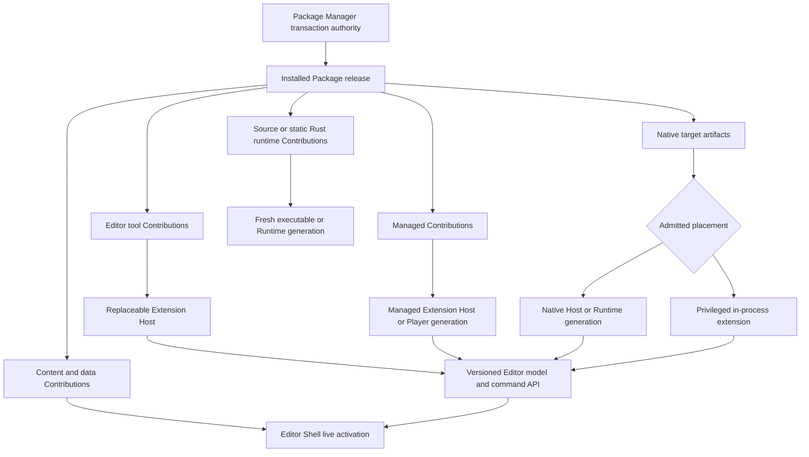

# Nara Package and Extension Product Contract - Plan

## Goal Capsule

- **Objective:** Define the product-facing Package model and extension freedom Nara must eventually provide without collapsing Rust plugins, managed modules, native libraries, content, and editor tools into one execution mechanism.
- **Product authority:** `STRATEGY.md`, Accepted ADRs, and the decisions recorded in this Product Contract constrain later planning; this artifact does not accept an ADR or activate implementation.
- **Open blockers:** Package implementation remains gated by OQ-031, Host-owned Editor Play, the active reference-game plan, and contribution-specific tracers.

---

## Product Contract

### Summary

Nara will present one language-neutral Package experience for installing, inspecting, updating, activating, and removing content and executable extensions.
Internally, each Package contains typed Contributions that use lifecycle and placement appropriate to their role, with isolated Extension Hosts as the baseline for ordinary executable Editor Contributions and privileged in-process integration available only where evidence requires it.

### Problem Frame

Nara aims to combine Rust-native, strongly typed game authoring with the integrated editor and extension ecosystem expected from mature engines.
A Cargo crate and a runtime `Plugin` are excellent Rust composition units, but neither by itself represents editor UI, asset imports, build support, content ownership, platform artifacts, update recovery, or an Asset Store installation identity.

Treating every extension as a dynamically loaded Rust object would appear flexible but would make ABI compatibility, unloading, stale callbacks, ECS type lifetime, and editor recovery unreliable.
Treating Package as a C#-only unit would make the distribution model depend on one optional authoring language and weaken Rust as the complete official path.

The product therefore needs one coherent Package workflow above several honest execution boundaries.
Users should normally remain inside the Editor while Nara reloads data, replaces an Extension Host, or reconstructs a Play runtime, while deep engine integration may still require an explicit Editor restart.

### Key Decisions

- **Package is a language-neutral distribution unit.** (session-settled: user-approved - chosen over defining Package as a Rust functional bundle or C# assembly: one installable unit must be able to carry content, runtime functionality, editor UI, importers, build support, and target artifacts.)
- **Ordinary executable editor extensions use an isolated Extension Host by default.** (session-settled: user-directed - chosen over loading all trusted C# or native extensions into the long-lived Editor process: process replacement gives a truthful recovery baseline while a privileged in-process tier preserves low-latency depth.)
- **Activation is graduated rather than universally hot-reloadable.** (session-settled: user-directed - chosen over promising arbitrary live native replacement: the product must distinguish immediate activation, Extension Host replacement, Runtime replacement, and Editor restart.)
- **Rust remains the complete official runtime authoring path.** A source/static Rust `Plugin` keeps full typed ECS, schedule, resource, and domain freedom; managed and native Contributions add optional paths rather than redefining `Plugin`.
- **Project settings do not select arbitrary providers by string identity.** (session-settled: user-directed - chosen over `nara.toml` physics or backend lookup: compiled Rust recipes and plugin composition remain the authority for concrete code selection.)
- **A first complete integration precedes a cross-provider Interface.** (session-settled: user-approved - chosen over requiring two physics or other backends up front: the first official plugin owns its coherent domain API, and a portable Interface requires later independent variation pressure.)
- **Distribution governance follows the stronger Unity precedent while execution layering follows the stronger Godot precedent.** (session-settled: user-approved - chosen over copying either engine wholesale: Nara needs dependency and ownership semantics beyond an archive installer, while preserving distinct content, editor, managed, runtime, native, and built-in lifecycles.)

#### Activation Classification

`Runtime replacement` is one top-level activation class. Play Runtime, managed Player, Rust Runtime, and native Runtime generations are subtypes used for implementation and measurement; they do not create additional user-facing activation levels.

| Activation class | Required condition | Escalation evidence |
|---|---|---|
| Immediate | The candidate can publish through its owner's transaction boundary without replacing an executable process generation or invalidating active native state | Validation proves the affected data, content, or compatible body-only change can publish independently |
| Extension Host replacement | Every changed executable Editor Contribution and its leases are owned by a replaceable isolated Host, and any restored UI state is declared data | Host readiness, lease retirement, and declared-state restoration pass before publication |
| Runtime replacement | Gameplay or runtime structure requires a fresh Player or Runtime generation, while the Editor Shell can preserve workspace authority | The new Runtime reaches readiness and the old Runtime remains launchable until atomic publication |
| Editor restart | Admitted in-process Editor code or ABI changes, or the current owner cannot prove quiescence, retirement, or compatible reconstruction | The operation records why Immediate, Extension Host replacement, and Runtime replacement cannot carry the change; `deep change` alone is not sufficient |

#### Isolation and Privileged Placement

An isolated Extension Host provides lifecycle replacement and crash containment by default; it is not an OS confidentiality or integrity sandbox. Contributions sharing one Host share one security principal and may be grouped only when their approved effective trust and permissions match. Otherwise they require separate processes, and no child Host receives Editor secrets by default.

Privileged in-process placement remains possible, but it is an evidence-gated exception. A representative workload must first miss a named latency or throughput target through the isolated path, after which an admission review freezes the minimum required surface, exact trust and permissions, retirement behavior, and restart fallback.

### Operating Model

The Package Manager owns installation identity, release receipts, user confirmations, and install, update, enablement, disablement, and removal transactions.
The Editor Shell owns workspace state, documents, undo, selection, windows, Nara UI, and user-visible status.
Concrete Extension, Runtime, Import, Build, and Native Hosts own executable activation and retirement for their domains.

### Actors

- A1. **Project user:** Installs, updates, enables, disables, and removes Packages without reconstructing their internal language or Host topology.
- A2. **Package author:** Publishes one coherent release containing typed Contributions, target coverage, dependencies, trust facts, samples, and documentation.
- A3. **Editor Shell:** Preserves the workspace and renders extension UI while child Hosts or Play runtimes are replaced.
- A4. **Contribution Host:** Validates, starts, supervises, retires, and reports one executable Contribution generation.
- A5. **Product composition root:** Maps installed Package Contributions to the exact implementations compiled or admitted for the selected product and target.
- A6. **Package Manager:** Owns resolved installation identity and coordinates release validation, preview, confirmation, update, enablement, disablement, required-cohort publication, inspection, and removal transactions.

### Requirements

**Package identity and governance**

- R1. A Package must have a language-neutral identity and may contain content, source/static Rust, managed, native, editor, importer, build/export, sample, documentation, and migration Contributions.
- R2. Every executable Contribution must declare its role, execution target, subject target, compatibility requirements, trust class, and activation effect without sharing one universal executable trait.
- R3. Installation state must record resolved release provenance, direct and transitive Package relationships, target artifacts, and file ownership strongly enough to support deterministic inspection and safe removal.
- R4. Cargo must remain authoritative for Rust source dependency resolution, and NuGet/MSBuild must remain authoritative for managed dependency resolution; Nara may orchestrate both but must not invent one merged source resolver.
- R5. Package installation, Contribution enablement, active executable generation, and project content state must remain separately observable.

**Activation and recovery**

- R6. The top-level activation classes are Immediate, Extension Host replacement, Runtime replacement, and Editor restart. The Editor must remain open for the first three classes; Play Runtime, managed Player, Rust Runtime, and native Runtime are Runtime replacement subtypes. Escalation to Editor restart requires recorded evidence that the earlier classes cannot preserve correctness, compatibility, or truthful retirement.
- R7. Before install, update, enable, disable, or removal, the UI must show source and integrity changes, downloads, build or reimport work, effective trust and permissions, target coverage, migrations, and activation class. Every operation must expose its current phase, available progress, cancelability, and publication boundary. Project mutation or Package-controlled code execution requires explicit confirmation after code-free preflight; pre-publication cancellation preserves the prior installed, enabled, and active state, while failure identifies the last-good state, diagnostics, and retry action.
- R8. Executable updates must prepare and validate an immutable candidate before publication, preserve the last-good active generation on candidate failure, and reject late results from retired generations. A predecessor counts as last-good only when its executable cohort and project data remain mutually compatible and launchable.
- R9. A required multi-Contribution activation must not expose a mixed old/new cohort, while unrelated imported content, saved documents, and workspace state retain their own publication authorities.
- R10. Removal must delete only unmodified, ownership-proven Package files and derived state; modified, adopted, or provenance-ambiguous project content must be preserved and reported.

**Extension freedom**

- R11. The Editor extension surface must eventually cover panels and docks, menus and commands, inspectors and property editors, gizmos and viewport tools, importers, build/export steps, diagnostics, and package-owned settings through toolkit-neutral models and commands.
- R12. Ordinary Editor extensions must not depend on egui, Nara UI implementation objects, raw window handles, the gameplay `World`, or renderer handles; the Editor Shell renders semantic contributions and owns input, focus, text/IME, accessibility, layout, and undo authority.
- R13. A Rust runtime `Plugin` must retain direct typed ECS and schedule composition inside a freshly built Runtime generation; Package integration must not replace this path with RPC or a universal provider Interface.
- R14. C# may be a first-class optional authoring language for managed gameplay and Editor Contributions, but C# is neither required by Package nor authorized for production until its owning trials pass.
- R15. A trusted Native Extension may ship `.dll`, `.so`, `.dylib`, framework, static-library, or Wasm artifacts as target policy allows, but raw Rust ABI and `dyn Plugin` values must not become the ecosystem binary contract.
- R16. Deep toolkits such as Dear ImGui, native SDKs, and high-frequency viewport integrations must remain possible without granting ordinary Packages unrestricted Editor internals. A privileged in-process Contribution or high-bandwidth surface may be admitted only when a representative workload proves that the isolated path cannot meet a named latency or throughput target and an admission review freezes the minimum surface, effective permissions, retirement behavior, and restart fallback.

**Trust, composition, and portability**

- R17. Isolated Extension Host placement must be the default for ordinary executable Editor Contributions. It promises lifecycle and crash containment, not OS confidentiality or integrity isolation. Contributions may share a Host only when their approved effective trust and permission sets match; otherwise they require separate security principals. Same-process managed or native placement must be explicit, fully trusted, and permitted to return `restart required` when retirement cannot be proven, and child Hosts must not inherit Editor secrets by default.
- R18. Cross-process and future binary protocols must use stable IDs, bounded values and messages, generation-stamped opaque handles, structured diagnostics, and explicit cancellation; they must not carry Rust references, trait objects, process-local ECS IDs, callbacks without leases, or native ownership implicitly.
- R19. Package target selection must reject missing or ambiguous artifacts before activation and must distinguish Host execution platform from the product/export target.
- R20. `nara.toml` may request semantic product capabilities and settings, but it must not load arbitrary code or select a concrete physics, renderer, UI, or other provider by string identity.
- R21. Package trust UI must distinguish data-only content, build-time code, isolated executable code, trusted in-process code, and any genuinely enforced sandbox without describing a process boundary or permission list as isolation. It must show the effective file, project, network, process, environment, and credential authority actually granted by the admitted platform policy.

**Package admission, operation, and authoring safety**

- R22. Every direct or transitive Package, Contribution, and target artifact must bind to and verify an immutable source identity plus a content digest or equivalent toolchain-authenticated evidence before unpack, build, or activation. Missing, ambiguous, or mismatched evidence fails closed, and update preview must expose source or integrity changes without requiring Nara to replace Cargo, Git, NuGet, or another source resolver.
- R23. Source resolution, dependency-graph construction, manifest processing, and archive inspection before the trust decision must execute no Package-controlled code and must enforce domain-owned limits for encoded bytes, file count, path depth, expanded size, dependency nodes, time or bounded work, and disk use. Any step that cannot be inspected without code execution must be labeled and approved before invocation.
- R24. Package file writes must use host-issued filesystem capabilities and fail closed on traversal, symlink, junction or other reparse-point escape, case-fold or path-alias collision, unproved mount or filesystem transitions, and ambiguous ownership. Installation and update must not overwrite or claim existing unowned files, and migration write sets must be previewed and transactionally recoverable.
- R25. Every executable, build-time, and migration Contribution must declare its required engine and project permissions. Admission denies ungranted authority; trusted in-process approval binds to source, Package release, exact artifact, and permission set. A source, artifact, or permission expansion requires reauthorization, while disablement and removal revoke the affected generation's grants.
- R26. A migration Contribution must run against an isolated project candidate and publish atomically with its required executable cohort. If predecessor compatibility cannot be proven, or if migration or candidate validation fails, the operation must stop before commit and must not claim that the predecessor remains last-good.
- R27. The Package Manager must provide one inspect-and-reconcile flow that shows the effective current state and blocker first, followed by installed release, Contribution enablement, active and last-good generations, retained project content, and one clear next action for every inconsistent or failed state.
- R28. Install, confirm, cancel, retry, inspect, disable, and remove must be keyboard-operable. Package Manager state transitions must place and restore focus predictably, expose semantic progress and error announcements, and never encode trust, blocking, or restart impact by color alone.
- R29. Package authors must be able to assemble typed content, Rust, managed, native, Editor, importer, build, documentation, sample, and migration Contributions with target, dependency, integrity, trust, and permission facts; run the same bounded structural validation used by installation; and produce an immutable release candidate and receipt consumable from local, Git, or Cargo-backed sources without requiring a remote registry.

### Key Flows

- F1. **Create and validate a Package release**
  - **Trigger:** A2 assembles one or more typed Contributions for local, Git, or Cargo-backed consumption.
  - **Actors:** A2, A5, A6.
  - **Steps:** Assemble Contribution declarations and target artifacts; freeze source identities and integrity evidence; validate dependencies, targets, permissions, file ownership intent, and required cohorts; run code-free bounded structural preflight; authorize any required build step separately; emit an immutable release candidate and validation receipt.
  - **Outcome:** A consumer can inspect and install the same coherent release without a remote registry or a language-specific Package identity.
  - **Covered by:** R1-R4, R19, R22-R25, R29.
- F2. **Install and preview**
  - **Trigger:** A1 selects a local, Git, Cargo-backed, or future registry Package release.
  - **Actors:** A1, A3, A5, A6.
  - **Steps:** Resolve metadata and dependencies against immutable evidence; run code-free bounded preflight; stage through host-issued filesystem capabilities; validate target, ownership, and Contribution declarations; present source, integrity, permission, migration, target, and activation effects; enter a cancellable confirmation state; after explicit confirmation, run separately authorized code-bearing steps and commit the installation transaction.
  - **Outcome:** The Package is installed and inspectable, but executable Contributions have not gained authority merely because files exist.
  - **Covered by:** R1-R7, R19, R21-R25, R27-R28.
- F3. **Activate or update executable Contributions**
  - **Trigger:** An installed release is enabled or replaced.
  - **Actors:** A3, A4, A5, A6.
  - **Steps:** Build or acquire integrity-verified artifacts under approved authority; prepare a new Host or Runtime candidate; run migrations against an isolated project candidate; validate compatibility, predecessor launchability, and readiness; atomically publish the complete required cohort and project candidate; retire the predecessor according to its declared activation class.
  - **Outcome:** The new generation becomes active without closing the Editor when its activation class allows it, or the last-good generation remains active with diagnostics.
  - **Covered by:** R5-R9, R13-R20, R22, R25-R27.
- F4. **Inspect and reconcile Package state**
  - **Trigger:** A1 opens an installed Package or an operation enters blocked, failed, retained-content, or last-good state.
  - **Actors:** A1, A3, A6.
  - **Steps:** Show the effective current state and blocker first; show the installed release, enabled Contributions, active and last-good generations, retained content, and relevant receipts separately; offer one explicit retry, authorize, reconcile, disable, or remove action appropriate to that state.
  - **Outcome:** A1 can understand and repair Package state without reconstructing Host topology or confusing installed files with active authority.
  - **Covered by:** R5, R7-R8, R10, R21, R27-R28.
- F5. **Use Package-provided editor functionality**
  - **Trigger:** A Package contributes a panel, Inspector, gizmo, importer, or build command.
  - **Actors:** A1, A3, A4.
  - **Steps:** The Extension Host registers semantic contributions; the Editor Shell renders them and sends bounded commands; generation-owned registrations are revoked automatically on disable, failure, or replacement.
  - **Outcome:** Tooling can change dynamically without transferring workspace, UI toolkit, window, GPU, or undo authority to ordinary extension code.
  - **Covered by:** R6, R11-R12, R16-R18, R21, R25, R28.
- F6. **Remove a Package**
  - **Trigger:** A1 requests uninstall.
  - **Actors:** A1, A3, A4, A5, A6.
  - **Steps:** Preview reverse dependencies and affected documents; deactivate Contributions; retire executable generations; remove only ownership-proven unchanged files and derived state; preserve ambiguous or modified content.
  - **Outcome:** The Package identity is removed without an uninstall callback deleting user work or leaving hidden active code.
  - **Covered by:** R3, R5, R7-R10, R21, R24-R25, R27-R28.

### Acceptance Examples

- AE1. **Covers R5-R6.** Given a data-only Package update, when the new release validates, then its content may activate immediately without restarting an Extension Host, Runtime, or Editor.
- AE2. **Covers R6, R11-R12, R14, R17.** Given a C# Package that adds a standard Inspector and Dock through semantic models without UI-toolkit objects or raw handles, when its code updates, then Nara may replace its Extension Host and restore declared panel state while the Editor workspace remains open.
- AE3. **Covers R6, R13, R20.** Given a source Rust physics Package whose plugin keeps direct typed ECS and schedule composition, when its structural code changes, then Nara rebuilds and replaces the Rust Runtime generation while the Editor remains open; `nara.toml` does not choose the solver by provider string.
- AE4. **Covers R7, R15, R17.** Given a native library that owns process-level callbacks and cannot prove quiescence, when it updates, then Nara records why the earlier activation classes cannot carry the change and reports the required Host or Editor restart before activation instead of claiming a hot reload.
- AE5. **Covers R8-R9.** Given a candidate that fails build, ABI negotiation, Schema validation, startup, or readiness, when activation ends, then no member of the new required cohort is visible and the previous launchable generation remains selected.
- AE6. **Covers R3, R10.** Given a Package sample that the user modified after installation, when the Package is removed, then Nara preserves the file and reports why it was not deleted.
- AE7. **Covers R13, R20.** Given two unrelated runtime plugins that can coexist under their own contracts, when a game composes both, then the official recipe accepts both without forcing an exclusive provider slot; a real conflict remains an explicit plugin/domain error.
- AE8. **Covers R22-R24.** Given a Package source with missing or mismatched integrity evidence, an over-limit archive, a path or link escape, or an ownership collision, when preflight runs, then it fails before Package code executes or project state changes.
- AE9. **Covers R21, R25.** Given an executable update that expands project, file, network, process, environment, or credential authority, when activation is requested, then the new generation remains denied until the exact release, artifact, and expanded grant are approved; disablement or removal revokes that generation's authority.
- AE10. **Covers R8-R9, R26.** Given a migration that cannot prove predecessor compatibility or whose candidate fails validation, when update runs, then it changes only the isolated project candidate, publishes no new cohort, and leaves the original launchable project state selected.
- AE11. **Covers R1-R4, R19, R22, R29.** Given a Package author assembles content, an Editor tool, and Rust and managed dependencies, when local validation succeeds, then Cargo and NuGet/MSBuild retain their respective resolution authority while one immutable Nara release and receipt can be consumed from local, Git, or Cargo-backed sources without a remote registry.
- AE12. **Covers R5, R7-R8, R10, R27.** Given a candidate failure and retained user-modified content, when A1 inspects the Package, then the effective blocker appears first and installed, enabled, active, last-good, and retained-content states remain distinct with one clear recovery action.
- AE13. **Covers R7, R21, R28.** Given a keyboard and screen-reader user, when they install, confirm, cancel, retry, inspect, disable, and remove a Package, then focus remains predictable, state changes are announced semantically, and trust or restart impact never depends on color alone.
- AE14. **Covers R1, R5, R7, R10, R21, R27.** Given a representative first-time project user in a clean environment, when they install, update, disable, and remove a multi-role Package, then they can correctly predict downloads, build or reimport work, permissions, target coverage, activation class, and retained content without learning the internal language or Host topology.
- AE15. **Covers R16-R17.** Given a representative high-frequency viewport workload, when the isolated Host meets its named performance target, then in-process placement remains denied; when it demonstrably misses the target, privileged placement remains denied until the minimum surface, exact permissions, retirement behavior, and restart fallback pass admission review.
- AE16. **Covers R17, R21.** Given two executable Editor Contributions with different approved effective permissions, when Host placement is resolved, then they cannot share a security principal, neither receives Editor secrets by default, and the UI describes process isolation without claiming an OS sandbox.
- AE17. **Covers R18.** Given an Extension Host sends an oversized value, a stale generation handle, a process-local ECS identity, or a result after cancellation, when the Editor protocol validates the message, then it rejects or retires the message without mutating Editor state and reports a bounded structured diagnostic.

### Success Criteria

| Signal | Target | Evidence |
|---|---|---|
| Multi-role coherence | One clean-room Package can contribute content, one Editor tool, and one runtime role under one release identity without a universal callback | External package fixture and package preview snapshot |
| Author release closure | The same multi-role Package produces one immutable candidate and validation receipt consumable from local, Git, and Cargo-backed sources without a registry | External authoring fixture and receipt golden files |
| Editor continuity | 100% of immediate, Extension Host replacement, and Runtime replacement test cases keep the Editor process and workspace alive | End-to-end lifecycle tests with process and workspace identities |
| Activation honesty | Every Editor restart case records why Immediate, Extension Host replacement, and Runtime replacement cannot carry the change; an unclassified `deep change` fails admission | Cross-classification decision fixtures and review receipts |
| Last-good safety | Every injected build, validation, migration, startup, and retirement failure exposes zero partial new cohort members and preserves a data-compatible launchable predecessor when one exists | Fault-injection and migration matrix |
| Supply-chain integrity | Every direct and transitive source and artifact verifies immutable evidence before unpack, build, or activation; missing, ambiguous, mismatched, and limit-plus-one cases fail with no Package code execution or project mutation | Resolver-adapter, archive-budget, and integrity fixtures |
| Filesystem containment | Traversal, reparse-point, alias, ownership-collision, and unproved-filesystem cases cannot escape or overwrite through a strict host-issued capability | ADR 0050 platform and installation-ledger tests |
| Trust honesty | Every code-bearing preview shows actual placement and effective grants; an isolated process is never labeled sandboxed without proven OS enforcement | UX snapshot, permission-policy audit, and secret-canary tests |
| Protocol boundary | Ordinary extension SDK fixtures compile without importing `World`, Bevy ECS IDs, UI toolkit internals, raw window/GPU handles, or Rust ABI objects | Public API and dependency audit |
| Target determinism | Missing and ambiguous artifact selections fail before code loads; repeated equal inputs select the same artifact and impact level | Cross-target resolution fixtures |
| Operation recovery | Every pre-publication cancellation preserves the previous installed, enabled, active, and project state; every failure shows whether last-good is running plus one diagnostic and retry path | Package operation state-machine tests and UX snapshots |
| State comprehensibility | Every defined installed, enabled, active, last-good, retained-content, blocked, and failed fixture shows one effective state first and one valid next action | Package Manager state-model snapshots |
| Accessibility | 100% of critical Package lifecycle actions are keyboard-operable with deterministic focus restoration, semantic state announcements, and non-color status cues | Keyboard automation, accessibility-tree snapshots, and manual screen-reader checks |
| User lifecycle outcome | At least four of five representative first-time users complete install, update, disable, and remove without assistance and correctly identify execution, permission, restart, target, and retained-content impact | Moderated clean-environment task study with success rate and completion-time record |
| Removal safety | Modified or provenance-ambiguous user files are preserved in every removal fault case | Installation-ledger and filesystem fixtures |
| Iteration performance | For every admitted activation path, its owning trial freezes a numeric P50/P95 target before implementation and measured P95 must meet it; results are reported against full Editor restart. Managed Player enters the matrix only after the R14 trial is admitted and does not block earlier Rust-first slices | Reference-package workflow measurements and trial admission record |

### Scope Boundaries

**Deferred for later**

- The exact Package manifest, project dependency file, lock format, registry protocol, signing model, marketplace governance, payment, ratings, and remote build service.
- The exact permission vocabulary, approval UX, platform sandbox mechanisms, stable Native Extension C ABI, binary SDK compatibility window, in-process CoreCLR optimization, Widget wire format, custom drawing protocol, and measured Host grouping policy.
- Mobile, Web, console, NativeAOT, broad trimming guarantees, and complete prebuilt binary matrices beyond independently admitted targets.

**Outside this product's identity**

- A mandatory second author language, a universal Behavior Host, or a requirement that every Package use C#.
- A promise that arbitrary Rust or native structural edits hot-unload in place.
- A universal `Extension`, `Provider`, `PhysicsBackend`, or UI-toolkit Interface created before real independent implementations prove shared semantics.
- Arbitrary cross-engine Package compatibility or an Asset Store that treats untrusted executable code like validated content.

### Dependencies and Assumptions

- The Editor Shell and Runtime must first have truthful generation, candidate, publication, Stop, and last-good boundaries.
- Nara UI must mature enough to render at least one complete complex panel before its public extension widget/surface contract is selected.
- Stable Schema identities and UI-neutral tooling models/commands remain the semantic bridge for editor inspection and cross-language contributions.
- The first product proof remains Rust-first and reference-game-driven; Package and C# trials may not redirect the active execution plan without their named admission evidence.

### Outstanding Questions

**Deferred until evidence**

- Which project file records direct Package dependencies and which generated lock or receipt records resolution and installed ownership while `nara.toml` remains project settings authority?
- Does enablement operate only at whole-Package level in the ordinary UI, or may advanced users independently enable target-specific Contributions when the Package declares that split safe?
- Should ordinary Extension Hosts be per Package, per trust group, or per project after startup cost, memory, fault isolation, and update behavior are measured?
- Which first custom panel or viewport workload proves that standard semantic UI models are insufficient and admits a high-bandwidth surface contract?
- Which concrete native SDK or precompiled extension first justifies a stable C-compatible ABI and its compatibility window?

### Alternatives Considered

#### Option A: One universal dynamically loaded Rust plugin

This gives familiar direct access but depends on unstable Rust ABI and cannot prove that ECS drop glue, callbacks, trait objects, threads, and native state have retired before unloading.
Rejected as an ecosystem contract; source/static Rust remains the complete typed path.

#### Option B: C# as the Package and Editor extension model

This resembles Unity's dominant authoring path and enables managed reload, but couples distribution identity to an optional language and still cannot guarantee cooperative `AssemblyLoadContext` unload.
Rejected as the Package definition; C# remains a first-class optional Contribution family.

#### Option C: Content archive plus independent plugin enablement

This resembles Godot's current Asset Library workflow and keeps installation simple, but lacks dependency resolution, lock state, owned-file removal, atomic update, and coherent multi-role identity.
Rejected as Nara's long-term package governance model.

#### Option D: Language-neutral Package plus typed Contributions and graduated Hosts

This preserves one user-facing Package workflow while letting each contribution use an honest lifecycle and trust boundary.
Selected as the product model, with concrete protocols and loaders admitted only through real tracers.

### Risks and Mitigations

| Risk | Severity | Likelihood | Mitigation |
|---|---|---|---|
| Package management becomes a second Cargo or NuGet | Critical | Medium | Keep each language toolchain authoritative and limit Nara to product-level orchestration, contribution facts, receipts, and UX |
| Isolation reduces extension freedom or responsiveness | High | Medium | Make capabilities broad at the semantic API, batch high-volume exchanges, and retain an explicit privileged tier for proven low-latency workloads |
| Privileged extensions destabilize the Editor | Critical | Medium | Require workload evidence, artifact-bound permissions, a minimum admitted surface, generation-owned leases, restart classification, and process/runtime replacement wherever feasible |
| An isolated Host is mistaken for a sandbox | Critical | Medium | State its lifecycle-only guarantee, expose effective authority, withhold Editor secrets, and group only identical approved security principals |
| Package source or archive compromises the project before trust review | Critical | Medium | Require immutable evidence, code-free bounded preflight, and handle-bound filesystem capabilities before any write or execution |
| Migration invalidates the previous launchable generation | Critical | Medium | Run migration in an isolated project candidate and publish it atomically with a data-compatible executable cohort |
| UI protocol freezes before Nara UI dogfooding | High | High | Freeze ownership and model/command direction now, but defer widget and custom-surface formats until complete panel tracers exist |
| Package, enablement, and active generation state confuse users | High | High | Show each state and impact separately and use one Package Manager workflow to coordinate them |
| Cross-platform native artifacts become ambiguous | High | Medium | Use structured target selectors, reject zero or multiple equal matches, and validate export closure before activation |
| Ecosystem architecture delays the reference game | Critical | Medium | Keep this plan requirements-only and leave implementation behind the active plan and OQ admission gates |

### Sources and Research

- `STRATEGY.md`
- `docs/architecture/README.md`
- `docs/architecture/open-questions.md` OQ-007, OQ-031, and OQ-045
- `docs/architecture/extension-package-concept-guide.md`
- `docs/architecture/source-extension-package-interface-design.md`
- `docs/knowledge/engineering/extension-ecosystem-engine-research.md`
- `docs/knowledge/engineering/godot-csharp-integration-research.md`
- `docs/knowledge/engineering/godot-unity-package-extension-lifecycle-research.md`
- `docs/architecture/adr/0049-untrusted-project-input-and-parse-budget-policy.md`
- `docs/architecture/adr/0050-asset-root-symlink-junction-and-package-trust-policy.md`
- `docs/architecture/adr/0068-global-resource-budgets-metrics-and-diagnostic-privacy.md`
- [Godot Editor plugins](https://docs.godotengine.org/en/stable/tutorials/plugins/editor/making_plugins.html)
- [Godot GDExtension](https://docs.godotengine.org/en/stable/engine_details/engine_api/gdextension/what_is_gdextension.html)
- [Godot GDExtensionManager](https://docs.godotengine.org/en/stable/classes/class_gdextensionmanager.html)
- [Unity package dependencies](https://docs.unity3d.com/6000.0/Documentation/Manual/upm-dependencies.html)
- [Unity lock files](https://docs.unity3d.com/6000.0/Documentation/Manual/upm-conflicts-auto.html)
- [Rust Reference ABI](https://doc.rust-lang.org/reference/items/external-blocks.html#abi)
- [.NET assembly unloadability](https://learn.microsoft.com/en-us/dotnet/standard/assembly/unloadability)

## Deferred / Open Questions

### From 2026-07-20 review

- **Requirements lack delivery-phase labels** - Product Contract / Requirements (P1, scope-guardian, confidence 75)

  Later planning cannot determine which Package capabilities belong to the first independently deliverable slice because the same list mixes long-term product goals, baseline invariants, and evidence-gated capabilities. Treating all requirements as one gate either pulls unadmitted work into the first slice or forces implementers to invent an unauthorized subset; the owning planning pass must choose the exact requirement closure and admission gates.

- **Reverse-dependency uninstall lacks a decision branch** - Product Contract / Key Flows / F6 (P1, design-lens, confidence 75)

  When another Package depends on the requested removal, implementations could block uninstall, cascade removals, or leave an invalid dependency graph. Previewing reverse dependencies does not decide which outcomes users may choose; the product policy must define the allowed branches and their atomic results before removal behavior is planned.
