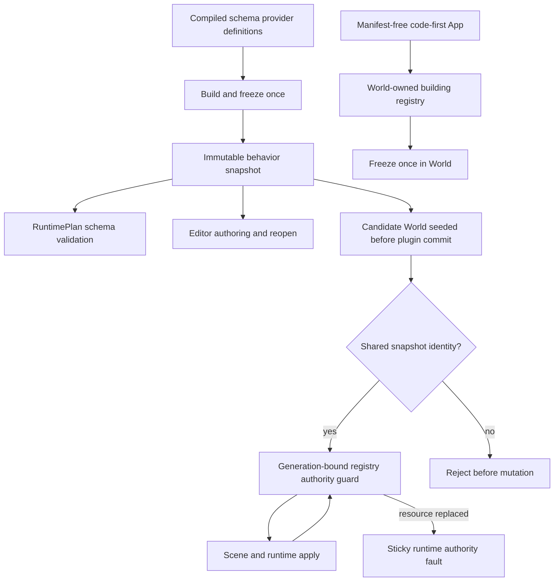
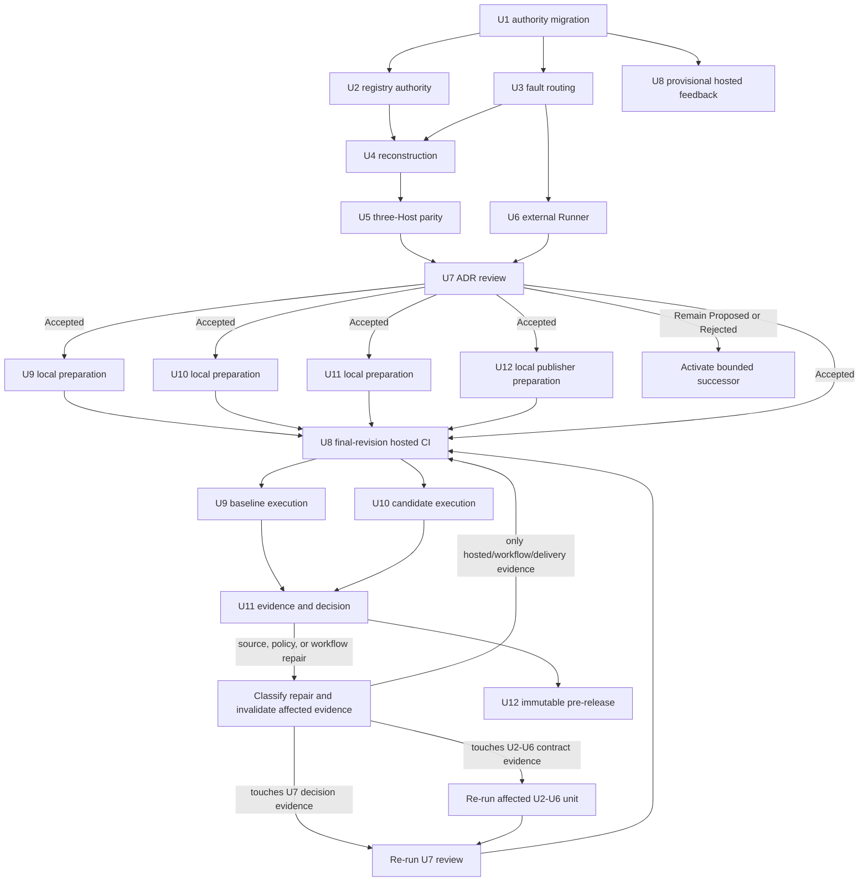
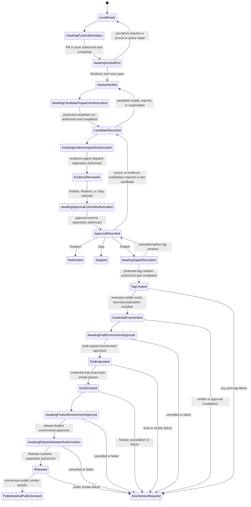

# Reference-Game Runtime Authority and Product Delivery - Plan

## Goal Capsule

- **Objective:** Repair the two runtime-authority defects exposed by RGF-U23, complete the missing Runtime/Host evidence without weakening its metrics, then carry the already-defined hosted CI, baseline, packaging, evidence, and immutable pre-release work to the original Definition of Done.
- **Authority:** `AGENTS.md`, `STRATEGY.md`, Accepted ADRs, and the implementation ledger remain higher authority. This plan replaces only the execution order of its predecessor; completed RGF evidence remains valid unless the invalidation map below requires a focused rerun.
- **Execution profile:** Fearless pre-1.0 refactoring is authorized. Deepen existing modules, delete obsolete compatibility plumbing, and do not preserve single-active process-global runtime routing or duplicate registry behavior authority merely because current tests encode them.
- **Preserved product boundary:** Rust remains the complete official authoring language, `bevy_ecs` remains the ECS substrate, `App` remains the only World/schedule/plugin/time authority, and project data never grants native-code trust.
- **Stop conditions:** Stop and re-plan if per-runtime Bevy error attribution cannot preserve multithreaded execution, if a registry repair requires native binding data in `ProjectContentSnapshot`, if external Runner evidence requires a universal Runner SPI, or if either ADR is rejected without a compatible Accepted successor.
- **Tail ownership:** The selected execution driver (`ce-work` or the host's goal loop, never both concurrently) owns focused implementation and documentation commits, exact evidence reruns, review follow-up, external-authorization pauses, and removal of abandoned attempts. It must preserve every unrelated dirty-worktree change.

---

## Product Contract

### Summary

Nara already has a playable headless and desktop reference game, honest Editor Play/Save ownership, and a concrete product Host. RGF-U23 correctly refused to turn implementation volume into architecture authority: the Runtime still routes Bevy failures through one process-global active reporter, and project composition plus the candidate World can hold behaviorally different registries behind one catalog fingerprint.

This successor repairs those two defects first. It then proves fresh runtime-session reconstruction, real Headless/Desktop/Editor semantic parity, and a clean-room external Runner before independently reconsidering ADR 0084 and ADR 0082. The remaining RGF delivery gates are carried forward without relaxing their hosted, trust, packaging, approval, or publication requirements.

### Problem Frame

`ComponentRegistrySnapshot` already owns the complete frozen schema, native binding, codec, migration, and reflection behavior in one `Arc`. The product path nevertheless builds one registry for `RuntimePlan`, constructs another inside the candidate `World`, compares only the persistent catalog fingerprint, and then applies scenes through the plan registry. Equal persistent schemas do not prove equal executable behavior.

Bevy 0.19 supplies `FallbackErrorHandler` as an uncontextualized function pointer and copies it into multithreaded executor tasks. Nara currently compensates with one process-global schedule lock and one active reporter. Contention becomes a sticky `ScheduleAuthority` fault on an otherwise healthy runtime. Thread-local replacement would fail on Bevy worker threads, while forcing all schedules single-threaded would trade correctness evidence for a product regression.

The product proof is also incomplete. Existing desktop parity constructs a runtime directly, Editor evidence uses a different workflow, and no renamed-dependency external package owns a concrete Runner loop. Hosted Windows/Linux CI exists locally at commit `188a493` but has never run on GitHub, so every downstream candidate and release claim remains blocked on external evidence and explicit authorization.

### Requirements

#### Execution Authority and Evidence Preservation

- R1. Exactly one plan is active; reciprocal supersession, architecture pointers, implementation-ledger pointers, and engineering-memory registrations must migrate atomically without rewriting the predecessor body or marking hosted work complete.
- R2. Completed RGF evidence remains baseline at its exact revision, while every contract affected by registry or error-routing changes is rerun according to the invalidation map before ADR or release evidence cites it.
- R3. Every new engine behavior has a focused public regression owner; no reference-game-only branch enters an engine crate.

#### Registry and Runtime Fault Authority

- R4. File-backed product composition must freeze one immutable behavior snapshot containing schema, native binding, codec, migration, and reflected-type behavior, and the Editor plus candidate World must use that same snapshot rather than independently reconstructing behavior.
- R5. The plan/World admission check and every managed persistent/edit safe point must prove exact shared snapshot identity; replacement becomes a sticky runtime-authority fault. Catalog fingerprint remains persistent-content identity and cannot stand in for executable binding identity.
- R6. Manifest-free code-first Apps must still construct, register, and freeze one World-owned registry without adopting a project Host or file-backed recipe.
- R7. Each managed runtime must own an independently attributable Bevy failure route across parallel systems, run conditions, commands, observers, startup, driver operations, shutdown, panic, and unwind cleanup.
- R8. Two healthy runtimes may coexist, alternate, and overlap schedule execution without sharing reporter state or faulting one another. Route capacity must cover the process quarantine ceiling, those two runtimes, and one admission reservation. Capacity exhaustion occurs before `SealedApp` or obligation-ledger ownership transfer, while retained or quarantined owners keep their route until schedule entry closes, executor scope returns, handler in-flight count reaches zero, and close is truthful.

#### Runtime and Host Product Evidence

- R9. Fresh reconstruction must replace World, queues, time, tasks, runtime-issued service sessions, backend session/cache namespaces, and runtime identity while allowing explicitly shared immutable content, registry snapshots, and process-level parent authority.
- R10. One bounded semantic command stream must pass through the real public `HeadlessRun`, `DesktopRun`, and `EditorProjectSession` paths in dedicated fixture processes and produce the same stable-ID-sorted authoritative snapshot without raw World access or a new engine observation bus. The Desktop path must run the real Winit loop on its child process main thread.
- R11. A locked renamed-dependency external package must own a concrete loop that explicitly drives `RuntimeInstance` through public APIs without `__RuntimeDriverPort`, raw `App::run_once`, a Nara-owned Runner trait, a factory, or a service registry.
- R12. ADR 0084 must be reviewed independently against the refreshed Runtime evidence before ADR 0082 and the combined topology are reconsidered. Failed metrics cannot be removed or reworded to obtain acceptance.
- R13. Runtime/Host conclusions remain limited to already-compiled, Host-trusted code. Project files cannot authorize Cargo resolution, build scripts, proc macros, native packages, native importers, or in-process Play.

#### Delivery Completion

- R14. The existing three-workspace workflow must pass disposable hosted Windows and Linux jobs after U9-U12 local executable/policy/workflow preparation has landed and before their evidence-producing phases claim completion. Later Rust, Cargo, policy-test, or workflow changes invalidate that hosted verdict.
- R15. The first-playable baseline must measure the original RGF-U14 workflow and metrics without adding release-grade provenance or a benchmark framework.
- R16. Standalone Windows/Linux candidates must preserve the complete RGF-U7 package, trust-record, archive-preflight, random-environment, toolchain-free, headless, and desktop-smoke contract.
- R17. Pre-publication evidence must preserve the complete RGF-U20 review, clean-room Rust-author journey, bounded ingestion, approval-record, and next-slice decision contract.
- R18. Publication must preserve the complete RGF-U21 least-privilege, pinned approval, immutable tag/release, credential-separated draft smoke, anonymous public smoke, and no-rebuild contract. Repository-controlled verification code runs only in a credential-free job. The draft-upload write job may read and stream only manifest-bound candidate bytes after fixed digest/size/name checks and must never extract or execute them; the finalize write job consumes only bounded manifest and release identities and touches no candidate bytes or repository helper.
- R19. Pushes, PRs, protected dispatches, tags, draft-upload environment approval, release-finalize environment approval, and Release mutations require separate one-shot explicit authorization. Local readiness never implies hosted verification or publication authority, and post-tag failure starts a new version.

### Acceptance Examples

- AE1. Given one provider set, `RuntimePlan`, Editor authoring, and the candidate World observe the same frozen behavior snapshot. Supplying the same catalog with a different stable binding, codec, or migration receipt rejects before the first mutation; replacing the World registry after publication faults that runtime before the next managed persistent/edit safe point.
- AE2. Given a manifest-free code-first App, schema-owning plugins register into one building registry, freeze it once, and run without constructing a project plan or content snapshot.
- AE3. Given two runtimes whose systems fail concurrently on different executor threads, each system, condition, command, and observer failure reaches only its owning reporter. Neither runtime receives `ScheduleAuthority`, and a healthy peer remains Running.
- AE4. Given saturated fault-route capacity, `RuntimeAdmissionReservation::try_acquire` fails before the caller transfers its unmutated `SealedApp`, obligations, or close policy. Given a reservation, later admission failure retains the route for retirement. A `CloseIncomplete` or quarantined runtime keeps its route; only closed schedule entry, executor return, handler in-flight zero, and truthful close permit reuse.
- AE5. Given two sequential project runs, mutable World, queue, time, task, service-session, backend-session/cache, and identity values differ, while explicitly immutable content and registry snapshots may be pointer-shared. A non-retired predecessor blocks replacement.
- AE6. Given the same reference-game semantic submissions, dedicated real Headless, Desktop, and Editor product-Host processes finish at the same tick with the same bounded canonical stable-ID snapshot envelope. The Desktop child owns the Winit main thread; the fixture uses only a bounded reference-game-owned plugin and observation sink.
- AE7. Given a package that renames the root dependency, its own concrete Runner constructs and drives a managed code-first runtime. Source and dependency audits reject private crates, workspace inheritance, patches, hidden driver ports, raw App driving, and a newly introduced universal Runner interface.
- AE8. Given refreshed evidence, ADR 0084 may become Accepted, remain Proposed, or be Rejected independently. Only Accepted Runtime authority triggers ADR 0082 dependency review; only a compatible Accepted pair or successors unblocks pre-publication approval.
- AE9. Given no authorization to push or publish, local policy, packaging, and evidence preparation may be committed, but the workflow remains `awaiting-hosted-run` and no Hosted, Publish, or Released claim is recorded.
- AE10. Given a U11 `Publish` approval bound to exact candidate identities and digests, U12 consumes separate tag, draft-environment, finalize-environment, and Release-mutation authorizations once, verifies a bounded publication manifest without credentials, and publicly smokes those bytes. `Redirect`, `Stop`, an unpinned approval, changed input, reused authorization, or post-tag failure prevents that version from publishing.

### Success Criteria

- One frozen registry behavior snapshot is shared by the file-backed plan, Editor, and candidate World; fingerprint-only behavior admission and post-publication replacement are gone.
- Process-global active-reporter and schedule-exclusion state is gone; multithreaded concurrent runtime faults remain isolated, route reuse is quiescence-proven, and capacity failure occurs before managed-runtime mutation.
- Full reconstruction evidence distinguishes shared parent authority from fresh runtime-issued sessions.
- The same reference-game command stream passes through dedicated real Headless, Desktop, and Editor Host processes with one bounded semantic snapshot oracle.
- A renamed-dependency external Runner fixture passes without adding a public Runner SPI or using hidden runtime plumbing.
- Independent review either accepts ADR 0084 then ADR 0082 plus their combination, or records the remaining/rejected outcome without unblocking U11.
- Hosted Windows/Linux evidence closes the carried CI gate only after all later-unit local executable, policy-test, and workflow preparation has landed; any later qualifying change reopens it.
- Baseline, standalone candidates, pre-publication approval, and immutable pre-release satisfy the predecessor's unfinished Definition of Done without relaxed trust or smoke requirements.
- Every externally mutating stage consumes one separate user authorization and records a truthful waiting or new-version-required state.

### Scope Boundaries

**In scope**

- One immutable registry behavior snapshot, product-path transfer, exact identity admission, and code-first one-time construction.
- A private bounded Bevy 0.19 fault-route adapter that preserves multithreaded schedules and independent runtimes.
- Runtime session reconstruction, three-Host parity, one external concrete Runner fixture, and independent ADR review.
- The unchanged product outcomes of RGF-U15, RGF-U14, RGF-U7, RGF-U20, and RGF-U21.
- Cross-platform Python orchestration for new packaging, measurement, ingestion, smoke, and release-verification tools.

**Deferred to follow-up work**

- Removing the private fault-route adapter after Bevy exposes a contextual per-World error handler.
- General multi-process execution, distributed simulation, arbitrary concurrent Host mutation, and a public executor service.
- Governance reduction described by the predecessor after the release evidence closes.

**Outside this plan**

- A universal Host, service registry, factory, Runner trait, Render Host replacement SPI, second author language, Wasm ABI, marketplace, or dynamic native ABI.
- Project-data activation of Rust/native code, OQ-031's broader package trust decision, or a generated-project workflow.
- New gameplay, hierarchy, 3D, networking, browser, mobile, console, or Steam scope.
- Weakening the predecessor's release trust chain, environment isolation, or public smoke requirements.

---

## Planning Contract

### Key Technical Decisions

- KTD1. **Create and activate a successor instead of editing the predecessor body.** (session-settled: user-approved — chosen over inserting new code work into the completed RGF-U23 unit: RGF-U23 explicitly authorized review only, so a new execution authority is required.) Reciprocal metadata and registrations preserve the predecessor as evidence and move its unfinished delivery gates intact.
- KTD2. **Use the existing frozen `ComponentRegistrySnapshot` as the file-backed behavior authority.** `SchemaValidationInput` owns the snapshot, the Editor reads it, and candidate preparation seeds the World from the same `Arc<RegistryData>`. Schema-provider hooks register into a building registry for code-first Apps and validate stable provider/binding receipts for product Apps; function addresses are not behavior identity. Every managed runtime records the admitted snapshot identity and rejects replacement before and after managed persistent/edit safe points, so publication cannot recreate a second behavior authority.
- KTD3. **Keep persistent content identity separate from executable behavior identity.** `ProjectContentSnapshot` continues to carry only bounded World-independent document/catalog facts. Native bindings, codecs, migrations, function identity, and Host trust never enter project data.
- KTD4. **Route Bevy 0.19 failures through bounded per-runtime handler leases.** Bevy copies a context-free function pointer onto worker tasks, so each lease receives a distinct private static trampoline backed by a bounded slot. Callers must acquire a `RuntimeAdmissionReservation` before transferring a `SealedApp` or obligation ledger into managed-runtime ownership; capacity failure therefore returns without taking either input. Slots follow `Vacant -> Reserved -> Active -> Retiring -> Quiescent -> Vacant`; new schedule entry closes before retirement, the executor scope must return, and handler in-flight count must reach zero before the reporter is cleared or the slot is reused. A lease epoch protects stale lease/drop operations; `RuntimeGeneration` is diagnostic, not an ABA defense. Capacity is at least the process quarantine ceiling plus the two supported overlapping healthy runtimes and one in-flight reservation.
- KTD5. **Do not substitute TLS, single-threaded schedules, or a non-sticky global lock.** TLS misses Bevy workers, forcing single-threaded execution changes the product, and a renamed global lock preserves the rejected authority. Characterization tests cover every Bevy fallible-execution origin before the old globals are removed.
- KTD6. **Use product-owned evidence fixtures, not new engine buses.** A bounded reference-game plugin injects semantic submissions and writes stable snapshots to a test-owned sink for three-Host parity. A parent oracle launches dedicated Headless, Desktop, and Editor fixture processes; the Desktop child runs the real Winit loop on its process main thread, and every child emits the same bounded canonical parity envelope. The external Runner is a clean-room renamed-dependency package with its own concrete loop; neither fixture creates a reusable Nara Interface.
- KTD7. **Review Runtime authority before Host authority.** ADR 0084 owns the repaired behavior. ADR 0082 already passes its independent Host metrics but cannot be promoted until its executable-runtime dependency is Accepted and the pair remains compatible.
- KTD8. **Preserve delivery gates while replacing PowerShell-only helper plans with cross-platform Python.** The orchestration language changes, not the package layout, evidence schema, metrics, trust model, or decision semantics. Workflow YAML remains policy and invocation, not business logic.
- KTD9. **Treat every external mutation as a separate one-shot authorization boundary.** Local commits may prepare later stages, but PR/push, protected execution, tag creation, draft-upload environment approval, release-finalize environment approval, and Release mutation never inherit permission from an earlier step. A consumed or cancelled authorization cannot be reused; once an immutable tag exists, later failure requires a new version rather than a false transition back to the prior approval.

### High-Level Technical Design

The diagrams are directional design contracts. Exact helper names and internal file splits may change while preserving these ownership and failure cuts.

#### Registry authority flow



#### Runtime fault-route lifecycle

```mermaid
sequenceDiagram
  participant Caller
  participant Candidate
  participant Pool as Bounded route pool
  participant World
  participant Workers as Bevy worker tasks
  participant Reporter
  Caller->>Pool: Try reserve before ownership transfer
  Pool-->>Caller: Reservation or typed capacity failure
  Caller->>Candidate: Transfer SealedApp and obligations with reservation
  Candidate->>Pool: Activate slot-specific handler trampoline
  Candidate->>Pool: Activate reporter binding
  Candidate->>World: Install slot handler
  World->>Workers: Run multithreaded schedule
  Workers->>Pool: Enter handler in-flight scope
  Pool->>Reporter: Route through slot-specific trampoline
  Workers->>Pool: Leave handler in-flight scope
  Candidate->>Pool: Retire; close new schedule entry
  Candidate->>Pool: Wait for executor return and in-flight zero
  Candidate->>Pool: Mark quiescent; clear; release
```

#### Unit dependency flow



#### External authorization and delivery states



### Evidence Invalidation Map

| Change | Prior evidence retained as context | Evidence that must rerun before ADR review |
|---|---|---|
| Registry snapshot authority | RGF-U1/RGF-U2/RGF-U29 schema and persistent-apply format evidence | RGF-U4 composition, RGF-U12 content compatibility, RGF-U24 Host materialization, RGF-U17 Editor authoring/reopen, RGF-U13 desktop startup, direct module consumer |
| Per-runtime Bevy fault routing | RGF-U5 lifecycle shape and RGF-U23 decision matrix | RGF-U5 system/condition/command/observer faults, RGF-U24 startup/publication/retirement, RGF-U6 gameplay fault closure, RGF-U17 Play/close, RGF-U13 desktop fault/close |
| Fresh session reconstruction | Existing World/queue/time/task and generation tests | Service session, backend session/cache namespace, identity domain, overlap, one-sided fault, `CloseIncomplete` replacement rejection |
| Three-Host parity | Existing headless/Desktop direct-runtime parity and Editor lifecycle tests | Real `HeadlessRun`, `DesktopRun`, and `EditorProjectSession` command/snapshot oracle |
| External Runner | Existing Winit driver boundary and schedule-extension fixture | Renamed-dependency concrete Runner build, smoke, dependency audit, and raw-App/hidden-port rejection |

The RGF-U23 matrix remains the reason for this work, not acceptance evidence for the repaired revision. U7 writes a new matrix with exact refreshed revisions.

U9-U12 may land local tools, policy tests, and workflows after U7, but they cannot execute or close their externally evidenced phases before U8 passes on that integrated revision. Any later Rust, Cargo, policy-test, or workflow change invalidates U8. A hosted repair that touches U2-U6 evidence also invalidates the affected unit and U7; the final hosted matrix must cite the post-repair U7 decision revision. Evidence-only records produced by U9-U12 do not invalidate U8 when their executable inputs and workflow definitions are unchanged.

### System-Wide Impact

- **Authors:** Code-first Rust Apps keep one ordinary registry construction path. File-backed authors gain no new concepts; the duplicate authority disappears behind composition.
- **Editor:** Authoring continues without a running World by reading the plan-owned immutable snapshot. Play uses the exact same behavior data after publication.
- **Runtime and tasks:** Independent runtimes may execute concurrently without sharing error attribution. Quarantined owners retain scarce route capacity, making leaks observable rather than unsafe.
- **Platform adapters:** First-party Winit behavior remains concrete. External evidence proves public reachability without freezing a common Runner abstraction.
- **CI and release operators:** Hosted and privileged stages remain explicit waiting states, with no authority inferred from local success.

### Risks and Dependencies

| Risk | Mitigation |
|---|---|
| Static handler trampolines become a public runtime limit | Keep representation and overprovisioning private, but enforce the minimum capacity invariant derived from quarantine plus supported overlap and one reservation; reject saturation before ownership transfer and expose typed diagnostics. |
| A route slot is reused while an old worker can still call it | Close schedule entry, transition through Retiring/Quiescent, wait for executor return plus handler in-flight zero, and use lease epochs only to reject stale owner operations. |
| Frozen register-or-validate hides a changed provider | Bind the snapshot to exact provider/binding receipts and process-local duplicate-definition checks; adversarial same-catalog/different-behavior fixtures must reject. |
| Shared parent authority is confused with mutable runtime state | Test runtime-issued session/cache namespaces separately from process-level devices, libraries, and immutable snapshots. |
| Three-Host parity adds a test-only engine hook | Keep injection and observation in a normal reference-game plugin configured through public product recipes. |
| ADR review becomes a forced acceptance gate | Preserve Accepted/Proposed/Rejected outcomes; a non-Accepted Runtime verdict terminates this chain and activates a bounded successor, while Host/combined review and later preparation remain unrun. |
| External GitHub state stalls execution | Continue only dependency-valid local preparation and record the exact waiting state; do not fabricate Hosted or Publish evidence. |
| Privileged jobs execute repository-controlled verification code | Run the exact reviewed verifier in a credential-free no-checkout job and let write-capable jobs consume only its bounded digest-bound publication manifest plus fixed identity comparisons. |
| Concurrent user edits overlap authority documents | Stage only exact successor hunks and immutable records; never overwrite derived rollups or unrelated ADR edits. |

### Deferred Implementation Notes

- U3 may overprovision its private route pool, but its tested minimum is `MAX_QUARANTINED_RUNTIME_OWNERS_PER_PROCESS + 2 healthy runtimes + 1 in-flight admission`; lowering that minimum is a contract change.
- U4 uses a test-owned runtime service-session ID, `WgpuRenderBackend::instance_id`, `(instance_id, device_epoch)` as the device namespace, and texture-cache membership/stats as concrete fresh-session evidence. Only immutable project content, the frozen registry snapshot, compiled plugin definitions/recipe, and explicitly named process parents may be shared.
- Helper and module names may change when `nara_app::runtime` and registry internals are split, provided the ownership, dependency, and test boundaries above remain intact.

### Sources and Research

- `docs/knowledge/engineering/decisions/2026-07/2026-07-21T112729Z-rgf-u23-runtime-and-host-independent-decision-matrix-a5b3266847924dfc93667c72c8929550.md` owns the failed metrics and required follow-up.
- `crates/nara_reflect/src/registry.rs` shows that `ComponentRegistrySnapshot` already contains complete behavior in one `Arc<RegistryData>`.
- `src/project_host/composition.rs` and `src/project_host/runtime.rs` expose the current plan/World duplicate registry and fingerprint-only check.
- `crates/nara_app/src/runtime.rs` exposes the process-global schedule/reporter bridge and sticky contention fault.
- `repo-ref/bevy/crates/bevy_ecs/src/error/handler.rs` and `repo-ref/bevy/crates/bevy_ecs/src/schedule/executor/multi_threaded.rs` show why a drive-thread TLS replacement is insufficient under Bevy 0.19.
- `tests/fixtures/schedule-extension/renamed-root/` supplies the clean-room renamed-dependency fixture pattern.
- GitHub's official [release-assets REST documentation](https://docs.github.com/en/rest/releases/assets?apiVersion=2022-11-28#upload-a-release-asset) requires the authenticated upload request body to contain the raw asset bytes; this is why the draft-upload job may stream approved bytes but must not execute them.
- `docs/knowledge/engineering/progress/2026-07/2026-07-20T032511Z-rgf-u15-local-three-workspace-ci-progress-4d51f0975e5444b819969109f52b2e546.md` records the exact hosted-CI waiting state.
- `docs/plans/2026-07-12-001-refactor-reference-game-driven-foundation-plan.md` remains the source for carried RGF-U15/RGF-U14/RGF-U7/RGF-U20/RGF-U21 product and verification contracts.

---

## Implementation Units

### Unit Index

| Unit | Title | Primary files | Depends on |
|---|---|---|---|
| U1 | Activate successor authority | plan and architecture governance docs | - |
| U2 | Publish one frozen behavior authority | `nara_reflect`, project composition/Host | U1 |
| U3 | Route Bevy failures per runtime | `nara_app::runtime` | U1 |
| U4 | Prove fresh session reconstruction | runtime/Host/backend tests | U2, U3 |
| U5 | Prove real three-Host parity | reference-game Host tests | U4 |
| U6 | Prove an external Runner | renamed-dependency fixture | U3 |
| U7 | Re-review Runtime then Host | ADRs, ledger, decision evidence | U4, U5, U6 |
| U8 | Close hosted CI | workflow and hosted evidence | U1 for provisional runs; U7 plus U9-U12 local preparation to close |
| U9 | Record playable baseline | measurement helper and benchmark doc | U7 to prepare; U8 to execute and close |
| U10 | Build standalone candidates | package/smoke tools and workflow | U7 to prepare; U8 to execute and close |
| U11 | Complete pre-publication evidence | evidence workflow, records, review | U7 to prepare; U8, U9, U10 to execute and close |
| U12 | Publish immutable pre-release | publisher, verifier, release evidence | U7 to prepare; U11 `Publish` to execute and close |

### U1. Activate Successor Authority Without Rewriting History

- **Goal:** Make this document the sole active execution contract and carry the still-pending hosted CI lane without changing its truth.
- **Requirements:** R1-R3 and R19.
- **Dependencies:** None.
- **Files:** `docs/plans/2026-07-21-001-refactor-runtime-authority-product-delivery-plan.md`, `docs/plans/2026-07-12-001-refactor-reference-game-driven-foundation-plan.md`, `AGENTS.md`, `docs/architecture/README.md`, `docs/architecture/adr/implementation-status.md`, `tests/architecture_docs.rs`, and new records under `docs/knowledge/engineering/registry/2026-07/`.
- **Approach:** Change only predecessor frontmatter, active-plan links, and immutable registration records. Preserve the predecessor body and every completed revision. Supersede the existing RGF-U15 registration with a successor registration that still says local implementation complete and hosted Windows/Linux pending.
- **Patterns to follow:** The predecessor's RGF-U9 reciprocal supersession and `ArchitectureSnapshot::validate_active_plan` in `tests/architecture_docs.rs`.
- **Test scenarios:** Exactly one plan is active; its predecessor points back through `superseded_by`; architecture map and ledger each link it exactly once. Removing either link, activating both plans, changing the predecessor body, or recording RGF-U15 as hosted-complete fails. Existing unrelated registrations and concurrent architecture edits remain untouched.
- **Verification:** Architecture governance tests pass, engineering-memory validation recognizes the new active registration and RGF-U15 continuation, and a staged-scope audit contains only successor authority changes.

### U2. Publish One Frozen Component Behavior Authority

- **Goal:** Make one immutable registry snapshot the exact file-backed behavior authority for composition, Editor authoring, and the candidate World.
- **Requirements:** R2-R6; AE1-AE2.
- **Dependencies:** U1.
- **Files:** `crates/nara_reflect/src/{registry,provider,plugin}.rs`, schema-provider helpers in `crates/nara_{scene,transform,render,sprite,tilemap,ui}/src/`, `src/project_host/composition.rs`, `src/project_host/runtime.rs`, `src/project_host/runtime/editor.rs`, `tests/plugin_composition.rs`, `tests/project_runtime_boot.rs`, `tests/editor_persistence.rs`, `reference-game/tests/{authoring,plugin_composition,runtime_drive}.rs`, and affected English architecture/migration docs.
- **Approach:** Store `ComponentRegistrySnapshot` plus stable provider/binding receipts in `SchemaValidationInput`. Add an internal way to construct a frozen `ComponentRegistry` from that snapshot. Seed the candidate App before schema-owning plugin hooks; those hooks register on a building code-first registry or validate the preloaded snapshot without replacing behavior. Admission records a generation-bound registry-authority guard over exact shared snapshot identity. Managed persistent/edit safe points validate it before and after their operation, and the normal frame boundary detects replacement as a sticky runtime fault; content lineage continues to compare only persistent catalog fingerprint.
- **Execution note:** Start with same-catalog/different-binding, codec, and migration failures plus code-first characterization before changing registration.
- **Patterns to follow:** Existing `ComponentRegistrySnapshot::ptr_eq`, static `ComponentSchemaProviderDefinition`, frozen mutation rejection, and RGF-U29 pre-mutation apply discipline.
- **Test scenarios:** The plan and candidate World snapshots are pointer-equal. Same catalog with a different stable binding ID/version, codec receipt, migration receipt, or replaced pre-publication World resource rejects before entity allocation; Rust function-address equality is never consulted. Post-publication insertion, removal, or replacement faults only the owning runtime before the next managed apply/edit safe point. Editor open/model/edit/reopen uses the same snapshot with no Play runtime. A code-first App builds and freezes once and receives the same runtime guard. Missing, duplicate, or late providers still fail in their current error phase. `ProjectContentSnapshot` contains no native binding, codec, migration, function pointer, or Host trust token.
- **Verification:** Focused reflect, composition, content, Host, Editor, reference-game, and module-consumer gates pass; source review finds no fingerprint-only executable-behavior admission and no second product-path registry build.

### U3. Route Bevy Fallible Execution Per Runtime

- **Goal:** Remove process-global active reporter and schedule exclusion while preserving multithreaded Bevy failure attribution and bounded ownership.
- **Requirements:** R2-R3 and R7-R8; AE3-AE4.
- **Dependencies:** U1.
- **Files:** `crates/nara_app/src/runtime.rs`, new `crates/nara_app/src/runtime/fault_route.rs`, `tests/runtime_instance.rs`, `tests/runtime_driver_boundary.rs`, and affected runtime architecture/migration docs.
- **Approach:** Characterize every current capture site, then introduce a bounded internal route pool whose leased slot selects a runtime-specific static handler trampoline. Replace the ownership-taking convenience with `RuntimeAdmissionReservation::try_acquire` followed by `reservation.admit(sealed, obligations, close_policy)`. Capacity failure takes no App or obligation ownership. Once transferred, every later admission/startup/publication failure retains the reserved route for retirement. Bind the slot to the reporter, retain it through close, `CloseIncomplete`, and quarantine, then transition through Retiring and Quiescent before reuse. Delete `RUNTIME_SCHEDULE_AUTHORITY`, `ACTIVE_RUNTIME_REPORTER`, and the `ScheduleAuthority` product fault once overlapping execution proves correct; document the pre-1.0 public migration.
- **Execution note:** Implement characterization and adversarial overlap tests first. Do not fall back to TLS, single-threaded schedules, or a renamed process-global execution lock if the route design fails.
- **Patterns to follow:** Existing move-only candidate obligations, bounded quarantine accounting, generation-stamped control tickets, and fault-bridge mutation guards.
- **Test scenarios:** Two barriers force real overlap between independent multithreaded schedules. System, condition, command, observer, startup, driver-scope, and close errors route only to the owning reporter; explicit App/Runtime `Result` paths remain direct and are not forced through Bevy fallback. Panic/unwind cleanup cannot leak or double-release a route. Saturation returns a typed error before the caller moves its `SealedApp` or obligations; a reservation-bearing failure always retires with that route. The minimum-capacity oracle covers process quarantine plus two healthy runtimes and one reservation. `CloseIncomplete` and quarantine retain capacity. A retiring slot accepts old in-flight callbacks for its old reporter, closes new schedule entry, waits for executor return and in-flight zero, then clears. A stale lease epoch cannot clear or mutate a reused slot. Replacing the handler/reporter remains a sticky authority fault only for that runtime.
- **Verification:** Runtime and driver-boundary suites pass under repeated overlap stress; source search finds no global active reporter or global schedule authority; independent runtimes remain healthy after peer contention and peer faults.

### U4. Prove Fresh Runtime Session Reconstruction

- **Goal:** Complete the runtime-isolation metric without requiring process-level parent authorities to be recreated unnecessarily.
- **Requirements:** R2-R3, R8-R9; AE5.
- **Dependencies:** U2 and U3.
- **Files:** `crates/nara_app/src/runtime.rs`, `src/project_host/runtime.rs`, `src/project_host/runtime/tests.rs`, `tests/runtime_instance.rs`, `tests/workspace_play_runtime.rs`, `crates/nara_render_wgpu/src/{backend,lib}.rs`, and focused fixture plugins under the owning test modules.
- **Approach:** Add a test-owned runtime service-session ID allocated at plugin startup. For the real backend, require a new `WgpuRenderBackend::instance_id`, treat `(instance_id, device_epoch)` as the device namespace, and prove the new texture cache contains no predecessor key while its stats start independently. Use `RuntimeGeneration` for runtime identity alongside existing World, queue, time, and task evidence. Only immutable project content, the frozen registry snapshot, compiled plugin definitions/recipe, and explicitly named process parents may be shared. Prove replacement only after complete retirement and preserve ownership on `CloseIncomplete`.
- **Patterns to follow:** Existing fresh task-pool checks, `RuntimeGeneration`, Wgpu backend epoch/cache ownership, and Editor stop-first restart.
- **Test scenarios:** Sequential, alternating, and overlapping runtimes have distinct mutable state. One runtime fault does not alter the peer. Restart creates new service/backend/identity sessions and no old cache entry is visible. Shared immutable snapshots remain pointer-shared without mutable leakage. A non-retired or quarantined owner blocks replacement, and a later retry completes without double close.
- **Verification:** Runtime, Host, Editor, task, identity, and feature-enabled Wgpu isolation tests pass; the evidence matrix names each shared parent and each reconstructed runtime session.

### U5. Prove Real Three-Host Semantic Parity

- **Goal:** Run one authoritative reference-game command stream through the real Headless, Desktop, and Editor product Hosts.
- **Requirements:** R2-R3 and R10; AE6.
- **Dependencies:** U4.
- **Files:** `reference-game/Cargo.toml`, new `reference-game/src/bin/host_parity_probe.rs`, `reference-game/tests/support/host_parity.rs`, new `reference-game/tests/host_parity.rs`, `reference-game/src/lib.rs`, `reference-game/tests/{desktop_parity,runtime_drive}.rs`, `tests/workspace_play_runtime.rs`, and `src/project_host/runtime/editor.rs` only if the public recipe cannot configure the normal game plugin.
- **Approach:** Build a repeatable reference-game plugin that injects the same bounded semantic submissions and writes the existing stable snapshot into a bounded test-owned sink. A parent integration-test oracle launches `host_parity_probe` once for each Host mode with bounded timeout, random cwd/home, and explicit software display/GPU prerequisites. Each child configures the normal public product recipe and emits one small test-specific canonical envelope; the Desktop child enters the real Winit-backed `DesktopRun` from binary `main`. The parent compares envelopes and never reads a raw runtime World.
- **Patterns to follow:** Existing `desktop_render_probe` child-process lifecycle, `WaveSnapshot`/`ReferenceProjectSnapshot`, `GameplayCommandIngressSource`, headless stop predicates, and Editor public command/view state machine.
- **Test scenarios:** All three child processes receive identical command keys, ticks, sources, and sequences and publish equal size-bounded stable-ID-sorted envelopes. Duplicate, rejected, late, and over-budget input diverges only through the same typed command result. A fault at the same fixed phase faults every path consistently. Timeout and child cleanup are bounded. The sink cannot mutate gameplay or be activated from project data. Source audits reject private Host access, direct Runtime construction, a generic observation bus, or an oversized/general release-evidence format.
- **Verification:** The new host-parity test passes on the supported desktop profile and the existing headless/desktop/Editor suites remain green with no private shortcut.

### U6. Prove a Renamed-Dependency External Runner

- **Goal:** Demonstrate external managed-runtime reachability without freezing a shared Runner interface.
- **Requirements:** R2-R3 and R11; AE7.
- **Dependencies:** U3.
- **Files:** new `tests/fixtures/runtime-runner/renamed-root/{Cargo.toml,Cargo.lock,src/lib.rs}`, new `tests/runtime_runner_contract.rs`, `tests/runtime_driver_boundary.rs`, and minimal public runtime documentation.
- **Approach:** Create an independent locked package whose only Nara dependency is the renamed public root. Its own concrete loop acquires a public `RuntimeAdmissionReservation`, configures and seals a code-first App, transfers explicit obligations through that reservation, starts a `RuntimeInstance`, drives time/control/close through public methods, and reports a bounded result. It introduces no Nara-owned trait, registration key, factory, or provider catalogue.
- **Patterns to follow:** `tests/fixtures/schedule-extension/renamed-root/` and its metadata/source-surface audit.
- **Test scenarios:** The fixture compiles and runs under its own lockfile and renamed dependency. It proves pause, exact step, fault observation, and finite stop. Manifest/source mutations adding workspace inheritance, patches, private Nara crates, direct `bevy_ecs`, `__RuntimeDriverPort`, raw `App::run_once`, runtime World mutation, or a universal Runner symbol fail the boundary oracle. Raw App runner and managed runtime ownership remain mutually exclusive.
- **Verification:** Fixture metadata, locked build, executable smoke, and source AST audits pass independently of the root workspace.

### U7. Re-review Runtime Then Host Authority

- **Goal:** Decide ADR 0084 on refreshed evidence, then decide ADR 0082 and the combined topology only when its runtime dependency permits it.
- **Requirements:** R2-R3 and R12-R13; AE8.
- **Dependencies:** U4, U5, and U6.
- **Files:** `docs/architecture/adr/0084-executable-runtime-ownership-and-isolation.md`, `docs/architecture/adr/0082-process-host-authority-and-runtime-construction-topology.md`, `docs/architecture/adr/{README,implementation-status}.md`, `docs/architecture/nara-foundation.md`, `tests/architecture_docs.rs`, and a new immutable decision matrix under `docs/knowledge/engineering/decisions/2026-07/`.
- **Approach:** Run an independent metric-by-metric Runtime review against exact refreshed revisions. If Accepted, run an independent Host dependency review and combined compatibility review. If Remain Proposed or Rejected, record the verdict, end this execution chain, and atomically activate a bounded successor that owns the named repair/successor-ADR work plus another review; reusable local preparation evidence remains cited but U11 stays blocked. The current plan never invents an ADR 0082 or pair verdict when Runtime authority is not Accepted.
- **Patterns to follow:** The RGF-U23 matrix shape and exact table-equality governance tests, with new revisions rather than edited historical evidence.
- **Test scenarios:** Missing or failed metrics, old invalidated revisions, hidden mixed outcomes, weakened trust scope, or acceptance by implementation volume fail. Runtime acceptance can precede Host acceptance but never the reverse dependency. Proposed/Rejected outcomes leave U11 blocked and require one active bounded successor rather than an ownerless repair loop. Accepted/Accepted requires a fresh compatible pair verdict and no universal interface admission.
- **Verification:** ADR files, catalogue, ledger, foundation, matrix, and architecture tests agree exactly; the evidence record names all refreshed revision and invalidation reruns.

### U8. Close Hosted Three-Workspace CI

- **Goal:** Complete carried RGF-U15 with final-revision hosted Windows/Linux evidence, not more local workflow design.
- **Requirements:** R14 and R19; AE9.
- **Dependencies:** U1 permits provisional hosted feedback. U7 plus the committed local-preparation slices of U9-U12 are required before the final hosted run can close this unit.
- **Files:** `.github/workflows/ci.yml`, `tests/ci_policy.rs`, new hosted verification and registration records under `docs/knowledge/engineering/`, and workflow documentation only if a real hosted failure requires it.
- **Approach:** Preserve commit `188a493`'s six disposable jobs and policy. Provisional runs may expose cross-platform failures while U2-U7 and later-unit local preparation are active, but they cannot close the unit. After U9-U12 executable, policy-test, and workflow preparation lands, run that exact integrated revision with explicit PR or protected-push authorization and observe all Windows/Linux root/reference-game/module-consumer jobs. A hosted repair invalidates the affected focused unit; if it touches U2-U6 evidence, rerun U7 before rerunning the final matrix.
- **Patterns to follow:** The active RGF-U15 progress record and mutation-tested CI policy.
- **Test scenarios:** Every matrix cell is independently visible and time-bounded. A local pass, skipped/neutral job, cancelled final run, wrong revision, fork/untrusted event, write permission, secret/OIDC use, persistent checkout credentials, or shared trusted cache cannot close the unit. Later Rust, Cargo, policy-test, or workflow changes reopen U8; later evidence-only records do not when executable inputs remain identical.
- **Verification:** One reviewed final-revision hosted run is green on both operating systems and all three lockfiles; the successor registration records exact run identity while making no packaging claim.

### U9. Record the First-Playable Product Baseline

- **Goal:** Complete carried RGF-U14 after hosted CI proves both supported environments.
- **Requirements:** R15.
- **Dependencies:** U7 admits local tool/policy preparation; U8 is required before baseline execution and completion. The already completed RGF-U6/RGF-U13 product paths remain prerequisites.
- **Files:** new `reference-game/tools/measure_first_playable.py`, `tests/measurement_policy.rs`, `tests/measurement_helpers.rs`, `docs/benchmarks/reference-game-first-playable-baseline.md`, and affected protocol documentation.
- **Approach:** Land the measurement helper, policy tests, and protocol documentation before U8's final hosted revision. After U8 passes, execute RGF-U14's data-edit, structural Rust edit, clean headless/desktop, public coverage, frame-time P99, memory, build-time, and render-packet cost measures without further executable changes. Use isolated workspaces and standard-library Python orchestration; Rust policy/oracle tests continue to own environment compatibility and verdict semantics.
- **Patterns to follow:** `tests/support/first_playable_evidence.rs` and the landed RGF-U22 vocabulary.
- **Test scenarios:** Dirty subjects reject; failed samples remain; incompatible environments do not merge; private hooks fail coverage; missing headless/desktop success names a bottleneck; source worktree and user home remain unchanged.
- **Verification:** A compact reproducible Windows/Linux-aware baseline exists with raw samples, environment, mechanism, count, failures, and non-claims; no release provenance framework or fabricated threshold is added.

### U10. Build and Consume Standalone Release Candidates

- **Goal:** Complete carried RGF-U7 with immutable checkout-free Windows/Linux candidates.
- **Requirements:** R16 and R19.
- **Dependencies:** U7 admits local package/smoke/workflow preparation; U8 is required before hosted candidate execution and completion. The completed desktop/headless paths remain prerequisites, and U9 execution may run in parallel.
- **Files:** `.github/workflows/ci.yml`, new `reference-game/packaging/`, new `reference-game/tools/{package,smoke_artifact}.py`, `reference-game/README.md`, root `README.md`, `LICENSE-MIT`, `LICENSE-APACHE`, `tests/{ci_policy,artifact_package_policy}.rs`, and candidate verification records.
- **Approach:** Land packaging, smoke, policy, candidate-workflow, and later U12 publisher preparation before U8's final hosted revision. After U8 passes, execute the RGF-U7 allowlisted staging tree, per-platform archive, complete workflow/run/artifact trust record, archive-table preflight, fresh secret-free extraction, random cwd/home, toolchain-free headless and desktop smoke, and explicit software display/GPU profiles without changing executable inputs. Python orchestrates pinned standard tools; it does not become a general archive parser.
- **Patterns to follow:** Existing CI policy, authorized project-root loading, and RGF-U12 aggregate budgets.
- **Test scenarios:** Missing/unexpected files, links/reparse/special entries, path traversal/aliases, case collisions, count/expanded-byte excess, digest or provenance mismatch, unsafe extraction, hidden checkout/toolchain/home dependency, and absent software display/GPU prerequisites fail. PR/fork candidates remain ineligible for U11 approval.
- **Verification:** Hosted candidate and no-checkout consumer jobs pass on Windows/Linux with exact identities, digests, sizes, retention deadlines, licenses, and README; no publication credential is present.

### U11. Complete Pre-Publication Successor and Candidate Evidence

- **Goal:** Complete carried RGF-U20 over the repaired, reviewed, final candidates and decide Publish, Redirect, or Stop.
- **Requirements:** R2, R12-R13, R17, and R19.
- **Dependencies:** U7 Accepted authorities admit local evidence-workflow/tool/policy preparation before U8. U8, U9, and U10 are required before the evidence run and decision; completed RGF-U8/RGF-U13/RGF-U17/RGF-U19 remain prerequisites.
- **Files:** new `.github/workflows/reference-game-evidence-ingest.yml`, new `reference-game/tools/{measure_headless_iteration,measure_desktop_product,ingest_evidence}.py`, `tests/{measurement_policy,ci_policy,evidence_envelope}.rs`, `docs/benchmarks/{reference-game-baseline,reference-game-evidence-review}.md`, versioned normalized schema/data/approval paths under `docs/benchmarks/data/`, and focused verification records.
- **Approach:** Land the evidence workflow, helpers, schemas, and policy tests before U8's final hosted revision. After U9/U10 finish without executable drift, obtain separate authorization for the protected evidence-ingest dispatch, then run RGF-U20's full pre-publication simplify/review pass, P0/P1 resolution, independent credential-free Rust-author public-API journey, exact final-candidate rerun, bounded non-executing ingestion, metric invalidation rules, immutable normalized evidence, canonical approval record, architecture handoff, and non-blocking next-slice decision. Committing the final approval record to the protected default branch requires a new PR/push authorization; neither authorization is inherited from U8 or U10.
- **Discovered pre-publication correction gate:** The 2026-07-26 independent review reproduced five source P1 defects that now belong to U11's existing P0/P1-resolution obligation: optional-plugin omission is still conflated with owner-lineage schema deletion; prefab expansion does not namespace schema-declared `SceneLocal` entity references; public tooling code can forge a saved checkpoint without a Host/FS persistence receipt; unresolved and unsupported asset-reload work can remain unbounded and non-terminal; and paused frames clear physical-input transitions without first resolving or retaining them. Each defect must land as a focused engine correction with a public regression, exact authority/ledger reconciliation, and affected-evidence invalidation before final U8/U10 candidates are built. The owner-lineage repair first resolves OQ-044's minimal owner-catalog record and predecessor authority through an independently reviewed architecture decision; Accepted ADR 0081/0095 already forbid omission-as-deletion, but the active plan must not invent a public persistent wire shape. The `Vec<u8>` spare-capacity observation is a P2 API/measurement follow-up under ADR 0068's logical-payload budget, not a U11 P1 blocker.
- **Correction progress (2026-07-26):** Commit `d88ddab2056b42da225e5d28970062c49a345c97` closes the prefab-local entity-reference defect. Prefab expansion now migrates values before using the current schema, validates the complete declared `entity_ref` structure, rewrites only `SceneLocal` references into each instance namespace, preserves `Persistent` references, charges exact projected identity/value growth, and publishes no partial override or target state on rejection. Focused default/all-feature tests, workspace check, strict changed-target Clippy, and independent correctness/performance/simplicity review passed. The optional-owner lineage, persistence receipt, asset-reload terminality, and paused-input defects remain blocking; U11 and all protected dispatch/publication authority remain open.
- **Further correction hardening (2026-07-27):** Commits `78300531c23317665da5b042e5ba4963107c3122`, `e67dce37a44e7b121fc66d2745e2e052a46c4813`, `bb0ab56fcfa35a3d7cfff5345a5b958b66130c10`, and `a7599490ba1fe8e18d01ad172db61d426db99649` close four additional review findings without closing the four source gates above. `CoreStage::Cleanup` is now the validated public frame-end schedule anchor, so the reference product no longer orders against the private `FixedUpdateSet::Finalize`. `ComponentRegistry` carries intrinsic insert/discard hooks, so removing and reinserting the same registry object cannot evade frozen authority validation. The reference-game Enemy schema migrates from v1 to v2 without a prefab-local outer Player target and resolves the unique Player role within its scene instance at runtime. CI now compiles every root target, exercises the full root feature/example matrix, runs complete default/all-feature root and reference-game suites, and checks/tests the direct module consumer. These Rust, product-content, policy, and workflow changes make the prior U2/U7 authority review, U8 hosted matrix, U9 baseline, and U10 candidate evidence historical for the new revision; each affected gate must be refreshed in dependency order before U11 evidence ingest. No protected dispatch or publication stage is authorized by this local progress.
- **Scope boundary:** U11 records, but does not implement, the broader product-SDK follow-ups from the same review: OQ-045 typed contributions, semantic capability-to-recipe mapping, importer/render surface honesty, public API support tiers, the ordinary desktop facade, and identity-before-hierarchy/transform sequencing. U11 may remove one of those surfaces only if the clean-room journey proves a concrete P0/P1 obstruction; otherwise the architecture handoff selects a bounded successor after delivery evidence closes.
- **Patterns to follow:** RGF-U22 evidence envelopes, U9 environment classes, U10 candidate trust records, and the predecessor's exact RGF-U20 contract.
- **Test scenarios:** Missing or reused evidence-ingest/approval-commit authorization, invalidated source/environment lineage, oversized or hostile records, sensitive canaries, identity/digest mismatch, executable ingestion, repository mutation, failed clean-room journey, undocumented intervention, unresolved P0/P1, expired candidate, or non-Accepted authority prevents Publish. Focused engine regressions prove optional schema reactivation, per-instance prefab reference isolation, unforgeable receipt-backed save advancement, bounded terminal reload handling, and retained paused-input semantics. Any source, policy-test, or workflow repair invalidates U8 and the affected U2-U7 evidence before U11 may rerun. Redirect/Stop remains a valid terminal decision but cannot trigger U12.
- **Verification:** The reviewed final source and exact final candidates have one immutable, bounded, redacted evidence set and a pinned approval commit/blob/SHA record; no candidate code executes in a credential-bearing or repository-mutating step.

### U12. Publish the Evidence-Approved Immutable GitHub Pre-release

- **Goal:** Complete carried RGF-U21 by publishing only U11-approved bytes and proving anonymous public consumption.
- **Requirements:** R18-R19; AE10.
- **Dependencies:** U7 admits local publisher/workflow/policy preparation before U8. Publication requires U11 `Publish`, then separately authorized tag creation, draft-upload environment approval, release-finalize environment approval, and Release mutation.
- **Files:** new `.github/workflows/reference-game-release.yml`, new `reference-game/tools/verify_release.py`, `tests/ci_policy.rs`, release documentation, U11's versioned approval record and evidence review, and release verification records.
- **Approach:** Land and independently review the publisher, verifier, and policy tests before U8's final hosted revision. At publication, a credential-free no-checkout verifier fetches the exact reviewed helper and approval/schema blobs by commit, blob ID, and SHA-256 and emits one bounded digest-bound publication manifest. The draft-upload write job consumes only allowlisted manifest outputs, fetches exactly the approved candidate artifacts, verifies name/size/digest before streaming their raw bytes to GitHub, and never extracts or executes them or any repository helper. The release-finalize write job consumes only bounded manifest/release identities and touches no helper or candidate bytes. Preserve RGF-U21's protected immutable version tag, identity-bound credential-free draft smoke, anonymous public download/smoke, and no announcement before success.
- **Patterns to follow:** The predecessor's RGF-U21 approval and credential-barrier contract plus GitHub immutable Releases policy.
- **Test scenarios:** Any unreviewed workflow, extra write-capable job, checkout/helper/candidate execution in a write job, unbounded verifier output, credential leakage, unprotected/moved tag, reused authorization, version mismatch, approval substitution, wrong candidate/digest/identity, unsafe archive, mutable release setting, failed draft/public smoke, or later asset mutation prevents announcement. Cancellation before tag creation returns to approval; every failure after tag creation starts a new U11/U12 version.
- **Verification:** Independent security and bug/regression review clears the exact publisher revision; the immutable pre-release contains only approved artifacts; anonymous public headless/desktop smoke verifies exact bytes; the final evidence records authorization and public run identities.

---

## Verification Contract

### Focused Gates

| Unit | Required verification |
|---|---|
| U1 | `cargo nextest run --locked -p nara --test architecture_docs --test-threads=1`; engineering-memory validation; exact staged-scope audit |
| U2 | `cargo nextest run --locked -p nara_reflect -p nara_scene --test-threads=1`; focused root composition/content/Host/Editor tests including post-publication registry replacement; reference-game authoring/runtime tests; module-consumer gates |
| U3 | `cargo nextest run --locked -p nara --test runtime_instance --test runtime_driver_boundary --test-threads=1`; repeated true-overlap, pre-transfer saturation, reservation-bearing retirement, ABA/quiescence stress, and strict Clippy for changed targets |
| U4 | Runtime/Host/Editor/task/identity tests plus feature-enabled `nara_render_wgpu` instance/epoch/cache-session tests |
| U5 | Parent-driven reference-game `host_parity` child-process oracle, existing desktop/headless tests, and workspace Play tests under the supported desktop feature set |
| U6 | `cargo nextest run --locked -p nara --test runtime_runner_contract --test runtime_driver_boundary --test-threads=1`; independent fixture locked build and smoke |
| U7 | `cargo nextest run --locked -p nara --test architecture_docs --test-threads=1`; exact decision-table mutation tests and independent reviews |
| U8 | Local CI policy gate plus one post-preparation final-revision six-job GitHub-hosted Windows/Linux run; invalidation back-edge tests |
| U9 | Focused measurement policy/helper tests and reproducibility from committed instructions |
| U10 | CI/artifact-package policy tests plus hosted candidate and no-checkout Windows/Linux consumer smoke |
| U11 | Measurement/evidence/CI policy tests, clean-room journey, final candidate rerun, bounded ingestion, and complete pre-publication review |
| U12 | CI/release policy tests, credential-free verifier manifest, independent publisher review, separately authorized protected draft/finalize stages, immutable publication, and anonymous public smoke |

### Regression Gates

- Run `cargo fmt --all -- --check`, the locked root workspace nextest/check matrix, no-default/default/product feature checks, and strict Clippy for changed targets with only documented pre-existing allowances.
- Run the independent reference-game and module-consumer locked check/test/format gates under their own manifests and lockfiles.
- Re-run every predecessor gate named in the Evidence Invalidation Map before U7 cites the repaired revision.
- Preserve backend import boundaries: only owning adapter crates and manifests may import `winit` or `wgpu`.
- Run `git diff --check` and an exact staged-scope review before every commit. Do not stage, rewrite, or revert concurrent user files beyond the exact owned hunks.

### Review Gates

- U2 and U3 receive independent correctness, failure-ownership, and test-quality review before their commits close.
- U7 always uses a separate Runtime reviewer. Host and combined-compatibility reviewers run only after an Accepted Runtime verdict; no reviewer is told to force acceptance.
- U11 runs simplification plus bug/regression review over the complete pre-publication delta and clears every P0/P1.
- U12 receives independent security and bug/regression review of the exact permission-bearing workflow before external publication authorization is requested.

---

## Definition of Done

- U1 leaves exactly one active plan, reciprocal supersession, correct architecture/ledger pointers, and truthful active registrations for local Runtime repair plus hosted CI waiting.
- U2 gives file-backed composition, Editor authoring, and candidate World one exact immutable behavior snapshot, faults post-publication replacement at managed safe points, and preserves the independent guarded code-first registry path plus World-independent content documents.
- U3 removes process-global active-reporter/schedule exclusion, proves multithreaded per-runtime fault attribution, enforces the minimum route capacity, and prevents reuse until schedule entry is closed, executor scope returned, handler in-flight count is zero, and close is truthful.
- U4 proves no mutable World, queue, time, task, service session, concrete Wgpu instance/device/cache namespace, or runtime identity leaks across generations while explicitly shared parent authority remains honest.
- U5 proves real Headless, Desktop, and Editor Host parity in dedicated bounded child processes, with the Desktop Winit loop on its process main thread.
- U6 proves a renamed-dependency external concrete Runner without private crates, hidden driver plumbing, raw App driving, or a universal Runner SPI.
- U7 always records the independent ADR 0084 outcome. Only an Accepted Runtime authority triggers ADR 0082 and combined-compatibility review; otherwise U7 records that those reviews are blocked plus the required repair or successor outcome, and U11 remains blocked.
- U8 closes the carried RGF-U15 contract with hosted Windows/Linux evidence for all three independent workspaces at the exact revision containing U9-U12 local executable, policy-test, and workflow preparation; qualifying later changes reopen it.
- U9 closes the carried RGF-U14 baseline with the original metrics, environment classes, failure records, and non-claims.
- U10 closes the carried RGF-U7 contract with licensed, trusted, checkout-free Windows/Linux candidates and no publication authority.
- U11 closes the carried RGF-U20 contract with a reviewed final source, independent Rust-author journey, final candidates, bounded evidence, pinned approval record, architecture handoff, and Publish/Redirect/Stop decision.
- U12 closes the carried RGF-U21 contract only after a credential-free bounded verifier, separately consumed tag/draft-environment/finalize-environment/Release authorizations, exact approval consumption, immutable pre-release publication, and anonymous public smoke of unchanged bytes.
- Every invalidated predecessor contract has focused rerun evidence; all unaffected completed RGF evidence remains cited at its original revision rather than reimplemented.
- Every changed public/persistent contract has aligned English ADR, ledger, foundation, migration, example, and user documentation.
- Every completed unit has focused tests, a precise Conventional Commit, immutable verification evidence, and no unresolved P0/P1 finding.
- No abandoned route experiment, duplicate registry authority, process-global active reporter, false Hosted/Publish claim, compatibility shim, placeholder abstraction, reference-game-only engine branch, generated scratch file, or unrelated staged change remains.
- Work outside Scope Boundaries remains absent from production APIs.
