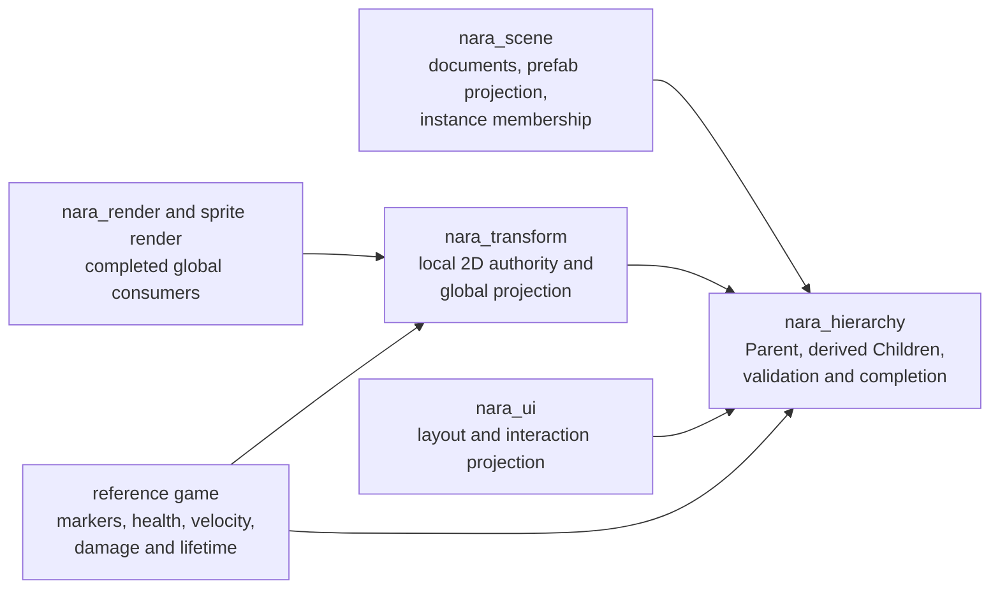
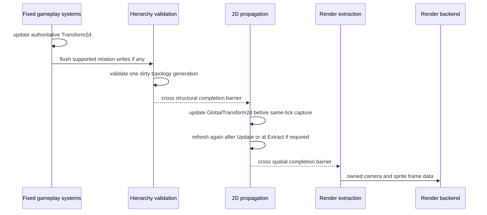

# Reference-Game 2D Spatial Authority and Hierarchy Closure - Plan

## Goal Capsule

- **Objective:** Turn the product-readiness `Redirect` into one concrete game capability: establish one runtime structural hierarchy, make `Transform2d` the only 2D spatial authority, propagate `GlobalTransform2d`, and prove the result through a visible parented reference-game object across headless, desktop, and editor workflows.
- **Authority:** `AGENTS.md`, `STRATEGY.md`, Accepted ADRs, and the implementation ledger remain higher authority. This plan narrows the next execution slice; it does not reopen the retired evidence or publication chain.
- **Terminal contract:** The original reference-game pre-publication outcome remains a later goal. This plan ends with a completed product slice and a grounded next-slice decision, not a `Publish` claim or release workflow.
- **Execution profile:** Fearless pre-1.0 refactoring is authorized. Remove the current `nara_scene` runtime hierarchy implementation, duplicate reference-game spatial fields, compatibility re-exports, and obsolete projection code rather than preserving parallel authorities.
- **Stop conditions:** Stop and re-plan if Bevy's relationship substrate cannot provide a non-linked relationship without a private fork, if the runtime slice requires a persistent scene-format reset to remain correct, or if a proposed fix requires a universal hierarchy/provider abstraction instead of concrete Nara modules.
- **Tail ownership:** The active execution driver owns implementation, focused verification, review follow-up, precise commits, and engineering-memory closure. Repository text does not grant external credentials or protected-environment approval.

---

## Product Contract

### Summary

Nara already runs the same reference-game simulation through ordinary Rust recipes in headless, desktop, and editor Hosts. The next product blocker is spatial correctness: runtime hierarchy is a mutable `Parent` plus a separately mutable `Children` list rebuilt by a full scan, `GlobalTransform2d` is never propagated, render extraction reads local transforms, and the reference game stores position twice. This plan closes that vertical slice without broadening into 3D, physics, visibility, or a new evidence framework.

### Problem Frame

The current dependency direction makes the missing behavior structural rather than local. `nara_scene` owns runtime `Parent`/`Children` and depends on `nara_transform` only to re-export `Transform2d`; `nara_transform` therefore cannot consume hierarchy without a Cargo cycle. UI also imports hierarchy from the scene-document module. At the product level, gameplay systems mutate `Player`, `Enemy`, and `Projectile` position fields while the desktop projection copies those values into `Transform2d`, creating two spatial authorities and making headless behavior differ conceptually from rendered behavior.

The product slice is deliberately narrower than Proposed ADR 0085. Runtime topology, 2D propagation, render consumption, and one real nested object are current needs. Persistent root/sibling ordering, `KeepWorld`, visibility inheritance, prefab ownership transfers, 3D, and physics need separate product evidence.

### Requirements

#### Execution Authority

- R1. Exactly one implementation-ready plan and one engineering-memory registration are active. The predecessor's completed RPR-U5 `Redirect` evidence remains immutable, while plan, architecture, ledger, and memory pointers move atomically to this slice.
- R2. A concise Accepted ADR extracts only the durable ownership and negative invariants from Proposed ADR 0085: runtime structure is independent of Scene, the relation is non-linked, forward parenthood is authoritative, reverse children are derived, structure owns neither lifetime nor UI layout, local and global transforms are distinct, and consumers read only completed projections. Concrete Rust names, collection types, construction/query signatures, schedule-set types, and prelude placement remain provisional until RGS-U5 records their final public/advanced/private disposition from product evidence. ADR 0085 remains Proposed for persistent ordering, reparent authoring semantics, visibility, prefab provenance, UI projection details, physics, and 3D.

#### Runtime Structural Hierarchy

- R3. A new `nara_hierarchy` crate owns one Nara-defined relationship over the Bevy ECS relationship substrate. `Parent` is the source of truth, and `Children` is an immediately maintained derived reverse projection. The normal Nara API exposes query access but no independent reverse-authority constructor or mutator. Bevy's advanced `RelationshipTarget::collection_mut_risky` escape hatch remains outside Nara's ordinary guarantees. The relation does not use `linked_spawn` or imply recursive lifetime ownership.
- R4. This slice supports hierarchy construction and publication, not a general runtime editing API. Scene and prefab publication validate the complete stable-ID parent map before mapping and inserting runtime relations. First-party Rust/UI code creates the provisional source relation through one module-owned construction writer that marks the topology generation dirty. Replacement/unload uses the internal scene transaction in R22; arbitrary move, detach, or reparent remains deferred.
- R5. Direct source-component insertion, reverse-collection mutation, `bypass_change_detection`, and unchecked World access through the re-exported ECS substrate are advanced escape hatches outside Nara's hierarchy-correctness guarantee. Nara does not claim to discover mutations that bypass its writer or dirty signal. For every dirty supported generation, a bounded invariant barrier detects missing entities, self edges, cycles, and inconsistent reverse projection before transform propagation or render extraction publishes derived output. A raw `Entity` value cannot prove cross-World provenance, and this slice makes no such claim.
- R6. `nara_scene` lowers validated document parent facts into `nara_hierarchy` during scene and prefab materialization. Prefab expansion first builds the complete source-relative/stable-ID to runtime-entity map, rewrites every endpoint, validates the prospective forest and ownership scope, then publishes the Scene Instance once. Failure discards the unpublished candidate without leaving entities, membership, hierarchy facts, or retained budget charges.
- R7. `nara_ui` consumes the shared structural relation without giving hierarchy ownership of UI layout, clipping, interaction, visibility, or source-order semantics. The old full-scan `sync_children` implementation and public mutable child-list methods are removed.

#### 2D Spatial Projection

- R8. `Transform2d` is the only authored and runtime-local 2D spatial authority. `GlobalTransform2d` is runtime-only derived state, is materialized for every participating `Transform2d`, and never becomes persistent scene or Apply Changes authority.
- R9. Transform completion has three closure paths: bootstrap validation and propagation after scene materialization but before the first snapshot or Extract; normal fixed-step/PostUpdate completion after gameplay and deferred writes; and a pause-safe pre-Extract freshness fence when spatial facts changed after the last completion. Root transforms equal their local transform. A parented transform requires a continuous ancestor chain of `Transform2d`; missing or cyclic domain chains fault rather than flattening, skipping an ancestor, or publishing a partial result.
- R10. Every world-space `Camera2d`, sprite, and tilemap participant explicitly owns `Transform2d`, receives a completed `GlobalTransform2d`, and is extracted only from that projection. Missing local or global spatial state is an invariant failure; extraction does not silently substitute identity or local transforms. The current `Camera2d` view model consumes global translation only: its completed linear transform must be identity within one engine-owned tolerance, while rotation, scale, shear, and singular camera ancestry reject frame publication instead of being ignored. Camera zoom remains authored by `viewport_height` in this slice.

#### Reference-Game Product Proof

- R11. The reference game removes position and velocity ownership from role-shaped aggregate components. It introduces the minimum role markers, health state/configuration, and `Velocity2d` data required by current queries. Damage, lifetime, cooldown, and other fields split only when an existing query or lifecycle needs independent ownership.
- R12. One visible weapon entity is authored as a child of the player with a local offset. Parent motion must move the child through normal hierarchy propagation, and the child must exist in the shared headless/desktop/editor product graph rather than in a desktop-only mock graph.
- R13. Existing deterministic wave outcomes, simultaneous-direction input, pause/focus recovery, Retry, HUD behavior, packaging, and arbitrary-cwd startup remain valid. Desktop projection attaches presentation data but no longer copies gameplay position into transforms.
- R14. The existing known-schema editor path can change the parented object's local transform, save it, play it, stop, reopen, and observe the same authored value. This plan does not claim hierarchy drag-and-drop, durable sibling ordering, or `KeepWorld` reparent UX.
- R15. Diagnostics stay on existing structured fault and bounded runtime-diagnostic owners. This slice may add hierarchy/transform diagnostic IDs and focused developer-visible context, but it must not introduce a new diagnostic bus, overlay framework, benchmark collector, JSONL transport, or release evidence protocol.
- R16. Persistent topology flows in one direction in this slice: `SceneEntityRecord.parent` lowers to runtime `Parent`. Save, Export, Apply Changes, and Stop/Reopen do not infer topology from the live World. Runtime relation projections are transient runtime state and cannot advance the document's saved revision.
- R17. The reference game defines a component ownership table before schema changes. Authored configuration and initial values may persist; current health, velocity, remaining cooldown/lifetime, `GlobalTransform2d`, and other runtime or derived state remain outside scene, prefab, Export, and Apply Changes records.
- R18. Reference-game content changes preserve existing asset IDs, scene entity IDs, prefab source IDs, and startup references. The new child receives an explicit stable ID, and the canonical startup scene-to-prefab-to-atlas closure remains complete from arbitrary working-directory and home locations.
- R19. Retry restores the complete admitted scene topology and content through the existing scene replacement path. It does not maintain a hand-written per-component copy list. The reference game privately owns one bounded run-generation record containing the exact runtime-only entities it created, such as projectiles, and retires that set on Retry without inferring ownership from hierarchy or component queries. Before publication, one game-owned reset candidate derives runtime-only components and resources from authored initial configuration, validates its bounds, and precomputes the next run generation. The prepared scene replacement, game-owned retirement set, and prepared runtime-state assignment publish at one fixed-step safe point with no fallible branch after authority changes. Initial startup and Retry use the same private game initializer. This restores transforms, hierarchy, presentation components, stable identity, current gameplay state, movement intent, projectile allocation, and Retry bookkeeping consistently across headless and desktop without creating an engine-level scene-session contract.
- R20. Hierarchy validation is generation-based but deliberately simple. Initial scene/prefab publication validates its complete candidate before release. After a supported topology generation changes, one bounded iterative O(H) pass validates the complete runtime hierarchy and reuses scratch storage. A frame with no supported structural change allocates no temporary graph and performs no hierarchy scan. Affected-closure validation requires measured scale or edit-frequency pressure and is outside this slice.
- R21. The first transform propagator is single-threaded, iterative, and non-recursive. When spatial facts changed, it traverses only the transform-participating forest in O(T + Et), reuses scratch storage, and stores one global value per participant. Because ordinary Rust gameplay retains `Query<&mut Transform2d>`, each completion point performs one allocation-free change-tick scan over transform participants; when nothing changed, it returns without rebuilding the graph, traversing parent/child edges, or writing derived values. A stronger dirty index requires measured pressure or a separately admitted authoring API.
- R22. The existing Scene Instance replacement and unload path becomes compatible with the non-linked relationship hooks without becoming a general scene-session or travel API. Every fallible scene-candidate, identity, exact-membership, observer-eligibility, and relationship-teardown check finishes while the old instance remains authoritative. The commit tail detaches Nara structural relations, crosses one explicit flush boundary, swaps identity authority, and despawns the exact old Scene Instance membership without another fallible branch or an intervening schedule consumer. Bevy's known intrinsic relationship hooks are admitted; user hooks or observers that could add lifecycle work reject before commit. This requirement does not accept candidate game initialization, derived-entity ownership, retained source documents, or a public replacement port; those remain outside ADR 0100.
- R23. The reference game, not `nara_scene` or Project Host, owns one private bounded run-generation record. It retains only the canonical authored reset source or source recipe needed by that product, the current spawned-instance receipt needed to invoke the existing replacement path, the exact bounded set of runtime-created projectiles, and prepared values for Wave runtime state. Existing reference-game composition seams install the same private initializer for Direct App, tests, and Project Host products. No Nara engine crate exports this record, a scene-session provider, a general candidate-initialization port, or a derived-entity registry. If RGS-U4 cannot obtain the canonical reset source and compose a failure-atomic Retry through existing product seams, it stops and opens a dedicated ADR 0089 evidence slice before adding a general Host or Scene contract.

### Acceptance Examples

- AE1. Given the new plan is activated, the prior RPR-U5 registration becomes inactive through a successor record, its `Redirect` evidence bytes remain unchanged, and architecture/current-state point to this plan once.
- AE2. Given the source relation is created through the provisional module-owned construction writer, `Parent` and `Children` agree after the mutation boundary and the topology generation becomes dirty; the ordinary Nara API exposes no reverse-authority constructor or arbitrary move/detach operation. Direct risky or change-detection-bypassing ECS mutation is documented as unsupported and is absent from first-party code.
- AE3. Given scene or prefab publication contains a missing parent, self edge, cycle, invalid ownership scope, or incomplete remap, publication returns a typed error and leaves runtime entities, membership, parent facts, reverse projections, and retained budget charges unchanged.
- AE4. Given a parent is despawned through the low-level ECS substrate, its surviving children are detached rather than recursively despawned. Given a Scene Instance unload or replacement, only the exact Scene Instance membership retires; structural descendants outside that membership and unrelated runtime entities survive.
- AE5. Given a root, child, and grandchild with finite 2D transforms, the completed global matrices equal root-local, root-times-child, and root-times-child-times-grandchild respectively; local changes update the affected chain before extraction.
- AE6. Given a dirty supported generation still contains a residual cycle or inconsistent relation after deferred writes flush, the runtime reports a sticky structured fault before publishing a transform or render packet for that frame.
- AE7. Given a parented sprite or tilemap, moving the parent changes the extracted world pose while the child's authored local transform remains unchanged. Given a world-space camera, sprite, or tilemap lacks explicit local or completed global state, frame publication fails instead of using identity or local fallback. A translated camera extracts the completed global position; a rotated, scaled, sheared, singular, or non-finite camera projection rejects explicitly.
- AE8. Given the reference-game player moves diagonally, pauses, loses focus, resumes, fires, wins or loses, and retries, the deterministic gameplay outcome remains shared across headless and desktop, every prior-generation projectile is gone, current health/velocity/timers and movement intent are re-derived from authored initial configuration, projectile allocation and Retry bookkeeping start in the new generation, and the parented weapon follows visibly without a position-copy system.
- AE9. Given the editor changes the weapon's local offset, Save, Play, Stop, Reopen, and Play preserve that value and the runtime child follows the player. No operation in this flow claims stable sibling order or world-pose-preserving reparent.
- AE10. Given candidate packaging after the slice, the real headless and desktop entries still run from a bounded no-checkout archive without repository-private helpers or a revived measurement framework.
- AE11. Given player movement during Play, Stop and Reopen restore the document's stable parent and authored local transform. Only a successful persistence receipt for an explicit document edit advances the saved revision.
- AE12. Given two instances of the same prefab, each child's runtime parent resolves inside its own namespaced instance. A missing, cyclic, or cross-instance edge rejects the complete unpublished candidate and leaves World membership and content budgets unchanged.
- AE13. Given Export or Apply Changes after gameplay, persistent component payloads contain authored transforms and configuration, while document topology remains represented by stable `SceneEntityRecord.parent` values. Runtime velocity, current combat state, remaining timers, runtime `Parent`/`Children`, and `GlobalTransform2d` are absent.
- AE14. Given the rewritten reference-game content, authorized startup publication resolves the same existing asset identities plus the new child, produces no orphan metadata or unknown schema, and rejects any dangling stable parent before runtime publication.
- AE15. Given the parent moves during a fixed tick, the same-tick headless snapshot observes the child's updated global pose. Direct App and Project Host startup, including startup-paused state, complete the first projection before their first consumer. Given a paused authoring change, the next Extract observes a fresh global pose and resume does not expose one stale frame. Given Retry, the full scene including the child relation and presentation state is restored.
- AE16. Given an unchanged frame, hierarchy validation performs no scan and transform completion performs only one allocation-free change-tick scan, with no graph rebuild, parent/child traversal, or derived write. Given one dirty deep chain or wide tree, focused instrumentation shows one linear, non-recursive hierarchy validation and one linear transform propagation without quadratic rescans.

### Success Criteria

- `nara_hierarchy` is the sole runtime structural-parent owner and has at least three real consumers: scene materialization, 2D transform propagation, and runtime UI.
- The Cargo dependency cycle is structurally removed: scene and transform both depend on hierarchy, while scene no longer depends on transform merely to re-export it.
- Every renderable 2D world entity and camera uses a completed global projection; nested transforms are covered by engine and product tests.
- The reference game has one spatial authority and one visible nested object, with no role aggregate retaining duplicate position or velocity state.
- Retry uses the same private reference-game initialization path in Direct App and Project Host products; its bounded game-owned generation record retires every prior-generation projectile, no runtime resource state survives the generation, and no engine-level scene-session API or gameplay-owned component snapshot remains.
- Headless, desktop, editor, and packaged product paths remain green, and a bounded manual desktop journey is recorded without creating reusable evidence infrastructure.

### Scope Boundaries

**In scope**

- A single new deep module, `nara_hierarchy`, because it removes a real dependency cycle and serves scene, transform, and UI consumers.
- Custom non-linked Bevy relationship components, validated scene/prefab publication, supported-generation validation, hierarchy-aware replacement, and a completion barrier.
- 2D global-transform propagation and render/camera/sprite/tilemap consumption.
- Reference-game ECS decomposition, nested weapon content, editor persistence dogfood, and focused diagnostics.

**Deferred to the next hierarchy/authoring slice**

- Replacing `SceneEntityRecord.parent` with persistent ordered roots/children.
- `First`/`Last`/`Before`/`After` placement, hierarchy-panel drag ordering, exact subtree inverse snapshots, and rename of recursive removal operations.
- `KeepWorld2d`, transform decomposition/recomposition, prefab instance-override-owned entities, cross-instance movement, and convert-to-local.
- A general public runtime attach/move/detach transaction, batch conflict/no-op semantics, World-bound entity tokens, and affected-closure incremental validation. Admit these only when a gameplay/tooling consumer or measured topology pressure exists.

**Outside this plan**

- Hierarchy visibility, culling, 3D transforms, post-affine residuals, physics parenting, animation/skeleton graphs, world-space UI, spatial queries, and navigation.
- Text/font, audio, save-game, scene travel, networking, scripting, C#, Wasm, Render Graph, package manager, marketplace, publication, or release approval.
- A generic profiler, telemetry service, benchmark framework, detached-worktree collector, or transport verifier.

### Assumptions

- The current parent-only scene/prefab format is sufficient to prove one nested 2D object; it remains explicitly unordered and may be replaced in a later pre-1.0 format reset.
- Bevy 0.19 relationship hooks are acceptable substrate for immediate reverse-edge maintenance, while Nara owns cycle validation, failure semantics, lifecycle separation, and the public product boundary.
- Existing input transition queues and focus-release behavior are correct enough for this slice; the product journey verifies them instead of redesigning input again.
- Existing ProductRecipe and run facades remain the normal author path and require no new composition abstraction.

---

## Planning Contract

### Key Technical Decisions

- KTD1. **Create `nara_hierarchy` as the only new crate.** (session-settled: user-approved direction — chosen over keeping hierarchy in `nara_scene`, merging transform into scene, or adding a thin bridge crate.) It owns concrete runtime structure because scene, transform, and UI are independent consumers; it does not define a replaceable backend or universal graph trait.
- KTD2. **Reuse Bevy relationships, not Bevy's built-in hierarchy.** Define a Nara-owned non-`linked_spawn` relation. Reuse immediate reverse-edge hooks and traversal substrate while retaining Nara's explicit lifetime and failure contracts. Ordinary Nara APIs provide read-only reverse queries and one source-relation writer; direct `collection_mut_risky`, `bypass_change_detection`, and unchecked World mutation remain unsupported advanced escapes that Nara does not pretend to detect.
- KTD3. **Close construction before general editing.** Scene/prefab publication validates a complete stable-ID topology before runtime insertion. Provisional Rust/UI construction uses the module writer, Bevy's immediate hooks, and the completion barrier. Relation teardown is private to the scene replacement transaction. A general failure-atomic attach/move/detach batch, cross-World identity token, and editor reparent transaction wait for a named consumer.
- KTD4. **Keep the current persistent parent shape for this slice.** The runtime correction must not smuggle in the much larger ordered-document, patch, prefab-provenance, and `KeepWorld` redesign. Those remain explicit follow-up pressure in ADR 0085.
- KTD5. **Use local/derived transform ownership.** `Transform2d` is authored and mutable; `GlobalTransform2d` is opaque derived state from the completed hierarchy. Consumers read the derived projection instead of recomputing or falling back.
- KTD6. **Refactor only the proven gameplay seams.** Remove duplicate motion authority and split role/health/velocity facts required by current queries. Keep other data together until a real query or lifecycle proves an independent component; this is not a generic gameplay framework rewrite.
- KTD7. **Prove nested behavior with a real product object.** A weapon child belongs to the same authored scene graph in every Host. Desktop adds only sprite presentation; it does not create a parallel spatial model.
- KTD8. **Keep observability decision-local.** Structured hierarchy/transform failures use existing diagnostics. Manual play notes and focused tests prove this slice; no metric is collected unless it changes the immediate next product decision.
- KTD9. **Keep authoring topology separate from runtime structure.** Scene/prefab parent IDs are persistent authority and lower into runtime relationships. This slice does not reverse-project World relationships into documents or Apply Changes.
- KTD10. **Prefer a simple generation-based linear implementation.** Validate the complete hierarchy once when topology is dirty and skip it when unchanged. Retain ordinary mutable `Transform2d` queries, use one allocation-free change-tick scan at each completion point, propagate the complete participating forest only when spatial facts are dirty, and reuse scratch storage. A dedicated mutation writer, affected-closure validation, dirty-subtree caches, parallel propagation, container replacement, and sibling sorting require later profile evidence.
- KTD11. **Freeze durable invariants, not a premature Rust surface.** ADR 0100 owns the module and authority split; relation names, collection representation, construction/query types, completion-set types, and ordinary-prelude exposure remain provisional until RGS-U5 classifies each as ordinary, advanced, or private from the complete author journey.
- KTD12. **Close bootstrap, frame, and paused freshness separately.** Scene materialization completes once before the first consumer, normal frames complete after their writes, and pre-Extract checks refresh only when later or paused writes made the projection stale. This plan does not add a new public App stage solely for these paths.
- KTD13. **Require explicit world-space participation.** World-space cameras, sprites, and tilemaps carry `Transform2d`; identity is expressed by an explicit identity local transform, never by an absent component fallback. The first camera contract is translation-only and rejects a non-identity global linear transform rather than silently inventing rotation or zoom semantics.
- KTD14. **Keep Retry reconstruction product-private until it proves an engine seam.** The reference game derives bounded runtime-only components and replacement resource values from authored initial configuration before publication, owns the exact runtime-created entity set for the current run, and composes those prepared facts with the existing scene replacement path at a fixed-step safe point. This is private product coordination, not a Nara scene session, candidate-initialization provider, or behavior framework. If existing seams cannot support the atomic product workflow, RGS-U4 stops and opens a focused ADR 0089 slice rather than smuggling a general lifecycle contract into ADR 0100.

### Context and Research

- `crates/nara_scene/src/hierarchy.rs`, `crates/nara_transform/src/lib.rs`, `crates/nara_render/src/lib.rs`, and `crates/nara_sprite_render/src/extract.rs` establish the current ownership, scheduling, and local-transform extraction gaps.
- `reference-game/src/components.rs` and `reference-game/src/ui.rs` show the duplicate gameplay-position and presentation-transform authorities that R11 removes.
- `repo-ref/bevy/crates/bevy_ecs/src/hierarchy.rs` and `repo-ref/bevy/crates/bevy_ecs/src/relationship/mod.rs` prove immediate reverse-edge maintenance and the optional `linked_spawn` policy. Nara adopts the substrate but not Bevy's recursive lifetime contract.
- Bevy's public `RelationshipTarget::collection_mut_risky` and change-detection bypasses prove that Nara cannot promise absolute reverse immutability or detection of arbitrary substrate mutation while re-exporting Bevy ECS. The supported author path uses the module-owned writer; unchecked mutation is explicitly outside the product contract.
- `repo-ref/bevy/crates/bevy_transform/src/plugins.rs` proves the value of a named transform completion set. Nara keeps its own App and failure model.
- `docs/knowledge/engineering/2026-07/2026-07-21T070232Z-shared-structural-hierarchy-and-domain-projection-research-4b108b65d9e844a3998b89c53a58b58c.md` supports a shared structural relation with domain-owned projections.
- `docs/knowledge/engineering/2026-07/2026-07-22T012528Z-persistent-ordered-scene-hierarchy-and-transactional-reparent-research-33acdc8ae55b463c9d0bf7e0ad2930b3.md` supports the deferred persistent-order direction and explains why it is larger than this runtime slice.
- `docs/knowledge/engineering/verification/2026-08/2026-08-01T032222Z-rpr-u5-current-product-readiness-redirect-c064db2329544a5da5c02a6eb8183db5.md` requires the next work to add a real product capability without reviving a measurement framework.

### High-Level Technical Design

The diagrams describe ownership and sequencing, not exact public Rust signatures.

### System-Wide Impact

- **Dependency topology:** workspace/root features gain `nara_hierarchy`; `nara_scene`, `nara_transform`, and `nara_ui` depend on it. The scene-to-transform dependency and hierarchy re-exports disappear.
- **Runtime mutation:** scene/prefab publication validates the complete stable-ID topology before relationship insertion. The provisional module-owned writer uses Bevy hooks to maintain reverse edges and marks Nara's generation dirty; direct substrate mutation is unsupported. No PostUpdate full-world child rebuild or general edit transaction remains.
- **Scheduling:** hierarchy validation and transform propagation become documented semantic sets in fixed-step, PostUpdate, and Extract-fence paths. Snapshot and render systems require the completed projection rather than relying only on coarse stage order.
- **Completion state:** hierarchy, transform, snapshot, and extraction share private validated/completed generation or change-tick facts only where freshness requires them. A failed completion does not cross the barrier or publish a render packet; it does not require a per-frame full-graph rollback copy or a new public revision API.
- **Persistence:** scene and prefab source bytes retain the current parent-only shape in this plan. Runtime `Parent`, `Children`, and `GlobalTransform2d` are projections and never serialize.
- **Schema lifecycle:** physical movement of `Name` and `Visibility` does not change their stable type IDs or owner lineage. Reference-game aggregate IDs are classified before replacement; an ID is retained only when its meaning remains the same.
- **Failure propagation:** candidate publication and hierarchy-aware scene replacement reject typed pre-commit errors without changing the authoritative instance. Dirty supported generations that fail residual validation report through the existing runtime error path and block derived publication.
- **Public API:** module-specific provisional APIs expose query-oriented hierarchy and transform facts plus the narrow source-relation writer needed by first-party construction. Raw constructors, reverse mutation, change-detection bypasses, and completion internals stay unsupported or advanced. RGS-U5 records the final ordinary/advanced/private disposition justified by product use.
- **Reference game:** gameplay systems query orthogonal components and mutate `Transform2d` directly. Desktop systems attach sprites/HUD only; headless and editor operate on the same entity topology.

### Risks and Dependencies

| Risk | Mitigation |
|---|---|
| Bevy relationship hooks can normalize endpoints during insertion or teardown | Scene/prefab publication prevalidates the complete candidate; the module construction writer flushes before the supported-generation barrier; direct raw mutation remains outside the guarantee. |
| A cycle enters through raw ECS mutation and causes infinite traversal | Use iterative bounded validation with explicit visited states before propagation; a detected cycle faults and skips derived publication. |
| Dirty topology validation becomes a permanent hot path | Validate one bounded hierarchy only when topology changed, return immediately when unchanged, and record a measured trigger before adding affected-closure validation. |
| Transform change detection becomes a permanent hot path | Scan only transform participants without allocation, avoid graph traversal and derived writes when unchanged, and record a performance trigger before replacing ordinary mutable queries with a dedicated writer or adding dirty-root caches. |
| Global values become stale during fixed-step gameplay | Document the propagation barrier and forbid gameplay from treating `GlobalTransform2d` as current before it. A future mid-tick world-pose need must add an explicit projection point rather than reading stale cache. |
| Startup, paused, or deferred writes bypass PostUpdate | Close bootstrap after scene materialization, fixed/PostUpdate after normal writes, and a bounded pre-Extract freshness fence after paused or late writes. Cover direct App and Project Host startup-paused behavior. |
| Advanced Bevy code mutates relations outside the module writer | Document it as outside Nara's correctness guarantee; do not spend per-frame work trying to discover `bypass_change_detection` or unchecked mutation. First-party and documented author paths use the writer and dirty generation. |
| Relationship hooks make old scene membership ineligible for lifecycle-free despawn | Preflight the existing hierarchy-aware replacement transaction, reject user lifecycle observers before commit, detach Nara relations through their known hooks, flush once, then execute an infallible identity swap and exact Scene Instance retirement tail. Do not generalize this correction into a scene-session API. |
| Runtime-derived entities outlive Retry because they are not Scene Instance members | Let the reference game own one private bounded run-generation set, retire it at the same fixed-step safe point, and prove that unrelated runtime entities are not swept by component type or hierarchy closure. |
| Non-persistent gameplay state is absent from the replacement document | Prepare and validate one game-owned runtime initialization candidate from authored initial values, then assign its components and resources in the private no-fail Retry tail shared by startup and Retry. |
| Retaining the canonical Retry source duplicates or escapes project-content memory | Keep the source or source recipe inside the bounded reference-game owner, never insert the complete Project Host snapshot into the World, and stop RGS-U4 for a dedicated ADR 0089 slice if existing product composition cannot supply it safely. |
| Reference-game component split produces schema churn and fixture noise | Nara is pre-1.0; update all repository fixtures atomically, add an explicit migration note, and retain stable type/field IDs only where they still describe the same semantic data. |
| Runtime state leaks into authored data | Classify every new component as authored, runtime, or derived before registration. Export and Apply Changes tests reject runtime-only and derived facts. |
| Prefab parent remapping publishes a partial instance | Build the full namespaced map and hierarchy candidate before World publication. On rejection, release every candidate entity, membership fact, and retained budget charge. |
| Runtime hierarchy accidentally becomes lifecycle or UI authority | Tests prove parent despawn detaches rather than recursively destroys; Scene Instance unload stays exact; UI layout and render ordering continue to use their own domain data. |
| This slice expands into persistent ordering and editor reparent UX | R4/KTD4 prohibit format reset and order claims. Record follow-up triggers rather than adding partial ordering APIs. |
| UI migration keeps the current repeated pending scan | Traverse UI participants once through roots and child membership, without treating child iteration as source-order authority. Verify linear visits with test instrumentation. |

---

## Implementation Units

### RGS-U1. Activate the 2D Spatial Authority Slice

- **Goal:** Replace the completed product-readiness plan with one active spatial product slice and establish the minimum durable architecture authority before code moves.
- **Requirements:** R1-R2; AE1.
- **Dependencies:** Completed RPR-U5 `Redirect` evidence at its immutable recorded revision.
- **Files:** this plan; predecessor frontmatter; `docs/architecture/README.md`; new ADR 0100; Proposed ADR 0085; ADR 0097's current-2D refinement pointer; `docs/architecture/adr/README.md`; `docs/architecture/adr/implementation-status.md`; `docs/architecture/nara-foundation.md`; a new engineering-memory registration plus rendered `current-state.md` and `log.md`.
- **Approach:** Accept only the durable ownership and negative invariants for the non-linked runtime structural relation, 2D local/global projection, and completion barrier. Keep concrete Rust names, collection representation, edit signatures, completion-set types, and prelude placement provisional until RGS-U5. Move every unproved persistent-order, `KeepWorld`, visibility, prefab, UI, physics, and 3D claim back to ADR 0085's remaining proposal. Record the prior `Redirect` as the reason for choosing a product slice, not as evidence that this slice is already implemented.
- **Test scenarios:** Exactly one plan and registration are active; reciprocal supersession is complete; ADR catalogue and ledger have one ADR 0100 row; ADR 0085 clearly retains the deferred decisions; ADR 0097 reciprocally identifies ADR 0100 as only its current 2D completion refinement; derived memory points to the new registration; historical RPR evidence is unchanged.
- **Verification:** Engineering-memory validation/render checks, repository-relative link checks, exact authority-pointer inspection, and `git diff --check`. Do not run a Cargo architecture-document test for this documentation-only unit.

### RGS-U2. Establish the Runtime Hierarchy and Replacement Boundary

- **Goal:** Replace the scene-owned mutable parent/children prototype with one non-linked, validated runtime structural relation.
- **Requirements:** R3-R7, R16, R20, R22; AE2-AE4, AE12, AE16.
- **Dependencies:** RGS-U1.
- **Files:** root `Cargo.toml` and `Cargo.lock`; new `crates/nara_hierarchy/`; `crates/nara_ecs/src/{transaction.rs,__private.rs}` and focused transaction tests; `crates/nara_identity/src/{domain.rs,tests.rs}`; `crates/nara_scene/{Cargo.toml,src/lib.rs,src/hierarchy.rs,src/spawn.rs,src/tests.rs}`; `crates/nara_transform/{Cargo.toml,src/lib.rs}`; `crates/nara_ui/{Cargo.toml,src/lib.rs,src/layout.rs,src/tests.rs}`; `crates/nara_ui_render/{Cargo.toml,src/tests.rs}`; `src/{lib.rs,product.rs}`; `src/project_host/composition.rs` and focused tests where official plugin composition changes; `tests/plugin_composition.rs`; root feature/schema-provider/public-prelude fixtures; `module-consumer/`; `reference-game/src/ui.rs`; affected reference-game tests, examples, API docs, migration guide, and one concise unit verification record.
- **Approach:** Define a custom Bevy relationship whose relation fields and ordinary reverse mutators are private and whose lifetime is non-linked. Expose a provisional module-owned construction writer plus normal query access; do not add a general attach/move/detach batch. Scene and prefab materialization build the complete stable-ID map, validate missing/self/cyclic/cross-scope edges, then insert all runtime relations before publishing membership. The writer marks a topology generation dirty; one bounded iterative full validation runs only for supported dirty generations, while direct risky or change-detection-bypassing substrate mutation remains outside the guarantee. Replace the current mixed `HierarchyPlugin` with `nara_hierarchy::HierarchyPlugin`, which owns only runtime relation/validation/completion, plus `nara_scene::SceneComponentsPlugin`, which retains `Name` and `Visibility` stable schema IDs and owner lineage. `TransformPlugin` and `UiPlugin` declare the hierarchy plugin dependency. `MinimalPlugins` and `ServerPlugins` add separate required hierarchy-runtime and scene-component slots, `ProjectProfilePlugins` inherits those groups, and `built_in_schema_providers` replaces the old hierarchy provider with the scene-components provider; `ProductRecipe` remains an extension recipe. Adapt the existing Scene Instance replacement transaction only as far as required by Bevy relationship teardown hooks: preflight every fallible identity, exact-membership, hook, and observer condition while the old instance remains authoritative, then detach Nara relations, flush once, swap identity, and retire the exact old membership in an infallible tail. Do not add retained source documents, candidate game initialization, derived-entity ownership, a scene session, or a public replacement port in this unit. Migrate UI layout from its repeated pending scan to one roots/children traversal without adopting child order. Remove `spawn_child`, `sync_children`, ordinary mutable child methods, and scene transform re-exports. Enforce that `nara_hierarchy` does not depend on scene, transform, UI, render, or tooling and does not own serde or persistent schema.
- **Execution note:** Characterize current scene spawn/unload and UI layout behavior first. Land the new crate, delete the old exports, and mechanically migrate every production caller in the same unit so no commit has two `Parent` types, an unresolved import, or a compatibility shim.
- **Patterns to follow:** Bevy 0.19 custom `Relationship`/`RelationshipTarget`; Nara failure-atomic plugin setup; lifecycle-free transaction tests; existing Scene Instance exact-membership retirement.
- **Test scenarios:** Immediate parent/child consistency and dirty-generation advance after supported source construction; scene/prefab publication rejects missing parent, self edge, single/multi-edge cycle, cross-scope edge, and incomplete remap before publication; normalized edge sets match without promising `Children` iteration order; unchanged generations do no hierarchy validation; one dirty deep or wide topology validates each node/edge only linearly without recursion; parent despawn detaches surviving children; existing scene replacement and unload succeed with both relation components present; a rejected scene candidate preserves the old instance and releases the candidate; user lifecycle observers reject before relation teardown; scene unload retires exact Scene Instance membership only and does not follow hierarchy closure; two prefab instances remap internally without cross-linking; failed prefab hierarchy publication restores World membership and budget charges; Direct App and Project Host materialization install the same hierarchy facts without exposing a scene-session contract; UI deferred construction crosses the same completion barrier; UI layout visits each participant/edge linearly and does not treat child iteration as source order; ordinary field access and reverse mutators do not compile; direct risky/bypass mutation is absent from first-party code and documented outside the guarantee; a numerically aliased `Entity` from another World does not produce a false provenance guarantee; runtime projection facts never serialize or advance the saved revision.
- **Verification:** Focused `nara_ecs`, `nara_identity`, `nara_hierarchy`, `nara_scene`, `nara_ui`, and `nara_ui_render` nextest suites; root plugin-composition/public-surface/feature checks; locked serial Cargo check for affected packages; strict Clippy on changed targets with only documented pre-existing allowances; concise engineering-memory evidence plus validation/render checks.

### RGS-U3. Close 2D Global Transform and Render Consumption

- **Goal:** Produce one truthful global 2D projection after hierarchy completion and make every world-space render consumer use it.
- **Requirements:** R8-R10, R15, R21; AE5-AE7, the completion/freshness clauses of AE15, and AE16. RGS-U4 owns AE15's Retry-restoration clause together with R19.
- **Dependencies:** RGS-U2.
- **Files:** `crates/nara_transform/{Cargo.toml,src/lib.rs}` and focused tests; `crates/nara_render/{Cargo.toml,src/lib.rs}`; `crates/nara_sprite_render/{Cargo.toml,src/extract.rs,src/tests.rs}`; affected `nara_render_wgpu`, UI, camera, examples, and product-host fixtures; root facade/prelude and API documentation; existing reference-game desktop render/parity tests as pre-refactor consumers; one concise unit verification record.
- **Approach:** Install private bootstrap completion after scene materialization and before the first consumer, named hierarchy/transform completion sets at the fixed-step capture boundary and PostUpdate, plus a pre-Extract freshness fence for paused or late authoring writes. Share private completion generation/change facts; preserve ordinary mutable `Transform2d` queries by performing one allocation-free change-tick scan per completion point, while unchanged points skip graph construction, parent/child traversal, and derived writes. Do not add a public App stage, revision API, or dedicated mutation writer for this alone. Make `GlobalTransform2d` an immutable component with an owner-only matrix and expose read access instead of public construction or mutation. Use one single-threaded iterative traversal over the transform-participating forest when dirty, reuse scratch storage, remove stale globals when participation ends, and reject non-finite or structurally invalid chains through the existing fallible runtime path. Every world-space camera, sprite, and tilemap fixture receives explicit `Transform2d` (identity where appropriate), and extraction reads only the completed global matrix. Sprite and tilemap extraction consume the full affine matrix. Camera extraction accepts completed translation with an identity linear part within one fixed tolerance and rejects rotation, scale, shear, singular, or non-finite camera projections; `viewport_height` remains the only zoom authority.
- **Execution note:** Start with transform math and scheduling tests, then migrate extractors. Keep propagation correct and bounded before considering dirty-tree or parallel optimization.
- **Patterns to follow:** Bevy's explicit transform completion set and root/child split; Nara's stage ordering, structured diagnostics, and backend-neutral extraction batches.
- **Test scenarios:** Root, child, grandchild, multiple roots, Scene Instance replacement, local edit, parent edit, transform removal, hierarchy teardown, non-finite local input, a transform child below a non-transform parent, thousands-node deep/wide fixtures without recursion or quadratic visits, residual cycle in a dirty supported generation, direct and deferred fixed-step writes visible to same-tick capture, PostUpdate writes, Direct App and Project Host first-frame startup, startup-paused materialization, paused authoring writes visible at next Extract, resume without one stale frame, unchanged completion points performing only the bounded change-tick scan and no forest traversal or derived write, first visible frame complete without warm-up, translated camera extraction, explicit camera rejection for non-identity linear/singular/non-finite projections, sprite anchor inheritance, tilemap inheritance, explicit failures for missing local/global world-space state, failed completion leaves its private completion state/render packet unpublished without full-graph copying, and the existing reference game rendering correctly through the new propagation barrier before its component split.
- **Verification:** Focused transform/render/sprite-render nextest suites, affected root integration tests and examples, one release-mode nested extraction smoke, locked serial Cargo check, strict Clippy for changed targets, and concise engineering-memory evidence plus validation/render checks.

### RGS-U4. Give the Reference Game One Spatial Authority

- **Goal:** Refactor the actual game simulation to composable ECS data and prove hierarchy through a visible authored child.
- **Requirements:** R11-R13, R15, R17-R19, R23; AE8, AE13-AE15.
- **Dependencies:** RGS-U3.
- **Files:** `reference-game/src/{components.rs,lib.rs,resources.rs,systems.rs,ui.rs}` and related modules; `reference-game/scenes/`; `reference-game/prefabs/`; reference-game asset metadata and schema/catalog code; `reference-game/tests/{first_wave.rs,headless_snapshot.rs,desktop_parity.rs,desktop_render.rs,authoring.rs}`; root project-content closure tests; README/controls and affected package fixtures; one concise unit verification record.
- **Approach:** First record an ownership table for every game component: authored configuration/initial value, runtime state, or derived state. Remove position/velocity from role aggregates, introduce the minimum role markers, health, and `Velocity2d` data required by current queries, and split other fields only when an existing query or lifecycle requires it. Register only authored facts as persistent schema. Introduce one private bounded reference-game run-generation owner with the canonical authored reset source or source recipe, current spawned-instance receipt, exact runtime-created projectile set, and prepared Wave runtime values. Build one bounded `Wave` initialization candidate from authored configuration/initial values; it attaches validated runtime-only components to candidate entities and precomputes replacement values for `WaveState`, `MovementIntent`, `WaveRunGeneration`, projectile allocation, and Retry bookkeeping. Initial startup and Retry share this private initializer. After the existing engine replacement preflight succeeds, the reference-game coordinator retires its exact prior-generation entity set, commits the prepared scene replacement, and publishes prepared resource values at one fixed-step safe point with no recoverable failure after authority changes. Movement and projectile systems mutate/query `Transform2d` directly. Projectile spawn and normal retirement update only the private game-owned set, never an engine scene-session registry or a component-type sweep. Add an authored weapon entity parented to the player with a local offset and attach desktop sprite presentation to that same entity without copying position. Remove the desktop position-to-transform copy path and delete `WaveResetTemplate`. If the canonical reset source or atomic composition cannot be obtained through existing reference-game product seams, stop this unit and open a dedicated ADR 0089 slice before modifying Nara's general Host or Scene API.
- **Execution note:** Classify every existing aggregate type/field ID as retained, version-migrated, tombstoned, or intentionally unsupported before editing fixtures. Do not reuse an aggregate ID for a marker or a different semantic payload. Keep `Name`/`Visibility` stable IDs and owner lineage across their code move. Rewrite unreleased fixtures and schemas atomically; an old fixture either converts explicitly or fails with a stable diagnostic, never by silently dropping fields.
- **Patterns to follow:** Existing `PersistentComponent` derives, ProductRecipe contribution, deterministic fixed-wave systems, startup scene/prefab content, and desktop presentation plugin.
- **Test scenarios:** Headless deterministic snapshots; same-tick snapshot sees the latest child global; movement updates authoritative transforms; diagonal inputs remain compositional; enemy/projectile queries use the minimum split components; weapon local offset remains unchanged while global pose follows the player; projectile orientation remains correct; projectile spawn and normal expiry maintain the bounded private run-generation owner; firing immediately before Retry leaves zero prior-generation projectiles; unrelated runtime entities survive Retry; first startup and Retry derive identical runtime-only components from the same authored values; terminal health, velocity, timers, movement intent, projectile counter, run generation, and Retry status cannot leak into the new run; a rejected initialization candidate preserves the old scene and old resources; full-scene Retry restores Transform, Sprite, hierarchy, identity, and gameplay state; HUD/retry outcomes remain unchanged; desktop render packets contain the nested sprite; runtime state is absent from scene/prefab/Export/Apply Changes; old fixtures explicitly convert or fail; Direct App, tests, and Project Host products install the same private game initializer without exporting it from Nara; existing asset/entity/prefab identities remain stable; startup content closure resolves from arbitrary cwd/home without orphan metadata, unknown schema, or dangling parents; no role aggregate owns position or velocity fields.
- **Verification:** Locked serial reference-game default and desktop nextest suites, source headless run, bounded desktop candidate smoke, scene/prefab canonical fixtures, local no-checkout package smoke, and concise engineering-memory evidence plus validation/render checks.

### RGS-U5. Prove the Authoring and Desktop Journey

- **Goal:** Verify that the spatial correction improves a real author/player workflow and close the slice with a grounded next decision.
- **Requirements:** R2, R12-R16, R23; AE9-AE11, AE13, AE15.
- **Dependencies:** RGS-U4 and a reviewed executable revision.
- **Files:** focused editor persistence/play tests; reference-game authoring fixtures and user documentation; `crates/nara_hierarchy/src/lib.rs`; `crates/nara_transform/src/lib.rs`; root facade/prelude and public-surface fixtures; ADR 0100 and affected API documentation; affected diagnostics catalogue; implementation ledger; engineering-memory verification/registration records; rendered `current-state.md` and `log.md`.
- **Approach:** Use the existing known-schema editor workspace to modify the child local transform, save, close, reopen, play, stop, and replay. Add a normal `ProductRecipe` observation plugin that reads the public runtime projection during Play; do not use a private World shortcut or claim a visual editor viewport that does not exist. Run the real desktop entry manually with the documented controls, including simultaneous direction keys, pause/focus loss and recovery, terminal state, and Retry. Use that journey to classify every provisional hierarchy/transform symbol and schedule set as ordinary, advanced, or private; promote only what a normal consumer used, document the rest, and leave no unclassified temporary surface. Record only observations needed to choose the next concrete product slice.
- **Execution note:** If the manual journey exposes an input, hierarchy, transform, render, or authoring correctness defect, fix the owning contract in this plan. If it exposes a new product capability such as text, audio, save-game, or scene travel, record it as the candidate next plan rather than expanding this unit.
- **Patterns to follow:** RGF-U17 editor Save/Reopen/Play evidence, current public desktop facade, candidate no-checkout smoke, and immutable engineering-memory verification records.
- **Test scenarios:** Edit/save/close/reopen local offset with a persistence receipt; a public recipe observation plugin sees the expected child global during Play; Play movement does not advance the saved revision; Stop/Reopen restores the stable document parent; Apply Changes excludes runtime and derived state; manual movement including overlapping keys; focus loss releases held actions; weapon follows; HUD and terminal states remain legible; the public game Retry action restores topology and presentation without exposing an engine replacement port; packaged headless/desktop run from arbitrary cwd/home; invalid hierarchy diagnostic identifies the affected relation without leaking raw project content; public-surface fixtures prove the final ordinary/advanced/private API disposition.
- **Verification:** Focused editor persistence and Play tests, reference-game suites, real manual desktop journey, no-checkout candidate smoke on the changed product, independent correctness/API/maintainability review, engineering-memory validation/render checks, and `git diff --check`.

---

## Verification Contract

### Focused Gates

| Unit | Required verification |
|---|---|
| RGS-U1 | Authority-pointer audit, ADR catalogue/ledger inspection, engineering-memory validation and render check, link check, and `git diff --check`; no Cargo document test. |
| RGS-U2 | `nara_ecs`, `nara_identity`, `nara_hierarchy`, `nara_scene`, `nara_ui`, and `nara_ui_render` focused nextest suites; replacement/retention transactions; public compile-fail boundary tests; affected feature checks; concise memory evidence. |
| RGS-U3 | `nara_transform`, `nara_render`, and `nara_sprite_render` focused nextest suites; nested extraction integration and release-mode smoke; concise memory evidence. |
| RGS-U4 | Reference-game default/desktop/authoring suites, canonical content fixtures, source runs, local package/no-checkout smoke, and concise memory evidence. |
| RGS-U5 | Editor Save/Reopen/Play journey, bounded manual desktop journey, candidate product smoke, independent reviews, and memory closure. |

### Regression Gates

- Never run Cargo commands concurrently in this checkout. Reuse the shared `target`, set `CARGO_BUILD_JOBS=1` for substantial work, and expand from focused nextest suites only when a shared public/runtime contract changes.
- Run `cargo fmt --all -- --check`, affected locked checks/tests, strict Clippy for changed targets with explicit pre-existing allowances, and `git diff --check`.
- Preserve backend isolation: `winit`, `wgpu`, `egui`, and `notify` remain in their Adapter crates.
- Preserve headless behavior without installing windows, GPU, UI, raw input, or watcher services.
- Do not run or extend `tests/architecture_docs.rs`; documentation authority is checked through direct pointer/ledger inspection, link checks, and engineering-memory validation.

### Review Gates

- RGS-U2 receives correctness, API-contract, and data-integrity review focused on relation construction, hierarchy-aware replacement atomicity, raw-substrate contract limits, lifecycle separation, and public mutation boundaries.
- RGS-U3 receives correctness and performance review focused on scheduling, stale derived state, deep/cyclic graphs, first-frame behavior, and extraction failure semantics.
- RGS-U4 receives ECS/product and maintainability review focused on one spatial authority, component granularity, schema identity, and absence of desktop-only gameplay logic.
- RGS-U5 receives independent product-journey, correctness, API-contract, and maintainability review. Reviewers must not expand the slice into persistent ordering, 3D, physics, or release machinery.

---

## Definition of Done

- RGS-U1 leaves one active plan and registration, a concise Accepted runtime/2D hierarchy invariant ADR with provisional Rust API details, truthful ledger state, and unchanged historical RPR evidence.
- RGS-U2 makes `nara_hierarchy` the sole runtime structural owner, removes the scene/transform dependency inversion, preserves one-way persistent topology, validates scene/prefab publication, exposes no ordinary reverse-authority mutator, adapts the existing exact-membership replacement/unload path to relationship hooks without accepting a scene-session API, and proves one bounded full validation only when supported topology is dirty.
- RGS-U3 propagates global 2D transforms behind bootstrap/frame/paused completion barriers, makes camera, sprite, and tilemap extraction consume that completed projection without fallback, rejects unsupported camera affine state explicitly, and proves same-tick freshness plus unchanged-generation fast paths.
- RGS-U4 removes duplicate reference-game position/velocity authority, classifies persistent/runtime/derived data, preserves stable content identity, reuses one private prevalidated game initialization path for first startup and Retry, composes the existing scene replacement path without exporting a general engine port, retires every prior-generation projectile through the bounded game-owned run record, resets all game runtime resources before simulation resumes, and renders one real authored weapon child that follows its player parent across the shared product graph.
- RGS-U5 proves receipt-backed editor Save/Reopen/Play without runtime-state leakage, real desktop controls, Retry, diagnostics, and packaged execution; records the final ordinary/advanced/private disposition of the provisional spatial API; then records the next concrete product slice without restoring readiness/release evidence infrastructure.
- Every changed public contract has aligned English API documentation, migration guidance, examples, and compile/integration coverage.
- Every completed unit has focused serial verification, a precise Conventional Commit, immutable engineering-memory evidence, and no unresolved P0/P1 finding.
- No compatibility shim, second parent type, ordinary reverse-authority mutator, full-scan child rebuild, duplicate position field, identity/local-transform render fallback, speculative provider seam, benchmark framework, or unrelated staged change remains.
- Persistent ordered hierarchy, `KeepWorld`, visibility, 3D, physics, and other out-of-scope capabilities remain absent from production promises until a later active plan admits them.
